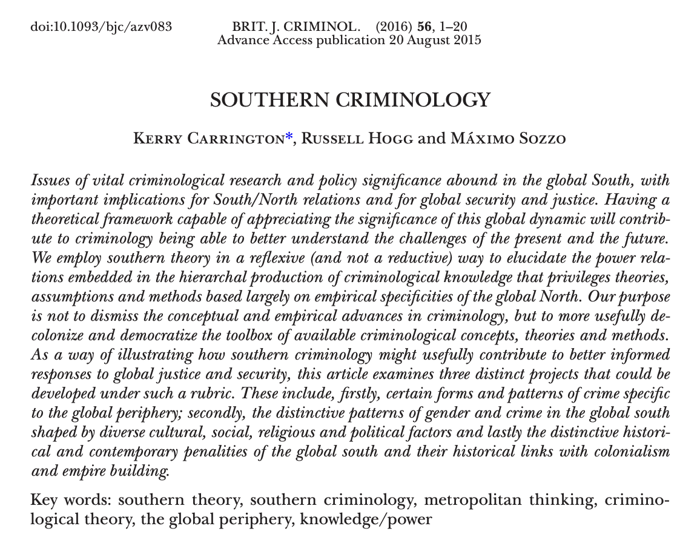

## El sistema global (y etnocéntrico) de producción del conocimiento

A lo largo de estas páginas hemos introducido las aportaciones de figuras consagradas de la disciplina: Edwin Sutherland y su formulación del delito de cuello blanco, Marcus Felson y el enfoque de las actividades rutinarias, David Garland y la cultura del control, o Terrie Moffitt y sus estudios sobre trayectorias delictivas. Si examináis su nacionalidad y filiación institucional, comprobaréis que prácticamente la totalidad escribió desde dos o tres países. Cuando se rastrea la autoría de los trabajos más citados de la disciplina durante el último cuarto de siglo, el resultado apunta invariablemente a ese mismo puñado de países angloparlantes [@Cohn_17]. La criminología que estáis aprendiendo como si valiese para cualquier lugar se fabricó, en su mayor parte, en un rincón bastante concreto del mundo: el mundo anglosajón del siglo XX. ¿Es esto una casualidad sin importancia, o nos dice algo sobre la criminología misma?

En esta sección del manual examinamos los sesgos que condicionan la mirada criminológica. Junto a la perspectiva de género (capítulo 11) y la construcción de la alteridad y lo foráneo (capítulo 12), abordamos aquí el **etnocentrismo**: la tendencia a extrapolar la experiencia histórica y social de una fracción privilegiada del planeta como si constituyera el patrón universal para comprender la criminalidad y el control penal en todos los países. Para analizar este fenómeno recurrimos al *análisis del sistema-mundo* de Immanuel Wallerstein (introducido en el capítulo 1) aplicado ahora a nuestra propia disciplina: ¿dónde (y, como veremos al cierre del capítulo, *cuándo*) se produce el conocimiento que asumimos como estándar universal?

Wallerstein [-@Wallerstein_04b] propuso considerar el sistema geopolítico de la modernidad no como un conjunto de países independientes que compiten, sino como una sola **economía-mundo** capitalista, con una división del trabajo repartida por el planeta. En esa división hay un **centro**, donde se concentran la innovación tecnológica, el capital financiero y las actividades de mayor valor añadido; una **periferia**, que aporta materias primas y trabajo barato; y una **semiperiferia** intermedia, que explota a la periferia mientras el centro la explota a ella. Más que tres grupos de países fijos, para Wallerstein son tres *posiciones* dentro de una misma estructura, y con el tiempo se puede subir o bajar entre ellas.

, [CC0](https://creativecommons.org/publicdomain/zero/1.0/), vía Wikimedia Commons.](images/world_system.svg){#fig-sistemas-mundo width="90%" fig-alt="Mapamundi con los países coloreados en tres categorías: centro, semiperiferia y periferia."}

Todo esto es economía política, pero Wallerstein [-@Wallerstein_04] no se detuvo en la economía. Él mismo aplicó su análisis del sistema-mundo hacia otro terreno, el de las estructuras del conocimiento, y ese es el que, para empezar, aquí nos interesa. Esa misma estructura no solo reparte mercancías, también reparte el conocimiento que se da por bueno. Hay sitios donde se produce la teoría y sitios donde se consume, centros que exportan categorías y periferias que las importan. Y cuando una teoría viaja del centro a la periferia no llega con la etiqueta de su procedencia, sino revestida de una pretendida validez universal.

Si además, en criminología, entendemos que una teoría no solamente te ofrece un marco para entender, sino también un marco para intervenir políticamente, podemos apreciar la relevancia de esta cuestión. No solamente estamos hablando del intercambio (unidireccional: del centro a la periferia) de conceptos científicos, sino también de la transferencia (también unidireccional) de concretas políticas públicas para intervenir frente al delito.

Los grandes paradigmas teóricos criminológicos se acuñaron leyendo sociedades muy determinadas, el sueño americano de la posguerra o el Chicago y el Londres de mediados del siglo XX. Desde esos epicentros metropolitanos se enseñan estas teorías en Sevilla, en Bogotá o en Manila como si describieran el delito sin más y fueran igual de útiles para entender lo que allí ocurre. La disciplina tiene su propio centro y su propia periferia: un núcleo angloparlante, sobre todo Estados Unidos y el Reino Unido, que escribe la teoría, y una periferia que la aplica, la traduce y, en el mejor de los casos, aporta el dato local que confirma lo que el centro ya daba por sabido.

![Tres obras que replantean desde dónde se produce el conocimiento social.[^cred-teoria-sur]](images/portadas-teoria-sur.png){#fig-teoria-sur width="90%" fig-alt="Cubiertas de The Uncertainties of Knowledge, de Wallerstein; Southern Theory, de Connell; y Postcolonial Thought and Social Theory, de Go."}

[^cred-teoria-sur]: Cubiertas reproducidas al amparo del derecho de cita (art. 32.1 LPI). 
Los derechos corresponden a Temple University Press, Routledge y Oxford University Press respectivamente.

El sociólogo Julian Go [-@Go_16] argumenta que la teoría social nació "en, de y en cierta medida para" el imperio moderno, y todavía arrastra esa herencia. En términos análogos, la sociologa australiana Raewyn Connell planteó en *Southern Theory* [@Connell_07] como las ciencias sociales se presentan como universales, pero hablan con el acento de una metrópoli que casi nunca se reconoce como tal. En criminología, ese mismo diagnóstico lo sostiene Rosemary Barberet [-@Barberet_14], apoyándose en la propia Connell y en Chandra Talpade Mohanty [@Mohanty_03]:

> "Buena parte de esta producción académica se genera en el mundo angloamericano y, de forma más general, en el Norte global, y tiende a concentrarse en análisis de alcance local o nacional." [@Barberet_14]

Con Mohanty, además, subraya subraya además que los constructos teóricos del Norte no solo se difunden, sino que se imponen normativamente, invisibilizando las epistemologías periféricas y las voces del Sur global.

Esta asimetría cuenta con un robusto respaldo empírico. Varios estudios han tratado de contabilizar y describir estas dinámicas, y el reparto de papeles que visualizan es muy claro. Un estudio sobre la autoría de casi medio millón de artículos de economía encontró que, en las diez revistas más prestigiosas, investigadores de Estados Unidos y los países ricos firman el 93 % de los mismos; Estados Unidos solo, que representa el 16 % de la economía mundial, produce el 65 % de esas investigaciones. Y cuando se comparan artículos de la misma calidad (medida por las citas que reciben) uno firmado únicamente por autores estadounidenses tiene un 15 % de probabilidad mayor de acabar siendo citado en una de esas revistas, frente a poco más del 1 % si lo firman investigadoras de países en desarrollo [@Aigner_21]. En la investigación sobre el propio desarrollo económico y social (*development studies*), la disciplina científica que estudia el desarrollo económico del Sur, observamos lo mismo. En las mejores revistas del área, tres de cada cuatro artículos los firman autores del Norte y apenas uno de cada seis, investigadores del Sur, sin que la cosa mejore con los años [@Amarante_22].

Y si nos centramos en la propia criminología, el retrato se repite. En las diez revistas que la disciplina tiene por "internacionales", Estados Unidos firma el 42% de los artículos y el Reino Unido el 22%; apenas tres de cada diez se escriben sin ninguna autora estadounidense o británica, y sus consejos editoriales son, en más de un 80%, de la anglosfera [@FaraldoCabana_21]. En el mayor congreso de criminología del mundo, el de la *American Society of Criminology*, más de tres cuartas partes de las ponencias estudian Estados Unidos y solo el 5,5% compara dos o más países [@Barberet_07]. Que el mayor congreso criminológico del mundo sea precisamente el de la Sociedad Americana de Criminología no es un accidente. Y el sesgo no está solo en qué temas se estudian; también en cómo se jerarquizan. Barberet [-@Barberet_07] mostró que a la investigación que no es estadounidense le tocan con más frecuencia los peores horarios del congreso y los "paneles-gueto", formados solo por trabajos "de fuera". El patrón reaparece al contar las revistas. Cuatro de cada cinco de las principales se editan en Estados Unidos o el Reino Unido, y solo uno de cada diez trabajos se firma en colaboración entre países [@GonzalezAlcaide_13][^colonial-1].

[^colonial-1]: Hay que leer estos datos con una cautela. Estos análisis no suelen incluir las revistas que no se publican en inglés (lo cual ya de hecho es revelador de la importancia que la disciplina les otorga), de modo que una parte del desnivel es un efecto del propio diseño del estudio. El trasfondo que refleja, con todo, no cambia.

Todo esto tiene sus evidentes efectos en el tipo de criminología que se hace fuera del centro, como señalaba en un capítulo que escribí hace ya años:

> "La poderosa seducción de las ideas generadas en el centro lleva a menudo a las investigadoras de la periferia a limitarse a comprobar si "se aplican a sus contextos nacionales", reduciendo así la aportación de la periferia a una especie de laboratorio de validez externa. La fuerza y la enorme difusión de las ideas teóricas y políticas de la criminología angloamericana obligan a quien investiga en la periferia a estar en guardia para no reconstruir de forma artificial sus propios contextos nacionales a imagen de esos productos de exportación" [@Medina_11, p. 19].

::: callout-note
**La ciencia de los universitarios raros.**

En 2010, tres psicólogos se preguntaron de dónde salían los sujetos de los grandes estudios sobre "la mente humana", y encontraron que la inmensa mayoría procedía de sociedades que nombraban con el acrónimo de **WEIRD** (raras): occidentales, educadas, industrializadas, ricas y democráticas, por sus siglas en inglés. El 68 % de los participantes era estadounidense y el 96 % procedía de países industrializados de Occidente, en su mayoría estudiantes de psicología de primero.

Y el problema no era solo la falta de variedad. Cuando por fin se comparó a esa gente con el resto del mundo, resultó ser de las **menos representativas** de la especie humana. En cosas tan básicas como la percepción visual (la ilusión óptica de Müller-Lyer engaña más a un occidental que a muchas otras poblaciones), la idea de justicia o la noción del yo, los WEIRD son la excepción, no la regla. Una ciencia levantada sobre los humanos más atípicos, presentada como la ciencia del ser humano sin más [@Henrich_10]. La criminología, que toma mucho prestado de la psicología, hereda este problema.
:::

## La investigación comparada y quién la dirige

El etnocentrismo en las ciencias sociales, esta forma de interpretar la realidad social que generaliza todo lo que sabemos desde un particular territorio, es problemático. Lo es no solo por el tipo de relaciones de jerarquía que encapsula, sino también por el retrato y relato que genera. Cualquier criminología nacional tiene un techo. Encerrada en un solo país, interpreta sus peculiaridades como leyes universales y no dispone de nada con que contrastarlas. Las criminologías nacionales acaban desarrollando visiones provincianas y "parroquiales" de nuestros objetos de estudio, demasiado ancladas en lo local.

Comparar promete romper ese techo, porque enseña que lo que en casa parecía natural (por ejemplo, la forma de contemplar un determinado delito, el peso que se le da a la cárcel, la forma de fiscalizar la labor policial), podría ser de otra manera. Buena parte del antídoto contra el etnocentrismo del que hablábamos pasa por ahí, por salir a ver cómo son y cómo se hacen las cosas en otros sitios. De ahí que haya habido sobre todo desde finales de la década de 1980 un bien intencionado interés en el desarrollo de una criminología comparada.

Ese impulso cuajó, desde los años ochenta, en toda una maquinaria de investigación comparada. Dos macroencuestas se convirtieron durante ese periodo en ejemplos de la investigación comparada en criminología. La **Encuesta Internacional de Víctimas del Delito (ICVS)** preguntó por las mismas experiencias de victimación en decenas de países para poder comparar los niveles de delincuencia. Mientras que el **Estudio Internacional de Delincuencia Autoinformada (ISRD)** hizo algo parecido con los delitos que reconoce haber hecho el alumnado de secundaria.

Estas grandes encuestas prestaron, y en el caso del ISRD sigue prestando, un servicio real. Generaron datos donde los Estados no se molestaban en producirlos (como en el caso español) y abrieron a investigadoras de la periferia y la semi-periferia una vía para entrar en redes internacionales y ganar visibilidad. Sirvieron para dinamizar la investigación nacional en varios países.

::: callout-note
**Dos encuestas para situarse.**

La **Encuesta Internacional de Víctimas del Delito** (ICVS, por sus siglas en inglés) arrancó en 1989 y, en sucesivas oleadas coordinadas en parte desde institutos de Naciones Unidas, ha preguntado a la población de decenas de países si ha sufrido robos o agresiones, al margen de que los denunciara. La encuesta no tuvo una fecha de cancelación formal, pero su infraestructura global dejó de operar de manera efectiva tras la realización de su sexta ronda en 2010. El proyecto se volvió insostenible debido a la falta de financiación coordinada y al desplazamiento de prioridades hacia encuestas nacionales y marcos estadísticos de organismos como Eurostat. A este desgaste institucional se sumó un factor humano clave: la jubilación y el paulatino retiro de sus principales impulsores académicos, de forma muy destacada el criminólogo neerlandés Jan van Dijk. Al tratarse de un consorcio dependiente del capital social, la diplomacia académica y el liderazgo personal de sus fundadores para captar fondos, la salida de esta primera generación dejó al proyecto sin el motor organizativo necesario para coordinar un esfuerzo de escala global.

El **Estudio Internacional de Delincuencia Autoinformada** (ISRD) hace algo equivalente con la delincuencia juvenil, preguntando directamente en las aulas. Su utilidad es doble. Permiten comparar sin depender de las estadísticas policiales, que cada país desarrolla a su manera, y sacan a la luz la cifra negra, el delito que nunca llegó a denunciarse. En España el grupo liderado por una de las pioneras de nuestra disciplina, la profesora Cristina Rechea (que da nombre a uno de los premios más distinguidos de la Sociedad Española de Investigación Criminológica) formó parte de la red que trajo a nuestro país esta encuesta. A diferencia del ICVS, el ISRD ha logrado sobrevivir gracias a un modelo metodológico mucho más económico y sostenible basado en encuestas en aulas escolares en lugar de costosos muestreos a población general, a una gobernanza colegiada que garantizó el relevo generacional de sus líderes académicos (encabezados originalmente por Josine Junger-Tas) y a su capacidad para adaptar sus contenidos a las problemáticas actuales, como el ciberacoso y los delitos digitales.
:::

El problema es que la investigación comparada lejos de corregir las asimetrías en la producción del saber científico sirven a menudo para consolidarlas o reproducirlas de otra manera. Las infraestructuras colaborativas a menudo se diseñan, se coordinan y (a veces) se pagan en un puñado de sitios, casi siempre en el centro. El cuestionario se redacta allí, la pregunta de investigación generalmente se decide allí, y la periferia entra en una fase más tardía, la del trabajo de campo. ¿Permiten estas colaboraciones que en la periferia se desarrollen ideas propias, o tratan a quienes colaboran como gestores de campo de un proyecto intelectual ajeno? ¿Comparan de verdad preguntas transnacionales, o exportan una forma concreta, la angloamericana, de pensar el delito? [@Medina_11].

Este no es un problema exclusivo de la criminología. En la cooperación científica entre el Norte Global y el Sur Global esta situación lleva décadas documentada bajo la etiqueta de las "colaboraciones entre socios desiguales": el Norte se reserva la concepción del proyecto y la publicación de los resultados, y al Sur le toca la ejecución y la recogida de datos sobre el terreno [@Gaillard_94; @Carbonnier_14]. En las ciencias naturales a esto se le da un nombre aún más gráfico, el *helicopter research* o ciencia paracaidista: la investigadora del Norte "aterriza" en el Sur, recoge muestras o datos y "despega" para publicarlos, dejando a los colaboradores locales como guías logísticos y, muchas veces, fuera de la autoría [@Haelewaters_21]. Nos encontramos con una lógica extractivista.

Hay además un sesgo en a quién se estudia. Las colaboraciones han mirado sobre todo a la semiperiferia europea y a otros países de habla inglesa, donde la criminología ya tenía la casa montada, y mucho menos a la periferia poscolonial. Allí donde lo hacen la lógica extractivista está problamente incluso más acentuada. África sigue siendo un continente casi invisible para la criminología del Atlántico Norte. No deja de ser revelador que buena parte de lo que sabemos sobre el delito, la policía y el castigo en África lo hayan escrito antropólogos e historiadores, no criminólogos: la corrupción cotidiana en Nigeria o el Sahel [@Smith_07; @Blundo_06], las economías ilícitas de la cuenca del Chad [@Roitman_05], las bandas de los Cape Flats, los excombatientes de Freetown o los Mungiki de Nairobi [@Hazen_14], el trabajo policial en Ghana [@Beek_16], el crimen como categoría de orden y soberanía en Sudáfrica [@Comaroff_06; @Comaroff_16], la historia de las cárceles coloniales [@Bernault_03], la piratería somalí releída como "economía de la protección" [@Dua_19] o la criminalización del trabajo sexual [@Mgbako_16]. Donde la criminología del Atlántico Norte no ha llegado, otras disciplinas, como la antropología, han desarrollado etnografías sobre el terreno.

{#fig-loquesea width="100%" fig-alt="Logo de UNICRI"}

Detrás de buena parte de algunos esfuerzos colaborativos en el ámbito criminológico están a menudo las organizaciones internacionales. Naciones Unidas y sus agencias, la Organización Mundial de la Salud, el Banco Mundial o la OCDE financian, coordinan y publican investigación comparada, y al hacerlo no solo miden. También deciden qué merece medirse y qué se nombra como problema global.

La profesora Rosemary Barberet, que ha trabajado ese terreno desde dentro como observadora en Naciones Unidas, lo ha mostrado con la violencia contra las mujeres [@Barberet_14]️.Como esta autora ha documentado que hoy exista todo un aparato internacional de indicadores sobre esa violencia no es un dato puramente técnico y neutro, sino el poso de décadas de trabajo político de los movimientos de mujeres y de sus encuentros (y desencuentros) con esas organizaciones. Y como ella misma también documenta quien controla la categoría que se mide, qué cuenta como violencia y cómo se cuenta, controla buena parte de lo que después se podrá comparar y el relato que se pueda generar a partir de esta infraestructura informacional compartida.

::: callout-note
**Agencias internacionales e investigación comparada**

A nivel institucional, diversas organizaciones multilaterales han logrado sostener redes de investigación criminológica internacional financiando iniciativas estructuradas a largo plazo. Destacan las alianzas entre la Oficina de las Naciones Unidas contra la Droga y el Delito (UNODC) e instituciones nacionales (como el Centro de Excelencia UNODC-INEGI en México, enfocado en estandarizar encuestas de victimización en América Latina) y los estudios globales de la Organización Mundial de la Salud (OMS) y UNICEF sobre la prevención de la violencia juvenil y de género. De la misma forma, organismos como el Banco Interamericano de Desarrollo (BID) y la Agencia de los Derechos Fundamentales de la Unión Europea (FRA) financian activamente consorcios científicos para evaluar intervenciones policiales, delitos de odio y el impacto económico del crimen.
:::

Queda una pregunta quizás más dificil de responder y que depende de la posicion epistemiologica de cada investigador (del polo más "positivista" al más relativista). ¿Se puede comparar de forma válida? El británico David Nelken [-@Nelken_10] ha insistido en que cotejar sistemas de justicia penal se parece más a traducir que a medir. Entender por qué en los Países Bajos se toleran conductas que en otro país se persiguen nos obliga a insertarnos en los marcos cognitivos, sociales e históricos que determinan toda una cultura jurídica, y hay, por otro lado, términos que sencillamente no viajan bien [@Nelken_10]. Cuando el ICVS pregunta lo mismo en ochenta países, no está nada claro que "sentirse seguro al caminar de noche" quiera decir lo mismo en Tokio, en San Salvador o en Estocolmo. La estandarización que hace posible la comparación es también lo que amenaza con vaciarla de contenido.

Pero al margen de estas cuestiones epistemológicas, la pregunta sobre quien compara no han abandonado la disciplina. Dentro de la disciplina continúan los esfuerzos por parte de investigadores de realizar estudios comparados. Y eso nos obliga a seguir reflexionando sobre como desarrollamos estas comparaciones. 

Maureen Cain [@Cain_00] es una de las voces que insistió en derivar la pregunta hacia el poder. Donde Nelken se pregunta si es posible comparar, Cain se pregunta quién compara a quién, y con qué criterios. La criminología occidental, escribió, cae en dos vicios de sentido contrario. Unas veces exotiza al otro (**orientalismo**) y otras, con más frecuencia, hace lo opuesto, niega que la diferencia sea real y trata cualquier apartamiento de la norma occidental como un déficit que corregir. A esto último lo llamo **occidentalismo**. En lugar de verificar si las teorías del Norte "encajan" fuera, propone una globalización interactiva, en la que sociedades distintas aprenden unas de otras sin que una dicte a las demás. No se trata de renunciar a comparar, sino de cambiar quién dirige la comparación y con qué ánimo.

::: callout-note
**Cómo se descentra una investigación, en la práctica.**

Denunciar y documentar el etnocentrismo es relativamente fácil; investigar de otra manera cuesta más. La propia Barberet [-@Barberet_14], en su libro, propone medidas concretas y nada grandilocuentes:

- Dar prioridad a las investigadoras autóctonas de la región que se estudia, en vez de leer solo lo que el norte escribe sobre ella.

- No organizar encuentros de científicos en lugares exóticos que permitan una especie de turismo académico, sin realmente contar con aportaciones locales que verdaderamente sumen al debate.

- Leer en más de un idioma, y no únicamente en inglés.

- Y tomarse en serio las fuentes que la academia suele descartar, como los informes de las oenegés locales, las misiones de constatación de organismos internacionales o las biografías de mujeres del sur.

Desde las ciencias naturales, Haelewaters y sus colegas [-@Haelewaters_21] llegan al mismo sitio con diez reglas contra el *helicopter research*. La más evidente pide incluir a las investigadoras locales como coautoras, no como un agradecimiento en una nota al pie, y tratar la creación de capacidades como una vía de doble sentido y no como una forma de caridad.

Estos principios han cuajado incluso en códigos formales, como el *TRUST Code* contra el *ethics dumping* (la exportación al sur de prácticas de investigación que en el Norte no se tolerarían por razones éticas [@TRUST_18], cómo ha sido, por ejemplo, habitual en la investigación farmacológica), aunque ninguna guía es infalible. La colaboración nunca es neutra, y aplicar los códigos y estándares como una casilla que marcar, sin reflexión crítica, puede acabar reforzando la idea de que existe una única forma correcta de investigar [@Perry_22]. Vengan de la criminología, de la ecología o de un código de conducta, todas estas reflexiones apuntan a la necesidad de cambiar de quién se aprende [@Barberet_14].
:::

## La criminología del sur como respuesta

Si el mapa del saber tiene un centro y una periferia, alguien tenía que decirlo desde abajo. En eso básicamente consiste la **Criminología del Sur**. No es una teoría nueva sobre por qué se delinque, sino un proyecto para democratizar la producción del conocimiento criminológico y discutir quién tiene derecho a teorizar y quién queda relegado a poner los casos [@Carrington_18].

El nombre puede despistar un poco, porque no habla tanto de un Sur puramente geográfico como de una posición, la de quien está fuera del centro que dicta. Australia, desde donde escriben varias de sus impulsoras, no es precisamente pobre, pero sí es periferia epistémica del eje Estados Unidos–Reino Unido. Al margen de estas autoras australianas claramente influenciadas por el trabajo de Connell tambien se han sumado a esta perspectiva numerosos autores latinoamericanos.

{#fig-loquesea width="100%"}

La denuncia encaja con todo lo que hemos discutido hasta ahora. En la división internacional del trabajo criminológico, al Sur Global se le reserva el papel de **mina de datos**. Aporta realidades llamativas, desde la violencia extrema hasta las cárceles desbordadas, que el Norte estudia y convierte en teoría. El dato viene del Sur y la teoría se firma en el Norte. Wallerstein explicaba *por qué* pasa eso en la economía, y la Criminología del Sur lo constata dentro de nuestra disciplina.

En los últimos años ese programa ha empezado a desarrollar una agenda propia, con trabajos que estudian el delito y la gobernanza en el Sur Global [@Watson_25]. Carrington, Hogg y Sozzo [-@Carrington_16]️ formulan la agenda de esta iniciativa en los siguientes términos:

> "Al proponer el argumento a favor de una Criminología del Sur no es nuestro propósito incrementar el creciente catálogo de nuevas criminologías. En lugar de fragmentar aún más el campo, vemos a la Criminología del Sur como un proyecto teórico, empírico y político animado por superar las divisiones globales y democratizar la epistemología, al nivelar los desbalances de poder que privilegian los saberes producidos en los centros metropolitanos del Norte Global, particularmente aquellos ubicados en el mundo anglo-parlante."

¿Ha calado este mensaje formulado desde el Sur? El centro, cómo no, tiene su propia versión de esta historia, y vale la pena escucharla. En el *Oxford Handbook of Criminology*, probablemente uno de los manuales de referencia de la disciplina, Manuel Eisner firmó en 2023 una síntesis de la criminología comparada que incluso reconoce el sesgo. Cita a Jianhong Liu [@Liu_18]️ cuando afirma que la criminología comparada es "en buena medida una empresa occidental" y admite que la comparación arrastra un gradiente centro-periferia. Y aun así, su conclusión es aparentemente tranquilizadora [@Eisner_23]:

> "Los tiempos en que la criminología se hacía casi por completo en sociedades occidentales acomodadas están tocando a su fin. \[...\] La criminología empieza a ser menos etnocéntrica, más internacional y diversa, y global."

Suena bien. El problema es quién lo dice y desde dónde. El anuncio del fin del etnocentrismo lo firma un catedrático de Cambridge, en un manual de Oxford, en inglés, apoyado en bases de datos de agencias con sede en Viena y Ginebra. El mapa se sigue dibujando desde el mismo rincón. Y los silencios son elocuentes. Un capítulo de 2023 sobre criminología "global" no menciona ni una vez a Connell ni a Agozino (al que veremos más adelante), y cita a la Criminología del Sur de pasada, casi como una cortesía. Cuando llega la teoría discutida en el capítulo, toda la teoría que se discute es la que procede del Norte.

El Sur, en cambio, reaparece donde el reparto lo ha colocado siempre, como proveedor de datos y como laboratorio, el lugar donde los indicadores de delito salen "más altos" y donde se van a probar las teorías del Norte o los factores de riesgo pensados en otra parte. Hasta el instrumento delata la posición. Eisner da por sentado que el homicidio es el único delito que se mide de forma fiable para comparar (lo cual tiene cierta base), pero con el uso de ese indicador desaparecen del mapa la violencia del Estado, el daño ambiental o el delito de los poderosos. Se cuenta el delito de unos y no el de otros. Y cuando dos antiguas colonias británicas como Singapur y Jamaica divergen en sus niveles de violencia, concluye que el pasado colonial "difícilmente" lo explica, justo el hilo que la Criminología del Sur y las miradas decoloniales se niegan a soltar. No es mala fe ni torpeza. Es la disciplina mirándose al ombligo y sin poder salir de un determinado marco de hacer las cosas. Por eso Eisner, que se proponía certificar el final del etnocentrismo, acaba siendo su mejor ilustración.

Frente a estos problemas, la Criminología del Sur pretende ser un corrector al sesgo que vemos expuesto en la criminología tradicional. No desecha la criminología tradicional, sino que busca democratizarla, enriquecerla y corregir sus sesgos. En este sentido, propone utilizar metodologías comparadas para dar visibilidad a fenómenos del Sur Global que el Norte ignora o distorsiona (ej. violencia ecocida en la Amazonía, milicias parapoliciales, violencia extractivista o dinámicas de género en contextos no occidentales).

, [CC BY 2.0](https://creativecommons.org/licenses/by/2.0), vía [Wikimedia Commons](https://commons.wikimedia.org/wiki/File:Antiimperialismo_caracas.jpg).](images/caracas.jpg){#fig-antiimperialismo width="100%" fig-alt="Mural callejero en Caracas con la consigna 'Fuera el imperialismo'."}

Tampoco la Criminología del Sur se libra de la crítica, y parte de ella se formula desde dentro. Leon Moosavi le ha hecho una "crítica amistosa". Al hablar de "el Sur" en singular corre el riesgo de esencializarlo, de tratar como un bloque homogéneo lo que son realidades muy distintas, el mismo reduccionismo que reprocha al Norte. Y hay una ironía difícil de esquivar. El propio proyecto se dirige en buena parte desde el Norte y en inglés. Cuando Moosavi contó quién publica en esta corriente, encontró más autoras radicadas en Estados Unidos y el Reino Unido que en toda América Latina, África, Oriente Medio, Asia y el Caribe juntos [@Moosavi_19].[^colonial-2]

[^colonial-2]: La crítica más radical viene de la criminología indígena. El criminólogo maorí Juan Tauri [-@Tauri_25] rechaza incluso el propio proyecto de "descolonizar la criminología". Para él es una disciplina nacida al servicio del Estado colono que no puede reformarse desde dentro, y la moda descolonizadora funciona como cooptación académica, "la versión criminológica de la estrategia de abalorios y mantas del viejo proyecto colonial". Su respuesta no es arreglar la disciplina, sino el *refusal*, dirigir la energía indígena hacia las propias comunidades.

Mirar desde el sur, como se propone desde esta perspectiva, está muy bien, pero ¿basta con cambiar de sitio si seguimos pensando con las herramientas del centro? Hay quien responde que no, que no basta con ampliar la nómina de autoras, y que hay que descolonizar de raíz las propias categorías que se emplean en nuestra disciplina. Ese es el debate, vivo y a ratos áspero, entre la Criminología del Sur y el giro decolonial.[^colonial-3]

[^colonial-3]: Quien quiera asomarse a esa discusión tal como se dio, con su temperatura y todo, tiene un buen punto de entrada en el texto *In defence of decolonisation: a response to southern criminology*, publicado en el blog de la Sociedad Británica de Criminología en 2021.

## La teoría postcolonial y el giro decolonial: descolonizar las categorías

### ¿Que son las perspectivas postcoloniales?

Todo lo que llevamos visto (el reparto desigual del saber, la Criminología del Sur) forma parte de una conversación más amplia que en las humanidades y en la sociología ha llegado más lejos que en la criminología, donde estas ideas siguen siendo consideradas marginales. Asomarse a ella ayuda a entender de dónde vienen las perspectivas postcoloniales.

La sociología clásica nació en la Europa del siglo XIX para entender lo que le estaba pasando a la propia Europa (la industrialización, el éxodo a las ciudades, el consiguiente desarrollo de nuevas formas de moralidad, el ascenso del Estado-nación, los conflictos sociales ligados a estos procesos). Durkheim, Weber, Marx y los demás fundadores pensaron esas transformaciones desde dentro y con vocación de ciencia general. Al constituirse a partir de la experiencia de las metrópolis en un sistema colonial, las corrientes dominantes de la teoría social asumieron implícitamente la trayectoria europea como el modelo universal e inevitable de la modernización.

.](images/berlin.jpg){#fig-berlin width="100%" fig-alt="Caricatura de 1885: Bismarck corta un pastel que representa África ante los representantes de las potencias europeas."}

La teoría postcolonial le da la vuelta a ese supuesto. Sostiene que las sociedades modernas no se entienden mirando solo hacia dentro, porque la modernidad occidental se construyó a la vez que el imperio, la trata de esclavos y la extracción colonial, y en buena medida gracias a ellos. El economista Thomas Piketty [-@Piketty_19], entre otros, ha mostrado como la prosperidad de Occidente se nutrió precisamente de la explotación económica del Sur Global. 

El sociólogo británico Paul Gilroy [@Gilroy_93] ha argumentado que la violencia colonial, la trata transatlántica y la esclavitud, pensadas por la Ilustración o la modernidad, como excepciones bárbaras o restos arcaicos que la civilización acabaría superando, constituyen en cambio la matriz estructural y fundacional sobre la que se construyó la propia modernidad. En ese sentido, para Gilroy la plantación esclavista y el barco negrero no estaban fuera de la modernidad capitalista, sino que fueron sus primeros laboratorios de organización industrial, disciplina laboral y cálculo económico. Gilroy mantiene que la idea occidental de libertad, derechos y sujeto universal se formuló al mismo tiempo y gracias a la exclusión sistemática y la cosificación de los cuerpos racializados. Finalmente, Gilroy considera que la violencia colonial del pasado no es un capítulo cerrado; sus lógicas de clasificación humana y control siguen operando en el racismo institucional, el sistema penal contemporáneo y las políticas fronterizas de las antiguas metrópolis.

El siglo XIX no fue solamente el siglo de la industrialización, sino también el siglo del imperialismo colonial. Pretender entender lo que pasaba en Europa o en Estados Unidos sin entender cómo lo que pasaba allí era resultado de la explotación del Sur global es un absurdo. Es lo que se ha llamado por la literatura especializada como **historias conectadas** [@Bhambra_14]: la riqueza y el orden del centro y la pobreza y el desorden de la periferia no son dos relatos separados, son el mismo contado desde los dos lados. No se puede entender uno sin el otro. El desarrollo de las metrópolis y el subdesarrollo de las periferias son conceptualizados no como procesos autónomos, sino como fenómenos co-constitutivos dentro del sistema-mundo.

 y [Paper Jewels](https://www.paperjewels.org/postcard/dandy).](images/dandy.jpg){#fig-dandy width="100%" fig-alt="Postal en blanco y negro: una mujer europea sentada en una hamaca de lona sujeta a un bastidor, llevada a hombros por porteadores indios."}

Esa cara oculta de la modernidad (el imperio, la esclavitud, la colonia) la sacó a la luz el pensamiento poscolonial. Edward Said, en *Orientalismo* [@Said_78], mostró cómo Occidente inventó "el Oriente" como un otro atrasado y peligroso, y cómo ese retrato servía para legitimar el dominio sobre él. Gayatri Spivak [@Spivak_88] se preguntó si el **subalterno** (los grupos colonizados que quedan fuera de los canales desde los que se habla con autoridad) puede siquiera hacerse oír, o si siempre acaba hablando alguien en su nombre. Y mucho antes que ambos, W. E. B. Du Bois [-@DuBois_03] ya había escrito que "el problema del siglo XX es el problema de la línea divisoria del color", una frontera racial que no separaba solo a blancas y negras en Estados Unidos, sino a colonizadores y colonizados en todo el planeta.

::: {.callout-note appearance="simple"}
**Tres olas del pensamiento poscolonial.**

El sociólogo Julian Go [-@Go_16] ordena esta corriente en tres momentos. La primera es **militante y anticolonial**, la de las luchas por la independencia, con figuras como Frantz Fanon, Aimé Césaire, W. E. B. Du Bois, Amílcar Cabral o C. L. R. James. La segunda es la de los **"estudios poscoloniales"** de las humanidades, más atenta al discurso y la representación, con Edward Said, Gayatri Spivak, Homi Bhabha o Dipesh Chakrabarty. La tercera, la que Go reclama, ya no se conforma con criticar el sesgo imperial de la teoría social, sino que aspira a rehacer sus herramientas, una **ciencia social poscolonial** que piense desde la posición de los dominados y no solo sobre ellos. Buena parte de este capítulo, cuando la criminología del sur y el giro decolonial no solo denuncian sino que intentan reconstruir la disciplina, se mueve en esa tercera ola.
:::

Todo esto llega a la criminología de la mano de autores como Chris Cunneen [@Cunneen_11] o Bikp Agozino [@Agozino_03], de los primeros en traer estas preguntas a la disciplina. El punto de partida de estos autores es que la colonización no es un episodio cerrado del pasado, sino un proceso que sigue operando, tanto en las antiguas metrópolis como en quienes fueron colonizados.[^colonial-4]

[^colonial-4]: Alguien ya le ha hecho a la criminología la pregunta de Spivak. La criminóloga chilena Amalia Valdés-Riesco [-@ValdesRiesco_21] se preguntó si el subalterno puede hablar en criminología, y lo midió con datos. En la investigación sobre los crímenes de los poderosos, el 86% de las autoras y el 76% de los estudios salen del Norte anglófono, y América Latina, pese a su rica tradición decolonial, apenas aparece; cuando lo hace, es citando sobre todo a autores del propio Norte. La respuesta, de momento, se parece bastante a un no.

La perspectiva postcolonial trae al debate criminológico dos cuestiones, que son las que veremos a continuación:

- Una es epistémica y tiene que ver con quién produce la teoría y con qué categorías. Está relacionado con lo que ya hemos visto en secciones anteriores pero le otorga una funcionalidad y un marco interpretativo particular. El colonialismo no se limitó a la ocupación territorial ni a la subordinación económica; involucró la imposición de un marco cognoscitivo que jerarquizó las formas de producción de conocimiento. En este contexto, las categorías conceptuales producidas en el Norte Global fueron elevadas a la categoría de ciencia universal, mientras que los saberes y estructuras normativas de las poblaciones colonizadas fueron subalternizados bajo las etiquetas de "tradición" o "irracionalidad". Y el llamado **giro decolonial** tiene mucho que ver con esta cuestión como veremos enseguida a continuación.

- La otra es material y tiene que ver con el propio poder penal, su configuración y su difusión internacional: con la sospecha de que la criminología no se pensó solo sobre los colonizados, sino en buena parte para administrarlos y controlarlos. Esa segunda cara es la que impide tratar todo esto como un debate meramente académico, porque en ella están en juego las estructuras de control penal. A esta segunda cuestion volveremos un poco más adelante.

### La criminología postcolonial y el giro decolonial

Empecemos por la primera cuestion, la del saber. Aquí las perspectivas postcoloniales van un paso más allá de lo que vimos con la Criminología del Sur. Aunque la Criminología del Sur y la Criminología Postcolonial (o decolonial) comparten un objetivo común (criticar la hegemonía del Norte Global (EE. UU., Reino Unido y Europa Central) sobre la definición del delito y la justicia), se diferencian, sustancialmente en su origen, enfoque teórico, metodología y radicalidad de propuesta.

Eleni Dimou [-@Dimou_21] lo ha formulado con precisión desde la propia criminología. La Criminología del Sur, dice, ve el colonialismo pero es ciega a la colonialidad (más adelante explicamos la diferencia), y por eso corre el riesgo de cambiar el contenido de la conversación sin cambiar sus términos. Denuncia el reparto desigual del saber, pero sigue pensando con las mismas categorías modernas y coloniales que el giro decolonial quiere desmontar.

.](images/slavery_2.jpg){#fig-trata width="100%" fig-alt="Grabado de finales del siglo XVIII sobre la captura y venta de personas esclavizadas."}

El criminólogo Biko Agozino [@Agozino_03] sostiene que la criminología no solo se hizo *en* el norte, sino en buena parte *para* el imperio. Habría nacido como un saber útil para administrar y controlar a las poblaciones colonizadas, y esa pecado original seguiría marcándola. 

Incluso si uno no comparte todo este marco interpretativo el mismo nos obliga a preguntarnos si el sesgo geográfico de la disciplina es un accidente que se corrige sumando autoras de otros sitios o algo más profundo. Para la criminologia postcolonial, la criminología tradicional nació como una herramienta conceptual de dominación imperial para controlar y clasificar a los pueblos colonizados y es esencial asumir este punto de partida, sobre todo, porque como plantea Gilroy [@Gilroy_93] nos ayuda a entender la forma en que se trata a las personas procedentes de las antiguas colonias hoy.

.](images/slavery_1840.jpg){#fig-almanac width="100%" fig-alt="..."}

Siendo esto así, ¿basta con mirar desde el Sur si se sigue pensando con las herramientas del centro? El **giro decolonial** responde que no. Desde esta perspectiva se sostiene que las categorías con las que pensamos el mundo juegan un papel en el surgimiento y mantenimiento de relaciones coloniales. Esta perspectiva cuestiona cómo las categorías morales y legales ("delincuente", "salvaje", "primitivo") se crearon para justificar el despojo de tierras y el control social.

Lo podéis ver mejor con un ejemplo. Pensad en una categoría que damos por puramente descriptiva, la de "droga". Parece que nombra una propiedad de ciertas sustancias, algo que un químico podría medir en el laboratorio. El alcohol y el tabaco tienen propiedades farmacológicas potentísimas (alteran el cerebro, generan dependencia, matan cada año a muchísima gente) y, sin embargo, no los llamamos "drogas": se venden en el supermercado. Otras sustancias, a veces con propiedades farmacológicas menos dañinas, sí son "droga", y llevarlas encima es delito. Si la línea que separa unas de otras no la traza la química, ¿quién la establece? Toby Seddon [-@Seddon_10], entre otros, ha mostrado que la traza la ley, y que lo hace en un momento concreto y por unos motivos concretos. 

Hasta bien entrado el siglo XIX, el opio y sus derivados eran medicinas corrientes: se vendían sin receta, en jarabes y tónicos, en las farmacias de Londres o de Madrid. La categoría moderna de "droga" (esa clase aparte de sustancias peligrosas que hay que prohibir) sencillamente no existía. Se inventó hacia 1900, con el régimen prohibicionista, y no nació en un laboratorio, sino en la geopolítica del imperio: al calor de las Guerras del Opio, en las que Gran Bretaña impuso por la fuerza a China el opio que producía en su colonia india, y de las primeras conferencias internacionales sobre la materia (Shanghái, 1909; La Haya, 1912), que trazaron el primer sistema global de control respondiendo tanto a pánicos morales como a los intereses comerciales y diplomáticos de las potencias.

.](images/opium.jpg){#fig-opio width="100%" fig-alt="Grabado de un almacén con hileras de trabajadores pesando bolas de opio bajo la supervisión de europeos."}

Es decir, igual que "delincuente", "droga" como concepto es menos un hecho del mundo que un instrumento para clasificar y controlar. Llamar "droga" a una sustancia no describe lo que esa sustancia es, sino lo que hemos decidido hacer con quienes la usan. Y como toda esa maquinaria nació pegada al proyecto imperial, es un ejemplo claro de lo que venimos diciendo: una categoría que se nos presenta como "natural" o "universal" y que conviene mirar con sospecha, porque arrastra la historia de poder que la fabricó.

El concepto central del giro decolonial lo aportó el sociólogo peruano Aníbal Quijano: la **colonialidad del poder** [@Quijano_00]. Quijano argumenta que el colonialismo como administración política terminó (las colonias se independizaron), pero la *colonialidad* no. Esta quedó como un patrón de poder que sigue organizando el mundo. Su pieza clave es la **raza**, que para Quijano no es un dato biológico anterior a la conquista, sino un invento de la conquista misma y consiste en la clasificación de la humanidad en superiores e inferiores, que sirvió para repartir quién manda, quién trabaja y quién sabe. Distinguir el *colonialismo* (como estructura político social que acabó) de **colonialidad** (que continúa) es una de sus aportaciones claves.

::: callout-note
**Colonialidad del género.**

Si la colonialidad clasificó a la humanidad por raza, también lo hizo por género. La filósofa María Lugones [-@Lugones_07]️ sostiene que el sistema de género binario y jerárquico que damos por natural fue en buena parte impuesto por la colonización, que arrasó otras formas de organizar los sexos. Rita Segato [-@Segato_16] lo lleva al terreno de la violencia contra las mujeres en contextos coloniales y poscoloniales.
:::

Si la raza organizó también quién produce conocimiento legítimo, entonces no hay un saber "desde ningún lugar", todo conocer se hace desde una posición. A eso lo llama Walter Mignolo la **geopolítica del conocimiento** [@Mignolo_11]. Lo que el centro presenta como universal y neutro es, visto así, un saber local que ha conseguido hacerse pasar por global. Y la salida que proponen los decoloniales no es otra teoría más completa, sino la *desobediencia epistémica*, pensar desde las genealogías que la modernidad europea silenció, en lugar de pedirles permiso a las suyas. Desde esta perspectiva se busca rescatar saberes locales, indígenas o subalternos de justicia (restaurativa, comunitaria) y rechaza la criminología eurocéntrica como un saber colonial.

Entre la Criminología del Sur y este giro decolonial, más filosófico, hay quien ha intentado tender un puente. Boaventura de Sousa Santos y sus **epistemologías del sur** [@Santos_14] proponen tomarse en serio los saberes que la ciencia moderna descartó como no-conocimiento (los del campesinado, los pueblos indígenas, las tradiciones no occidentales) sin renunciar por ello al rigor que pueden ofrecer las herramientas desarrolladas en el Norte. Es un buen sitio para situarse si las dos posturas anteriores os parecen, una demasiado tímida y la otra demasiado abstracta.

¿Y qué tiene que ver todo esto con el delito y el castigo? Cada vez más. Hay un esfuerzo reciente y explícito por llevar estas preguntas a lo que podríamos llamar la *cuestión criminal*: repensar de raíz nociones tan básicas como delito, víctima, orden o pena a la luz de su herencia colonial [@Aliverti_23]. No hay consenso, y está bien que no lo haya. La Criminología del Sur dice: democraticemos, traigamos al sur a la conversación. El giro decolonial contesta: eso es necesario, pero insuficiente, porque las palabras mismas de la conversación son coloniales. Podéis quedaros con una postura, con la otra, o con la tensión entre ambas.

Lo relevante es considerar qué añade en concreto esta mirada a nuestra disciplina. Barberet [-@Barberet_14] lo resume bien. Una lente postcolonial obliga a incorporar ejes que la criminología nacional suele pasar por alto, como la nacionalidad y el estatus migratorio o de refugiada, el peso del colonialismo y del racismo global en el funcionamiento y práctica de las instituciones actuales, o las voces de los pueblos indígenas y de las ciudadanas del Sur. También nos obliga a estudiar la genealogia histórica de los conceptos de la disciplina y de la práctica penal. Y hace algo más de fondo. Ensancha la propia definición de delito, que deja de agotarse en el código penal para abarcar las violaciones de derechos humanos, los crímenes de guerra y el daño social como ya vimos en el capítulo 6, por ejemplo, al abordar el concepto del crimen de Estado.

Ahora bien, la propia Barberet [-@Barberet_14] pone un límite que compartimos. Respaldar la crítica al etnocentrismo no obliga a caer en el relativismo que lo excusa todo. Por ejemplo, prácticas que dañan a las mujeres, como la mutilación genital femenina o el matrimonio infantil, no quedan justificadas por apelar a la "tradición" o a la "cultura local". Se trata de armonizar el respeto a las realidades postcoloniales con la defensa de unos derechos humanos que también valen para ellas. Es la otra cara de las dos trampas que señalaba Nelken. Tan tramposo es el etnocentrismo que mide a los demás con la vara propia como el relativismo que renuncia a toda vara.

### El poder penal también tiene su centro y periferia

Llevamos ya un buen rato hablando de teoría sobre la teoría (metateoría) y de epistemiología, pero la perspectiva postcolonial también nos obliga a cuestionar la historia geopolítica de las estructuras de control penal. Hasta aquí hemos puesto el acento en el reparto desigual del *saber* criminológico. Falta la otra mitad que tambien subraya la criminología postcolonial, la del *poder* penal. Porque la criminología no es solo la ciencia del delito, también lo es del control penal, y ese se reparte por el mundo con la misma geografía desigual que la teoría.

.](images/brazil_punishment.jpg){#fig-rugendas width="100%" fig-alt="..."}

Varios autores han señalado como no podemos entender el origen de las actuales instituciones de control penal, sin entender el pasado colonial. Mike Brogden [-@Brogden_87] mostró hace décadas que la propia institución policial tiene pedigrí colonial. El modelo que Inglaterra exportó por su imperio no era el del *bobby* amable del relato oficial, sino el de una policía centralizada y militarizada, pensada para controlar poblaciones colonizadas y ensayada en Irlanda y en la India antes de volver a casa. No es solo una intuición histórica.

Cuando se han medido esas trayectorias, se comprueba que muchos de los cuerpos policiales que hoy funcionan en antiguas colonias nacieron de las reformas que la administración británica improvisó para sofocar insurrecciones armadas, y que aquella impronta militarizada ha perdurado [@Eck_18]. La *Indian Police Act* de 1861, redactada tras la rebelión de 1857 para someter a la población y no para protegerla, siguió siendo el armazón de la policía india durante más de un siglo. Beatrice Jauregui [-@Jauregui_16], en su etnografía de la policía de Uttar Pradesh, muestra que el uso de la fuerza, la discrecionalidad y la corrupción cotidianas no se entienden sin esa herencia legal colonial; con el matiz de que esa autoridad no se hereda sin más, sino que se rehace de forma siempre provisional en cada encuentro.

Y fue un viaje de ida y vuelta. El sociólogo Julian Go [-@Go_20] ha mostrado que esas técnicas coloniales no se quedaron en la periferia, sino que regresaron para armar a la policía de las propias metrópolis, aplicadas ahora sobre las poblaciones racializadas de dentro. Es lo que llama el *bumerán imperial*. La colonia y la metrópoli acaban compartiendo el mismo aparato de control. En las ciudades de Estados Unidos, tener al frente a un jefe veterano de las guerras coloniales llegaba a aumentar en más de un 170% la presencia de policía montada de corte militar.

, vía [Wikimedia Commons](https://commons.wikimedia.org/wiki/File:COLLECTIE_TROPENMUSEUM_Brigade_Cultuurpolitie_van_Suikeronderneming_Medarie_te_Yogyakarta_Java_TMnr_10001544.jpg).](images/policecolonial.jpg){#fig-cultuurpolitie width="90%" fig-alt="Fotografía histórica de un grupo de hombres uniformados de la policía de una plantación azucarera en Java."}

Y no es solo la policía. La cárcel y el castigo arrastran el mismo origen. Thorsten Sellin sostuvo que las instituciones penales modernas no salieron únicamente de la fábrica y la ciudad industrial, como cuenta el relato habitual que ya exploramos en un capítulo anterior, sino en buena medida de la esclavitud, cuyo trato a los esclavizados sirvió de molde para el castigo penal [@Moore_16]. Y Mark Brown [-@Brown_14], estudiando la India colonial, mostró que el poder penal no se limitó a copiar el modelo de la metrópoli, sino que en la colonia adoptó una forma propia, pensada para gobernar a la población colonizada, que obliga a releer buena parte de la teoría clásica del castigo. La forma en que hoy se vigila y se castiga carga con toda esa herencia. La antropóloga e historiadora Ann Laura Stoler ha dado nombre a ese mecanismo, las **durabilidades imperiales** [@Stoler_16]: el pasado colonial no queda atrás como un episodio clausurado, sino que sigue estructurando los marcos legales y punitivos del presente en forma de ruinas y sedimentos todavía activos. La colonia fue el laboratorio donde se ensayaron la vigilancia de las poblaciones y la clasificación racial de los cuerpos; el presente es donde esos ensayos siguen funcionando.

::: callout-note
**Cuando la colonia no es "el pasado" ni "otro país".**

En Australia o en Canadá, la sobrerrepresentación de las personas indígenas en las cárceles es abrumadora. La criminología del centro puede leer eso como un problema de "delincuencia" explicable con sus teorías de siempre, la desventaja social o la debilidad del control informal. La mirada postcolonial lo lee al revés, como la continuación por vía penal de un **colonialismo de asentamiento** que nunca llegó a cerrarse. El mismo dato cuenta dos historias muy distintas según con qué categorías lo mires. Chris Cunneen ha trabajado esa frontera entre la justicia penal y la herencia colonial [@Cunneen_11].

No hace falta irse a las antípodas. España tiene su propia versión de colonia interior en el pueblo gitano, perseguido durante más de cinco siglos. En 1749 la Corona intentó literalmente hacerlo desaparecer. En la llamada **Gran Redada**, más de diez mil gitanos y gitanas fueron apresados en una sola operación y encerrados separando a hombres de mujeres para que no pudieran tener descendencia [@GomezAlfaro_93]. 

El pueblo gitano sobrevivió a aquel intento de exterminio, pero la persecución no terminó ahí. La sospecha penal sobre lo gitano ha llegado hasta hoy. Hoy las mujeres gitanas, que apenas son el 1,4% de la población, llegan a rondar la cuarta parte de las presas en las cárceles españolas, y los barrios gitanos soportan una vigilancia policial muy por encima de la media [@Barani_01]. La criminología del centro lo leerá como un problema de delincuencia; la que aquí proponemos lo lee como lo que es, la última capa de una persecución étnica de siglos administrada por vía penal.
:::

Sumemos el presente. El delito es cada vez más transnacional (el dinero, las drogas, los datos y las personas cruzan fronteras que ninguna policía nacional abarca), y por eso la cooperación entre países no es un lujo sino una necesidad. De ahí las instituciones supranacionales, desde la Interpol y Europol hasta la Oficina de la ONU contra la Droga y el Delito o la Corte Penal Internacional. Nada de esto es sospechoso en sí. El problema, igual que con la investigación comparada, no es que se coopere, sino quién dirige la cooperación y con qué intereses.

El caso más sangriento es el de las drogas. Y como la policía, también la prohibición tiene pedigrí colonial. La criminalización moderna del cannabis no nació en el siglo XX estadounidense, sino un siglo antes, en la India del Raj, cuando la administración británica gravó su comercio y trató como criminales a quienes esquivaban el impuesto [@Mills_03]. El régimen de prohibición que rige hoy en casi todo el planeta no salió de un consenso entre iguales, lo diseñó e impuso el centro, con Estados Unidos al frente, a través de los convenios de la ONU, la presión diplomática y la ayuda militar, en lo que Ethan Nadelmann llamó la "americanización" del control internacional del delito [citado en @Franko_20]. La periferia productora y de tránsito puso, y sigue poniendo, los muertos, las cárceles llenas y los territorios militarizados, mientras el consumo del norte apenas se toca [@BewleyTaylor_12].

Y estos procesos hay que leerlos también en clave racial, no solo geográfica. La prohibición se presentó siempre como una política técnica y neutral, pero su peso ha recaído, dentro y fuera de cada país, sobre las mismas poblaciones que el orden colonial ya había marcado. Kojo Koram y las autoras [@Koram_19] que reúne hablan por eso de la guerra a las drogas como una de las arenas donde se sigue trazando la "línea del color" de la que hablaba Du Bois [-@DuBois_03]. Un mundo que se dice poscolonial y posracial sigue castigando de forma muy desigual según a quién [@Koram_19]. Suzanna Reiss [-@Reiss_14] lo lleva más lejos y sostiene que Estados Unidos nunca ha librado de verdad una guerra contra las drogas, sino que estas han sido una herramienta más de su poder imperial, un arsenal que despliega para hacer valer su dominio sobre mercados y territorios.

::: callout-note
**Cuando el derecho de un país se convierte en ley mundial.**

Cornelia Woll [-@Woll_23] ha estudiado un ejemplo menos conocido pero igual de revelador. Su punto de partida es un cambio en cómo se castiga hoy a las grandes empresas: cada vez menos a través de juicios y condenas, y cada vez más mediante acuerdos negociados, en los que la compañía reconoce los hechos y paga una multa pactada a cambio de evitar el proceso. Es lo que se conoce como **justicia penal negociada**, y quien la ha llevado más lejos es Estados Unidos.

La palanca que lo hace posible es la posición del dólar. Casi ninguna empresa global puede operar sin compensar sus pagos en dólares (una operación que pasa por el sistema bancario estadounidense) ni sin acceso al mercado de Estados Unidos [@FarrellNewman_23]. Eso le basta a la justicia norteamericana para reclamar jurisdicción sobre casi cualquier multinacional aunque no sea estadounidense y aunque los hechos hayan ocurrido lejos de su territorio, para imponer su criterio bajo la amenaza implícita de cerrarle el paso al dólar y al mercado. Algunas de las mayores sanciones de las últimas décadas han recaído así sobre empresas europeas, por conductas en su mayor parte ajenas a suelo estadounidense, y los miles de millones recaudados han terminado en las arcas de Washington. Es un uso del derecho interno como si fuera ley mundial, en tensión con el principio de territorialidad que estudiaréis en la parte general del derecho penal.

Ante esto, los demás Estados afrontan un dilema. O procesan ellos a sus propias empresas, y conservan tanto la jurisdicción como el dinero de las multas, o dejan que lo haga Washington y se lleve la recaudación. Para no perder ninguna de las dos cosas, buena parte de Europa ha terminado importando el modelo y dotándose de sus propios instrumentos de justicia penal negociada, como han hecho Francia y el Reino Unido. La conclusión de Woll es que esta rendición de cuentas empresarial a escala global se parece menos a una justicia internacional neutral que a la proyección, por vía penal, del poder de mercado del centro.
:::

El centro no exportó solo la prohibición; también exportó policía. Durante la Guerra Fría, Estados Unidos entrenó y financió a las fuerzas de seguridad de América Latina a través de agencias como la *Office of Public Safety*, y lo que viajó con esa "ayuda" no fue la profesionalización prometida, sino la contrainsurgencia. Cuanta más asistencia policial recibía un país, más brutales y menos democráticas se volvían sus fuerzas, hasta desembocar en escuadrones de la muerte y tortura [@Huggins_98]. Y algunas de esas técnicas acabaron regresando a la propia policía estadounidense. Stuart Schrader ha reconstruido ese retorno con detalle: la contrainsurgencia que Byron Engle y la *Office of Public Safety* ensayaron fuera terminó rearmando a las policías de las ciudades de Estados Unidos, aplicada ahora sobre sus poblaciones racializadas [@Schrader_19]. Es el mismo bumerán que ya vimos con Go [@Go_20], pero medio siglo más tarde: no un episodio aislado, sino una constante en la forja de la policía norteamericana, que se rehace una y otra vez con lo aprendido en las guerras del imperio.

![Tres estudios sobre la circulación imperial de las técnicas policiales.[^cred-policia-imperio]](images/portadas-policia-imperio.png){#fig-policia-imperio width="90%" fig-alt="Cubiertas de Badges Without Borders, de Schrader; Political Policing, de Huggins; y Policing Empires, de Go."}

[^cred-policia-imperio]: Cubiertas reproducidas al amparo del derecho de cita (art. 32.1 LPI). 
Los derechos corresponden a University of California Press, Duke University Press y 
Oxford University Press respectivamente.

No siempre hace falta tanta coerción como ocurrió en la guerra a las drogas. Muchas veces basta con que el modelo del centro se venda como el único razonable. El *community policing* angloamericano se ha exportado en masa a sociedades muy distintas de aquellas donde nació, presentado como la buena práctica universal, con poca evidencia de que encaje y sin preguntarse siquiera qué significa "comunidad" en cada sitio [@BrogdenNijhar_05]. Lo mismo ocurrió con la tolerancia cero y las ventanas rotas, que viajaron del Nueva York de Giuliani a medio mundo como un producto de éxito [@Wacquant_14] y que en España se ha traducido en las llamadas ordenanzas del civismo. Y no hay que verlo solo como imposición. Muchas veces es demanda, de élites locales convertidas al lenguaje del mercado y del orden, que importan el modelo con entusiasmo. Máximo Sozzo y sus colegas han mostrado que estos préstamos no se copian tal cual, se traducen, y en la traducción cambian de sentido [@MelossiSozzoSparks_11].

En resumidas cuentas, la justicia penal y la política criminal, igual que la teoría, tienen su centro y su periferia. El centro no solo escribe los libros, también fija los estándares, exporta los modelos y, cuando le conviene, aplica su ley más allá de sus fronteras. La cooperación internacional es real y necesaria; la pregunta, siempre, es quién la dirige y a quién beneficia.

## ¿Lecciones para España?

### ¿Que implicaria una criminologia postcolonial desde España?

Toda la discusión anterior se vuelve mucho más interesante cuando la traemos a casa. España fue **centro** imperial temprano (el primer imperio verdaderamente global, el de 1492). Pero luego se deslizó hacia la **semiperiferia** europea. Perdió el grueso del imperio americano a comienzos del siglo XIX, y lo que quedaba (Cuba, Puerto Rico, Filipinas) en 1898, ese "desastre" que todavía colea en el imaginario nacional. Y aún le dio tiempo a un colonialismo tardío y más modesto en el norte de África (el protectorado de Marruecos, el Sáhara, Guinea, Ifni). Ex-metrópoli y periferia de Europa a la vez. Parte de lo que no hace tanto los países del norte de Europa designaban como PIGS ("cerdos", como acrónimo despectivo: "Portugal, Italy, Greece y Spain" [^colonial-5]). Ni centro del canon criminológico anglosajón, ni sur global sin más. Esa peculiaridad, lejos de ser un inconveniente, es un lugar cuanto menos interesante desde el que pensar.

[^colonial-5]: En aquel momento países con alto endeudamiento público, bajo crecimiento, déficits presupuestarios e ineficiencias fiscales. ¿Qué haría una criminología poscolonial desde ese lugar? Para empezar, mirar la frontera sur como lo que es y no como una anomalía del Estado de derecho. España es hoy uno de los guardianes del límite meridional de la Unión Europea, y buena parte de su maquinaria de control (la valla de Ceuta y Melilla, las devoluciones en caliente, los centros de internamiento de extranjeros, los acuerdos que delegan en Marruecos la contención de quienes intentan cruzar) no opera al margen de su historia imperial, sino como su prolongación con otro lenguaje. La misma lógica que clasificaba y administraba a las poblaciones colonizadas reaparece hoy en la gestión de la inmigración [@Delkader_22]. El detalle de cómo funciona ese control, con sus sesgos raciales y su selectividad, ya lo trabajasteis en el cap. 12 (*Diferencias étnicas y lo foráneo*); lo que añade la mirada poscolonial es el hilo que une aquel pasado con este presente e impide leer la frontera como un mero problema técnico de flujos migratorios [@Aliverti_23; @Franko_20].

.](images/españa_marruecos.jpg){#fig-reparto width="65%" fig-alt="Caricatura de prensa de 1903 en la que Inglaterra y Francia se reparten una pieza mientras a España le queda el hueso."}

### Revisitando el imperio, sus categorias, y consecuencias: el debate sobre las reparaciones

Por tanto, una criminología española postcolonial tendría que empezar por revisitar nuestro pasado imperial y ver su legado a día de hoy en discursos y prácticas ligados al control penal. Uno de los autores más relevantes en teoría postcolonial es Edward Said. Su *Orientalismo* [@Said_78] mostró cómo Occidente construyó "el Oriente" como un otro exótico, atrasado y peligroso, y cómo ese retrato decía más de quien lo pintaba que de lo pintado. Pues bien, España tiene su propia y antiquísima versión en la figura del **"moro"**.

El moro no es un invento del colonialismo africano del siglo XX, sino que viene de mucho antes (de la mal llamada Reconquista [@Porrinas_24], de la expulsión de los moriscos) y se reactiva una y otra vez a lo largo de nuestra historia en las guerras coloniales del Rif, en las tropas marroquíes que Franco trajo a la Guerra Civil, y hoy en el modo en que se habla de la inmigración magrebí. Eloy Martín Corrales ha rastreado esa imagen del magrebí en la cultura española [@MartinCorrales_02]. Esa racialización histórica es el sustrato sobre el que se levantan los controles de la frontera sur (Ceuta, Melilla, el Estrecho) y buena parte de la sospecha penal que hoy recae sobre ciertos cuerpos.

.](images/moro.jpg){#fig-otelo width="100%" fig-alt="Óleo: Otelo, representado como hombre de piel oscura, inclinado sobre Desdémona tendida en un lecho."}

Todo esto desemboca en un debate que hasta hace poco parecía impensable en un manual de criminología y hoy ya no lo es, el de las **reparaciones**. Si la violencia colonial produjo daños masivos (despojos, masacres, trabajos forzados, expolio de la riqueza nacional), ¿son eso crímenes, aunque en su momento fueran perfectamente legales? ¿qué tipo de respuestas hay que dar a estas situaciones?

El caso español tiene episodios concretos y espinosos para los que no hay que remontarse al siglo XV y la conquista a través de prácticas genocidas del continente americano o a las prácticas esclavistas en nuestro país, que fue el penúltimo país europeo en prohibir la esclavitud [@Piqueras_12; @Naranjo_22; @Rodrigo_22]. El uso de armas químicas contra la población del Rif en los años veinte es quizá el más documentado [@Balfour_02]. La pregunta de si cabe repararlos, y cómo, enlaza la historia colonial con la criminología del daño y del crimen de Estado.

::: callout-note
**El uso de armas químicas en la guerra del Rif: ¿un crimen de Estado?**

Tras encadenar derrotas humillantes frente a la guerrilla de Abd el-Krim, el ejército español recurrió en los años veinte a la guerra química. Con ayuda y suministros alemanes, la aviación lanzó gas mostaza sobre la población civil del Rif, no solo sobre los combatientes, sino sobre mercados, aldeas, ganado y fuentes de agua.

Fue uno de los primeros usos sistemáticos del bombardeo químico aéreo contra una población civil, y se mantuvo en secreto durante décadas hasta que Sebastian Balfour [-@Balfour_02] lo reconstruyó a partir de los archivos militares españoles y de los testimonios de supervivientes. Aquellos actos eran, en su mayoría, legales según el derecho de la época, pero ¿dejan por eso de ser un crimen? España nunca lo ha reconocido ni reparado, y no por falta de intentos. En 2005 Esquerra Republicana llevó al Congreso una proposición para que el Estado asumiera su responsabilidad y reparara a las víctimas y a sus descendientes; se rechazó en 2007, con solo tres votos a favor (ERC, Izquierda Unida y el PNV). Un nuevo intento de ERC, ya en 2021 y por la vía de la Ley de Memoria, corrió la misma suerte. La pregunta sigue abierta.
:::

Con todo, si nos remontamos hasta el siglo XV, el caso de mayor calado es la propia conquista de América. ¿Fue un genocidio? Entre las historiadoras, el debate no versa sobre si hubo una catástrofe demográfica descomunal, porque la hubo, con un desplome de la población indígena que en algunas regiones rozó el noventa por ciento, sino sobre si la palabra "genocidio", con su exigencia de intención, es la que mejor la nombra. David Stannard [-@Stannard_92] no tuvo dudas y la llamó directamente un holocausto, el mayor de la historia. Matthew Restall [-@Restall_03], más cauto, habla de un efecto genocida sin un plan deliberado y recuerda que buena parte de la mortandad la causaron las epidemias (todo sea dicho siempre más letales frente a una población, cómo la indigena, esclavizada o explotada y empobrecida y, por tanto, debilitada) tanto como la espada.

, [CC BY-SA 4.0](https://creativecommons.org/licenses/by-sa/4.0), vía [Wikimedia Commons](https://commons.wikimedia.org/wiki/File:Florentinoviruela.JPG).](images/Florentinoviruela.jpeg){#fig-viruela width="100%" fig-alt="Lámina del Códice Florentino: figuras cubiertas de pústulas, tendidas y atendidas por otras personas."}

Lo que ninguna historiografía seria pone en duda es la magnitud del daño. Y no es un debate nuevo. Ya en 1550, en la Controversia de Valladolid, Bartolomé de las Casas y Juan Ginés de Sepúlveda discutieron ante la Corona si la guerra contra los indígenas era justa, quizá la primera vez que un imperio se preguntó en voz alta por la legitimidad de su propia dominación [@LasCasas_1552].

Ese pasado sigue vivo en la política. En 2019 el presidente de México pidió al rey de España y al papa que se disculparan por los agravios de la conquista, y el Gobierno español rechazó la petición por considerar extemporáneo pedir perdón por hechos de hace cinco siglos. La cuestión se enredó enseguida en la guerra cultural, con la derecha y la extrema derecha erigidas en defensoras del legado imperial y en reanimadoras de la vieja "leyenda negra", la idea de que criticar la conquista es una difamación interesada contra España. Años después, en 2026, el propio Felipe VI reconoció que en la conquista hubo "mucho abuso". Si una disculpa es un mero gesto diplomático o una obligación moral, y qué relación guarda con las reparaciones materiales, es parte del mismo debate que sigue abierto.

::: {.callout-note appearance="simple"}
**¿Reparar el pasado? Un debate abierto.**

La discusión sobre las reparaciones lleva décadas en la filosofía política y el derecho, y no está ni mucho menos cerrada. Hay quien la fundamenta en la propia tradición liberal, como Bernard Boxill, que construye un argumento de raíz lockeana según el cual, si una injusticia histórica despojó a alguien de lo que le correspondía, la deuda no se extingue por el paso del tiempo [@Boxill_03]️. Otras autoras desplazan el foco del agravio individual a las estructuras. Catherine Lu [-@Lu_17] lee el colonialismo como una injusticia estructural que ninguna disculpa puntual repara, y Olúfẹ́mi Táíwò [-@Taiwo_22] propone mirar hacia delante, entendiendo las reparaciones no como saldar una cuenta del pasado, sino como construir un mundo más justo, ligado además a la crisis climática. En el extremo más escéptico, Eric Posner y Adrian Vermeule examinan si estas demandas encajan de verdad en los marcos jurídicos y cómo identificar, generaciones después, quién debe y a quién [@PosnerVermeule_03]️. Y frente a la teoría está la política concreta. El Plan de Diez Puntos de la Comisión de Reparaciones de la CARICOM reclama a las antiguas potencias europeas medidas tangibles, desde una disculpa formal hasta programas de desarrollo y condonación de deuda [@CARICOM_14]. Si el tema os interesa, cualquiera de estas referencias es una buena puerta de entrada al debate.
:::

Para comprender las resistencias colectivas a afrontar los crímenes del pasado imperial resulta clave la aportación del sociólogo británico Paul Gilroy [-@Gilroy_05]. En *Postcolonial Melancholia* (2005), formuló el concepto de **melancolía poscolonial** para describir la incapacidad de las antiguas metrópolis para asumir el duelo por la pérdida de su hegemonía y procesar la violencia de su historia colonial. Ante la incomodidad de ese pasado, las sociedades metropolitanas oscilan entre la amnesia institucional y el repliegue defensivo hacia mitos civilizatorios idealizados. En el contexto español, esta melancolía se manifiesta cuando, como hemos visto, cualquier examen criminológico del pasado imperial se descarta como una "afrenta nacional" o un rebrote de la leyenda negra, bloqueando la posibilidad de construir una memoria colectiva madura y desprovista de nostalgias imperiales. A ese mismo bloqueo, Ann Laura Stoler [@Stoler_16] lo ha llamado afasia colonial, y el matiz importa: no se trata tanto de amnesia, de haber olvidado, como de haber perdido las palabras para nombrar el pasado colonial, una incapacidad para articular lo que, en el fondo, se sabe. Donde Gilroy diagnostica un duelo que no llega a elaborarse, Stoler señala una lengua que se ha vuelto incapaz de nombrar al pasado.

En este contexto, Gilroy introduce una distinción entre dos afectos o emociones sociales:

- **La culpabilidad paralizante (*paralyzing guilt*):** Para Gilroy entender la responsabilidad histórica como una culpa individual o heredada genera autocompasión, rechazo defensivo y la reafirmación del nacionalismo herido.

- **La vergüenza productiva (*productive shame*):** Frente a la culpa estéril, la vergüenza operaría como un afecto cívico que asume los episodios sombríos del imperio y reconoce que las instituciones del presente son deudoras de esa historia.

Para Gilroy, la verdadera "reparación" no consiste en un cálculo monetario o indemnizatorio, sino en transformar esa vergüenza en una **ética de la convivencia** (*conviviality*): un ajuste de cuentas pedagógico y democrático con el pasado que desactive la hostilidad hacia las poblaciones migrantes y racializadas que continúa en el presente.

Más allá del debate sobre las reparaciones y sus posibles formas, lo igualmente revelador no es *si* se repara (por más que este sea un debate particularmente acentuado en la guerra cultural emprendida por la extrema derecha política), sino *a quién* se elige reparar. Y ahí España ofrece un buen ejemplo. En 1492 los Reyes Católicos expulsaron a los judíos; poco después, entre 1609 y 1614, se expulsó a los moriscos, descendientes de los musulmanes que habían sido convertidos a la fuerza. Dos destierros paralelos. Y sin embargo la Ley 12/2015 ofreció la nacionalidad española a los descendientes de los sefardíes expulsados (reconociendo expresamente aquel agravio), mientras que para los moriscos no ha habido nada equivalente. La misma España que repara simbólicamente una expulsión guarda silencio sobre la otra. ¿Por qué una sí y la otra no? La respuesta tiene poco que ver con la gravedad del daño y mucho con quién resulta hoy un damnificado "cómodo" de reconocer.

Esa asimetría refleja en buena parte todo lo que vimos en el capítulo 7 sobre el concepto de víctima ideal, pero traída aquí al plano colectivo e histórico. No todas las víctimas conmueven por igual. Unas encajan en un relato que la sociedad puede abrazar sin coste, y otras remueven conflictos que preferiría no tocar. 

.](images/moriscos.jpg){#fig-moriscos width="100%" fig-alt="Óleo del siglo XVII: multitud de moriscos con fardos y enseres embarcando en el puerto de Valencia, vigilados por soldados."}

El sefardí expulsado es, en el imaginario español actual, una víctima que merece nuestra simpatía (lejana en el tiempo, sin contencioso presente, incluso halagadora de cierta idea romantizada de "las tres culturas"). El morisco, en cambio, tira de un hilo algo menos cómodo en el imaginario colectivo (el de "lo moro", el de la frontera, el de la inmigración magrebí de hoy, el de los menas), y reconocerlo tendría un precio político que reconocer al primero no tiene. Recordad lo que ya dijimos, la víctima ideal no se elige por su sufrimiento, sino por lo que cuesta reconocerla.

### ¿Otros elementos para una criminología mediterranea hecha desde España?

¿Adónde nos lleva todo esto? A una propuesta, más que a una conclusión. Si España ocupa esa posición doble (semiperiférica, mediterránea, a la vez ex-imperio y frontera sur de Europa), entonces tiene desde dónde hacer una criminología que no sea ni una copia aplicada del norte ni un préstamo del sur global, una **criminología mediterránea** con su propio lugar de enunciación [@Medina_11].

¿Y qué miraría esa criminología? Cosas que el canon anglosajón no ve, o ve mal:

- La frontera sur como objeto criminológico de pleno derecho (no como anécdota, sino como laboratorio de control, racialización y muerte administrada). Es lo que Achille Mbembe [@Mbembe_19] llamó *necropolítica*, el poder de decidir quién puede vivir y quién debe morir, y *fronterización* (*bordérisation* en el original), la conversión de la frontera misma en un espacio de violencia y muerte.

- La herencia penal compartida con América Latina, que permite comparaciones que no tienen por qué pasar por Londres ni por Chicago, pero tratando de evitar la arrogancia colaborativa de experiencias pasadas cuando se hace desde una posición que se considera más desarrollada.

- Implica también entender el modo en que la vieja figura del "moro" sigue habitando comisarías, juzgados y titulares.

- Nos obliga a reflexionar sobre la política de drogas desde un país que es a la vez puente, productor y consumidor.

- En general, nos debería mover hacia la sospecha metódica ante toda categoría importada que llega con la etiqueta de "universal".

- Y de manera particularmente evidente nos debería forzar a entender nuestro propio pasado histórico para entender donde estamos.

Casi todos esos objetos tienen algo en común. Ninguno se entiende encerrado dentro de las fronteras españolas. La frontera sur existe porque existen flujos migratorios globales; la economía de la droga, porque hay mercados y desigualdades que cruzan continentes. Los problemas locales de delincuencia, victimación y justicia están moldeados por fuerzas globales (la globalización, las migraciones, la desigualdad económica, el desarrollo desigual), y una criminología mediterránea tendría que tomarse esa conexión en serio [@Barberet_14].

Igualmente, como ya vimos en el capítulo 6, Dick Hobbs [-@Hobbs_98] mostró, estudiando el crimen organizado, que lo global no flota por encima de los territorios, sino que es "local en todos sus puntos", y que solo se vuelve tangible cuando aterriza en un sitio concreto, reivindicando así un enfoque **glocal**. Por eso una criminología situada en el Mediterráneo no mira menos, mira mejor. Es el lugar desde donde lo transnacional se deja ver.

Merece la pena recalcar que "Criminología mediterránea" puede degenerar en convertirse en una etiqueta vacía, o en gesto identitario (un nacionalismo académico de bandera), si no se llena de trabajo comparado de verdad. No se trata de reivindicar lo nuestro por ser nuestro, sino de producir desde aquí un conocimiento que en otro sitio no se produciría y que sea consciente de las lecciones del pensamiento postcolonial. Es un programa por hacer, no una escuela ya hecha. Que llegue a existir dependerá, en parte, de lo que hagáis vosotras como las criminólogas del futuro.

## Un mundo (y una disciplina) en movimiento

Hemos hablado todo el capítulo de *dónde* se hace la criminología. Nos queda una úlima cuestión, y es el del *cuándo*. Porque la teoría que estudiáis no solo se escribió en un sitio, se escribió en un momento dado y ese momento se está yendo. La anomia y la tensión estructural miran el sueño americano de posguerra; las subculturas, el Chicago y el Londres de mediados de siglo; incluso la cultura del control de Garland retrata un tránsito muy angloamericano de solamente entre los años 80 hasta las primeras décadas del nuevo milenio. Buena parte del núcleo canónico de la disciplina se acuñó leyendo unas sociedades concretas que, no solamente no eran la nuestra, sino que además hoy, sencillamente, ya no existen.

Nos encontramos aquí con el gemelo temporal del etnocentrismo. La tentación de creer que a uno le ha tocado vivir el momento decisivo de la historia es lo que Paul Rock [-@Rock_05] llamó **cronocentrismo**. Su prima hermana es el **epocalismo** [@Savage_09], el género académico que cada pocos años anuncia una era nueva e inédita, ya sea la modernidad líquida o la posmodernidad. David Churchill [-@Churchill_19] ha mostrado que el propio canon reciente de la criminología, de la cultura del control a la nueva penología, descansa en un modelo de historia por etapas que casi nadie se ha parado a examinar, el de fases estables separadas por rupturas breves. Para que el presente que nos describen estos modelos teóricos nos parezca inédito, el pasado tiene que quedarse quieto y plano, convirtiéndose en un pasado de cartón piedra difícilmente reconocible.

Aquí hay que separar dos cosas que es fácil confundir. Una es que algunas teorías envejezcan mal, porque describían un mundo que ya ha cambiado. Otra es el reflejo epocalista de dar por caduco lo viejo solo por ser viejo y anunciar una época nueva cada temporada. Lo primero es una pregunta legítima; lo segundo, el vicio que Rock y Savage diagnostican. Y lo que nos interesa es reconocer lo primero sin caer en lo segundo.

La alternativa no es renunciar a pensar el propio tiempo, sino hacerlo con otra idea de cómo fluye. El historiador alemán Reinhart Koselleck [-@Koselleck_04] propuso entender la historia como **capas de tiempo** que corren a velocidades distintas. El presente no sería entonces un escalón que sustituye al anterior, sino la confluencia de varias corrientes de duración desigual. En una misma comisaría conviven hoy prácticas heredadas del siglo XIX, lógicas actuariales de los años noventa y tecnologías de anteayer. Esto os permite sostener a la vez las dos cosas que este capítulo afirma, que buena parte del canon retrata sociedades que ya no existen y que, aun así, sigue explicando cosas. No hace falta elegir.

![Una muestra de la literatura reciente sobre el reordenamiento global: rivalidad entre potencias, 
autocracias, vigilancia y capitalismo tecnológico, y emergencia climática. [^cred-portadas]](images/portadas-geopolitica.png){#fig-portadas width="100%" fig-alt="Mosaico de diez cubiertas de libros recientes sobre geopolítica, tecnología, autocracia y clima."}

[^cred-portadas]: Cubiertas reproducidas al amparo del derecho de cita (art. 32.1 LPI). 
Los derechos corresponden a sus respectivos editores.

Recordad como al princio del capítulo cuando invocabamos a Wallerstein y su teoria del sistema mundo, señalabamos que la condicion de centro, periferia y semiperiferia no son estáticas, sino que son posiciones relativas sujetas al cambio. Buena parte de las tensiones que observamos hoy son el producto de desplazamientos en estas posiciones. El siglo XX fue el siglo de Estados Unidos, hoy todo eso está en el aire, China aprieta con fuerza y no está aún muy claro cual va a ser la posición de Europa, si un actor de segundo nivel pero relevante, o un conjunto desorganizado y debilitado de "prioridades nacionales". Si el conocimiento se produce en el centro del sistema-mundo, y ese centro se está desplazando (el ascenso de Asia, la multipolaridad, el peso demográfico y económico moviéndose hacia el sur), entonces la geografía de la producción criminológica no es un dato fijo, es la foto de un momento que va a cambiar. El mapa de la disciplina que estáis aprendiendo es provisional, y a lo largo de vuestra vida profesional lo veréis redibujarse. Recordad también lo que dijimos sobre los flujos del control penal, el orden mundial no solamente jerarquiza las redes de conocimiento sino también influye en el viaje de las políticas de control penal. ¿Cuáles son las políticas que podemos esperar que se difundan con éxito cuando cambie el centro del sistema mundo?

Y aquí entra, con fuerza propia, la dimensión ambiental, que enlaza con el cap. 14 (*Antropocentrismo y criminología verde*) que veremos a continuación. El cambio climático no solo genera nuevos daños y conflictos; reordena quién es vulnerable y quién produce el saber sobre esa vulnerabilidad. Buena parte de lo que viene se jugará en latitudes que el canon nunca miró.

Y hay un tercer paso, más especulativo, con el que cerramos. No solo va a cambiar *dónde* se hace criminología, sino quizá *qué* es y *si* conserva la forma que hoy tiene. Una disciplina que nació pegada al Estado-nación y a su código penal no tiene garantizada su configuración actual en un mundo de daños transnacionales, actores no estatales, corporaciones que legislan de hecho y tecnologías que rehacen a la vez las oportunidades de delito y las de control. No es una ocurrencia nuestra: ya en el cap. 4 (*El delito*) os encontrasteis la advertencia de John Braithwaite de que las herramientas de la criminología pueden ir perdiendo relevancia frente al mundo que emerge [@Braithwaite_00]. En esa misma dirección apunta Barberet cuando invita a estirar la criminología y a hacerla dialogar con el derecho internacional, la salud pública o los estudios del desarrollo, y a pensar la investigación desde una suerte de ciudadanía global [@Barberet_14]. Katja Franko cierra su recorrido por la globalización y el delito con una pregunta que hacemos nuestra:

> "¿Seguirá nuestro conocimiento, como estudiosas y estudiantes de la criminología, definido por el Estado-nación, o nos atreveremos a movernos más allá —por encima y por debajo— de su esfera de intereses?" [@Franko_20,]

Jennifer Wood y Clifford Shearing [-@Wood_07] propusieron precisamente eso, dejar de pensar la seguridad como monopolio del Estado y verla como un campo plural de "nodos" (estatales, privados, comunitarios) que la gobiernan con lógicas distintas. Su apuesta no es solo descriptiva. Ante el riesgo de que ese mercado de la seguridad abandone a los más pobres, rescataron los experimentos de Zwelethemba en la Sudáfrica posapartheid, donde unos «comités de paz» movilizaban el conocimiento y la capacidad de la propia comunidad para resolver conflictos sin calcar el modelo policial del Norte. Un modelo de gobernanza de la seguridad imaginado desde el Sur y ofrecido al Norte como algo de lo que aprender, justo la inversión del flujo que este capítulo viene rastreando.

::: callout-note
**Señales del presente, no profecías.**

En el primer capítulo de *La cultura del control*, David Garland [-@Garland_02b] enumeró los rasgos que marcaban el paisaje penal de su momento. Hagamos el mismo ejercicio con el nuestro. Ninguna de estas señales prueba hacia dónde vamos, pero todas marcan por dónde ha empezado a moverse el terreno.

- **La pertenencia, no el delito, como objeto de la política penal.** Con el delito común a la baja, el centro del debate en politica criminal ya no es tanto el delito como quién cuenta como miembro legitimo de nuestra sociedad. El nacionalismo étnico reactiva la vieja colonialidad, redefine el *demos* de forma selectiva y limitante ("la prioridad nacional"), y convierte la regularización en un asunto de seguridad, mientras el bienestar se redelimita en lugar de recortarse.
- **La externalización de la frontera.** El centro subcontrata la coerción a terceros Estados y se queda con la cara visible y homologable. No es un edificio de dos pisos, sino una cadena de eslabones que reciben y delegan a la vez. Esos terceros Estados funcionan como **sumideros de responsabilidad**, los *accountability sinks* de Dan Davies [-@Davies_24], donde la violencia ocurre lejos de la vista y la ciudadanía del centro puede lavarse la conciencia sin renunciar al resultado.
- **La nostalgia de un pasado idealizado.** Da nueva fuerza a soluciones simplistas y deshumanizantes y engorda la cara securitaria del Estado. Frente al gobierno a distancia y la responsabilización que describía Garland, un Estado dirigista y ruidosamente soberano, punitivo pero ya no de libre mercado, sino mas oligarquico y mercantilista.
- **La hipervigilancia digital.** No una imposición orwelliana, sino un sometimiento voluntario, montado además sobre infraestructuras que el Estado no gobierna, concentradas en un puñado de grandes empresas extranjeras.
- **El ataque a las instituciones supranacionales.** Corporaciones que buscan escapar a su control regulatorio y potencias enredadas en su ajedrez geopolítico coinciden en debilitar los contrapesos (por ejemplo la Corte Penal Internacional), y esa erosión multiplica la impunidad del Estado y de las empresas facilitando el daño social y las ilegalidades de ambos.
- **El vaciado de lo público.** El bienestar colectivo y solidario se sustituye por lo privado, abierto a fondos de inversión extranjeros y a élites extractivistas, y con él se encoge el universo de lo posible para cualquier prevención en clave social. Garland describía una infraestructura preventiva a la vez social y situacional; precarizado lo público, queda solo la mitad situacional y tecnológica, prevención sin política social.
- **El aparato del Estado contra la disidencia.** Infiltración policial de los movimientos sociales, criminalización de la protesta, judicialización de la política, *lawfare*. El Estado usado para silenciar y deslegitimar a quien se le opone.
- **La política contra la evidencia.** Frente a las políticas basadas en la evidencia científica (*evidence-based policy*), decisiones movidas por la emoción y la desinformación, con un desgaste deliberado de las estructuras científicas de las ciencias sociales y las humanidades.
- **Retos que desbordan al Estado.** El daño ambiental y los ciberdelitos rebasan la capacidad de acción estatal y alimentan una sensación de inseguridad que erosiona el propio proyecto democrático, porque una ciudadanía que se siente insegura difícilmente puede ejercer de ciudadanía.

Y una última, que las resume. Cuando el modelo de Bukele en El Salvador se mira con admiración en Washington o en Europa, el trasvase que hemos descrito en todo el capítulo se invierte. Si los modelos penales empiezan a viajar de la periferia al centro, la geografía del poder penal se mueve tanto como la del saber.
:::

Terminamos con una cautela que es casi una regla de oficio. Todo esto es terreno abonado para la profecía grandilocuente, y la profecía es mala ciencia. El antídoto es sencillo: anclad cada afirmación sobre el futuro en algo del presente que ya se pueda observar. No "el mundo cambiará radicalmente", sino "ya vemos criminologías del sur ganando peso, ya vemos daños que el código penal no sabe nombrar; esto apunta a que…". Quien lee las señales del presente acierta más que quien adivina el futuro. Y con esa mirada (atenta, situada y sin certezas cerradas) os dejamos al cerrar este capítulo. No con un mapa definitivo, sino con la conciencia de que todo mapa es de su tiempo. También el nuestro.
