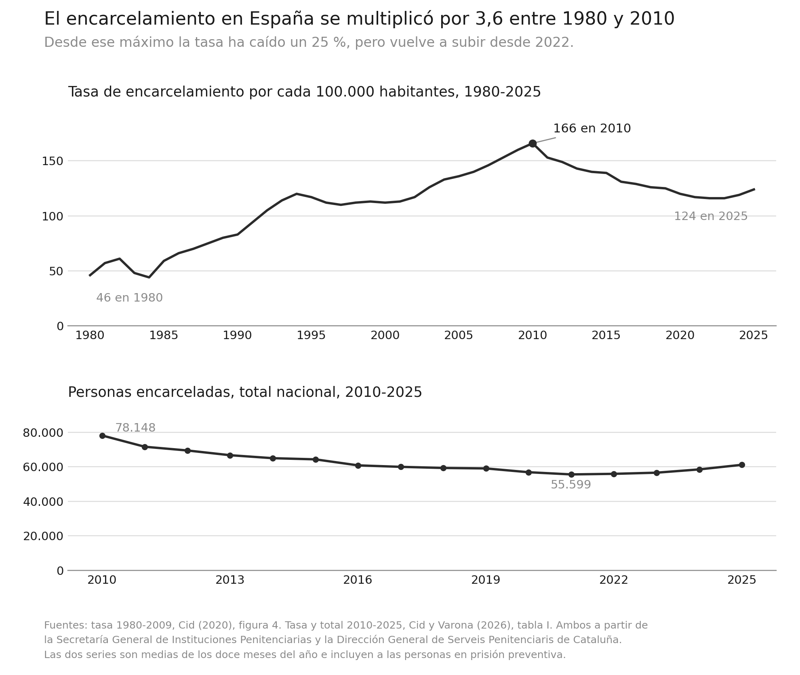

Aunque se suele interpretar y presentar a la criminología como la ciencia del delito y del delincuente, tan relevante ha sido la atención e investigación centrada en entender la respuesta estatal al delito a través del llamado "sistema" de justicia penal.

En este capítulo examinaremos algunos de los autores y las perspectivas que han dominado nuestra aproximación al estudio del "sistema" penal. En otras asignaturas estudiareis de forma más detallada los distintos actores que forman parte del campo de las respuestas penales y del control del delito,su regulación legal, y otros aspectos de las mismas. Aquí, tan solo os vamos a dar una visión muy global de la forma en que la criminología ha pensado lo penal a lo largo de su historia, así como unas pinceladas muy genéricas de como ha evolucionado la maquinaria estatal del control del delito.

::: {.callout-note appearance="simple"}
**¿"Sistema" o campo?**

Habréis notado que en este capítulo escribimos a veces "sistema" entre comillas. La expresión **sistema de justicia penal**, aunque popular es problemática. Se acuñó y popularizó en Estados Unidos a mediados del siglo XX — primero en la investigación de la *American Bar Foundation* durante los años cincuenta y sesenta, y sobre todo en el informe de la Comisión Presidencial sobre Aplicación de la Ley y Administración de la Justicia, *The Challenge of Crime in a Free Society* (1967) — para nombrar un conjunto de agencias (policía, fiscalía, judicatura, prisiones) que supuestamente actúan de forma coordinada y persiguen fines comunes. De ahí sale ese diagrama de flujo que reprodujimos en el capítulo 4, "El delito", y que desde entonces ha ilustrado casi todos los manuales de la disciplina. Muchas asignaturas en los grados en Estados Unidos se llaman "Introducción al sistema de justicia criminal". Es un concepto ligado al funcionalismo sociológico y de la teoría de sistemas que dominaban la sociología de aquellos años, con su imagen de instituciones como partes inter-dependientes de un todo que se autorregula. Muy elegante como construcción teórica, pero una mala descripción de la realidad a la que se refiere.

Fue @Kelling_91 quien quizás lo formuló con más rotundidad: el "sistema" no es un hecho, es una metáfora, y una metáfora que no funciona. Las agencias penales, argumenta @Kelling_91, no son partes de un orden natural ni están gobernadas por una inteligencia única; no comparten fines coherentes (los tribunales no persiguen el control del delito sino la constitucionalidad; las prisiones no existen para prevenir delitos); y desde luego no disponen de los mecanismos de retro-alimentación que la palabra "sistema" promete. Que las decisiones de una agencia afecten a la carga de trabajo de otra, algo que es evidente, no convierte al conjunto en un sistema: convierte al conjunto en un conjunto.

¿Con qué lo sustituimos? A nosotras nos parece hoy más fructífero pensar lo penal con la noción de **campo** de el sociólogo francés Pierre Bordieu. Para este autor, un campo es un espacio social relativamente autónomo, con sus propias reglas del juego y aquello que en él se considera valioso, en el que una pluralidad de agentes ocupan posiciones desiguales y compiten. Aplicado en nuestro terreno: policías, fiscalías, judicaturas, funcionariado de prisiones, pero también ministerios, sindicatos policiales y penitenciarios, partidos, medios, asociaciones de víctimas, ONG, empresas de seguridad privada, expertas académicas. Cada agente entra al campo con agendas propias y con dotaciones distintas de **capital** (económico, pero sobre todo político, jurídico, técnico y simbólico) y las emplea para imponer su definición legítima de cuál es el problema y cuál la respuesta.

El cambio de metáfora cambia las preguntas que nos formulamos y la forma de mirar. Si esto es un sistema, la pregunta es por qué funciona mal y cómo optimizarlo. Si esto es un campo, la pregunta es quién gana y quién pierde en él, con qué recursos, y por qué en un momento dado una determinada forma de pensar el delito y su control se vuelve la evidente. La segunda pregunta, creemos, explica bastante mejor lo que vais a leer en las páginas que siguen.
:::

Como veremos a lo largo del capítulo, este campo ha vivido transformaciones muy relevantes que son un reflejo de las cambios sociales, políticas y económicos de nuestras sociedades durante los últimos tres siglos. Cómo señala @Churchill_22 (Conclusion, Sección 3, para. 3):

> "Necesitamos una criminología que aprenda constantemente del pasado, asimilando las lecciones de la investigación previa y reflexionando sobre sus deficiencias, a la vez que se inspira en las diferencias históricas y se fortalece con las similitudes."

:::{.callout-note appearance="simple"}
**Hacia una criminología histórica**

En el primer capítulo señalábamos que la criminología es un campo interdisciplinario y que, a lo largo del tiempo, distintas disciplinas han volcado su interés en los temas de estudio de la misma, marcando modas y épocas dentro de la investigación criminológica. En los últimos añós la historia como disciplina ha venido a jugar un mayor papel en la criminología. Los historiadores nunca han dejado de pensar y estudiar el delito y su control, pero estas investigaciones y enfoques han ganado una mayor visibilidad y relevancia dentro de la propia criminología. Se reivindica ahora dentro de foros criminológicos una **criminología histórica** (@Churchill_22) y aparecen divisiones o grupos dentro de las sociedades de criminología focalizadas en estas cuestiones. En España hay ciertamente cada vez un interés más organizado en estas cuestiones. Todos los años se celebra un congreso anual sobre "Historia de la Prisión y las Instituciones Punitivas". Y cada vez hay una historiografía más consolidada sobre la prisión (@Alcantara_22; @Ballester_24; @Roldan_25; @OliverOlmo_13; @OliverOlmo_14) y las instituciones policiales españolas (@Ballbe_84; @GonzalezCalleja_20; @Palacios_24; @Palacios_26). En algunas universidades españolas nos consta que se están desarrollando esfuerzos para incluir asignaturas de historia dentro de los grados de criminología.
:::

## La formación del Estado y el monopolio del castigo

Si queremos comprender dónde estamos, tenemos que apreciar de dónde venimos. Y una de las cosas que más cuesta ver, precisamente porque hoy nos parece natural, es que el Estado tenga la potestad exclusiva de castigar. Hoy damos por supuesto que en un territorio hay una ley y unos tribunales. Si cometéis un delito en Sevilla o en Lugo, se os aplica el mismo código penal, con el mismo procedimiento, ante jueces que forman parte de una misma organización jerárquica. Nos parece la definición mínima de lo que es un sistema de justicia. Sin embargo, que sea el Estado (y no la familia de la víctima, ni el señor del lugar, ni la Iglesia, ni el gremio) quien defina qué es delito, quién lo persigue y quién impone la pena, es una situación histórica reciente y en absoluto inevitable. El Estado, como lo conocemos hoy, es una invención relativamente reciente (@Clavero_86).

En esta sección retrocedemos varios siglos para entender cómo se construyó ese monopolio. Conviene adelantar la conclusión: no fue un acontecimiento, sino una conquista lenta, desigual y muy tardía. Los Estados europeos proclamaron el monopolio del castigo mucho antes de poder ejercerlo de verdad.

![El derecho no se descubre: se promulga. Alguien decide qué será la regla, y ese alguien no es cualquiera[^control-1].](images/Incipit_Vidal_Mayor.jpg){#fig-vidal-mayor width="60%" fig-alt="…"}

[^control-1]: Incipit del *Vidal Mayor*, primera compilación del Fuero de Aragón realizada por el obispo de Huesca Vidal de Canellas en 1247. Vidal de Canellas y cancillería real del rey de Aragón, segunda mitad del siglo XIII. [Dominio público](https://creativecommons.org/publicdomain/mark/1.0/deed.es), vía [Wikimedia Commons](https://commons.wikimedia.org/wiki/File:Incipit_Vidal_Mayor.jpg).

Antes de la consolidación del Estado moderno, Europa estaba organizada bajo un entramado feudal y religioso en el que el poder político y judicial estaba fragmentado. La Iglesia, los señores feudales, las ciudades y las cortes reales compartían y competían por la autoridad sobre territorios y poblaciones. La justicia no era uniforme: coexistían tribunales eclesiásticos, jurisdicciones señoriales y cortes reales, cada una con sus propios criterios de legitimidad y aplicación de la ley.

Buena parte de lo que hoy llamaríamos justicia penal ni siquiera pasaba por un tribunal. Como ya vimos en el [capítulo 7](https://intro-criminologia.es/victimas#el-regreso-de-la-v%C3%ADctima), los conflictos se resolvían mediante acuerdos entre familias, arbitraje comunitario o venganza privada regulada. La persecución del delito dependía de la iniciativa de la víctima o de sus allegados, no de un aparato público. Y las penas eran fundamentalmente corporales y pecuniarias. No había prisiones como castigo, ni cuerpos policiales que patrullaran las calles o los caminos rurales.

::: {.callout-note appearance="simple"}
**¿Y por aquí qué pasaba?**

En la Península Ibérica no existía aún España. Teníamos la monarquía hispánica: un conjunto de reinos, señoríos y territorios que compartían un mismo monarca (el rey "de las Españas"), pero cada uno mantenía sus propias leyes, instituciones, monedas y sistemas fiscales. El rey gobernaba cada uno de estos territorios según sus propios fueros y consejos (Consejo de Castilla, de Aragón, de Italia, de Indias, etc.). No existía una administración centralizada ni una identidad nacional común. Los súbditos solían identificarse como castellanos, aragoneses, napolitanos o flamencos, más que como "españoles" en sentido político. No había un único sistema judicial unificado, sino múltiples jurisdicciones que dependían de cada reino, ciudad o señorío. Era un sistema complejo, desigual y fuertemente marcado por el carácter estamental y religioso del Antiguo Régimen. La pena debía servir para atemorizar y escarmentar más que para rehabilitar, y las autoridades tenían un gran margen para interpretar la ley y fijar penas.

Los Decretos de Nueva Planta (1707–1716) empezaron a uniformizar la administración, pero la justicia criminal en manos privadas sobrevivió mucho más: los señoríos jurisdiccionales no se abolieron hasta el decreto de las Cortes de Cádiz de 1811, y de forma definitiva hasta 1837. La Inquisición no desapareció hasta 1834. El primer código penal con vigencia efectiva es el de 1848. La Guardia Civil se creó en 1844. Es decir, el Estado no tuvo el monopolio real del castigo hasta bien entrado el siglo XIX.
:::

### El monopolio del Estado y su construcción

La formulación clásica y todavía dominante de lo que estamos describiendo es de Max Weber, que en 1919 definió el Estado como aquella comunidad humana que reivindica con éxito *el monopolio del uso legítimo de la fuerza física* dentro de un territorio determinado [@Weber_19]. Es importante fijarse en dos expresiones: *reivindica* y *con éxito*. Weber no está describiendo un rasgo eterno del poder político, sino un logro histórico concreto que él atribuye al Estado moderno, es decir, al Estado que se consolida en el siglo XIX.

¿Cómo se llegó hasta a la aparición de los Estados modernos? Hubo probablemente tres procesos paralelos que fueron relevantes.

- La **acumulación** de la fuerza: el Estado fue quedándose con la capacidad material de ejercer violencia, desplazando a los poderes armados privados.

- La **centralización** de la jurisdicción: fue absorbiendo la potestad de juzgar, subordinando o suprimiendo los tribunales que competían con los suyos.

- La **secularización** del fundamento: se cambió aquello que legitimaba el castigo, que dejo de ser lo religioso para pasar a ser secular.

Ninguno de estos tres procesos tiene una fecha clara de nacimiento, y ninguno estaba terminado cuando arranca el siglo XIX.

![Hobbes publica esta imagen en 1651, en plena guerra civil inglesa: no retrata un Estado consolidado, sino la pretensión de uno. El soberano está hecho de los cuerpos que lo componen y sostiene a la vez la espada y el báculo, las dos jurisdicciones que aún competían[^control-3].](images/leviathan.jpg){#fig-leviatan width="50%" fig-alt="Frontispicio grabado del Leviatán de Thomas Hobbes. En la mitad superior, la figura gigante de un soberano coronado emerge tras un paisaje de colinas y una ciudad amurallada; su torso y sus brazos están formados por centenares de pequeñas figuras humanas de espaldas al espectador. Empuña una espada en la mano derecha y un báculo episcopal en la izquierda. Sobre él, una inscripción latina tomada del libro de Job. En la mitad inferior, el título del libro flanqueado por dos columnas de cinco viñetas: a la izquierda un castillo, una corona, un cañón, un montón de armas y una batalla; a la derecha una iglesia, una mitra, unos rayos, unos instrumentos bifurcados y una asamblea de eclesiásticos sentados."}

[^control-3]: Abraham Bosse, frontispicio de *Leviathan, or The Matter, Forme and Power of a Common-Wealth Ecclesiasticall and Civil*, de Thomas Hobbes, Londres, 1651. British Library. [CC0](https://creativecommons.org/publicdomain/zero/1.0/deed.es), vía [Wikimedia Commons](https://commons.wikimedia.org/wiki/File:Leviathan_frontispiece_cropped_British_Library.jpg).

Con relación al proceso de **acumulación del poder**, dos respuestas complementarias han resultado especialmente influyentes en la literatura. Norbert Elias, en *El proceso de la civilización* [@Elias_39], describió un largo movimiento en el que las casas reales fueron acumulando dos monopolios entrelazados (el de la violencia y el de los impuestos) a costa de la nobleza guerrera. A medida que el uso privado de la fuerza dejaba de estar disponible, las élites tuvieron que competir por otras vías (la corte, el prestigio, el cálculo político), lo que fue transformando también las formas de comportamiento y de autocontrol.

Charles Tilly [-@Tilly_90] ofreció una versión menos amable del mismo proceso. Su tesis, resumida en una frase célebre, es que "la guerra hizo al Estado y el Estado hizo la guerra": los monarcas necesitaban ejércitos, los ejércitos necesitaban dinero, el dinero exigía burocracia fiscal, y esa burocracia acabó siendo el esqueleto del Estado moderno. Tilly [-@Tilly_85] llega a comparar explícitamente la construcción estatal con el crimen organizado: el Estado ofrece protección frente a una amenaza que en buena medida él mismo genera, y cobra por ello.

Tener la fuerza, no obstante, no es lo mismo que tener la autoridad para juzgar. La segunda transformación consistió en **la centralización**, en que esa autoridad, repartida entre señores, ciudades, Iglesia y tribunales especiales, fue concentrándose en el monarca y más tarde en el Estado. No se procedió tanto suprimiendo tribunales como subordinándolos: permitiendo que sus decisiones se recurrieran ante la justicia real y enviando oficiales del rey a administrar justicia en el territorio. El resultado que hoy nos parece obvio (una sola ley, una sola jurisdicción, una organización judicial única) es muy tardío. La Constitución de Cádiz proclamó en 1812 que "en los negocios comunes, civiles y criminales no habrá más que un solo fuero para toda clase de personas", y a continuación, en los dos artículos siguientes, mantuvo el fuero eclesiástico y el militar. La unidad de fueros no se hizo efectiva hasta el decreto de 6 de diciembre de 1868, y aun así dejó subsistentes esas mismas jurisdicciones [@TomasyValiente_79].

El tercer proceso paralelo es **la secularización**: la progresiva separación entre pecado y delito, y entre autoridad religiosa y autoridad jurídica. Es un proceso real, pero conviene desconfiar de la versión simplificada según la cual la razón habría desalojado a la fe. Primero, porque la Iglesia no fue solo un obstáculo para la racionalización jurídica, por el contrario, contribuyó a su origen. El derecho canónico fue el primer sistema jurídico moderno de Occidente (sistemático, escrito, con jerarquía de fuentes y profesionales formados) y de él proceden herramientas que seguimos usando, empezando por la exigencia de intención para imputar responsabilidad, que es una idea teológica antes que jurídica [@Berman_83]. La secularización no consistió, por tanto, en sustituir una técnica religiosa por otra racional como en "transferir" al Estado un aparato ya construido, con buena parte de sus categorías.

Segundo, porque durante un largo periodo Estado e Iglesia se reforzaron mutuamente en lugar de separarse. Los historiadores lo han descrito como **confesionalización**: tras la Reforma, los poderes políticos usaron la disciplina religiosa como instrumento de gobierno de la población, produciendo lo que Gerhard Oestreich [-@Oestreich_82] llamó **disciplinamiento social** - la regulación minuciosa de la conducta cotidiana, la sobriedad, el trabajo, la sexualidad, el ocio. Reconoceréis aquí un antecedente directo de lo que posteriormente Foucault [@Foucault_86] llamará poder disciplinario, y también del papel que tendrán los cuáqueros, los capellanes y la idea de arrepentimiento en las primeras penitenciarías del siglo XIX. La religión no desaparece del castigo, se instala dentro de él.

Lo que sí cambia, y esto es lo decisivo cuando hablamos de secularización, es el **fundamento de la autoridad para castigar**. Que la ley obligue porque emana de un pacto entre ciudadanos y no de la voluntad divina es una idea ilustrada, y solo se traduce en derecho positivo con las codificaciones liberales del siglo XIX. La secularización del *contenido* del derecho penal fue todavía más lenta, y en España el retraso es fácil de medir: la Inquisición no se abolió hasta 1834; la confesionalidad del Estado se mantuvo, con interrupciones, hasta la Constitución de 1978; la homosexualidad estuvo penada bajo la Ley de Vagos y Maleantes y la Ley de Peligrosidad y Rehabilitación Social hasta 1979; y el Código Penal vigente sigue castigando el escarnio de los sentimientos religiosos. Cuando hablemos de secularización, por tanto, hablamos de una tendencia a largo plazo.

### Proclamar el monopolio y poder ejercerlo

Es tentador imaginar un proceso lineal de progreso que vaya de la fragmentación medieval a la centralización estatal y la secularización, y de ahí a un castigo más racional y más humano. La evidencia histórica no permite sostener este relato.

Pieter Spierenburg [@Spierenburg_84] mostró que la consolidación del poder estatal, en un primer momento, hizo el castigo más espectacular y no menos. Las ejecuciones públicas ritualizadas, con su cuidada escenografía, no son un residuo medieval, sino que son un producto del Estado en construcción. Un Estado que necesitaba exhibir una autoridad que todavía no estaba asentada. Cuanto menos capacidad real tenía el poder para vigilar y detener, más necesitaba que los pocos castigos que imponía fueran memorables.

![El cadalso no se levanta a escondidas. Se monta en el centro de la ciudad, elevado sobre la multitud y de espaldas a los edificios del poder, para que la ejecución sea vista y recordada[^control-5].](images/patibulo.jpg){#fig-oldenbarnevelt width="75%" fig-alt="Grabado que representa la ejecución de Johan van Oldenbarnevelt en el Binnenhof de La Haya en 1619. En el centro de una plaza se alza un patíbulo de madera elevado sobre el que se distingue al condenado arrodillado y al verdugo. Alrededor, una multitud compacta de espectadores llena la plaza; al fondo, los edificios del palacio y la torre de una iglesia. Varias figuras observan desde ventanas y tejados."}

[^control-5]: *Onthoofding van Johan van Oldenbarnevelt, 1619*, grabado anónimo de 1777. Rijksmuseum, Ámsterdam, RP-P-OB-64.411. [CC0](https://creativecommons.org/publicdomain/zero/1.0/deed.es), vía [Wikimedia Commons](https://commons.wikimedia.org/wiki/File:Onthoofding_van_Johan_van_Oldenbarnevelt,_1619,_RP-P-OB-64.411.jpg).

El caso inglés nos puede servir para ilustrarlo.  Entre finales del siglo XVII y comienzos del XIX, en pleno afianzamiento del Estado, el número de leyes que castigaban con la muerte pasó de unas cincuenta a más de doscientas: el llamado *Bloody Code* [@Radzinowicz_48]. Y sin embargo Inglaterra carecía de policía y de ministerio fiscal: la persecución del delito seguía dependiendo de la iniciativa privada de las víctimas [@Hay_75]. Douglas @Hay_75 leyó esa combinación como un sistema y no como una disfunción: una severidad feroz sobre el papel, un aparato mínimo para aplicarla y enormes dosis de discrecionalidad e indulto selectivo producían, juntas, terror y deferencia. En la Inglaterra de Blackstone se indultaba a cerca del 60 % de los condenados a muerte [@Strange_16]. No es casualidad que Foucault abra *Vigilar y castigar* [@Foucault_86] con el suplicio de Damiens en 1757. Elige esa fecha precisamente porque el espectáculo punitivo del Antiguo Régimen seguía plenamente vivo en pleno siglo de las Luces.

La distinción que propone Michael Mann [@Mann_84] entre dos tipos de poder estatal resulta aquí muy útil para entender lo que estamos viendo:

- El **poder despótico** es la capacidad de las élites estatales para tomar decisiones sin negociarlas con la sociedad. Las monarquías absolutas tenían mucho.

- El **poder infraestructural** es la capacidad real de penetrar en la sociedad y ejecutar esas decisiones sobre el territorio. Las monarquías absolutas apenas tenían ninguno.

Un monarca del siglo XVII podía proclamarse fuente única de la justicia, y muchos lo hicieron. Pero no disponía de un cuerpo profesional de policía, ni de un sistema penitenciario, ni de registros fiables de población, ni de una administración capaz de llegar a la aldea. Había cárceles, alguaciles y verdugos; lo que no había era una máquina capaz de perseguir, juzgar y castigar de forma regular en todo el territorio. El monopolio del castigo era, en ese momento, una pretensión sin instrumentos.

Los instrumentos llegaron mucho después y llegaron casi a la vez: los códigos penales, los cuerpos policiales profesionales, el sistema penitenciario, los registros de antecedentes, las estadísticas criminales. Ninguno surgió de la nada (como veremos, hubo policía antes de la policía y encierro antes de la prisión), pero es entre finales del siglo XVIII y, sobre todo, a lo largo del XIX cuando adquieren la forma sistemática y la cobertura territorial que hoy damos por supuestas.

Por eso las dos secciones siguientes tratan justamente de eso: primero, de cómo los reformadores ilustrados pensaron cómo *debería* ser un sistema penal racional; después, de cómo el siglo XIX construyó las instituciones (la policía y la prisión) que por primera vez hicieron ese sistema materialmente posible. Que esas instituciones se presentaran como racionales y humanitarias no garantiza que lo fueran, ni que nacieran por esas razones.

## La llamada Escuela Clásica y la reforma del derecho penal

Como estamos viendo, en los siglos XVII y XVIII, los sistemas de justicia penal en Europa eran fragmentados, arbitrarios y frecuentemente crueles. La autoridad judicial se dividía entre tribunales eclesiásticos, jurisdicciones señoriales y cortes reales, lo que generaba inconsistencias en la aplicación de la ley. Los castigos eran desproporcionados y brutales. La tortura se utilizaba con frecuencia para obtener confesiones, y las ejecuciones públicas eran espectáculos destinados a infundir temor en la población. Además, la justicia estaba profundamente ligada a la moral y la religión; muchos delitos eran percibidos como pecados, y el castigo cumplía tanto una función retributiva como espiritual.

![Goya pinta esta escena entre 1808 y 1812, los mismos años en que las Cortes de Cádiz debaten la Constitución. No es un testimonio de la Inquisición: es el momento en que el fundamento religioso del castigo empieza a poder representarse como escándalo, dos décadas antes de que el Santo Oficio se aboliera[^control-7].](images/goya_1.jpg){#fig-goya-inquisicion width="85%" fig-alt="Óleo de Goya que representa un auto de fe en el interior de una sala abovedada en penumbra. En primer plano, varios reos sentados llevan sambenito y coroza, el capirote cónico de los penitenciados; uno de ellos aparece encogido con la cabeza baja. A su alrededor, un tribunal de eclesiásticos y funcionarios ocupa unos bancos corridos, y al fondo una multitud se pierde en la sombra. En lo alto, sobre una tribuna elevada, una figura lee en voz alta la sentencia."}

[^control-7]: Francisco de Goya, *Escena de Inquisición*, 1808–1812. Dominio público, vía [Wikimedia Commons](https://commons.wikimedia.org/wiki/File:Francisco_de_Goya_-_Escena_de_Inquisici%C3%B3n_-_Google_Art_Project.jpg). Reproducción digitalizada por el Google Cultural Institute.

Este contexto mostraba la necesidad de un cambio profundo. La progresiva consolidación de Estados modernos aspiraba a ofrecer un marco legal uniforme, pero la práctica aún carecía de principios racionales, consistencia y protección de los derechos de los acusados. Era este escenario el que Beccaria y otros pensadores ilustrados criticaron, proponiendo alternativas basadas en la razón, la utilidad social y la proporcionalidad.

Estos autores están vinculados al periodo conocido como la Ilustración que eventualmente vendrían ligados a cambios políticos, sociales y económicos importantes (p.ej., la Revolución Francesa de 1789). La Ilustración fue un movimiento humanista filosófico que pensaba que la razón y el conocimiento empírico tenía que sustituir a la fe y la superstición como bases de una sociedad moderna. Los autores asociados a este movimiento intelectural proponían que la base de la comunidad política se debía construir sobre un contrato social entre ciudadanos, clases pudientes y poder político. Los ciudadanos tenían que ceder parte de sus libertades para que el poder político pudiera desarrollar y aplicar las leyes en beneficio del bien común. La autoridad legal debería emanar de este contrato social y no de la teología. Quienes vulnerasen las leyes impuestas por esta autoridad legal, a través del proceso del contrato social, deberían ser castigados para preservar el bien común, pero siempre y cuando este castigo se impusiera de forma razonable. Surge también la idea durante este periodo de la separación de poderes (ejecutivo, legislativo y judicial) que sigue estructurando nuestro ordenamiento constitucional.

### Cesare Beccaria

Cesare Beccaria (1738–1794), filósofo y jurista italiano, es considerado uno de los fundadores del derecho penal moderno. Su obra *Dei delitti e delle pene* (1764) marcó un antes y un después en la conceptualización del castigo y la justicia penal. Beccaria fue influenciado por pensadores como Montesquieu, cuyo análisis de la separación de poderes y la proporcionalidad de las leyes inspiró su visión, y por Rousseau, cuya noción de contrato social fundamentaba la legitimidad de las leyes como expresión de la voluntad colectiva. También se basó en la tradición jurídica romana, que promovía la codificación y racionalización del derecho.

![Retrato de Cesare Beccaria (1738-1794) pintado por Eliseo Sala después de 1864, es decir, setenta años después de la muerte del retratado.[^control-9]](images/Cesare_Beccaria.jpg){#fig-beccaria width="40%" fig-alt="Retrato al óleo de busto sobre fondo oscuro. Un hombre de mediana edad, con peluca blanca empolvada de bucles laterales, mira ligeramente hacia el espectador. Viste casaca oscura, corbatín blanco y chorrera de encaje sobre el pecho."}

[^control-9]: Eliseo Sala, retrato de Cesare Beccaria, posterior a 1864. Dominio público, vía [Wikimedia Commons](https://commons.wikimedia.org/wiki/File:Cesare_Beccaria.jpg).

Beccaria criticó abiertamente la arbitrariedad de los sistemas penales de su tiempo, la tortura, los castigos excesivos y la pena de muerte. Propuso que las leyes fueran claras, públicas y aplicadas de manera uniforme, y que las penas fueran proporcionales a los delitos. Destacó que la función principal del castigo debía ser prevenir futuros delitos, en lugar de satisfacer un sentido de venganza o moralidad religiosa. Además, defendió garantías procesales, a través de juicios rápidos y públicos, limitando la discrecionalidad de jueces y autoridades.

Su tratado era, por tanto, un manifiesto en favor una concepción liberal del Derecho Penal frente a los abusos de las monarquías absolutas. En realidad sus ideas no eran particularmente originales, reflejaban el sentir de muchos intelectuales del período, y él tomaba prestadas ideas de muchos autores (a los que por temor a la Inquisición no citaba). La primera versión de su tratado, de hecho, fue escrita por uno de sus amigos (Pietro Verri) sobre la base de conversaciones con Beccaria.

En 1765 tras el éxito en Italia fue traducido y reivindicado en francés por autores como Voltaire (que en ediciones posteriores a 1766 añadió sus comentarios). En 1800 se habían publicado ya 23 ediciones italianas, 14 francesas, y 11 en inglés, dando así muestra de su popularidad y buena acogida. En parte su fama se debió que la Iglesia católica prohibió el libro como contrario a la fe por su excesivo racionalismo y lo incluyó en el *Index Librorum Prohibitorum* en 1766.

Muchos autores citan a Beccaria como el padre de una "escuela clásica de criminología" y destacan que al hablar, en su trabajo, del calculo penal del delincuente esta subrayando su capacidad para actuar libremente (tan solo guiado por el coste de costes y beneficios penales). No obstante, esta es una visión muy superficial de sus escritos y probablemente una malinterpretación de sus influencias intelectuales. Beccaria en su texto insiste en que el delincuente y la delincuencia tienen que ser entendidos causalmente en términos de sus circunstancias sociales y materiales (no en términos puramente de calculo racional individualista). Beccaria posiblemente mantenía una concepción de la "agencia humana" que incluía elementos de calculo racional "libre" y de acción "determinada" por las circunstancias sociales [@Beirne_93].

Por tanto, la importancia histórica de Beccaria no reside en haber generado una teoría criminológica sobre el hombre delincuente, sino que radica en que tradujo las condiciones políticas que se estaban gestando durante aquel periodo (la soberanía estatal y el monopolio del castigo) en principios jurídicos racionales, creando un marco conceptual para sistemas penales codificados y humanos.

::: {.callout-note appearance="simple"}
**¿Podemos hablar de una Escuela Clásica de criminología**

Aunque a menudo se citan a Beccaria y a Bentham como los flamantes integrantes de dicha escuela, otros autores sostienen que ni era una escuela, ni era criminología. Con esta etiqueta se fuerza la asimilación de autores a un proyecto científico (la criminología) que no fue realmente inventada hasta décadas más tarde. Sí es verdad que estos autores compartían una visión del delincuente como un ser humano normal que en su delinquir no hacía más que satisfacer necesidades y aspiraciones humanas básicas. Pero, aunque muchos manuales proponen un debate entre determinismo y agencia humana (libre albedrio) contraponiendo el positivismo criminológico que surgiría después y los proponentes de la escuela clásica, este es un debate un tanto ficticio en cuanto que los autores clásicos no ignoraban fuerzas deterministas. El interés de estos autores estaba más centrado en la reforma de la justicia penal que en el entendimiento de la delincuencia. Algunas ideas estaban influidas por una agenda humanista y progresista y fueron muy influyentes al guiar pensamiento y práctica posterior: prevención a través de la disuasión, la necesidad de una buena ley y administración de justicia, etc. Pero también tenían ideas que eran conservadoras incluso para aquella época [@Beirne_93].
:::

Desde un punto de vista histórico, la influencia de Beccaria fue determinante en la modernización de códigos penales en Europa y sentó las bases para sistemas de justicia penal basados en principios universales de legalidad y derechos procesales del acusado.

### Jeremy Bentham

Jeremy Bentham (1748–1832), filósofo y jurista británico, complementó y sistematizó las ideas de Beccaria desde la perspectiva del utilitarismo. Inspirado por Beccaria y por filósofos como John Locke y David Hume, Bentham propuso que las leyes y los castigos debían organizarse de manera que maximizaran el bienestar general y minimizaran el daño. Introdujo la noción de un "cálculo hedonista" para evaluar la intensidad, duración, certeza y prontitud de la pena, con el objetivo de lograr la máxima disuasión posible.

Bentham ingresó en la Universidad de Oxford a la tierna edad de los doce años. Fue un autor que escribió ampliamente sobre filosofía moral, derecho, penología, jurisprudencia y policía. Estuvo influenciado por Beccaria y el filosofo escoces David Hume. Como Beccaria quería un régimen legal racional, humano y codificado en un cuerpo transparente de leyes, pero en lugar de compilar una serie de propuestas humanistas contra las practicas barbáricas del sistema penal como hizo Beccaria, se propuso ofrecer una base filosófica solida a lo que debería ser la nueva penología.

Hume argumentaba que la base de la acción moral es la producción de la felicidad. Bentham adoptó esta idea y propuso un sistema filosófico que aspiraba a que el derecho estuviera orientado a conseguir la mayor felicidad del mayor número de personas (una concepción utilitarista e instrumental del derecho). Para ello, Bentham partía de una explicación hedonista del comportamiento humano. Para este autor las personas actúan como actores racionales:

> "La naturaleza ha sometido a la humanidad al dominio de dos soberanos amos: el dolor y el placer. Solo ellos pueden indicarnos lo que debemos hacer, así como determinar lo que haremos"

Para Bentham nuestro comportamiento se guía, así, por la búsqueda del placer y la evitación del dolor (ambas son "percepciones interesadas"). Según Bentham, siguiendo este modelo, si cometemos delitos es porque nos sirve para obtener "placer" o evitar "dolor".

De ello, si el delincuente persigue la obtención de "placer" y evitación de "dolor", Bentha derivaba que el legislador penal debe tener en cuenta este calculo a la hora de diseñar las sanciones penales. El delito se puede prevenir por medio de sanciones positivas (recompensas) o sanciones negativas (castigos). Para Bentham, el legislador debería seguir cuatro reglas penológicas para calcular la proporción entre delitos y penas:

- El fin de la ley penal es la prevención por tanto el legislador debería asegurarse que el "placer" obtenido por la realización del delito fuera contrarrestado por el "dolor" de la sanción penal.

- La amenaza de esta sanción, por sí sola, debería ser suficiente para que el delincuente se abstuviera o en todo caso cometiera un delito menor.

- El castigo no debería ser excesivo si queremos que el delincuente, al delinquir, no vaya más allá de lo que le es estrictamente necesario.

- Los legisladores deberían tratar de que el castigo penal fuera lo más económico posible.

Bentham también introdujo el concepto de "panóptico" como modelo de diseño de prisiones orientadas al control eficiente y sostenía que la certeza, prontitud y proporcionalidad del castigo eran más importantes que su severidad extrema[^control-11]. Su enfoque utilitario ofreció una metodología práctica para que los Estados aplicaran la justicia penal de manera eficiente, transparente y orientada al beneficio social.

[^control-11]: El principio en el que se basa (lo que en la época se llamaba inspección universal) tenía precedentes españoles que se habían perdido de vista. Lo propuso en el siglo XVI Miguel de Giginta para sus albergues de pobres, y conforme a él se construyó en Madrid la cárcel de Corte entre 1629 y 1638, con un vigía situado en alto que dominaba los patios y se comunicaba con el resto del edificio mediante tubos. Cuando Bentham publicó su proyecto, siglo y medio más tarde, esos antecedentes o se habían borrado de la memoria colectiva o nunca habían llegado a conocerse, y se lo consagró como el gran innovador de la arquitectura carcelaria [@Roldan_25].

Bentham, al igual que Beccaria, aprovechó las condiciones políticas que se estaban desarrollando: el monopolio del castigo por parte del Estado permitió que paulatinamente la administración de justicia se diseñara según principios racionales, en lugar de depender de arbitrariedades locales o de la Iglesia. Su trabajo ayudó a fundamentar un sistema de justicia penal preventivo y organizado, que se convirtió en un modelo para la modernización legal en Inglaterra y en otros países europeos.

![Planos del panóptico de Bentham: alzado y sección del edificio arriba, planta semicircular abajo. Las celdas se disponen en anillo contra el muro exterior, abiertas hacia el centro, donde se sitúa la torre de inspección.[^control-12]](images/Panopticon.jpg){#fig-panoptico width="70%" fig-alt="Lámina con tres dibujos arquitectónicos a línea. En la mitad superior, a la izquierda, el alzado exterior de un edificio de cuatro plantas con ventanas en arco; a la derecha, una sección transversal que muestra los pisos de celdas superpuestas y, en el eje, una estructura central de inspección con galerías. En la mitad inferior, la planta semicircular: un anillo de celdas separadas por tabiques radiales que convergen hacia un punto central, rodeado de varios círculos concéntricos. Las distintas partes están señaladas con letras."}

[^control-12]: Lámina del panóptico, publicada en *The Works of Jeremy Bentham*, vol. IV, pp. 172-173, edición de John Bowring, 1843. Dominio público, vía [Wikimedia Commons](https://commons.wikimedia.org/wiki/File:Panopticon.jpg).

Desde un punto de vista histórico conviene no juntarlos demasiado. Beccaria publica en 1764, bajo una monarquía absoluta y en una Italia fragmentada, y lo que aporta son principios morales y racionales de un sistema penal humano y predecible (legalidad, proporcionalidad, publicidad, certeza). Bentham, que lo leyó y lo reconoció como influencia, escribe una generación después y al otro lado de la Revolución Francesa, en una Gran Bretaña en plena industrialización, y aporta otra cosa: los principios utilitarios y una metodología sistemática para aplicar la justicia de manera eficiente y socialmente beneficiosa. Y su intervención no se quedó en la filosofía. En 1798 y 1799 redactó, por encargo del magistrado Patrick Colquhoun, dos proyectos de ley para reorganizar la policía de Londres, de los que solo llegó a aprobarse una versión recortada, la *Thames Police Act* de 1800. Esos textos permanecieron casi inéditos hasta 2018 [@Jacques_21]. De los instrumentos que empezaban entonces a aparecer, y de lo que su llegada supuso, nos ocupamos a continuación.

## La invención de la policía y la prisión

Vemos así, como desde el siglo XVII al XVIII se fueron fraguando las bases políticas y filosóficas que servirían para armar el actual sistema de justicia penal. Elementos claves en este proceso fueron la invención de la prisión como castigo y de la policía como institución de custodia del derecho y mantenimiento de la paz social. Ambas instituciones son invenciones modernas que se van desarrollando durante el siglo XVIII y XIX, en el contexto de la consolidación del Estado moderno y de las transformaciones sociales que trajo consigo la modernidad capitalista, hasta adquirir la forma que tienen hoy en día.

Aunque a muchas personas les pueda parecer impensable el vivir en sociedades sin prisiones o policías, la humanidad ha vivido sin ellos durante la mayor parte de su existencia. Ya hemos visto como antes del surgimiento del Estado moderno las penas eran públicas, crueles y ejemplares; horcas, torturas, mutilaciones o destierros buscaban infundir miedo más que corregir. No existían la prisión ni la policía como hoy las entendemos. La reclusión se usaba solo de manera temporal, y el control del orden dependía de milicias locales o de comunidades vecinales.

Su aparición y expansión no solo respondió a una necesidad técnica de organización del orden público o de reforma del castigo, sino que también reflejó (y consolidó) una nueva relación de poder entre las clases sociales, en la que el control, la vigilancia y la disciplina se convirtieron en herramientas fundamentales de dominación política y económica.

El concepto de policía evolucionó junto con la idea de Estado. En el siglo XVII, *police* en Francia designaba el "buen gobierno" o la administración del orden público. La policía no era una institución o una organización sino un término que se usaba para identificar las labores políticas locales. Policía originalmente significaba gobierno municipal y, por tanto, sus funciones eran muy amplias [@Brodeur_10].

![Edicto de Luis XIV de marzo de 1667, verificado en el Parlamento de París el día 15, que crea el cargo de teniente de policía de la ciudad, prebostazgo y vizcondado de París y lo separa del de teniente civil. La vigilancia deja de ser un apéndice de la justicia y pasa a ser un oficio propio, con su titular y su jurisdicción.[^control-14]](images/edicto.jpg){#fig-edicto-policia width="55%" fig-alt="Primera página de un edicto real impreso del siglo XVII. Bajo una cenefa tipográfica, el encabezamiento en mayúsculas dice «Edit du Roy», y debajo, en letra menor, que es del mes de marzo de 1667 y que crea el cargo de teniente de policía de la ciudad, prebostazgo y vizcondado de París, separándolo del de teniente civil. El cuerpo del texto, en francés antiguo y a página completa, comienza con una gran letra capital y la fórmula «Louis, par la grâce de Dieu, roi de France et de Navarre». En los márgenes hay dos sellos redondos de archivo y anotaciones manuscritas con signaturas."}

[^control-14]: *Édit portant création de la lieutenance générale de police*, dado por Luis XIV en Saint-Germain-en-Laye, marzo de 1667. Archives Nationales de Francia, AD-390. Dominio público, vía \[Wikimedia Commons\](https://commons.wikimedia.org/wiki/File:%C3%89dit_imprim%C3%A9_portant_cr%C3%A9ation_de_la_lieutenance_g%C3%A9n%C3%A9rale_de_Police,*donn%C3%A9*%C3%A0_Saint%E2%80%93Ge

Fue bajo Luis XIV, en 1667, cuando se creó en París el cargo de *lieutenant général de police*, el Teniente general de policía, considerado el origen de la policía moderna. Este cargo posteriormente se convertiría en un Ministerio durante la Revolución y el período Napoleónico. Era un cargo con poder normativo que permitía crear normas con sanciones tan severas que a estos efectos se podrían considerar normas penales. Era un cargo también con poder judicial en todas aquellas materias que se consideraban no tenían que llegar a los tribunales. La policía era el cargo y sus poderes, no el cuerpo de agentes. Este edicto no creó un cuerpo de personas encargados de garantizar el cumplimiento de la ley, aunque eventualmente el sistema de policía de París evolucionó para contar con una fuerza armada de hombres (algunos con formación militar). Los hombres al servicio del Teniente contaban con 3 inspectores que practicaban detenciones informados por una amplia red de informantes policiales y "soplones". Este cargo tenía la función de vigilar, controlar y disciplinar a la población urbana, un espacio en el que el crecimiento demográfico, la pobreza y el comercio empezaban a generar tensiones sociales. El control de la opinión pública era igualmente importante, así como la represión de la disidencia religiosa o política. El control de la opinión se contemplaba como una forma de "mantener el orden" dada la creencia de que las "ideas peligrosas" eran la fuente de problemas. ¿Quién era el "objeto" de la acción policial en Paris? Fundamentalmente los pobres sin trabajo. Este proletariado era el objetivo obvio por varias razones: se le consideraba responsable de los delitos y podían ser movilizados para generar disturbios. La idea es que había que proteger a la clase trabajadora de ser contaminada por este proletariado [@Brodeur_10].

Durante el siglo XVIII, las ciudades europeas comenzaron a desarrollar cuerpos similares. En Berlín, Viena o Madrid se establecieron instituciones encargadas de vigilar las calles, censar a la población, controlar el trabajo y la mendicidad, y reprimir la disidencia.

::: {.callout-note appearance="simple"}
**Antes de Peel**

El siglo XVIII fue mucho más denso de lo que sugiere el salto de París a Londres. En la Francia rural, la *maréchaussée* (compañías de milicia armada acuarteladas por distritos y coordinadas desde el Ministerio de la Guerra desde 1720) vigilaba los caminos y se ocupaba de hostigar y expulsar a vagabundos y mendigos: es el antecedente directo del modelo de gendarmería que los moderados españoles elegirían en 1844.

En las islas británicas, Dublín tuvo una policía metropolitana armada y dirigida desde Londres en 1786, cuarenta y tres años antes que la capital; Glasgow creó la suya en 1800 y Edimburgo en 1805, con mando jerárquico y tribunales de policía propios. Y en el propio Londres los *Bow Street runners* de Henry Fielding funcionaban desde 1749, y la policía del Támesis, costeada por los comerciantes de las Indias Occidentales, desde 1798 [@Finnane_16; @Barrie_16].
:::

En Inglaterra, sin embargo, el desarrollo fue más tardío. No fue hasta 1829 que Sir Robert Peel fundó la *Metropolitan Police* de Londres, considerada la primera policía profesional y civil[^control-16]. Su objetivo principal no era la represión abierta, sino la prevención del delito mediante la vigilancia constante y la presencia pública.

[^control-16]: Conviene matizar esa idea de ruptura. La historiografía reciente sostiene que ningún relato que atribuya el nacimiento de la policía moderna a una sola idea, una sola persona o una sola ley resiste la evidencia disponible: hay más continuidad que ruptura. Los célebres "principios de Peel" que circulan por tantos manuales son en realidad una reconstrucción del siglo XX, formulada por el historiador Charles Reith y consolidada a fuerza de repetirse en la manualística estadounidense. Y el modelo londinense tampoco fue la alternativa civil al continental: al crear un cuerpo dirigido por el ministro del Interior y no responsable ante las autoridades locales, el gobierno británico aplicaba a su capital las lecciones aprendidas gobernando Irlanda [@Finnane_16].

![Caricatura publicada en mayo de 1829, mientras se tramitaba la ley que crearía la Policía Metropolitana. Wellington y Peel aparecen dibujados como centinelas del ejército: la objeción de la época era que el nuevo cuerpo sería una gendarmería encubierta, incompatible con las libertades inglesas.[^control-17]](images/robertpeel.jpg){#fig-peelers width="55%" fig-alt="Grabado satírico coloreado a mano. Dos hombres de mediana edad, con los rasgos caricaturizados de Wellington y Peel, aparecen de pie y firmes en mitad de una calle, vestidos de granaderos: gorro alto de piel de oso, casaca roja con correajes blancos cruzados y pantalón blanco. Cada uno sujeta un fusil con la bayoneta calada. A la izquierda se ve un muro de prisión rematado con pinchos y una puerta reforzada con clavos; a la derecha, la fachada de una casa de ladrillo. Al pie, el título «State Watchmen. Of 1829»."}

[^control-17]: John Phillips, *State Watchmen. Of 1829*, publicada por John Field, mayo de 1829. British Museum, núm. 1868,0808.9008. Dominio público, vía [Wikimedia Commons](https://commons.wikimedia.org/wiki/File:State_watchmen._Of_1829._(BM_1868,0808.9008).jpg).

Sir Robert Peel fue un reformista que quería mejorar la prevención del delito. Tuvo que lidiar con quienes veían en la policía centralizada una amenaza contra la libertad (lo que contribuyó al carácter menos militar de la institución en el Reino Unido). Su creación en 1829 representó un momento de ruptura que cambió el significado del termino policía [@Brodeur_10]:

- Hasta entonces había significado la gobernanza de un territorio en todos sus aspectos

- La policía hasta entonces era un sistema autocontenido que poseía todos los atributos para ejercitar la gobernanza (legislativo, regulatorio, judicial, y ejecutivo)

En Londres se redujo el significado en dos sentidos:

- No era ya un sistema autocontenido, sino una rama del sistema de justicia penal, que se encargaba de poner a los delincuentes en manos del poder judicial

- "La policía" empezó a ser el término que se empleaba para designar al conjunto de hombres encargados de hacer labores policiales, que empezaron a estar estrictamente limitadas a la provisión de la seguridad.

Aunque se presentaba como una institución al servicio de la seguridad general, la policía moderna surgió en un contexto de creciente conflictividad social. La expansión del capitalismo industrial y la urbanización produjeron nuevas formas de pobreza y marginación. Las clases dirigentes comenzaron a ver en la clase trabajadora un peligro potencial para el orden. Así, la policía se convirtió en un instrumento no solo de protección, sino de control de los sectores populares. Su tarea era tanto mantener la "paz" como asegurar las condiciones necesarias para la estabilidad del sistema económico.

::: {.callout-note appearance="simple"}
**La Guardia Civil y el orden en el campo español**

España tomó el camino contrario al inglés, y lo hizo a conciencia. Mientras los progresistas miraban al modelo de Peel (una policía civil y no militarizada), el moderantismo triunfante en 1844 optó por la gendarmería francesa. El Real Decreto de 28 de marzo creó la Guardia Civil como "fuerza permanente de conservación del orden social y de protección de personas y propiedades", apenas unas semanas después de disolver la Milicia Nacional: se sustituía una fuerza de ciudadanos armados por un cuerpo militar dependiente del Gobierno. Y la unidad básica no fue el agente, sino el edificio (el puesto, la casa-cuartel), cuyos ocupantes no dependían del alcalde y vivían separados del vecindario [@GonzalezCalleja_20; @Palacios_24].

El despliegue funcionó como una ocupación del territorio: de 514 puestos en 1846 se pasó a 1.609 en 1870 y a más de 2.000 en 1900, situados según los nudos de comunicación, la implantación de centros obreros y, en ocasiones, a solicitud de corporaciones y de particulares. En Asturias la casa-cuartel la costeaban a menudo las compañías mineras, y en muchos pueblos las patronales y los notables locales la subvencionaban con regalos de comida, vino y muebles que la prensa local publicaba, reforzando la impresión de que el cuerpo estaba al servicio de los ricos [@Preston_20].

Lo que vigilaba era, sobre todo, la propiedad de la tierra. Cuando en 1876 la Guardia Civil asumió definitivamente las funciones de guardería rural ocurrió aquí lo mismo que describe Storch para Inglaterra: la caza, el carboneo, el pastoreo, el corte de leña o la recogida de frutos silvestres pasaron a ser delito, y el jornalero se convirtió en delincuente. El 29 de mayo de 1936, en Yeste (Albacete), diecisiete campesinos murieron a tiros de la Guardia Civil por cortar leña en tierras que habían sido comunales del pueblo hasta que se las arrebataron por subterfugio legal en el siglo anterior [@GonzalezCalleja_14; @Preston_20].

Y el conflicto laboral se trataba como un problema de orden público. Hasta la Ley de Huelgas de 1909 todo paro se consideraba sedición y lo juzgaban tribunales militares; durante la Restauración los españoles vivieron el 45,6% del tiempo con las garantías constitucionales suspendidas en todo o parte del territorio. En los cinco años de paz de la Segunda República las fuerzas del Estado causaron más de 1.550 muertos, y entre las víctimas cuya profesión pudo identificarse la categoría más numerosa, con enorme diferencia, es la de obreros y jornaleros [@GonzalezCalleja_14]. La fotografía de Casas Viejas corresponde a uno de esos episodios: en enero de 1933 murieron allí veintitrés campesinos y tres guardias.
:::

![Casas Viejas, enero de 1933. Los cuerpos de los vecinos muertos, fotografiados ante las autoridades que acudieron al lugar. El Gobierno sostuvo primero que habían caído en combate; la investigación posterior estableció que varios fueron sacados de sus casas y fusilados.[^control-19]](images/casasviejas.jpg){#fig-casas-viejas width="70%" fig-alt="Fotografía en blanco y negro del año 1933. En primer plano, sobre un terreno de tierra y hierba, yacen los cuerpos de varias personas muertas, tendidos boca arriba y alineados de forma irregular. Al fondo, contra un muro encalado, permanece de pie un grupo de una decena de hombres: varios guardias con uniforme y fusil, dos hombres con bata blanca y varios civiles con abrigo y sombrero, que observan la escena."}

[^control-19]: Fotografía de los sucesos de Casas Viejas, enero de 1933. Autoría no identificada. Dominio público según la ficha de [Wikimedia Commons](https://commons.wikimedia.org/wiki/File:Casas_Viejas.jpg).

En paralelo al desarrollo de la policía, la prisión fue ocupando el centro del sistema de penas. Debemos evitar caer en un malentendido frecuente, porque la Ilustración no inventó el encierro. En España venía funcionando como castigo desde el siglo XVI (galeras, presidios norteafricanos, minas de Almadén) y la cárcel figura ya como pena en decenas de disposiciones anteriores a la codificación liberal [@Roldan_25; @OliverOlmo_14]. Lo que aportan los reformadores ilustrados que acabamos de estudiar no es la privación de libertad, sino una idea nueva sobre para qué debería servir: corregir a quien la padece.

La prisión se convirtió así en el espacio donde el castigo se transformaba en disciplina. Michel @Foucault_86, en su muy influyente *Vigilar y castigar*, describió este cambio como el paso del "suplicio del cuerpo" a la "corrección del alma". El objetivo ya no era destruir al delincuente, sino reformarlo, moldearlo para adaptarlo a las normas de la sociedad industrial. Este nuevo régimen punitivo coincidió con el ascenso del capitalismo: la prisión servía para encerrar y controlar a quienes no se integraban en la lógica del trabajo asalariado (vagabundos, desempleados, pobres, disidentes), convirtiéndose en una herramienta de regulación del trabajo y de la moral social. Para @Melossi_80 la cárcel moderna surge como parte integrante del dispositivo disciplinario del capitalismo, destinado a producir sujetos obedientes, disciplinados, útiles para la fábrica (o la economía capitalista), mediante prácticas de segregación, castigo, trabajo, y disciplina.

![La rueda de molino del patio de vagabundos de Coldbath Fields, en Londres. La prisión toma prestada de la fábrica su forma de organizar el trabajo: la máquina, los puestos idénticos, las filas, el supervisor. Lo que no toma prestado es la mercancía.\[\^cred-treadwheel\]](images/prisonwork.jpg){#fig-treadwheel width="80%" fig-alt="Grabado del siglo XIX que representa el patio de una prisión londinense. Al fondo, adosada a un muro, se alza una estructura de madera y hierro dividida en una veintena de compartimentos verticales estrechos, separados por tabiques; dentro de cada uno se distingue a un preso de pie, sujeto a una barra horizontal, accionando con los pies una rueda escalonada. En el suelo del patio, varias decenas de hombres con uniforme y gorra caminan formando filas ordenadas, vigilados por funcionarios con sombrero de copa que permanecen de pie entre ellos."}

Tanto la policía como la prisión surgieron como instrumentos de control social al servicio del nuevo orden económico y político. La policía actuaba en el espacio público, garantizando la seguridad de la propiedad privada y la disciplina laboral; la prisión actuaba en el espacio cerrado, reformando a los individuos que transgredían las normas del trabajo y la moral.

En las ciudades industriales del siglo XIX, las huelgas, los motines y las revueltas obreras fueron reprimidos con violencia policial. La vigilancia de los barrios populares, la regulación del ocio y la persecución del vagabundeo se convirtieron en prácticas cotidianas [@Storch_75; @Storch_76]. Del mismo modo, las cárceles comenzaron a llenarse de personas de baja extracción social. El delito se asociaba a la miseria, y la miseria se trataba como una amenaza al orden social.

La aparición de la prisión y la policía como instituciones estatales no puede entenderse únicamente como un avance técnico o administrativo en la gestión del orden. Ambas son el resultado de transformaciones estructurales vinculadas al surgimiento del Estado moderno y al desarrollo del capitalismo. En este nuevo orden, el castigo se volvió racional, continuo y burocrático, pero también centro su mirada en una clase social. Sirvió para disciplinar a los sectores subalternos y garantizar la reproducción del sistema social.

Así, la prisión y la policía deben ser comprendidas como pilares de la modernidad política y económica, pero también como mecanismos de poder. Su legitimidad se construyó sobre el discurso de la seguridad y la justicia, pero su función práctica ha estado estrechamente ligada al mantenimiento del orden social existente. En última instancia, representan la institucionalización de la vigilancia y la coerción, los dos rostros del control estatal moderno que, desde el siglo XIX hasta hoy, continúan definiendo la relación entre Estado, ley y clase social. Como veremos más adelante, este tipo de interpretaciones, aunque avanzadas por algunos autores de orientación marxista como @Rusche_39, no comenzó a ser más aceptada hasta muy bien entrado el siglo XX, ya en la década de los años 1960 y 1970.

## Correccionalismo y rehabilitación

Ya hemos avanzado como a lo largo del siglo XIX y la primera mitad del XX, el encierro se transformó de castigo físico y retributivo en un instrumento de corrección moral, educación y tratamiento del delincuente. En este proceso confluyeron tres corrientes fundamentales: la influencia religiosa y filantrópica, el correccionalismo jurídico y, más tarde, la psicología y la criminología positivista.

El siglo XIX supuso una verdadera revolución en las ideas sobre el castigo. Frente al modelo retributivo heredado del Antiguo Régimen (caracterizado por la violencia pública y la ejemplaridad), emergió un nuevo ideal: la corrección del delincuente. Este cambio fue influido por los filósofos ilustrados como Beccaria y Bentham, pero se consolidó en la práctica penitenciaria con la aparición de los sistemas de Filadelfia y Auburn, basados en el aislamiento, el trabajo y la introspección moral y con un sustrato religioso [@Roldan_25]. Conviene retener, eso sí, que durante décadas esos sistemas fueron más una excepción estadounidense que un modelo europeo. En el resto de Occidente la penitenciaría se adoptó despacio, porque construirla y sostenerla resultaba caro frente a alternativas mucho más baratas como la transportación penal[^control-21] [@MaxwellStewart_16].

[^control-21]: La transportación penal fue un fenómeno de escala imperial: al menos 970.000 penados fueron empleados como mano de obra colonial por los imperios occidentales entre 1415 y 1954. España transportó unos 110.000 entre 1550 y 1911, siguió enviando penados a los presidios norteafricanos hasta esa última fecha y deportó a cerca de un millar de presos políticos a Fernando Poo entre 1862 y 1899 [@MaxwellStewart_16].

La religión, especialmente el cristianismo, desempeñó un papel central en el desarrollo del sistema penitenciario moderno. Desde sus orígenes, la prisión estuvo asociada al arrepentimiento y la conversión moral, nociones profundamente enraizadas en la tradición cristiana.

En las primeras cárceles del siglo XIX, las órdenes religiosas y asociaciones filantrópicas tuvieron un papel protagonista [@OliverOlmo_14]. Capellanes y misioneros visitaban regularmente las prisiones para promover la lectura de la Biblia, la oración y la reflexión. En Inglaterra y Estados Unidos, los cuáqueros fueron particularmente influyentes en el diseño del sistema penitenciario pensilvano, concibiendo la prisión como un lugar de retiro espiritual donde el individuo, aislado del mundo, pudiera reconciliarse con Dios [@Roldan_25].

La moral religiosa se entrelazó con el pensamiento correccionalista en la construcción de la idea de culpa y redención. El delito se interpretaba como una falta moral, pero también como una oportunidad de salvación. Esta concepción legitimó prácticas penitenciarias basadas en el aislamiento, la introspección y el trabajo silencioso, entendidos como medios para purificar el alma del reo.

Sin embargo, esta dimensión religiosa también tuvo un componente disciplinario. El discurso de la redención sirvió para moralizar y domesticar a las clases trabajadoras y marginales, imponiendo valores como la obediencia, la sobriedad y la sumisión. En este sentido, la religión no solo ofreció consuelo, sino que también funcionó como un instrumento de control social, contribuyendo a la internalización de la autoridad y del orden [@OliverOlmo_14].

El sistema pensilvano, implementado en Filadelfia a inicios del siglo XIX, promovía el aislamiento total del preso, bajo la idea de que el recogimiento y la reflexión moral lo conducirían al arrepentimiento. Por su parte, el sistema auburniano, desarrollado en Nueva York, combinaba el trabajo colectivo con el silencio absoluto, entendiendo el trabajo como medio de disciplina y redención. Ambos modelos reflejaban una mezcla de pensamiento correccionalista y moral religiosa, en los que el castigo corporal era reemplazado por la vigilancia, el trabajo y la introspección[^control-22].

[^control-22]: Conviene no confundir el modelo con su funcionamiento y aplicación práctica. Entre 1791 y 1809, tres cuartas partes de los internos de la prisión de Walnut Street de Filadelfia salieron por indulto, y los presos daban por supuesto que, cumplida la mitad de la condena, les correspondía el perdón. El propio sistema auburniano nació además de un fracaso. En 1821 la legislatura de Nueva York ordenó someter a ochenta internos a aislamiento total, el experimento produjo suicidios y automutilaciones, y en 1823 el gobernador indultó y liberó a los supervivientes; el alcaide y el propio gobernador admitieron que había sido "un error peligroso". De ahí el giro al trabajo colectivo en silencio [@Strange_16].

La prisión, así, dejó de concebirse como un simple espacio de sufrimiento y se transformó en una institución presuntamente pedagógica. El castigo debía servir para reformar al delincuente y reintegrarlo a la sociedad. Este giro coincidió con el ascenso del Estado liberal y burgués, que veía en el orden y la disciplina social condiciones indispensables para el progreso económico.

España no fue ajena a esta transformación. Durante la segunda mitad del siglo XIX, se multiplicaron las reflexiones sobre la "cuestión penitenciaria", impulsadas tanto por juristas como por filántropos y pensadores sociales [@SerranoGomez_07; @SerranoMaillo_18; @Campos_21]. En ese contexto emergió una figura decisiva: Concepción Arenal (1820–1893).

![Concepción Arenal (1820-1893), visitadora de prisiones e inspectora de casas de corrección de mujeres, y la voz más influyente del reformismo penitenciario español del siglo XIX.[^control-23]](images/concepcion_arenal.jpg){#fig-arenal width="40%" fig-alt="Retrato fotográfico en blanco y negro, de busto. Una mujer de edad avanzada mira ligeramente hacia la izquierda del espectador, con expresión seria. Lleva el pelo con raya al medio, recogido hacia atrás y cubriendo las orejas. Viste un traje oscuro de cuello alto con solapas anchas, y sobre el pecho asoma una tela blanca. Tiene los brazos cruzados. El fondo es liso y oscuro."}

[^control-23]: Retrato fotográfico de Concepción Arenal, anterior a 1893. Autoría no identificada. Dominio público, vía [Wikimedia Commons](https://commons.wikimedia.org/wiki/File:Concepcion_Arenal_1.jpg).

Concepción Arenal, jurista, escritora y reformadora social, fue una de las voces más influyentes del pensamiento penal español del siglo XIX. Su obra se situó en la encrucijada entre la filantropía cristiana, el humanismo jurídico y el correccionalismo liberal. Arenal criticó duramente la función puramente represiva de las cárceles y defendió un modelo de reeducación moral y reinserción social del delincuente [@Caballe_18].

En textos como *El visitador del preso* (1863), *La instrucción del pueblo* (1881) o *Estudios penitenciarios* (1877), Arenal planteó que el castigo debía servir "para corregir, no para vengar". Su pensamiento se apoyaba en una ética cristiana de la compasión y la dignidad humana. Para esta autora, el delincuente no era un enemigo del Estado, sino un ser humano que había errado y debía ser ayudado a regenerarse.

Arenal fue también pionera en denunciar las condiciones infrahumanas de las cárceles españolas y en promover la participación de las sociedades de patronato y de protección al liberado. Consideraba que la cárcel debía ser una institución educativa, en la que el trabajo, la instrucción y la moral desempeñaran un papel redentor. En ese sentido, anticipó ideas que más tarde se institucionalizarían en la criminología moderna y en el discurso de la "reinserción social" [@Caballe_18].

Su pensamiento, aunque estaba fuertemente impregnado de valores religiosos, trascendió el ámbito moral para cuestionar la raíz estructural de la criminalidad. Arenal entendía el delito no solo como un fallo individual, sino también como un producto de la pobreza, la ignorancia y la injusticia social. De esa forma, vinculó la cuestión penal con la cuestión social, abriendo el camino a una visión más integral y crítica de la justicia.

El pensamiento de Arenal no era una excepción aislada. Se inscribe en el **correccionalismo**, una doctrina de pensamiento nacida de la filosofía de Krause y sistematizada por el jurista alemán Karl David August Röder, que llegó a España de la mano del krausismo y que aquí encontró más desarrollo que en ningún otro país. Para el correccionalismo la pena solo se justifica como medio de corregir la voluntad defectuosa de quien delinque. No es un mal que se le inflige, sino un bien que se le hace. Esa línea culmina en Pedro Dorado Montero, catedrático en Salamanca, que la llevó a su extremo lógico al concebir el derecho penal como un derecho protector de los criminales [@Roldan_25]. Conviene, sin embargo, distinguir entre la fortuna de una doctrina y su traducción legal. El correccionalismo fue extraordinariamente influyente en el pensamiento penal español y, sin embargo, prácticamente inoperante en su legislación. Los códigos penales de 1848 y 1870 mantuvieron una concepción retributiva de la pena, y las ideas correccionalistas no se incorporaron a la normativa penal y penitenciaria hasta comienzos del siglo XX [@OliverOlmo_14].

Hacia finales del siglo XIX el correccionalismo confluyó con otras corrientes que, desde premisas distintas, también rechazaban la pena retributiva. Por un lado, la escuela sociológica alemana de Franz von Liszt, cuyo Programa de Marburgo (1882) reclamaba un derecho penal orientado a fines, y, por otra parte, el positivismo italiano de Enrico Ferri y otros autores. Todas miraban al delincuente antes que al acto y pedían penas individualizadas, y se encontraron en la Unión Internacional de Derecho Penal, fundada en 1889 por von Liszt con el belga Adolphe Prins y el neerlandés Gerardus van Hamel [^precision]. 

[^precision]: No obstante, conviene no confundir estas diversas corrientes. Por ejemplo, donde el correccionalismo veía en la corrección el único fin legítimo de la pena, von Liszt reservaba la corrección para los delincuentes corregibles y proponía para el habitual incorregible la inocuización: neutralizarlo, si hacía falta mediante reclusión indeterminada.

Las ideas religiosas como legitimación de resocialización penitenciaria poco a poco fueron siendo desplazadas por otras ideas inspiradas en el emergente pensamiento criminológico del siglo XIX [@Roldan_25]. A fines del siglo XIX y comienzos del XX, la psicología, la medicina y la criminología positivista introdujeron un nuevo paradigma: el del delincuente como anormal o enfermo. Inspirados en los avances científicos y en las teorías evolucionistas, autores como Cesare Lombroso, Enrico Ferri y Raffaele Garofalo propusieron que el crimen era producto de factores biológicos, psicológicos y sociales, no simplemente de una decisión moral.

Esta nueva mirada transformó la prisión en un laboratorio de observación y tratamiento. Se introdujeron evaluaciones psiquiátricas, clasificaciones de reclusos, programas de trabajo diferenciados y medidas de "tratamiento" individualizado. El delincuente dejó de ser visto como un pecador y pasó a ser considerado un paciente social que debía ser diagnosticado, tratado y, si era posible, curado [@Campos_21].

La influencia de la psicología se consolidó durante la primera mitad del siglo XX, especialmente con el desarrollo del psicoanálisis y la psicología conductista. En muchas prisiones europeas y latinoamericanas se crearon servicios médicos, talleres de psicología y departamentos de observación. El objetivo declarado era "reeducar" al delincuente, aunque en la práctica esto reforzaba la dimensión disciplinaria y normalizadora del sistema: la prisión no solo castigaba, sino que también intentaba producir sujetos dóciles y adaptados.

Por tanto, la prisión moderna fue, al mismo tiempo, una institución moral, científica y política. Desde la moral cristiana, buscaba el arrepentimiento; desde el correccionalismo, la educación y el trabajo; y desde la psicología, la adaptación del individuo a las normas sociales. Sin embargo, todas estas perspectivas compartían una misma lógica: el poder disciplinario, que transformaba el castigo físico en vigilancia constante, introspección y auto-control[^control-25].

[^control-25]: Esta lectura y forma de relatar se apoya en la literatura inspirada en Foucault. No obstante, buena parte de esta literatura ha trabajado con discursos generales y prácticas ideales más que con lo que ocurría dentro de las instituciones, donde los proyectos disciplinarios se veían constantemente comprometidos por la falta de presupuesto y de personal, el hacinamiento y la simple desidia. Y esos discursos nuevos rara vez barrieron a los anteriores: tuvieron que disputarles un sitio dentro de estructuras que ya existían [@Garton_16]. Aunque a efectos pedagogicos nos ayuda a simplificar el relato y hacerlo un poco más asumible para su comprensión, es importante que como toda simplificación se deja fuera mucho detalle.

En la primera mitad del siglo XX, especialmente tras la Segunda Guerra Mundial, estas corrientes convergieron en la noción de tratamiento penitenciario integral, que combinaba educación, asistencia psicológica, y el trabajo. Este modelo, aún dominante en muchas legislaciones, heredó las tensiones del siglo XIX: la promesa de rehabilitación convive con la persistencia del control, la exclusión y la desigualdad; temas y cuestiones que podréis estudiar de forma más detenida a lo largo de vuestros estudios en aquellas asignaturas que se centren en el estudio de la prisión.

::: {.callout-note appearance="simple"}
**Resocialización en las carceles españolas tras la guerra civil**

Las nuevas teorías psicológicas de la resocialización que se desarrollan durante la segunda mitad del siglo XX tardaron en llegar a nuestro país más que a otros. En España con la llegada del régimen dictatorial franquista en 1939, el sistema penal y penitenciario adoptó una orientación profundamente autoritaria e ideológica. La finalidad principal de la pena no era la resocialización en sentido moderno (o de la forma que se estaba interpretando en las democracias contemporaneas), sino la "reeducación moral" del individuo conforme a los valores del régimen: obediencia, religión, patria y disciplina. La prisión se concebía como un espacio de control político y moral, donde el delincuente, volviendo a las concepciones dominantes durante decadas anteriores y superadas en otros países, debía "purificarse" mediante el trabajo, la religión y la obediencia. Los presos políticos, en particular, eran objeto de una reeducación forzada que buscaba su sometimiento ideológico. Hay que entender que tras la posguerra el sistema penal español fue utilizado como mecanismo para castigar de forma brutal y sistemática a los perdedores de la guerra [@].

En este contexto, la resocialización se entendía más como adoctrinamiento que como un proceso de reinserción libre y responsable. Los programas penitenciarios se orientaban a la producción laboral dentro de las cárceles, al cumplimiento estricto de la disciplina y a la práctica religiosa obligatoria. Aunque se introdujeron algunas medidas que podrían considerarse precursoras de la resocialización, como el trabajo remunerado o la asistencia educativa, estas no respondían a una concepción humanista del delincuente, sino a la necesidad de mantener el orden y la productividad dentro de las prisiones. La institución que vertebró ese modelo fue la redención de penas por el trabajo, establecida en 1937 y gestionada desde 1938 por el Patronato Central de Nuestra Señora de la Merced. Permitía descontar días de condena por jornadas trabajadas, en proporciones que llegaron a ser de cinco a uno, y se calificaba con notas separadas por el desempeño laboral y por la "formación cultural y religiosa". Conviene entender de dónde salía: el sistema penitenciario disponía de unas 15.000 plazas y la posguerra dejó, según la estadística oficial del propio régimen, más de 200.000 presos (algo que se considera una infra-estimación). La redención fue tanto una doctrina como una válvula de escape [@Roldan_25]. En definitiva, durante el franquismo, la función resocializadora fue subordinada al control ideológico y moral del individuo.

El modelo comenzó tímidamente a cambiar antes de que cambiara el régimen. El Reglamento de Prisiones de 1956 sustituyó el término redención por el de reforma; en 1964 se creó el primer servicio psicológico en la prisión de Madrid; y la reforma reglamentaria de 1968 introdujo los equipos técnicos, el modelo de individualización científica y la distinción entre régimen y tratamiento, que sigue vertebrando hoy el sistema. El aparato técnico de la resocialización se montó, por tanto, en la última década del franquismo, con la religión cediendo su sitio a un saber aconfesional [@Roldan_25].

La transición democrática y la aprobación de la Constitución Española de 1978 marcaron un punto de inflexión decisivo. Por primera vez en la historia española, la resocialización del delincuente se elevó a rango constitucional. El artículo 25.2 de la Constitución establece que "las penas privativas de libertad y las medidas de seguridad estarán orientadas hacia la reeducación y reinserción social". Este precepto supuso un cambio radical en la filosofía penal del Estado, al situar la dignidad humana y la reintegración social en el centro de la política penitenciaria. La pena dejó de concebirse exclusivamente como castigo y pasó a entenderse como una oportunidad de transformación personal.

En desarrollo de este principio, se aprobó en 1979 la Ley Orgánica General Penitenciaria (LOGP), que junto con su Reglamento de 1996, estructuró un sistema penitenciario basado en la individualización del tratamiento. El objetivo era ofrecer a cada interno un itinerario de reinserción adaptado a sus circunstancias personales, sociales y psicológicas. La LOGP introdujo medidas innovadoras, como los permisos de salida, el régimen abierto, los trabajos en beneficio de la comunidad y la atención educativa y laboral dentro de los centros penitenciarios. Estas reformas reflejaron una visión más humanista del delincuente, reconociéndolo como sujeto de derechos y no simplemente como objeto de castigo.

En la actualidad, la resocialización sigue siendo el eje teórico y normativo del sistema penitenciario español. Las prisiones cuentan con programas de formación, trabajo, educación y atención psicológica orientados a reducir la reincidencia. Se desarrollan programas específicos para colectivos con problemáticas concretas, como toxicómanos, agresores sexuales o personas condenadas por violencia de género. Además, se fomenta la participación de organizaciones no gubernamentales y entidades sociales en la labor de reinserción, favoreciendo la colaboración entre la administración penitenciaria y la sociedad civil.

Sin embargo, persisten importantes retos y contradicciones. A pesar del marco legal avanzado, la efectividad real de la resocialización se ve limitada por factores estructurales: la falta de recursos, la sobrepoblación penitenciaria, el déficit de personal especializado y, sobre todo, la dificultad de reintegración social tras la excarcelación. El estigma que pesa sobre los exreclusos, unido a la precariedad laboral y la exclusión social, dificulta el cumplimiento del ideal constitucional. Además, la opinión pública, influida a menudo por discursos punitivistas, tiende a reclamar castigos más severos, lo que tensiona el equilibrio entre seguridad y reinserción [@ RIVERA NACHO].
:::

## Las consecuencias de la intervención

### Los teóricos del etiquetamiento

Hasta bien entrado el siglo XX, el estudio del delito y de la desviación se centró en el individuo. Las teorías positivistas, de raíz biológica y psicológica, concebían el delito como el resultado de defectos internos o patologías personales, en todo caso a corregir a través de la resocialización penitenciaria. Responder a través de la sanción penal al delito era lo que se presuponía la forma correcta de reaccionar.

Sin embargo, a partir de la segunda mitad del siglo, un giro sociológico radical (encabezado por la teoría del etiquetamiento) cuestionó esta visión y desplazó la mirada hacia las reacciones sociales frente al delito. Desde entonces, el delito dejó de entenderse únicamente como un acto objetivo y comenzó a concebirse como una construcción social, producida y reforzada por las instituciones encargadas de combatirlo.

En esta sección brevemente exploramos cómo la teoría del etiquetamiento (o *labelling theory* en inglés) transformó nuestra comprensión del delito y del sistema de justicia penal, vinculando sus postulados con la evidencia empírica sobre los efectos del contacto temprano con la policía y la prisión. Asimismo, analizaremos cómo este cambio teórico modificó profundamente la concepción del sistema penal desde los inicios del siglo XX hasta la actualidad. Estas teorías las estudiareis en mayor detalle cuando curseis asignaturas de teorías criminológicas, pero es importante mencionarlas aquí para ilustrar como nuestra aproximación al estudio del campo de la justicia penal ha ido cambiando con el paso del tiempo.

La teoría del etiquetamiento surgió en el contexto del **interaccionismo simbólico**, una corriente sociológica de los años sesenta, influida por autores como Howard Becker, Edwin Lemert, Erving Goffman y Frank Tannenbaum.

::: {.callout-note appearance="simple"}
**¿Qué es el interaccionismo simbólico**

El interaccionismo simbólico es una corriente sociológica que explica el comportamiento humano y la vida social a partir de las interacciones cotidianas entre las personas y los significados que estas atribuyen a las cosas, las acciones y las relaciones. En otras palabras, sostiene que la realidad social no existe de forma objetiva e independiente, sino que se construye constantemente a través de la comunicación y los símbolos que usamos para entendernos unos con otros.
:::

La idea central de estos autores es que la desviación y el delito no son cualidades inherentes a ciertos actos o personas, sino el resultado de un proceso de definición social. Es decir, un comportamiento se convierte en "desviado" o "criminal" no por su naturaleza intrínseca, sino porque la sociedad (a través de sus normas, autoridades e instituciones) lo clasifica y registra como tal. En su obra *Outsiders* [@Becker_63], Becker clarificaba esta idea:

> "La desviación no es una cualidad del acto que la persona comete, sino una consecuencia de la aplicación por parte de otros de reglas y sanciones a un ‘infractor’."

![Clotilde Adnet, diecinueve años, bordadora. Su ficha policial de enero de 1894 conserva el número, el nombre y las medidas; la palabra que la clasificaba, "anarquista", no está en la cartulina sino en el archivo que la ordena. La etiqueta rara vez se ve en la persona: vive en el sistema que la registra.[^control-26]](images/etiquetamiento.jpg){#fig-ficha-adnet width="45%" fig-alt="Ficha antropométrica policial francesa de 1894. Sobre una cartulina clara va montada una fotografía en tonos sepia: el retrato de busto de una mujer joven que mira de frente a la cámara con expresión seria. Lleva el pelo oscuro recogido, con rizos sobre la frente, y viste un abrigo oscuro de hombros abullonados con un lazo ancho al cuello y un botón redondo en la solapa. Sobre la parte baja de la fotografía está escrito a mano el número 212.629. En el margen inferior de la cartulina, en letra manuscrita, se lee el nombre "Adnet Clotilde", y a la derecha las cifras 160 y 21."}

[^control-26]: Alphonse Bertillon, ficha antropométrica de Clotilde Adnet, registrada el 7 de enero de 1894. The Metropolitan Museum of Art, Nueva York. [CC0](https://creativecommons.org/publicdomain/zero/1.0/deed.es), vía [Wikimedia Commons](https://commons.wikimedia.org/wiki/File:Adnet._Clotilde._19_ans,_n%C3%A9e_en_d%C3%A9cembre_74_%C3%A0_Argentant_(Orne)._Brodeuse._Anarchiste._Fich%C3%A9e_le_7-1-94._MET_DP289779.jpg).

De este modo, los llamados "desviados" no son necesariamente diferentes del resto en cuanto a conducta, sino que han sido definidos como tales. Una vez aplicada la etiqueta de "criminal", "adicto" o "delincuente", este etiquetamiento tiende a modificar tanto la identidad social del individuo como su autopercepción. Es una etiqueta pegajosa. Este proceso puede desembocar en una **profecía autocumplida**, donde la persona internaliza el estigma y actúa de acuerdo con él.

Edwin @Lemert_51 distinguía entre **desviación primaria**, aquellos actos iniciales que pueden ser transgresiones y pueden pasar inadvertidos, y **desviación secundaria**, que surge cuando el individuo es públicamente etiquetado y asume esa identidad desviada. Este tránsito marca el paso de un acto aislado a una carrera delictiva sostenida, alimentada por la exclusión social y la falta de oportunidades.

@Goffman_63 profundizó en la noción de **estigma**, entendida como una identidad social deteriorada. La etiqueta criminal se convierte así en un rasgo dominante que eclipsa el resto de las características del individuo, restringiendo su acceso a roles sociales convencionales. Por su parte, @Tannenbaum_38 habló de la *"dramatización del mal"*: el proceso por el cual los comportamientos juveniles leves se interpretan como señales de una esencia maligna, empujando al joven hacia la delincuencia profesional.

En conjunto, estos autores sentaron las bases de una nueva sociología del crimen, que desplazó la atención desde las causas individuales hacia las reacciones institucionales. Y esta quizás fue una de las contribuciones esenciales de estos autores. Con ellos pasamos de tener una criminología centrada en el estudio del delito y del delincuente, a una criminología que de forma más explícita ponía el acento y centraba su mirada no en estos elementos sino en la forma en que desde el Estado y la sociedad respondemos al delito.

### El vínculo entre etiquetamiento, contacto policial y prisión

La teoría del etiquetamiento encontró amplio respaldo empírico en investigaciones posteriores que demostraron cómo el contacto temprano con el sistema penal (ya sea a través de la policía o de la prisión) puede tener efectos duraderos en la trayectoria vital de las personas.

Diversos estudios han mostrado que la interacción temprana con la policía constituye una de las formas más visibles de etiquetamiento institucional. @Bernburg_03, en un estudio longitudinal, hallaron que los jóvenes oficialmente etiquetados como delincuentes presentaban mayor probabilidad de reincidir, no tanto por una propensión individual, sino por los efectos sociales de la etiqueta: pérdida de oportunidades educativas, deterioro de la reputación y asociación con pares desviados. De modo similar, @Hirschfield_08 demostró que las políticas de "tolerancia cero" y las suspensiones escolares por infracciones menores contribuyen a lo que denominó el *school-to-prison pipeline*, una trayectoria que conecta la exclusión educativa con la criminalización temprana. El efecto es especialmente grave en jóvenes de minorías raciales y grupos marginados, tal como señala Lopez (2020), quien documenta cómo el contacto policial repetido genera desconfianza institucional, internalización del estigma y, en última instancia, mayor probabilidad de reincidencia. La síntesis más sólida de que disponemos es una revisión sistemática Campbell que reunió veintinueve ensayos controlados con más de siete mil menores a lo largo de treinta y cinco años. Su conclusión es que el procesamiento formal por el sistema de justicia juvenil no reduce la delincuencia posterior, y que buena parte de los resultados apunta a que la aumenta [@Petrosino_10].

En términos teóricos, estos hallazgos confirman el proceso de desviación secundaria propuesto por Lemert. El sistema de justicia, al etiquetar a ciertos individuos como "problemáticos", termina consolidando la identidad desviada que pretendía prevenir.

La prisión representa, sin duda, el máximo exponente del etiquetamiento formal. El encarcelamiento no solo castiga el acto cometido, sino que redefine públicamente al individuo como "criminal". Esta marca social persiste tras la liberación y afecta dimensiones cruciales de la vida cotidiana.

Devah @Pager_03 mostró experimentalmente que los antecedentes penales reducen drásticamente las posibilidades de obtener empleo, incluso en delitos menores. El efecto se amplifica cuando se combina con factores raciales: los hombres afroamericanos con antecedentes son los más discriminados. Por su parte, @Sampson_95 demostraron que la prisión interrumpe vínculos sociales fundamentales —familia, trabajo, comunidad— que son esenciales para el desistimiento del delito. Asimismo, Bruce @Western_06 evidenció que el encarcelamiento perpetúa la desigualdad social al concentrarse en hombres jóvenes de bajos recursos, mientras Todd @Clear_07 subrayó el impacto colectivo: en barrios con altas tasas de encarcelamiento, la cohesión social se erosiona, aumentando paradójicamente la criminalidad.

Estos efectos encajan plenamente con la lógica del etiquetamiento: la institución penal no solo sanciona el delito, sino que produce exclusión, alimentando así un ciclo de marginalidad y reincidencia.

En sintesis, la emergencia de la teoría del etiquetamiento implicó una transformación radical en la concepción del delito y del sistema penal. Mientras que el pensamiento criminológico del siglo XIX y del primer tercio del siglo XX se basaba en la búsqueda de causas internas del delito, la segunda mitad del siglo desplazó la mirada hacia las reacciones sociales y las estructuras de poder.

La influencia de la teoría del etiquetamiento no se limitó al plano académico: también inspiró reformas concretas en políticas penales y sociales. Si el castigo y la estigmatización generan más delincuencia, la respuesta debía orientarse hacia la desetiquetación y la reintegración social. Por ejemplo:

- **Programas de "desviación" y justicia juvenil**: buscan evitar que los jóvenes sean formalmente procesados para reducir los efectos del estigma, lo que se consigue a traves de programas que "desvian" a los jóvenes del proceso penal a otro tipo de respuestos menos estigmatizantes.

- **Justicia restaurativa**: se centra en reparar el daño y reconciliar a las partes, condenando el acto pero no a la persona [@Braithwaite_89].

- **Despenalización de delitos menores**: pretende reducir la criminalización innecesaria (por ejemplo, el consumo de drogas).

Estas políticas reflejan un cambio filosófico profundo: el objetivo no es castigar al delincuente, sino reintegrarlo, reconociendo que las etiquetas sociales pueden ser más dañinas que el delito mismo. Así, el sistema penal contemporáneo se enfrenta al desafío de equilibrar su función de protección social con la necesidad de no reproducir exclusión. El reconocimiento de la influencia institucional en la producción del delito ha llevado a priorizar, al menos en ciertos círculos y a nivel discursivo, políticas de prevención, educación y justicia restaurativa, por encima de las puramente punitivas.

Conviene, no obstante, mirar qué ocurrió cuando esas políticas se aplicaron. La evaluación de los programas de desviación produjo uno de los hallazgos más incómodos de la criminología reciente: en lugar de sacar jóvenes del sistema, muchos de ellos acabaron absorbiendo a chavales a los que antes simplemente se habría dejado en paz. Es lo que @Austin_81 llamaron redes "más anchas, más fuertes y distintas", y lo que Stanley @Cohen_85 describió como la **ampliación de la red** (*net widening*): reformas concebidas para reducir la intervención terminaron extendiéndola a poblaciones que antes quedaban fuera. La teoría de las consecuencias no buscadas de la intervención acabó, ella misma, produciendo consecuencias no buscadas.

## Poder, clase social e instituciones de control penal: las criminologías críticas

Mientras que los teóricos del etiquetamiento comenzaron a prestar atención a las consecuencias "no deseadas" de la respuesta penal, otros autores también a lo largo del siglo XX comenzaron a prestar atención a la forma en que el derecho penal y el sistema de justicia penal no es una institución neutra.

El sistema de justicia penal es frecuentemente presentado como un mecanismo neutral destinado a mantener el orden social y garantizar la igualdad ante la ley. Sin embargo, desde hace más de un siglo, las ciencias sociales han demostrado que esta neutralidad es, en gran medida, una ilusión. Las normas penales, las prácticas policiales y las decisiones judiciales están profundamente influidas por las diferencias de poder social, que se expresan en dimensiones como la clase, la raza, el género y otros ejes de desigualdad.

A lo largo del tiempo, teóricos y empiristas han evidenciado que el derecho penal no surge en el vacío, sino dentro de estructuras sociales atravesadas por relaciones de dominación. En consecuencia, las leyes y las respuestas institucionales tienden a proteger los intereses de los grupos más poderosos mientras criminalizan y castigan con mayor severidad a los sectores marginados. Esta sección analiza cómo las diferencias de poder moldean tanto la creación del derecho penal como las respuestas del sistema de justicia, a partir de las principales corrientes teóricas y de la abundante evidencia empírica acumulada desde mediados del siglo XX.

En la sociología clásica, Émile @Durkheim_94 entendía el delito como un fenómeno normal que contribuía a reforzar la cohesión social al delimitar las fronteras de lo aceptable. Aunque su enfoque no abordaba explícitamente las relaciones de poder, sentó las bases para estudiar el crimen como un producto social y no como una simple desviación moral.

Max Weber, por su parte, analizó cómo el poder y la legitimidad sustentan la obediencia a las normas, y cómo la burocracia moderna consolida la autoridad legal-racional. Estas ideas serían retomadas posteriormente para entender el modo en que las instituciones judiciales y policiales funcionan como aparatos de control dentro de un entramado de poder estatal.

Sin embargo, fue la tradición marxista la que introdujo una crítica directa al supuesto de neutralidad del derecho. Karl Marx y, más tarde, los teóricos del conflicto, sostuvieron que el Estado y sus leyes reflejan los intereses de la clase dominante. Desde esta perspectiva, el sistema penal no protege a toda la sociedad por igual, sino que reproduce la estructura de clases, criminalizando principalmente a los sectores pobres y obreros.

En los años sesenta y setenta, este enfoque se consolidó con autores como Richard Quinney [@Quinney_70] y William Chambliss y Robert Seidman [@Chambliss_71], quienes argumentaron que las normas penales son instrumentos de control social definidos por quienes ostentan el poder económico y político. El pensamiento de Michel @Foucault_86 amplió esta crítica al demostrar que el poder no se ejerce solo desde arriba, sino que se filtra en todos los niveles de la sociedad mediante mecanismos de vigilancia y disciplina. En Vigilar y castigar, Foucault reveló cómo las prisiones, las escuelas y los hospitales operan como espacios de normalización que internalizan el control, desplazando la violencia física hacia formas más sutiles de dominación.

Durante las décadas de 1970 y 1980, las críticas feministas y antirracistas enriquecieron este debate. Carol @Smart_76 señaló que la criminología tradicional estaba escrita desde una mirada masculina que invisibilizaba la experiencia de las mujeres, tanto como víctimas como infractoras. Los estudios de Meda Chesney-Lind y de Frances @Heidensohn_85 demostraron que la criminalización femenina suele estar ligada a la pobreza, la violencia doméstica y la transgresión de roles de género, lo cual evidencia un sesgo patriarcal en la administración de justicia.

De manera paralela, los aportes de autoras como Angela @Davis_81 y más tarde Michelle Alexander [@Alexander_10] pusieron de relieve el componente racial del sistema penal estadounidense. Estas investigaciones evidencian que la llamada "guerra contra las drogas" y las políticas de tolerancia cero han funcionado como mecanismos de control social que perpetúan un sistema de castas raciales.

Las afirmaciones teóricas sobre el poder y la justicia penal no se basan únicamente en el análisis filosófico, sino que han sido ampliamente corroboradas por investigaciones empíricas.

### Clase social y criminalización de la pobreza

Numerosos estudios han demostrado que las personas de bajos ingresos son desproporcionadamente arrestadas, procesadas y encarceladas. En *The rich get richer and the poor get prison* [@Reiman_23], se muestra cómo el sistema penal estadounidense concentra sus esfuerzos en los delitos callejeros mientras minimiza las sanciones por crímenes corporativos o financieros.

Bruce @Western_06 evidenció que el encarcelamiento masivo no solo castiga la pobreza, sino que la reproduce, al limitar las oportunidades laborales y aumentar la exclusión social de los ex convictos. De forma similar, @Hagan_90 demostraron la existencia de un "ciclo de desventaja" en el que la pobreza incrementa la probabilidad de condena y, a su vez, la condena perpetúa la pobreza.

### Raza y etnicidad

La investigación de @Blumstein_82 mostró que las diferencias raciales en las tasas de encarcelamiento no pueden explicarse únicamente por variaciones en las tasas delictivas. Posteriormente, @Gelman_07 analizaron más de 125.000 registros de detenciones en Nueva York y concluyeron que las prácticas de stop-and-frisk afectaban de manera desproporcionada a afroamericanos y latinos, incluso en barrios con niveles de criminalidad similares.

![Cartel de búsqueda del FBI, 18 de agosto de 1970. El Estado que Davis analizaba como productor de categorías raciales de criminalidad la fichó a ella, con dos fotografías, la altura, el peso y una casilla de "raza". Fue detenida en octubre de ese año y absuelta de todos los cargos en junio de 1972.[^control-28]](images/angeladavis.webp){#fig-wanted-davis width="45%" fig-alt="Cartel de búsqueda del FBI de 1970. En la cabecera, en letras grandes, «WANTED BY THE FBI», y debajo los cargos: fuga interestatal, asesinato y secuestro. A continuación el nombre, Angela Yvonne Davis, y su número de expediente. En el centro, dos fotografías de una mujer joven negra con peinado afro, tomadas en 1969 y 1970. Bajo ellas, una tabla con la descripción física: edad, fecha y lugar de nacimiento, estatura, peso, complexión, pelo, ojos, ocupación (maestra) y una casilla de raza que usa el término «Negro», habitual en los documentos oficiales estadounidenses de la época. Sigue un párrafo de advertencia que la describe como posiblemente armada y peligrosa, y al pie la firma del director del FBI y la fecha, 18 de agosto de 1970."}

[^control-28]: *Wanted by the FBI: Angela Yvonne Davis*, Federal Bureau of Investigation, 18 de agosto de 1970. Obra del gobierno federal de los Estados Unidos. [CC0](https://creativecommons.org/publicdomain/zero/1.0/deed.es) según la ficha de [Wikimedia Commons](https://commons.wikimedia.org/wiki/File:Fbi-wanted-poster-for-angela-davis-august-18-1970-608-900-v0-b41sur0ispef1.webp).

[^control-29]: *Wanted by the FBI: Angela Yvonne Davis*, Federal Bureau of Investigation, 18 de agosto de 1970. Obra del gobierno federal de los Estados Unidos. [CC0](https://creativecommons.org/publicdomain/zero/1.0/deed.es) según la ficha de [Wikimedia Commons](https://commons.wikimedia.org/wiki/File:Fbi-wanted-poster-for-angela-davis-august-18-1970-608-900-v0-b41sur0ispef1.webp).

Los estudios de @Epp_14 confirmaron este patrón en múltiples ciudades estadounidenses: las paradas policiales motivadas por "sospecha" reflejan prejuicios raciales más que criterios objetivos. En el ámbito de las sentencias, Cassia @Spohn_00 y Michael @Tonry_95 encontraron que las personas negras e hispanas reciben penas más severas que los acusados blancos, especialmente en delitos de drogas y propiedad[^control-30].

[^control-30]: Toda esa evidencia es estadounidense, y conviene contrastarla con la europea. Margo de Koster y Herbert Reinke sostienen que el control de las minorías no es un problema reciente ligado al multiculturalismo, sino una de las fuerzas que impulsaron la profesionalización policial desde el Antiguo Régimen. Y que el factor que hacía a un grupo vulnerable a la detención no era tanto su diferencia cultural, religiosa o étnica como su condición de **forastero desarraigado**: mucha visibilidad pública y ninguna red informal de apoyo. Eso explicaría a la vez por qué los recién llegados aparecen sobrerrepresentados en las estadísticas penales y por qué no todos lo hacen, ya que quienes logran insertarse en redes locales lo evitan [@DeKosterReinke_16]. Dos ejemplos muestran cómo opera. En la Bélgica del siglo XIX se procesaba por vagancia en Bruselas el doble o el triple que en Amberes, con la misma ley: Amberes era una ciudad portuaria que necesitaba mano de obra eventual y toleraba a quien vivía de ella, mientras que Bruselas, capital política, quería decoro en sus calles. Y los registros policiales sistemáticos sobre población romaní, iniciados en Alemania hacia 1900 e intensificados bajo el nazismo para identificarla y deportarla, fueron mantenidos por la República Federal durante casi cinco décadas y solo se suspendieron en 2001.

### Género y justicia

La evidencia también muestra sesgos de género en todas las etapas del proceso penal. Liz @Kelly_88 documentó cómo las instituciones judiciales históricamente han desestimado los delitos sexuales y de violencia doméstica, culpabilizando a las víctimas. Joanne @Belknap_21 y @ChesneyLind_13 confirmaron que las mujeres enfrentan estereotipos morales y son castigadas tanto por su conducta delictiva como por desviarse de los roles tradicionales de feminidad.

El conjunto de esta evidencia permite afirmar que las relaciones de poder estructuran cada fase del sistema de justicia penal:

- Creación de la ley: las normas reflejan los valores e intereses de los grupos dominantes. Por ejemplo, los delitos financieros suelen recibir sanciones leves, mientras que la pobreza o la protesta social se criminalizan con dureza.

- Aplicación y vigilancia: la policía concentra su presencia en barrios pobres y racializados, lo que produce una sobrerrepresentación estadística de estos grupos en las cifras delictivas.

- Procesamiento judicial: la capacidad económica determina el acceso a defensa legal de calidad; el origen social, racial o de género influye en la percepción judicial de "culpabilidad" o "peligrosidad".

- Castigo y reinserción: las prisiones, lejos de reducir el delito, funcionan como espacios de reproducción de la exclusión social y racial.

En este sentido, la justicia penal no actúa como un mecanismo imparcial, sino como una extensión del poder social existente. Siguiendo a Foucault y Wacquant, se puede decir que las cárceles y las políticas punitivas sirven para gestionar poblaciones marginadas, manteniendo el orden social más que garantizando justicia.

No obstante, reconocer el peso del poder no implica negar la agencia individual o la necesidad de normas sociales. Algunos autores señalan que las teorías críticas pueden sobredimensionar el determinismo estructural, dejando poco espacio para el cambio o la responsabilidad personal. Sin embargo, incluso las perspectivas reformistas reconocen que sin abordar las desigualdades estructurales, la justicia penal continuará reproduciendo la inequidad.

Los debates actuales giran en torno a modelos alternativos, como la justicia restaurativa, los enfoques abolicionistas o las reformas policiales basadas en derechos humanos. Estos movimientos buscan desplazar el foco del castigo hacia la reparación y la prevención, cuestionando la función tradicional del sistema penal como instrumento de control.

La evidencia histórica, teórica y empírica converge en una afirmación sólida: las diferencias de poder social moldean el derecho penal y las respuestas del sistema de justicia. Desde la definición misma de qué conductas se consideran delictivas hasta la forma en que se aplica la ley, los factores de clase, raza, género y posición social determinan quién es criminalizado, cómo es tratado y qué sanción recibe.

El derecho penal, lejos de ser un árbitro neutral, refleja y refuerza las jerarquías sociales existentes. A medida que los Estados contemporáneos enfrentan desafíos vinculados a la desigualdad, la migración y la violencia estructural, repensar el papel del sistema de justicia penal se vuelve urgente. Solo reconociendo el carácter político del castigo y las asimetrías de poder que lo sustentan será posible construir formas de justicia más equitativas, democráticas y humanas.

## Configuraciones político-económicas y política criminal

Si bien durante el siglo XX hemos visto como se empezó a prestar atención a las consecuencias "secundarias" del sistema penal y la relevancia de las desigualdades sociales para estructurar este sistema, hacia finales de dicho siglo y desde entonces ha habido un interés creciente por parte de la criminología por entender otra cuestión muy relevante: ¿de qué forma distintos arreglos institucionales político-económicos están asociados con formas diversas de pensar y estructurar la respuesta penal al delito? En esta sección, veremos algunas de las lineas de investigación e interpretación más relevantes.

### El Estado social y la penalidad del bienestar

El desarrollo del Estado social a lo largo del siglo XX transformó la forma en que las sociedades modernas conciben la justicia, la responsabilidad y el castigo. La política penal dejó de ser un mero instrumento de represión para convertirse en una herramienta de integración social, un fenómeno que David @Garland_85 denominó la "penalidad del bienestar" (*penal-welfare complex*). Sin embargo, no existió un único tipo de Estado social ni una sola forma de penalidad: Gøsta Esping-Andersen (1990) mostró que los Estados del bienestar se desarrollaron bajo distintos regímenes de bienestar capitalista, y la criminología comparada ha demostrado que cada uno de esos modelos genera también formas específicas de gobernar el delito.

El Estado social surge como respuesta a las tensiones del capitalismo liberal del siglo XIX. Frente a los efectos destructivos de la industrialización (pobreza, desempleo, desigualdad y exclusión), las democracias europeas comenzaron a desarrollar políticas públicas de protección social, primero bajo el modelo bismarckiano en Alemania y más tarde bajo el paradigma keynesiano y beveridgiano en el Reino Unido.

![Cartel de la Social Security League, 1944, en campaña para que el Gobierno británico adoptara el Plan Beveridge. Las prestaciones se despliegan en abanico desde un «centro de seguridad social»: maternidad, hijos, matrimonio, salud, incapacidad, accidentes de trabajo, desempleo, viudedad, vejez y sepelio. Al pie, en letra pequeña, la advertencia que define el modelo: las cantidades corresponden a «hombre, esposa y dos hijos».[^control-31]](images/beveridge.jpg){#fig-beveridge width="45%" fig-alt="Cartel impreso en blanco y negro de 1944. En la cabecera, en letras grandes de sombra, «Demand the Beveridge Plan». A la izquierda se dibuja el mostrador de un centro de seguridad social. Del centro parte en diagonal una serie de bandas superpuestas, cada una con el nombre de una prestación a la izquierda y su cuantía a la derecha: subsidio de maternidad, asignaciones por hijos, subsidio matrimonial, salud, incapacidad, compensación por accidente laboral, desempleo, viudedad, pensiones de vejez, seguro industrial y subsidio de sepelio. Entre las cifras se leen expresiones como servicio médico integral para todos y prestación sin límite de duración. En el margen inferior izquierdo, en letra pequeña, una nota indica que las prestaciones mostradas corresponden a hombre, esposa y dos hijos. Al pie, el nombre de la organización convocante, Social Security League, y su dirección en Tothill Street, Londres."}

[^control-31]: *Demand the Beveridge Plan*, cartel de la Social Security League, Londres, 1944, reproducido como lámina en *Beveridge on Beveridge: Recent Speeches of Sir William Beveridge*, ed. Joan S. Clarke, Londres, 1944. LSE Library, London School of Economics, IMAGELIBRARY/1383, vía [Wikimedia Commons](https://commons.wikimedia.org/wiki/File:%22Demand_the_Beveridge_Plan%22,_1944_(8219741831).jpg). La institución depositaria lo publica como obra sin restricciones de derechos conocidas.

[^control-32]: *Demand the Beveridge Plan*, cartel de la Social Security League, Londres, 1944, reproducido como lámina en *Beveridge on Beveridge: Recent Speeches of Sir William Beveridge*, ed. Joan S. Clarke, Londres, 1944. LSE Library, London School of Economics, IMAGELIBRARY/1383, vía [Wikimedia Commons](https://commons.wikimedia.org/wiki/File:%22Demand_the_Beveridge_Plan%22,_1944_(8219741831).jpg). La institución depositaria lo publica como obra sin restricciones de derechos conocidas.

El cambio no fue solo administrativo, sino de fundamento. El liberalismo clásico había concebido al individuo como responsable de su propio destino, pero el Estado social reconoció que la libertad y la igualdad solo eran posibles cuando existían condiciones materiales mínimas para su ejercicio. Así, el bienestar dejó de ser una cuestión de caridad y se convirtió en derecho ciudadano. El Informe Beveridge (1942) propuso un sistema integral de seguridad social para combatir los "cinco gigantes" (necesidad, enfermedad, ignorancia, miseria y ocio forzoso), y T. H. Marshall (1950) sostuvo que los derechos sociales completaban el proceso histórico de ciudadanía, otorgando igualdad sustantiva y no solo formal. Este proyecto político y moral transformó también la racionalidad penal: el delito pasó a entenderse como síntoma de exclusión y desorganización social, y el castigo como instrumento de reinserción.

En *Punishment and Welfare*, @Garland_85 analiza cómo la política penal británica del siglo XX reflejaba la lógica inclusiva del Estado social. La criminología positivista y las políticas correccionales se basaban en la idea de que el delincuente era un sujeto tratable, producto de deficiencias sociales o psicológicas. De ahí que el sistema penal desarrollara instituciones orientadas al tratamiento y la readaptación: libertad condicional, tribunales de menores, trabajo social penitenciario, servicios de rehabilitación. Lo decisivo es que la prisión no era el instrumento central, sino un componente dentro de un abanico más amplio de medidas sociales. El Estado, garante del bienestar, asumía también la responsabilidad por quienes infringían las normas, y lo hacía guiado por una racionalidad científica más que moral o punitiva: se trataba de comprender las causas del delito y actuar sobre ellas. Así como el desempleado debía ser ayudado, el infractor debía ser rehabilitado.

Garland advierte, no obstante, que esta lógica contenía también un elemento disciplinario. El Estado del bienestar, aunque inclusivo, extendía su poder sobre la vida cotidiana mediante la vigilancia, el diagnóstico y la normalización de las conductas. Siguiendo la lectura foucaultiana [@Foucault_86], podía decirse que el bienestar era también una forma de control social difuso.

Esping-Andersen (1990) propuso una tipología de los Estados del bienestar que revolucionó la sociología comparada. Según él, existen tres regímenes principales, definidos por su relación entre el Estado, el mercado y la familia:

- Régimen socialdemócrata (países nórdicos): basado en la universalidad de los derechos sociales, altos niveles de desmercantilización y políticas redistributivas amplias. El Estado asume un papel activo en garantizar igualdad y ciudadanía.

- Régimen corporativista-conservador (Europa continental): se apoya en las instituciones familiares y laborales. La protección social se vincula al estatus ocupacional y se preservan jerarquías tradicionales. El Estado protege, pero de forma diferenciada según la posición social.

- Régimen liberal (Reino Unido, EE. UU., Canadá): se basa en el mercado y en la responsabilidad individual. El Estado interviene de manera residual, solo para asistir a los más necesitados mediante políticas focalizadas.

La tipología ha sido discutida y ampliada. La objeción más pertinente para nosotros es la de Maurizio @Ferrera_96, que identificó un cuarto modelo, el del **sur de Europa** (España, Italia, Portugal y Grecia), caracterizado por una protección social muy fragmentada según el estatus ocupacional, una fuerte dependencia de la familia como proveedora efectiva de cuidados, un sistema sanitario universal conviviendo con transferencias monetarias muy desiguales, y una distancia notable entre lo que la norma promete y lo que la administración entrega. Conviene tenerlo presente antes de aplicar a España, sin más, las asociaciones que siguen.

Y es que estos regímenes no son solo económicos, sino proyectos morales y políticos que definen distintos modos de ciudadanía, solidaridad e igualdad. Algunos autores han sugerido que guardan una estrecha relación estructural y cultural con los sistemas penales [@CavadinoDignan_06].

- Países socialdemócratas: baja penalidad y alta inclusión. Los Estados nórdicos (Suecia, Noruega, Finlandia, Dinamarca) presentan bajas tasas de encarcelamiento y una fuerte orientación hacia la rehabilitación. Según Lappi-Seppälä (2008), esta combinación no es casual: en sociedades donde existe alta confianza social, igualdad y cohesión, el castigo se concibe como último recurso, y el infractor sigue siendo considerado parte del cuerpo social. Los programas de reinserción, educación y mediación penal sustituyen a la prisión como herramienta principal. La criminología escandinava ha descrito esto como una "penalidad solidaria": el castigo se administra bajo una moral de igualdad. La penalidad del bienestar de Garland encuentra aquí su forma más acabada.

- Países corporativistas: paternalismo y diferenciación penal. En los regímenes corporativistas (Alemania, Francia, Italia), la protección social se distribuye según el estatus profesional y familiar, lo que genera una relación ambivalente con el castigo. Existen programas de rehabilitación y servicios sociales penitenciarios, pero el sistema penal mantiene un tono moralizador y paternalista. La justicia se orienta a la reintegración del ciudadano trabajador, pero puede ser dura con quienes quedan fuera del orden laboral o familiar. Así, la penalidad no se universaliza, sino que reproduce las jerarquías sociales que el Estado protege.

- Países liberales: alta penalidad y exclusión social. Los regímenes liberales, como Estados Unidos o el Reino Unido post-thatcheriano, han desarrollado una política penal caracterizada por la criminalización de la pobreza y el encarcelamiento masivo. En estos contextos, la reducción del bienestar y la precarización social se compensan simbólicamente mediante políticas de "mano dura" y "tolerancia cero". @Wacquant_09 ha descrito este fenómeno como la "penalización de la miseria": el Estado neoliberal sustituye la asistencia por represión, utilizando la cárcel para gestionar los excedentes sociales del mercado.

::: {.callout-note appearance="simple"}
**¿Bienestar frente a castigo?**

La tesis que planteamos aquí sugiere que el Estado de Bienestar estuvo asociado a una penalidad "mas amable". Sin embargo, si miramos más de cerca vemos que las cosas son un poco más complejas.

La objeción más frontal es histórica. Anthony @Gregory_24 sostiene que en Estados Unidos el Estado del bienestar y el Estado penal no se sucedieron, sino que *se construyeron a la vez*: el liberalismo asistencial y el liberalismo de la guerra contra el crimen nacen juntos en los años treinta, y el mismo *New Deal* que amplió la protección social financió una oleada de construcción de prisiones. Naomi @Murakawa_14 ilustra como esto continua durante la posguerra: fueron los liberales quienes edificaron la América carcelaria, respondiendo a la violencia racial con más capacidad penal federal. Y Elizabeth @Hinton_16 documenta que la guerra contra el crimen salió de la guerra contra la pobreza: los programas de la Gran Sociedad llevaron policía y vigilancia a los barrios negros pobres al mismo tiempo que les llevaban servicios.

Cabe objetar que todo esto es muy estadounidense, y que allí el Estado social siempre fue débil (y construido sobre una sociedad en la que las minorías afroamericanas vivían en un régimen de exclusión jurídica, política). Debido a que Estados Unidos carecía de opciones de bienestar estructural sólidas en comparación con otras democracias, dependía en gran medida del sistema penal para gestionar el orden social, el trabajo y las poblaciones marginadas, lo que arraigó profundamente la hiperpunitividad en el ADN político de la nación. Es verdad en parte, pero el caso que mejor sostiene la tesis (los países escandinavos) tampoco sale indemne. Vanessa @Barker_13 sostiene que el régimen penal nórdico tiene dos caras: benigna con quien se reconoce como miembro pleno del cuerpo social, intrusiva y expulsora con quien no. Los extranjeros rondan el 27% de la población penitenciaria sueca, y a las tasas de encarcelamiento habría que sumarles la detención administrativa y la deportación. El ejemplo más elocuente es el de la política de prostitución. El llamado **modelo nórdico** no penaliza la venta de sexo, precisamente para proteger a las mujeres en lugar de castigarlas. Pero Niina @Vuolajarvi_19, tras dos años de trabajo de campo y unas doscientas entrevistas, documenta que en una región donde entre el 60 y el 75% de quienes venden sexo son migrantes, la regulación se ha desplazado en la práctica de la política de prostitución a la de extranjería: la mujer sueca es una víctima a la que asistir; la extranjera, una infractora a la que expulsar. Misma conducta, distinto cauce jurídico, según quién la realice. Algo parecido ocurrió con los romaníes que piden en la calle: Suecia se negó a prohibir la mendicidad, pero desalojó sus asentamientos. Barker lo llama **violencia benevolente** [@Barker_18]; Vuolajärvi, **humanitarismo punitivo**. Y conviene no leer esto como un simple deterioro reciente del modelo: entre 1935 y 1976, en plena edad dorada del Estado social sueco, se practicaron cerca de 63.000 esterilizaciones, la mitad de ellas sin consentimiento, sobre pobres, madres solteras, personas con discapacidad y minorías romaníes, con el argumento explícito de aligerar la carga sobre el bienestar colectivo. La cara excluyente no apareció con la inmigración; cambió de destinatario.

Nada de esto desmiente la asociación entre desigualdad y punitividad, que está bien documentada. Lo que desmiente es la lectura ingenua que piensa la penalidad del Estado de Bienestar como simplemente benévola.
:::

### Estado neoliberal y la cultura del control

El giro neoliberal de los años setenta y ochenta marcó el declive del Estado social y su sustitución por un modelo de Estado penal [@Wacquant_09]. El desempleo estructural, la globalización y la ideología de la responsabilidad individual erosionaron la legitimidad de las políticas redistributivas.

Desde finales del siglo XX, el neoliberalismo ha transformado profundamente las estructuras económicas, sociales y políticas de las sociedades contemporáneas. Más allá de su dimensión económica, este paradigma ha configurado nuevas formas de entender la responsabilidad individual, la intervención estatal y la gestión del orden social. En este contexto, la justicia penal ha sido uno de los ámbitos donde el impacto del neoliberalismo se ha hecho más evidente. El giro hacia la penalidad punitiva, la privatización de los sistemas penitenciarios, la gestión del riesgo y la criminalización de la pobreza son manifestaciones concretas de cómo la lógica del mercado ha reconfigurado el campo penal.

El neoliberalismo se consolidó desde los años setenta como una respuesta al Estado de bienestar y a las políticas keynesianas. Inspirado en autores como Friedrich Hayek y Milton Friedman, promovió la reducción del gasto público, la desregulación de los mercados y la responsabilización individual frente a los problemas sociales. El Estado, bajo este paradigma, deja de ser garante de derechos sociales para convertirse en garante del orden y la seguridad. En palabras de Loïc @Wacquant_09, el neoliberalismo implica un "Estado centauro": liberal en la economía y autoritario en lo penal.

Este proceso no supone una disminución del poder estatal, sino una reconfiguración de sus funciones. Mientras se reduce la intervención pública en el ámbito social (educación, salud, vivienda), se fortalece el aparato coercitivo del Estado: policía, tribunales y cárceles. Así, el neoliberalismo no produce un "Estado mínimo", sino un Estado selectivo que abandona la protección social para intensificar el control punitivo.

En este contexto, el castigo se convirtió en una forma de gestionar las nuevas desigualdades. La prisión pasó a cumplir la función que antes tenía la asistencia: controlar la marginalidad y reforzar la autoridad estatal. El infractor ya no era visto como un ciudadano en riesgo, sino como un enemigo moral. Uno de los efectos más visibles del neoliberalismo ha sido el giro punitivo de las políticas criminales. En países como Estados Unidos y el Reino Unido, las décadas de 1980 y 1990 vieron un aumento exponencial de las tasas de encarcelamiento, acompañado por discursos políticos que vinculaban la inseguridad con la falta de responsabilidad individual. La retórica del "law and order" y las políticas de "tolerancia cero" se convirtieron en pilares de legitimación gubernamental.

Aunque España no alcanzó los niveles de encarcelamiento de Estados Unidos o Reino Unido, su tasa creció de forma extraordinaria durante todo el periodo democrático: pasó de 46 personas presas por cada 100.000 habitantes en 1980 a 166 en 2010, su máximo histórico, con 78.148 personas encarceladas (@fig-encarcelamiento). Conviene fijarse en el reparto temporal, porque desmiente la lectura más cómoda. El primer gran salto es anterior al Código Penal de 1995: entre 1984 y 1994 la tasa pasa de 44 a 120, casi se triplica. Después se estabiliza durante la segunda mitad de los noventa y vuelve a crecer entre 2002 y 2010. @Cid_20 atribuye esta evolución a cuatro factores (el nivel de delincuencia, la europeización de la política criminal, la criminalización de conductas leves y el rigorismo de las reformas penales) y no a un único giro punitivo. Lo que sí es cierto es que las reformas sucesivas ampliaron los tipos delictivos, redujeron los beneficios penitenciarios e introdujeron figuras como la prisión permanente revisable (2015), y que se consolidó una cultura política donde el castigo se presenta como respuesta eficaz al malestar social, en lugar de abordar sus causas estructurales.

{#fig-encarcelamiento width="90%" fig-alt="Figura con dos paneles. El panel superior muestra la tasa de encarcelamiento en España por cada 100.000 habitantes entre 1980 y 2025. La línea parte de 46 en 1980, baja hasta 44 en 1984, sube de forma sostenida hasta 120 en 1994, se estabiliza en torno a 110 durante la segunda mitad de los noventa, vuelve a crecer desde 2002 hasta alcanzar un máximo de 166 en 2010, desciende después hasta 116 en 2022 y repunta hasta 124 en 2025. El panel inferior muestra el número total de personas encarceladas entre 2010 y 2025: parte de 78.148 en 2010, desciende de forma continua hasta un mínimo de 55.599 en 2021 y sube después hasta 61.175 en 2025."}

David @Garland_02b describió este fenómeno como una "cultura del control", en la que el delito se presenta como un riesgo constante que debe ser gestionado mediante la vigilancia, el castigo y la exclusión. La justicia penal deja de orientarse hacia la rehabilitación y pasa a centrarse en la gestión del riesgo, la neutralización del infractor y la satisfacción simbólica de la demanda social de seguridad. Garland describe esta transformación (de la penalidad del bienestar a la cultura del control) como una mutación moral del Estado moderno: el paso de una cultura de la solidaridad a una cultura del control. En la medida en que el bienestar se privatiza, el castigo se endurece; cuando la protección desaparece, la exclusión se penaliza.

@Wacquant_09 profundiza esta tesis al sostener que el neoliberalismo desmantela el Estado social y expande el Estado penal: la penalización de la pobreza reemplaza a las políticas de bienestar. Así, la cárcel se convierte en un instrumento de gestión de la marginalidad generada por las propias dinámicas del mercado.

Para el caso español, Ignacio @GonzalezSanchez_21 ha desarrollado esta línea siguiendo el rastro de las racionalidades neoliberales (individualización, contractualización, moralización) a lo largo de cuatro décadas y en tres terrenos simultáneos: la política laboral, la social y la penal. Su punto de partida es que España tiene hoy más policías y más personas presas que hace cincuenta años, y un Código Penal más duro que el que estaba en vigor cuando murió Franco, pese a que la delincuencia lleva décadas sin aumentar. No obstante, conviene resaltar que desde 2010 la tasa de encarcelamiento ha caído un 25 %, hasta 124 personas por 100.000 habitantes en 2025; en 2022 llegó a 116, muy cerca de la media de la Unión Europea de ese año. Según la explicación que proponen @CidVarona_26, el descenso obedece a una caída de las entradas en prisión, atribuible a un menor uso de la prisión preventiva, a una mayor aplicación de las penas alternativas y a la reducción de la delincuencia violenta, y a un acortamiento de la duración efectiva del encarcelamiento por el mayor uso de la libertad condicional. Con todo, el descenso se detuvo en 2022 y en los dos últimos años la tasa vuelve a subir, de modo que está por ver si estamos ante una corrección duradera o ante el final de un paréntesis.

Otro rasgo característico de la influencia neoliberal es la mercantilización de la justicia penal. En nombre de la eficiencia y la reducción del gasto público, numerosos países han introducido la privatización de servicios penitenciarios, de seguridad y de control social. Las prisiones privadas, las empresas de seguridad y las tecnologías de vigilancia representan la introducción de la lógica del beneficio en un ámbito históricamente público.

Aunque el sistema penitenciario español sigue siendo público, el neoliberalismo ha impulsado la externalización de servicios (alimentación, limpieza, formación, vigilancia electrónica, etc.), beneficiando a grandes empresas privadas. Esta mercantilización parcial de la justicia penal refleja la penetración de la lógica empresarial en el sector público. Además, el crecimiento del sector privado de seguridad ha sido notable. Empresas de seguridad privada colaboran con cuerpos policiales y gestionan espacios semi-públicos (centros comerciales, transportes, eventos), expandiendo el control social más allá de la esfera estatal. La Ley de Seguridad Privada de 2014 consolidó este modelo, otorgando mayor poder a las empresas privadas en tareas de vigilancia, un claro ejemplo de cómo el neoliberalismo transforma la seguridad en un bien comercializable.

Esta tendencia genera múltiples contradicciones éticas y políticas. Al convertir el encarcelamiento en una fuente de lucro, se crean incentivos perversos para mantener o aumentar la población penitenciaria. La "eficiencia" económica sustituye a la justicia social como criterio rector, y los derechos de las personas privadas de libertad se subordinan a los imperativos financieros. Bernard @Harcourt_11 sostiene que la "ilusión del libre mercado" convive con un sistema penal hiperintervencionista, demostrando que el neoliberalismo no elimina la regulación estatal, sino que la desplaza hacia el castigo.

En el marco neoliberal, la justicia penal adopta un enfoque gerencial y tecnocrático. El delincuente deja de ser visto como un sujeto moral o socialmente determinado y pasa a ser concebido como un riesgo calculable. Las herramientas actuariales, los algoritmos de predicción del crimen y la vigilancia masiva configuran una nueva racionalidad penal basada en la eficiencia y la prevención estadística.

Jonathan @Simon_07 denomina a este fenómeno **"gobernar a través del delito"**: las lógicas de control penal se extienden a otros ámbitos, como la educación o el trabajo social, impregnando toda la vida pública con criterios de seguridad y riesgo. De este modo, el neoliberalismo transforma la justicia penal en una forma de gobierno, donde la gestión del riesgo sustituye al ideal de justicia como valor normativo.

El neoliberalismo ha profundizado las desigualdades sociales, y el sistema penal actúa como un mecanismo de contención de los excluidos. El desempleo, la precariedad y la falta de acceso a servicios básicos producen poblaciones "sobrantes" que son administradas a través del castigo. Se criminalizan la pobreza, la migración, la informalidad y el consumo de drogas, reforzando las jerarquías de clase y raza.

Wacquant lo sintetiza como la "criminalización de la inseguridad social": allí donde el Estado deja de garantizar derechos, aparece el castigo como sustituto. En lugar de abordar las causas estructurales de la exclusión, el neoliberalismo convierte los problemas sociales en problemas de orden público.

En resumen, el neoliberalismo ha transformado la justicia penal en un dispositivo de control social al servicio del orden económico. La expansión del castigo, la privatización de la seguridad y la criminalización de la pobreza son síntomas de una racionalidad política que sustituye la justicia por la gestión del riesgo. Superar este modelo exige recuperar la función social del Estado, fortalecer las políticas de bienestar y reivindicar una justicia centrada en la dignidad y la igualdad. Solo así será posible construir un sistema penal verdaderamente democrático y emancipador.

### El Estado regulador y su desmantelamiento

Las tres lecturas anteriores comparten un supuesto: que la respuesta estatal al delito es, esencialmente, penal. Garland describe una cultura del control, Wacquant un Estado penal, Simon un gobierno a través del delito. John Braithwaite introduce aquí un contrapunto necesario, porque sostiene que el crecimiento más importante del control social en las últimas décadas no ha sido penal, sino **regulatorio**. El neoliberalismo no produjo un Estado mínimo, sino un Estado distinto: las privatizaciones y la liberalización no eliminaron la intervención pública, la transformaron en una gobernanza fragmentada de agencias, comités técnicos y organismos internacionales. En una fórmula habitual en la politología británica, el Estado dejó de "remar" (prestar los servicios directamente a traves de empresas públicas) para "pilotar", regulando y fiscalizando a quienes los prestan desde el sector privado.

Para la criminología esto tiene una consecuencia incómoda. Si buena parte del daño socialmente relevante (fraudes contables, evasión fiscal, vertidos, siniestralidad laboral, productos inseguros) se controla mediante inspecciones, auditorías y sanciones administrativas, una disciplina que mire solo a la policía y a la prisión estará observando la parte más visible del control social, pero no necesariamente la más importante. Ya vimos en el [capítulo 6](https://intro-criminologia.es/grupos) cómo funcionan esos mecanismos, qué promete el modelo de regulación responsiva y qué límites encuentra en la práctica.

Conviene añadir algo que Braithwaite no podía anticipar del todo: ese edificio regulatorio se levantó sobre un consenso liberal que hoy se ha roto, y se está erosionando a gran velocidad. Lo relevante para nosotros es **cómo**. No se está haciendo derogando normas, que es visible y cuesta votos, sino vaciando de capacidad a quienes deben aplicarlas. Jody Freeman y Sharon Jacobs lo llaman **desregulación estructural** [@FreemanJacobs_21]: en lugar de atacar las reglas, se ataca al organismo, dejándolo sin plantilla y sin dirección estable, marginando su criterio técnico, reasignando sus recursos y deteriorando su reputación pública. Las leyes siguen en el boletín oficial; lo que desaparece es la vigilancia, la capacidad de investigar y la de sancionar.

El caso más extenso es el estadounidense, que es además el que Freeman y Jacobs [-@FreemanJacobs_21] analizaron para acuñar el concepto. Durante el segundo mandato de Donald Trump el procedimiento ha sido explícito y rápido. La *Environmental Protection Agency* perdió en torno a un tercio de su plantilla a lo largo de 2025 y entró en 2026 con unos 9.700 empleados, la cifra más baja desde los años setenta; el proyecto de presupuesto para ese ejercicio recortaba un 54% sus fondos y, dentro de ellos, un 30% la aplicación civil de la norma, un *49% la aplicación penal* y un 35% la vigilancia del cumplimiento [@CRS_25]. En la *Consumer Financial Protection Bureau*, la Oficina de Fiscalización estadounidense documentó un plan de reducción del 88% de la plantilla (90% en supervisión y 80% en la división de aplicación) y el archivo de diecisiete de los treinta y cuatro procedimientos sancionadores que estaban abiertos [@GAO_26]. En seguridad laboral, la inspección federal pasó de 846 inspectores en febrero de 2024 a 736 en junio de 2025; contando a las administraciones estatales, el país prevé cubrir 2026 con unos 1.720 inspectores para 144 millones de trabajadores, uno por cada 84.000 [@DOLOIG_26]. Conviene subrayar lo que no ha ocurrido: ninguna de las normas que esos organismos aplican ha sido derogada.

El caso británico muestra el otro extremo del proceso, cuando la capacidad ya se ha perdido. Verter aguas fecales sin depurar en periodo seco es ilegal en Inglaterra (incumple los permisos de las compañías) y además contamina más, porque no hay lluvia que diluya ni caudal que arrastre. Desde 2025, y por primera vez, las empresas están obligadas a declarar al regulador cuántas veces lo hacen: ese año comunicaron 8.576 vertidos en seco en Inglaterra y Gales. Entre enero y mayo de 2026, según datos obtenidos por vía de transparencia por un inspector de la *Environment Agency* con veinte años de servicio, fueron 7.280 en cinco meses. La patronal del sector sostiene que las cifras no están validadas [@Laville_26]. Son conductas ilegales, deliberadas (un vertido en seco no ocurre por accidente), contadas una a una por el propio Estado, y que casi nunca terminan en una sanción seria y menos aún en un procedimiento penal.

Merece la pena reparar en el paralelismo con el que abríamos el capítulo. Allí veíamos Estados que proclamaban un monopolio del castigo para el que carecían de medios. Aquí ocurre algo simétrico y deliberado: normas plenamente vigentes, infracciones documentadas y una capacidad de respuesta que se desmantela. En ambos casos, la distancia entre lo que el Estado dice poder hacer y lo que efectivamente hace es el objeto de estudio. Y hay una consecuencia final que conviene retener: como estos hechos no pasan por el sistema penal, no aparecerán en ninguna estadística de criminalidad. Existen como dato regulatorio, no como delito registrado. Si medimos el delito por lo que el sistema penal procesa, todo esto es sencillamente invisible.

El capitalismo regulador descrito por John Braithwaite encarna la paradoja central de nuestro tiempo: vivimos en sociedades más reguladas que nunca, pero donde la regulación sirve cada vez menos al interés público. El desafío contemporáneo no es elegir entre regulación y libertad, sino entre una regulación capturada o una regulación justa y restaurativa. El capitalismo regulador sobrevivirá (como advierte Braithwaite) solo si logra reinventarse como un proyecto de gobernanza democrática global, capaz de resistir tanto la arrogancia de los mercados como la demagogia de quienes los desarman en nombre del pueblo.

## Más allá del derecho penal

El derecho y el sistema penal ha sido el instrumento por excelencia del Estado moderno para mantener el orden social. Sin embargo, este capítulo no estaría completo sino destacaramos que desde mediados del siglo XX, varias corrientes han cuestionado que deba serlo. No comparten un programa, pero sí una pregunta: si el castigo debe ser la respuesta por defecto al conflicto o solo el último recurso. Lo que sigue es un enunciado sencillo de estas posturas, y de cada posición señalamos el texto por el que conviene empezar vuestras lecturas si os interesa el tema. Hay además quienes plantean la prevención del delito basada en evidencia como alternativa al castigo; eso lo veremos por separado en el capítulo sobre prevención.

El delito golpea sobre todo a quien menos tiene, y durante un tiempo la criminología crítica no supo qué hacer con ese hecho. En los años ochenta se le reprochó que, al explicar la delincuencia como síntoma de la desigualdad, hubiera acabado desatendiendo a las víctimas y la demanda de seguridad de las propias clases populares. John Lea y Jock Young [-@LeaYoung_84] respondieron con el llamado **realismo de izquierda**: el delito daña de forma desproporcionada a los barrios trabajadores, y negarlo deja ese terreno a la derecha punitiva. Su propuesta no es más castigo, sino reconstruir el control informal mediante empleo, educación, servicios públicos y participación vecinal, dejando la justicia penal como recurso último. Más política social y menos derecho penal.

El **garantismo penal** de Luigi Ferrajoli comparte la idea de un derecho penal más restringido. No discute la existencia del sistema penal, sino su tamaño. Parte de la desconfianza hacia el uso político del castigo y defiende un derecho penal mínimo, estrictamente subordinado a los derechos fundamentales: intervenir solo para proteger bienes jurídicos esenciales, despenalizar conductas sin víctima y sustituir la prisión por sanciones alternativas. Menos derecho penal pero sobre todo más garantías [@Ferrajoli_95].

La **justicia restaurativa**, que ya vimos en el capítulo sobre víctimas, cambia el objeto del proceso. En lugar de preguntar qué norma se ha infringido y qué pena corresponde, pregunta quién ha sido dañado, qué necesita y a quién corresponde repararlo. Sus mecanismos habituales son las conferencias restaurativas, los círculos de diálogo y la mediación penal [@Zehr_90]. Se proponen mecanismos de resolución de conflictos que sean diferentes más integradores que la imposición sin más de una pena.

![Pancarta en una protesta del 12 de abril de 2021, al día siguiente de la muerte de Daunte Wright a manos de la policía. El cartón resume el argumento abolicionista en una frase: no se puede reformar un sistema diseñado para matar. Es exactamente la premisa que Langer, Levin, Wacquant y Garland aceptan en el diagnóstico y rechazan en la conclusión.[^control-33]](images/abolishpolice.jpg){#fig-abolicion width="70%" fig-alt="Fotografía en color tomada en la calle durante una manifestación. En el centro de la imagen, una persona sostiene ante sí una pancarta de cartón marrón que le cubre el rostro y el torso. Sobre el cartón, escrito a mano con rotulador negro en letras mayúsculas y en inglés, se lee: «No se puede reformar un sistema diseñado para matar», con la palabra «diseñado» subrayada. Solo se le ven las manos, que sujetan el cartón por los lados, y las piernas. Al fondo, desenfocadas, hay otras personas con mascarilla, una bicicleta apoyada y una acera con árboles."}

[^control-33]: Andrew Ratto, fotografía de una protesta por la muerte de Daunte Wright, 12 de abril de 2021. [CC BY 2.0](https://creativecommons.org/licenses/by/2.0/deed.es), vía [Wikimedia Commons](https://commons.wikimedia.org/wiki/File:Daunte_Wright_Protest_at_GAP_(51113575581).jpg). Esta figura se distribuye bajo CC BY 2.0 y no bajo la licencia CC BY-NC-ND 4.0 del resto de la obra.

[^control-34]: Andrew Ratto, fotografía de una protesta por la muerte de Daunte Wright, 12 de abril de 2021. [CC BY 2.0](https://creativecommons.org/licenses/by/2.0/deed.es), vía [Wikimedia Commons](https://commons.wikimedia.org/wiki/File:Daunte_Wright_Protest_at_GAP_(51113575581).jpg). Esta figura se distribuye bajo CC BY 2.0 y no bajo la licencia CC BY-NC-ND 4.0 del resto de la obra.

El **abolicionismo penal** es la postura más radical. Va más lejos y sostiene que el sistema penal debe desmantelarse progresivamente porque constituye en sí mismo una forma institucionalizada de violencia. Su argumento más influyente es de Nils Christie: el Estado ha *robado los conflictos* a quienes los protagonizan, porque al convertir un daño entre personas en una ofensa contra el Estado expropia a las partes la capacidad de resolverlo [@Christie_77]. Thomas Mathiesen [-@Mathiesen_74] lo formuló con una frase que ha hecho fortuna (las cárceles no tienen futuro, solo pasado), y Louk Hulsman desarrolló la misma línea desde los Países Bajos. Abolir no significa impunidad, sino devolver la gestión del conflicto a estructuras comunitarias de mediación y reparación.

La versión contemporánea de ese argumento se dirige a la policía. Tras el asesinato de George Floyd en 2020, el lema **Defund the Police** propuso reducir los presupuestos policiales y transferir esos fondos a servicios sociales, salud mental, vivienda y educación. Su diagnóstico no es solo el exceso de violencia, sino la expansión de la función policial hacia ámbitos (salud, educación, conflicto vecinal) donde antes no estaba, y la propuesta es transferir esas funciones a equipos civiles especializados [@Vitale_17]. Desde esta perspectiva se plantea cuánta coerción estatal necesita realmente una sociedad para sostenerse[^control-35].

[^control-35]: En *Metropolice* varios autores españoles extienden estos análisis al caso español. Es un libro en formato abierto que os podeis descargar [aquí](https://traficantes.net/sites/default/files/pdfs/UTIL_ACAB_interior_web.pdf). Estas propuestas no han quedado sin respuesta, y la objeción más dura no viene de la derecha, sino de dentro de la propia criminología crítica y de corte liberal. Desde el derecho, Máximo Langer y Benjamin Levin han formulado un **minimalismo penal** que acepta el diagnóstico abolicionista sobre el daño que produce el sistema penal pero no su conclusión: el sistema conserva una función, aunque debería tener un tamaño y un alcance radicalmente menores [@Langer_20; @Levin_24]. Y desde la sociología, Loïc Wacquant (a quien hemos citado varias veces en este capítulo como crítico del Estado penal) ha argumentado explícitamente contra el abolicionismo, que considera filosóficamente atractivo pero sociológicamente insostenible y políticamente contraproducente [@Wacquant_26]. Su propuesta tiene una forma paradójica que conviene entender porque va contra la intuición: *aumentar* los medios del aparato penal (más jueces, más fiscales, más abogados de oficio, más personal por recluso) y *reducir* al mismo tiempo el número de personas que entran en él. Aumentar el tamaño para recortar el alcance. David Garland ha defendido una posición próxima, escéptica ante la abolición y partidaria de una reforma profunda [@Garland_25]; y para quien quiera ver qué implicaría reducir el encarcelamiento de forma sistemática, el informe de la *Academia Nacional de Ciencias* estadounidense dirigido por Travis, Western y Redburn sigue siendo la referencia [@Travis_14].

## A modo de conclusión...

Hemos dedicado este capítulo a mirar no al delito ni a quien delinque, sino a lo que hacemos con ellos. No es una preocupación nueva: la criminología nació con ella. Beccaria y Bentham no estudiaban delincuentes, discutían cómo debía castigar el Estado, y el canon los cuenta entre los padres de la disciplina precisamente por eso. Desde sus orígenes, la criminología ha tenido un proyecto político sobre cómo responder al delito. Lo que llega tarde es otra cosa: la pregunta por las consecuencias. Durante siglo y medio la respuesta penal se discutió sobre todo en clave normativa (cómo *debería* castigarse el delito o tratar al delincuente) y hubo que esperar a los teóricos del etiquetamiento para que alguien preguntara de forma sistemática qué *produce* castigar, incluidos los efectos iatrogénicos: el daño que causa el propio tratamiento.

Si algo se observa durante estos tres siglos es la distancia entre lo que el Estado dice poder hacer y lo que efectivamente hace. Los monarcas del siglo XVII se proclamaron fuente única de la justicia sin disponer de policía, de prisiones ni de una administración capaz de llegar a la aldea. Beccaria y Bentham describieron un sistema penal racional que todavía no existía. El siglo XIX proyectó panópticos y penitenciarías celulares y apenas construyó una veintena de establecimientos[^control-36]. El correccionalismo tuvo en España más desarrollo doctrinal que en ningún otro país y casi ninguna traducción legal hasta bien entrado el siglo XX. Y hoy, en el terreno regulatorio, las normas siguen vigentes mientras se desmantela la capacidad de aplicarlas. Conviene desconfiar, como criminólogos, de cualquier descripción del sistema penal que se limite a leer lo que dice la ley o la teoría.

[^control-36]: A lo largo de todo el siglo XIX se levantaron en España alrededor de una veintena de establecimientos penales de nueva planta. La mayoría de los espacios de encierro fueron edificios reaprovechados, sobre todo conventos desamortizados. El panóptico de Valladolid resume bien el desajuste entre proyecto y realidad: terminado a finales de la década de 1840, se juzgó demasiado lujoso para albergar delincuentes y acabó cedido al Ministerio de la Guerra como escuela militar de caballería. La primera cárcel celular española no se abrió hasta 1861, en Vitoria, y la Modelo de Madrid, iniciada en 1877, no se terminó hasta 1883, cuando el modelo celular ya estaba siendo abandonado en el resto de Europa [@Roldan_25; @OliverOlmo_14].

La segunda lección es que esa respuesta nunca ha sido neutral. Quién es vigilado, quién termina encerrado y qué conductas se persiguen con qué intensidad no son cuestiones técnicas. La Guardia Civil se desplegó donde había propiedad agraria que proteger y jornaleros a los que vigilar; las cárceles del XIX se llenaron de pobres; y la investigación contemporánea sobre identificaciones policiales, condenas y encarcelamiento sigue mostrando que la clase, el origen y el género pesan en cada fase del proceso.

La tercera es que lo penal es solo una parte del control social, y probablemente no la más importante. Buena parte del daño socialmente relevante (el fraude, la evasión fiscal, los vertidos, la siniestralidad laboral) se gestiona por vías administrativas y regulatorias que no generan antecedentes, no llegan a un juzgado y no aparecen en ninguna estadística de criminalidad. Si medimos el delito por lo que el sistema penal procesa, estamos midiendo una decisión política y no un fenómeno.

Queda una pregunta que este capítulo no puede cerrar, y que probablemente sea la más importante: cuánto aparato penal necesita realmente una sociedad. Ahí el desacuerdo no es empírico sino ético y estratégico, y conviene que lo veáis con claridad. Wacquant lo formula recurriendo a la distinción de Weber entre la ética de la convicción, que exige fidelidad a un ideal absoluto, y la ética de la responsabilidad, que pondera los caminos posibles y sus resultados probables. Quienes defienden el minimalismo penal sostienen que abolir es una aspiración moralmente irreprochable y políticamente estéril; quienes defienden la abolición responden que las reformas graduales llevan un siglo prometiendo lo mismo y consolidando el sistema que dicen corregir. Ninguna evidencia zanja esa discusión, y por eso es mejor salir de aquí sabiendo dónde está el desacuerdo que con una posición ya tomada.

Y queda otra que hemos rozado sin abordar. Le hemos dedicado bastante espacio a lo que el castigo *pretende* conseguir (disuadir, corregir, neutralizar) y prácticamente ninguno a si lo consigue. Esa pregunta sí es empírica, tiene respuestas y algunas son incómodas para casi todas las posiciones que acabamos de repasar. La abordamos en el capítulo sobre [prevención del delito](https://intro-criminologia.es/prevencion).
