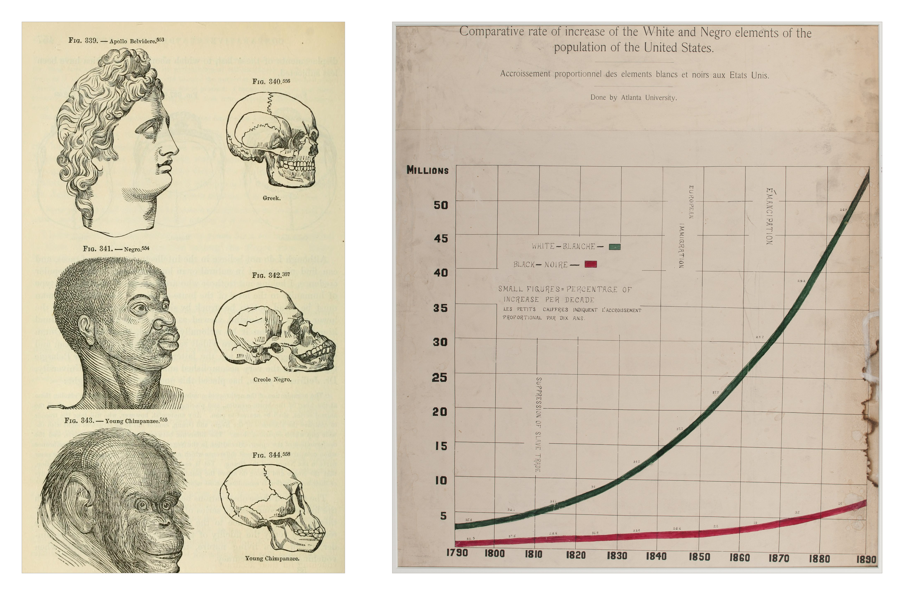
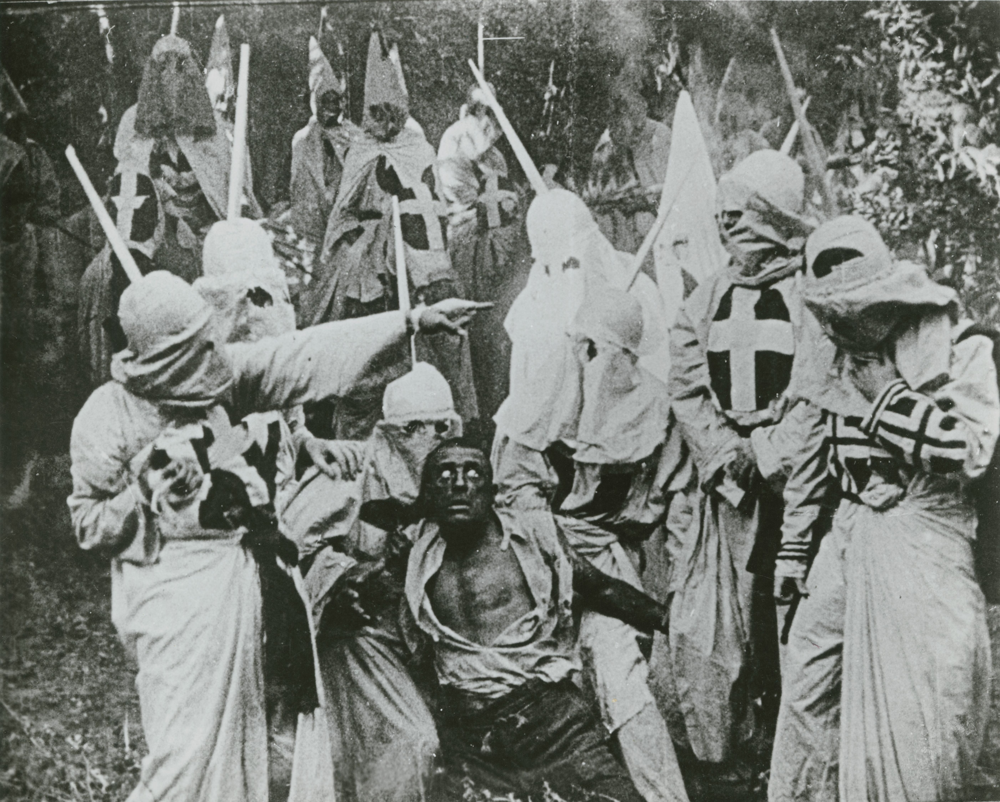
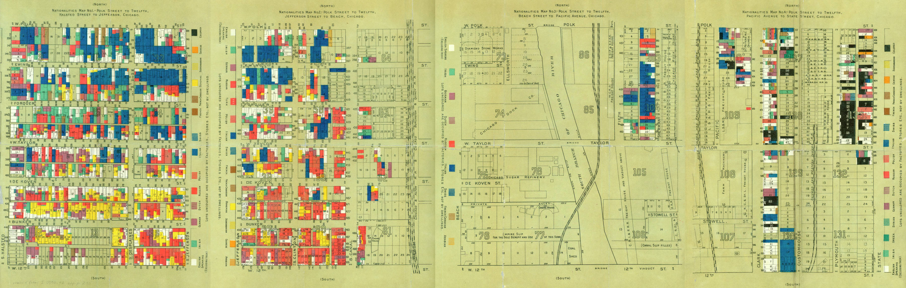
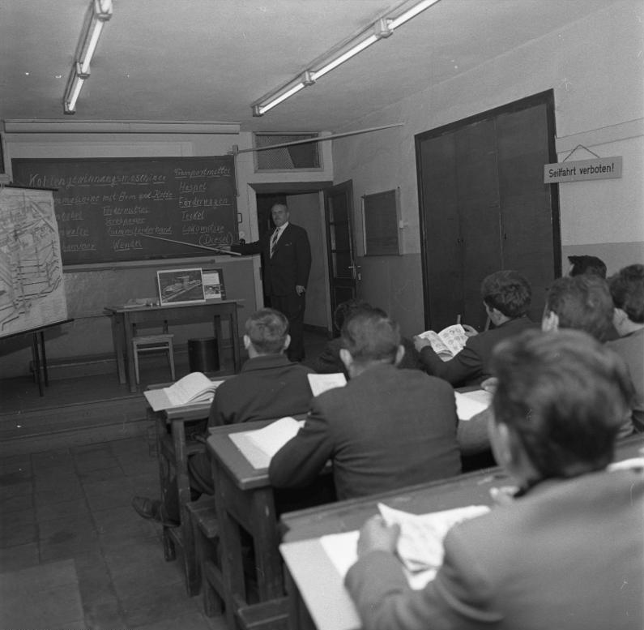
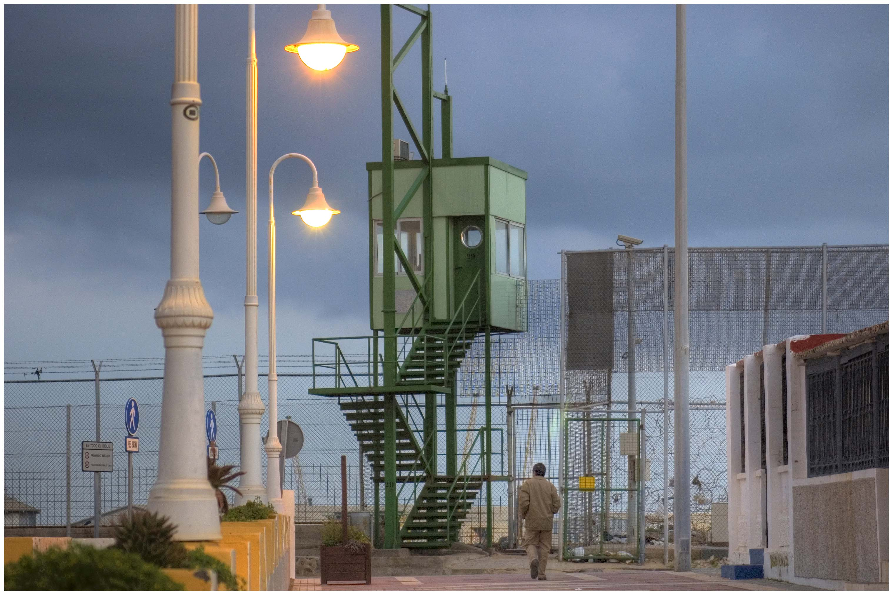

⚠️EN FASE ACTIVA DE DESARROLLO⚠️

Este capítulo examina cómo las diferencias étnicas, el origen y la condición de inmigrante han intervenido en la construcción de la mirada criminológica. El propósito de estas líneas no es estudiar si existen grupos humanos más proclives al delito, sino comprender cómo determinadas clasificaciones sociales han influido en las teorías criminológicas, en la producción de las estadísticas y en las prácticas de criminalización y selección.

A lo largo del capítulo se prestará especial atención a la relación entre conocimiento científico, desigualdad y control social. Se revisarán los antecedentes racistas de la Criminología, el desarrollo de la investigación sobre la raza y la delincuencia en Estados Unidos de América, los debates sobre inmigración y delincuencia, y las particularidades del contexto español.

La pregunta que sobrevuela a lo largo de este capítulo es de un calado importante: ¿qué ocurre cuando una característica social, como el origen nacional, la pertenencia étnica o la apariencia, se convierte en una explicación natural y recurrente de la delincuencia?

## Criminología y racismo

### El positivismo y la búsqueda del delincuente natural

La Criminología nació como disciplina científica en la segunda mitad del siglo XIX, estrechamente vinculada al desarrollo del positivismo y a un contexto histórico en el que las sociedades europeas experimentaban profundas transformaciones económicas, políticas y sociales. La industrialización, el crecimiento acelerado de las ciudades, la consolidación de los Estados modernos y la expansión de los imperios coloniales modificaron las relaciones entre grupos humanos y generaron nuevas formas de identificar, clasificar y gobernar a las poblaciones. En este contexto se desarrollaron también nuevos saberes destinados a observar, medir y ordenar diferencias entre los individuos y los grupos, otorgando a determinadas clasificaciones un creciente prestigio científico [@Mosse_20; @Smedley_12; @Weaver_22].

::: {#fig-raza-ciencia}

{width="100%" fig-alt="Montaje con dos láminas del siglo XIX puestas una al lado de la otra. La de la izquierda es una página impresa de un libro con seis grabados a línea dispuestos en dos columnas y tres filas: en la columna izquierda, de arriba abajo, la cabeza de perfil de una escultura clásica griega, la cabeza de un hombre negro dibujada con rasgos exagerados y la cabeza de un chimpancé joven; en la columna derecha, los cráneos correspondientes, rotulados como griego, negro criollo y chimpancé joven. La de la derecha es un gráfico estadístico dibujado a mano sobre papel crema, con el título en inglés y francés. Dos curvas gruesas, una verde y otra roja, ascienden desde 1790 hasta 1890 sobre una retícula: la verde, que representa a la población blanca, crece hasta superar los cincuenta millones; la roja, que representa a la población negra, apenas llega a los siete. Sobre la retícula hay rótulos verticales que señalan la supresión de la trata de esclavos, la inmigración europea y la emancipación."}

Dos usos de la ciencia, separados por cuarenta años. A la izquierda, la lámina de *Types of Mankind* (1854) alinea la cabeza y el cráneo de un Apolo griego, de un hombre negro y de un chimpancé joven para sugerir que la distancia entre los dos primeros equivale a la que separa al segundo del tercero. Aquí vemos reflejado un prejuicio social convertido en demostración anatómica. A la derecha, uno de los gráficos que W. E. B. Du Bois preparó para la Exposición de París de 1900, dibujado a mano en la Universidad de Atlanta, que compara el crecimiento de la población blanca y negra en Estados Unidos y anota sobre el eje los acontecimientos que lo explican: la supresión de la trata, la inmigración europea, la emancipación. Vemos como las mismas herramientas científicas (la medición, la comparación, el prestigio del método) se puden poner al servicio de tesis opuestas: una que naturaliza la jerarquía racial, mientras que la otra la trata de explicar por razones historicas.[^cred-raza]

:::

También se transformaron las formas de explicar las desigualdades y de justificar las relaciones de poder. La expansión colonial europea desempeñó un papel importante en la construcción de determinadas concepciones sobre la diversidad humana, al establecer categorías que distinguían entre poblaciones consideradas civilizadas y otras representadas como primitivas, salvajes o inferiores. Como señala @Smedley_98, la idea moderna de raza no procede de un descubrimiento científico, sino de una construcción histórica y cultural que fue adquiriendo significados asociados a la posición social, la ascendencia, la apariencia física y las relaciones de poder. En este proceso, la ciencia del momento contribuyó a dotar de legitimidad y apariencia de objetividad a clasificaciones que tenían también importantes implicaciones sociales y políticas.

En este contexto, las diferencias entre seres humanos comenzaron a ser objeto de una creciente atención científica. La anatomía, la antropología física, la historia natural y otras disciplinas trataron de describir, medir y ordenar la diversidad humana. La clasificación de las poblaciones en supuestas razas se incorporó así a determinados discursos científicos. Algunas de estas investigaciones contribuyeron al conocimiento de la variación biológica y cultural; otras, sin embargo, elaboraron jerarquías entre grupos humanos, presentándolas como si fueran diferencias naturales, permanentes y objetivamente demostrables. La Antropología desempeñó un papel especialmente relevante en este proceso, hasta el punto de que parte de su desarrollo histórico estuvo estrechamente vinculada al estudio científico de las diferencias raciales y a la utilización de poblaciones colonizadas como objeto de investigación [@Caspari_18; @Weaver_22].

Estas formas de clasificación no permanecieron al margen del nacimiento de la Criminología científica. La antropología criminal de finales del siglo XIX incorporó la idea de que determinados rasgos corporales podían revelar características morales, psicológicas o comportamentales. En la obra de Cesare Lombroso, en concreto en *L'uomo delinquente*, publicado inicialmente en 1876 [@Lombroso_76], el delincuente fue concebido como un sujeto biológicamente diferenciado, cuyos rasgos físicos podían interpretarse como signos de atavismo y predisposición al delito. De este modo, el cuerpo del supuesto delincuente se convertía en un objeto de observación, reforzando prejuicios previamente existentes hacia determinados grupos sociales [@Hikal_20]. La investigación histórica ha mostrado que las ideas de Lombroso sobre raza y delincuencia fueron complejas y cambiantes. No es adecuado reducir toda su obra a una única afirmación sobre la inferioridad racial, pero sí reconocer que su pensamiento se desarrolló en un contexto en el que las explicaciones evolucionistas y las clasificaciones raciales influían en la interpretación de las diferencias humanas. La Criminología positivista participó así en un espacio intelectual donde las fronteras entre biología, raza, degeneración y criminalidad podían aparecer estrechamente relacionadas.

Para comprender la relación entre Criminología y racismo es importante detenerse en comprender el alcance del concepto racismo. Este no consiste únicamente en afirmar que existen diferencias entre las personas o grupos sociales. El elemento fundamental aparece cuando esas diferencias se convierten en categorías humanas aparentemente naturales y se les atribuyen características esenciales, estables y transmisibles, asociadas al origen, la apariencia, la ascendencia o la pertenencia a un determinado grupo. Estas categorías pueden utilizarse entonces para establecer jerarquías, explicar desigualdades como si fueran consecuencia de características naturales y legitimar formas diferenciadas de control y exclusión [@Mosse_20].

Desde esta perspectiva, resulta especialmente relevante distinguir entre el estudio científico de la diversidad humana y el denominado racismo científico. No toda investigación sobre diferencias humanas es necesariamente racista. El problema aparece cuando las diferencias observadas o construidas se transforman en categorías jerárquicas, se presentan como esenciales e inmutables y se utilizan para explicar capacidades morales, intelectuales o comportamentales de grupos enteros. La historia de las ciencias humanas muestra precisamente cómo determinados conceptos y métodos científicos pudieron ser utilizados para convertir prejuicios sociales en afirmaciones aparentemente objetivas y, posteriormente, para legitimar políticas de segregación, exclusión o control [@Weaver_22].

Esta cuestión resulta particularmente importante para la Criminología porque uno de los rasgos característicos del positivismo criminológico fue precisamente la búsqueda de indicadores que permitieran identificar al individuo delincuente. La construcción de un tipo criminal a partir de características físicas, biológicas o culturales permitió desplazar la atención desde el acto cometido hacia la persona del autor de los hechos, pero también abrió la puerta a formas de clasificación de determinadas poblaciones como potencialmente peligrosas. Se consideraba que determinados grupos poseían características innatas que los hacían menos racionales, más violentos o incapaces de ajustarse a las normas sociales. El delito podía interpretarse entonces no como una conducta situada en un contexto social o institucional, sino como manifestación de una supuesta inferioridad del individuo o del grupo al que pertenecía.

Este enfoque derivó en varias consecuencias: La primera era la naturalización del delito. Si la conducta criminal se atribuía a una constitución hereditaria, variables como la pobreza, la exclusión, las desigualdades o las oportunidades sociales perdían importancia explicativa. La segunda consecuencia era que se naturalizaba la desigualdad. Si determinados grupos eran considerados biológicamente inferiores o más propensos a la desviación, la discriminación podía presentarse como una respuesta racional ante una supuesta amenaza.

Para la Criminología contemporánea, este episodio histórico ofrece una lección metodológica esencial. Antes de estudiar si una categoría está relacionada con la delincuencia, hay que preguntarse cómo se ha construido esa categoría, qué dimensiones incluye y qué procesos sociales han influido en su distribución.

### Desigualdad, discriminación y racialización

Durante el siglo XX las explicaciones biológicas de la delincuencia fueron perdiendo parte de su centralidad frente al desarrollo de perspectivas psicológicas, sociológicas y ambientales. La Criminología comenzó a prestar mayor atención a la socialización, estructura social, grupos de referencia, tipos de barrios, oportunidades sociales y respuestas institucionales.

Este desplazamiento no fue lineal ni significó la desaparición de las teorías biológicas. Tampoco supuso que todas las explicaciones sociales fueran automáticamente críticas con el racismo. Algunas teorías culturales o ambientales describieron a determinados grupos como desorganizados o incapaces de adaptarse a la sociedad dominante.

@DuBois_03 mostró tempranamente que las diferencias racializadas no podían comprenderse como atributos naturales de los grupos, sino en relación con las estructuras sociales y con las relaciones de poder que producen y mantienen la desigualdad. Su aportación resulta especialmente relevante para comprender que la pertenencia a un grupo social no es solamente una cuestión de identidad individual, sino también de cómo los demás perciben y clasifican a ese grupo.

[^cred-raza]: A la izquierda, lámina de Josiah Clark Nott y George Robins Gliddon, *Types of Mankind*, Filadelfia, 1854. A la derecha, *Comparative rate of increase of the White and Negro elements of the population of the United States*, de la serie preparada por W. E. B. Du Bois y la Universidad de Atlanta para la Exposición Universal de París de 1900. Library of Congress, LCCN 2013650372. Ambas en dominio público, vía [Wikimedia Commons](https://commons.wikimedia.org/wiki/File:Races_and_skulls.png) y [Wikimedia Commons](https://commons.wikimedia.org/wiki/File:A_series_of_statistical_charts_illustrating_the_condition_of_the_descendants_of_former_African_slaves_now_in_residence_in_the_United_States_of_America_LCCN2013650372.jpg).

Posteriormente, @Bourdieu_86 explicó cómo las desigualdades se reproducen a través de la distribución desigual de diferentes formas de capital no solo económico, sino también cultural, social y simbólico. Su distribución condiciona las posiciones que ocupan los individuos en el espacio y contexto social. Desde esta perspectiva, las trayectorias migratorias no tienen garantizado el éxito o reconocimiento social solo por disponer de una determinada cualificación profesional. Son las redes sociales o el reconocimiento colectivo de una determinada identidad la que facilita o dificulta el acceso a recursos y oportunidades. Por tanto, la posición social de una persona migrante depende tanto de los recursos que posee como del valor que esos recursos adquieren en el contexto de acogida.

La desigualdad puede verse reforzada, además, cuando las diferencias de origen nacional, apariencia física, religión o cultura son utilizadas para establecer fronteras de alteridad. La literatura especializada [véase, entre otros, @Smedley_05; @Yudell_16; @Ifekwunigwe_17] ha demostrado que la raza es una categoría social construida, y no una realidad biológica objetiva, que adquiere efectos materiales y simbólicos. Los procesos de racialización consisten precisamente en atribuir a determinados grupos características supuestamente naturales, homogéneas o permanentes para establecer diferencias jerárquicas entre grupos sociales. De ahí que personas procedentes de otros países puedan ser percibidas socialmente como pertenecientes a una misma categoría racial o cultural. Así, la discriminación se puede producir de forma directa cuando una persona recibe un trato desfavorable por su origen, nacionalidad o etnia, pero también puede adoptar formas más indirectas y estructurales. Las instituciones y organizaciones pueden aplicar reglas aparentemente neutrales que producen efectos desiguales sobre determinados grupos. Por ello, es especialmente importante a la hora de interpretar las estadísticas oficiales de delincuencia examinar no solo cómo funcionan las instituciones del control social formal, sino también los mercados de trabajo, los sistemas educativos y de protección de infancia, el acceso a la vivienda, etc. y si determinados grupos se encuentran sistemáticamente en posiciones desventajosas.

En esta línea, @Wacquant_07 analiza la marginalidad urbana y muestra cómo determinados grupos socialmente desfavorecidos pueden quedar concentrados en espacios caracterizados por la precariedad, la segregación residencial y una fuerte estigmatización. Aunque su obra no se centra en el estudio de las migraciones, resulta especialmente útil para comprender que las desventajas de determinados grupos migrantes pueden acumularse: una posición laboral precaria puede relacionarse con dificultades de acceso a la vivienda; estas pueden favorecer la concentración en barrios de renta más baja; y esa concentración puede contribuir, a su vez, a la construcción de imágenes negativas sobre quienes viven en ellos.

La cuestión de la estigmatización resulta especialmente importante. El estigma no describe simplemente una característica de una persona o grupo, sino que implica un proceso mediante el cual determinadas características son socialmente definidas como negativas y terminan afectando a la identidad y a las oportunidades. En el caso de las poblaciones migrantes, categorías como "irregular", "extranjero", "inmigrante" o incluso determinadas nacionalidades (marroquí) o ciertas religiones (musulmana) pueden adquirir significados sociales que exceden su contenido jurídico o descriptivo, y que dependen también de relaciones condicionadas geopolíticamente. La etiqueta condiciona la percepción social y las expectativas sobre su comportamiento.

Efectivamente, la dimensión geopolítica contribuye, además, a dotar de determinados significados a las anteriores categorías. Las relaciones entre Estados, los conflictos internacionales, las políticas de seguridad y control de frontera y los discursos sobre terrorismo y amenazas transnacionales pueden reforzar asociaciones entre determinados orígenes nacionales, territorios o adscripciones religiosas y la idea de riesgo o peligrosidad. Como señaló @Tesfahuney_98, los regímenes contemporáneos de movilidad y control fronterizo no pueden entenderse al margen de las relaciones geopolíticas y de los procesos de racialización que determinan quién es percibido como legítimo sujeto de movilidad y quien queda situado bajo sospecha. En esta misma línea, @Huysmans_00 mostró que la migración fue progresivamente construida en el ámbito europeo como una cuestión de seguridad, vinculándola con preocupaciones relativas al orden público, la identidad y la amenaza. Esta securitización puede proyectarse sobre determinados grupos y producir asociaciones entre origen, religión, movilidad y peligrosidad que exceden ampliamente el contenido jurídico de las categorías migratorias. De este modo, acontecimientos y dinámicas que se producen en el ámbito internacional pueden proyectarse sobre personas migrantes en los contextos de recepción, condicionando la manera en que son percibidas y tratadas con independencia de sus trayectorias individuales. Así, la representación social de determinadas nacionalidades o de personas identificadas como musulmanas no se construye únicamente a partir de las experiencias de convivencia cotidiana, sino que puede estar atravesada por imaginarios geopolíticos en los que determinados territorios aparecen vinculados al conflicto, la inseguridad y la amenaza [@Bigo_02]. La estigmatización opera por tanto también como un mecanismo mediante el cual las fronteras y jerarquías internacionales se reproducen en el espacio social interno, influyendo en las expectativas sobre determinados grupos y, potencialmente, en las prácticas institucionales dirigidas hacia ellos, conectando explícitamente el control fronterizo, la securitización y la producción de sospecha racializada [@Molnar_26].

Junto con lo anterior, la Sociología de las Migraciones ha mostrado, además, que las desigualdades en el contexto de llegada no afectan por igual a todas las personas migrantes. Resulta especialmente relevante analizar la heterogeneidad interna de las poblaciones migrantes y la interacción entre clase social, género, origen, estatus jurídico y otros factores en la configuración de sus experiencias [@Gold_04]. No existe una única experiencia migratoria. La situación de una persona con nacionalidad extranjera altamente cualificada, recursos económicos y una situación administrativa estable puede ser muy diferente de la de una persona con escasos recursos, empleo precario y una situación administrativa insegura, aunque ambas hayan migrado desde otro país. Por tanto, la interacción entre las diferentes dimensiones puede generar experiencias específicas de inclusión o exclusión.

De ahí que la pregunta que a la Criminología le debe interesar es qué inmigrantes, en qué contextos, respecto de qué institución o ámbito social y a través de qué mecanismos están siendo discriminados. Esto es especialmente relevante porque las mismas categorías sociales que producen desigualdad pueden intervenir en procesos de definición de la desviación y del delito. La alteridad (o construcción del otro) puede contribuir a generar determinadas representaciones sociales de peligrosidad, sospecha o riesgo. De ahí que el estudio de la inmigración y la delincuencia no deba limitarse a preguntar si las personas migrantes delinquen más o menos, sino que debe examinar cómo determinadas poblaciones son seleccionadas, vigiladas, identificadas y tratadas por las instituciones del control social. La cuestión se traslada desde considerar el origen de la persona como causa de la delincuencia hacia los procesos mediante los cuales la sociedad y sus instituciones producen diferencias y la gestionan.

### Recapitulación

El desarrollo de la genética, la antropología y las ciencias sociales durante el siglo XX contribuyó a cuestionar las concepciones raciales rígidas. La investigación mostró la complejidad de la variación humana y la imposibilidad de establecer una correspondencia simple entre categorías raciales, capacidades individuales y comportamientos.

Las categorías étnicas no son irrelevantes en la vida social. Pueden influir en las oportunidades, en la discriminación, en la identidad, en las relaciones institucionales y en las experiencias de victimización. Pero que una categoría tenga consecuencias sociales no significa que constituya una explicación del delito.

Esta distinción es central para la Criminología. El origen o la pertenencia étnica pueden ser relevantes para estudiar la desigualdad en el acceso a recursos, la exposición a la violencia, la selección policial o la experiencia en el sistema penal. No son, en ningún caso, indicadores de una predisposición delictiva. En consecuencia, la Criminología no debe limitarse a rechazar antiguas teorías racistas, sino que debe estudiar también cómo sus presupuestos pueden reaparecer bajo formas aparentemente neutrales: en la selección de muestras, en la interpretación de las estadísticas, en la utilización de categorías nacionales o en la formulación de hipótesis que dan por supuesta la peligrosidad de determinados grupos.

La revisión histórica permite, por tanto, identificar la existencia de un problema que se arrastra de antaño y es la tendencia a explicar la delincuencia a partir de características atribuidas al grupo en lugar de analizar las relaciones entre individuos, estructuras sociales e institucionales.

## La criminología estadounidense, la inmigración y la cuestión racial

La Criminología estadounidense ha prestado una especial atención a las diferencias existentes entre grupos de población y, entre ellas, a las relacionadas con el origen nacional, la inmigración y la raza. Estas cuestiones aparecen con frecuencia estrechamente conectadas, hasta el punto de que determinados grupos de inmigrantes han sido también racializados y determinadas categorías raciales se han construido históricamente en relación con procesos migratorios. Sin embargo, resulta útil abordar ambas dimensiones de manera diferenciada. La condición de inmigrante no constituye una categoría racial en sí misma: las poblaciones inmigrantes han presentado y presentan una gran diversidad racial, étnica y nacional, mientras que la racialización afecta también a personas nacidas en Estados Unidos y, por tanto, no puede explicarse únicamente a partir de la experiencia migratoria. Separar analíticamente ambas cuestiones permite, por ello, comprender mejor qué tipo de diferencias han tratado de explicar las investigaciones criminológicas y qué mecanismos sociales se encuentran detrás de ellas.

::: {#fig-birth}

{width="100%" fig-alt="Fotograma en blanco y negro de una película muda de 1915. En un claro arbolado, una veintena de hombres cubiertos con túnicas y capuchas blancas del Ku Klux Klan, algunas con cruces cosidas al pecho, rodean a un hombre que está en el suelo, semiincorporado, con la camisa desgarrada y el rostro pintado de negro. El hombre mira hacia arriba con expresión de terror. Dos de los encapuchados lo sujetan por los brazos; otro, en el centro de la imagen, extiende el brazo y lo señala con el dedo. Varios sostienen astas en alto. La escena está compuesta de modo que el hombre en el suelo ocupa el centro exacto del encuadre."}

Fotograma de *El nacimiento de una nación* (D. W. Griffith, 1915): encapuchados del Ku Klux Klan rodean al personaje de Gus momentos antes de lincharlo. Gus, el hombre cuya supuesta agresión a una mujer blanca justifica el linchamiento en la trama, está interpretado por Walter Long, **un actor blanco maquillado de negro**. Vemos como el "negro peligroso" que la película fija en el imaginario popular no retrata a nadie, es una actuación. La a película se basa en *The Clansman*, la novela que Thomas Dixon publicó en 1905, y que fue el mayor éxito comercial del cine estadounidense de su tiempo. Vemos con ese caso como primero se construye la amenaza, y después el linchamiento se presenta como protección y como justicia. Este es el tipo de mecanismos que interesa a la Criminología. Vemos cómo se fabrica al otro peligroso y con ello se autoriza la violencia contra él, que es lo que la cámara muestra sin pudor porque en 1915 no había nada que ocultar. Este no es un film de denuncia del racismo, es más, hay quien asocia las imágenes, vestimenta y rituales del Clan ofrecidas en la película como elementos culturales que sirvieron de inspiración al Clan en la vida real. Las imagenes y su relato dieron, de hecho, lugar a protestas sociales y a una campaña iniciada por la revista de Du Bois en contra de la película [^cred-birth]

:::

[^cred-birth]: Fotograma de *The Birth of a Nation*, dirigida por D. W. Griffith, 1915. Obra publicada en Estados Unidos antes de 1929 y, por tanto, en dominio público. Vía [Wikimedia Commons](https://commons.wikimedia.org/wiki/File:Birth-of-a-nation-klan-and-black-man.jpg).

Esta distinción resulta especialmente importante para comprender la evolución de la Criminología estadounidense. Por una parte, el estudio de la inmigración y la delincuencia se ha ocupado de determinar si existen diferencias en los niveles de delincuencia de las poblaciones inmigrantes y de explicar, cuando se observan, a qué pueden deberse. Por otra, el estudio de la cuestión racial ha abordado las diferencias atribuidas a grupos racializados, así como el papel que han desempeñado las ideas sobre raza en la producción del conocimiento criminológico, en la definición del delito y en las respuestas del sistema de justicia penal. Ambos campos se encuentran en numerosos momentos históricos (y, en ocasiones, resulta imposible comprender uno sin hacer referencia al otro), pero plantearlos separadamente permite mostrar que inmigración y raza son categorías distintas, aunque puedan confluir y reforzarse mutuamente en determinados contextos.

### Inmigración y delincuencia

La relación entre inmigración y delincuencia constituye uno de los ejemplos más interesantes de cómo una cuestión criminológica puede transformarse profundamente cuando cambia la forma de formularla e investigarla. Durante buena parte de los siglos XIX y XX, en Estados Unidos se extendió la idea de que la llegada de inmigrantes constituía un problema para el orden social y que los inmigrantes presentaban una mayor propensión a la delincuencia. Esta asociación fue asumida durante mucho tiempo como algo evidente. La investigación criminológica se dedicó, por ello, a explicar por qué los inmigrantes delinquían más, y no se preguntaron si realmente delinquían más que la población autóctona. Posteriores trabajos históricos muestran, sin embargo, que muchas de aquellas primeras conclusiones estaban condicionadas por la calidad de los datos disponibles, por la composición demográfica de las poblaciones comparadas y por las propias categorías sociales y raciales con las que se identificaba a los inmigrantes [@Bodenhorn_10; @Moehling_09].

La preocupación por la supuesta delincuencia extranjera se remonta, al menos, a mediados del siglo XIX. Las sucesivas oleadas migratorias fueron acompañadas de discursos que atribuían a los recién llegados determinados problemas sociales: pobreza, desorden urbano, alcoholismo, violencia y delincuencia. Durante la gran inmigración procedente de Europa meridional y oriental a finales del siglo XIX y comienzos del siglo XX, como italianos o irlandeses, entre otros, fueron representados en diferentes momentos como poblaciones difíciles de asimilar y potencialmente peligrosas. Esta preocupación no quedó limitada a un debate político o mediático, sino que penetró también en las primeras investigaciones académicas sobre inmigración y delincuencia [@Pendergast_18].

Un aspecto importante para comprender este periodo es que las primeras estadísticas de delincuencia parecían confirmar que los inmigrantes eran más delincuentes porque aparecían sobrerrepresentados en determinados registros policiales, judiciales o penitenciarios. Más adelante se comprendió que comparar directamente el número de extranjeros en prisión con el número de personas nacidas en el país podía resultar falaz. Las poblaciones inmigrantes solían tener una composición etaria y por sexo diferente a la población nativa, concentrarse en grandes ciudades y asentarse con frecuencia en zonas precarias. Y se descubrió que cuando se tienen en cuenta esas diferencias, algunas de las supuestas distancias entre inmigrantes y nativos disminuyen considerablemente. Bodenhorn y colegas [-@Bodenhorn_10], al revisar los datos de las prisiones de Pensilvania durante la gran inmigración del siglo XIX, muestran precisamente que la diferencia bruta entre población extranjera y autóctona se reduce al controlar variables como la edad o el sexo. También encuentran que la concentración urbana explica una parte sustancial de las diferencias que se observaron entonces.

Esta cuestión es especialmente relevante porque permite comprender un problema básico de la investigación criminológica: una correlación observada entre dos fenómenos no demuestra que uno sea la causa del otro. Si los inmigrantes viven mayoritariamente en grandes ciudades y estas presentan mayores tasas de delincuencia, no podemos concluir automáticamente que la inmigración produzca delincuencia. Puede ocurrir que sea el contexto urbano, la pobreza, la desigualdad, la cultura, la discriminación, la edad de la población o las condiciones de vida lo que explique una parte importante de la supuesta diferencia.

Una de las primeras explicaciones a esa supuesta mayor implicación de los inmigrantes en la delincuencia vino de la mano de @Sellin_38, quien planteó que la delincuencia podía aparecer cuando las normas de diferentes grupos culturales entraban en conflicto. En la sociedad receptora, una conducta considerada normal o legítima dentro de un determinado grupo podría entrar en contradicción con las normas jurídicas dominantes [véase @GarciaEspana_18]. El interés de esta perspectiva reside en que vuelve a desplazar la atención desde las características de peligrosidad del inmigrante hacia la interacción entre diferentes sistemas normativos. Así, era posible comprender que las personas migrantes fueran más delincuentes al encontrarse atrapados entre diferentes sistemas normativos y expectativas sociales. Sellin no pudo demostrar empíricamente estas hipótesis planteadas, desechándose como teoría explicativa general de la delincuencia cometida por la población migrante.

La incuestionada relación entre inmigración y delincuencia a mediados del siglo XX en Estados Unidos llevó a la Escuela de Chicago, una vez superadas las teorías biológicas, a buscar explicaciones en los barrios urbanos en los que se concentraban los inmigrantes, así como las transformaciones que experimentaban las ciudades estadounidenses. Hay que recordar que Chicago se caracterizó entonces por el aumento exponencial de población inmigrante en apenas 40 años, partiendo de medio millón de habitantes en 1880 y alcanzando, tras una importante oleada de inmigración, más de dos millones de habitantes en 1920. De estos, el 50% eran inmigrantes recién llegados o descendientes de estos. La ciudad no creció urbanísticamente al ritmo de la población, creando un ambiente social y físico en determinados espacios urbanos que concentraban altos índices de delincuencia. Esta transformación permitió desarrollar explicaciones basadas en la desorganización, la pobreza, la movilidad residencial y la falta de mecanismos de control comunitario. Desde esta perspectiva, los elevados niveles de delincuencia observados en determinados barrios de inmigrantes podían atribuirse a las condiciones sociales de esos barrios y no a una supuesta predisposición del grupo inmigrante. Es decir, la explicación de la supuesta relación entre inmigración y delincuencia podía encontrarse en el contexto y no en el origen nacional de sus habitantes. Esta perspectiva, sin embargo, conservó durante algún tiempo la idea de que la inmigración podía generar desorganización social: la llegada rápida de población nueva, la heterogeneidad cultural y la movilidad residencial podían debilitar los vínculos comunitarios y con ello favorecer la delincuencia.

{#fig-hullhouse width="90%"}

Los estudios llevados a cabo por la Escuela de Chicago proporcionaron grandes aportaciones al conocimiento científico-social en relación con la delincuencia de los inmigrantes. Entre ellas, impulsó un análisis subcultural de los comportamientos delictivos atendiendo a los estilos de vida de las minorías étnicas; y planteó la necesidad de estudiar el desplazamiento del delito tras una intervención social y urbanística. No obstante, no se han podido verificar conexiones causales inequívocas entre la delincuencia y los índices de desorganización social de una determinada zona de la ciudad, en el sentido de que no se sabe si un determinado espacio produce delincuencia o si tan solo es un espacio que atrae a individuos que terminan participando en la delincuencia del barrio.

Durante el siglo XX fueron desarrollándose diferentes explicaciones a la supuesta relación entre inmigración y delincuencia. @Martinez_04 hicieron una revisión de ellas e identificaron tres grandes perspectivas que dominaron la literatura estadounidense de la época: La estructura de oportunidades (oportunidad diferencial) ponía el acento en las oportunidades económicas y sociales disponibles y al alcance de las personas migrantes; el enfoque cultural se centraba en los procesos de conflicto o adaptación cultural; y la desorganización social se enfocaba en las características de las comunidades y barrios en los que se producía el asentamiento de la población recién llegada [desarrolladas en @GarciaEspana_18]. Es importante observar que, aunque estas teorías eran diferentes, todas ellas partían de la existencia de una relación entre inmigración y delincuencia y trataban de explicar sus mecanismos.

A finales del siglo XX comenzó a producirse un cambio metodológico decisivo: la pregunta dejó de ser únicamente qué teoría podía explicar la delincuencia de los inmigrantes y pasó a formularse si los inmigrantes realmente presentaban mayores niveles de delincuencia que los nativos estadounidenses. Este cambio obligó a revisar críticamente buena parte de las aportaciones y conclusiones anteriores. @Hagan_99 analizaron las estadísticas penitenciarias y concluyeron que ofrecían una imagen distorsionada de la delincuencia de los inmigrantes. Los inmigrantes hispanos eran, en muchos casos, jóvenes y varones, dos características asociadas estadísticamente con una mayor probabilidad de contacto con el sistema penal. Además, podían estar sometidos a formas más intensas de control y procesamiento penal. Cuando estas circunstancias se tenían en cuenta, la supuesta mayor delincuencia de los inmigrantes perdía buena parte de su consistencia.

La investigación histórica posterior ha reforzado esta necesidad de revisar los datos utilizados en el pasado para construir la imagen del "inmigrante delincuente". @Moehling_09, al volver a analizar los datos utilizados en investigaciones a lo largo del siglo XX, encontraron que las conclusiones a las que llegaron estaban afectadas por problemas de agregación y por la ausencia de denominadores poblacionales adecuados. Sus resultados muestran que en 1904 las tasas de ingreso en prisión por delitos graves eran bastante similares entre población inmigrante y nativa para la mayoría de las edades y que hacia 1930 los inmigrantes eran incluso menos propensos que los nativos a ingresar en prisión a partir de determinadas edades. Es decir, la revisión histórica no respalda la idea de que la inmigración provocara un aumento general de la delincuencia. En cambio, resulta todavía más evidente cuando se estudia la inmigración posterior a 1965. Las investigaciones realizadas a finales del siglo XX y comienzos del siglo XXI han encontrado repetidamente que la presencia de inmigrantes no se asocia necesariamente con mayores tasas de delincuencia y que, en determinados contextos, puede incluso asociarse con tasas inferiores. Así, @Lee_01 analizaron barrios de Miami, El Paso y San Diego y encontraron que, una vez controladas otras variables relevantes, la inmigración no incrementaba la delincuencia grave medida a través de la tasa de homicidios. Los resultados de esta investigación empírica cuestionaban tanto la imagen del inmigrante como sujeto inherentemente peligroso como la idea de que la inmigración producía necesariamente desorganización social y delincuencia.

En esta misma línea, @Lee_02, al estudiar el caso de Miami, comprobaron que la inmigración reciente no estaba asociada con mayores niveles de homicidios. Sus resultados llegaron a reconsiderar una de las premisas de la teoría de la desorganización social: que la llegada de inmigrantes y la heterogeneidad étnica no tenían por qué debilitar necesariamente el control social del lugar de asentamiento. En determinadas circunstancias podían incluso contribuir a revitalizar las comunidades y generar recursos sociales y económicos que actuaran como mecanismos protectores frente a la delincuencia.

Este cambio de perspectiva puede resumirse en una idea sencilla: no basta con saber cuántos inmigrantes viven en un lugar para explicar su delincuencia, hay que conocer también cómo es ese lugar, qué oportunidades ofrece, qué relaciones comunitarias existen y cómo se produce la incorporación de los inmigrantes a la sociedad receptora (o cómo la sociedad receptora los acoge). Por ello, la investigación contemporánea presta más atención a los contextos sociales de acogida.

Uno de los hallazgos más interesantes de investigaciones posteriores tuvo que ver con el hecho de que determinados inmigrantes de origen latino que se encontraban en situaciones de clara desventaja social y económica tenían niveles de delincuencia y comportamientos problemáticos inferiores a los esperados según esas condiciones de vida. La comparación entre inmigración y delincuencia con la población latina en Estados Unidos dio como resultado una relación negativa y con ello a lo que se denominó "la paradoja latina". @Sampson_08 utilizó esta idea para plantear una revisión de la relación entre inmigración y delincuencia. Consideró que, si la inmigración condujera necesariamente a la delincuencia, cabría esperar tasas especialmente elevadas entre poblaciones que viven en condiciones desfavorables y de exclusión; sin embargo, numerosos estudios encuentran precisamente lo contrario o, al menos, ausencia de la relación esperada.

@Martinez_06 revisó la investigación criminológica relativa a la inmigración. Recopilaron investigaciones que examinan distintos grupos de inmigrantes y diferentes formas de delincuencia, mostrando que los resultados no sostienen una relación intrínseca entre inmigración y delincuencia. La atención la desplazan hacia cuestiones como la concentración de inmigrantes, los recursos comunitarios, las características de los barrios, las relaciones familiares, la discriminación, la victimización y las formas de control social. Esta mirada permite entender que la inmigración puede tener efectos diferentes según el contexto en el que se produzca.

Una investigación especialmente ilustrativa es la realizada por @Martinez_10 sobre la relación entre inmigración y delincuencia en las áreas metropolitanas estadounidenses. Utilizando los datos del Censo de población de 2000 y de informes oficiales sobre delincuencia analizaron una amplia muestra de áreas metropolitanas y, después de controlar diferentes características demográficas y económicas, encontraron que la inmigración no incrementaba las tasas de delincuencia y que algunos aspectos de la inmigración estaban asociados con una reducción de determinados delitos.

Como complemento a la idea anterior, @Portes_14 ponen el acento en el hecho de que la inmigración hacia Estados Unidos no puede entenderse como un fenómeno homogéneo ni como la simple llegada de individuos que posteriormente se incorporan de una misma manera a la sociedad estadounidense. Las experiencias de los inmigrantes, según estos autores, están condicionadas por su origen, momento histórico de llegada, características del mercado de trabajo, los lugares de asentamiento, las redes sociales y comunitarias y las políticas e instituciones con las que se encuentran. Por ello, las trayectorias de integración y adaptación son muy diversas entre grupos de inmigrantes y sus descendientes. En particular, los autores destacan que las experiencias de los descendientes de inmigrantes, a los que ellos llaman "segunda generación" tampoco siguen necesariamente un único proceso de asimilación, sino que pueden producirse trayectorias diferentes en función de las condiciones sociales y oportunidades familiares y comunitarias en la que crecen los hijos de los inmigrantes. La categoría inmigrante agrupa poblaciones muy diversas y, por tanto, no permite por sí sola explicar comportamientos sociales como la delincuencia.

La misma conclusión general aparece en la revisión sistemática realizada posteriormente por @Ousey_18. Estos autores analizaron las investigaciones macro-sociales publicadas entre 1994 y 2014 y combinaron una revisión narrativa de dichos estudios con un metaanálisis. Su conclusión es particularmente importante porque no procede de un único estudio, sino que considerando conjuntamente la investigación empírica disponible llegan a la conclusión de que la asociación media entre inmigración y delincuencia es negativa, aunque muy débil, y que existe una considerable variación dependiendo del diseño de la investigación, la forma de medir la delincuencia, la unidad de análisis, el periodo estudiado y el contexto geográfico.

Esto último es importante para evitar afirmaciones simplistas. La investigación contemporánea no demuestra que la inmigración reduzca siempre la delincuencia, del mismo modo que la investigación anterior tampoco llegó a demostrar correctamente que la población inmigrante delinquiera más. El resultado del metanálisis realizado por esos autores muestra que no existe una relación necesaria ni universal entre inmigración y delincuencia. En algunos contextos la asociación es nula; en otros puede ser negativa; y las diferencias dependen de múltiples elementos del contexto de asentamiento, las condiciones de inclusión y las formas en que se miden la inmigración y la delincuencia.

Durante mucho tiempo la Criminología se preguntó por qué los inmigrantes delinquen más. Después comenzó a preguntarse si los inmigrantes realmente delinquen más. La investigación más reciente ha añadido una tercera pregunta relacionada con qué condiciones sociales hacen que la relación entre inmigración y delincuencia sea diferente según los contextos. Este último cambio es fundamental porque permite abandonar una explicación basada en las supuestas características de peligrosidad de los inmigrantes, para estudiar los procesos sociales, legales e institucionales que facilitan o dificultan la inclusión de las personas migradas.

En definitiva, la historia de la investigación criminológica estadounidense sobre inmigración y delincuencia muestra que la Criminología puede reproducir inicialmente las categorías, prejuicios y preocupaciones de su tiempo y, posteriormente revisarlas mediante mejores técnicas estadísticas y diseños metodológicos. La imagen del inmigrante como sujeto potencialmente delincuente fue durante décadas una premisa que orientó tanto las explicaciones como la interpretación de las estadísticas. Sin embargo, cuando los investigadores comenzaron a controlar la edad, el sexo, la composición de las poblaciones, las características de los barrios y las condiciones sociales de acogida, aquella relación dejó de aparecer como evidente. Los resultados acumulados durante las últimas décadas en Estados Unidos apuntan a que la persona inmigrante no constituye por sí mismo un factor criminógeno. Para comprender la delincuencia es necesario analizar prejuicios, oportunidades, relaciones sociales, discriminación y racismo institucional, es decir, las respuestas institucionales a las personas atravesadas por un proyecto migratorio.

En las últimas décadas ha adquirido especial relevancia en la literatura criminológica estadounidense otra línea de investigación que ha girado en torno al concepto de *crimmigration*, acuñado por @Stumpf_06. Este término describe la progresiva convergencia entre las políticas de inmigración y las políticas de control del delito. El término permite identificar un proceso por el que instrumentos, lógicas y categorías propios del sistema penal pasan a incorporarse a la gestión de la inmigración, al tiempo que determinadas medidas de naturaleza administrativa adquieren rasgos y efectos próximos a los de la intervención penal. Más que ante una simple yuxtaposición de dos ámbitos de actuación estatal, nos encontramos ante un proceso de progresiva difuminación de las fronteras entre el control migratorio y el control penal. La aportación específica del concepto de *crimmigration* reside, por tanto, menos en haber identificado un fenómeno completamente novedoso que en haber proporcionado un marco capaz de integrar y dotar de coherencia a distintas transformaciones de las políticas contemporáneas de inmigración y control. Desde esta perspectiva crítica, el concepto permite analizar cómo determinadas respuestas frente a la inmigración irregular incorporan mecanismos de carácter excepcional y cómo, a través de ellos, se produce una progresiva asociación entre inmigración, irregularidad y peligrosidad. 

### La cuestión racial

La cuestión racial en la Criminología se comprende mejor si se conecta con un debate más amplio sobre la construcción social y científica de las categorías raciales. Las clasificaciones de las poblaciones humanas elaboradas durante los siglos pasados no se limitaron a describir diferencias físicas, sino que se asociaron a diferencias morales, intelectuales y comportamentales, y se establecieron jerarquías entre poblaciones [@Saini_19]. De hecho, @Portes_14 refieren a la obra de Madison Grant [-@Grant_16], un abogado neoyorquino y escritor cuyas teorías se basaban en las diferencias biológicas entre grupos humanos. Grant sostenía que las poblaciones europeas podían dividirse en diferentes grupos raciales, principalmente nórdicos, alpinos y mediterráneos, y consideraba que la raza nórdica es un grupo humano superior en contraposición a la raza mediterránea. Por eso consideraba especialmente preocupante la llegada de inmigrantes procedentes del sur y del este de Europa, especialmente italianos, a los que vinculaba con problemas sociales y delincuencia. @Portes_14 apuntan a que casi nueve décadas después surge de nuevo preocupaciones similares, pero en este caso poniendo en el foco de la amenaza a los inmigrantes mexicanos. Aunque los contextos históricos y los argumentos empleados son diferentes, ambos ejemplos permiten observar que determinados procesos migratorios han sido interpretados históricamente desde categorías de diferencia y amenaza.

![Mapa de *The Passing of the Great Race* [@Grant_16], que clasificaba a las poblaciones europeas en "razas" nórdica, alpina y mediterránea. Un ejemplo de racismo científico aplicado al debate migratorio. Dominio público, vía Wikimedia Commons.](images/diferencias_grant_mapa.jpg){#fig-grant width="70%"}

Sobre ese particular hay que hacer una advertencia epistemológica y es que encontrar diferencias entre grupos no significa que esas diferencias sean necesariamente naturales, innatas o genéticas. Una diferencia observada puede ser consecuencia de las condiciones sociales en las que viven los grupos, de las oportunidades de las que disponen, de la forma en la que son tratados por las instituciones y de la manera en que los propios datos estadísticos se producen [@Saini_19]. Esta cuestión resulta particularmente importante cuando se estudia la relación entre raza y delincuencia. Si la información disponible procede fundamentalmente de registros policiales, judiciales o penitenciarios, las estadísticas no constituyen un reflejo directo de toda la delincuencia existente en la sociedad. Antes de que un comportamiento llegue a formar parte de una estadística oficial debe producirse una cadena de decisiones institucionales: alguien debe detectarlo, interpretarlo como conflictivo o delictivo, identificar a una persona como posible responsable, intervenir, detenerla e investigarla y, posteriormente, decidir si el caso será procesado y con qué resultado. Por ello, las estadísticas oficiales constituyen también el resultado de un proceso de selección institucional.

De ahí que la investigación criminológica en la cuestión racial haya transitado, al igual que en el caso anterior de inmigración y delincuencia, desde la pregunta por las características raciales de los grupos que están más sobrerrepresentadas en las estadísticas criminales, hasta progresivamente plantearse la cuestión de hasta qué punto esas diferencias raciales en el sistema penal son también el resultado de la manera en que las instituciones de control identifican, seleccionan y procesan a las personas racializadas. Si estudios previos consideraron que las diferencias delictivas observadas por los registros oficiales de delincuencia obedecían a categorías naturales propias de ciertas razas - para contextualizar el debate, véase @Walsh_11 -, el sistema penal por el contrario puede convertir determinadas razas o etnias en diferencias estadísticas de delincuencia a través de sus propias prácticas de vigilancia, control y selección.

La investigación criminológica estadounidense en el último siglo ha prestado especial atención a la primera fase del proceso penal, la actuación policial. La policía no puede controlar todos los comportamientos infractores ni a todas las personas por igual. Debe decidir dónde concentrar sus recursos, qué conductas considera sospechosas y qué personas son objeto de intervención. En consecuencia, la población que aparece en las estadísticas de detenciones constituye ya una población seleccionada.

Es precisamente en Estados Unidos donde la investigación empírica sobre la existencia de sesgos raciales en los procesos de selección policial constituye uno de los principales campos de estudio. Desde finales del siglo XX, numerosos trabajos, algunos de ellos se exponen a continuación, han analizado si las personas pertenecientes a grupos racializados son objeto de controles policiales con mayor frecuencia que las personas blancas y, especialmente, si estas diferencias pueden explicarse exclusivamente por factores relacionados con la delincuencia, el comportamiento individual o el contexto territorial. La cuestión resulta especialmente relevante desde la perspectiva de la selección institucional, porque la policía constituye la puerta de entrada principal al sistema de justicia penal. Por tanto, cualquier diferencia sistemática en estas decisiones puede contribuir a producir desigualdades posteriores en el sistema penal.

El estudio de los sesgos policiales presenta, sin embargo, una dificultad metodológica fundamental [@Neil_19]. Observar que las personas negras o hispanas son paradas o registradas en una proporción superior a su peso demográfico no demuestra la existencia de discriminación. Para valorar esta hipótesis es necesario conocer cuál es la población realmente expuesta al riesgo de ser parada, con qué frecuencia, tasas de delincuencia, características del comportamiento observado o estrategias policiales desplegadas en cada territorio. Precisamente por ello, una parte sustancial de la literatura estadounidense se ha concentrado en desarrollar diseños estadísticos que permitan aproximarse hacer una inferencia causal a partir del *contrafactual*, es decir, qué habría ocurrido con una persona de las mismas características y en las mismas circunstancias si hubiera pertenecido a otro grupo racial o étnico.

Una de esas estrategias que trataban de sortear esa dificultad es la denominada prueba del velo de oscuridad (*veil-of-darkness test*), que es una prueba estadística utilizada para investigar si la raza o etnia del conductor influye en la decisión policial de pararlo y consiste en comparar las paradas realizadas antes y después de anochecer y así observar si la visibilidad de la raza del conductor cambia como consecuencia de las condiciones de iluminación [@Grogger_06]. Si los agentes pueden identificar más fácilmente la raza del conductor durante el día que durante la noche, las diferencias raciales en las decisiones de parada deberían disminuir después del anochecer si la raza influye en la selección policial. El análisis desarrollado por estos autores en Oakland encontró pruebas compatibles con esa hipótesis.

Más recientemente, un macro estudio con la metodología de la prueba del velo anteriormente explicada y con información de casi 100 millones de controles de tráfico realizados en diferentes partes de Estados Unidos encontraron que los conductores negros tenían menor probabilidad de ser parados después de la puesta de sol, cuando los rasgos étnicos del conductor resultan más difíciles de identificar antes de efectuar la parada. Además, al analizar los registros efectuados después de las paradas encontraron indicios de que el umbral para registrar a los conductores negros e hispanos era inferior al utilizado con los conductores blancos. Estos resultados son compatibles con la hipótesis de que la raza o etnia influye en la toma de esas decisiones policiales [@Pierson_20].

El valor criminológico de esta estrategia no reside únicamente en sus resultados, sino en el cambio de perspectiva metodológica que representa. En lugar de comparar simplemente quién es detenido con quién integra la población general, se intenta construir una situación en la que la información racial o étnica disponible para el agente cambia mientras permanecen relativamente constantes otros factores relevantes. Esta lógica ha tenido una enorme influencia en la investigación posterior sobre los perfiles raciales (*racial profiling*).

Los estudios sobre las paradas de tráfico muestran, además, que la selección racial puede producirse en diferentes momentos de interacción. @Knowles_01 analizaron las diferencias raciales / étnicas en los registros de vehículos realizados para buscar drogas y otras mercancías ilícitas. Su contribución resulta especialmente importante porque plantea una cuestión que sigue siendo central en la literatura y es que una mayor tasa de registros de personas pertenecientes a un determinado grupo racial puede responder a un comportamiento discriminatorio, pero también podría ser consecuencia de una estrategia policial orientada a maximizar la probabilidad de encontrar contrabando. Por ello, los autores desarrollaron un modelo destinado a distinguir entre discriminación racial y una posible utilización racional de la información disponible de la policía. Aplicado a los datos de Maryland (EE.UU.), su análisis no encontró indicios compatibles con un prejuicio racial contra los conductores afroamericanos bajo los supuestos de su modelo.

Este resultado es particularmente importante desde una perspectiva criminológica porque obliga a diferenciar desigualdad de resultados y mecanismo causal. Una distribución desigual de los controles no permite identificar automáticamente el mecanismo que la produce. La literatura posterior ha mostrado precisamente que diferentes diseños estadísticos pueden llegar a conclusiones distintas dependiendo de los supuestos utilizados para construir el grupo de comparación.

Una aproximación complementaria fue desarrollada por @Antonovics_09, quienes utilizaron información sobre la raza tanto de los conductores como de los agentes de policía de Boston. Su diseño permitía analizar si las decisiones de registro dependían únicamente de determinadas características objetivas asociadas al conductor cuando la raza del agente y la del conductor eran diferentes. La hipótesis de partida era que de darse un resultado así podría interpretarse como indicador compatible con una forma de discriminación basada en preferencias.

Otra de las grandes áreas de investigación ha sido la política de paradas policiales en la calle (*stop-and-frisk*) desarrollada durante años por el Departamento de Policía de Nueva York. A diferencia de los controles de tráfico, aquí la selección tiene lugar en el espacio público peatonal y se relaciona con la identificación de personas consideradas potencialmente sospechosas. @Gelman_07 analizaron unas 125.000 paradas peatonales realizadas por la policía de Nueva York durante un periodo de quince meses. Los autores desagregaron los datos por unidades territoriales y utilizaron modelos multinivel para tener en cuenta las posibles diferencias entre distritos. Sus resultados mostraron que las personas de ascendencia africana e hispana eran paradas con mayor frecuencia que las personas blancas, incluso después de controlar la variabilidad entre zonas y determinadas medidas de participación en la delincuencia. Este estudio permite observar de forma clara la relación entre territorio, sospecha y raza. La policía no actúa en un espacio socialmente neutro: concentra recursos en determinados barrios, establece prioridades relacionadas con determinados delitos y desarrolla estrategias de vigilancia que generan diferentes niveles de exposición policial entre la población. Por ello, el análisis de disparidad racial exige distinguir entre un posible efecto de la composición social y delictiva de los territorios y un posible efecto específicamente racial en las decisiones de los agentes. Por su parte, @Goel_16 analizaron durante 5 años aproximadamente tres millones de paradas policiales en Nueva York. Sus resultados cuestionan que un porcentaje elevado de esas intervenciones policiales no obedecían a una sospecha razonable tras controlar el contexto territorial.

La importancia de estos estudios para la Criminología va más allá de la cuestión de si un agente individual actúa o no con prejuicios raciales. Resulta más relevante remitir al concepto selección institucional para observar que determinadas decisiones se producen dentro de estructuras organizativas, rutinas profesionales y estrategias de control territorial. En este sentido se ha demostrado que las paradas policiales pueden tener un significado racial y ciudadano más amplio, al transmitir quién es considerado sospechoso y quién es tratado como miembro ordinario de la comunidad [@Epp_14]. Esta aproximación resulta particularmente relevante porque desplaza el análisis, no al racismo de los agentes, sino a los mecanismos institucionales que producen una exposición diferencial del control policial [@McCarthy_24]. Desde esta perspectiva es posible estudiar protocolos, prácticas de patrullaje, distribución territorial de recursos, definición de sospechosos, incentivos organizativos y formas rutinarias de toma de decisiones.

Aquí aparece un tema de interés criminológico y es la posibilidad de que se produzca un círculo de retroalimentación entre los datos policiales y las prácticas policiales. Si las zonas o grupos sometidos a una vigilancia más intensa generan más detenciones y registros, los datos administrativos pueden mostrar posteriormente una mayor incidencia de delitos detectados en esos mismos grupos o territorios. Estos datos pueden ser interpretados como una confirmación de que la vigilancia estaba correctamente dirigida, cuando parte de los mecanismos de selección contribuyeron precisamente a producir la distribución observada. Esto indica que las desigualdades en el sistema penal no tienen necesariamente su origen en el momento en que se impone una pena o se dicta una sentencia. Comienza mucho antes, en decisiones aparentemente rutinarias y discrecionales de vigilancia, parada, identificación y registro policiales. Los estudios permiten comprender que determinados grupos de población pueden quedar diferencialmente expuestos al sistema penal y que la selección institucional puede contribuir a configurar las propias estadísticas oficiales de delincuencia.

El proceso de selección institucional no termina con la actuación policial. Una vez que una persona entra en el sistema penal, aparecen nuevas decisiones en las que pueden producirse diferencias raciales: prisión preventiva, formulación de cargos, negociación de la culpabilidad, archivo del caso, condena y determinación de la pena.

Por ello, algunos investigadores han estudiado el sistema penal como una secuencia de decisiones interdependientes, en lugar de analizar de manera aislada la detención, el procesamiento o la sentencia. En este sentido, un estudio accedió a 185.275 casos gestionados por la Fiscalía del condado de Nueva York y analizaron diferentes puntos discrecionales del proceso. Encontraron que los efectos de la raza y la etnia variaban según la etapa procesal y el tipo de delito. Los resultados indicaban que los acusados negros y latinos presentaban mayores probabilidades que los blancos de ser detenidos y de decretarse prisión preventiva, aunque también se dieron situaciones en las que tenían mayores probabilidades de que sus causas se archivaran [@Kutateladze_14]. De ahí surge el concepto de desventaja acumulativa, es decir, que las desigualdades pueden ir acumulándose a través de las diferentes etapas del sistema penal. El resultado final puede ser el producto de decisiones sucesivas y no necesariamente de una única decisión discriminatoria identificable [@Kurlycheck_19].

La importancia de las decisiones previas a las sentencias se observa también en datos que permiten seguir los casos desde la detención hasta la sentencia. Algunos autores han encontrado indicios de que las características étnicas de los acusados, atendiendo a otras como el tipo de delito y los antecedentes, mantenían diferencias significativas. De hecho, los acusados negros presentan casi el doble de probabilidad que los blancos de enfrentarse a mayor petición fiscal [@Rehavi_14]. Esto pone de manifiesto que, si los acusados llegan al momento de la sentencia con diferentes cargos, las opciones de que dispone el juez sentenciador tampoco son necesariamente las mismas. La pregunta no es solo si dos personas que finalmente llegan ante un juez reciben penas diferentes, sino si esas dos personas han recorrido previamente el mismo itinerario institucional, esto es, igualdad en la detección, en la detención, en la petición fiscal, en el decreto de prisión preventiva, en las opciones de conformidad, etc. Por eso, la literatura establece la distinción entre disparidad racial y discriminación étnica. La primera describe una diferencia observable entre grupos; la segunda exige una explicación sobre los mecanismos que producen esa diferencia. Por ello, la constatación de que un grupo racial o foráneo está sobrerrepresentado en alguna fase del sistema penal o en la prisión, como el último y más grave eslabón de ese sistema, no demuestra por sí sola la existencia de discriminación, pero tampoco explica que esa diferencia se debe directamente a una diferencia en las tasas de delincuencia.

Así, una población que históricamente ha estado sometida a mayores niveles de vigilancia policial es posible que tenga mayor sobrerrepresentación en condenas y en prisión. Si esos datos se utilizan como indicios de una mayor propensión a delinquir, se produce una falacia propia de un razonamiento circular: la intervención institucional contribuye a generar el dato y este justifica la intervención institucional.

## Inmigración, diversidad y criminología en España

La Criminología española ha abordado la inmigración desde dos perspectivas que, aunque relacionadas, conviene distinguir. Por una parte, el estudio de la posible relación entre el aumento de la inmigración y el incremento de la delincuencia y, por otra, el análisis de los procesos de criminalización y el control institucional de la población migrante.

La segunda perspectiva es la que ha tenido un mayor desarrollo en Europa. No se trata tanto de averiguar si las personas inmigrantes delinquen más o menos que las autóctonas, sino de analizar si el sistema de control penal, las políticas de extranjería y el sistema penal construyen respuestas diferenciadas hacia determinados colectivos y qué consecuencias tienen esas respuestas sobre sus derechos, oportunidades de integración, trayectorias vitales y la pacificación social.

### Inmigración y delincuencia en España

La Criminología española ha abordado con poca continuidad la cuestión de la posible relación entre inmigración y delincuencia. Se trata de un interrogante especialmente complejo, no solo por sus implicaciones sociales y políticas, sino también por las dificultades metodológicas que entraña medir dos fenómenos complejos y establecer relaciones causales entre ellos.

En Europa, el debate adquirió especial importancia a partir de la llegada de trabajadores extranjeros durante las décadas posteriores a la Segunda Guerra Mundial. El caso alemán resulta paradigmático. La expansión económica de los años cincuenta llevó al reclutamiento de trabajadores procedentes de países como España, Portugal, Grecia y Turquía. Estos *Gastarbeiter* fueron progresivamente incorporados con objeto de atención criminológica y, durante los años sesenta se utilizó la teoría del conflicto cultural de Sellin para explicar su eventual participación delictiva. La hipótesis partía de que el contacto entre las normas culturales de origen y las normas de la sociedad receptora podía generar conflictos susceptibles de favorecer determinadas conductas delictivas. Sin embargo, durante las décadas siguientes esta explicación fue perdiendo capacidad explicativa. Los datos disponibles no mostraban una delincuencia de los trabajadores extranjeros que, ni por su volumen ni por su naturaleza, pudiera explicarse satisfactoriamente mediante la teoría del conflicto cultural [@Kaiser_74].

{#fig-gastarbeiter width="70%"}

La experiencia europea fue mostrando así que la presencia de la población extranjera no podía considerarse por sí misma una explicación suficiente a las diferencias observadas en las estadísticas de delincuencia. La investigación comenzó a prestar atención a otros factores: las características demográficas de las poblaciones inmigrantes, sus condiciones económicas y laborales, su situación jurídica, el grado de arraigo en la sociedad receptora y también la forma en que las instituciones de control seleccionan a unas personas y no a otras. De este modo, la cuestión dejó progresivamente de ser solo si los inmigrantes delinquen más, para convertirse en una pregunta criminológica más compleja: qué circunstancias pueden explicar las diferencias observadas y qué papel desempeñan las instituciones encargadas de detectar, perseguir y sancionar las conductas delictivas.

España se incorporó a este debate recién iniciado el siglo XXI con un trabajo pionero en la Criminología española de @GarciaEspana_01 que se ha constituido en el primer monográfico dedicado específicamente a estudiar la relación entre la inmigración y la delincuencia en España. En este trabajo se analiza la delincuencia registrada de los inmigrantes en España durante la década de los años noventa a partir de distintas fuentes oficiales como estadísticas de población, datos policiales, judiciales y penitenciarios, expediente de extranjeros en prisión y entrevistas a una submuestra de extranjeros extracomunitarios presos. Además de calcular la tasa de delincuencia registrada tras aplicar algunos correctores, el trabajo también reconstruía la trayectoria de las personas inmigrantes desde el inicio de su proceso migratorio hasta su entrada en contacto con el control social formal y examinaba las previsiones legales administrativas (de la Ley de Extranjería) y penales específicamente aplicables a este colectivo, poniendo de manifiesto su función de exclusión social. Este estudio resulta especialmente relevante porque anticipa una de las principales líneas que posteriormente desarrollaron la Criminología europea y española, la del estudio de la inmigración no como factor relacionado con la delincuencia, sino como condición que puede situar a determinadas personas ante una exposición diferenciada al sistema de control. En este sentido, ya en los primeros trabajos de García-España aparecen conectadas cuestiones que durante las décadas siguientes adquirieron un desarrollo propio, entre ellas, la interpretación de las estadísticas oficiales de delincuencia, la situación administrativa de las personas extranjeras, su presencia en prisión y la respuesta específica que el sistema penal y de extranjería ofrece a este grupo de población.

La investigación española posterior ha continuado explorando esta relación desde perspectivas diferentes. Uno de los trabajos empíricos más relevantes es el de @AlonsoBorrego_12 que analizó la evolución de la inmigración y la delincuencia durante 1999-2009, coincidiendo con una etapa de intenso crecimiento de la población extranjera. Los autores encontraron una asociación estadísticamente significativa entre ambos fenómenos, pero sus resultados apuntaban a la necesidad de atender a las características de los distintos grupos de inmigrantes, especialmente a sus niveles y tipos de capital humano. Los autores concluyen que los resultados de esta investigación no permiten afirmar que la inmigración sea un fenómeno que constituya una causa general del incremento de la delincuencia en España.

Sobre esta última afirmación, un nuevo estudio retomó la cuestión mediante el análisis de datos agregados, poniendo en relación la evolución de la población inmigrante con las tasas oficiales de delincuencia. Los resultados mostraban una asociación negativa entre ambos fenómenos: el crecimiento exponencial de la población inmigrante en España durante las últimas décadas no se acompaña de un incremento en paralelo de las tasas oficiales de delincuencia. Es más, los datos muestran que mientras la inmigración aumenta considerablemente, las tasas de delincuencia disminuyen ligeramente en el mismo periodo [@GarciaEspana_19]. Este estudio replicaba la metodología utilizada por otros análisis estadounidenses, alcanzando el mismo resultado, además de criticar la extendida percepción social de que el crecimiento de población inmigrante necesariamente debe traducirse en mayor inseguridad y delincuencia.

No obstante, la conclusión anterior no debe invertirse, es decir, que exista una asociación negativa no significa que la inmigración reduzca necesariamente la delincuencia. Las relaciones estadísticas entre variables agregadas no permiten, por sí solas, establecer relaciones causales. Además, este tipo de investigaciones depende de cómo se definen y miden tanto la inmigración como la delincuencia, de las unidades territoriales utilizadas, del periodo analizado y, sobre todo, de las características de las fuentes de información. Por ello, la conclusión criminológicamente más sólida no es que la inmigración y la delincuencia sean fenómenos necesariamente inversos, sino que la hipótesis de una relación positiva, general y causal entre ambos fenómenos carece de respaldo empírico.

Este problema adquiere todavía mayor importancia cuando se comparan las estadísticas de delincuencia según nacionalidad. Mientras que los análisis agregados pueden mostrar que el crecimiento de la inmigración no se acompaña de un incremento de la delincuencia, las estadísticas policiales y penitenciarias muestran con frecuencia una sobrerrepresentación de las personas extranjeras [@GarciaEspana_24]. Para comprender esta aparente paradoja es necesario distinguir entre la delincuencia real o que efectivamente se produce y la delincuencia conocida o aquella que llega a conocimiento del sistema penal y queda registrada. Las estadísticas oficiales no constituyen un reflejo directo y neutral de la delincuencia real. Son el resultado de un proceso de selección institucional, como se indicó con anterioridad. En consecuencia, la mayor presencia de un grupo en las estadísticas oficiales de delincuencia no permite concluir automáticamente que ese grupo tenga una mayor propensión a delinquir. Esta cuestión resulta especialmente importante en el caso de la población extranjera extracomunitaria (sometidos a la Ley de Extranjería) porque su condición administrativa puede generar formas específicas de contacto con las instituciones de control, incluso cuando ese contacto no se inicia por una sospecha de comisión de un delito.

La investigación reciente permite introducir una cuestión ya adelantada en estudios anteriores y es que, incluso, cuando se utilizan procedimientos estadísticos destinados a mejorar la comparación entre grupos, siguen existiendo problemas de interpretación. @SanchezBarricarte_26 ha estudiado las diferencias en los niveles de delincuencia de la población adulta en España según nacionalidad entre 2007-2023, aplicando procedimientos de estandarización por edad y sexo. Sus resultados muestran que una parte importante de las diferencias observadas en las tasas brutas se reduce cuando se controla la distinta composición demográfica de las poblaciones española y extranjera. También encuentra una considerable heterogeneidad entre nacionalidades y no identifica una asociación entre inmigración irregular y delincuencia. La estandarización por edad y sexo constituye una mejora metodológica porque evita atribuir a la nacionalidad diferencias que pueden explicarse por la distinta estructura demográfica de las poblaciones comparadas. Sin embargo, no resuelve los problemas de medición. Controlar estadísticamente determinadas características de la población no elimina la posibilidad de que dichas estadísticas estén atravesadas por la selección institucional. Además, la nacionalidad no es una variable equivalente a experiencia migratoria. De hecho, las personas nacionalizadas dejan de aparecer como extranjeras en las estadísticas, mientras que bajo una misma nacionalidad existen trayectorias migratorias, condiciones socioeconómicas y contextos de recepción muy diferentes.

En definitiva, los indicios acumulados no permiten sostener una relación positiva, general y causal entre inmigración y delincuencia. Por otro lado, en España existe una sólida línea de investigación criminológica que muestra que ciertas personas extranjeras pueden estar sometidas a mecanismos específicos de control y sanción, lo que influye en su presencia en las estadísticas oficiales.

### El control de fronteras y la criminalización de la inmigración

Relevantes pensadores, como @Bauman_16 o @DeLucas_15 apuntan a que el interés que despiertan actualmente los movimientos migratorios en comparación con épocas anteriores no deriva de que sea un fenómeno nuevo, sino por las formas en la que los Estados de destino reaccionan ante ellos. En las últimas décadas, esta reacción ha estado marcada por la incorporación de la inmigración en Europa al discurso de la seguridad, por la construcción del inmigrante como un potencial riesgo y por la creciente utilización de mecanismos coercitivos para gestionar y limitar la movilidad. Esta transformación convierte a las propias instituciones encargadas del control migratorio en un objeto de interés para la Criminología.

{#fig-valla-melilla width="80%"}

Por ello, junto a los estudios que han analizado empíricamente la relación entre inmigración y delincuencia, en Europa se ha desarrollado una importante línea de investigación de Criminología crítica que ha desplazado el foco desde la posible mayor participación de los inmigrantes en la delincuencia hacia las formas en que los Estados controlan la movilidad y construyen la figura del extranjero extracomunitario como sujeto de control. Autoras como @Aas_13 han mostrado que las fronteras entre control migratorio y justicia penal se han ido difuminando, dando lugar a nuevas formas de penalidad dirigidas específicamente hacia los no ciudadanos, como la detención migratoria, la deportación o determinadas formas de vigilancia y exclusión. Así surge la denominada criminología de la movilidad o criminología de fronteras. El interés se centra en analizar quién es considerado objeto de control y cómo las políticas de inmigración pueden incorporar lógicas punitivas, selectivas y racializadas [@Aas_13a; @Bosworth_16; @Pickering_15].

La investigación criminológica sobre inmigración en España se ha desarrollado en buena medida en sintonía con esa corriente europea que, desde una perspectiva crítica y en ocasiones apoyada en datos, se ha interesado más por el análisis de las respuestas institucionales que reciben las personas migrantes. Así, el foco se ha puesto en estudiar cómo las instituciones policiales, administrativas, judiciales y penitenciarias intervienen sobre las personas migrantes, qué criterios utilizan para seleccionarlas y qué consecuencias directas tienen estas actuaciones en sus derechos y qué efectos indirectos produce en las oportunidades de integración y cohesión social.

(Sección en desarrollo: pendiente de entrega por la autora)
