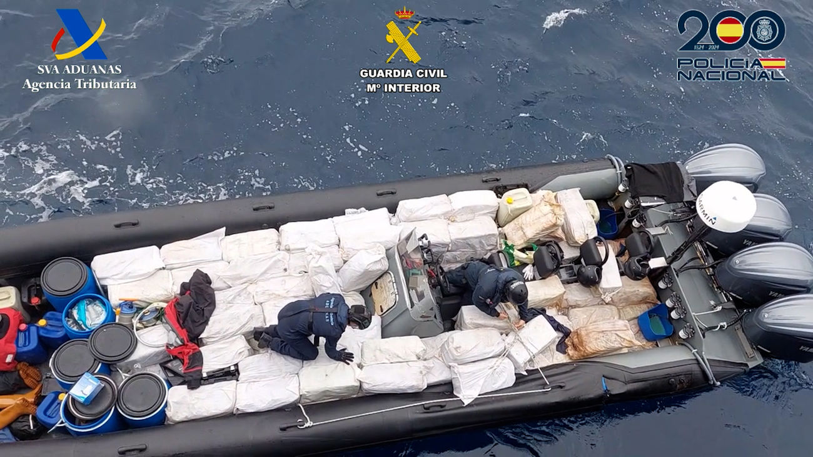
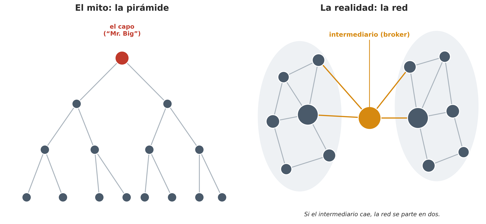
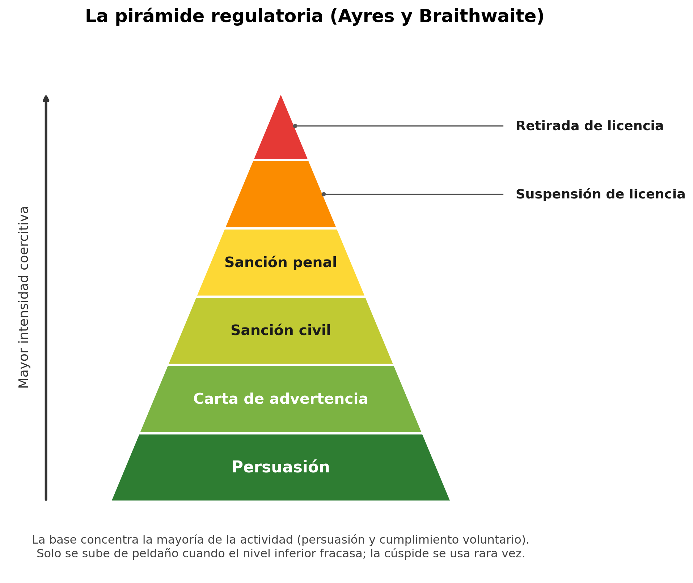

## Introducción

El capítulo anterior lo dedicamos a la persona que delinque, esa figura individual sobre la que la criminología lleva más de un siglo proyectando teorías. Pero buena parte del delito que genera un gran daño social no lo comete nadie a solas. Se organiza. Hay quien se asocia, se reparte tareas, hereda oficios y contactos, y sostiene durante años una empresa que da dinero y a veces poder. Los actores de este capítulo ya no son personas sueltas, sino colectivos: grupos, organizaciones, empresas, y el propio Estado.

Cuando mencionamos el **crimen organizado** venimos ya con una imagen prefigurada del mismo. También aquí la cultura popular ha generado una cierta visión de este fenómeno. Evoca a la mafia, una hermandad de extranjeros (gente venida de fuera, del sur de Italia, de los Balcanes, de China), con sus ritos y su ley del silencio, incrustada como un cuerpo extraño y parasitario en una sociedad que consideramos por lo demás decente. Como veremos luego, esta representación cultural del delito organizado nos ofrece una visión distorsionada de este fenómeno [@AllumLongo_10].

El poder que el imaginario colectivo atribuye a la mafia es, en todo caso, un poder ejercido desde los márgenes, fuera de las instituciones y bajo la amenaza permanente del control penal. No todos los actores colectivos que examinamos en este capítulo como posibles sujetos activos del delito tienen la misma capacidad para influir en el desarrollo de las leyes o para esquivar el castigo penal o las responsabilidades legales de otra naturaleza. Aunque, como veremos más adelante, el delito organizado puede infiltrar y corromper las instituciones estatales (en algunos países más que en otros) generalmente se encuentra en el peldaño inferior en lo que se refiere a la capacidad de influir en el poder coercitivo del Estado. El crimen mejor "organizado" y en numerosas ocasiones más dañino de nuestras sociedades no lo cometen las mafias criminales. Lo cometen empresas legales, con mayor capacidad de influencia, y los propios Estados o partes del mismo, y casi nunca lo llamamos crimen organizado.

{#fig-crimen-organizado width="70%"}

Vamos a estudiar cada una de estos posibles sujetos del delito. Empezaremos por lo que todo el mundo reconoce sin dudar como criminal: los grupos y las organizaciones del crimen organizado. Después nos centraremos en las personas jurídicas (las empresas y corporaciones que delinquen no por la acción de una manzana podrida en su interior, sino como organizaciones y en su propio beneficio). Y terminaremos en el escalón más elevado, el Estado que comete delitos siendo a la vez quien define qué es delito. A cada peldaño que subimos en esta imaginaria escalera el actor tiene más poder, y la etiqueta penal resulta más difícil de aplicar en la práctica. Esta imagen de la escalera que estamos empleando aunque es funcional a efectos pedagógicos, como todas las metáforas tiene sus límites. Sugiere que el crimen organizado, el delito corporativo y las formas desviadas de uso del poder estatal son peldaños separados, problemas distintos, cuando la realidad, como veremos también en este capítulo, es que son conjuntos de fenómenos delictivos que presentan puntos de conexión e intersección [@Barak_15]. No obstante, por razones expositivas los presentaremos uno a uno, primero el delito organizado, luego el delito empresarial y, finalmente, el llamado crimen de Estado.

## Organizaciones y grupos criminales

### ¿Qué es la delincuencia organizada?

¿De qué hablamos cuando hablamos de delincuencia organizada? Cuando una física habla de un electrón o una geóloga de una falla tectónica, nombran algo que está ahí fuera al margen de que alguien lo mire. Con el crimen organizado no ocurre lo mismo. El criminólogo alemán Klaus von Lampe [-@vonLampe_16], autor de uno de los manuales de referencia sobre delincuencia organizada, afirma que el crimen organizado no es una cosa fácilmente observable que se encuentre en el mundo como se encuentran las pirámides de Egipto. Los fenómenos que metemos en esa categoría del delito organizado son reales (existen los mercados ilegales, existen los grupos violentos, existe la corrupción), pero la categoría que los reúne es un constructo, una manera de recortar un fragmento del mundo social y ponerle un nombre. Ya encontramos esta idea en el capítulo 1 (*¿Qué es la criminología?*), los conceptos con que trabaja nuestra disciplina no vienen dados, se construyen socialmente, y nos tenemos que preguntar quién los construye y con qué fin.

La criminalidad organizada no solo es un concepto socialmente determinado, sino que su significado ha cambiado a lo largo del tiempo y ha sido empleado para aludir a realidades muy heterogéneas. Nace en los Estados Unidos (posiblemente en el *Informe Anual de la Sociedad Neoyorquina para la Prevención del Delito* de 1896 para referirse a la prostitución y al juego ilegal protegido por autoridades públicas corruptas) y posteriormente ha sido empleado para hacer referencia a realidades tan dispares como la Cosa Nostra americana, los Yakuza japoneses, las Triads chinas, los narcos colombianos y mexicanos, los moteros escandinavos, y un largo etcétera. Sigue siendo un concepto políticamente popular, pero las muchas realidades a las que se aluden con el mismo hacen que sea una categoría peligrosamente ambigua. Como señalan Paoli y Vander Beken [-@PaoliVanderBeken_14]:

> "A lo largo de este periodo, el término crimen organizado ha tenido momentos de verdadero éxito político —desde la década de 1950 hasta principios de la de 1970 en Estados Unidos y durante la de 1990 en Europa—, ya... que se ha utilizado para referirse a diferentes fenómenos delictivos considerados graves problemas sociales. Si bien el término crimen organizado aún conserva un fuerte poder evocador, lo que sin duda explica su éxito político, la multitud de actores y actividades delictivas que se han englobado bajo esta etiqueta lo convierten en un concepto general ambiguo que no puede utilizarse, sin especificación, como base para el análisis empírico, la elaboración de teorías o la formulación de políticas."

Uno de los problemas de base para entender de qué hablamos es que en realidad ha habido dos formas de entender el concepto. Para algunos autores, crimen organizado quiere decir sobre todo **organización de actividades**: mercados, negocios ilegales que funcionan con su logística y su contabilidad. El foco se pone en el *qué*. Para otras, quiere decir **organización de delincuentes**: la banda, la familia, la hermandad con su estructura y su jerarquía. El foco se pone en el *quién*. La historia del concepto en nuestra disciplina ha tenido un movimiento pendular: primero importó el qué, luego se impuso el quién con el mito de la mafia, y la investigación reciente ha vuelto a desplazar el foco hacia las actividades.

Más allá de estas cuestiones, el estudio del delito organizado se enfrentó desde el inicio a un mito muy arraigado, el del crimen organizado como conspiración extranjera y piramidal. Es la imagen de la mafia italo-americana que Hollywood ha popularizado con películas como *El padrino* y *Los intocables* o la serie *Los Soprano*. Ese retrato muestra una organización secreta e importada desde fuera, gobernada desde la cúspide por un jefe que mueve los hilos de todo lo que ocurre por debajo.

::: {.callout-note appearance="simple"}
**Al Capone y el hampa en Chicago**

Al Capone es el ejemplo consabido. Dirigió en el Chicago de la Ley Seca un conglomerado de negocios legales e ilegales, y su fama de "señor del hampa" sigue viva casi un siglo después. Capone, sin embargo, no actuaba en la sombra. Cortejaba a la prensa, y un reportero del *Chicago Tribune* reconocería más tarde que "lo construimos nosotros como el gran capo del mundo del hampa" [citado en @vonLampe_16]. Y que lo procesaran por evasión de impuestos no fue una maniobra tan excepcional ante un intocable como sugiere la película de Brian De Palma. Ya se había condenado por lo mismo a otros contrabandistas antes que a él, y, de no haber prosperado esa vía, lo esperaba una acusación por más de cinco mil violaciones de la ley seca [@vonLampe_16]. El personaje era real y violento. La aureola de omnipotencia, en cambio, se fabricó a medias entre la policía, los periódicos y el propio Capone.
:::

Esta imagen que la cultura popular nos ha transmitido se convirtió en un modelo científico del delito organizado de la mano del criminólogo Donald Cressey. En pleno pánico estadounidense de los años sesenta, y con acceso privilegiado a los datos policiales de una comisión presidencial, Cressey publicó en 1969 *Theft of the Nation* [@Cressey_69], donde presentó la Cosa Nostra norteamericana como una confederación de "familias" unificadas por una "comisión", con jerarquía, división del trabajo y ritos de iniciación que separaban a los miembros del resto. Se perfilaba, a la vez, como una empresa dedicada a negocios ilegales y un gobierno de todo el hampa. El problema no fue tanto esa descripción organizativa como la idea de que quien entiende la Cosa Nostra entiende el crimen organizado en Estados Unidos [@Cressey_69]. Reducido a esa afirmación, a la supuesta omnipresencia de la Cosa Nostra en todos los mercados ilegales, su trabajo dio pie a lo que sus críticos llamaron la teoría de la conspiración extranjera (*alien conspiracy theory*), esto es, la idea de que casi todo el crimen organizado del país se explica por una sola organización burocrática de delincuentes de un origen étnico concreto.

Vino luego lo que von Lampe [-@vonLampe_16] llama la era pos-Cressey, y fue en buena medida una deconstrucción de este modelo. Por un lado, los datos históricos no acompañaban a la interpretación propuesta por dicho modelo. La 'guerra' fundacional que supuestamente había dado origen a la Cosa Nostra en 1931 no dejó rastro documental más allá de un puñado de asesinatos, y varios estudios encontraron actividad del crimen organizado en Estados Unidos mucho antes y con total independencia de cualquier grupo llegado del sur de Italia [@vonLampe_16]. Por otro, los datos económicos tampoco permitían sustentar la idea de una mafia omnipresente y capaz de controlar todos los mercados ilegales. Cuando dos investigadores con acceso a datos policiales examinaron de cerca cómo funcionaban las familias (Annelise Anderson en Filadelfia y Peter Reuter en Nueva York), descubrieron que no operaban como una gran empresa unificada [@vonLampe_16]. 

El caso de Filadelfia dejó, además, una interpretación reveladora, porque muestra que nuestra percepción del delito organizado no puede separarse de cómo lo definen y lo construyen (de forma interesada) las autoridades y las agencias de control penal:

> "El supuesto ascenso de la mafia después de 1960 no supuso ningún cambio real de poder. Reflejaba más bien el uso de una perspectiva nueva por parte de las agencias oficiales, que respondían a necesidades burocráticas urgentes. Los italianos no eran más poderosos que antes; sencillamente, sus rivales habían dejado de ser vistos." [@JenkinsPotter_87, p. 483]

Conviene subrayar las consecuencias de este mito. Al situar el delito en el extranjero (el siciliano, y después el colombiano, el chino, o el albanés) dejaba fuera del foco a los socios locales de toda la vida: los políticos que cobraban por proteger el negocio, la policía comprada, las empresas legales que compraban servicios sucios, y los ciudadanos de a pie que libremente consumen y demandan los bienes y servicios distribuidos a través de mercados ilegales.

### Representación mediática del delito organizado: ¿"Menos de lo que parece"?

En buena medida el delito organizado ha recibido más atención de Hollywood que de las ciencias sociales, al menos hasta hace un par de décadas. En parte se debe los sesgos culturales de la criminología (muy focalizada en la delincuencia común de carácter individual), pero también porque es un mundo opaco particularmente difícil de investigar. Pensad en el caso del periodista de investigación Roberto Saviano que, desde que publicó su libro sobre la Camorra napolitana, ha tenido que vivir bajo constante protección policial.

No nos debe sorprender, por tanto, que, como vimos en el apartado anterior, la cultura popular y la ficción hayan desempeñado un papel determinante en la construcción de una imagen distorsionada del delito organizado, una imagen que ha influido tanto en el discurso científico como en el de las agencias de control penal [@vonLampe_16]. La cuestión general de la representación mediática del delito la retomaremos en el capítulo 9 (*Respuestas sociales y culturales al delito*). Aquí nos interesa por su peso en cómo pensamos el crimen organizado. Y es que la ficción cinematográfica y televisiva ha fijado la imagen de una organización omnipotente, piramidal y con un gran poder económico, gobernada por códigos de honor y pactos de silencio como la *omertà*. En cambio, la investigación criminológica que, sobre todo empieza a expandirse a partir de los años 90, ha puesto continuamente en tela de juicio distintos aspectos de esta representación.

::: {.callout-tip appearance="simple"}
**El crimen organizado en el cine**

Esta caracterización en los medios ha evolucionado sustancialmente a lo largo de las décadas, reflejando las ansiedades sociales de cada era [@LarkeWalsh_10; @Renga_19]:

- *La era de la Prohibición (1930-1940)*: Las primeras películas del género (*Little Caesar*, 1931; *The Public Enemy*, 1931; *Scarface*, 1932) presentaron al gánster como un antihéroe trágico cuyo ascenso y posterior caída moralizadora personificaban las contradicciones del sueño americano [@LarkeWalsh_10].

- *El cine de Hollywood de los años setenta (1970-1980)*: *El padrino* (1972) y sus secuelas, como *El padrino. Parte II* (1974), redefinieron el género al humanizar a las familias mafiosas, retratándolas como dinastías trágicas que operaban de forma paralela al capitalismo corporativo tradicional [@LarkeWalsh_10].

- *El cine y la televisión de la era dorada (1990-2000)*: Producciones como *Uno de los nuestros* (*Goodfellas*) y *Los Soprano* desmantelaron el romanticismo clásico para enfocarse en la cotidianidad, el pragmatismo despiadado y la disfunción psicológica de sus integrantes [@LarkeWalsh_10].

- *La era del streaming (2010-presente)*: Producciones contemporáneas como *Narcos* o *Gomorra* han desplazado el foco hacia la dimensión transnacional, la militarización de los carteles de la droga y las complejas redes del delito organizado global.
:::

Peter Reuter y Michael Tonry [-@ReuterTonry_20], que llevan décadas estudiando el fenómeno, resumen el estado de la cuestión en un capítulo de libro titulado 'Menos de lo que parece'. ¿Qué quieren decir estos autores con esta afirmación?

- En primer lugar, que *las organizaciones criminales ni son omnipresentes ni son tan rentables como la ficción nos vende.* Las estimaciones más citadas, las de Naciones Unidas y la Comisión Europea, sitúan sus ganancias en torno al 1% del PIB. Naciones Unidas calcula unos 900.000 millones de dólares al año (alrededor del 1,5% del producto mundial) y la Comisión Europea, entre 92.000 y 188.000 millones de euros (un 0,7-1,4% del PIB de la Unión) [@ReuterTonry_20; @EPRS_20]. En España la magnitud es igualmente modesta. La policía identificó unas 497 organizaciones en 2013, con una riqueza estimada en torno a los 1.250 millones de euros [@Savona_16], y la mayoría de los grupos son pequeños y especializados en una sola actividad, lejos del conglomerado omnipotente del mito [@GimenezSalinas_16]. Estas estimaciones sobre magnitud económica son, además, cálculos generosos y difíciles de afinar, pensados para dar un orden de magnitud más que para medir con precisión. Estimar el daño real es casi imposible, porque no hay manera de saber cómo sería un territorio o una economía sin esa presencia.

- En segundo lugar, *que la violencia suele estar muy exagerada.*[^campana] La violencia suele ser un último recurso, ya que conlleva un alto coste en recursos y personal, atrae la atención de las fuerzas policiales y puede dañar la credibilidad del negocio[^Suecia]. La mayor parte de la violencia observable en los mercados ilícitos se produce en el seno de redes y grupos, más que entre competidores que se disputan la cuota de mercado. Muy rara vez es contra el ciudadano corriente, con excepciones dolorosas como la de México, donde sí alcanza de lleno a la población. La escasa violencia observable no implica ausencia de coacción. Su uso es costoso y calculado, lo que la literatura llama la economía de la violencia, y buena parte del efecto lo produce la amenaza creíble y la reputación más que el acto en sí, que además adopta formas que van más allá de lo físico [@Kotze_22].

[^campana]: Usando datos policiales en Cambridgeshire (Reino Unido), Campana y sus colaboradores [-@Campana_26] demostraron que el crimen organizado ejerce un doble efecto: intensifica la violencia y, a la vez, la inhibe. Una mayor presencia de crimen organizado se asocia con tasas de violencia más elevadas; sin embargo, una mayor prevalencia de miembros de estas organizaciones entre la población infractora se vincula con una disminución de la violencia general. Para estos autores esto refleja el papel del crimen organizado a la hora de generar entornos de mayor riesgo y, simultáneamente, aportar orden a los mercados ilícitos.

[^Suecia]: En algunos contextos el crimen organizado sí ha alterado el *tipo* de violencia. Suecia es el caso europeo más citado: los conflictos entre redes criminales han disparado los homicidios por arma de fuego desde mediados de la década de 2000, hasta convertir al país en un caso atípico en Europa en ese indicador concreto, aunque no en su tasa de homicidios total [@HradilovaSelin_24].

- Y, por último, *que las mafias hace tiempo que estan en declive.* El crimen organizado crece y decrece con las condiciones sociales que lo rodean, y las grandes mafias clásicas (Cosa Nostra estadounidense, Yakuza, tríadas) llevan décadas en declive por cambios estructurales (la pérdida de fuerza de los sindicatos, el fin de las viejas maquinarias políticas urbanas, unos Estados más capaces) tanto como por la presión policial [@ReuterTonry_20; @Paoli_20]. Como señala Paoli [-@Paoli_20], el crimen organizado no solo crece cuando el Estado la tolera, también cae cuando se le retira esa aceptación.

Resumiendo y en las propias palabras de Peter Reuter y Michael Tonry:

> "Las organizaciones del crimen organizado son de tamaño natural, brotes comprensibles de culturas, sistemas políticos y mercados locales. No son enormemente rentables. Económicamente importantes, en el gran esquema de las cosas, casi nunca." [@ReuterTonry_20, p. 1]

Por tanto, y pese al relato mediático, es importante que desarrollemos una visión de este fenómeno que sin trivializarlo, tampoco lo exagere. Y aquí aparece una de los mensajes que queremos que os quede claro al finalizar este capítulo. Si el crimen organizado pesa poco en la economía, la delincuencia de las empresas legales pesa mucho más. Un fraude contable o una burbuja financiera pueden arruinar a millones de personas, como mostró la crisis de 2008. El daño mayor y más extendido no lo causan las mafias, sino actores a los que casi nunca llamamos criminales. Sobre ese contraste volveremos más adelante, cuando lleguemos a las empresas y al Estado. Antes hay que entender mejor el propio crimen organizado, qué hace y cómo se organiza.

### Actividades: mercados ilegales y narcotráfico

Empecemos por el **qué**, por las actividades que asociamos al delito organizado. La mayor parte de lo que llamamos crimen organizado consiste en surtir bienes y servicios que tienen demanda pero que el Estado ha prohibido o gravado con impuestos y aranceles: drogas, tabaco de contrabando, armas, sexo de pago, pornografía infantil, etc. 

Detrás hay una regla económica sencilla. Prohibir algo no lo hace desaparecer, solo traslada su intercambio a un mercado ilegal, donde el precio incorpora el riesgo, donde no hay contratos ni tribunales que valgan y donde el Estado pierde la capacidad de regular lo que antes controlaba. La prohibición no elimina el mercado, tan solo cambia su naturaleza [@Reuter_83; @vonLampe_16]. 
Además, dónde acaba lo legal y empieza lo ilegal no lo fija la naturaleza de las cosas, lo decide el Estado, que elige qué prohíbe y cuándo y a quién persigue; esa aplicación selectiva de la ley es ya una forma de poder [@BeckertDewey_17]. En ese sentido, no nos debe sorprender que uno de los debates político criminales que continuamente está con nosotros es como regular estos mercados ilegales y si existen formas alternativas de regulación a la prohibición que nos puedan ofrecer resultados menos costosos socialmente. Los debates y la investigación empírica, por ejemplo, sobre la legalización del cannabis o en torno a como construir una respuesta a la prostitución muestran que toda opción regulatoria tiene sus ventajas y sus desventajas (lo que no quiere decir que todas sean igual de convenientes).

::: {.callout-note appearance="simple"}
**Entre la prohibición y el libre mercado**

Existen numerosos niveles y fórmulas de regulación entre los dos polos de la prohibición absoluta y el libre mercado. Y que solución se impone para distintos bienes y servicios cambia con el paso del tiempo. Lo estamos viendo, por ejemplo, con el cannabis. Hablando de la legalización en Estados Unidos Hoorens [-@Hoorens_25] indica lo siguiente en relación con el modelo de libre mercado que se ha seguido en la mayor parte del país que ha seguido esta ruta:

> "Esto ha dado lugar a una proliferación de empresas comerciales de cannabis que compiten ferozmente en estados como California, Colorado y Washington. Como resultado, el mercado ha experimentado una caída de los precios, envases atractivos, estrategias de marketing dirigidas a segmentos específicos y una amplia variedad de productos, tales como dulces, galletas, extractos y vaporizadores. En este modelo de libre mercado, los actores de la industria del «gran cannabis» tienen incentivos para dirigirse a aquellos consumidores que generan mayores beneficios. Al igual que ocurre con cualquier otro producto adictivo, estas personas suelen ser aquellas que muestran conductas de riesgo en cuanto a la frecuencia y el volumen de su consumo."

Como este mismo autor destaca esta no es la unica solución regulatoria, existen otras formulas (más centrados en la salud pública y que vemos en Vermont, Quebec, Uruguay, etc.) y el reto de la criminología es tratar de evaluar y ofrecer información de valor que nos sirva para elegir aquella que tenga mayores beneficios sociales. Lo mismo ocurre en relación con otros mercados, como, por ejemplo, el de la prostitución, donde además nos encontramos con visiones ideológicas totalmente opuestas al mismo incluso dentro del movimiento feminista.
:::

Aunque la participación en mercados ilegales es quizás la principal actividad delictiva organizada no es la única. Von Lampe [-@vonLampe_16] distingue tres tipos de actividad, que aparecen recogidos en la siguiente tabla:

| Tipo de delito | En qué consiste | Ejemplos |
|------------------------|------------------------|------------------------|
| **De mercado** | Proveer un bien o servicio ilegal a un cliente que lo quiere | Tráfico de drogas, contrabando de tabaco, tráfico de armas, prostitución, venta de productos falsificados |
| **Depredadores** | Arrebatar algo a una víctima que no lo quiere (relación agresor-víctima) | Robo, atraco, estafa, secuestro, extorsión |
| **De gobernanza** | Fijar y hacer cumplir reglas, resolver disputas donde el Estado no llega y cobrar por ello | Venta de protección (el *pizzo*), arbitraje de conflictos entre delincuentes, "impuesto" a quienes operan en un territorio |

: Los tres tipos de actividad del crimen organizado, según von Lampe [-@vonLampe_16]

Otros autores, como Beckert y Dewey [-@BeckertDewey_17] han tratado de profundizar en el tipo de bienes y servicios que se transaccionan en mercados ilegales.

| Tipo de mercado | En qué reside la ilegalidad | Ejemplo |
|------------------------|------------------------|------------------------|
| Productos ilegales | El producto en sí está prohibido (producirlo, tenerlo y venderlo) | Drogas |
| Bienes robados | El producto es legal, pero se ha sustraído a su dueño | Obras de arte robadas |
| Falsificaciones | El producto imita ilegalmente a otro protegido | Relojes Rolex falsos |
| Bienes "repugnantes" | El producto es legal, pero su compraventa se prohíbe por razones morales | Órganos para trasplante, gestación subrogada |
| Incumplimiento de normas | La producción y la venta son legales, pero se vulneran las reglas que las rigen | Economía informal, contrabando de tabaco, uso de información privilegiada |

: Cinco tipos de mercado ilegal, según Beckert y Dewey [-@BeckertDewey_17]

Estos mercados son tan viejos como porosas las fronteras, y la globalización los ha ensanchado. Pensemos en el mercado ilegal de las drogas. España es un buen ejemplo por razones en buena parte geográficas. Marruecos produce en torno al 80% del hachís del mundo, y la costa andaluza queda a catorce kilómetros del Estrecho, así que la ruta natural de salida hacia Europa pasa por aquí [@deCastro_25]. Y no es solo el hachís. España fue durante años una de las grandes puertas de entrada de la cocaína en Europa, y llegó a concentrar cerca del 45% de todas las incautaciones europeas entre 1998 y 2008 [@UNODC_10; @GimenezSalinasFramis_18]. Durante décadas el tráfico del Estrecho fue sobre todo de hachís; cada vez entra más cocaína por el sur, hasta el punto de que lo que hace veinte años era casi todo hachís ronda ya el 60% de cocaína [@deCastro_25]. En 2023 se intervino en el puerto de Algeciras el mayor alijo de cocaína jamás incautado en España, nueve toneladas y media llegadas desde Ecuador [@deCastro_25].

{#fig-mafia width="100%"}

Sería fácil describir este proceso como una "invasión" (un producto extranjero que se cuela por una frontera mal cerrada), y sería engañoso. El narcotráfico del sur no entra a través de un territorio cualquiera; arraiga donde encuentra las condiciones sociales y políticas para hacerlo. En el sur de la provincia de Cádiz, con un paro que ronda el 24%, de los más altos del país, el contrabando tiene raíces históricas profundas (primero de tabaco, luego de droga) y una tolerancia social e institucional que viene de lejos [@deCastro_25]. El mercado ilegal no llega de fuera y se impone contra la comunidad, crece dentro de ella y responde, ademas, a una demanda ciudadana por los bienes y servicios que ofrece. Sobre ese arraigo volveremos más adelante.

::: {.callout-tip appearance="simple"}
**Fariña y la "nueva Sicilia" gallega**

Galicia ofrece otro ejemplo español de ese arraigo. En los años ochenta, los clanes que durante décadas habían contrabandeado tabaco por las Rías Baixas se reconvirtieron a la cocaína y ofrecieron a los carteles latinoamericanos su puerta de entrada a Europa. Concurrían el atraso económico, una tradición centenaria de contrabando y una tolerancia social e institucional heredada de los "benefactores" capos del tabaco, con la desidia (cuando no la complicidad) de parte de la clase política y de las fuerzas de seguridad. El periodista de investigación Nacho Carretero lo reconstruyó en el libro Fariña [@Carretero_15], que Atresmedia convirtió en 2018 en una serie homónima, después disponible en Netflix como *Farinha*, bastante más dramatizada.

El contraste entre el libro y la serie enlaza con lo que veíamos sobre la representación mediática. La ficción tiende a un costumbrismo de capos con relojes de oro que romantiza el fenómeno y oscurece su capacidad para destruir el tejido social. Y la publicación del propio libro dejó un episodio revelador sobre poder, relato y arraigo social. El que fuera alcalde de Pontevedra (entre 1983 y 1985) de la entonces llamada Alianza Popular (el PP en la actualidad), José Alfredo Bea Gondar, instó a que un juzgado ordenara el secuestro cautelar de este libro, y como consecuencia estuvo meses fuera de la venta. Bea Gondar fue condenado por la Audiencia Nacional en el 2005 por lavar dinero procedente del narcotráfico. En 2007, el Tribunal Supremo confirmó y elevó la pena a 4 años, 7 meses y 15 días de prisión al aplicar la agravante de integración en organización delictiva.
:::

Es conveniente subrayar que casi todo lo que sabemos del tamaño de estos mercados procede de fuentes policiales (incautaciones, detenciones, informes de amenaza), y esas cifras miden a la vez el tráfico y la propia actividad de quien lo persigue. Que haya un récord de incautaciones puede querer decir más droga o, probablemente, más vigilancia o más suerte con la misma [@deCastro_25]. Usamos estsas cifras porque son las que hay, sin que debamos confundir lo intervenido con lo que circula.

En esta sección, hemos usado el ejemplo del narcotráfico porque son el mercado ilegal más visible en España y el que más atención concentra, pero. es importante recordar que no es el único relevante. 

### El quién: de las pirámides jerárquicas a las estructuras reticulares

Vamos ahora al **quién**. La imagen que casi todas tenemos en la cabeza es la de una pirámide, con un jefe en la cumbre (el capo de capos, el "Mr. Big" inglés, el padrino) que da órdenes que bajan por una cadena de mando hasta el último peón. Es la imagen que nos ofrece el cine y también la de buena parte del discurso policial. Pero el delito organizado es un fenómeno mucho más heterogéneo. Bajo esa etiqueta cabe una enorme diversidad de formas, de las jerarquías a los clanes, las redes o las células, y ninguna agota el fenómeno. El propio Departamento de Justicia (2008) estadounidense lo admite cuando reconoce que no existe una estructura única y que estas agrupaciones van desde jerarquías hasta clanes, redes y células, y pueden desarrollar otras estructuras.

.](images/Montreal_Mafia_Bonanno_Decina.jpg){#fig-mafia width="75%"}

Existen, es cierto, organizaciones criminales estables y grandes, presentes en varios países y en una pluralidad de mercados, pero son la excepción y no todas son iguales. Algunas reciben de la literatura especializada el nombre de "mafias": organizaciones transnacionales, con cierta estabilidad en el tiempo y múltiples funciones (la Yakuza japonesa, las tríadas chinas, la 'Ndrangheta calabresa, la Cosa Nostra siciliana). Solo se dan en un puñado de países, por razones históricas, culturales y socioeconómicas, y hoy están en declive [@Paoli_20].

En otros lugares, ciertos mercados ilegales y condiciones sociales han precipitado la aparición de grupos que adquirieron reputación de "mafias" (sobre todo en Europa del Este), pero que rara vez han perdurado. En América Latina, el narcotráfico y la debilidad estatal han alimentado carteles que desaparecen, y son reemplazados por otros, con la misma facilidad con que surgen. Y por debajo de todo ello hay incontables colaboraciones pequeñas y transitorias entre grupos reducidos que se reparten distintos mercados ilegales. ¿Tiene sentido aplicar una etiqueta tan vaga como "delito organizado" a fenómenos tan distintos?

Reuter y Paoli [-@ReuterPaoli_20] hablan de **organizaciones criminales de crimen organizado** para entidades relativamente grandes, con barreras de entrada claras, estructura interna y reglas propias, dedicadas de forma habitual a la actividad criminal por motivos económicos o de otro tipo. Para hablar con propiedad de una de ellas exigen que se den siete rasgos:

- *Longevidad*: Las cinco que ellos consideran mafias propiamente dichas (las Cosa Nostra siciliana y estadounidense, la 'Ndrangheta calabresa, las tríadas chinas y la Yakuza japonesa) llevan al menos un siglo existiendo, lo que refuerza su reputación y su capacidad de intimidación.

- *Gran tamaño*. Durante algunas décadas llegaron a tener miles de miembros.

- *Estructuras formalizadas y complejas*,con reglas internas, órganos de gobierno, unidades diferenciadas y mecanismos para resolver disputas.

- *Un aparato cultural elaborado*, que genera compromiso, identidad y un sentido de familia (ritos de iniciación, reglas escritas, procedimientos para sancionar las infracciones).

- *Multifuncionalidad*. Participan en actividades legales e ilegales diversas.

- *Objetivos políticos y la habilidad para ofrecer servicios de gobernanza*, en particular resolución de disputas y servicios de seguridad.

- *Legitimidad popular y reparto del poder con instituciones estatales locales*.

Las **organizaciones criminales de crimen organizado** son la excepción más que la regla. Con esos criterios, ni los narcos colombianos ni casi ninguno de los mexicanos serían "organizaciones" en sentido sociológico: carecen de fronteras claras de pertenencia, de una estructura de mando formalizada y de un aparato cultural que asegure la lealtad, y su ambición política o de gobierno es menor. El caso que más se acerca a una mafia tradicional sería el brasileño *Primeiro Comando da Capital* (PCC), nacido en las cárceles de São Paulo, y en menor medida el *Comando Vermelho* de Río de Janeiro. La Camorra napolitana, algunos grupos de Europa del Este o los clubes de moteros escandinavos quedan, para estos autores, como "organizaciones candidatas" que aún no llegan del todo a ser "mafias" en este sentido más estricto [@ReuterPaoli_20].

El grueso de los intercambios en los mercados ilegales, sin embargo, no corre a cargo de mafias, sino de empresas criminales más pequeñas y efímeras, para las que la literatura ha acuñado términos como **redes y empresas ilegales** [@BouchardMorselli_14] o **grupos criminales** [@Morselli_09]. Como destaca el SOCTA europeo, el panorama del crimen organizado se caracteriza por un entorno de redes en el que la cooperación entre delincuentes es fluida, sistemática y motivada por el beneficio económico [@Europol_21].

Esas redes se componen de contactos que interaccionan de forma más o menos estable, y a veces muy puntual. El análisis que se hace desde la criminología dibuja un paisaje fragmentado de individuos y grupos colaboradores, más difícil de perseguir y de comprender que si la actividad dependiera de un solo grupo. Es más, en las distintas etapas de la cadena criminal un mismo delincuente puede operar o prestar servicios en varias redes a la vez. Dentro de cada red hay actores con funciones de gestión y otros que son operativos de campo, y los grupos varían en tamaño, desde los más pequeños, que actúan en el plano local o regional, hasta los mayores, que operan en el internacional y en operaciones más complejas. Esa alta prevalencia de redes fluidas y orgánicas refleja la difusión del modelo de negocio del **delito-como-servicio**, en el que individuos y grupos ofrecen prestaciones criminales a otros.

Todo esto nos presenta un paisaje muy distinto del de la pirámide. La forma habitual del crimen organizado es un puñado de grupos pequeños, cambiantes y oportunistas que se juntan para una operación y se deshacen después. En un seguimiento de cinco años a un cultivador de cannabis se le contaron diez plantaciones sucesivas y dieciséis cómplices distintos [@Bouchard_11]. El liderazgo funciona menos como un cargo estable que como una función que pasa de mano en mano; cuando la policía detiene a alguien, el grupo se dispersa y se recompone. Por eso estos mercados son tan resistentes, porque no hay una cúpula a la que descabezar facilmente.

España encaja en este cuadro por partida doble. Es país de crimen desorganizado, de redes pequeñas de contrabando y tráfico más que de una mafia autóctona al estilo siciliano [@GimenezSalinas_16]; y ha sido a la vez tierra de acogida de mafias ajenas, el único lugar donde se han asentado las cuatro grandes organizaciones italianas, atraídas por el ladrillo y el clima, hasta el extremo de que se calcula que buena parte del litoral se levantó con su dinero [@deCastro_25]. La Camorra napolitana, por ejemplo, ha implantado clanes en Granada, Tarragona y Tenerife [@Allum_16].

::: {.callout-tip appearance="simple"}
**Layer Cake: el broker en el mercado de drogas**

La película *Layer Cake* (2004), dirigida por Matthew Vaughn, basada en la novela de J. J. Connolly y protagonizada por Daniel Craig, es un reflejo de este tipo de estructuras y que muestra el funcionamiento del mercado de drogas. Refleja bien el estudio de Pearson y sus colaboradores [-@PearsonHobbs_01] sobre reades de narcotrafico en el Reino Unido que reveló una estructura de mercado caracterizada por la fluidez, la fragmentación y una marcada simplicidad vertical frente a su complejidad horizontal. Aunque existe una estructuración funcional en cuatro niveles diferenciados (importadores, mayoristas, intermediarios o brokers multimercancía y distribuidores minoristas), la cadena de suministro que conecta las grandes operaciones de importación con el comercio al menudeo resulta notablemente corta, permitiendo una rápida adaptación de los actores ante las interrupciones policiales y los vaivenes de la oferta. En el centro neurológico de esta arquitectura comercial se sitúa la figura estratégica del intermediario o broker del mercado medio. Mientras que las fases superiores del tráfico tienden a estructurarse en torno a redes monomercancía profundamente especializadas (como el control de origen turco en la importación de heroína o las organizaciones colombianas en el suministro de cocaína), el broker intermedio actúa como un nodo integrador. Su función principal radica en la convergencia de estas líneas de suministro independientes para abastecer a los distribuidores minoristas con un portafolio diversificado que abarca heroína, cocaína, anfetaminas, éxtasis y canabis. La operatividad de estos intermediarios se sostiene sobre estructuras logísticas sumamente ágiles, compuestas habitualmente por una o dos personas a cargo de la gestión financiera y la red de contactos, apoyadas por equipos subordinados de repartidores o *runners* que asumen los riesgos tácticos de la custodia y el transporte. En *Layer Cake* se dramatiza a través del personaje de Daniel Craig el papel de esta figura.
:::

Todo esto confirma que los dos viejos modelos que vimos al discutir el concepto (la conspiración extranjera y la burocracia piramidal de Cressey [@Cressey_69]) no sirven para entender el delito organizado. La pregunta es con qué sustituirlos, y la investigación ha ofrecido tres respuestas complementarias.

La primera es **el modelo de la empresa ilegal**, cuya formulación seminal es la del economista y criminólogo Peter Reuter en su influyente *Disorganized Crime* [@Reuter_83]. Su punto de partida es que el empresario del crimen es un empresario a secas, sometido a la oferta y la demanda, solo que trabaja en condiciones penosas. No puede firmar contratos exigibles, no puede anunciarse, no puede pedir un crédito y en cualquier momento lo detienen o le incautan el género. En ese entorno, cooperar y fiarse sale caro. Y de ahí Reuter deriva que la ilegalidad, en lugar de empujar hacia grandes organizaciones, empuja hacia lo contrario. Cada socio nuevo, cada cliente de más, es un cabo suelto que hace vulnerable al empresario; cuanto mayor es el grupo, mayor el riesgo de que alguien hable o de que una escucha lo destape. Por eso la mayoría de las empresas ilegales son pequeñas y efímeras. La sociología económica ha generalizado esa intuición. Sin contratos ni tribunales, un mercado ilegal apenas genera confianza institucional, y eso frena la inversión a largo plazo, mantiene pequeñas las organizaciones y hace que las redes se tejan sobre el parentesco y los lazos locales [@BeckertDewey_17]. Reuter lo llamó *crimen desorganizado*.

Un segundo enfoque es el **modelo de redes sociales**. El análisis de redes sociales aporta una perspectiva que ha sido muy útil para el estudio del crimen organizado, al desplazar el foco de atención desde los atributos individuales de los delincuentes o la búsqueda de esquemas jerárquicos rígidos hacia la estructura de las relaciones interpersonales. En lugar de asumir que las organizaciones criminales operan como corporaciones piramidales tradicionales, esta metodología permite cartografiar la red real de intercambios, flujos de información y dependencias mutuas entre actores que se relacionan entre si. Gracias a este enfoque, los investigadores pueden identificar la posición estratégica de determinados intermediarios o brokers que, sin ser necesariamente los jefes visibles, ejercen un papel fundamental como conectores de nodos inconexos o canales de distribución [@Morselli_09]. Asimismo, el análisis de redes ayuda a visibilizar cómo la confianza y la cohesión interna dentro del mercado ilegal se articulan a través de lazos sociales diversos, que van desde el parentesco y las relaciones comunitarias hasta contactos fraguados en el entorno penitenciario [@PearsonHobbs_01]. En el ámbito policial, esta herramienta resulta valiosa para detectar vulnerabilidades estructurales en la organización, demostrando que la neutralización de un actor clave por su posición en la red puede desarticular los flujos comerciales o provocar la fragmentación del grupo de manera mucho más eficaz que los enfoques centrados únicamente en los mandos superiores [@Morselli_09].

{#fig-redes width="100%"}

La tercera manera de mirar es el **modelo de la protección**, y con él llegamos a las mafias en sentido estricto. Diego Gambetta y Federico Varese han mostrado que las grandes organizaciones mafiosas (la Cosa Nostra siciliana, la 'Ndrangheta, las tríadas chinas, la Yakuza japonesa) son, antes que traficantes, proveedoras de un servicio, la protección y el orden [@Gambetta_09; @Varese_18]. Cobran por hacer cumplir acuerdos que el Estado no ampara, arbitran disputas que no pueden ir a un juzgado, deciden quién trabaja y quién no. Son, en pequeño y sin permiso, una forma de gobierno. Ese negocio de protección aparece allí donde el Estado deja de garantizar los contratos y el orden. Varese lo mostró con la mafia rusa, nacida del vacío de la transición postsoviética [@Varese_2001]; la economía política lo ha formalizado como la provisión privada de una función que el Estado no cumple [@Skaperdas_2001]. Es la tercera cara que apuntábamos al hablar de las actividades del delito organizado.

Y esto nos deja con un interrogante. Si reconocemos esta complejidad social, ¿cómo pueden las instituciones de control penal definir el delito organizado? No es fácil y el asumir esta concepción más fluida y menos vertical genera serios problemas legislativos. Dadas las distintas tradiciones legales se llegó en Europa a una definición de compromiso en 1997 [@vonLampe_16], se podía hablar de delincuencia organizada si se daban 6 de las siguientes características (1,3,5 y 11 son obligatorias):

- 

  1.  *Colaboración de más de dos personas*

- 

  2.  Cada una con tareas especificas

- 

  3.  *Por un periodo prolongado o indefinido de tiempo*

- 

  4.  Usando alguna forma de disciplina y control

- 

  5.  *Sospechosos de la comisión de actividades delictivas serias*

- 

  6.  Operando a nivel internacional

- 

  7.  Usando violencia u otros medios de intimidación

- 

  8.  Usando estructuras comerciales o pseudo-empresariales

- 

  9.  Participando en el blanqueo de capitales

- 

  10. Ejerciendo influencia sobre la clase política, la administración pública, la judicatura, o la economía

- 

  11. *Motivada por fines de enriquecimiento o de adquisición de poder.*

Pero a efectos prácticos esta definición es demasiado amplia y ambigua, lo que sirve para injustificadamente ensanchar la red del control penal con efectos draconianos. La literatura que emana de los Informes Anuales de Europol cada vez usa menos esta definición (un quién diluido) y se limita a describir las actividades (el qué), mientras que en el ámbito político se ha pasado de hablar de delincuencia organizada a una combinación de este término y de la delincuencia "seria". Como acertadamente señalan Reuter y Paoli:

> "En la actualidad, la etiqueta de «crimen organizado» se aplica libremente a un conjunto heterogéneo de entidades. Las definiciones oficiales permiten que el término se aplique incluso a empresas ilegales muy modestas; tres hombres y un perro que venden cannabis con regularidad pueden ser considerados crimen organizado. Por ejemplo, la definición adoptada por la Agencia contra el Crimen Organizado y Grave del Reino Unido en 2012 es amplia e imprecisa, se centra claramente en delitos con fines de lucro y no establece requisitos organizativos: «El crimen organizado se define como aquellos que participan, normalmente en colaboración con otros, en actividades delictivas graves y continuas con fines de lucro sustancial, ya sea en el Reino Unido o en cualquier otro lugar». En el derecho penal de la Unión Europea, el crimen organizado parece significar poco más que la comisión de delitos en colaboración por parte de más de dos autores." [@ReuterPaoli_20, p. 224]

::: callout-note
**¿Cómo define la criminalidad organizada el Código Penal?**

Desde la reforma de 2010 (LO 5/2010), el Código Penal se ocupa de esta cuestión en los artículos 570 bis, ter y quáter. Hay que empezar reconociéndole un acierto de partida. La **organización criminal** del art. 570 bis exige más de dos personas, cierta vocación de permanencia y un reparto concertado de tareas, pero en ningún momento una jerarquía formal ni una estructura piramidal. Por debajo de ese umbral, el art. 570 ter añadió una figura nueva, el **grupo criminal**, definido de forma residual como la unión de más de dos personas que no reúne alguna de las características anteriores. La letra de la ley, por tanto, deja sitio a esas formas fluidas y reticulares que la investigación criminológica lleva décadas describiendo. Otra cosa es lo que ocurre después en los tribunales, que tienden a buscar una jefatura como indicio de que hay organización, reintroduciendo así la imagen del organigrama que la ley no impone [@Zuniga_15].️

Donde el legislador se pasó de frenada es en la amplitud. La Decisión Marco 2008/841/JAI[^grupos-1], que el preámbulo de la reforma invoca como justificación, acota su definición con dos límites: los delitos han de estar castigados con penas de al menos cuatro años en su extremo máximo, y la agrupación ha de perseguir un beneficio económico o material. El Código Penal español no recogió ninguno de los dos, y le basta con la finalidad de cometer delitos, cualesquiera que sean y con el propósito que sea [@Bocanegra_20, pp. 107-108]. El grupo criminal, además, no responde a exigencia europea ni internacional alguna, y desde 2010 alcanza también a quienes se conciertan para cometer de forma reiterada infracciones de poca monta. Cancio Meliá ironizaba con que una cuadrilla de ladrones de gallinas encaja en el tenor literal del precepto [@Cancio_11]; podríamos añadir a las grafiteras o a las okupas no violentas [@Bocanegra_20, p. 134].

Conviene subrayar que esto no es un efecto no deseado que se le haya escapado a nadie. La propia Fiscalía General del Estado, en su Circular 2/2011[^grupos-2], defendió la figura del grupo criminal precisamente como respuesta a la delincuencia a pequeña escala que genera intranquilidad entre la población. Es decir, el aparato conceptual y punitivo construido para hacer frente a las mafias transnacionales se puso deliberadamente a disposición de la persecución del menudeo. De ahí que la doctrina penal española lleve años discutiendo qué bien jurídico protegen realmente estos tipos, hasta qué punto es legítimo adelantar el castigo al momento mismo de agruparse y dónde queda la frontera con la coautoría de toda la vida, una frontera que ha tenido que ir dibujando el Tribunal Supremo caso a caso.
:::

[^grupos-1]: *Decisión Marco 2008/841/JAI del Consejo, de 24 de octubre de 2008, relativa a la lucha contra la delincuencia organizada* (DOUE L 300, de 11 de noviembre de 2008). ⚠️ cita del DOUE por confirmar.

[^grupos-2]: *Circular 2/2011, de 2 de junio, de la Fiscalía General del Estado, sobre la reforma del Código Penal por Ley Orgánica 5/2010, en relación con las organizaciones y grupos criminales* (BOE, ref. FIS-C-2011-00002).

### El arraigo social y la dimensión "glocal"

¿Cómo se sostiene un negocio en el que no puedes fiarte de nadie y no hay tribunal que te ampare? No se sostiene en el vacío. El crimen organizado se apoya en algo que ya existía antes que él, las relaciones sociales preexistente de la gente que participan en el mismo.

El sociologo Granovetter sostuvo que todas las transacciones económicas (fijación de precios, contratos, contratación, confianza) están profundamente arraigadas en redes sociales y relaciones personales concretas y continuas. Para este autor la acción económica está arraigada (*embedded*) en redes de relaciones personales [@Granovetter_85]. No contratamos, compramos ni invertimos con desconocidos abstractos, sino a través de amigos, familiares y conocidos del trabajo o del barrio que nos abren puertas y nos dan referencias (lo que en la tradición española a veces denominamos en determinados contextos como "enchufes"). Lo que Granovetter dice del comercio legal vale aún más para el ilegal, donde la confianza escasea y no hay institución que la respalde.

En la sociología de las mafias, Rocco Sciarrone [-@Sciarrone_25], entre otros, ha llevado esta idea más lejos al describir el arraigo mafioso como una forma de capital social, con lazos de unión hacia dentro (familia, parentesco ritual) que cohesionan el grupo y lazos puente hacia fuera (profesionales, empresarios, políticos) que lo enredan con el mundo legal. Quien estudia de cerca el crimen organizado se topa una y otra vez con lo mismo:

> "Los "socios en el delito" son, ante todo, socios unidos por lazos sociales relativamente fuertes. La cooperación criminal suele estar arraigada en relaciones previas de amistad, familia o trabajo." [@vandeBunt_14, p. 323]

Aunque el discurso criminológico contemporáneo, conceptualiza frecuentemente el delito organizado como un fenómeno transnacional y sin fronteras, en *Going Down the Glocal: The Local Context of Organised Crime* (1998), Dick Hobbs ofrece una contranarrativa frente a este relato. Basándose en el concepto sociológico de "glocalización" de Roland Robertson, Hobbs sostiene que, si bien las mercancías ilícitas circulan a través de cadenas de suministro globales, los mecanismos reales, la monetización y la reproducción del crimen organizado son intrínsecamente locales. La empresa criminal no constituye una jerarquía descendente impuesta desde el exterior, sino más bien un fenómeno **glocal**: una intersección estructural donde los flujos transnacionales de capital ilícito convergen con las especificidades culturales, sociales y económicas del entorno local, dependiendo de ellas.

Para Hobbs [-@Hobbs_98] al carecer de acceso a mecanismos estatales de ejecución de contratos, arbitraje legal y crédito formal, las empresas ilícitas deben obtener estabilidad y seguridad operativa a partir de su arraigo social. Los distribuidores internacionales necesita de intermediarios que gocen de credibilidad en territorios geográficos específicos. Esta credibilidad y confianza no se genera mediante contratos formales, sino a través de trayectorias vitales compartidas, la reputación en el vecindario, las redes de pares y los vínculos de parentesco. A todo ello Hobbs añade que en las comunidades obreras posindustriales de sociedades occidentales marcadas por el declive estructural y la desregulación, la frontera entre la empresa legal, la economía informal y el comercio ilícito es difusa. Hobbs [-@Hobbs_98] demuestra con su trabajo etnográfico que los actores delictivos suelen estar profundamente integrados en la vida cotidiana de la comunidad, operando negocios legítimos que sirven de fachada (por ejemplo, pubs, empresas de seguridad o constructoras); estos negocios facilitan el blanqueo de capitales al tiempo que consolidan al delincuente como empleador o benefactor local.

Un buen ejemplo de ello es la 'Ndrangheta calabresa, hoy la mafia italiana más poderosa. Su expansión internacional no debilita sus raíces locales, sino que se apoya en ellas. Los clanes se globalizan aprovechando los lazos de sangre y parentesco de la emigración calabresa repartida por el mundo, en lo que Sergi y Lavorgna [-@SergiLavorgna_16] su dimensión "glocal", local y global a la vez.

De ese arraigo y esa dimensión glocal se siguen dos cosas:

- La primera es que *el crimen organizado toma prestadas las infraestructuras del mundo legal*: sus rutas comerciales, sus puertos, sus empresas [@SergiReid_21]. El ejemplo que traen van de Bunt y sus colegas [-@vandeBunt_14] por lo anodino que es. Un pastelero holandés con un negocio legítimo de importación de zumo de fruta congelado desde Colombia entabla amistad en un bar con unos traficantes y termina metiendo cocaína por su propia ruta comercial. Bastaron un empresario de clase media, sus contactos y su cámara frigorífica. Ese empresario que presta su negocio legal y sus contactos a la organización es lo que la sociología de las mafias llama un **cómplice compenetrado**, la figura por la que una mafia se enraíza en la economía legal sin necesidad de dominar un territorio [@Sciarrone_25; @Allum_16].

, CC BY 2.0.](images/Aarhus_container_terminal.jpg){#fig-puerto width="80%"}

- La segunda consecuencia es que, *entre redes que no se conocen entre sí, alguien tiene que hacer de puente.* Entre los productores de cocaína en Colombia y los importadores en Galicia se abre un hueco que solo cruzan unos pocos intermediarios (los **brokers**), y esa posición, en un mundo de desconfianza juega un papel vital [@Morselli_09]. El conocido narco gallego Sito Miñanco, que pasó del contrabando de tabaco a enlazar los carteles colombianos con la costa gallega ofrece un buen ejemplo de ello.

::: {.callout-note appearance="simple"}
**¿Mafias o capital social informal? Entendiendo los flujos migratorios**

El capital social del que venimos hablando no solo sostiene los mercados ilegales, también explica algo que suele confundirse con ellos, las redes que hacen posible la migración que a veces de forma políticamente interesada se mezcla con la trata de seres humanos. El análisis crítico en la sociología y la criminología demuestra que las redes de migración operan de manera muy distinta a como las presentan los discursos oficiales. En lugar de estar controladas exclusivamente por grandes carteles o mafias dedicadas a la trata de personas, la mayoría de los desplazamientos se basan en el capital social y las redes no criminales [@Sanchez_15, p. 31; @DeHaas_23, p. 303; @Chin_99, pp. 41-42]. La familia, las comunidades de origen y la diáspora funcionan como verdaderas infraestructuras de apoyo mutuo: comparten información sobre rutas seguras, financian viajes de manera colectiva y facilitan alojamiento o empleo informal en los países de destino [@Massey_98, pp. 42-43; @Sanchez_15, pp. 72-73]. Cuando las fronteras se cierran y estas redes comunitarias resultan insuficientes, los migrantes recurren a facilitadores locales (los llamados "coyotes" o "pateros"), cuyos servicios suelen consistir en transacciones comerciales informales y descentralizadas entre actores independientes, lejos del modelo de crimen organizado estructurado [@Chin_99, pp. 41-42; @Andersson_14, pp. 78-79; @Massey_98, p. 44].

A pesar de esta realidad empírica, los gobiernos y los medios de comunicación suelen tergiversar el funcionamiento de estas redes mediante un discurso securitario [@Andersson_14, p. 77]. Un recurso habitual es la confusión deliberada entre el tráfico ilícito de migrantes (una transacción voluntaria para cruzar una frontera) y la trata de personas (explotación mediante coerción o engaño) [@DeHaas_23, p. 430]. Al etiquetar a cualquier facilitación del viaje como "trata" y presentar a todos los migrantes como "víctimas desvalidas" de carteles despiadados, los Estados justifican la militarización de las fronteras y el endurecimiento de las leyes bajo una fachada de intervención humanitaria [@Anderson_13, pp. 137-138]. Esta narrativa no solo despoja a los migrantes de su capacidad de decisión y agencia, sino que oculta que son las propias políticas restrictivas de visados las que empujan a las personas a asumir riesgos extremos [@DeHaas_23, pp. 103-104, 329; @Massey_98, p. 44].

Esta caracterización errónea genera consecuencias estructurales paradójicas y graves. Al tipificar como delito cualquier acto de ayuda informal (llegando incluso a judicializar a activistas, ONG e integrantes de la propia comunidad migrant por ofrecer transporte, comida o refugio) los gobiernos destruyen las redes de solidaridad seguras [@OConnellDavidson_15, pp. 128-129; @DeHaas_23, p. 292; @Mitsilegas_23, p. 43; @Paynter_24]. Como resultado directo, los migrantes pierden sus mecanismos habituales de protección comunitaria y se ven forzados a recurrir a actores comerciales cada vez más profesionalizados, caros y peligrosos [@DeHaas_23, pp. 297, 304, 329; @Andersson_14, p. 78; @Chin_99, p. 38]. De este modo, la criminalización de las redes no criminales lejos de frenar la migración, incrementa las deudas de los migrantes y crea las condiciones precisas de vulnerabilidad que desembocan en situaciones reales de abuso, trabajo forzoso y trata [@OConnellDavidson_15, p. 128].
:::

Y por eso mismo se matiza la imagen del invasor que veíamos en la teoría de la conspiración extranjera de mediados del siglo XX. El crimen organizado no se puede entender simplemente como la historia de un cuerpo extraño que llega de fuera para contaminar la sociedad, pero tampoco es un fenómeno puramente local. Crece enredado en la economía y la política del lugar y, a la vez, conectado con flujos globales. Autores como Hobbs [-@Hobbs_] o Sergi y Lavorgna [-@SergiLavorgna_16] captan esa doble cara con la idea de lo "glocal" a la que aludíamos antes, el arraigo local que sostiene la proyección internacional. Y Von Lampe nos recuerda que una de las constantes del fenómeno son las alianzas entre el mundo de abajo y el mundo de arriba, con el gánster haciendo el trabajo sucio para élites que se mantienen limpias en apariencia [@vonLampe_16]. En España, los clanes del narcotráfico gallego son uno de los casos más claros. Están estrechamente ligados a las estructuras sociales y políticas de Galicia [@deCastro_25], con raíces en el viejo contrabando y dinero que se lava en negocios legales, y a la vez enganchados a los carteles colombianos que ponían la cocaína. No son un cuerpo extraño incrustado en la región, pero tampoco se explican sin esa conexión exterior.

### Los vínculos entre la economía legal y la ilegal

La economía legal y la ilegal no son dos mundos separados por una frontera rígida, sino que están entrelazadas y se alimentan una a otra [@Savona_16; @Sciarrone_25]. Para consolidar sus ganancias, el crimen organizado invierte en sectores legales que mueven mucho efectivo (construcción, hostelería, transporte, agricultura o gestión de residuos). Esas empresas legítimas cumplen dos funciones a la vez. Sirven de fachada para el blanqueo y, al mismo tiempo, son negocios rentables por sí mismos [@Savona_16; @GounevRuggiero_12].

No es de extrañar, entonces, que "seguir el dinero" (*follow the money*) y la incautación de los beneficios delictivos se hayan convertido en uno de los pilares de la lucha contra la delincuencia organizada en todo el mundo. Este enfoque, la recuperación de activos, se consolidó en los años ochenta y noventa como respuesta a la incapacidad de los métodos tradicionales para desmantelar redes criminales complejas. Parte de una premisa sencilla, la de que muchas organizaciones delictivas operan solo por dinero. De ahí que busque atacar el incentivo mismo del negocio, evitar que los beneficios se reinviertan en el mercado ilegal y proteger a la economía formal de la competencia desleal y la corrupción [@KingWalker_14].

Para llevar a cabo este cometido, los sistemas jurídicos han desarrollado herramientas especializadas como la confiscación penal, el decomiso sin condena (*non-conviction-based forfeiture*) y la creación de oficinas de recuperación de activos (ORA) [@KingWalker_14; @Savona_16]. Sin embargo, existe una importante brecha entre el marco teórico y su efectividad práctica. Diversos estudios independientes y análisis del Grupo de Acción Financiera Internacional (GAFI) revelan que las autoridades logran congelar o incautar apenas un porcentaje testimonial del dinero ilícito en circulación global, estimado habitualmente entre el 1% y el 2% [@EPRS_20; @Europol_23].

Esta baja tasa de éxito se debe, en gran medida, a la capacidad de adaptación de las redes delictivas y a la sofisticación de las estructuras diseñadas por intermediarios profesionales. La proliferación de empresas pantalla en jurisdicciones opacas, el blanqueo basado en el comercio internacional y la adopción de tecnologías financieras emergentes (como los activos virtuales, las criptomonedas y las finanzas descentralizadas) plantean barreras constantes para el rastreo de activos [@Findley_14; @Bullough_22; @Michel_21]. De este modo, "seguir el dinero" sigue siendo una prioridad política, aunque su aplicación real se enfrenta a constantes desafíos normativos y operativos.

Aquí entra en escena una figura clave, la de los llamados **"facilitadores profesionales"** (*professional enablers*) o "guardianes del sistema" (*gatekeepers*), como abogados, contables y banqueros. Su papel se ha convertido en uno de los temas centrales del estudio criminológico y sociolegal sobre la delincuencia organizada contemporánea [@Benson_20; @Benson_27; @Levi_22; @GounevRuggiero_12]. Lejos de operar de forma aislada en mercados clandestinos, los grupos criminales necesitan la infraestructura técnica, legal y financiera de la economía formal para canalizar, encubrir y multiplicar sus ingresos ilícitos. Estos actores legítimos aportan la apariencia de legalidad indispensable para convertir el dinero del narcotráfico, la ciberdelincuencia o la extorsión en capital y bienes legales.

En el ámbito jurídico y financiero, la participación de estos profesionales abarca desde la complicidad activa y el diseño deliberado de esquemas de fraude hasta la negligencia grave y el mirar a otra lado ante señales evidentes de actividad sospechosa [@Benson_20; @Levi_22]. Los abogados son especialmente solicitados por su capacidad para constituir estructuras societarias opacas en múltiples jurisdicciones, gestionar cuentas de fideicomiso y escudarse en el secreto profesional para limitar la fiscalización pública. Por su parte, los contables facilitan la falsificación de balances e ingresos, mientras que los bancos proporcionan la puerta de entrada al sistema de pagos global y a la gestión de patrimonios. Entre 2006 y 2010, por ejemplo, la filial mexicana del banco HSBC movió al menos 881 millones de dólares procedentes del narcotráfico hacia el sistema bancario global. Mientras que el *Bank of Credit and Commerce International* (BCCI) facilitó el blanqueo de cientos de millones de dólares a líderes del Cártel de Medellín, traficantes de armas internacionales y dictadores como Manuel Antonio Noriega.

Como respuesta a las grandes filtraciones de datos y a las evaluaciones del Grupo de Acción Financiera Internacional (GAFI), las estrategias internacionales contra el blanqueo de capitales han ido desplazando su foco hacia estos intermediarios. Con el marco normativo actual, las profesiones jurídicas y contables y otras actividades no financieras designadas están sujetas a estrictas obligaciones de diligencia debida sobre el cliente (*Know Your Customer*) y a la comunicación obligatoria de operaciones sospechosas [@Benson_25; @BocigaLordBellotti_24]. La investigación reciente subraya que neutralizar estas redes de apoyo profesional es un paso crucial para desmantelar la capacidad operativa y logística de las organizaciones criminales [@Benson_25].

### La infiltración de estructuras estatales

El análisis académico de la relación entre el Estado y el crimen organizado revela una interacción compleja que incluye el fenómeno de la penetración institucional. A diferencia de los grupos insurgentes que buscan el derrocamiento explícito del poder político, las organizaciones criminales conciben las estructuras estatales como recursos operativos fundamentales. Su objetivo primordial no es la confrontación armada directa, sino la cooptación, neutralización y corrupción de las instituciones públicas con el fin de garantizar impunidad operativa, exclusividad en el mercado y la consolidación de beneficios a largo plazo [@Barnes_17; @Arias_16]. Esa penetración no suele significar una captura total del aparato del Estado. Más a menudo funciona de forma parcial y selectiva, lo que Auyero y Sobering [-@AuyeroSobering_19] llaman el **Estado ambivalente**. Sus autoridades no son ni víctimas pasivas de la corrupción ni instituciones enteramente cooptadas. Aplican y hacen cumplir la ley de puertas afuera, mientras regulan y sostienen en la sombra los mercados ilícitos.

Nicholas Barnes [-@Barnes_17] describe la relación entre el Estado y el crimen organizado como un continuo, de *la confrontación abierta*, en la que el Estado persigue al grupo y este responde con violencia, a *la integración*, en la que la frontera entre ambos se disuelve, pasando por la evasión de la ley mediante corrupción episódica y por la alianza con reparto de beneficios. *La infiltración institucional* se sitúa en el tramo intermedio y alto de ese continuo. Benjamin Lessing [-@Lessing_21] añade que, donde la presencia estatal es débil, los grupos criminales no solo esquivan al Estado, sino que gobiernan, imponen reglas a la población y forman con las autoridades una suerte de "duopolio de la violencia" que unas veces sustituye al Estado y otras se entrelaza con él.

Esta influencia corruptora se despliega de manera transversal a través de los tres niveles de la administración pública. En la base operativa, correspondiente a la administración local, las periferias urbanas y las zonas fronterizas, la interacción no refleja una "ausencia del Estado", sino una presencia estatal moldeada por la ambivalencia. La policía y los agentes locales no solo aceptan sobornos; estructuran activamente el mercado delictivo decidiendo quién opera, dónde y bajo qué tarifas de protección informal. Esta lógica se complementa con la manipulación de licitaciones municipales (obras de infraestructura, servicios de construcción y gestión de residuos) mediante empresas pantalla, coacción y soborno, así como la cooptación de agentes aduaneros para asegurar el flujo de narcóticos, armamento y trata de personas.

Un peldaño más arriba, en las fuerzas de seguridad y el aparato de justicia, la penetración cambia de naturaleza. Ya no se trata de facilitar oportunidades, sino de administrar la información y el castigo. La colusión en las unidades de investigación da acceso a datos reservados sobre causas abiertas y permite una aplicación selectiva de la ley. Las redadas y las detenciones públicas no buscan erradicar el delito, sino castigar a quienes rechazan los pactos de protección o neutralizar a los rivales de un grupo preferente. Y en el plano judicial, la captación de jueces, fiscales y personal de los juzgados asegura la impunidad, con el sobreseimiento de causas, la manipulación de pruebas o la imposición de penas simbólicas.

::: {.callout-note appearance="simple"}
**La corrupción policial vinculada al narcotráfico en España**

A diferencia de otras formas de corrupción administrativa, este tipo de corrupción no se limita a la obtención de un beneficio particular por parte del funcionario, sino que implica la conversión del aparato de control en un recurso logístico de la propia organización criminal (acceso privilegiado a bases de datos, capacidad para orientar o desactivar investigaciones, conocimiento anticipado de dispositivos operativos y, en los casos más extremos, participación directa en el transporte o la custodia de la sustancia). Como señalaba Punch [-@Punch_09] al criticar la metáfora de la "manzana podrida", estas prácticas rara vez se explican por la patología individual del agente y remiten más bien a condiciones organizativas (unidades con alta autonomía operativa, escasa supervisión externa, dependencia de confidentes y una cultura ocupacional que penaliza la denuncia interna).

El conocimiento empírico disponible en España sobre este fenómeno es, sin embargo, muy limitado. El único dato oficial de conjunto procede de una respuesta parlamentaria del Ministerio del Interior, según la cual entre 2021 y 2025 fueron detenidos o investigados 106 miembros de la Policía Nacional y de la Guardia Civil por delitos relacionados con el narcotráfico, con una distribución anual de 22, 16, 24, 20 y 24 casos respectivamente. La cifra debe interpretarse con cautela ya que agrega detenciones e investigaciones sin desagregar por resultado procesal y, como ocurre con el conjunto de la delincuencia de funcionarios, ni las memorias de la Fiscalía General del Estado ni los datos del Consejo General del Poder Judicial permiten desagregar las condenas por cuerpo policial. Cualquier estimación de la magnitud real del fenómeno debe, por tanto, reconstruirse caso a caso a partir de fuentes judiciales y periodísticas, con los sesgos de visibilidad que ello introduce. Solo conocemos aquello que las unidades de asuntos internos han logrado detectar y los tribunales han llegado a enjuiciar.

Los casos documentados en el último lustro permiten, no obstante, identificar al menos tres modalidades. La primera es la venta de información reservada, ejemplificada en la condena a un agente destinado en Ceuta que facilitaba a una red de narcotraficantes el acceso a datos policiales que les permitían verificar el paso seguro del Estrecho. La segunda es el aprovechamiento de la posición institucional para garantizar impunidad estructural a una organización: el procedimiento seguido contra el exjefe de la UDEF de Madrid constituye el caso más significativo, al atribuírsele delitos de tráfico de drogas, blanqueo, cohecho y revelación de secretos por dar cobertura a la entrada de contenedores, con una remuneración estimada cercana al millón de euros por operación, cifrada finalmente por el instructor en 32,6 millones de euros y vinculada a la introducción de unas 73 toneladas de cocaína. La tercera, y quizá la más reveladora de la porosidad organizativa, es la participación directa de unidades especializadas en el propio negocio, como en la sentencia de la Audiencia de Girona que condenó a tres agentes de los Mossos d'Esquadra a penas próximas a los diez años por traficar con la marihuana previamente incautada y depositada en su propia comisaría.

Resulta especialmente relevante, desde una perspectiva criminológica, que los procedimientos no afecten únicamente a agentes de base sino también a mandos de las unidades específicamente creadas para combatir el narcotráfico. La causa abierta contra el que fuera jefe operativo del OCON-Sur, para quien la Fiscalía Antidroga solicita seis años y medio de prisión por cohecho y revelación de secretos, en relación con la obtención irregular de información sobre una investigación interna que le afectaba, ilustra un problema recurrente en la literatura sobre control interno: la capacidad de los mandos para neutralizar los mecanismos de supervisión mediante el uso de sus propias redes institucionales. La geografía de los casos (Campo de Gibraltar, Ceuta, los puertos de Algeciras, Valencia y Bilbao) coincide además con los principales nodos de entrada de sustancias, lo que sugiere que la exposición al riesgo de corrupción es una función de la concentración territorial de los mercados ilícitos.

Estas evidencias plantean interrogantes que exceden el plano individual. La respuesta institucional dominante en España ha combinado la depuración disciplinaria con el refuerzo de las unidades de asuntos internos, mientras que las asociaciones profesionales han insistido en la mejora de las condiciones retributivas en las zonas de mayor presión. Ambas aproximaciones resultan insuficientes si no se acompañan de mecanismos de supervisión externa e independiente, de protección efectiva de quienes denuncian internamente y de una producción sistemática de datos públicos que permita evaluar la magnitud del problema. La ausencia de esta última, como hemos señalado en otros capítulos a propósito de la infraestructura española de investigación para la política criminal, no es un déficit técnico menor: sin información fiable, el debate sobre la integridad policial queda condenado a oscilar entre la negación corporativa y el escándalo mediático.
:::

En la cúspide, finalmente, ya no se trata solo de comprar agentes o filtrar investigaciones, sino de que la delincuencia organizada empieza a confundirse con el propio poder político, a través de la financiación opaca de campañas, el control del voto y los cargos electos que protegen intereses criminales e influyen en nombramientos y en la regulación [@DiCataldo_22]. En Italia, ese vínculo entre el crimen organizado, la magistratura, la política y los negocios ha discurrido a veces por un canal discreto, el de las logias masónicas desviadas, del escándalo de la logia P2 a la "Santa" de la 'Ndrangheta. Sergi y Vannucci lo documentan, aunque advierten de lo difícil que resulta probar estos lazos y del riesgo de exagerarlos [-@SergiVannucci_23].

En su forma extrema, la relación deja de ser corrupción puntual y se convierte en captura del Estado, cuando una organización subordina de manera estable instituciones clave y dicta nombramientos, prioridades policiales o decisiones normativas [@Hellman_00; @Prezelj_20]. En Mexico un buen ejemplo es el de Genaro García Luna, secretario de Seguridad Pública y máximo responsable de la lucha antidroga entre 2006 y 2012, y que fue condenado en Estados Unidos en 2023 por cobrar millones del cártel de Sinaloa a cambio de protección, información sobre las investigaciones y paso seguro para la droga. Trejo y Ley [-@TrejoLey_20] muestran que esos acuerdos entre Estado y cárteles no son una anomalía, y que su ruptura durante la democratización ayuda a explicar las guerras criminales del país. En su forma más territorial, la captura se vuelve *paraestado.* En Colombia, el Estado no tuvo décadas el monopolio real de la violencia en buena parte de su territorio, y delegó su uso, formal o informalmente, en grupos paramilitares, mientras las guerrillas gobernaban de facto otras zonas [@MacManusWard_15]. El propio von Lampe [-@vonLampe_16], el manual que nos ha guiado por esta parte, dedica un capítulo entero al crimen organizado de Estado que podéis consultar para profundizar en estas cuestiones y otras que os interesen sobre el delito organizado, pero toca ya pasar al siguiente tipo de "organización" criminal.

## Personas jurídicas como delincuentes

### ¿De qué daño hablamos?

En 1998, un ganadero de Parkersburg (Virginia Occidental) llamado Wilbur Tennant se plantó en el despacho de un abogado de Cincinnati con unas cintas de vídeo grabadas por él mismo. En ellas salían sus vacas: dientes ennegrecidos, tumores, terneros que nacían deformes, casi dos centenares de animales muertos. El arroyo del que bebían bajaba de un vertedero que la empresa química DuPont había comprado años antes a su propia familia. El abogado, Robert Bilott, se dedicaba justamente a lo contrario de lo que le pedían: defender a empresas químicas [@Rich_16; @Bilott_19].

Bilott aceptó el caso, y tardó dos décadas en llegar al fondo. Lo que encontró en los documentos internos no sorprendió a la propia empresa. DuPont llevaba desde los años sesenta estudiando por su cuenta el PFOA. Puede que ni DuPont ni el PFOA te suenen, pero seguramente sí el teflón, el material que la empresa fabricaba con ese compuesto y que acabó en sartenes, pinturas, envases y juguetes. DuPont sabía que era tóxico, que se acumulaba en el organismo y que no se degradaba. Sabía que aparecía en la sangre de sus trabajadoras y que había habido malformaciones en hijos de empleadas de la planta. Aun así, siguió vertiéndolo al río y enterrándolo en fosas durante décadas, mientras el agua corriente de unas cien mil personas lo llevaba disuelto. Un panel científico independiente, creado por acuerdo judicial y con datos de casi setenta mil vecinas, terminó estableciendo un vínculo probable con seis enfermedades, entre ellas dos tipos de cáncer [@Rich_16; @Bilott_19].

.](images/Happy_Pan_Poster.jpg){#fig-teflon width="60%"}

DuPont pagó en 2005 una multa administrativa de 16,5 millones de dólares, la mayor impuesta hasta entonces por la agencia ambiental estadounidense, que equivalía a una fracción mínima de lo que la empresa ingresaba con el teflón. En 2017 cerró con un acuerdo civil de unos 671 millones para más de tres mil demandantes. No hubo condena penal, no hubo persona alguna en prisión y no hubo admisión de culpa [@Bilott_19]. Y el daño sigue ahí. El PFOA pertenece a la familia de los PFAS, los llamados químicos eternos generados por distintas industrias, que no se degradan y que hoy se detectan en la sangre de casi cualquiera de nosotras, hayamos vivido o no cerca de una planta química. Porque este no es un problema del otro lado del Atlántico. Una investigación cartografió cerca de 23.000 focos de contaminación por PFAS en toda Europa, España incluida [@ForeverPollution_25], y la Unión Europea tuvo que fijar en 2020 límites más estrictos para el agua potable [@UE_2020_2184]. De hecho, un estudio nacional detectó PFAS en la sangre de alrededor del 95% de la población adulta española, con niveles similares a los del resto de Europa [@Bartolome_17].

Sería fácil buscar aquí unas cuantas manzanas podridas, pero el caso no se explica así. El daño no fue la obra de un villano aislado ni el resultado de un único momento en que alguien decidiera envenenar a un municipio, sino de una organización que, durante años, siguió vertiendo lo que sabía tóxico y prefirió ocultarlo. Hubo conocimiento y hubo decisiones, repartidas entre despachos y reuniones ordinarias; lo que no hubo fue una sola mano culpable fácil de señalar. Y esto no equivale a ausencia de delito. El derecho penal no castiga solo la intención de dañar, sino también la imprudencia grave, y verter durante décadas una sustancia que se sabe tóxica cuanto menos podría considerarse como tal. Si aun así casi nada llegó a un tribunal penal, no fue por falta de conducta reprochable, sino porque probar la intención o la imprudencia, atribuir la decisión a una persona concreta y sortear la prescripción resulta muy difícil cuando el autor es una estructura y el daño tarda décadas en aflorar. El conflicto se resolvió, como hemos visto, por otras vías. Esas dos cosas juntas (un daño enorme y una etiqueta penal que casi nunca se aplica) son uno de los temas centrales de esta parte del capítulo.

::: {.callout-tip appearance="simple"}
**Aguas Oscuras**

La historia está contada en *Dark Waters* (2019), de Todd Haynes, con Mark Ruffalo en el papel de Bilott. Recomendamos verla, y también comparar la experiencia con la de ver *El padrino*. Aquí no hay códigos de honor, ni banquetes, ni carisma: hay un abogado leyendo cajas de documentos durante veinte años. Volvemos así a lo que veíamos en la sección anterior sobre la representación mediática. Al gánster se le dedica una épica; al daño corporativo, una película sobre papeleo. Que uno nos parezca "crimen" y el otro "un asunto complicado" tiene bastante que ver con eso.

La historia, además, no ha terminado. La industria química lleva años presionando contra la propuesta de restricción europea de los PFAS, una campaña de presión y desinformación que ha documentado una investigación periodística europea, el *Forever Lobbying Project* [@ForeverPollution_25]. A esa capacidad de moldear la regulación que debería vigilarla volveremos en el apartado 6.3.5.
:::

El caso DuPont es extremo, pero no es exótico. Veamos los ámbitos donde este tipo de daño aparece una y otra vez:

- **Los productos que consumimos.** El caso español de referencia sigue siendo el del aceite de colza. En 1981 se vendió como aceite comestible una partida de colza industrial desnaturalizada con anilina, destinada por ley a usos no alimentarios. Las cifras hablan de más de veinte mil personas afectadas y de unas 330 muertes reconocidas en la sentencia, con una cifra acumulada mayor a lo largo de las décadas siguientes, en lo que probablemente sea el mayor daño de origen alimentario de nuestra historia reciente [@PosadaDeLaPaz_11]. Hubo condenas a los empresarios de la red de distribución, pero también, y esto es lo interesante, una declaración posterior de responsabilidad civil subsidiaria del propio Estado por la actuación de un alto cargo de la administración.

- **El trabajo.** Aquí el ejemplo canónico es el **amianto**. España no lo prohibió hasta 2002, dos años después que la Unión Europea y décadas después de que su capacidad de producir cáncer estuviera acreditada, y las empresas que lo manipulaban conocían el riesgo mucho antes de que la norma se lo impidiera. La enfermedad tarda treinta o cuarenta años en manifestarse, de modo que las muertes por mesotelioma siguen llegando hoy y se prevé que continúen hasta, al menos, 2040 [@LopezAbente_13], mientras la responsabilidad se dirime en la jurisdicción social o civil, a base de indemnizaciones, y casi nunca en la penal. El amianto muestra bien un rasgo que ya vimos con DuPont. El daño corporativo tiene una latencia larga, y cuando aflora, la decisión que lo causó está prescrita, la empresa se ha transformado y quien decidió se ha jubilado o ha muerto. Para más detalles sobre este tipo de situaciones podéis consultar el libro *Safety Crimes* [@TombsWhyte_07].

, [CC BY-SA 4.0](https://creativecommons.org/licenses/by-sa/4.0).](images/MV_Prestige.jpg){#fig-prestige width="80%"}

- **El medio ambiente.** El **Prestige** (2002) dejó más de mil setecientos kilómetros de costa afectada y una respuesta penal que tardó catorce años en llegar y que acabó recayendo sobre el capitán del buque [@STSPrestige_16]. Es un patrón conocido. Cuando el daño es difuso y la cadena de responsabilidad larga, la imputación tiende a bajar hasta el último eslabón operativo y no a subir hasta la empresa y sus directivos.

::: {.callout-note appearance="simple"}
**Aznalcóllar: el daño sin responsable**

En abril de 1998 se rompió la balsa de residuos de la mina de Aznalcóllar (Sevilla), explotada por la empresa sueca Boliden, y unos cinco millones de metros cúbicos de lodos y aguas ácidas bajaron por el Guadiamar hasta las puertas de Doñana, arrasando más de cuatro mil hectáreas [@Greenpeace_23]. s la cifra oficial; algún análisis hidráulico posterior la eleva a más del doble [@SanzRamos_22]. La restauración la pagaron las administraciones públicas, con una inversión que se cuenta por cientos de millones de euros; la Junta de Andalucía reclamó a Boliden más de 130 millones que la empresa nunca llegó a abonar. La causa penal por el vertido se archivó y las reclamaciones patrimoniales contra la compañía no prosperaron. (El juicio penal celebrado en 2023, que a veces se confunde con este, no juzgaba el vertido, sino la posterior readjudicación de la mina en 2015.) Un daño ambiental de primera magnitud, perfectamente localizado en el tiempo y en el espacio, con una empresa identificada, y aun así ninguna condena y la factura pagada por todas nosotras.
:::

- **El ahorro y las finanzas.** La salida a bolsa de *Bankia* en 2011 y la comercialización de participaciones preferentes entre clientes minoristas arruinaron a unos doscientos mil pequeños ahorradores que creían tener un depósito; la vía civil devolvió mucho dinero, mientras la penal terminó en 2020 con la absolución de los consejeros por la salida a bolsa. *Fórum Filatélico y Afinsa*, dos de las mayores estafas piramidales de nuestra historia, intervenidas en 2006, dejaron entre ambas más de cuatrocientos mil afectados y, esta vez sí, condenas penales de peso más de una década después. Este contraste no hay que esconderlo. La impunidad de la que venimos hablando es una tendencia, no una ley física, y hay casos que acaban en la cárcel.

- **El mercado.** El daño más invisible de todos es el que no tiene víctima identificable. Cuando varias empresas de un sector pactan precios o se reparten clientes, cada consumidora paga de más sin llegar a saberlo nunca. La Comisión Nacional de los Mercados y la Competencia ha sancionado cárteles en sectores tan cotidianos como la automoción, los lácteos o los pañales, pero se estima que solo se detecta en torno a uno de cada diez de los que operan [@GarciaVerdugo_19]. Nadie sangra, nadie sale en el telediario, y la transferencia de dinero de muchos bolsillos a unas pocas cuentas puede ser enorme.

- **La evasión fiscal corporativa**. Las grandes empresas disponen de algo que una asalariada no tiene, la posibilidad de organizar su estructura societaria para pagar mucho menos de lo que su beneficio real sugeriría. Trasladan beneficios a filiales en jurisdicciones de baja tributación, colocan los gastos y los intereses donde más conviene y aprovechan cada resquicio de la norma. Buena parte de esto es elusión, planificación fiscal legal o en la frontera de lo legal, y por eso rara vez llega a un juzgado; cuando se detecta, se resuelve con una inspección y un acta de Hacienda. Solo por los beneficios que las multinacionales desvían a jurisdicciones de baja tributación, España deja de ingresar en torno al 15% de la recaudación del impuesto de sociedades [@EUTaxObs]. Pero no todo es legal. Sobre esa misma frontera se sostiene una evasión en sentido estricto, apoyada en una industria de sociedades pantalla y secreto que empresas y grandes patrimonios usan para esconder lo que deberían declarar. La filtración de los *Papeles de Panamá* (2016) la dejó a la vista. Un solo despacho, Mossack Fonseca, había constituido más de 214.000 entidades opacas para clientes de todo el mundo, España incluida [@ICIJ_16]. Y cuando ese dinero aflora, el trato que recibe dice mucho. En 2012 el Gobierno de Mariano Rajoy aprobó una amnistía fiscal que dejó regularizar capitales ocultos a un tipo efectivo de en torno al 3%. Afloraron unos 40.000 millones de euros y se recaudaron apenas 1.200. El Tribunal Constitucional la anuló en 2017, pero para entonces sus 31.500 beneficiarios ya habían quedado al día con Hacienda [@STCAmnistia_17]. Es el mismo patrón de siempre. Cuanto mayor es el contribuyente, más se parece su impago a "una discrepancia con Hacienda", o incluso a una regularización con premio, y menos a un delito. Y hay más, el ministro que impulsó aquella amnistía, Cristóbal Montoro, está hoy él mismo investigado penalmente, junto al despacho que fundó, por presuntamente diseñar reformas fiscales a medida de las empresas que las encargaban; la causa sigue abierta y sin sentencia.

La idea de centrarnos en las personas jurídicas como organizaciones que generan daño social de interés criminológico tiene casi un siglo. Fue Edwin Sutherland quien uso el término de delito de cuello blanco para estudiar este fenómeno. En lugar de estudiar a personas presas, estudió a las setenta mayores corporaciones estadounidenses y revisó su historial de resoluciones administrativas, civiles y penales. Encontró que las infracciones se repetían con tal regularidad que, aplicando el criterio que se usaba con los delincuentes comunes, cabía llamarlas delincuentes habituales o crónicos [@Sutherland_49]. Estos comportamientos no son excepciones, son un patrón. Y estas trayectorias reincidentes se siguen observando hoy [@Oberheim_25]. Pero para estudiar este tipo de comportamientos dañinos hay que mirar en registros administrativos sobre infracciones administrativas y no en estadísticas penales sobre delitos, porque en las penales casi no aparece.

Si en la sección anterior Reuter y Tonry titulaban su balance del crimen organizado "menos de lo que parece" [@ReuterTonry_20], aquí estamos ante lo contrario: bastante más de lo que parece, y con mucha menos atención pública, académica y penal. La pregunta que tenemos que hacernos no es por qué perseguimos a las mafias, sino por qué llamamos "delito" a lo primero y "riesgo", "accidente", "mala praxis" o "crisis" a lo segundo.

### Lo que todos estos casos tienen en común

Hemos examinado ámbitos muy distintos (consumo, trabajo, medio ambiente, finanzas, mercado, impuestos). Preguntémonos qué comparten, más allá de que en todos ellos haya una empresa de por medio.

Lo primero es que *a menudo el daño llega lejos y tarde.* Se reparte entre miles de personas que no se conocen entre sí, que a menudo ignoran que lo sufren, y aflora décadas después de la conducta que lo causó, cuando la empresa se ha transformado, se ha fusionado o ha desaparecido.

Lo segundo es que *este daño es a menudo considerablemente mayor del que producen otras formas delictivas.* Cuando hablábamos del delito organizado decíamos que el daño que producen las empresas legales es mayor que el del crimen organizado. Recordemos el orden de magnitud del delito organizado. Las estimaciones más citadas lo sitúan alrededor del 1% del PIB, y en España la policía identificó unas 497 organizaciones con una riqueza calculada en torno a los 1.250 millones de euros [@Savona_16]. Mientras tanto, los empresarios españoles se estima que dejan de pagar 2,54 millones de horas extraordinarias, "CCOO calcula que el coste de esas horas no reconocidas asciende a 3.378 millones de euros anuales entre salarios, cotizaciones sociales e impuestos que dejan de ingresarse: una media de 7.696 euros anuales por persona afectada." [@Llargues_26]. En la literatura anglosajona esto forma parte de lo que se denomina como "robo de salarios" (*wage theft*). El *Economic Policy Institute* estima que los empresarios estadounidense sustraen unos 15,000 millones de dolares al año de sus trabajadores, una cifra que excede los 12,000 millones que resultan de sumar todos los robos a personas y domicilios registrados por el FBI en dicho país [@CooperKroeger_17]. Y esto tan solo representa uno de los daños que resultan del comportamiento empresarial.

Lo tercero, ya lo hemos ido viendo, es que *casi nada de esto terminó en una condena penal.* Unas veces porque no era delito, otras porque no se pudo probar, otras porque prescribió, y otras porque la responsabilidad acabó descendiendo hasta el eslabón operativo mientras la organización seguía su curso.

Lo cuarto es que *en muchos de ellos no hay un claro villano*. No aparece la figura que la criminología lleva un siglo persiguiendo: la persona desviada, con su biografía, sus carencias y su decisión de hacer daño. Lo que hay son profesionales cualificadas haciendo su trabajo, cumpliendo objetivos trimestrales, firmando informes técnicos y ajustando presupuestos. Casi todas ellas habrían pasado cualquier examen moral que les pusiéramos en abstracto, y muchas se habrían escandalizado si alguien les hubiera dicho lo que estaban produciendo entre todas.

Y finalmente lo quinto, y ligado a lo anterior, es que *a menudo tampoco hay una decisión nítida que podamos identificar como la determinante del daño.* En muchas de estas historias no existe el momento en que alguien elige cruzar la línea. Hay una sucesión de pasos pequeños, cada uno defendible por separado, que suman un resultado que nadie habría aprobado de haberlo visto entero. Y cada paso lo dio una persona distinta, en un departamento distinto, con información parcial. Preguntar "quién lo decidió" es, en muchos de estos casos, una pregunta sin respuesta, y no porque alguien la esté escondiendo.

El trabajo de la sociologia Diane Vaughan responde a cómo se produce ese patrón sin que nadie decida producirlo. Al estudiar el desastre del transbordador *Challenger* describió lo que llamó **normalización de la desviación** [@Vaughan_99]. Funciona así: una pequeña desviación respecto de la norma o del diseño se tolera porque no causa un daño inmediato; al repetirse sin consecuencias, deja de percibirse como desviación y pasa a ser la nueva normalidad; y desde ese umbral, un poco más alto, se acepta la siguiente. La línea no se cruza, se desplaza sola, empujada por la rutina, la presión de los plazos y la cultura del grupo [@Vaughan_06]. Es importante entender que esto no es buscarse una excusa para algo que se sabe que está mal, quienes participan no perciben estar haciendo nada malo, porque el grupo ha redefinido qué cuenta como normal [^grupos-3].

[^grupos-3]: Lord y Davies reformulan este mecanismo con la teoría del aprendizaje social. Dentro de la organización, la asociación con los compañeros, las definiciones que circulan y los refuerzos cotidianos enseñan qué se considera aceptable, y la cultura del grupo actúa como la capa que activa o frena ese aprendizaje [@LordDavies_27].

> "Al desmentir los mitos del error del operador y de la mala conducta individual, esta revisión sostiene que cualquier estrategia preventiva debe ir más allá de los individuos, hacia los factores institucionales y organizativos que dan forma a la cognición y la acción de cada persona." [@Vaughan_99, p. 298]

.](images/Challenger_explosion.jpg){#fig-challenger width="75%"}

El Challenger no acabó en una condena penal ni hubo nadie que buscara un beneficio ilícito, pero no fue un accidente inocuo. Murieron siete astronautas, varios ingenieros habían advertido del riesgo la víspera del lanzamiento y la investigación posterior concluyó que la catástrofe había sido evitable. Fue una organización que, bajo presión, tomó una decisión técnica que ignoró esas advertencias. Vaughan no nos explica por qué se delinque, nos explica cómo una organización llega a producir un desastre sin que nadie lo quiera. Que el mecanismo sirva igual para una agencia espacial y para DuPont es precisamente lo que lo hace valioso, y también lo que debería hacernos prudentes al usarlo. Describe cómo se produce el daño, no exime de responsabilidad a quien lo produce.

::: {.callout-tip appearance="simple"}
**Reconstruir una decisión**

La miniserie documental *Challenger: The Final Flight* (Netflix, 2020) reconstruye, con testimonios de ingenieros, responsables y familiares, cómo se llegó a lanzar el transbordador. Uno de sus episodios se detiene en la teleconferencia de la víspera, cuando los ingenieros de la empresa contratista advirtieron de que las juntas podían fallar con el frío y su aviso quedó descartado. No busca un culpable único, sino entender cómo una organización tomó, paso a paso, una decisión que costó siete vidas. Es el mismo esfuerzo que hizo la socióloga Diane Vaughan en su estudio del caso [@Vaughan_96], y una buena muestra de por qué, para ver este tipo de daño, hay que mirar a la organización y no solo a las personas.
:::

Estos cuatro rasgos, juntos, explican por qué le dedicamos un apartado propio de este capítulo a las personas jurídicas. Si todo esto se explicara por individuos corruptos o malévolos, nos bastaría con lo que vimos en el capítulo 5 (*El delincuente*). Le damos entidad propia porque hay daños graves y recurrentes que nos obligan a tomar en cuenta la organización (su estructura, sus rutinas, sus incentivos y su cultura) como unidad de análisis.

En ese sentido, y antes de seguir hace falta separar dos cosas que se confunden a menudo. Una cosa es el **delito ocupacional**, el que comete una persona desde su puesto y para su propio provecho, a costa de la organización o aprovechándose de ella. La directora de banco que desvía fondos para comprarse un barco, o la ejecutiva que usa información privilegiada para su cartera personal. Ahí la delincuente es ella, y su empresa es más bien la perjudicada. Otra cosa distinta es la **delincuencia corporativa u organizacional**, la que se comete en nombre y en beneficio de la organización [@Rothe_22; @Kennedy_20]. Maquillar las cuentas para sostener una cotización sin base real en bolsa, falsear unas emisiones para vender más coches (como veremos a continuación), verter al río para no pagar el tratamiento de residuos. La prueba para distinguirlas es sencilla. ¿Quién sale ganando, la persona a costa de la empresa, o la empresa? Es esta segunda la que nos ocupa en este capítulo.

El *caso Volkswagen* o *Dieselgate*, como tambien se le conoció, lo ilustra bien. En 2015, la agencia ambiental estadounidense destapó que la marca había instalado en sus motores diésel un programa (un *defeat device*) que reconocía cuándo el coche estaba pasando una prueba de emisiones y solo entonces activaba a fondo el control de la contaminación. En carretera, esos mismos coches llegaban a emitir hasta cuarenta veces el óxido de nitrógeno permitido. El engaño alcanzó a más de once millones de vehículos en todo el mundo, y no lo montó un empleado para su provecho, sino la propia compañía, para vender más coches presentándolos como limpios. Por eso, cuando llegó la factura, quien se declaró culpable de tres delitos y pagó 4.300 millones de dólares en sanciones penales y civiles fue Volkswagen como empresa, además de varios de sus directivos [@DOJ_VW_17]

::: {.callout-tip appearance="simple"}
**El dieselgate en pantalla**

El primer episodio de la serie documental *Dirty Money* (Netflix, 2018), titulado *"Hard NOx"*, reconstruye el fraude de las emisiones de Volkswagen. Lo firma Alex Gibney, el mismo documentalista de *Enron: The Smartest Guys in the Room*, y deja claro que el engaño no fue cosa de un empleado, sino una estrategia de empresa.
:::

Ahora bien, la distinción no es tan limpia como parece. En la práctica ambas cosas pueden e incluso suelen darse juntas. En el *caso Pescanova*, el falseamiento de las cuentas y la ocultación de casi dos mil millones de euros de deuda beneficiaban a la empresa (eso es corporativo), mientras que la venta de acciones propias por parte de su presidente, meses antes de que estallara el asunto y sin comunicarlo al regulador, lo beneficiaba a él a costa del resto (eso es ocupacional). Y en el *caso Bankia* ocurre algo parecido. La salida a bolsa se juzgó como conducta de la entidad y terminó en absolución, mientras que el uso de las tarjetas black por determinados empleados de la empresa eran puro aprovechamiento personal y sí acabaron en condena. Que lo segundo prosperara y lo primero no, dice bastante sobre qué tipo de conducta sabe perseguir nuestro sistema penal.

, [CC BY-SA 3.0](https://creativecommons.org/licenses/by-sa/3.0).](images/Redondela_Pescanova.jpg){#fig-pescanova width="80%"}

Cuando decimos que "la empresa decide" o que "la organización delinque" estamos usando un atajo semántico. Las organizaciones no tienen voluntad como la tiene una persona, y detrás de ellas siempre hay personas [@Kennedy_20]. El atajo conceptual es útil porque deja ver el patrón que no se aprecia de otra forma, pero plantea un problema que el derecho lleva un siglo largo intentando resolver. Si el daño lo produce la organización, ¿a quién se le piden cuentas y cual es la base para ello? De eso trata el apartado siguiente.

### ¿Quién responde y por qué vía?

Cuando Sutherland revisó el historial de las setenta mayores corporaciones estadounidenses se topó con una dificultad que no era menor, casi ninguna de las resoluciones que estaba contando era penal. Había multas de organismos reguladores, órdenes de cese, indemnizaciones civiles, acuerdos. Sus críticos le dijeron lo previsible, que aquello no era delincuencia y que estaba llamando delincuentes a empresas que ningún juez penal había condenado. Su respuesta fue que la conducta era socialmente dañosa y estaba legalmente sancionada, y que si el sistema la desviaba hacia otro carril, eso decía más del sistema que de la conducta [@Sutherland_49].

Esa discusión, que ya vimos en el capítulo 4 (*El delito*) al hablar de dónde poner la frontera de lo criminal y de cuál es el legítimo objeto de estudio de la criminología, nos sirve de punto de partida, porque la pregunta que abre este apartado no es solo quién responde del daño corporativo, sino **por qué vía**. Y podemos anticipar que casi nunca es por la penal. En nuestro ordenamiento, una misma conducta empresarial dañosa puede acabar en cuatro sitios distintos:

- LA **vía administrativo sancionadora** es la principal. La componen los **organismos reguladores**: la Comisión Nacional de los Mercados y la Competencia en materia de cárteles y abuso de posición dominante, la Comisión Nacional del Mercado de Valores en los mercados financieros, la Inspección de Trabajo y Seguridad Social, las autoridades ambientales y de consumo, la Agencia Tributaria, el SEPBLAC en materia de blanqueo. Imponen multas que pueden ser enormes (en competencia, hasta el 10% del volumen de negocios de la empresa) sin necesidad de pasar por un juzgado penal[^grupos-4].

[^grupos-4]: Ese tope, sin embargo, rara vez basta para disuadir. La propia CNMC estima que la mayoría de sus multas no alcanza el umbral disuasorio, en buena parte por culpa de ese mismo techo del 10% [@Martin_21]; y como solo se detecta una fracción de los cárteles, para disuadir de verdad habría que multar mucho más de lo que la ley permite [@GarciaVerdugo_19].

, [CC BY-SA 3.0](https://creativecommons.org/licenses/by-sa/3.0).](images/agencia_tributaria.jpg){#fig-aeat width="80%"}

- La **vía civil** repara el daño patrimonial a través de demandas individuales o colectivas. Es la que devolvió buena parte de su dinero a quienes compraron participaciones preferentes, un producto financiero complejo y perpetuo que las cajas colocaron por decenas de miles de millones de euros entre pequeños ahorradores, muchos convencidos de que contrataban un depósito. Cuando esas entidades quebraron, unas setecientas mil personas se encontraron con el dinero atrapado; los tribunales fueron anulando las ventas, una a una, por falta de información y consentimiento viciado, y ordenaron devolver lo invertido [@Misse_16].

- La **vía de la jurisdicción social** resuelve lo laboral, y es donde han terminado la mayoría de los asuntos de amianto y de siniestralidad. Su herramienta característica es el recargo de prestaciones. Cuando el accidente o la enfermedad se deben a que la empresa incumplió las medidas de seguridad, la Seguridad Social le impone un recargo de entre el 30% y el 50% sobre las prestaciones que cobra la persona afectada, un recargo que recae solo sobre el empresario y que la ley prohíbe expresamente asegurar [@LGSS_15]. A ello se suman las indemnizaciones que fije el juzgado. La empresa paga, a veces mucho, pero no hay condena penal ni antecedente. El daño se salda como un problema de coste, no de delito.

- Y está la **vía penal**, la única que produce condena, antecedente y estigma, y también la que menos se usa. En Estados Unidos, en 2022 hubo 4.180 procesamientos de delincuentes de cuello blanco en los tribunales federales, pero solo 31 corporaciones fueron acusadas penalmente[^procesamiento] [@Laufer_25]. Las grandes se derivan a acuerdos que evitan el juicio, y las mayores quedan al margen porque procesarlas pondría en riesgo empleos, ahorros o la propia economía, lo que se ha llamado *too big to jail*, demasiado grandes para ir a la cárcel [@Laufer_25]; la multa, cuando llega, se absorbe como un coste más [@Meiselles_24].

[^procesamiento]: Y el problema no solo son las condenas. Pocos casos llegan a juicio, y por razones diversas. En un estudio clásico sobre los fiscales locales estadounidenses, Benson y Cullen documentaron que el obstáculo principal no es político, sino práctico [-@BensonCullen_98]. Perseguir un delito corporativo exige tiempo, dinero y una pericia contable y técnica de la que las fiscalías locales rara vez disponen, mientras la empresa investigada moviliza equipos jurídicos con muchos más recursos. A ello se suma la fricción jurisdiccional, pues la competencia se solapa con la de los organismos reguladores y la fiscalía depende de que estos deriven el caso y cooperen. Y pesa un condicionante económico difícil de eludir. Como en Estados Unidos los fiscales son cargos electos, dudan antes de imputar a una empresa de la que dependen el empleo y la actividad de su comunidad. Frente a ese coste, la delincuencia común resulta más sencilla de perseguir y políticamente más rentable.

::: {.callout-warning appearance="simple"}
**La otra policía que nunca pensamos como tal**

La policía no es el único cuerpo encargado de vigilar el cumplimiento de la ley. A la hora de vigilar, investigar y sancionar el comportamiento ilegal de las empresas, desempeñan un papel clave los distintos órganos reguladores y de inspección de la administración central, autonómica y local. Sin embargo, las alumnas de criminología suelen hablar de querer ser policías y rara vez contemplan estos otros organismos, que también desarrollan labores de policía. Para ser inspector de trabajo o de la Agencia Tributaria, por ejemplo, no se exige una carrera concreta, sino un título universitario cualquiera y superar unas oposiciones, con un temario centrado en materias técnicas y jurídicas propias de cada cuerpo. Son, junto con muchas otras policías administrativas orientadas a proteger a la ciudadanía, salidas profesionales perfectamente legítimas y al alcance de una graduada en criminología.
:::

Que la mayor parte del daño corporativo circule por el carril administrativo no es un accidente ni un descuido del legislador. Tiene sus razones. La primera es *probatoria*. El derecho penal exige acreditar culpabilidad, un hecho concreto y una persona a la que imputárselo, y con las garantías más exigentes de todo el ordenamiento. El derecho administrativo sancionador se conforma con bastante menos, y puede sancionar por el mero incumplimiento de un deber objetivo. Ante los daños que describíamos en el apartado anterior (difusos, tardíos, sin decisión localizable) la vía penal encuentra problemas probatorios que son más livianos en la vía administrativa.

La segunda es de *capacidad.* Un regulador especializado entiende de mercados eléctricos, de productos financieros complejos, contabilidad, o de vertidos, y un juzgado de instrucción generalista, con la carga de trabajo que tiene, no. La tercera es de *velocidad.* Una sanción administrativa llega en meses o pocos años; el proceso penal por un asunto económico complejo se cuenta por lustros. El *Prestige* tardó catorce años en sentencia firme [@STSPrestige_16]️.

Y hay una cuarta razón, menos confesable, la vía administrativa resuelve el conflicto *sin llamar criminal a nadie*. No hay acusada, no hay juicio oral, no hay antecedente penal, no hay imagen de directivos entrando en la Audiencia Nacional. Hay un expediente, una multa y, muy a menudo, un recurso contencioso-administrativo que la rebaja años después [@GarciaVerdugo_18]. El daño se procesa como una irregularidad técnica y no como un delito, y esa diferencia simbólica no es menor. Es justamente la que separa al ladrón del "contribuyente que tuvo una discrepancia con Hacienda".

::: {.callout-note appearance="simple"}
**No se puede castigar dos veces por lo mismo**

Los carriles no son acumulables sin límite. El principio *non bis in idem* impide sancionar dos veces la misma conducta con el mismo fundamento, de modo que cuando un asunto entra en el penal, el procedimiento administrativo se suele suspender y espera. En la práctica esto genera un efecto curioso y poco comentado. La vía penal, que es la más garantista y la más lenta, puede acabar retrasando o desactivando una sanción administrativa que habría llegado antes y con menos esfuerzo probatorio. Que el reproche más severo sea también el más difícil de imponer es coherente con los principios de un Estado de Derecho; que el resultado sea la impunidad de hecho, mucho menos.
:::

Dicho todo lo anterior, en las última décadas el carril penal ha comenzado ha jugar un papel algo más relevante, no solo en España [@Dopico_24], sino a nivel global [@Borrell_15]. Durante décadas rigió entre nosotros el viejo aforismo *societas delinquere non potest*, las sociedades no pueden delinquir. La empresa era una ficción legal sin voluntad ni culpabilidad, de modo que el derecho penal solo alcanzaba a las personas físicas que actuaban en su nombre. 

La reforma del Código Penal de 2010 (LO 5/2010), consolidada por la de 2015 (LO 1/2015), rompió ese dogma e introdujo el artículo 31 bis, que establece la responsabilidad penal de la persona jurídica. No es una responsabilidad ilimitada. La empresa solo responde por una lista cerrada de delitos que la ley enumera uno a uno (un sistema de numerus clausus). Y ahí hay una ausencia reveladora. Quedan fuera los delitos contra los derechos de los trabajadores y la seguridad laboral (arts. 316 y 317), y también el homicidio y las lesiones, incluso imprudentes [@Dopico_24]. La persona jurídica sí responde cuando la muerte o la lesión llega por un cauce que está en el catálogo, por ejemplo, por un producto adulterado (delito contra la salud pública), pero no cuando quien muere es un trabajador. El resultado es una asimetría difícil de justificar. La empresa puede responder por envenenar a sus consumidores, pero no por matar a sus trabajadoras. Colza sí, amianto no.

Sutherland describió a las grandes corporaciones como delincuentes habituales en 1949, y el derecho penal español tardó sesenta y un años en admitir siquiera que una empresa puede delinquir. Como venimos manteniendo, cuanto mayor es el poder del actor, más tarda la etiqueta criminal en alcanzarlo.

**¿Cómo podemos justificar la responsabilidad penal de las personas jurídicas?** Hubo dos teorías enfrentadas. La primera, defendida inicialmente por la Fiscalía General del Estado, es el *modelo vicarial o de heterorresponsabilidad*. El delito lo comete un directivo o una empleada, y su culpa se transfiere a la compañía en cuyo beneficio actuó. La empresa responde, en el fondo, por hechos ajenos. 

La segunda, que acabó imponiéndose, es *el modelo de autorresponsabilidad*, fijado por la Sentencia del Tribunal Supremo 154/2016. Según este criterio, la empresa no responde por el delito de otro, sino por algo propio, su defecto de organización, esto es, por no haberse dotado de los sistemas de control necesarios para prevenir que en su seno se cometieran delitos. La culpabilidad corporativa no está en el hecho de la empleada, sino en la estructura que lo hizo posible. La sentencia se aprobó por ocho votos contra siete, con un voto particular firmado por siete magistrados, y la Fiscalía mantuvo su propia interpretación, la de su Circular 1/2016, pese a la sentencia[^prueba] [@WortmanJofre_19; @Dopico_24; @OrtizUrbina_24].

[^prueba]:La distinción entre ambos modelos para justificar la responsabilidad penal en estos casos tiene consecuencias procesales. Si el defecto de organización forma parte del propio delito corporativo, entonces es la acusación quien debe acreditarlo, y no la empresa quien deba demostrar que se organizó bien. Un sector doctrinal sostuvo que los programas de cumplimiento eran una eximente que la compañía tenía que probar para salvarse; el Tribunal Supremo determinó que la ausencia de controles eficaces es un elemento de la acusación, de modo que la carga recae sobre fiscales y acusadores. Lo contrario habría vaciado la presunción de inocencia de la persona jurídica [@Dopico_24; @OrtizUrbina_24].

Al situar el reproche en el defecto de organización, el derecho penal español ha terminado adoptando una tesis marcadamente sociológica. Reconoce que el daño no procede de una mente perversa sino de una estructura mal diseñada, de unas rutinas y de una cultura interna. De ahí que **los programas de cumplimiento normativo (el compliance)** se hayan convertido en el centro del debate. La jurisprudencia ha cerrado la puerta a los modelos cosméticos. Para eximir de responsabilidad, los tribunales exigen acreditar una cultura efectiva de cumplimiento, un órgano de supervisión con autonomía real y medidas eficaces de detección. Esa exigencia ha creado toda una industria del compliance [@Gottschalk_22; @Kuldova_22].

::: {.callout-warning appearance="simple"}
**Otra salida profesional: el cumplimiento normativo**

El *compliance* es un mercado de trabajo en expansión, y uno para el que una criminóloga está bien preparada. Las empresas medianas y grandes necesitan oficiales de cumplimiento (*compliance officers*) que diseñen y vigilen sus programas de prevención de delitos; los bancos y las entidades financieras contratan analistas de prevención del blanqueo (las funciones de *know your customer* y de comunicación de operaciones sospechosas); las consultoras y los despachos ofrecen servicios de investigación interna, análisis de fraude y gestión de riesgos. A ello se suman los canales de denuncia, las auditorías de integridad y la formación en ética empresarial. Son trabajos que piden justo lo que se estudia en el grado, entender cómo y por qué se cometen los delitos dentro de una organización, cómo prevenirlos y cómo investigarlos. De hecho, cada vez más grados de criminología incorporan asignaturas optativas sobre esta materia. Frente a la idea, muy extendida, de que la criminología solo lleva a opositar a policía o a instituciones penitenciarias, este es un sector en crecimiento dentro de la empresa privada, al que se llega con la formación que ya tenéis.
:::

Las estadísticas judiciales españolas no permiten reconstruir con facilidad cuántas personas jurídicas han sido condenadas desde 2010 con esta nueva fórmula legal, por qué delitos y de qué tamaño eran. Algunos estudios, no obstante, están tratando de clarificar estas cuestiones. De ellos se desprende que las condenas son escasas, se concentran en la estafa, el delito fiscal y el blanqueo, y recaen sobre todo en sociedades pequeñas, a menudo instrumentales (empresas pantalla que existían justamente para delinquir), no en las grandes corporaciones [@OrtizUrbina_24; @MartinMunoz_25]. En un análisis de la jurisprudencia del Tribunal Supremo, de setenta personas jurídicas acusadas solo treinta acabaron condenadas, y casi nueve de cada diez eran sociedades limitadas [@OrtizUrbina_24]. Ante las Audiencias Provinciales el patrón se repite. De 109 personas jurídicas acusadas en primera instancia, 69 (el 63%) fueron absueltas; el 100% de las condenas se declaró por la vía del delito del administrador (la letra a del art. 31 bis.1), nunca la b; casi la mitad fueron por estafa; buena parte se resolvió por conformidad; y las penas fueron casi siempre multa [@MartinMunoz_25]. De todos los casos anteriores (colza, amianto, Aznalcóllar, Prestige, preferentes, cárteles), la parte que terminó en condena penal a la organización responsable es mínima. El artículo 31 bis existe, se estudia y se enseña; el daño corporativo, en cambio, sigue tratándose sobre todo por la vía administrativa.

Podría objetarse que esto da igual, que lo importante es que el daño se sancione y que una multa millonaria de la CNMC duele más que una condena penal simbólica. Es un argumento serio, y en términos económicos puede ser cierto. Pero se pierden tres cosas. Se pierde el *estigma*, que es precisamente lo que el derecho penal aporta y ninguna otra vía produce, y que en el caso de las empresas (cuya reputación es un activo) podría ser el instrumento más disuasorio disponible [@vanErp_14]. Se pierde la *víctima*. El procedimiento administrativo no la reconoce como tal, no le da voz ni la repara. Y se pierde la *visibilidad pública*. Los expedientes sancionadores no aparecen en las estadísticas de criminalidad, no alimentan la percepción social de inseguridad y no forman parte de lo que la ciudadanía entiende por delincuencia.

Existe de hecho un debate sobre la conveniencia de un enfoque primordialmente penal para responder a estos daños. A favor están quienes defienden el argumento del castigo merecido (aunque la pena no prevenga el daño, la conducta lo merece) y buena parte de la criminología crítica, que reclama más contundencia penal frente a una regulación que juzga demasiado blanda con los poderosos [@TombsWhyte_15; @Barak_17]; algunos defienden incluso la disolución de la persona jurídica como sanción última, la "pena de muerte corporativa" [@Ramirez_17]. Esa corriente se apoya además en un diagnóstico histórico y una cuestión de equidad. La doble vara con que se tratan el delito callejero y el corporativo no es un descuido, sino una construcción política que desde finales del siglo XIX reservó el castigo para el pobre y la regulación para la empresa [@Grasso_24]. En contra pesa un problema empírico. La investigación sobre disuasión y delito corporativo invita al escepticismo. Los estudios de reincidencia apenas encuentran efecto, y las entrevistas muestran que quienes deciden en las empresas rara vez razonan como el "calculador amoral" del modelo disuasorio, sino que siguen rutinas y reglas moldeadas por su organización. Una revisión sistemática de la evidencia concluye que ni la ley, ni las multas, ni la supervisión regulatoria disuaden gran cosa por separado; solo cuando se combinan (el castigo respaldado por una inspección y un seguimiento continuos) aparece un efecto apreciable [@SchellBusey_16].

### La regulación responsiva

Frente a las demandas de una mayor contundencia penal nos encontramos el llamado modelo de la regulación responsiva. Este modelo fue formulado a comienzos de la década de 1990 por Ian Ayres y John Braithwaite [-@BraithwaiteAyres_92], y ha ejercido una influencia decisiva en la teoría y práctica de la gobernanza pública contemporánea. Jordana y Levy-Faur [-@JordanaLeviFaur_04] hablan del nuevo Estado regulatorio, como consecuencia de la expansión de este modelo a nivel global. Su postulado fundamental plantea que la eficacia de la supervisión estatal no reside en la imposición inflexible de sanciones punitivas ni en la mera confianza en el cumplimiento voluntario, sino en la capacidad del Estado para adaptar su intervención de forma dinámica según la actitud, la cultura y el comportamiento de los sujetos supervisados [@BraithwaiteAyres_92; @Simpson_26].

Esta concepción se materializa en la célebre pirámide regulatoria, cuya base descansa en la persuasión, el diálogo y el fomento del cumplimiento cooperativo, reservando una escalada gradual de sanciones de rigor creciente, hasta llegar a la incapacitación o clausura, exclusivamente para aquellos actores que persisten en el incumplimiento. El Estado gobierna así "a distancia", delegando el trabajo cotidiano de control y guardándose la amenaza para los casos donde todas las demás herramientas han fallado.

{#fig-piramide width="85%"}

Braithwaite, y varios de sus seguidores, han tratado de desarrollar evidencia empírica en soporte de este modelo en ámbitos tan diversos como la administración tributaria [@Braithwaite_2003; @Braithwate_2007], las residencias de ancianos [@Makkai_1994; @BraithwaiteMakkai_1994; @Braithwaite_2007], la libre competición de mercados [@Parker_2004], la seguridad y salud en el trabajo, la protección del medio ambiente y los servicios financieros, para tratar de demostrar que este enfoque genera beneficios significativos en términos de legitimidad y eficacia [@Parker_2012; @VanderHeijden_2020]. 

La idea subyacente del modelo es que al priorizar el trato equitativo y los principios de justicia procedimental, la regulación responsiva debería reducir posturas de desafío sistemático por parte de las empresas y a fortalecer el cumplimiento de forma voluntaria, dado que (en teoría) las entidades en este marco deberían percibir las normas como más legítimas y no como imposiciones meramente coercitivas. 

Asimismo, la teoría defiende que este enfoque también es útil para el Estado, ya que le permite una optimización notable de los recursos institucionales, puesto que la resolución de la mayoría de las infracciones menores mediante mecanismos de persuasion o autoregulación y, por tanto, de bajo coste debería liberar las capacidades operativas y presupuestarias para concentrar las facultades punitivas en los infractores más recalcitrantes o que actúen con mala fe.

No obstante, la literatura académica también ha documentado importantes limitaciones y riesgos estructurales en la aplicación práctica de estas ideas [@Parker_2013; @VanderHeijden_2020; @NielsenParker_09]. La efectividad de todo el esquema descansa sobre la credibilidad de la amenaza que situamos en la cúspide de la pirámide. Siendo eso así, si el regulador carece de los instrumentos legales, los recursos o la voluntad política para aplicar sanciones severas, el diálogo inicial que se puede establecer con las empresas para que se comporten de forma conforme a derecho puede degenerar en una permisividad que puede ser fácilmente instrumentalizada por actores más interesados en sus propios intereses. 

De igual modo, la proximidad y la informalidad inherentes a las etapas tempranas de negociación que este modelo implica entrañan un riesgo constante de captura regulatoria (como veremos más adelante) y complacencia. No es fácil tampoco la tarea técnica de discernir con precisión entre errores no intencionados y maniobras deliberadas de elusión por parte de actores con mala fe. Por consiguiente, la investigación ha documentado que el impacto positivo de la regulación responsiva no es universal ni automático, sino que depende de manera crítica de (1) la presencia de contrapesos externos eficaces, de (2) la solidez técnica del organismo supervisor y de (3) una capacidad sancionadora que resulte disuasoria y creíble en todo momento. Son muchos condicionantes.

A este respecto, la literatura especializada subraya además una paradoja fundamental. Aunque el modelo de la regulación responsiva fue concebido en parte para economizar los recursos públicos, su aplicación efectiva exige capacidades institucionales, técnicas y analíticas sensiblemente más sofisticadas que las requeridas por los esquemas tradicionales "de mando y control". En el ámbito operativo, los inspectores y funcionarios de primera línea deben abandonar el simplemente chequear el cumplimiento mecánico de criterios normativos para asumir una labor compleja de diagnóstico y negociación [@MayWood_2003; @Mascini_2009]. Esta función requiere una sólida preparación para evaluar con precisión las motivaciones subyacentes de las organizaciones y distinguir entre la falta de pericia involuntaria y la transgresión deliberada, evitando tanto la arbitrariedad que lesiona el principio de equidad de trato como el repliegue defensivo hacia un estéril ritualismo burocrático.

Finalmente, la operatividad del esquema se encuentra condicionada por profundas asimetrías de recursos y de información entre el organismo supervisor y los sectores intervenidos. Para que la amenaza de sanción en la cúspide conserve su poder disuasorio, el regulador debe contar con el músculo financiero, pericial y legal necesario para sostener litigios complejos frente a grandes corporaciones; de lo contrario, las agencia regulatoria se convierte en una autoridad nominal cuyas fases de persuasión son explotadas estratégicamente por actores infractores mediante promesas dilatadas de enmienda [@Scholz_1991; @GunninghamKaganThornton_2003]. Esta proximidad e interactividad permanente exige, a su vez, una robusta autonomía institucional que prevenga la captura cognitiva del personal técnico y garantice la detección de cumplimientos meramente cosméticos en sectores de alta complejidad tecnológica o financiera [@Black_2001]. 

Por todo ello, en aquellos escenarios donde las capacidades estatales resultan limitadas, la viabilidad de la regulación responsiva exige necesariamente recurrir a lo que los especialistas llaman la **gobernanza tripartita** [@AyresBraithwaite_1991] y a redes de supervisión externa, integrando a sindicatos, organizaciones civiles y entidades internacionales para suplir los déficits de vigilancia por parte de las agencias regulatorias para así poder asegurar una capacidad creíble de escalamiento sancionador.

### La responsabilización de las empresas

Como contrapartida indispensable a las exigencias planteadas sobre la administración pública, la efectividad del modelo responsivo descansa de manera simétrica en la **responsabilización** del sector privado. Este es el proceso conceptualizado en la literatura especializada bajo los términos de autorregulación forzada o metarregulación [@Parker_2002; @CoglianeseLazer_2003]. Ante la imposibilidad material de fiscalizar de forma exhaustiva cada acto individual en mercados de creciente complejidad técnica, la estrategia regulatoria básicamente traslada la carga primaria de detección, prevención y corrección hacia las propias organizaciones empresariales.

En este esquema, el objeto directo de la supervisión estatal deja de ser la conducta aislada para centrarse en la solidez de los sistemas internos de gestión del cumplimiento, exigiendo a las corporaciones el desarrollo de capacidades institucionales propias, tales como canales efectivos de denuncia, auditorías internas independientes y comités de ética con dependencia directa de sus órganos de gobierno corporativo. De este modo, el nivel de madurez y rigor preventivo demostrado por una empresa determina su posición dentro de la pirámide, permitiendo al regulador permanecer en los niveles inferiores de diálogo y auditoría sistémica frente a aquellas entidades con una cultura de cumplimiento proactiva, o bien escalar de inmediato hacia sanciones severas ante estructuras organizativas negligentes o deliberadamente opacas. Son las mismas estructuras de compliance que antes vimos sirven, cuando no están presentes, para apuntalar la responsabilidad penal.

Sin embargo, este proceso de delegación y responsabilización corporativa no está exento de riesgos estructurales que han sido ampliamente documentados por la investigación empírica. El principal desafío reside en el denominado **cumplimiento simbólico o cosmético**, donde las firmas diseñan elaborados manuales de conducta, programas de formación y certificaciones formales que operan como una fachada de legitimidad ante la autoridad, pero que carecen de impacto real sobre las dinámicas operativas y los incentivos comerciales que originan las infracciones [@Edelman_92; @Krawiec_2003; @Edelman_2016]. Pensar, por ejemplo, en cómo funcionan en la práctica muchos de los mecanismos que las empresas (o incluso la administración pública) tiene "sobre el papel" para prevenir el acoso sexual o laboral en el trabajo.

Delegar el control en el propio regulado funciona mientras el regulado quiera controlarse. Cuando no quiere, el compliance se convierte en un decorado, un programa impecable sobre el papel que deja los problemas intactos por dentro. Petter Gottschalk y Christopher Hamerton [-@Gottschalk_22], que han revisado montañas de casos, lo llaman *window dressing*, maquillaje de escaparate: sirve para presentar una fachada limpia y profesional, no para prevenir el delito. Ademas, medir su eficacia real (y no solo su existencia formal) es difícil, y las revisiones del campo concluyen que la evidencia sobre su impacto sigue siendo escasa [@vanRooijSokol_21; @RorieVanRooij_22].

Existe asimismo el riesgo de que estos dispositivos internos sean instrumentalizados como escudos jurídicos para atribuir la responsabilidad legal a empleados individuales, protegiendo así a las cúpulas directivas. Por ello, la literatura enfatiza que la responsabilización empresarial solo resulta viable y socialmente deseable en determinadas circunstancias [@NielsenParker_09]. Sobre todo, cuando opera bajo una supervisión pública rigurosa; es decir, cuando el Estado conserva la capacidad técnica independiente para auditar la autenticidad de los mecanismos internos de control y sancionar con contundencia cualquier tentativa de simulación formal.

::: {.callout-tip appearance="simple"}
**Cuando la regulación y la responsabilización fallan: la crisis del 2008**

En su obra *Crashed*, Adam Tooze explica que el colapso financiero de 2008 no se debió únicamente a la codicia individual, sino al fracaso estructural de un modelo regulatorio complaciente que delegó la supervisión en las propias entidades que debía vigilar. Durante años, los organismos reguladores asumieron que las grandes corporaciones financieras eran capaces de autorregularse de forma eficiente mediante complejos modelos matemáticos internos. Al confiar ciegamente en estas herramientas y en las agencias de calificación privadas, la normativa permitió que los bancos camuflaran riesgos descomunales fuera de sus balances y operaran con niveles de endeudamiento insostenibles, creando una ilusión de solvencia que en realidad facilitó prácticas corporativas gravemente irresponsables.

Asimismo, la regulación fracasó por vigilar un sistema obsoleto: mientras las autoridades se concentraban en las sucursales bancarias y los depósitos tradicionales, el sector privado construyó una inmensa "banca en la sombra" transnacional basada en préstamos a corto plazo y derivados opacos que escapaban a cualquier control público. Cuando estos mercados se congelaron, las pérdidas del sector financiero privado fueron transferidas a la ciudadanía mediante rescates públicos y severas políticas de austeridad. Solo en España más de 60.000 millones de euros de dinero público fueron inyectados en las antiguas cajas de ahorros y que nunca se recuperarán, mientras que el paro escaló del 8% a un récord del 26,9%. Para el estudio de la delincuencia y los abusos corporativos, el análisis de Tooze demuestra que la ausencia de límites firmes y la renuncia del Estado a su labor fiscalizadora no solo permiten la proliferación de conductas predatorias, sino que terminan normalizándolas bajo una apariencia de legalidad técnica.

A un nivel algo más superficial, pero explicando con cierto detalle los problemas de una regulación el premiado documental *Inside Job* (2010) dirigido por Charles Ferguson explora algunos de estos temas que convergieron en la crisis del 2008.
:::

Para la criminología crítica el problema es más de fondo. Steve Tombs y David Whyte [-@TombsWhyte_15] sostienen que una regulación construida sobre el diálogo y el cumplimiento voluntario trata al poderoso como un socio al que persuadir y no como a un infractor al que someter, y reproduce así la misma asimetría de poder que debería corregir. El compliance, en esta lectura, no es una solución fallida sino una distracción útil, que legitima a la empresa, traslada el control a un departamento interno y desactiva la exigencia de respuestas más severas. Apunta además a algo que la regulación responsiva no resuelve, que buena parte del daño corporativo no nace de desobedecer la ley, sino de obedecer una ley que permite demasiado.

La evidencia sobre disuasión que ya citábamos apunta a que ningún instrumento aislado funciona bien, y a que solo la combinación de sanción, inspección y seguimiento produce algún efecto. En esa línea se mueven las propuestas de un **enfoque híbrido**, que sume la sanción penal y la regulación administrativa en lugar de fiarlo todo a una sola vía [@Johnson_22]. Cualquier combinación, sin embargo, choca con un obstáculo previo: las empresas no solo esquivan el castigo cuando llega, sino que se organizan de antemano para que no llegue. A ese arsenal de estrategias dedicamos este último apartado de esta parte del capítulo.

### Cómo se esquiva la responsabilidad

Las corporaciones contemporáneas operan en un continuo estratégico que abarca desde la mitigación legítima del riesgo hasta la evasión sistemática de la responsabilidad legal. Por un lado, bajo marcos normativos como el artículo 31 bis del Código Penal español o la Directiva de la UE 2019/1937, las empresas implementan programas de compliance penal, canales de denuncia anónimos (*whistleblowing*) y auditorías internas periódicas. Estos instrumentos, como ya hemos visto, permiten subsanar infracciones internamente antes de la intervención administrativa y sirven como defensa afirmativa para eximir de responsabilidad penal a la persona jurídica probando su debida diligencia. En paralelo, las grandes empresas, además, han desarrollado un sofisticado repertorio de tácticas estructurales, jurídicas e informativas dirigidas a minimizar el control estatal y a externalizar los costes asociados a su incumplimiento normativo.

La primera de estas tácticas es el **blindaje societario**. Aquí juega un papel clave la responsabilidad limitada, que separa el patrimonio de la sociedad del de sus dueños y levanta un velo entre la persona jurídica y las personas físicas que hay detrás. Sobre esa base se construyen estructuras más complejas. 

Por ejemplo, una gran empresa puede fragmentarse en numerosas filiales, de modo que, cuando algo sale mal, el daño quede confinado en una sociedad pequeña y no alcance a la matriz. Una empresa puede también externalizar las actividades más arriesgadas (la gestión de residuos tóxicos, la realización de actividades peligrosas) a terceros, de forma que la responsabilidad recaiga sobre el proveedor y no sobre quien contrata, para generar "razonable denegabilidad". Y puede elegir dónde litiga, llevando sus pleitos a jurisdicciones de sanción laxa.

El segundo nivel **neutraliza el control**, con tácticas dirigidas a neutralizar a los tribunales y a la rendición de cuentas pública. Una es el *arbitraje obligatorio*, el desarrollo de cláusulas contractuales (a menudo asociados a la firma de convenios internacionales de libre comercio) que sacan las disputas de la justicia ordinaria y las derivan a tribunales privados, que no crean precedente y evitan las demandas colectivas. Haley Sweetland Edwards [-@Edwards_16] ha documentado cómo esos tribunales privados, incluidos los que resuelven litigios entre inversores y Estados, deciden asuntos de gran alcance público. Otra táctica es, en el ambito anglosajón, negociar con la fiscalía acuerdos de no persecución o de persecución diferida (los NPA y DPA), que cierran el caso sin condena, sin antecedente y, a menudo, sin admisión de culpa [@KingLord_18]. Una tercera es la desinversión, vender a tiempo el activo o la filial afectada por una investigación para cortar el vínculo jurídico con el ilícito. Y una cuarta implica litigar contra todo tipo de esfuerzo regulatorio por parte del Estado como, por ejemplo, hace la industria de los ultraprocesados cuando distintos gobiernos intentan regular la amenaza que para la salud publica representan estos alimentos.

El tercer nivel es el que tiene quizás mayor alcance político o social, porque no actúa sobre el caso concreto sino sobre la capacidad misma del Estado de vigilar. Si el regulador es débil, no hace falta esquivarlo. La herramienta clásica es la **captura regulatoria** y las actividades de **lobbying** estudiadas por la ciencia política desde hace décadas. A través de la captura regulatoria, la industria regulada acaba controlando las decisiones del organismo que debía controlarla [@CarpenterMoss_13]. Se alimenta de la puerta giratoria entre empresa y administración, de la participación en la redacción de las normas y, sobre todo en Estados Unidos, de la financiación de campañas y del dinero opaco (*dark money*), empleado para situar a jueces y legisladores afines o para reducir el presupuesto de las agencias de control [@Mayer_16]. 

{#fig-crimen-organizado width="70%"}

A ello se añade las *campañas de desinformación* para reducir la presión social a favor de esfuerzos regulatorios. La "fabricación de la duda" como la llaman los expertos y que hemos visto movilizada en el caso del tabaco, las industrias fosiles, etc. Naomi Oreskes [-@Oreskes_10] ha documentado cómo las técnicas con que la industria tabacalera negó el daño del tabaco se reutilizaron para negar el cambio climático, sembrando incertidumbre entre el público para frenar la regulación. 

::: {.callout-tip appearance="simple"}
**Mercaderes de la duda**

La *Union of Concerned Scientists* ha descrito el "libro de instrucciones" que siguen las grandes corporaciones en distintas industrias para generar "duda" entre el público en ambitos como el tabaco, los ultraprocesados y el azucar, el cambio climático, y tantos otros [@Goldman_21]. En su taxonomía original, la UCS estructuró las tácticas corporativas usando metáforas del fútbol americano (plays o jugadas):

- *The Fake (La falsificación)*: Realizar y financiar ciencia fraudulenta o sesgada (artículos firmados por ghostwriters, ocultamiento de resultados negativos y manipulación metodológica) para hacerla pasar por investigación legítima.

- *The Blitz (El bombardeo o acoso):* Hostigar e intimidar a científicos independientes, reguladores o instituciones mediante demandas legales abusivas (SLAPP), solicitudes exhaustivas de información (FOIA) y campañas de desprestigio.

- *The Diversion (La distracción):* Desviar la atención pública de los riesgos reales del producto sembrando dudas sobre factores secundarios no relacionados (por ejemplo, culpar a la falta de ejercicio individual por la obesidad en lugar del consumo excesivo de azúcar).

- *The Screen (La pantalla):* Ocultar los intereses corporativos detrás de organizaciones pantalla (front groups), asociaciones profesionales, think tanks y centros académicos que proyectan una imagen neutral o independiente.

- *The Fix (El amaño / Captura regulatoria):* Manipular los procesos gubernamentales y las agencias públicas colocando a ejecutivos de la industria en comités asesores científicos y cargos reguladores clave para bloquear normativas.

Todas estas tácticas se resumen en una frase célebre encontrada en un memorando interno de la tabacalera Brown & Williamson en 1969: "La duda es nuestro producto, ya que es el mejor medio para competir con el cuerpo de hechos que existe en la mente del público general". Existen varios documentales muy recomendables como *Merchands of Doubt* (2014) dirigido por Robert Kenner o la pelicula *The Insider* de 1999 (El dilema en castellano) dirigida por Michael Mann y que narra el caso real de Jeffrey Wigand, científico jefe de Brown & Williamson que denunció cómo las tabacaleras alteraban químicamente los cigarrillos para aumentar la adicción mientras negaban públicamente cualquier riesgo. En relación con el cambio climático podéis ver \*The Power of Big Oil" (2022), en tres partes ("Denial", "Doubt", y "Delay").
:::

Por último está el propio poder de mercado. Vivimos en una epoca de extrema concentración de poder y riqueza en las manos de un puñado de corporaciones internacionales. Este no es ya simplemente un problema de especialistas legales en monopolios y economistas, sino que nos afecta a todas. Una empresa lo bastante grande para amenazar con retirar su inversión o sus empleos condiciona lo que el Estado se atreve a hacer. El crecimiento desmesurado de nuevos monopolios, sobre todo en el ámbito tecnológico, representa en este sentido una de las amenazas más relevantes para las sociedades democráticas en la actualidad [@Wu_18; @Philippon_19]. Desde el punto de vista de las grandes corporaciones este es el blindaje más eficaz, porque debilita la capacidad del Estado de aplicar la ley en lugar de simplemente eludir su aplicación en un caso concreto.

Frente a esa asimetría el Estado soberano tiene sus limitaciones para actuar en solitario, de ahí la relevancia de organizaciones supranacionales para hacer frente a este tipo de abusos empresariales. Por ejemplo, la Union Europea en vez de perseguir el daño una vez cometido, impone deberes por adelantado (una responsabilidad ex ante); y en vez de detenerse en la frontera, alcanza a las empresas por lo que hacen a lo largo de toda su cadena global de valor (una responsabilidad extraterritorial). Instrumentos como el Reglamento de Mercados Digitales (Digital Markets Act) o la Directiva de Diligencia Debida en materia de Sostenibilidad️ obligan a las grandes empresas a supervisar sus cadenas de suministro y sancionan el abuso de posición dominante con multas calculadas sobre el volumen de negocio global, no sobre el daño concreto. Anu Bradford ha llamado "efecto Bruselas" a la capacidad de la Unión de fijar, por el peso de su mercado, estándares que rigen mucho más allá de sus fronteras [@Bradford_23]. Thomas Philippon muestra además que hoy varios mercados europeos son más competitivos que los estadounidenses, porque la Unión construyó reguladores más independientes del poder que debían vigilar [@Philippon_19]. 

::: {.callout-note appearance="simple"}
**Bruselas contra las grandes tecnológicas (con Washington de por medio)**

El enfrentamiento más visible se libra con las grandes tecnológicas. La Unión Europea las ha multado y regulado con más ambición que ningún otro bloque. Solo en materia de competencia, tres decisiones contra Google (por Google Shopping, Android y AdSense) impusieron entre 2017 y 2019 multas por unos 8.200 millones de euros. El Reglamento de Mercados Digitales ha traído además sus primeras sanciones, unos 500 millones a Apple y 200 millones a Meta en 2025, junto a reglas nuevas para las plataformas y obligaciones sobre datos y contenidos. Las empresas se defienden con equipos jurídicos numerosos, recursos que se prolongan durante años y campañas de presión en Bruselas y en las capitales, y el conflicto se ha vuelto también geopolítico. En 2025 la administración de Donald Trump presentó la regulación europea como un ataque a las empresas estadounidenses y amenazó con represalias comerciales. Es, a pequeña escala, el conflicto de la Parte 3, con el capital privado más poderoso del planeta y los Estados negociando su relación de fuerzas.
:::

Y con esto llegamos al final de esta segunda parte del capítulo, en la tercera, y ultima parte, nos ocuparemos de forma más breve del Estado como posible actor delictivo.

## El Estado como delincuente

### ¿Responsabilidad penal de los Estados?

¿Pueden los Estados cometer delitos? El derecho internacional responde separando dos planos, el de la responsabilidad penal individual y el de la responsabilidad del Estado [@Weatherall_22]. A diferencia de lo que ocurre en relación con la regulación penal de las personas jurídicas en distintos sistemas penales nacionales (como el español), el derecho penal internacional en sentido estricto restringe su competencia de forma exclusiva a las personas físicas, un principio que está codificado de manera expresa en el artículo 25 del Estatuto de Roma. Esta delimitación dogmática responde a la premisa fundacional de que las atrocidades internacionales son ejecutadas por individuos concretos y no por entes abstractos, evitando así la imposición de penas y estigmas penales sobre colectividades o poblaciones enteras que carecen de culpabilidad personal.

Esta exclusión de la responsabilidad penal de los Estados no implica, sin embargo, su impunidad ante la comisión de atrocidades masivas como el genocidio, los crímenes de guerra, los crímenes de lesa humanidad o la agresión. El derecho internacional articula la rendición de cuentas del Estado a través del régimen de la responsabilidad internacional por hechos internacionalmente ilícitos, codificado por la Comisión de Derecho Internacional y aplicado por tribunales como la Corte Internacional de Justicia [@Crawford_2013].

Aunque el derecho penal internacional descartó, hasta hoy, la figura formal del "crimen de Estado" que promovieron algunos juristas [@Jorgensen_2000], el régimen vigente prevé consecuencias legales agravadas frente a violaciones graves de normas imperativas de *ius cogens*, las cuales generan obligaciones de reparación integral, cesación del ilícito, no reconocimiento de la situación lesiva y cooperación internacional para poner fin a la transgresión [@RuedaFernandez_05].

De este modo, el sistema internacional opera en la actualidad bajo **el principio de la dualidad de responsabilidades**, en el cual una misma conducta ilícita genera de manera concurrente dos vías procesales autónomas: la persecución penal de los líderes y ejecutores materiales ante tribunales penales internacionales por su culpabilidad individual, y la exigencia de responsabilidad patrimonial y restitutiva frente al Estado como sujeto soberano del derecho de gentes [@Bonafe_2009]. No obstante, existe un vivo debate al respecto que se encuentra lejos de estar completamente cerrado [@Jorgensen_2000; @Crawford_2013].

{#fig-crimen-organizado width="70%"}

El caso del genocidio palestino ilustra la dualidad de responsabilidades del derecho internacional público: la separación entre la responsabilidad del Estado y la responsabilidad penal individual.

|                | **Vía estatal — Corte Internacional de Justicia (CIJ)** | **Vía penal individual — Corte Penal Internacional (CPI)** |
|----------------|----------------------------------------|------------------------------------------|
| **Sujeto**     | El Estado de Israel (y, en su caso, terceros Estados que lo asisten, como Alemania) | Personas físicas (Benjamin Netanyahu, Yoav Gallant; también dirigentes de Hamás) |
| **Fundamento** | Convención para la Prevención y la Sanción del Delito de Genocidio (1948) y Carta de la ONU | Estatuto de Roma (1998) y derecho penal internacional |
| **Objetivo**   | Determinar la responsabilidad del Estado por hechos ilícitos, dictar medidas cautelares, ordenar el cese del daño y la reparación | Establecer la culpabilidad penal individual, probar la intención (*mens rea*) y emitir órdenes de detención |
| **Ejemplo**    | La demanda de Sudáfrica contra Israel: medidas provisionales para frenar operaciones militares y permitir la ayuda humanitaria | Las órdenes de detención por crímenes de guerra y de lesa humanidad (por ejemplo, el uso del hambre como método de guerra) |

: La doble vía de responsabilidad en el derecho internacional ante el caso de Gaza {#tbl-dualidad}

Igualmente el caso Palestino ilustra las dificultades del derecho internacional público para resolver estas situaciones. A pesar de los requerimientos de la comunidad internacinal, el Estado de Israel ha continuado sus acciones. Entre principios de abril de 2026 y mediados de agosto de 2026, se han registrado entre 1.100 y 2.200 muertes adicionales de palestinos en la Franja de Gaza según los balances de las autoridades sanitarias locales y el seguimiento de agencias de Naciones Unidas (como la OCHA). Mientras tanto Estados Unidos ha inicia acciones legales contra los miembros del tribunal penal internacional como represalia por sus acciones en este ámbito, poniendo de relieve las dificultades de aplicación de la ley en estos casos en el enrarecido contexto internacional.

### El crimen estatal en la criminología crítica

Frente a este diseño normativo y procesal, la criminología del crimen de Estado (*state crime*) parte de una premisa que cuestiona las limitaciones inherentes del formalismo jurídico. Mientras, como hemos visto, el derecho penal internacional supedita la noción de delito a la tipicidad estricta y a los límites fijados por tratados como el Estatuto de Roma, corrientes criminológicas contemporáneas (inauguradas por teóricos como William Chambliss [-@Chambliss_89], Penny Green y Tony Ward [-@GreenWard_04]) definen el crimen de Estado a partir del daño social sistemático (*zemiology*), la desviación institucional y la vulneración estructural de los derechos humanos, con independencia de si tales conductas han sido tipificadas o legalizadas por el propio aparato estatal. Desde esta perspectiva dentro de la criminología crítica, se denuncia que el positivismo jurídico resulta insuficiente y es intrínsecamente conservador, pues permite que los Estados diseñen o manipulen sus propios sistemas jurídicos para legitimar prácticas lesivas, permitiendo que se puedan considar como conformes a derecho actos de violencia colonial, extracción de recursos, tortura bajo doctrinas de seguridad nacional o la devastación ambiental a gran escala.

Donde el derecho internacional mira a la persona física culpable, la criminología crítica mira al Estado como organización cuya maquinaria burocrática, militar y económica produce daño de forma rutinaria. Autores como Stanley Cohen [-@Cohen_01] han teorizado cómo los aparatos estatales despliegan sofisticadas técnicas de neutralización y negación (desde la distorsión interpretativa de los hechos hasta la apelación a necesidades superiores de seguridad) para evadir tanto el reproche público como las instancias jurisdiccionales internacionales. Asimismo, el concepto de **criminalidad corporativo-estatal** (*state-corporate crime*) pretenden visibilizar y denunciar los vínculos indisolubles entre los intereses económicos privados y las estructuras de gobernanza pública, temas que generalmente quedan completamente fuera del derecho penal internacional [@Michalowski_06; @Tombs_12; @FriedrichsRothe_14; @BernalForeroRivera_14].

::: {.callout-note appearance="simple"}
**Los estados de negación (Stanley Cohen)**

Stanley Cohen sistematizó esa negación en tres modalidades [@Cohen_01]. La negación literal afirma que el hecho no ha ocurrido (no hay desaparecidos). La negación interpretativa admite el hecho pero reformula su sentido (no fue tortura, sino un interrogatorio). La negación implicatoria acepta el hecho y su gravedad, pero lo justifica por una necesidad superior (la seguridad nacional, el estado de guerra). Son las mismas técnicas de neutralización con que un delincuente común racionaliza su conducta (capítulo 5, El delincuente), operando ahora a escala institucional. A ellas se suma la pasividad de los Estados espectadores (*bystander states*), que conocen las atrocidades ajenas y callan por conveniencia política.
:::

En última instancia, la criminología del crimen de Estado pretende desplazar el debate desde la retribución penal y la diplomacia reparatoria entre Estados soberanos hacia el análisis crítico de la dominación política y la movilización de la sociedad civil. Mientras el régimen de la dualidad de responsabilidades consagrado en el derecho internacional público persigue resolver los conflictos mediante sentencias judiciales y transacciones interestatales, la criminología crítica aspira a una comprensión sociológica que revele las condiciones materiales e ideológicas de la violencia hegemónica, reconociendo que la verdadera rendición de cuentas no puede supeditarse a un orden legal que ha sido desarrollado por los mismos actores susceptibles de cometer las atrocidades.

A pesar de sus posibles virtudes, las perspectivas criminológicas sobre el crimen de Estado se enfrentan a importantes límites. Quizás el principal es la tensión que estas corrientes mantienen con el principio de legalidad. Al fundamentar la noción de criminalidad en conceptos expansivos como el "daño social" o la desviación institucional en lugar de basarse en tipos penales estrictamente codificados, la criminología crítica se expone al riesgo de la indeterminación conceptual y la subjetividad valorativa [@Michalowski_10]. La falta de límites normativos precisos dificulta distinguir entre decisiones políticas legítimas pero perjudiciales, mala gestión gubernamental y verdaderos crímenes institucionales. Esto en si no es un problema, la criminología no tiene que verse constreñida por lo que el código penal diga, pero por otra lado, es cierto que existe un riesgo real de que, por razones ideológicas, califiquemos como crimen de estado determinadas situaciones sobre las que existe un limitado consenso social al respecto.

En el ámbito metodológico y empírico, el estudio del crimen de Estado presenta problemas de acceso a la información. A diferencia de la delincuencia convencional, donde el propio Estado recopila y procesa los datos sobre la criminalidad, en el crimen de Estado el objeto de estudio es el propio aparato que monopoliza la información, clasifica documentos como secreto de Estado y despliega activamente políticas de negación o desinformación. Esta asimetría de poder condiciona la labor investigadora, aún en mayor medida de lo que ya ocurre cuando estudiamos el delito empresarial. Como consecuencia, a menudo la investigación debe sustentarse en testimonios fragmentarios, filtraciones o informes de organizaciones no gubernamentales, exponiendo los análisis criminológicos a acusaciones de sesgo ideológico o falta de rigor.

Asimismo, estas posturas podrían pensarse que diluyen la responsabilidad individual de los ejecutores. Al centrar la atención en las dinámicas organizacionales, los imperativos burocráticos y las presiones del sistema económico global, estas teorías corren el riesgo de minimizar la agencia moral de los perpetradores individuales, reduciendol su papel al de meros engranajes de una maquinaria colectiva. Esto podría entrar en conflicto directo con las demandas de justicia retributiva de las víctimas, para quienes la identificación, el juicio público y la condena de los líderes concretos pueden constituir elementos indispensables de reparación y la memoria histórica y democrática.

Por último, hay un problema de aplicación prácica. Mientras el derecho penal internacional y el régimen de responsabilidad estatal disponen de tribunales, tratados vinculantes y mecanismos de ejecución (por limitados que resulten en la práctica geopolítica), la criminología del crimen de Estado se queda en el plano del diagnóstico, la denuncia política, y el activismo académico. Al rechazar el formalismo legal por considerarlo cómplice del poder hegemónico, el discurso de estos autores suele carecer de herramientas para traducir sus análisis en remedios jurídicos exigibles o reformas institucionales viables dentro del orden internacional existente.

::: {.callout-note appearance="simple"}
**14 millones de muertes: ¿es delito de Estado?**

El debate en torno a los efectos del desmantelamiento de la ayuda exterior estadounidense liderado por Elon Musk y Donald Trump nos ofrece un buen ejemplo para contrastar el enfoque formalista legal y el de la criminología crítica. 

La administración de los Estados Unidos adoptó directrices presupuestarias y ejecutivas orientadas a restringir severamente los fondos canalizados a través de la Agencia de los Estados Unidos para el Desarrollo Internacional (USAID). Esta determinación institucional supuso la cancelación, el congelamiento o la drástica reducción de programas sanitarios bilaterales de gran envergadura destinados a la contención de epidemias como el VIH/SIDA, la malaria y la tuberculosis, así como a la asistencia nutricional y perinatal en 133 países de ingresos bajos y medianos. 

La investigación de Mederios et al. [-@Medeiros_25] en la prestigiosa revista *The Lancet* demostró que estos programas habían logrado evitar más de 91 millones de muertes entre 2001 y 2021, proyectando que la decisión política de suspender estos recursos desencadenaría un incremento superior a las 14 millones de muertes evitables para 2030, afectando principalmente a la infancia en el Sur Global.  

Frente a estos hechos, el **Derecho Internacional Público** interpreta la actuación del ejecutivo y legislativo estadounidenses como un ejercicio plenamente legal y discrecional de soberanía nacional. Al no concurrir una obligación jurídica consuetudinaria o un tratado vinculante que imponga al Estado norteamericano el deber de financiar perpetuamente los sistemas de salud de terceros países, la supresión de partidas presupuestarias se califica como una reconfiguración lícita de la política exterior, exenta de responsabilidad penal internacional o de ilicitud formal.

Por el contrario, la **Criminología del Crimen de Estado** y los enfoques zemiológicos juzgan este curso de acción desde la teoría de la desviación organizativa y el daño social sistemático. Autores de esta tradición sostendrían que la tipificación penal tradicional resulta insuficiente para aprehender las formas modernas de violencia estatal a gran escala. Desde esta perspectiva criminológica, probablemente la decisión de la administración estadounidense constituiría un crimen de omisión y un acto manifiesto de violencia estructural, en tanto los decisores gubernamentales ejecutaron recortes conociendo plenamente las consecuencias epidemiológicas letales que tales medidas acarrearían. Al interrumpir deliberadamente los flujos de supervivencia hacia poblaciones estructuralmente dependientes, la criminología crítica concluye que el Estado inflige un daño social masivo y previsible, transformando un acto formalmente legalizado en una expresión de violencia institucional e impunidad transnacional.
:::

## A modo de conclusión...

¿Que lecciones podemos derivar cuando desplazamos nuestra vista de los delincuentes como personas físicas a colectividades o entes legales? La primera es que la capacidad de causar daño y la probabilidad de ser tratado como delincuente van en direcciones opuestas. Al grupo mafioso, que opera desde los márgenes y con poco poder, nadie duda en llamarlo criminal. La empresa que contamina o defrauda y el Estado que reprime o tortura causan un daño mucho mayor y más dificilmente reciben esa etiqueta. Cuanto más poder concentra el actor, más difícil resulta aplicarle el reproche penal. La etiqueta de "delito" no es un dato neutral, sino el resultado de quién tiene poder para escribir la ley, para aplicarla o no y para negar el daño. El derecho penal alcanza con facilidad a quien te roba la cartera por la calle y con dificultad a la corporación que te vende productos adulterados; ante el Estado, que es a la vez autor y juez, apenas alcanza. Los crímenes de los poderosos no suelen quedar impunes por falta de leyes, sino por su aplicación selectiva.

La segunda es que estos tres actores no forman compartimentos estancos. La empresa se sirve del Estado y el Estado de la empresa; el crimen organizado penetra las instituciones y, en su forma extrema, se confunde con ellas.

La tercera, y última, afecta a cómo respondemos. A medida que sube el poder del actor, la respuesta se desplaza de la cárcel a la multa administrativa y, en el caso del Estado, a unos mecanismos internacionales de alcance limitado. Estudiar estas conductas obliga a la criminología a mirar más allá de lo que el código penal define como delito, pero también a ejercer cautela en como nos aproximamos a aquellos daños o comportamientos que no están tipificados como delito por el código penal. Pensar que la criminología es simplemente la ciencia del sistema de justicia penal y que solo nos interesa la policía, los juzgados de lo penal, y los establecimientos penitenciarios, es no entender que el futuro de la criminología, como ya planteara Braithwaite [-@Braithwaite_00], está en estudiar todas esas otras instancias jurídicas y sociales que juegan un papel en la regulación del daño social que no llega al Código Penal.
