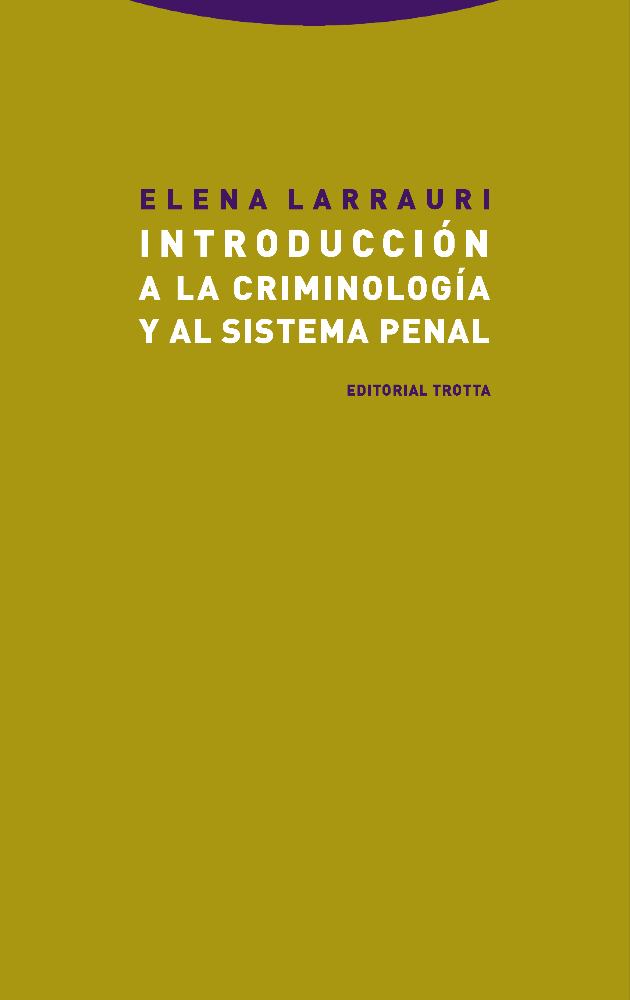

# Preliminares {.unnumbered}

## Coordinación y autoría

-   **Coordinación**: Juanjo Medina y Lorea Arenas

-   **Autoría**:

    -   Juanjo Medina (*Universidad de Sevilla*): capítulos 1, 2, 4, 5, 6, 8, 9, 10, 13, 15 y 15

    -   Lorea Arenas (*Universidad de Extremadura*): capítulos 4, 7 y 14

    -   Raquel Bartolomé (*Universidad de Castilla-La Mancha*): capítulo 11

    -   Jonathan Torres (Universidad de Sevilla): capítulo 3

## Plan de trabajo

El plan es intentar tener borradores preliminares del capítulo sobre concepto, delincuentes, delito, respuestas estatales, clase social, y política antes de finalizar el 2025.

Nuestra aspiración es tener la mayor parte del volumen terminado en septiembre del 2026, listo para ser usado en el primer semestre del curso 2026/2027, aunque es posible que algún capítulo se retrase hasta finales del 2026.

Estamos en proceso de garantizar el uso de todas las imágenes empleadas. Algunas de ellas no presentan problemas, para el uso legítimo de otras aún estamos en fase de tramitar los permisos necesarios.

La apariencia de las imágenes también es algo que tenemos que optimizar. Somos conscientes de que su apariencia varía dependiendo de si se emplea un teléfono u otro tipo de dispositivo. Para poder corregir esto tenemos que programar esta parte del libro directamente en *html* y esto es algo un poco más trabajoso que solamente haremos más adelante.

## ¿Por qué este libro?

Los grados de criminología en España son una titulación relativamente reciente y, a diferencia de lo que ocurre en países de habla inglesa, el mercado de los libros de texto en castellano que sirvan para nutrir de contenido a las distintas asignaturas que conforman estos grados no está tan desarrollado como sería deseable. Para algunas asignaturas simplemente no existen manuales que puedan usarse, mientras que para otras algo más de competencia y posibilidad de elección es algo que alumnos y docentes probablemente considerarían apropiado.

Uno pensaría que la introducción a la criminología, una asignatura generalmente de primero de carrera y fundamental en el itinerario formativo de nuestros estudiantes, sería una excepción a esta norma, pero nuestra tesis es que no, que los manuales al uso en nuestro país no satisfacen del todo las necesidades formativas para asignaturas de introducción a la criminología.

Quitando manuales ya muy viejunos, en España si eres profesor de una introducción a la criminología tienes básicamente dos opciones: los principios de criminología de @Redondo_23 o la introducción de @Larrauri_20 . Por más que estos dos volumenes tienen muchas virtudes a nosotras como docentes nos plantean una serie de limitaciones.

::: {layout-ncol="2"}
{width="40%"}

{width="40%"}

Elena Larrauri y su manual
:::

El manual de @Larrauri_20 aspira a dar una introducción moderna y ajustada al hecho de que esta suele ser una asignatura del primer semestre de primero. Nuestro principal problema con este manual es que, por más que nos gusta, se nos queda corto, sobre todo si tenemos en cuenta que tiene dos partes, una que puede valer para una introducción a la criminología (con unas cien páginas) y otra que más bien es una introducción al sistema de justicia penal o al control penal (que en numerosos planes de estudios es una asignatura diferente también de primero).

::: {layout-ncol="3"}
{width="30%"}

{width="30%"}

{width="30%"}

Santiago Redondo y Vicente Garrido
:::

Con más de 800 páginas los Principios de Criminología de Santiago Redondo y Vicente Garrido cortos no son. Nuestro problema con este manual es que una parte muy notable del mismo es más bien un manual para teoría criminológica y la otra parte también muy notable lo es para asignaturas de lo que se suele llamar en los grados *Formas especiales de criminalidad*. Por tanto, lo que queda del manual para una introducción a la criminología es más restringido de lo que esas 800 y pico páginas pueden sugerir.

En resumen, son dos excelentes manuales, pero queremos usar este texto para reivindicar también un temario diferenciado para las asignaturas de introducción, que no sean, como en otros manuales que no citamos aquí, en realidad y de forma exclusiva una introducción a la teoría criminológica. Es inevitable hablar de teoría en una asignatura de introducción, pero no podemos llevarlo hasta el punto de restar autonomía o sentido a estas asignaturas de introduccion a la disciplina.

Al margen de estas cuestiones, cada libro es también un reflejo de las preferencias teóricas, disciplinares, metodológicas e incluso políticas e ideológicas de quienes los escriben. En ese sentido, pensamos que generar una tercera opción a estos manuales mencionados puede dar una mayor libertad de elección tanto al profesorado como al alumnado.

Este libro además aspira a ser gratuito y de código abierto, además de dinámico. La publicación científica se ha convertido en un negocio para unas cuantas editoriales internacionales que exprimen recursos económicos de estudiantes, administraciones públicas, y universidades. Nosotros creemos en otro modelo de ciencia, uno que la concibe como un bien común que debería estar al alcance de todos [^intro-1], no solamente de quienes pueden permitirse pagar por ella.

[^intro-1]: Para una discusión del concepto del bien común aplicado a la publicación académica ver @Moore_25.

Una de las ventajas de publicar en este formato digital y susceptible al cambio continuo es que probablemente se ira renovando y modificando de una forma más contínua que si fuera un libro de texto al uso. Su versión digital tendrá este carácter dinámico más flexible y abierto. Una vez estemos satisfechos con un primer borrador final generaremos un enlace para que quien quiera pueda descargarse e imprimir este texto en formato pdf. La versión en pdf probablemente solamente la actualizaremos de forma anual, por lo que es posible que en ocasiones se puedan apreciar algunas diferencias entre la versión digital y la version susceptible de impresión como fichero pdf.

## Convenciones

A lo largo del texto se incluiran citas de trabajos originales en numerosas ocasiones de textos escritos en inglés. Para facilitar la lectura y comprensión estas citas, cuando se inserten en el texto principal, serán traducidas al castellano por los autores del volumen.

También a lo largo del texto apareceran "notas" con una apariencia visual como la siguiente:

::: {.callout-note appearance="\"simple"}
**¿Que son las notas?**

Estas notas son simplemente pequeños excursos, aclaraciones o expansiones de algunas ideas que pueden ser leidas para complementar el argumento principal del texto.
:::
