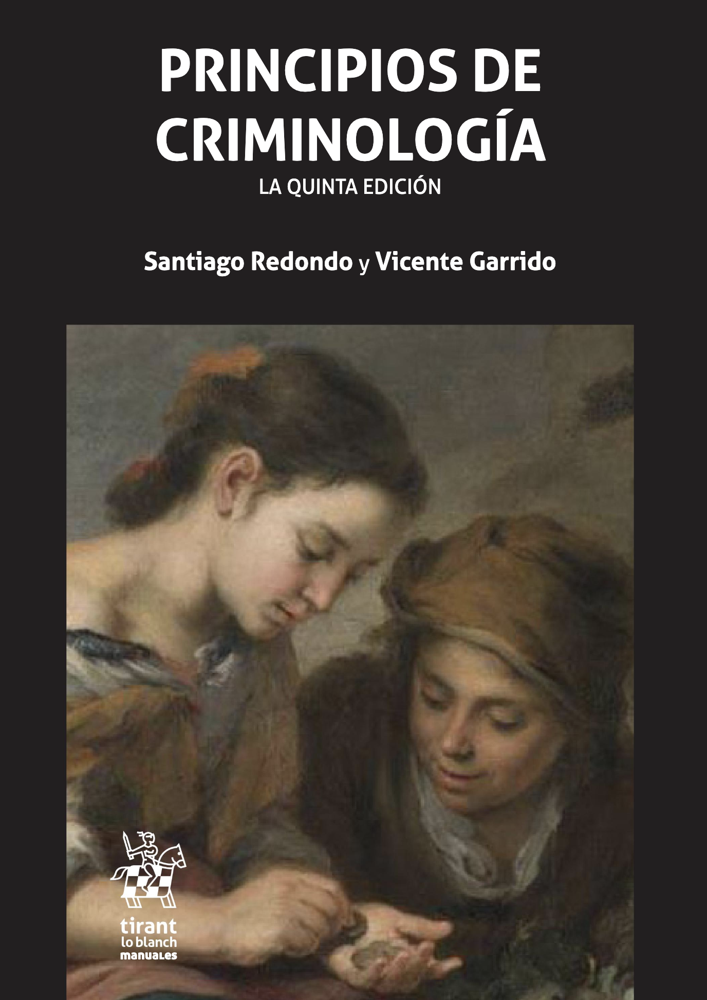

# Preliminares {.unnumbered}

## Mapa del volumen

Este manual está pensado para el alumnado de primer curso de los grados en criminología, que es donde suele situarse la asignatura troncal de *Introducción a la Criminología*. Es a quien hemos tenido en mente al decidir qué explicar, cuánto dar por sabido y en qué tono hacerlo: no presuponemos conocimientos previos de derecho penal, de sociología ni de estadística.

Dicho esto, el volumen no está cerrado sobre esa asignatura. Al preparar los capítulos hemos comprobado que varios de ellos desbordan lo que cabe en una introducción y pueden resultar útiles al profesorado de otras materias del grado. Lo señalamos capítulo a capítulo más abajo, pero valga como avance: los capítulos sobre método y sobre la medición de la delincuencia pueden servir de apoyo en asignaturas de metodología o de estadística aplicada; el de víctimas, en victimología; el de respuestas estatales, en política criminal o sistemas de justicia penal; y los capítulos de la tercera parte, en las asignaturas que abordan género, desigualdad o criminalidad medioambiental. Quien imparta la introducción no necesita usarlos todos, ni en este orden.

El libro se organiza en cuatro partes.

**Primera parte. Introducción.** Los tres capítulos que sientan las bases de todo lo demás.

- **Capítulo 1. ¿Qué es la criminología?** Qué estudia la disciplina, en qué se distingue de los relatos públicos sobre el delito y cómo se ha institucionalizado en España.

- **Capítulo 2. Método científico y criminología.** Para qué sirve el método, qué distingue a las dos grandes culturas de investigación (cuantitativa y cualitativa) y qué tipos de investigación existen.

- **Capítulo 3. La delincuencia en España.** Las fuentes con las que medimos el delito (estadísticas oficiales, encuestas de victimización, estudios de autoinforme y nuevas formas de datos) y qué nos dicen sobre si España es o no un país seguro.

**Segunda parte. Temas de estudio.** Un recorrido por los temas clásicos de la criminología. Están escritos para leerse en orden, y se citan entre sí.

- **Capítulo 4. El delito.** El delito como tema de estudio y como evento situado en el espacio y el tiempo.

- **Capítulo 5. El delincuente.** Participación en actividades delictivas, trayectorias a lo largo de la vida, identidad, especialización y co-delincuencia.

- **Capítulo 6. Grupos y entidades criminales.** Cuando quien delinque no es una persona sola: organizaciones criminales, personas jurídicas y el propio Estado.

- **Capítulo 7. Las víctimas y los procesos de victimación.** Quiénes son las víctimas, quién es reconocida como tal, la victimación secundaria y las respuestas institucionales.

- **Capítulo 8. Las respuestas estatales al delito.** Una historia de cómo la criminología ha pensado lo penal, de la Escuela Clásica a las criminologías críticas.

- **Capítulo 9. Respuestas sociales y culturales al delito.** Lo que la sociedad hace con el delito al margen del aparato penal: miedo al delito, medios de comunicación, punitivismo y criminología cultural.

**Tercera parte. Sesgos.** Cinco capítulos que vuelven sobre lo anterior para preguntarse qué ha dejado fuera la mirada criminológica y por qué.

- **Capítulo 10. Clase social, criminalización y delincuencia corporativa.** Delito de cuello blanco, sesgos de clase del sistema penal y el descubrimiento de la delincuencia de clase media.

- **Capítulo 11. Género y la mirada criminológica.** El olvido de la mujer, las aportaciones del feminismo, los estudios sobre masculinidad y la criminología queer.

- **Capítulo 12. Diferencias étnicas y lo foráneo.** El racismo en los orígenes de la disciplina, la cuestión racial en la criminología norteamericana y el debate sobre inmigración y delincuencia.

- **Capítulo 13. ¿Criminología desde dónde y para cuándo?** El etnocentrismo de una disciplina fabricada en un puñado de países angloparlantes, la criminología del sur y el giro decolonial.

- **Capítulo 14. Antropocentrismo frente a una criminología verde.** Delitos ecológicos, criminalización del ecologismo y lectura social de los desastres "naturales".

**Cuarta parte. ¿Criminología para qué?** Qué se hace con todo esto.

- **Capítulo 15. Criminología y política.** El carácter político de la disciplina, el uso electoral de la inseguridad y el debate sobre la criminología pública.

- **Capítulo 16. La prevención del delito.** Qué es prevenir y qué modelos de prevención existen.

## Coordinación y autoría

- **Coordinación**: Juanjo Medina y Lorea Arenas

- **Autoría**:

  - Juanjo Medina (*Universidad de Sevilla*): capítulos 1, 2, 4, 5, 6, 7, 8, 9, 10, 13, 15 y 16

  - Lorea Arenas (*Universidad de Extremadura*): capítulo 14

  - Raquel Bartolomé (*Universidad de Castilla-La Mancha*): capítulo 11

  - Jonathan Torres (Universidad de Sevilla): capítulo 3

## Plan de trabajo

En la actualidad hay borradores preliminares de casi todos los capítulos cuya autoría corresponde a Juanjo Medina. Faltaría el capítulo de prevención, el 2 y el 15 (no estarán concluidos hasta el 2027). Los capítulos que están siendo realizados por nuestras colaboradoras estarán colgados en red a finales de septiembre o principios de octubre del 2026 en formato borrador. No obstante, estos aparecerán en versión más cruda, en el sentido de que no contendrán imágenes ni notas de clasificación como las que discutimos más adelante. Estos contenidos se irán incorporando a estos capítulos a lo largo del 2027.

Todo lo que está colgado ya en red es "utilizable". Se puede emplear como apuntes de clase y como manual de lectura para el alumnado. No obstante, es nuestra intención seguir limando contenidos y trabajando en la edición de estos materiales a lo largo del curso 2026-2027.

Nuestra aspiración es tener el primer borrador final, con correcciones y control editorial terminado, para septiembre del 2027. En esa fecha también es nuestra intención renderizar el libro en formato PDF para que quien quiera pueda descargárselo e imprimirlo. La versión en PDF no incluirá imágenes fotográficas para facilitar la impresión. Teniendo en cuenta la extensión promedio de los capítulos ya colgados y lo que aún falta por llegar, la versión en PDF es probable que supere las 600 páginas.

## Advertencias para la lectura

El texto aspira a estar escrito en un tono cercano y directo siguiendo las recomendaciones de Howard Becker [-@Becker_20] al respecto. No obstante conviene hacer unos comentarios al respecto:

- 25 años viviendo en la anglosfera le han hecho mucha pupa a mi capacidad para escribir un castellano correcto. Es probable que se aprecien lo que una compañera cariñosamente califica "juanjadas": construcciones gramaticales raras, palabras castellanas inventadas, giros estilísticos o expresiones que suenan como traducciones un poco Spanglish. Soy de quienes escriben "vomitándolo" todo primero, dando saltos cuando me quedo atascado, y preocupándome por la calidad de la expresión después, no de quienes no ponen algo en papel hasta que han encontrado la forma óptima de expresarlo. De ahí que buena parte del trabajo pendiente sea seguir limando este tipo de cosas durante la fase de control editorial.

- El manual lleva más de año y medio en preparación. Se ha ido escribiendo por capítulos y hay secciones nuevas en capítulos que se escribieron hace tiempo. Es difícil en ese contexto mantener el mismo registro. A veces se me va la olla y escribo en un tono más elevado, formal, abstracto, pomposo o como lo queramos llamar. En otras me pasa lo contrario y escribo en un tono excesivamente coloquial. Esta es otra de las tareas pendientes del trabajo editorial.

- Algunos capítulos y/o secciones me han salido probablemente más largas de lo que deseaba. Aún no hemos testado el manual al completo con el alumnado. Es probable que recortemos algunas partes durante el proceso editorial. En todo caso, tampoco pretendemos que uséis todos los capítulos de todo el manual. Que cada cual use lo que le parezca conveniente. En ese sentido preferimos ofrecer de más que quedarnos cortos y que, en función de las limitaciones locales de los planes de estudios en cada universidad, uséis aquellas partes que si no quedarían huérfanas en la formación de vuestro alumnado.

## Imágenes y permisos

Estamos en proceso de garantizar el uso de todas las imágenes empleadas. Algunas de ellas no presentan problemas, para el uso legítimo de otras aún estamos en fase de tramitar los permisos necesarios o de verificar los términos del copyright.

La apariencia de las imágenes también es algo que tenemos que optimizar. Somos conscientes de que su apariencia varía dependiendo de si se emplea un teléfono u otro tipo de dispositivo. Para poder corregir esto tenemos que programar esta parte del libro directamente en *html* y esto es algo un poco más trabajoso que solamente haremos más adelante.

## ¿Por qué este libro?

Los grados de criminología en España son una titulación relativamente reciente y, a diferencia de lo que ocurre en países de habla inglesa, el mercado de los libros de texto en castellano que sirvan para nutrir de contenido a las distintas asignaturas que conforman estos grados no está tan desarrollado como sería deseable. Para algunas asignaturas simplemente no existen manuales que puedan usarse, mientras que para otras algo más de competencia y posibilidad de elección es algo que el alumnado y el profesorado probablemente considerarían apropiado.

Uno pensaría que la introducción a la criminología, una asignatura generalmente de primero de carrera y troncal en el itinerario formativo de nuestro alumnado, sería una excepción a esta norma, pero nuestra tesis es que no, que los manuales al uso en nuestro país no satisfacen del todo las necesidades formativas para asignaturas de introducción a la criminología.

Quitando manuales ya muy viejunos, en España si impartes una introducción a la criminología tienes básicamente dos opciones: los principios de criminología de @Redondo_23 o la introducción de @Larrauri_20 . Por más que estos dos volúmenes tienen muchas virtudes a nosotras como docentes nos plantean una serie de limitaciones para su uso en una asignatura de introducción.

{width="40%"}

El manual de @Larrauri_20 aspira a dar una introducción moderna y ajustada al hecho de que esta suele ser una asignatura del primer semestre de primero. Es un muy buen manual y escrito en un estilo ameno. Nuestro principal problema con este manual es que, por más que nos gusta, se nos queda corto, sobre todo si tenemos en cuenta que tiene dos partes, una que puede valer para una introducción a la criminología (con unas cien páginas) y otra que más bien es una introducción al sistema de justicia penal o al control penal (que en numerosos planes de estudios es una asignatura diferente también de primero).

{width="40%"}

Con más de 800 páginas los Principios de Criminología de Santiago Redondo y Vicente Garrido no es precisamente un libro corto. Ha visto ya varias re-ediciones y no nos cabe duda de que es un buen libro que el alumnado de criminología debería consultar. Nuestro problema con este manual es que una parte muy notable del mismo es más bien un manual para las asignaturas de teoría criminológica y la otra parte también muy notable lo es para asignaturas de lo que se suele llamar en los grados *Formas especiales de criminalidad*. Por tanto, lo que queda del manual para una introducción a la criminología es más restringido de lo que esas 800 y pico páginas pueden sugerir.

En resumen, son dos excelentes manuales, pero queremos usar este texto para reivindicar también un temario diferenciado para las asignaturas de introducción, que no sean, como en otros manuales que no citamos aquí, en realidad y de forma exclusiva una introducción a la teoría criminológica. Es inevitable hablar de teoría en una asignatura de introducción, pero no podemos llevarlo hasta el punto de restar autonomía o sentido a estas asignaturas de introducción a la disciplina.

Al margen de estas cuestiones, cada libro es también un reflejo de las preferencias teóricas, disciplinares, metodológicas e incluso políticas e ideológicas de quienes los escriben. En ese sentido, pensamos que generar una tercera opción a estos manuales mencionados puede dar una mayor libertad de elección tanto al profesorado como al alumnado.

Este libro además aspira a ser gratuito y de código abierto, además de dinámico. La publicación científica se ha convertido en un negocio para unas cuantas editoriales internacionales que exprimen recursos económicos de estudiantes, administraciones públicas, y universidades. Nosotras creemos en otro modelo de ciencia, uno que la concibe como un bien común que debería estar al alcance de cualquiera [^intro-1], no solamente de quienes pueden permitirse pagar por ella.

[^intro-1]: Para una discusión del concepto del bien común aplicado a la publicación académica ver @Moore_25.

Una de las ventajas de publicar en este formato digital y susceptible al cambio continuo es que probablemente se irá renovando y modificando de una forma más continua que si fuera un libro de texto al uso. Su versión digital tendrá este carácter dinámico más flexible y abierto. Una vez estemos satisfechos con un primer borrador final (estimamos que septiembre del 2027) generaremos un enlace para que quien quiera pueda descargarse e imprimir este texto en formato pdf.

La versión en pdf probablemente solamente la actualizaremos de forma anual, por lo que es posible que en ocasiones se puedan apreciar algunas diferencias entre la versión digital y la versión susceptible de impresión como fichero pdf.

## Convenciones

**Sobre el lenguaje.** A lo largo del manual usamos con frecuencia el femenino genérico para hablar de quienes estudian criminología, y no por corrección política: en los grados españoles la mayoría del estudiantado son mujeres, de modo que hablar de "las criminólogas" describe mejor a quien tenemos delante en el aula que el masculino de costumbre. Vale lo mismo para la primera persona del plural con la que os hablamos ("nosotras"), aunque quienes firmamos este volumen seamos un grupo mixto.

Fuera de eso, no forzamos la lengua. Preferimos los nombres colectivos (el alumnado, el profesorado, la clase) al desdoblamiento sistemático, que termina cansando a quien lee, y recurrimos a fórmulas como "alumnas y alumnos" solo cuando aportan algo. Tampoco empleamos ni la arroba ni la terminación en *-e*, porque no se pueden leer en voz alta y complican el trabajo de los lectores de pantalla que utilizan las personas ciegas. Y nos dirigimos a vosotras en segunda persona del plural a lo largo de todo el libro.

Hay un caso en el que nos apartamos de todo lo anterior. Cuando hablemos de personas que delinquen o de personas victimizadas seremos literales con el sexo del que hablan los datos ("los hombres condenados por...", "las mujeres víctimas de..."), porque ahí la composición por sexo no es una cuestión de estilo sino un dato del propio objeto de estudio: un genérico cómodo escondería precisamente aquello que el capítulo 11 quiere hacer visible.

**Sobre las traducciones.** A lo largo del texto se incluirán citas de trabajos originales en numerosas ocasiones de textos escritos en inglés. Para facilitar la lectura y comprensión estas citas, cuando se inserten en el texto principal, serán traducidas al castellano por quienes firmamos el volumen.

También a lo largo del texto aparecerán "notas" con una apariencia visual como la que vais a ver a continuación. A lo largo del texto os encontraréis tres tipos de anotaciones: apuntes de profundización, ideas sobre materiales audiovisuales, y pinceladas sobre salidas profesionales.

::: {.callout-note appearance="simple"}
**¿Qué son las notas de profundización?**

Estas notas son simplemente pequeños excursos, aclaraciones o expansiones de algunas ideas que pueden ser leídas para complementar el argumento principal del texto.
:::

::: {.callout-tip appearance="simple"}
**Documentales y otro material audiovisual**

También encontraréis anotaciones como esta que os ofrecerán sugerencias sobre documentales, películas, series u otro tipo de material audiovisual que pensamos que puede ser útil para daros otra perspectiva sobre los temas tratados.
:::

::: {.callout-warning appearance="simple"}
**Orientación profesional**

Y finalmente encontraréis otro tipo de anotaciones como esta en la que aclararemos alguna cuestión sobre salidas profesionales o el mercado laboral para las criminólogas. Esto es un manual para una asignatura de primero de carrera. Aún tenéis tiempo de sobra para tratar de reflexionar sobre vuestro futuro profesional. Pero es nuestra experiencia que el alumnado de criminología comienza estos estudios sin tener una idea muy clara de cuáles son las salidas profesionales reales en este ámbito o cómo está el mercado profesional. En estas anotaciones os daremos algunas pistas que esperamos os puedan ser de utilidad.
:::

## Política de uso de IA

Cuando comenzamos a escribir este manual algunas de nosotras sospechábamos que los trabajos que nos entregaba el alumnado estaban realizados con algún tipo de IA, pero no usábamos nosotras mismas este tipo de herramientas. Mucho ha cambiado en los últimos doce meses a medida que los modelos han ido mejorando y las grandes tecnológicas agresivamente tratan de meternos la IA por las orejas a efectos de justificar la inversión realizada y seguir manteniendo una estrategia de crecimiento [@Doctorow_26].

Somos críticas de la forma en que estas herramientas se están empleando y consideramos que el alumnado se arriesga a no aprender y desarrollarse como persona si se limita a externalizar su trabajo a estas herramientas. Pero sería absurdo negar que a veces pueden ser útiles. En este manual hemos usado IA en algunas instancias, sobre todo para realizar algunas labores mecánicas y repetitivas, y queremos ser transparentes al respecto para que nadie se lleve a engaño. En particular hemos utilizado herramientas de inteligencia artificial para:

- Pasar de Word a Quarto los capítulos de aquellas colaboradoras que no escriben directamente en Quarto Markdown por falta de familiaridad con este lenguaje. Es una labor de cortar y pegar, repetitiva, que hemos delegado a la IA.

- Limpiar el fichero con nuestras referencias bibliográficas. Otra labor muy cansina y repetitiva. Las referencias se incluyeron de forma manual en este fichero en relación con los capítulos generados por Juanjo Medina, pero fueron extraídas de forma automática de los ficheros presentados por las distintas coautoras. También usamos IA, Claude en particular, para asegurarnos que aparecían listadas en orden, no había faltas de ortografía en las mismas, no había duplicidades, usábamos el formato APA7, y las referencias estaban incluidas de forma que la renderización sería correcta en casos de apellidos compuestos y otro tipo de situaciones que frecuentemente generan errores de renderización. También pedimos a Claude que revisara si alguna referencia parecía incorrecta y generara un fichero con estas para que pudiéramos chequearlas manualmente.

- Hemos incluido algunas imágenes generadas por ChatGPT en estilo cómic cuando para ilustrar alguna sección no conseguíamos encontrar una foto adecuada en Wikimedia Commons con derechos de uso que nos permitieran su reproducción aquí.

- Algunos de los gráficos generados inicialmente en R y por conveniencia y rapidez fueron pasados a Claude para que los renderizara conforme a un estilo visual adecuado para este manual.

- Para generar bibliografía sobre determinados temas usamos consensus y elicit. Aunque en relación con ningún tema o cuestión concreta fueron las únicas herramientas que empleamos. También usamos para todo el proceso de documentación nuestro propio conocimiento de las materias y formas tradicionales de buscar bibliografía.

- No soy experto en css. De forma que para modificar algunos aspectos visuales de esta página web he tenido que consultar con Claude cómo modificar el código, por ejemplo, a la hora de identificar cómo modificar el código css para que los fondos de los recuadros descritos en la sección anterior fueran de distinto color.

Es previsible que en el trabajo de control editorial hagamos uso de alguna forma, que ya declararíamos, de alguna inteligencia artificial (por ejemplo, para identificar referencias huérfanas).
