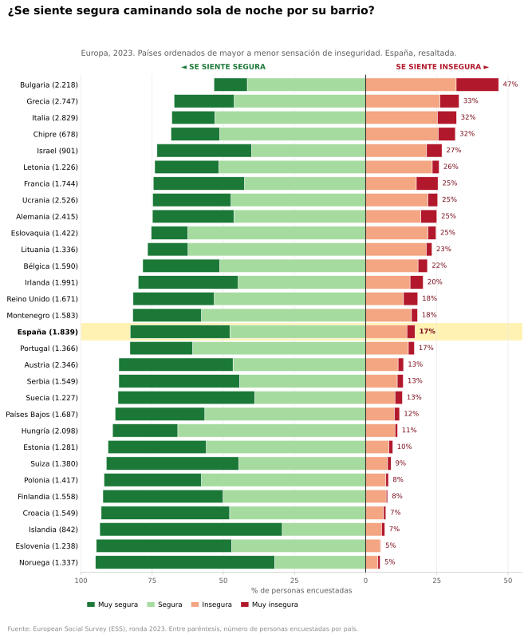
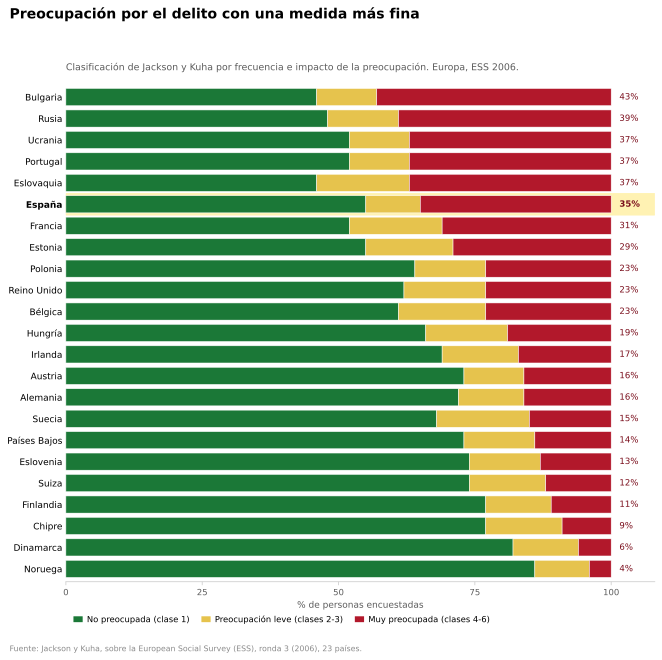
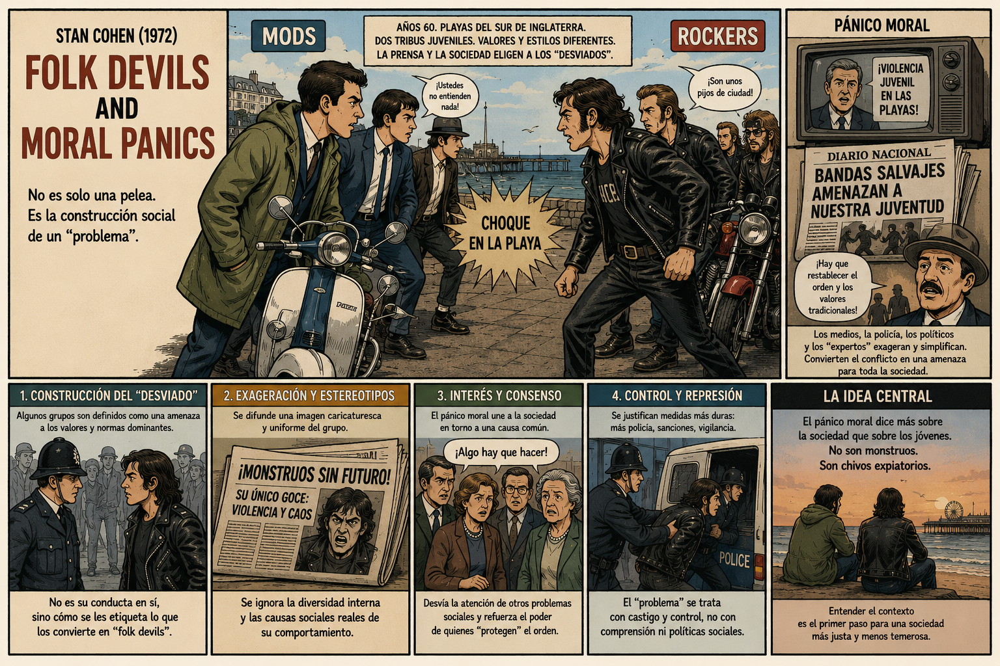
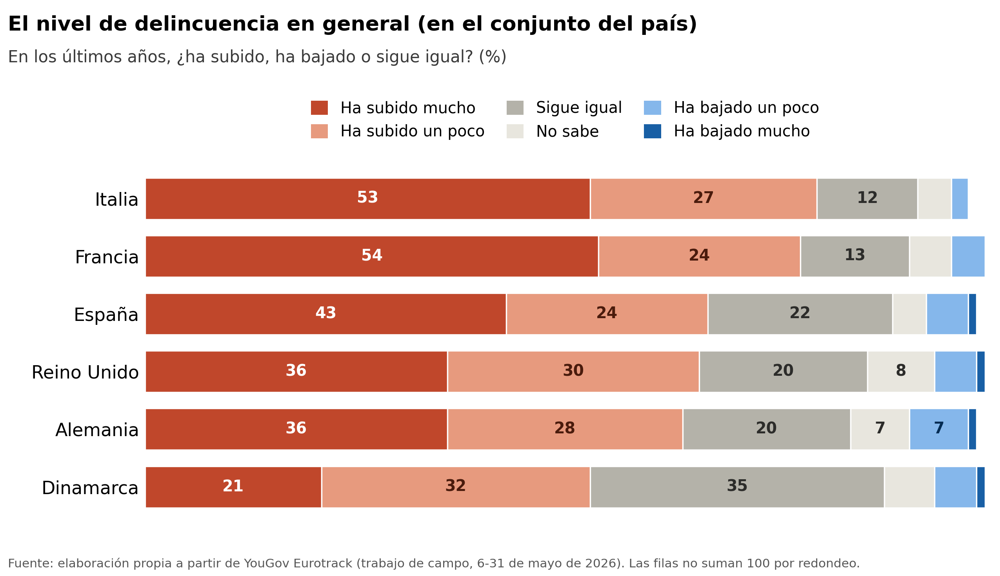

## Introducción

A estas alturas ya hemos examinado muchos de los objetos tradicionales de estudio de la criminología. Hemos estudiado el delito como acto o evento (Capítulo 4); nos hemos preguntado quién lo comete, ya sea una persona Capítulo 5) o toda una organización, una empresa o un Estado (Capítulo 6); nos hemos puesto del lado de quien lo padece (Capítulo 7); y hemos visto de qué modo le responde la maquinaria estatal y las instituciones de control penal (Capítulo 8). Con todo eso podría parecer que ya hemos terminado de cartografiar el mapa de los objetos de estudio de la criminología. Tenemos el hecho, sus protagonistas y el aparato institucional oficial que se pone en marcha cuando algo ocurre. Y sin embargo falta una pieza fundamental, lo que la sociedad hace con el delito al margen de esa maquinaria, cómo lo vive, lo interpreta y lo cuenta. Recordad el experimento filosófico: "Si un árbol cae en un bosque y nadie está cerca para oírlo, ¿hace algún sonido?". ¿Podemos entender el delito sin atender a cómo lo oye y lo interpreta la sociedad?

En este capítulo queremos destacar que el delito no es un evento objetivo que acontece únicamente en la calle o dondequiera que ocurra. Transcurre también en el telediario, en el grupo de WhatsApp del vecindario, en la charla de sobremesa y en esa sensación de inseguridad que una puede llevar encima al volver de noche a casa. La sociedad no se limita a sufrir el delito como hecho acotable a unas coordenadas espacio temporales, sino que lo percibe, lo teme, lo relata, lo interpreta y responde a él de forma colectiva. Y lo que nos interesa abordar en este capítulo es que esa lectura colectiva que hacemos como sociedad no es un ruido ajeno alrededor del delito "de verdad", es, ella misma, un objeto de estudio científico. El miedo que no se ajusta al riesgo real, la alarma social que a veces se dispara aunque las tasas de delito bajen, la imagen del delincuente que nos hemos formado sin haber presenciado nunca un delito, nuestro imaginario sobre la actuación policial, todo ello son cosas que se pueden medir, investigar y discutir, y la criminología lleva décadas haciéndolo.

Vista desde esta perspectiva, la delincuencia deja de ser un simple suceso (algo que pasa en un lugar y a una hora) para volverse además un fenómeno cultural y social, un asunto cargado de emociones, de imágenes y de significados que hablan tanto de la sociedad que los produce como del hecho en sí. Este capítulo recorre varios de esos objetos, cada uno con su propia tradición de investigación detrás. Veremos el miedo al delito y de qué está hecho en realidad; el papel de los medios en la construcción de la realidad delictiva y en la fabricación de pánicos; la demanda social de castigo, y por qué sube aunque el delito no aumente; y, para terminar, daremos unas breves pinceladas sobre la criminología cultural que es el enfoque que coloca la emoción y el sentido en el centro del análisis. Reunirlos aquí es una forma de ensanchar el catálogo de lo que la criminología considera de su incumbencia, no solo el delito y quienes lo protagonizan, sino también la vida social y simbólica que lo rodea.

## El miedo al delito

### La "invención" del miedo al delito

Si algo muestra la historia social del miedo, es que lo que nos ha podido generar terror en el pasado, no es necesariamente lo que genera miedos y ansiedades hoy en día. El miedo es una respuesta básica y emocional ante una amenaza o peligro percibido que siempre ha estado con nosotros, aunque no siempre tiene los mismos desencadenantes. No es una realidad natural y fija, la misma en cualquier época, sino algo que cada tiempo siente a su manera y organiza a su modo.

.jpg).](images/goya.jpg){#fig-goya width="100%"}

El historiador francés Jean Delumeau [-@Delumeau_78] reconstruyó cómo el Occidente de comienzos de la Edad Moderna vivió angustiado por miedos colectivos (la peste, el infierno, el fin del mundo) que la propia cultura y la Iglesia se encargaban de nombrar y administrar para regular la cohesión moral y mantener la disciplina social. Joanna Bourke [-@Bourke_05] estudió estos procesos hasta los siglos XIX y XX y mostró que aquello que una sociedad teme cambia con el tiempo. En sus trabajos, esta autora documentó cómo el miedo pasó de ser una ansiedad cósmica/espiritual a una física y secular (el miedo a ser enterrado vivo, el miedo al tren, el miedo a la guerra nuclear y el miedo a los delitos violentos). Bourke también sugiere que expertos, medios y políticos tienen mucho que ver en decidir cuál es el miedo del momento [@Bourke_05]. En ese sentido, desde la filosofía política, Corey Robin [-@Robin_04] nos recuerda que el miedo nunca ha sido solo una emoción privada, sino también una idea y una herramienta política, un recurso para gobernar que se puede remontar al trabajo de Hobbes en adelante. En sus escritos Robin [-@Robin_04] documenta como el miedo no es solo una reacción a amenazas reales, sino que a menudo es una herramienta fabricada por las élites para preservar las jerarquías sociales y mantener la autoridad.

Al miedo al delito hay que situarlo, por tanto, dentro de esta historia social general de nuestros miedos. Como **objeto de estudio** social y criminológico (algo que se define, se mide y se investiga), el miedo al delito es relativamente reciente. Nace en un sitio y en una época bastante precisos, los Estados Unidos de finales de los años sesenta. Podemos situar el comienzo de esta historia al momento en que se comienzan a desarrollar las primeras encuestas de victimación. Hasta entonces el delito se medía casi solo con las estadísticas de la policía, y a lo largo de los años sesenta fue creciendo la sospecha de que esas cifras se dejaban fuera muchísimo delito, el que nunca llega a denunciarse, la llamada cifra negra. 

Para medir mejor la delincuencia, en Estados Unidos se empezó a preguntar a la gente directamente, casa por casa, si había sido víctima de algún delito. Es así como surgieron las primeras **encuestas de victimización** [@Biderman_67; @Reiss_67; @Hindelang_76]. Y al preguntar por la experiencia del delito, esas encuestas tropezaron con algo que no iban buscando de forma particularmente deliberada, el tamaño de la preocupación ciudadana por el crimen. Por primera vez se podía cuantificar lo asustada que estaba la población. El miedo al delito apareció en el radar, en buena medida, porque se había construido un radar capaz de detectarlo.

No obstante, este "descubrimiento" no fue solo cosa de encuestas. Como la propia historia social del miedo en general sugiere, la "aparición" del miedo al delito hay que entenderlo dentro de un determinado contexto socio-político. En aquellos años el delito se había vuelto en Estados Unidos un asunto político de primer orden, que enfrentaba dos visiones del mismo y su control. De un lado, el programa reformista de la "Gran Sociedad" del entonces presidente Lyndon Johnson veía el delito como síntoma de males sociales (pobreza, vivienda indigna, exclusión, racismo); su comisión de expertos, que en 1967 publicó el informe titulado *El desafío del delito en una sociedad libre*, llegó a sostener que pretender controlar el delito solo con el sistema de control penal (policía y carcel) era negarse a admitir que el aumento de la delincuencia delata el fracaso de toda una sociedad [@Medina_11]. Del otro lado, y como veremos en más detalle en el capitulo 15, iba adoptando forma una política de "ley y orden" que proponía lo contrario: más poder para la policía, penas más severas, y mano dura contra los sospechosos de haber cometido delitos. Richard Nixon utilizó estos temas durante su campaña presidencial y tituló uno de sus documentos de propaganda electoral "Hacia una libertad *sin miedo*" (*Toward Freedom from Fear*, 1968). En ese mismo clima de fuerte debate nacional sobre el delito y las protestas urbanas, el Congreso aprobó la *Ley de Control del Crimen y Calles Seguras* de 1968 (*Omnibus Crime Control and Safe Streets Act of 1968*).

![Tres momentos en la construcción del miedo al delito como objeto: la denuncia política 
de los años sesenta, su formalización metodológica y su crítica genealógica.[^cred-miedo]](images/portadas-miedo-al-delito.png){#fig-miedo-portadas width="100%" fig-alt="Cubiertas de The Fear of Crime, de Richard Harris; Fear of Crime, de Kenneth F. Ferraro; e Inventing Fear of Crime, de Murray J. Lee."}

[^cred-miedo]: Cubiertas reproducidas al amparo del derecho de cita (art. 32.1 LPI). 
Los derechos corresponden a Frederick A. Praeger, State University of New York Press 
y Willan Publishing respectivamente.

No es de extrañar, por tanto, que el primer libro que puso el "miedo al delito" en su título, de Richard Harris [-@Harris_69], contara precisamente cómo ese miedo se fue fabricando, en parte, en los despachos de los políticos y en los mítines electorales. Murray Lee [-@Lee_01] ha desarrollado con más detalle esta idea. Para este autor, el miedo al delito no era un fenómeno que estuviera ahí esperando a que la criminología lo descubriera. El miedo, en buena parte, es un constructo social que se fue **produciendo** a la vez que se lo medía y se lo nombraba. Las encuestas no se limitaron a retratar un miedo que ya existía; ayudaron a darle forma, a convertirlo en una cosa contable y gobernable sobre la que tenía sentido pedirle algo al Estado. Lejos de restarle interés, esto es lo que lo vuelve un objeto de estudio tan revelador. Cuando investigamos el miedo al delito estudiamos, tanto o más que al delito, a la sociedad que teme, que lo mide y que hace política con él.

A Europa, y a España, el miedo al delito llegó un poco más tarde y también de la mano de las encuestas y de los políticos. El Reino Unido lideró el movimiento de desarrollo de encuestas de victimación en Europa. En 1982, el Ministerio del Interior británico puso en marcha la Encuesta Británica sobre Delincuencia (BCS, por sus siglas en inglés, *British Crime Surve*; actualmente *Crime Survey for England and Wales* (CSEW), dado que realmente son los territorios británicos que cubre). Fue la primera encuesta nacional a gran escala (y aún la más sofisticada) en Europa diseñada para medir la ansiedad pública ante la delincuencia, junto con las tasas reales de victimización. La investigación europea se expandió internacionalmente con el lanzamiento de la *Encuesta Internacional sobre Víctimas de Delitos* (ICVS, por sus siglas en inglés) en 1989. Desarrollada por criminólogos europeos (en particular de los Países Bajos y el Reino Unido) junto con socios internacionales, la ICVS permitió a los investigadores comparar el miedo al delito en diferentes naciones europeas utilizando, por primera vez, preguntas estandarizadas. A día de hoy es la *Encuesta Social Europea* el principal instrumento que tenemos para entender como varía el miedo delito en nuestro continente.

Pero al margen de las encuestas, también jugó un papel en la construcción social de este fenómeno la instrumentalización política de los datos generados por las mismas. Durante las décadas de 1960 a 1980, Europa occidental experimentó una profunda metamorfosis social que redefinió los términos del debate público. Hasta bien entrados los años sesenta, el delito se concebía predominantemente como una anomalía técnica o una disfunción social corregible mediante el desarrollo del Estado del bienestar, la educación y la reintegración penal. Sin embargo, el cruce entre transformaciones urbanas aceleradas, crisis económica y mutaciones ideológicas convirtió la delincuencia común y, sobre todo, el miedo al delito, en un elemento clave en el debate político. El punto de inflexión definitivo llegó con la victoria de Margaret Thatcher en el Reino Unido (1979). La derecha británica articuló una narrativa eficaz que vinculaba el delito callejero, las huelgas sindicales y el declive moral en un único diagnóstico: la debilidad de la autoridad estatal. La criminalidad dejó de tratarse como un síntoma de desigualdad estructural para ser enmarcada como un problema de responsabilidad individual y falta de castigo ejemplar y, en este contexto, hablar del miedo ciudadano al delito jugaba un papel retórico fundamental.

El miedo al delito sigue siendo hoy un tema de considerable debate académico. No obstante, como veremos en la siguiente sección, buena parte de la criminología contemporánea ha adoptado una visión mucho más crítica del mismo frente a los planteamientos iniciales, que interpretaban los datos de estas encuestas como medidas válidas y fidedignas del miedo al delito, y propone en su lugar mirar más allá de lo que el término miedo al delito implica, hacia las inseguridades difusas de la vida cotidiana y el sentirse o no en casa en el propio entorno, en tiempos de incertidumbre [@Loader_23], lo que se ha venido a llamar el miedo expresivo.

### El miedo al delito como expresión de otros malestares

Las primeras encuestas de victimación a las que hemos aludido sacaron a la luz resultados sobre la distribución social del miedo al delito que han organizado buena parte de la investigación posterior [@Hale_96] y venían a señalar que el miedo no se corresponde con el riesgo de victimación. Los primeros resultados de encuestas revelaron una tendencia importante conocida como la paradoja riesgo/miedo (*risk/fear paradox*): los grupos demográficos con riesgos estadísticamente menores de victimización (como los ciudadanos mayores y las mujeres) a menudo reportaban los niveles más altos de miedo, mientras que los grupos con mayor riesgo (como los hombres jóvenes) reportaban menos. Cabría esperar que temieran más quienes más probabilidades tienen de ser víctimas, y aparentemente ocurre a menudo lo contrario. El perfil con más papeletas de acabar en una pelea a la salida de un bar, un hombre joven, es de los que menos miedo declaran; mientras tanto, una persona mayor, que sale poco de noche y es víctima con mucha menos frecuencia, suele declarar bastante más miedo. Se comenzó así a cobrar conciencia de que el miedo al delito es un problema social distinto, separado del delito en sí. Responde a dinámicas diferentes, y por eso merece estudiarse por sí mismo.

::: callout-note
**¿Y si el miedo también ha bajado?**

Una idea muy repetida, dentro y fuera de la criminología, dice que los niveles del delito pueden bajar pero el miedo se queda alto. De hecho, esta idea dio lugar a innovaciones policiales dirigidas específicamente a tratar de reducir los sentimientos subjetivos de inseguridad del delito [@Innes_2007]. La evidencia reciente ha venido a matizar esta afirmación. Reuniendo unas 1.100 series de datos de 121 países entre 1989 y 2015, Eysink Smeets y Foekens [-@EysinkSmeetsFoekens_18] construyeron un índice internacional de tendencia y encontraron una caída acusada del miedo en cuatro de las cinco grandes regiones con más datos, todas en Europa y el mundo anglosajón. En Inglaterra y Gales, la preocupación por el delito descendió de forma sostenida entre 1998 y 2019, y la propia brecha entre hombres y mujeres se estrechó en los delitos que implican contacto físico [@PohlBuilGil_24]. Hay que separar dos planos para no liarnos. Que quien más teme no sea quien más riesgo corre (como señalamos en esta sección), un desajuste entre unas personas y otras, sigue siendo cierto; pero, a lo largo del tiempo, el miedo tampoco se ha quedado congelado en lo alto, sino que ha acompañado a la bajada del delito. No deberiamos confundir los niveles de análisis el individual y el que opera a nivel colectivo a lo largo del tiempo.
:::

Si no existe una clara relación entre el riesgo de victimación real y el miedo al delito ¿De qué está hecho el miedo? ¿Qué lo alimenta? ¿De qué estamos hablando en realidad? Para dar respuesta a estos interrogantes, ayuda aquí el trabajo de Jonathan Jackson y su equipo en la *London School of Economics* [-@Jackson_04], que propone entender buena parte de este miedo como **expresivo**. Para mucha gente, hablar del miedo al delito es una manera de hablar de otra cosa. El delito hace de pantalla donde se proyectan inquietudes más difusas y más difíciles de nombrar, como la sensación de que el barrio se degrada, de que las normas se relajan, de que el mundo que una conocía se nos escapa entre los dedos. Temer al delincuente es una forma concreta, y por eso más manejable, de temer al cambio.

![El miedo al delito como expresión de inquietudes sobre el orden social: del estudio 
etnográfico de Macclesfield a la ansiedad ante el desorden en un clima alterado.[^cred-orden]](images/portadas-miedo-orden-social.png){#fig-miedo-orden width="100%" fig-alt="Cubiertas de Social Order and the Fear of Crime in Contemporary Times, de Farrall, Jackson y Gray; Crime and Social Change in Middle England, de Girling, Loader y Sparks; y Ecologies of Security, de Loader, Sparks, Girling y Bradford."}

[^cred-orden]: Cubiertas reproducidas al amparo del derecho de cita (art. 32.1 LPI). 
Los derechos corresponden a Oxford University Press, Routledge y Bristol University Press 
respectivamente.

Debajo late la idea de la **seguridad ontológica** [@Giddens_91], esa confianza básica en que el mundo es más o menos previsible, en que mañana se parecerá a hoy, la que nos deja salir a la calle sin angustiarnos a cada paso. Cuando esta seguridad ontologica se resquebraja, aflora una inquietud que necesita agarrarse a algo, y el miedo al delito le ofrece un objeto con cara y ojos: el ladrón, el extraño, el que merodea.

Zygmunt Bauman[^sociedad-1] [-@Bauman_00] situó todo esto en un diagnóstico más amplio, el de la **modernidad líquida** . Este sociólogo mantiene que vivimos en un mundo donde lo que antes era sólido (el empleo para toda la vida, la pareja para siempre, el barrio de siempre) se ha vuelto provisional, revocable de un día para otro. Lo resume en una palabra alemana, *Unsicherheit*, que junta lo que en castellano son conceptos separados: inseguridad, incertidumbre y desprotección. Esa desazón busca dónde posarse, y el delito le sirve, porque temer al que merodea en la esquina resulta más llevadero que temer a la precariedad de una vida entera, que no tiene rostro. Digamos que Jackson explica que es lo que realmente miden nuestras preguntas sobre miedo al delito y Bauman nos ofrece un marco para entender por qué hoy este miedo expresivo podría estar tan desbocado.

[^sociedad-1]: A Bauman hay que leerlo con cierto cuidado. Es un autor que parece explicarlo todo, y quien lo explica todo acaba explicando poco en concreto; su diagnóstico funciona mientras cada afirmación se pueda anclar en un dato o en un caso.

Aunque originadas en el contexto anglosajón estas ideas han sido exploradas en otros contextos. En Chile, por ejemplo, Lucía Dammert [-@Dammert_03] encontró que lo que mejor predice el miedo al delito no es haber sido víctima del mismo, sino un conjunto de inseguridades económicas, sociales y políticas, más un miedo a la vida que un miedo al delito. Que el patrón aparezca también en América Latina lo refuerza y lo acerca a nuestro contexto. Investigaciones recientes en Francia también encuentran ese mismo patrón experiencial y expresivo como relevante para entender el llamado miedo al delito [@Noble_25].

![El debate sobre desorden, deterioro y delito: la tesis del espiral de declive, 
su traducción en programa de política policial y la refutación empírica.[^cred-ventanas]](images/portadas-desorden-ventanas-rotas.png){#fig-ventanas width="100%" fig-alt="Cubiertas de Disorder and Decline, de Skogan; Fixing Broken Windows, de Kelling y Coles; y Breaking Away from Broken Windows, de Taylor."}

[^cred-ventanas]: Cubiertas reproducidas al amparo del derecho de cita (art. 32.1 LPI). 
Los derechos corresponden a The Free Press, Martin Kessler Books / The Free Press y 
Westview Press respectivamente.

En esta misma linea, se ha desarrollado una linea de investigaciones que vinculan el miedo a nuestros sentimientos sobre el entorno cercano, lo que se ha venido a describir como el **desorden** percibido. Mucha gente calibra la seguridad de su calle leyendo "señales de desorden" (una pintada, la basura, un grupo de chavales en una esquina, un portal abandonado) o lo que otros autores bautizaron como "ventanas" o "cristales rotos" [@WilsonKelling_82] más que estadísticas sobre los niveles de delincuencia. Y esa lectura del entorno comunitario o del vecindario no es neutra, porque se tiende a ver más "desorden" donde hay más presencia de minorías o de pobreza, aunque el desorden "objetivo" (medido de forma independiente por observadores externos) sea el mismo, ya que el prejuicio tiñe lo que se mira [@Bradford_25; @Sampson_04]. El desorden, como el miedo, está en parte en el ojo del que mira, y ese ojo arrastra los sesgos de su sociedad.

Y ese sesgo tiene una dirección preferente. La inquietud difusa ante el cambio rara vez se queda en el nivel abstracto; generalmente se condensa en una figura con rostro, y ese rostro suele estar racializado, el del otro, el extraño, que en cada época y lugar tiene un color y un origen concreto. Esa asociación actúa a veces de forma inconsciente. En una serie de experimentos, Jennifer Eberhardt [-@Eberhardt_04] mostró que basta con activar la idea de delito para que la mirada de la gente, también la de agentes de policía, se desplazara hacia las caras de hombres negros, y a la inversa, que ver una cara negra dispara pensamientos de delincuencia y amenaza. Negro y delito, o inmigrante y delito, parecen venir soldados de fábrica en el imaginario de muchas sociedades.

Esa soldadura colorea la percepción del peligro. Cuando se ha medido, tanto el delito que la gente *cree* que hay en un barrio como el miedo que declara ambos suben con la proporción de vecinos negros o inmigrantes, aunque el delito real no cambie; la composición demográfica del vecindario predice la percepción del nivel de delincuencia mejor que las cifras sobre el nivel de delincuencia real [@Quillian_01; @Chiricos_97]. El supuesto miedo al delito, una vez más, tiene un componente de amenaza imaginada que en realidad nos habla más del miedo al "extraño" que del miedo al delito.

En Europa, y en España, ese otro es sobre todo el inmigrante, y no por casualidad. La sospecha del inmigrante como criminal tiene raíces históricas profundas que han sido señaladas por los investigadores [@Steinmann_25], pero que se aviva o se apaga según inflame o no la política. Donde los partidos de extrema derecha presentan la inmigración como una amenaza, la sensación de inseguridad de la población sube, y la exposición a las noticias la amplifica todavía más [@Abreu_24]. Ese encuadre mediático del inmigrante como delincuente viene de lejos y se ha intensificado con los años; numerosos estudios muestran que la prensa retrata de forma sistemática al inmigrante como especialmente propenso al delito [@HarrisGruenewald_20], pese a que la investigación comparada más solvente no encuentra que la inmigración dispare el delito [@Fasani_2019; @KubrinOusey_2023]; cuando aparece alguna asociación, se explica por las barreras del mercado laboral que empujan a ciertos colectivos, no por su origen [@MariePinotti_24]. El inmigrante como delincuente es, en buena medida, un personaje del imaginario, no una regularidad observada en los datos de delincuencia.

No obstante todo lo señalado hasta aquí, que buena parte del miedo al delito exprese inquietudes sociales más amplias no significa que todo él sea humo, ni que no exista un miedo real y concreto al delito. Distinguir lo uno de lo otro ha resultado ser, sobre todo, un problema de medición.

### ¿Podemos hablar de un miedo específico al delito?

Durante años, casi todo lo que sabíamos del miedo al delito venía de una o dos preguntas de encuesta que en realidad no preguntan exactamente por el miedo. La más habitual es alguna variante de "¿se siente segura caminando sola por su barrio al caer la noche?", que capta más bien una valoración general de lo insegura que parece la zona, y no un episodio de miedo realmente vivido. Esa pregunta, por ejemplo, es la que aún a día de hoy realiza la *Encuesta Social Europea*.

::: callout-note
**¿Qué mide de verdad una encuesta de miedo al delito?**

Durante décadas, las grandes encuestas midieron el miedo con un único indicador (lo segura que alguien *dice* sentirse en la calle de noche), que mezcla el miedo con el juicio sobre el barrio, con la cautela razonable y hasta con la costumbre de salir poco. Consciente del problema, la investigación reciente ha intentado preguntar mejor: separar la preocupación difusa de los episodios concretos y medir con qué **frecuencia** e **intensidad** se siente miedo, no solo si se siente. Dos esfuerzos destacan. La *Crime Survey for England and Wales* (por entonces la *British Crime Survey*) incorporó ya en 2003/04 preguntas sobre la frecuencia real de la preocupación, y no solo sobre su presencia [@GrayJacksonFarrall_08]. Y, para poder comparar países, el equipo de la *London School of Economics* explotó una batería de indicadores de preocupación por el delito de la *Encuesta Social Europea* (ronda 3, 2006), compuesto de preguntas mucho más afinadas que el clásico "¿se siente segura de noche?" [@JacksonKuha]. Medir mejor no es un capricho, de cómo se pregunte depende que el retrato social resultante.
:::

La sospecha sobre estos problemas de medición no era nueva; ya en los años ochenta, Kenneth Ferraro y Randy LaGrange [-@FerraroLaGrange_87] habían advertido en Estados Unidos de que muchas de las medidas al uso confundían el miedo con la mera percepción del riesgo. Siguiendo esta intuición, un grupo de investigadoras de la Universidad de Sheffield en el Reino Unido comprobó qué había detrás de esas respuestas preguntando a la gente cuántas veces, y cuándo, había sentido miedo de verdad [-@Farrall_97]. Buena parte de quienes puntuaban alto en las preguntas estándar no habían tenido un solo episodio de miedo en el último año. La imagen de un país atemorizado se debía, en parte, al propio instrumento, que convertía en "miedo" lo que muchas veces era la ansiedad difusa o miedo expresivo al que aludíamos en el apartado anterior.

, 
[CC BY 4.0](https://creativecommons.org/licenses/by/4.0), vía 
[Wikimedia Commons](https://commons.wikimedia.org/wiki/File:A_man_frightened_by_his_own_shadow._Wood_engraving._Wellcome_V0036027.jpg).](images/shadow.jpg){#fig-sombra width="100%" fig-alt="Grabado en madera: un hombre retrocede sobresaltado al ver su propia sombra proyectada en el suelo."}

Cuando Jonathan Jackson y Emily Gray [-@JacksonGray_10] separaron la ansiedad difusa, el miedo expresivo, de los episodios concretos de preocupación (el temor a una situación puntual, en un lugar y un momento), el retrato cambió de manera muy notable. Con la pregunta estándar, alrededor de un tercio de la población de Inglaterra y Gales se declaraba preocupada por sufrir un atraco; pero, al preguntar cuántas veces se había preocupado de verdad en el último año, solo lo había hecho un 16%, apenas un 5% se preocupaba una vez al mes o más, y el 85% no se había preocupado ni una sola vez [@GrayJacksonFarrall_08]. Debajo de aquel país aparentemente atemorizado latía, eso sí, un miedo específico y real en una parte pequeña pero nada desdeñable de la población.

Y apareció además algo que la investigación previa había pasado por alto: no todo ese miedo es dañino. Jackson y Gray distinguen un miedo **disfuncional**, que corroe la calidad de vida sin dar nada a cambio, de un miedo **funcional**, que empuja a tomar precauciones sensatas, hace que la persona se sienta más segura y no le amarga la existencia [@GrayJacksonFarrall_08; @GrayJacksonFarrall_11]. En su encuesta londinense, en torno a una cuarta parte de quienes se declaraban preocupados por el delito encajaban en ese segundo tipo: su inquietud se parecía más a una manera de cuidarse que a una ansiedad patológica. El miedo al delito, así, no es una sola cosa: va desde quien no teme, pasa por una vigilancia de bajo nivel que hasta resulta útil, y llega a la angustia frecuente que sí incapacita.

### Género y miedo al delito

El caso del miedo al delito en las mujeres merece una mención especial, porque durante años es un tema que generó bastante controversia en nuestra disciplina. Las encuestas mostraban una y otra vez que las mujeres declaran más miedo que los hombres mientras que, a la vez, sufren menos delito violento en el espacio público; y esa diferencia, pequeña pero constante, se magnificó en algunas encuestas y acabó convertida por los medios de comunicación y algunos académicos en un estereotipo facilón que reproducía los esquemas tradicionales de género: las mujeres son temerosas, los hombres son valientes [@Gilchrist_98]. Sobre ese estereotipo se levantó una supuesta paradoja (¿por qué teme más quien menos se victimiza?) que de paso aludía a la emocionalidad e irracionalidad que el patriarcado impone como características de lo femenino.

La criminología ha dado varias respuestas a esta supuesta paradoja, y casi todas apuntan a que la paradoja es más aparente que real y que, de hecho, son un reflejo de los sesgos de género en la forma de mirar de la criminología que examinaremos en el capítulo 11:

- La primera respuesta es que **las cifras engañan**: buena parte de la violencia que sufren las mujeres (la sexual, y la que ocurre dentro de casa) no llega a las estadísticas policiales porque no se denuncia y no aparece reflejada en las encuestas generales de victimación porque estas no miden bien la violencia contra las mujeres, así que su riesgo real está infraestimado. No es que las mujeres no tengan en cuenta su riesgo de victimación, es que este riesgo de victimación tradicionalmente no se medía bien porque estadísticas y encuestas ignoraban las formas más comunes de la misma.

- La segunda respuesta es lo que se ha venido a llamar la **sombra de la agresión sexual**. Para muchas mujeres, el temor a una violación colorea y agrava el miedo a delitos en apariencia menores, porque un tirón o un merodeador pueden acabar en algo mucho peor [@Ferraro_95]. 

- Y, finalmente, la tercera tiene que ver con la **vulnerabilidad, física y social**: quien se sabe con menos medios para defenderse o para recuperarse del golpe teme más [@Jackson_09], y no sin motivo cómo ya vimos en capítulo sobre victimación. Nuestro grado de vulnerabilidad es un factor que influye en el miedo al delito y otras situaciones.

![Cinco décadas de investigación feminista sobre el miedo de las mujeres al delito.[^cred-genero]](images/portadas-miedo-genero.png){#fig-miedo-genero width="100%" fig-alt="Cubiertas de The Female Fear, de Gordon y Riger; Everyday Violence, de Stanko; Nothing Bad Happens to Good Girls, de Madriz; Passing By, de Gardner; y The Right Amount of Panic, de Vera-Gray."}

[^cred-genero]: Cubiertas reproducidas al amparo del derecho de cita (art. 32.1 LPI). 
Los derechos corresponden a The Free Press, HarperCollins, University of California Press, 
University of California Press y Policy Press respectivamente.

Hay una cuarta explicación más reciente, que enlaza con el problema de medición que acabamos de ver. Cuando Robbie Sutton y Stephen Farrall [-@SuttonFarrall_05] midieron, junto al miedo, la tendencia de cada persona a dar respuestas socialmente aceptables, encontraron algo revelador: en los hombres (no en las mujeres) declarar poco miedo iba de la mano de esa tendencia a quedar bien. Dicho de otro modo, buena parte de la valentía masculina de las encuestas es pose: los hombres esconden el miedo que a las mujeres se les tolera expresar. Las respuestas que dan a estas encuestas son una forma de expresar una determinada forma de masculinidad, de afirmar que son hombres [@Connell_2005]. Corregido ese sesgo, la distancia entre unos y otras se encoge, y a veces se invierte. 

Sumadas las dos cosas (victimización oculta y hombres que disimulan para parecer más masculinos), la vieja paradoja se desinfla casi del todo. El miedo de las mujeres deja de ser un enigma irracional para leerse como lo que probablemente es: una respuesta atinada a un riesgo real, de género y mal medido, que además les condiciona la vida cotidiana de una forma mas pervasiva que a los hombres (por dónde caminar, a qué hora, con las llaves entre los dedos).

Varias autoras mantienen que ese condicionamiento no es un subproducto casual del miedo, sino, en parte, su razón de ser. Por ejemplo, la investigadora feminista Nerea Barjola [-@Barjola_18] analizó el caso de las niñas de Alcàsser (el secuestro, la violación y el asesinato de tres adolescentes en 1992 que conmocionaron a España) y sostiene que el relato mediático del peligro sexual no se limita a describir un riesgo, sino que lo convierte en aviso y en castigo aleccionador, y redibuja las fronteras que las mujeres "no deben" cruzar, como salir de noche, viajar solas o hacer autostop. Leído así, el miedo de las mujeres es también un producto social que disciplina su libertad y su movimiento, una microfísica del poder que actúa por debajo de la ley. Volveremos sobre ello al tratar las víctimas y la mirada de género en el capítulo 11; baste por ahora con no dar por buena la vieja "paradoja".

::: {.callout-tip appearance="simple"}
**El caso Alcàsser en la pantalla**

Para ver de cerca lo que describe Barjola recomendamos la docuserie *El caso Alcàsser*, dirigida por Elías León Siminiani para Netflix [-@CasoAlcasser_19]. Reconstruye el crimen de 1992, pero su verdadero tema es cómo lo contaron los medios. El caso marca el momento en que la televisión española cambia de forma radical, a comienzos de los noventa. Es el nacimiento del morbo televisado y de la crónica negra como espectáculo, con reporteros y platós disputándose el dolor de las familias en directo, justo la tabloidización que veremos más adelante en este capítulo. Y muestra algo que ya hemos discutido en otros capítulos, la instrumentalización política de las víctimas, convertidas en materia prima de audiencia y de discurso mucho antes de que nadie hablara de *true crime*. Si queréis profundizar en estas temáticas es un documental que, usando imágenes de archivo y entrevistas con algunos de los personajes clave en la trama, merece la pena visionar y altamente recomendable.
:::

### ¿Y España? ¿País asustado?

Somos uno de los países más seguros de nuestro entorno (las tasas de delito, y sobre todo las de delito violento, están entre las más bajas de Europa occidental), y aun así la sensación de inseguridad y el ruido público sobre la delincuencia no guardan mucha proporción con ese dato. Y parte de ese ruido es más social que personal. Cuando el CIS pregunta en sus periódicos barómetros de opinión, los españoles tienden a nombrar la inseguridad más como un problema del país que como un problema que les afecte a ellos, un desfase entre el miedo propio y la preocupación social que Navarro y Caro [-@NavarroCaro_15] llaman el "locus de proyección" y que, probablemente, es una forma de capturar esa distinción entre el miedo expresivo y el miedo real que ya hemos visto antes.

El retrato del miedo en España depende en buena medida de como lo midamos. Con la pregunta clásica, la de sentirse segura caminando sola de noche y con los datos más recientes, España quedaría en una posición desahogada dentro de Europa, por debajo de sus vecinos mediterráneos (@fig-ess-noche).

{#fig-ess-noche width="100%"}

Pero ya hemos señalado que esa pregunta capta mal la inquietud de fondo. No es realmente una medida del miedo. Cuando Jackson y Kuha [-@JacksonKuha] aplicaron una medida más sofisticada, que combina cada cuánto se preocupa la gente por el delito y cuánto le afecta esa preocupación, España cambia de grupo y aparece entre los países con más proporción de personas muy preocupadas, cerca de Europa del Este y del Sur (@fig-ess-worry). Conviene tener encuenta que las dos fotos no son del mismo año ni incluyen exactamente los mismos países (corresponden a ediciones distintas de la ESS), por tanto no hay que sobre-interpretar sus diferencias, pero es demasiado aventurado sugerir que al menos parte de las mismas tengan que ver con la distinta forma de preguntar.

{#fig-ess-worry width="100%"}

Hay todavía una tercera manera de preguntar, que no pregunta por el miedo ni por la preocupación, sino por el entorno: si en la zona donde una vive hay problemas de delincuencia, violencia o vandalismo. Es lo que la *Encuesta de Condiciones de Vida* viene preguntando desde 2004, dentro de la europea EU-SILC. Forma parte de una batería de preguntas sobre las condiciones de la vivienda, al lado del ruido de los vecinos y de la contaminación. No mide victimación ni mide miedo: mide desorden percibido, esas señales del entorno de las que hablábamos más arriba, y lo hace dejando en manos de quien responde qué cuenta como problema.

{#fig-desorden width="100%"}

La serie española dice dos cosas a la vez. La primera es un descenso considerable: de en torno al 19% a mediados de los años dos mil al 8,7% de 2017, el punto más bajo de la serie. Ese desplome acompaña a la caída del delito registrado y ofrece para España el equivalente de lo que se ha documentado internacionalmente sobre el retroceso del miedo. La segunda es que ese descenso se ha detenido, y que en 2023 España se sitúa en el 13,6%, por encima de una media europea que sí ha seguido bajando hasta el 10%. Es decir, que la tercera medida coincide con la segunda y no con la primera: cuando se pregunta por el barrio propio y no por la seguridad al caminar de noche, España vuelve a aparecer en el grupo incómodo.

En España hay varios equipos de investigación que han aspirado a estudiar de cerca el miedo al delito. Probablemente el retrato más detallado lo tenemos de Barcelona, que mide la percepción de inseguridad con encuesta propia desde los años ochenta y cruza esas cifras con un análisis cualitativo de los discursos sobre la inseguridad. El más reciente analisis de estos datos en el estudio «Percepció d’inseguretat a Barcelona» (Institut Metròpoli, 2025) analiza de forma integral la brecha existente entre los delitos reales registrados en la ciudad y la vivencia subjetiva de la ciudadanía.

Su principal aportación conceptual es romper con la idea de que la inseguridad es un bloque homogéneo, demostrando que la mayor parte de la población vive en un estado de alerta o precaución funcional (relacionado con el riesgo habitual de hurtos y delitos patrimoniales sin violencia, especialmente en el transporte público y zonas concurridas), mientras que el miedo real a sufrir agresiones físicas es un fenómeno minoritario, puntual y fuertemente localizado [@MurriaBCN_25].

En términos territoriales, la investigación documentó que la percepción de inseguridad no depende únicamente de las tasas delictivas objetivas. Factores como la vulnerabilidad socioeconómica, la degradación del espacio físico, la falta de iluminación o aislamiento nocturno, y la pérdida de redes de apoyo vecinal amplifican el malestar ciudadano. Asimismo, el informe constata una marcada desigualdad de género, donde las mujeres experimentan niveles de temor más intensos debido a la amenaza latente de violencias machistas en el espacio público durante la noche [@MurriaBCN_25].

{#fig-bcn-barrio-ciudad width="100%" fig-alt="Gráfico de pendientes que conecta, para diez barrios de Barcelona, el porcentaje que juzga inseguro su propio barrio con el que juzga insegura la ciudad. Las líneas se cruzan: los barrios de renta baja bajan y los acomodados suben."}

Por último, el estudio advierte sobre el impacto de los discursos mediáticos y los estereotipos en la estigmatización de ciertos barrios, lo que infla la preocupación social en encuestas generales sin que responda necesariamente a un peligro directo. Como conclusión, plantea que la respuesta municipal no debe limitarse al incremento policial, sino centrarse en un urbanismo con perspectiva de género, la mejora del mantenimiento del espacio urbano y el fortalecimiento de la cohesión comunitaria para reducir la sensación de desprotección e indefensión [@MurriaBCN_25].

A la hora de interpretar el miedo al delito y las inseguridades frente al mismo, por tanto, cuesta no mirar hacia la precariedad como telón de fondo: un empleo que no se asienta, una vivienda inalcanzable, la impresión de que a la generación de los padres el mundo le encajaba de un modo que a la de las hijas ya no. Todo ello añade una capa de vulnerabilidad a nuestras ansiedades. Es la *Unsicherheit* de Bauman con acento español. La criminología hecha en España ha empezado a estudiar este fenómeno con solvencia (a defender, por ejemplo, que el miedo al delito no es un simple eco de haber sido víctima, sino un fenómeno con lógica propia [@NarvaezMora_09]) y a medir lo que cuesta, porque vivir con miedo pasa factura al bienestar de quien lo arrastra [@Alfaro_18]. Lo que aún no hemos aborado en detalle es de dónde saca ese miedo sus imágenes y sus villanos. Casi todas llegan por una pantalla, y a esa pantalla dedicamos los epígrafes siguientes.

## Medios de comunicación, delincuencia y control penal

### La imagen del delito en los medios

Casi todo lo que creemos saber sobre el delito no lo hemos presenciado en vivo y en directo, nos ha llegado por una pantalla. Muy poca gente ha presenciado un asesinato, un secuestro o un tiroteo; casi todo el mundo, en cambio, ha visto centenares en los telediarios, en las series, en el cine, y cada vez más capturado de alguna forma en redes sociales. Nuestra imagen del delito es, en muy buena medida, un producto de los medios, y ese producto (la realidad delictiva tal como los medios la construyen) es el objeto de este apartado.

![Cinco aproximaciones a la relación entre medios de comunicación y delito.[^cred-medios]](images/portadas-medios-delito.png){#fig-medios width="100%" fig-alt="Cubiertas de Media, Crime, and Criminal Justice, de Surette; Television and the Drama of Crime, de Sparks; Journalism and Crime, de Usher; Media & Crime, de Jewkes; y Crime, Culture and the Media, de Carrabine."}

[^cred-medios]: Cubiertas reproducidas al amparo del derecho de cita (art. 32.1 LPI). 
Los derechos corresponden a Rowman & Littlefield, Open University Press, Routledge, 
SAGE y Polity respectivamente.

Debe quedar claro desde el primer momento que la representación mediática del delito no ofrece una visión fidedigna y válida (en el sentido metodológico) del mismo. Como todo producto cultural humano, esta representación está fabricada con unos criterios que deciden qué merece ser reflejado y qué no. Esos criterios distorsionan de una manera bastante predecible. Los medios sobrerrepresentan el delito violento, sexual y espectacular, el raro, y apenas se ocupan del corriente, el hurto o la estafa, y mucho menos el delito de cuello blanco y corporativo, que causa un daño enorme pero no despierta las mismas emociones y que, cuando aparece, hasta la prensa de calidad tiende a contar como accidente o desastre antes que como delito [@MacfarlaneHorn_23]. Además, las representaciones mediáticas se centran en las causas individuales del delito, como la codicia o la ira, en lugar de en los factores estructurales [@RosenbergerCallanan_11].

*If it bleeds, it leads* (si sangra es titular), se dice en las redacciones anglosajonas. El resultado es una imagen del delito que dirige nuestras ansiedades hacia determinados peligros y no otros, hacia el desconocido violento que nos acecha escondido, cuando la mayor parte del daño real procedente del delito está en otra parte, más aburrida y peor iluminada. La distorsión no es solo de qué delitos, sino que también alcanza a quién los protagoniza. Los agresores y las víctimas que pueblan las noticias y la ficción son, de media, mayores y de más estatus que quienes pasan por los juzgados, y los menores aparecen sobrerrepresentados, tanto entre las víctimas como entre los autores [@GreerReiner_12].

Y esa distorsión tiene además un sesgo de color. En las noticias, ciertos grupos, sobre todo las minorías, aparecen sobrerrepresentados como autores de delitos violentos, lo que refuerza el estereotipo que veíamos en el apartado anterior [@Bjornstrom_10]. Y ese efecto no se reparte por igual. Cuando se ha medido, pesa sobre todo la televisión local, no la nacional ni internet, y tiene un mayor impacto entre espectadores blancos que viven cerca de más población negra o inmigrante [@Baranauskas_18]. Debe quedar claro que los medios no inventan el miedo del que hablábamos en el apartado anterior, pero lo colorean y le dan de comer exactamente lo que lo engorda.

¿Por qué los medios distorsionan justo así? No suele ser por mala fe (aunque esta mala fe y falta de pudor profesional cada vez está más presente en aquellos medios orientados a apoyar los discursos xenofobos y deshumanizantes de la extrema derecha), sino por la lógica del propio medio y del mercado en que vive. Neil Postman [-@Postman_85] lo argumentó para la televisión, y vale todavía más para un ecosistema dominado por los dispositivos móviles. Cuando un soporte se financia captando y reteniendo la atención, todo (también la información) tiende a volverse espectáculo, y en ese terreno lo visual, lo súbito y lo que agita las emociones le gana siempre la partida a aquello que puede ser importante pero mas aburrido.

A ello se suman los **criterios de noticiabilidad** (los *valores-noticia*) que interioriza cualquier redacción [@Chibnall_77; @Jewkes; @GreerMcLaughlin_23]. Un suceso es más "noticia" cuanto más violento, inesperado y sexual resulte, y cuanto más demarcado sea el reparto entre víctima inocente y culpable reconocible. Repetidos a diario, esos criterios acaban dibujando casi el negativo del delito real, lo que se ha llamado una "ley de los opuestos" [@Reiner_00; @Pollak_07; @GreerReiner_12].

Aunque vosotras no lo notéis porque es todo lo que habéis conocido, el mercado audiovisual y periodístico, además, ha cambiado de forma muy notable. En las últimas décadas el periodismo se ha "tabloidizado", y las técnicas y las lógicas del sensacionalismo se han extendido por todo el sector; el delito, siempre rentable, encaja como un guante en ese molde [@GreerMcLaughlin_23; @ValdezLopez_20]. España no tuvo tabloides de papel como el británico *The Sun*, pero el espectáculo entró por otra puerta. El giro llegó en los años noventa, cuando el fin del monopolio de TVE y la irrupción de las televisiones privadas desataron una competición feroz por la cuota de pantalla que empujó el auge del **infoentretenimiento**, un formato que difumina la frontera entre informar y entretener y desplaza el análisis informativo en favor del suceso, la crónica del corazón y la historia de interés humano, contados para apelar a la emoción y al morbo [@GarciaAviles_21; @Valhondo_20]. La jaula de grillos que os encontrais cuando encendeis el televisor no siempre ha estado ahí.

Este fenómeno, por otro lado, no se quedó en la televisión. A falta de un mercado de tabloides, la propia prensa de referencia (*El País*, *El Mundo*, *ABC*) absorbió esas dinámicas para no perder lectores, tanto en la forma (titulares grandes, maquetación llamativa) como en el fondo (más sucesos de alto impacto, más intromisión en la intimidad, más lenguaje hiperbólico) [@MartinezLaguna_20]. El análisis de la cobertura de sucesos en los grandes diarios españoles entre 1977 y 2000 confirma ese giro hacia el espectáculo y el impacto a costa de la profundidad [@Marauri_11].

Con el salto a lo digital la lógica se ha radicalizado. La política se cuenta también como espectáculo (el *politainment*), con líderes tratados como celebridades y tertulias montadas como combates, y la economía de la atención premia el *clickbait*, el titular que indigna y lo que mejor alimenta los algoritmos. Todo esto no es un accidente, sino que refleja una transformación estructural empujada por la presión económica; cuando cae el consumo de los medios tradicionales y urge monetizar, la emoción cotiza por encima de la profundidad.

### Pánico moral y demonios populares

Uno de los mecanismos teóricos empleados por la criminología para entender el retrato mediático de la delincuencia es el **pánico moral**, un concepto que le debemos al sociólogo y criminólogo de origen sudafricano Stanley Cohen. Cohen lo definió así [-@Cohen_72]:

> Las sociedades parecen estar sujetas, cada cierto tiempo, a periodos de pánico moral. Una condición, un episodio, una persona o un grupo de personas pasa a definirse como una amenaza para los valores y los intereses de la sociedad; los medios de masas presentan su naturaleza de forma estilizada y estereotipada; las barricadas morales las ocupan editores, obispos, políticos y demás personas de bien; expertos socialmente acreditados pronuncian sus diagnósticos y sus soluciones; y se recurre a maneras de afrontarla o, más a menudo, se improvisan. Después la condición desaparece, se sumerge o se deteriora y se vuelve más visible.

Su caso de estudio que sirvió para sustentar esta teoría hoy nos puede parecer casi enternecedor. En su estudio de caso Cohen hablaba de los roces entre *mods* y *rockers*, dos tribus juveniles, en las playas inglesas de los años sesenta. Se trataba en realidad de unos cuantos altercados menores; pero la prensa británica los cubrió de forma apocalíptica como si anunciaran el derrumbe del orden social, con titulares exagerados y fotos bien escogidas para generar una sensación de caos y ansiedad entre los lectores, y a base de repetirlo convirtió a aquellos chavales en *folk devils*, en demonios populares, en la encarnación de todo lo que iba mal en la sociedad británica del periodo. La alarma creció hasta desbordar lo ocurrido, las autoridades respondieron con dureza y, lo más interesante, la propia reacción dio alas a lo que decía combatir: más jóvenes quisieron sumarse a algo que salía en todas partes. Fue una profecía autocumplida.

::: {.callout-tip appearance="simple"}
**Quadrophenia**.

Si os gusta la música, el cine o las vespas tuneadas podéis ver la película *Quadrophenia* (1979) basada en una opera rock con música de *The Who* y que recrea de forma ficticia e imaginada una trama vinculada a estos conflictos entre mod y rockers. Cuando hablamos de medios y la representación de la delincuencia es importante entender que no solamente nos referimos a representación en telediarios y periódicos, sino también en series, películas, novelas y otros formatos de ficción que aspiran a entretener, pero que de una forma u otra también contribuyen a crear un determinado imaginario sobre el delito y sus soluciones. Hay toda una literatura criminológica y dentro de lo que ha venido a llamarse *media studies* que también investiga la representación del delito y las respuestas al mismo en este tipo de formatos.
:::

El esquema del pánico moral, una vez reconocido, lo podemos ver aplicado en relación con distintas situaciones presuntamente problemáticas: algo o alguien se define como amenaza a los valores de la sociedad; los medios lo estilizan y lo amplifican; se fabrica un villano reconocible; la preocupación pública se dispara muy por encima del problema real; y llega la respuesta contundente, que a menudo agranda el problema en lugar de resolverlo. A veces el pánico pasa y se olvida; otras deja un poso en forma de leyes nuevas. Y no hace falta que nadie mienta, basta con seleccionar los hechos, repetir y subir el volumen.

Al pánico moral se le ha dado también una lectura más macro por parte de autores vinculados a la llamada **Escuela de Birmingham**. Esta corriente de pensamiento es una de las referencias más importantes de la sociología contemporánea porque revolucionó la forma de entender la cultura de masas. Antes de Birmingham, la alta cultura (ópera, literatura clásica) se consideraba "verdadera cultura" y los medios de masas o la cultura popular se veían como simple entretenimiento alienante. La Escuela de Birmingham demostró que la cultura popular es un terreno clave donde se disputa el poder político y social. Basándose en el concepto de **hegemonía** del pensador italiano Antonio Gramsci, defendían que las clases dominantes no solo se imponen por la fuerza o el dinero, sino que negocian y difunden sus valores a través de la cultura (cine, televisión, música, moda).

En un estudio ya clásico sobre el pánico a lo que en inglés se llama *mugging* (los atracos callejeros) en la Gran Bretaña de los años setenta, Stuart Hall y sus colegas [-@Hall_78] mostraron que aquel pánico no era una mera histeria mediática, sino que cumplía una función. Usando precisamente el concepto de **hegemonía** de Antonio Gramsci [-@Gramsci_71], sostuvieron que, en un momento de crisis económica y política, fabricar un enemigo interno (un joven, negro y callejero) ayudaba a legitimar un Estado más duro y a desviar la atención de las causas de fondo y de otros problemas sociales. El pánico, entonces, no solo expresa una ansiedad, también la administra en provecho de quien gobierna. Y rara vez es casual a quién señala; el *mugger* británico se construye de forma racializada.

España tiene su propio muestrario de diablos populares, que sigue el esquema anterior casi punto por punto. Los llamados "menas" (menores extranjeros no acompañados) se han convertido estos últimos años en un folk devil de manual, señalados como amenaza en unos términos que no se corresponden con la realidad y explotados políticamente con evidente rédito [@GomezQuintero_21]; volveremos sobre ellos al tratar la etnia y lo foráneo en el capítulo 12. El relato mediático de la okupación es otro ejemplo de cómo funciona un pánico moral: una alarma intensísima, alimentada por medios y por empresas de seguridad privada que venden justo la solución que el pánico reclama, muy por encima de lo que el fenómeno pesa en la realidad; medios y partidos se retroalimentan en ese marco, de Vox a los magacines matinales [@GarciaMolina_22; @Marquez_24]. Antes hubo otros (las "bandas latinas") y habrá más, cada época fabrica sus demonios.

### Los nuevos medios: redes sociales y desinformación

Cohen escribió sobre pánicos morales en 1972, cuando para prender un pánico hacían falta unos cuantos periódicos y un telediario. El mecanismo para generar un pánico moral sigue siendo parecido, pero ha perdido a los porteros (*gatekeepers*). Hoy un pánico moral puede organizarse de forma más sencilla, sin filtro o intermediarios, en el grupo de WhatsApp del vecindario o en red social donde se reenvía el bulo de una oleada de robos (o de un secuestro que nunca ocurrió). La amplificación, que antes era cosa de unas pocas redacciones, ahora la hacemos entre todas, más deprisa y con menos margen para comprobar nada. Greer y McLaughlin [-@GreerMcLaughlin_23] llaman **intermediatización** a este entorno en red, donde la noticia sobre el delito ya no la controlan unas pocas redacciones, sino que se produce y circula en una maraña de medios, plataformas y usuarios. Hay incluso quien sostiene que el pánico ha dejado de ser un episodio excepcional para volverse un ruido casi permanente [@McRobbieThornton_95].

Estas nuevas circunstancias han generado en las ciencias sociales, y en círculos de ciberseguridad y seguridad nacional, un interés creciente en cómo la desinformación en estos ámbitos en relación con determinados conflictos sociales es instrumentalizada por actores políticos internos o externos con el propósito, según diversos análisis, de agravar dichos conflictos sociales y erosionar la confianza democrática en un contexto de guerra híbrida. De ahí que haya un interés cada vez mayor en el estudio criminológico de la desinformación.

Importa, por tanto, saber quién mueve hoy esa amplificación, porque no somos sólo los vecinos reenviando bulos de buena fe. En la conversación digital intervienen también campañas de manipulación coordinada, con cuentas automatizadas (bots) y medios pantalla, una parte de ellas de origen extranjero. No se trata de una una sospecha infundada. La Unión Europea las persigue bajo la etiqueta de "manipulación e injerencia extranjera de la información" (FIMI), su servicio diplomático publica informes periódicos sobre estas operaciones [@EEAS_26] y en 2026 el Consejo sancionó a entidades como Euromore o la fundación Pravfond por amplificar la propaganda del Kremlin hacia el público europeo [@Consejo_26]; la criminología, por su parte, ha empezado a medir su alcance real [@AguerriRussia_24].

A ello se suman los propios dueños de las plataformas, cuyos algoritmos premian la indignación y cuyos intereses políticos distan de ser neutrales como se puede desprender de lo que cubrimos en el capítulo 6. En España, la concentración de la propiedad mediática es alta, con unos pocos grupos que reúnen más del 75% de la audiencia en casi todos los sectores y un marcado paralelismo político; todo ello añade su sesgo a lo que se cuenta y a cómo se cuenta [@MPM_26].

{#fig-recontextualizacion width="100%" fig-alt="Cinco filas que enfrentan lo que se dijo que mostraba cada vídeo difundido sobre Torre Pacheco con el lugar y la fecha en que realmente se grabó: México 2021, Eslovaquia 2023, Almería, Polonia y Torrevieja."}

Y los efectos de todo esto no se agotan en el clima punitivo que discutiremos en la próxima sección. A veces la desinformación no reclama una ley más dura, sino que prende la mecha directamente. En julio de 2025, en Torre Pacheco (Murcia), la agresión a un vecino de 68 años a manos de un joven de origen magrebí corrió por las redes envuelta en bulos y en llamamientos a la "caza" del inmigrante; grupos ultras llegados de toda España protagonizaron varias noches de ataques racistas contra vecinas y vecinos marroquíes, con más de cien mil mensajes de odio contabilizados en apenas dos semanas. Lejos de ser una anécdota, este salto del odio digital a la violencia física se ha vuelto objeto de estudio criminológico.

::: callout-note
**Del odio en la pantalla al delito de odio en la calle**

Que la palabra encienda la violencia no es solo una intuición, sino algo que se ha podido contrastar empíricamente. Una línea de criminología computacional ha mostrado que, tras un suceso que actúa de detonante (un atentado, una agresión con tinte identitario), se dispara el discurso de odio en las redes y, con él, sube el **delito de odio** contra el colectivo asociado al agresor. Lo comprobaron Williams y Burnap (2013) tras el asesinato de Woolwich y en su estudio *Hate in the Machine*, donde los mensajes antinegros y antimusulmanes en redes predecían agresiones racistas y religiosas reales [@Williams_16; @Williams_20]. En España se ha replicado el hallazgo. Cruzando mensajes de X y Facebook con los registros policiales de delitos de odio, el lenguaje inflamatorio en línea permite anticipar la violencia contra personas migrantes y LGTBI [@Arcila_24]. Y los propios bulos que ligan migración y delito se han estudiado aquí como "pánicos morales clásicos en un ecosistema digital nuevo" [@Aguerri_25]. El mecanismo es el de siempre, lo que cambia es el altavoz y la velocidad. Existen ya, además, revisiones sistemáticas del campo sobre esta temática que podéis leer si estáis interesadas [@Castano_21].
:::

### Control penal y su representación mediática

Los medios no solo cuentan, representan y distorsionan el delito, también cuentan, representan y distorsionan la respuesta al delito. Nuestras imágenes de qué es y qué hace la policía, de qué son y qué ocurre en las cárceles, de cómo funciona un juicio, están más moldeadas por el cine y la televisión que por ninguna experiencia directa con esas instituciones. La mayoría de vosotras probablemente no ha entrado en una cárcel o en unos juzgados de lo penal, y si conoce una comisaria es porque ha ido a ella a renovar el DNI o el pasaporte.

La imagen del control penal proyectada por los medios ha cambiado con la época. Robert Reiner, Sonia Livingstone y Jessica Allen [-@Reiner_00] analizaron el contenido de la prensa y del cine británicos entre 1945 y 1991 y vieron que lo que se movía no era tanto la *cantidad* de delito representado como su *carácter*. Con las décadas, la víctima se desplaza al centro del relato y su sufrimiento se subraya cada vez más, la confianza en la justicia se resquebraja y la policía se vuelve la heroína de la función, a menudo una justiciera que se salta las reglas para atrapar al malo [@Allen_98]. Lo resumieron con una frase, "se acabaron los finales felices". Donde antes la ficción tranquilizaba restaurando el orden, ahora inquieta mostrando un daño que no siempre se repara.

Las instituciones del sistema, además, no se quedan de brazos cruzados mientras los medios construyen esta realidad imaginada. La policía, la fiscalía o el gobierno son fuentes privilegiadas ("definidores primarios", se las ha llamado [@Hall_78]). Llegan las primeras y con el relato ya montado, fijando el marco interpretativo desde el que se cuenta lo ocurrido [@Ericson_87]. Y cada vez más tienen su propia maquinaria de comunicación y sus propias cuentas en redes, con las que proyectan una imagen de eficacia y legitiman su actuación sin pasar por filtro periodístico alguno [@Colbran].

![La construcción mediática de la policía: del drama televisivo a la gestión 
profesional de la comunicación policial.[^cred-copaganda]](images/portadas-policia-medios.png){#fig-copaganda width="90%" fig-alt="Seis cubiertas sobre policía y medios: Policing and Social Media, de Schneider; Policing and The Media, de Colbran; Policing and Media, de Lee y McGovern; Good Cop/Bad Cop, de Lovell; Copaganda, de Karakatsanis; y TV Cops, de Nichols-Pethick."}

[^cred-copaganda]: Cubiertas reproducidas al amparo del derecho de cita (art. 32.1 LPI). 
Los derechos corresponden a Lexington Books, Routledge, Routledge, NYU Press, 
The New Press y Routledge respectivamente.

A la producción cultural que normaliza y ensalza la labor policial se la ha bautizado con cierta sorna como **copaganda** [@Karakatsanis_25]. \[CONTAR Y CITAR EL TRABAJO DE SERGIO SOBRE ESTE TEMA\] Esta forma de propaganda construye relatos que nos habitúan a ver la vigilancia, y a veces hasta la violencia policial, como algo natural, y que orientan la mirada hacia unos culpables y no otros, con frecuencia siguiendo un claro sesgo racial [@Cheng_21; @Hurley_15].

Ahora bien, el consumo de medios no siempre blanquea a la policía. Quienes ven más informativos televisivos tienden también a *creer* que la mala conducta policial es frecuente, y ese efecto es más acusado entre las minorías, que ven reflejada su propia experiencia [@Dowler_07]. La propia cárcel se ha hecho espectáculo, con su promesa recurrente de devolvernos unas calles seguras [@Cheliotis].

::: {.callout-note appearance="simple"}
**El juicio paralelo**

En un entorno digital, adversarial y ávido de escándalo, los medios no solo cuentan la justicia, cada vez más la *administran* por su cuenta. Greer y McLaughlin lo llaman **juicio paralelo** (*trial by media*), una forma de justicia populista y retributiva en la que una persona o una institución es juzgada en el "tribunal de la opinión pública", que dicta veredicto y aplica su propio castigo, sobre todo reputacional, al margen y por delante del proceso legal [-@GreerMcLaughlin_23]. A veces la diana es una persona sospechosa; otras, las propias instituciones, cuando el periodismo pasa de destapar un fallo aislado a la "caza del escándalo" (*scandal hunting*) que exhibe el encubrimiento o la incompetencia de la policía, la fiscalía o la judicatura.

Con las redes, ese juicio se ha vuelto participativo, porque ya no lo instruyen solo las redacciones, sino también la ciudadanía, mediante el **escarnio público** en línea (*online shaming*), que funciona como una forma de regulación moral colectiva [@Gies_25; @Forestal_24; @GarcesConejos_22] y se alimenta de un sentido de castigo merecido y no poco *schadenfreude* [@Barron_23]. Su efecto es ambivalente. Puede operar como una **justicia informal** que da voz a quien el sistema ha desatendido, como viven muchas supervivientes de violencia sexual que señalan en línea a su agresor cuando la vía penal les falla [@DancigPeleg_24], y sacar a la luz abusos reales (como en el caso del #MeToo); pero también castiga sin garantías, se desboca con facilidad y erosiona la presunción de inocencia, hasta el punto de abrir el debate sobre cómo regularlo [@Billingham_26].
:::

### ¿Que impacto tiene todo esto?

Nada de esto, con todo, significa que los medios inyecten miedo o dureza en una ciudadanía pasiva predispuesta a que se les lave el cerebro. Cuando se ha ido a comprobar el famoso "efecto de los medios", la evidencia resulta bastante más compleja de lo que a veces se supone. Décadas de investigación no han demostrado un efecto directo y potente, entre otras cosas porque lo que cada quien hace con lo que ve depende mucho de quién es y de dónde vive [@Birkbeck_14]. Los medios fijan con fuerza el imaginario del delito y la agenda de lo que nos preocupa; de ahí a determinar lo que siente o pide cada persona hay un muy amplio trecho.

Los autores de la Escuela de Birmingham ya en su día planteaban que los medios no inyectan mensajes de forma pasiva en la mente de la gente. Un mensaje es "codificado" por quien lo produce, pero el público lo "decodifica" de tres formas distintas:

- *Lectura dominante/hegemónica:* La audiencia acepta el mensaje tal como se emitió.

- *Lectura negociada:* La audiencia acepta partes del mensaje pero adapta otras a su propia realidad.

- *Lectura oposicional:* La audiencia entiende el mensaje pero lo rechaza por completo.

No obstante, si que hay estudios que sugieren una clara asociación entre consumo de medios y actitudes ciudadanas [@RosenbergerCallanan_11], incluso aunque sea dificil establecer una relación de causalidad. Su efecto neto más seguro es, en todo caso, colectivo antes que individual. Sirve para consolidar percepciones sobre la realidad delictiva que no se sostienen. Es este contexto mediático, por ejemplo, el que nos puede ayudar a entender que pese a los descensos en delincuencia que se han experimentado en numerosos países desde mediados de los años 1990 la ciudadanía siga pensando que el delito aumenta.

Fijémonos en el caso de Inglaterra y Galés. La mayoría de los delitos en Inglaterra y Gales está disminuyendo, pero la opinión pública cree que está aumentando. De hecho, la percepción de la gente sobre la delincuencia es errónea en casi todos los aspectos: desde el número de víctimas hasta el origen étnico y la nacionalidad de los infractores, pasando por si el número de efectivos policiales ha aumentado o disminuido; así lo revela un importante estudio reciente del Policy Institute del King's College de Londres. La percepción y la realidad apuntan en direcciones opuestas: el 83 % cree que el robo de teléfonos móviles ha aumentado, cuando en realidad ha disminuido cerca de un 70 %; una mayoría piensa que los robos en viviendas (56 %) y el robo de vehículos (62 %) han aumentado, cuando ambos han descendido alrededor de un 50 %; y el 37 % cree que los homicidios han aumentado, cuando han bajado cerca de un 20 % [@PolicyInstitute_26]. Lo mismo ocurre en otros países, incluido el nuestro, como un reciente sondeo de YouGov ha puesto de relieve:

{#fig-ess-noche width="100%"}

Toda esta maquinaria (la imagen distorsionada del delito y la glorificación de la respuesta dura) rara vez estalla en una noche de violencia como la de Torre Pacheco; lo más habitual es que se sedimente en algo más difuso y más duradero, en una demanda social de que se contrate más policía, que reclama leyes que castiguen, que exige penas contundentes y pide mano dura. Esa demanda es el objeto del apartado siguiente, aunque su traducción en política penal la veremos en el capítulo 15 sobre política criminal.

## Ciudadanos y punitivismo

A la demanda social de castigo la llamamos **punitivismo**. Nombramos con este término a la inclinación a tomar el castigo como respuesta por defecto (más penas, más cárcel, condenas más largas, mano dura) y la creencia de que endurecer la respuesta penal siempre es la solución. Es lo que el jurista Jorge Ollero [-@Ollero_21] llama el *penalismo mágico*, la creencia mítica en el poder del castigo para solucionar complejos problemas sociales y políticos.

{#fig-punitivismo-ess width="100%" fig-alt="Diagrama de dispersión con 27 países. Eje horizontal: porcentaje que prefiere prisión. Eje vertical: porcentaje que pide tres años o más entre quienes eligen prisión. España aparece destacada en rojo, por encima de la media en el primer eje y por debajo en el segundo."}

Aparece, por tanto, aquí otro objeto de estudio de pleno derecho para la criminología dentro de lo que hemos llamado respuestas sociales al delito, porque las actitudes punitivas se miden y se investigan como cualquier otro fenómeno social. 

Y lo primero que sobresale una vez nos fijamos en el estudio de estas actitudes es que, como veíamos con el miedo, esa demanda no sigue necesariamente la evolución objetiva de las tasas de delito. En muchos países la delincuencia lleva años estable o a la baja y, aun así, las demandas de mayor dureza no han dejado de crecer. Si esa demanda de dureza no se explica solo por el nivel real del delito, hay que preguntarse a qué más responde.

{#fig-opinion-prision width="100%" fig-alt="Diagrama de dispersión de 25 países. Eje horizontal: población reclusa por cien mil habitantes en 2010. Eje vertical: porcentaje que pediría tres años o más de prisión. La nube sigue una tendencia creciente y España, destacada en rojo, queda claramente por debajo de la línea."}

Parte de la respuesta ya la conocemos, y se puede deducir de las cuestiones que hemos introducido en las secciones anteriores de este capítulo, el miedo que no nace del riesgo y el pánico que fabrican los medios. Pero la investigación sobre actitudes punitivas apunta a algo más de fondo. Cuando Tyler y Boeckmann [-@Tyler_97] se preguntaron por qué la gente quiere castigar a quien rompe las reglas o viola la ley, encontraron que el mecanismo principal no era el miedo a ser víctima ni el cálculo racional sobre la peligrosidad, sino la percepción de que la sociedad se descompone, de que se pierden la moral compartida y la disciplina social. Castigar es, en buena medida, una forma de reafirmar unos valores que se sienten amenazados. Es el mismo malestar que veíamos que se escondía bajo el miedo expresivo, pero ahora transformado en exigencia de mano dura.

{#fig-residuos width="100%" fig-alt="Gráfico de barras divergentes con 25 países ordenados por residuo. Estonia, Ucrania, Polonia, Lituania y España encierran más de lo esperado; Portugal, Eslovenia y Grecia, mucho menos."}

Esa raíz es más moral y emocional que calculadora. Castigamos desde intuiciones de justicia y de merecimiento antes que desde un cálculo sobre la disuasión [@Darley_09; @Silver_17], desde valores de autoridad y respeto al orden [@GerberJackson_16], y desde la emoción misma que el delito despierta, un ingrediente durante mucho tiempo desatendido [@Hartnagel_12]. No pedimos más castigo porque haya más delito, sino porque sentimos (no necesariamente de forma fundada) que las bases morales de la sociedad se encuentran bajo asedio.

Y hay una fuente más que la investigación estadounidense ha documentado con especial insistencia. Es el prejuicio racial. Al contrastar las distintas explicaciones del punitivismo, el *animus* racial aparece como uno de sus predictores más potentes. Quien alberga más resentimiento hacia la población negra tiende a reclamar más castigo, al margen de su miedo o de su experiencia como víctima [@UnneverCullen_10]. Trabajos posteriores han confirmado este sesgo ya entrado el siglo XXI y suman la hostilidad hacia los pobres y la ansiedad social como parte del mismo guiso [@BrownSocia_17].

Podríamos pensar que esto tiene sentido en Estados Unidos, por su particular historia racial, pero menos en otras latitudes. Sin embargo, este no es solo un patrón estadounidense. En Andalucía, por ejemplo, la actitud hacia la permisividad de las leyes de inmigración es una de las variables que mejor predicen la demanda de castigo, por encima incluso de la confianza en la policía [@LopezMenchon_23; @Pozo_24]. La demanda de castigo prolonga así el miedo al otro que describíamos en secciones anteriores, pedir mano dura es, en parte, señalar a un otro racializado y empobrecido, solo que ahora usando el lenguaje del castigo.

No obstante, la imagen de un público sediento de castigo hay que tomarla con cierta cautela, y por la misma razón que vimos con el miedo. Es importante reflexionar sobre como medimos estos conceptos sociales. Las primeras investigaciones en este área se apoyaban en preguntas de encuesta que eran muy superficiales (si los tribunales, las leyes o las penas son o no blandas). El uso de estas medidas sirvieron para crear la imagen de un público mucho más punitivo del que una mirada más atenta detecta. Preguntada de forma superficial, la gente responde con de forma superficial con exigencias de dureza pena. En cambio, cuando se le pregunta de forma mas sofisticada, puesta ante casos concretos, o con algo más de información, sus preferencias se vuelven bastante menos punitivas, a veces más "blandas" que las de los propios tribunales, y una misma persona puede pedir firmeza para el desconocido peligroso y una segunda oportunidad para el caso que conoce de cerca [@Maruna_04; @Roberts_03]. Con datos andaluces se observa el mismo fenómeno. La demanda de dureza es más acusada cuando se pregunta en términos globales que cuando se concreta en delitos o en quién delinque [@Pozo_22]. Ya en el año 2000, Cullen, Fisher y Applegate resumieron esa opinión punitiva como "blanda" (*mushy*) y mostraron que, bajo la superficie dura, seguía latiendo un apoyo amplio a la rehabilitación [-@CullenFisher_00]. Y al medir con más cuidado se vio que el punitivismo no es una sola actitud, sino un haz de actitudes distintas que hay que distinguir [@Trajtenberg_25], igual que hubo que separar el miedo difuso del episodio concreto de temor.

Mirado de cerca, ese público es más pragmático que vengativo, porque apoya las medidas que cree útiles y retira el respaldo cuando dejan de parecérselo [@Vuk_20], y se ablanda cuando confía en que quien ha delinquido puede rehabilitarse [@Burton_20]. Cuando en lugar de una encuesta rápida y superficial se le da tiempo para deliberar e informarse, en grupos de discusión o encuestas deliberativas, sus posiciones se suavizan todavía más [@Hutton_05; @Balvig_15]. De ahí que se hable del "mito del público punitivo" [@Pickett_19].

::: callout-note
**¿Qué es una encuesta deliberativa?**

Una encuesta deliberativa comienza seleccionando una muestra representativa y aleatoria de ciudadanos, quienes responden a un cuestionario inicial para medir sus actitudes base hacia el delito y las penas. A continuación, se les proporciona material informativo equilibrado y fundamentado sobre normas penales, costes penitenciarios y evidencias de rehabilitación. Posteriormente, los participantes se reúnen (a menudo durante un fin de semana) para debatir en pequeños grupos moderados y realizar preguntas directas a un panel de expertos del sistema penal (como jueces, fiscales y criminólogos). Por último, los participantes responden a la misma encuesta por segunda vez, lo que permite a los investigadores medir cómo cambiaron sus opiniones tras pasar de una "reacción visceral" o una opinión en caliente a un juicio informado y reflexivo.
:::

Hay que tener en cuenta que ese público, además, opina sobre una realidad que conoce muy mal, y esto Hough y Roberts [-@HoughRoberts_23] lo subrayan con fuerza. La gente sobrestima cuánto crece el delito, lo cree al alza cuando lleva años a la baja y subestima lo severos que ya son los tribunales y los castigos penales [@Hough_98; @HoughRoberts_23]. De esa desinformación brota una convicción tan extendida como infundada, la de que la justicia es blanda y ampara más al acusado que a la víctima; es notablemente estable a lo largo de cuatro décadas y de un país a otro (la comparten siete de cada diez estadounidenses y tres de cada cuatro británicos) y no resulta inocua, porque los gobiernos la han esgrimido para endurecer las penas [@HoughRoberts_23].

Esas actitudes tampoco permanecen inmutables. Hough y Roberts [-@HoughRoberts_23] señalan un giro reciente en contra del encarcelamiento. Incluso en Estados Unidos, tradicionalmente más punitivo, ha crecido la idea de que hay demasiada gente en prisión (en 2012 el electorado de California votó a favor de acortar condenas), empujada por la conciencia de las enormes disparidades raciales de su sistema penitenciario, por el coste fiscal de encarcelar a tanta gente y por la reforma de las penas de droga; en el Reino Unido, tres de cada cuatro personas respaldan alternativas a la cárcel. La demanda de castigo, en suma, no es ni monolítica ni permanente.

::: callout-note
**¿Ha crecido de verdad el punitivismo?**

Medir la dureza de una sociedad a lo largo del tiempo es más difícil de lo que parece. Matteo Tiratelli [-@Tiratelli_25] reunió la mayor serie de preguntas británicas sobre justicia penal (1964-2023) y encontró un cuadro menos lineal que el del relato habitual: la preocupación por el delito sí sigue de cerca la tasa real, mientras que el apoyo a una policía y unas penas más duras fue mucho más volátil, y más desigual entre grupos, de lo que se suele contar, hasta el punto de poner en duda la idea de los años ochenta como una era de punitivismo en ascenso imparable. La lección se parece a la del miedo. Buena parte de lo que creíamos saber dependía de qué preguntábamos y de cómo lo medíamos.
:::

Qué ocurre cuando esa demanda entra en la política, cómo los partidos compiten por parecer los más duros o por qué España es de los países más seguros de Europa y a la vez de los que más encarcela, es materia del capítulo 15 sobre política criminal, y allí lo veremos. Aquí basta con cerrar esta sección sin menospreciar estas actitudes. Es fácil despachar la demanda de castigo como ignorancia del populacho, y sería probablemente injusto. El problema no es ese sentimiento colectivo, sino que la emoción, por legítima que sea, es mala consejera para diseñar penas, porque lo que aplaca la indignación y lo que de verdad reduce el daño futuro rara vez coinciden. Y esa constatación, que detrás del castigo late sobre todo emoción y sentido y no cálculo, nos lleva a la última parada del capítulo, la criminología cultural, donde la emoción y el significado dejan de ser el telón de fondo para volverse el objeto central.

## Criminología cultural

Casi toda la criminología que hemos manejado en el libro tiende a mirar el delito de dos maneras. O como el cálculo de quien sopesa lo que gana y lo que arriesga (el delincuente racional que veréis en teoría criminológica), o como el síntoma de algo que va mal, la pobreza o la familia rota. Las dos capturan cosas ciertas. Pero dejan fuera algo que cualquiera que haya sido joven reconoce, que muchas veces se transgrede no por cálculo ni por algun déficit, sino por lo que *se siente*, por la emoción o por lo que uno quiere ser ante los demás.

Poner el significado y la emoción en el centro del análisis es lo que hace la **criminología cultural** [@Ferrell_08]. La criminología cultural es prácticamente la hija directa de los Estudios Culturales de Birmingham aplicada al fenómeno del delito y el control social. Su punto de partida es que el delito y su control son, antes que nada, construcciones de significado. No hay hechos delictivos que signifiquen lo mismo para todo el mundo, sino significados en disputa, y quien tiene poder impone el suyo, empezando por la definición de qué cuenta como delito [@Ilan_19; @HaywardYoung_19]. Este es un tema al que ya habíamos aludido en el capitulo sobre el delito y que retomamos aquí.

Para la criminología cultural el delito no es solo un calculo racional o el producto de algun tipo de deficit individual o social, sino tambien una expresión estética y de resistencia. La intuición fundacional la dejó escrita Jack Katz [-@Katz_88]. Para este autor, como ya apuntamos en el capítulo 4, hay una fenomenología de la transgresión, unas "seducciones morales" del delito que ninguna hoja de cálculo recoge, como el subidón de robar por robar o el vértigo de pintar un vagón entero jugándose el tipo. Otros autores lo han llamado *edgework*, el arte de bailar en el borde, de buscar a propósito el filo del peligro por lo que se siente al asomarse. El grafiti o las carreras ilegales no se entienden por lo que se gana, sino por lo que se vive.

Esta misma lógica la podemos aplicar a otros comportamientos "desviados" como el consumo recreativo de drogas. Mirado con las gafas de siempre, el consumo es adicción (patología) o es un mercado (cálculo). La criminología cultural añade una tercera mirada que las otras dos suelen dejar fuera, la del sentido y el placer. Ninguna explicación del consumo se sostiene si no da cuenta de por qué, para quien consume, aquello merece la pena.

Pocas veces se ha dicho de forma tan expresiva como en *Trainspotting*, la novela de Irvine Welsh y posteriormente película, cuando Renton explica el contexto y describe lo que siente al meterse un pico:

> "Elige la vida. Elige un trabajo. Elige una carrera. Elige una familia. Elige una maldita televisión enorme. Elige lavadoras, coches, reproductores de CD y abrelatas eléctricos... Elige buena salud, colesterol bajo y seguro dental. Elige hipotecas con intereses fijos. Elige una primera vivienda. Elige a tus amigos. Elige ropa informal y equipaje a juego. Elige un conjunto de tres piezas a plazos en una gama de malditas telas. Elige el bricolaje y preguntándote quién eres un domingo por la mañana. Elige sentarte en ese sofá viendo programas de concursos aburridos y destructivos, atiborrándote de maldita comida basura. Elige pudrirte al final de todo, siendo el último en un hogar miserable, nada más que una vergüenza para los mocosos egoístas y jodidos que has engendrado para que te reemplacen. Elige tu futuro. *Elige la vida.* Pero, ¿a quién le desearía yo que hiciera algo así? Elegí no elegir la vida: elegí otra cosa. ¿Y las razones? No hay razones. ¿Quién necesita razones cuando tienes heroína? La gente piensa que todo se trata de miseria y desesperación y muerte y toda esa mierda, que no debe ignorarse, pero lo que olvidan es que uno se inyecta por placer, por el placer que le produce. De lo contrario, no lo haríamos. Después de todo, no somos tan estúpidos. Al menos, no somos tan jodidamente estúpidos. Toma el mejor orgasmo que hayas tenido, multiplícalo por mil y aún así no te acercarás ni de lejos."

No es una apología, porque la misma historia enseña después la ruina que acarrea este consumo; es un intento de no mentir sobre las razones del mismo. Y en cuanto se admite que consumir tiene sentido y placer, deja de poder tratarse solo como enfermedad o como delito. Parker, Aldridge y Measham [-@Parker_98] lo formularon con la tesis de la **normalización** , según la cual, para toda una generación, cierto consumo recreativo dejó de ser cosa de una subcultura desviada y pasó a ser un ingrediente más (normalizado) del ocio. Lo que obliga a preguntarse quién decide qué consumo es delito o ilegal y cuál es legítimo (como el tomarse una copa), una pregunta que recorre varios capítulos del libro.

::: {.callout-tip appearance="simple"}
***Dancing on Drugs***

El artista Jeremy Deller [-@Deller_19] montó un documental muy recomendable, [*Everybody in the Place*](https://www.youtube.com/watch?v=nJGUV3g4yJM), con forma de clase ante un aula londinense de estudiantes de bachillerato. Su tema aparente es la explosión del *acid house* y los raves en el Reino Unido de finales de los ochenta; su tema real es la historia social y política de aquella Gran Bretaña, la de la desindustrialización y el thatcherismo que siguieron a la huelga de los mineros. Deller muestra que aquella música y aquellas fiestas ilegales, con su éxtasis y su euforia colectiva, no aparecieron de la nada, sino que brotaron de un contexto muy concreto, el de una clase trabajadora que perdía sus fábricas y sus espacios de encuentro. Y muestra también el pánico moral que se organizó y la respuesta del Estado, la *Criminal Justice Act de 1994*, que llegó a prohibir las reuniones con música caracterizada por "una sucesión de ritmos repetitivos". Entender una transgresión pide verla como una forma de la cultura popular, con su placer y su sentido, enraizada en un momento social, y preguntarse quién tiene el poder de convertir un baile en delito. Igualmente relevante en este sentido es el proyecto de "action-research", [*People and Dancefloors*](https://www.peopleanddancefloors.com), que documenta a través de entrevistas con distintos jóvenes el significado que para ellos tiene la música electrónica, las discotecas y el consumo de drogas recreativas. Podéis ver el documental en la página del proyecto o en [YouTube](https://www.youtube.com/watch?v=NnpjkPec9SM). Ambos documentales son altamente recomendable para desarrollar una idea de qué hablamos cuando hablamos de criminología cultural y para despatologizar la figura de quién consume drogas.
:::

Vivimos en una cultura del consumo (la modernidad líquida de Bauman, otra vez) que enseña a desear ya, sin espera, y que convierte la propia transgresión en un producto, con su estética y su mercado. El mismo mundo que vende la emoción y la inmediatez no puede luego extrañarse de que algunos las persigan por vías que no se consideran legítimas. Hay toda una línea de trabajo sobre este "nexo crimen-consumo"; Hayward y Smith [-@HaywardSmith_23] subrayan como el propio ocio mercantilizado (la noche, la fiesta o el turismo vendidos como experiencia) genera daños sociales, ambientales y personales que rara vez contamos como delito, lo que han llamado **ocio desviado** (*deviant leisure*).

Ese sentido no vive solo en la cabeza de quien transgrede, también en las imágenes que nos rodean, que es el tema central de este capítulo. Hoy el delito y su castigo nos llegan envueltos en un flujo constante de representaciones (el telediario, la serie, el videojuego, el vídeo que circula por el móvil), hasta el punto de que la frontera entre el delito real y su imagen se difumina. Hayward y Presdee [-@Hayward_10] hablan de un "vasto salón de espejos" en el que el significado del delito se fabrica tanto en la calle como en la pantalla. La criminología cultural aprende a leer esas imágenes con la misma seriedad con que otros leen una matriz de datos. Y el significado tampoco es solo visual, también se siente en el cuerpo, en los ruidos y los ritmos de cada lugar.

::: callout-note
**¿A qué suena una prisión?**

Casi todo lo que creemos saber de la cárcel nos llega por imágenes, pero quien la habita la conoce también por lo que oye en la misma. Kate Herrity [-@Herrity_24] pasó meses *escuchando* una prisión inglesa, sus rejas, sus gritos, su megafonía y sus silencios, y mostró que ese paisaje sonoro es cualquier cosa menos ruido de fondo, porque por él circulan el poder, el orden y la forma en que la gente sobrevive dentro. Es un ejemplo del "giro sensorial" de la criminología cultural, que atiende no solo a cómo se representa el delito, sino a cómo se siente. Del espectáculo de la cárcel visto desde fuera pasamos al ruido de la cárcel vivido desde dentro.
:::

Otra veta del enfoque se fija en las **historias** y narraciones sobre el delito. Entendemos el delito, en buena medida, a través de relatos, los de las víctimas, los de quienes lo cometen o los del *true crime* que hoy pueblan pódcast y plataformas de streaming, y esos relatos no son un reflejo neutro de lo ocurrido, sino que construyen sentido y hacen cosas [@Presser_15; @Fleetwood_24]. En España lo vivimos con el llamado **cine quinqui** de la Transición, aquellas películas de delincuentes juveniles de barriada (*Perros callejeros*, *Deprisa, deprisa*, *El Vaquilla*) que convirtieron a chavales marginales, algunos delincuentes reales, en iconos populares, mitad temidos y mitad admirados. La misma historia que criminaliza puede idolatrar. Y aquel cine tuvo un reverso trágico, porque buena parte de esa generación quedó arrasada por la heroína que se cebó con los barrios pobres en los años ochenta \[REFERENCIA\].

Llegados aquí, se ve que la criminología cultural también tiene relevancia como marco para entender buena parte de lo que hemos discutido en secciones anteriores. El miedo del que hablábamos era emoción; el pánico moral era la sociedad fabricando villanos y cargando de sentido a unos chavales en una playa. Buena parte de este capítulo, ya trataba de esto que subraya la criminología cultural, de cómo el delito y la respuesta al delito son cosas cargadas de significado para quienes las viven.

La criminología cultural pide, eso sí, resistir una tentación. Al poner el foco en la emoción y el estilo, es fácil resbalar hacia el romanticismo, hacia una estética de la transgresión que celebra al rebelde y olvida dos cosas que este manual se toma en serio, que hay víctimas reales y que buena parte del daño se concentra donde se concentra la desventaja. El sentido importa, pero el sentido no paga las facturas de quien sufre el delito. El propio enfoque lo sabe, porque leer el delito como significado nunca fue renunciar a la estructura, sino conectar la experiencia de cada cual con las desigualdades que la enmarcan [@Ilan_19]. Precisamente por eso, junto a la criminología cultural ha crecido una corriente "más dura", el **ultrarrealismo** de Steve Hall y Simon Winlow [-@HallWinlow_15], que lee el delito y el daño como síntomas de los deseos que el capitalismo de consumo neoliberal fabrica en nosotras y devuelve el foco de la mirada a la estructura que lo posibilita. Es una teoría potente y discutida, con vocación de explicarlo todo (con las limitaciones que ello implica), pero hace de contrapeso útil, porque recuerda que detrás del estilo y de la emoción late un orden económico que produce buena parte del daño.

## A modo de cierre

Este capítulo cierra el bloque del manual que describe los objetos de estudio de la criminología, y ha añadido uno que tradicionalmente quedaba fuera del foco de estas descripciones de los objetos de estudio: no el delito, ni quien lo comete, ni la maquinaria que lo persigue, sino lo que la sociedad hace con todo ello. A lo largo de estas páginas el delito ha dejado de ser un hecho que le ocurre a la sociedad para volverse algo que la sociedad percibe, teme, dramatiza, castiga y re-significa.

Hay un hilo que cose los cuatro objetos a los que hemos aludido en este capítulo. El miedo hablaba más de quien teme que del riesgo que corre; los pánicos mediáticos, más de las ansiedades de una época y del poder de quien representa que de los sucesos que dicen cubrir; la demanda de castigo, más de una moral que se siente amenazada que del delito realmente cometido; y la criminología cultural nos recordó que ni el delito ni su control significan lo mismo para todo el mundo. En los cuatro, estudiar la reacción es estudiar, tanto o más que al delito, a la sociedad que reacciona. Y esa reacción tiene consecuencias. Mueve leyes, financia cárceles, enciende noches como la de Torre Pacheco y marca por dónde puede caminar una mujer al volver a casa. Por eso, reclamar esa vida social y simbólica del delito como objeto de estudio, con el mismo rigor con que se manejan las cifras sobre delincuencia o el sistema penal, es buena parte de lo que implica hacer criminología de una forma responsable.
