## Introducción

A estas alturas ya hemos examinado muchos de los temass tradicionales de estudio de la criminología. Hemos estudiado el delito como acto o evento (Capítulo 4); nos hemos preguntado quién lo comete, ya sea una persona Capítulo 5) o toda una organización, una empresa o un Estado (Capítulo 6); nos hemos puesto del lado de quien lo padece (Capítulo 7); y hemos visto de qué modo le responde la maquinaria estatal y las instituciones de control penal (Capítulo 8). Con todo eso podría parecer que ya hemos terminado de cartografiar el mapa de los temas de estudio de la criminología. Hemos estudiado el hecho, sus protagonistas y el aparato institucional oficial que se pone en marcha cuando algo ocurre. Sin embargo falta una pieza fundamental que tiene que ver con lo que la sociedad hace con el delito al margen de esa maquinaria estatal de respuesta, con cómo lo vive, con como lo interpreta y con cómo lo cuenta. Recordad el experimento filosófico: "Si un árbol cae en un bosque y nadie está cerca para oírlo, ¿hace algún sonido?". De forma análoga tenemos obligadamente que preguntarnos si podemos entender el delito sin atender a cómo lo percibe y lo interpreta la sociedad.

En este capítulo queremos destacar que el delito no es un evento objetivo que acontece únicamente en la calle o dondequiera que ocurra. La tesis del capítulo es que el delito transcurre también en el telediario, en el grupo de WhatsApp del vecindario, en la charla de sobremesa, y también, por ejemplo, en esa sensación de inseguridad que una puede llevar encima al volver de noche a casa. La sociedad no se limita a sufrir el delito como hecho acotable a unas coordenadas espacio temporales, sino que lo percibe, lo teme, lo relata, lo interpreta y responde a él de forma colectiva. En este capítulo aspiramos a demostraros que esa lectura colectiva que hacemos como sociedad no es un ruido ajeno alrededor del delito "de verdad"; es y ha sido un legítimo y fundamental tema de estudio criminológico. La criminología lleva décadas estudiando y debatiendo el miedo que no se ajusta al riesgo real, la alarma social que a veces se dispara aunque las tasas de delito bajen, la imagen del delincuente que nos hemos formado sin haber presenciado nunca un delito, nuestro imaginario sobre la actuación policial, hasta el punto de que hay perspectivas teóricas construidas sobre la relevancia de estas cuestiones.

Vista desde esta perspectiva, la delincuencia deja de ser un simple suceso (algo que pasa en un lugar y a una hora) para volverse además un fenómeno cultural y social, un asunto cargado de emociones, de imágenes y de significados que nos hablan tanto de la sociedad que los produce como del hecho delictivo en sí. Este capítulo introduce varios de esos temas y las tradiciones de investigación que los sustentan. De forma secuencial, veremos el miedo al delito y cómo se ha intentado explicar; el papel de los medios en la construcción de la realidad delictiva y en la fabricación de pánicos y alarma social; la demanda social de castigo, y por qué a veces sube aunque el delito no aumente; y, para terminar, daremos unas breves pinceladas sobre la criminología cultural que es un enfoque teórico que ha colocado la emoción y el sentido cultural del delito en el centro del análisis. Reunirlos aquí es una forma de ensanchar el catálogo de lo que la criminología considera de su incumbencia, que no es solo el delito y quienes lo protagonizan (y que ya hemos tenido ocasión de estudiar en capítulos anteriores), sino también la vida social y simbólica que lo rodea.

## El miedo al delito

### La "invención" del miedo al delito

Si algo muestra la historia social del miedo, es que aquellas cosas que generan terror a la sociedad han cambiado a lo largo del tiempo. El miedo es una respuesta básica y emocional ante una amenaza o peligro percibido que siempre ha estado con nosotros, aunque no siempre ha tenido los mismos desencadenantes. 

Así, por ejemplo, el historiador francés Jean Delumeau [-@Delumeau_78] reconstruyó cómo el Occidente de comienzos de la Edad Moderna vivió angustiado por miedos colectivos (como la peste, el infierno, el fin del mundo) que la propia cultura y la Iglesia se encargaban de nombrar y administrar para regular la cohesión moral y mantener la disciplina social. Por su parte, la historiadora británico-neozelandesa Joanna Bourke [-@Bourke_05] estudió estos procesos hasta los siglos XIX y XX y demostró claramente que aquello que una sociedad teme cambia con el tiempo. Esta autora documentó cómo el miedo pasó de ser una ansiedad cósmica/espiritual, tal y como la describía Delumeau [-@Delumeau_78], a ser una ansiedad física y secular (el miedo a ser enterrado vivo, el miedo al tren, el miedo a la guerra nuclear y el miedo a los delitos violentos). 

.jpg).](images/goya.jpg){#fig-goya width="100%"}

Bourke también sugiere que expertos, medios y políticos tienen mucho que ver en decidir cuál es el miedo de cada momento [@Bourke_05]. En ese sentido, desde la filosofía política, Corey Robin [-@Robin_04] nos recuerda que el miedo ademas de experimentarse como una emoción privada, es también una idea y una herramienta política, un recurso para gobernar que se puede remontar al trabajo de Hobbes en adelante. En sus escritos Robin [-@Robin_04] argumenta que, por tanto, no deberíamos aproximarnos al miedo solamente como una reacción a amenazas reales, dado que a menudo es una herramienta fabricada por las élites para preservar las jerarquías sociales y mantener la autoridad.

El mensaje que debemos aprender de estas aproximaciones históricas es que al miedo al delito hay que situarlo dentro de esta historia social general de nuestros miedos. En ese sentido, hay que subrayar que como **tema de estudio** social y criminológico (algo que se define, se mide y se investiga), el miedo al delito es relativamente reciente. Nació en los Estados Unidos de finales de los años sesenta. ¿Por qué allí? ¿Por qué en aquel momento? 

En parte tiene que ver con que fue allí donde la criminología estaba más fuerte y consolidades en la segunda mitar del siglo XX y que fue allí donde se desarrollaron las primeras **encuestas de victimización** [@Biderman_67; @Reiss_67; @Hindelang_76]. Además de medir el delito, cómo ya vimos en el capítulo 2, esas encuestas permitieron por primera vez estimar el tamaño de la preocupación ciudadana por el crimen. El miedo al delito apareció en el radar, en buena medida, porque se había construido un radar capaz de detectarlo.

No obstante, este "descubrimiento" no fue solo cosa de encuestas. Como la propia historia social de otros miedos sugiere, la "aparición" del miedo al delito hay que entenderlo dentro de un determinado contexto socio-político. Y el contexto era uno en el que el delito se había convertido en un asunto de contienda política. En Estados Unidos se enfrentaban dos visiones del mismo y sobre su control. De un lado, el programa reformista de la "Gran Sociedad" del entonces presidente democrata Lyndon Johnson veía el delito como síntoma de males sociales (pobreza, vivienda indigna, exclusión, racismo); su comisión de expertos, que en 1967 publicó el informe titulado *El desafío del delito en una sociedad libre*, llegó a sostener que pretender controlar el delito solo con el sistema de control penal (policía y cárcel) era negarse a admitir que el aumento de la delincuencia delata el fracaso de toda una sociedad [@Medina_11]. Del otro lado, y como veremos en más detalle en el capitulo 15, iba adoptando forma una política de "ley y orden" que proponía lo contrario: más poder para la policía, penas más severas, y mano dura contra los sospechosos de haber cometido delitos. El republicano Richard Nixon utilizó estos temas durante su campaña presidencial y tituló uno de sus documentos de propaganda electoral "Hacia una libertad *sin miedo*" (*Toward Freedom from Fear*, 1968). En ese mismo clima de fuerte debate nacional sobre el delito y las protestas urbanas, el Congreso aprobó la *Ley de Control del Crimen y Calles Seguras* de 1968 (*Omnibus Crime Control and Safe Streets Act of 1968*).

::: {#fig-miedo-portadas}

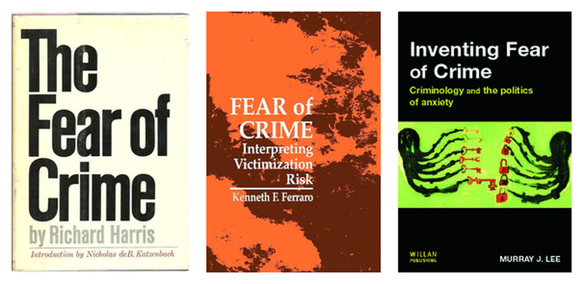{width="100%" fig-alt="Cubiertas de The Fear of Crime, de Richard Harris; Fear of Crime, de Kenneth F. Ferraro; e Inventing Fear of Crime, de Murray J. Lee."}

Tres momentos en la construcción del miedo al delito como tema: la denuncia política de los años sesenta, su formalización metodológica y su crítica genealógica.[^sociedad-1]

:::

[^sociedad-1]: Cubiertas reproducidas al amparo del derecho de cita (art. 32.1 LPI). Los derechos corresponden a Frederick A. Praeger, State University of New York Press y Willan Publishing respectivamente.

No es de extrañar, por tanto, que el primer libro que puso el "miedo al delito" en su título, de Richard Harris [-@Harris_69], describiera precisamente cómo ese miedo se fue fabricando, en parte, en los despachos de los políticos y en los mítines electorales. Con posterioridad, Murray Lee [-@Lee_01] ha desarrollado con más detalle esta idea. Para este autor, el miedo al delito no era un fenómeno que estuviera ahí esperando a que la criminología lo descubriera. Este autor argumenta que el miedo, por el contrario, es un constructo social que se fue **produciendo** a la vez que se lo medía y se lo nombraba. En ese sentido, las encuestas no se limitaron a retratar un miedo que ya existía; ayudaron a darle forma, a convertirlo en una cosa contable y gobernable sobre la que tenía sentido pedirle algo al Estado. 

A Europa, y a España, el miedo al delito llegó un poco más tarde. También en Europa jugaron un papel las encuestas y el electoralismo de los políticos. El Reino Unido lideró el movimiento de desarrollo de encuestas de victimación en Europa. En 1982, el Ministerio del Interior británico puso en marcha la Encuesta Británica sobre Delincuencia (BCS, por sus siglas en inglés, *British Crime Survey*; actualmente *Crime Survey for England and Wales*). Fue la primera encuesta nacional a gran escala (y aún la más sofisticada) en Europa diseñada para medir la ansiedad pública ante la delincuencia, junto con las tasas reales de victimación. La investigación europea se expandió posteriormente con el lanzamiento de la *Encuesta Internacional sobre Víctimas de Delitos* (ICVS, por sus siglas en inglés) en 1989 que permitió a los investigadores comparar el miedo al delito en diferentes naciones europeas utilizando, por primera vez, preguntas estandarizadas. A día de hoy la *Encuesta Social Europea* mide de forma bi-anual el "miedo al delito" en distintos países europeos.

Pero al margen de las encuestas, también jugó un papel en la construcción social de este fenómeno la instrumentalización política de los datos generados por las mismas. Durante las décadas de 1960 a 1980, Europa occidental experimentó una profunda metamorfosis social que redefinió los términos del debate público. Hasta bien entrados los años sesenta, el delito se concebía predominantemente como una anomalía técnica o una disfunción social corregible mediante el desarrollo del Estado del bienestar, la educación y la reintegración penal. Sin embargo, el cruce entre transformaciones urbanas aceleradas, crisis económica y mutaciones ideológicas convirtió la delincuencia común y, sobre todo, el miedo al delito, en un elemento clave en el debate político. El punto de inflexión definitivo llegó con la victoria de Margaret Thatcher en el Reino Unido (1979). La derecha británica articuló una narrativa electoralmente eficaz que vinculaba el delito callejero, las huelgas sindicales y el declive moral en un único diagnóstico: la debilidad de la autoridad estatal. La criminalidad dejó de tratarse como un síntoma de desigualdad estructural para ser enmarcada como un problema de responsabilidad individual y falta de castigo ejemplar y, en este contexto, hablar del miedo ciudadano al delito jugaba un papel retórico fundamental. Desde entonces la inseguridad ciudadana y el miedo al delito ha seguido jugando un papel variado en los discursos políticos en distintos países de Europa.

De la misma forma, el miedo al delito sigue siendo hoy un tema de considerable debate académico. No obstante, como veremos en la siguiente sección, buena parte de la criminología contemporánea ha adoptado una visión mucho más crítica del mismo frente a los planteamientos iniciales, que interpretaban los datos de estas encuestas como medidas válidas y fidedignas del miedo al delito, y propone en su lugar mirar más allá de lo que el término miedo al delito implica, hacia las inseguridades difusas de la vida cotidiana y el sentirse o no en casa en el propio entorno, en tiempos de incertidumbre [@Loader_23], lo que se ha venido a llamar el miedo expresivo.

### El miedo al delito como expresión de otros malestares

Las primeras encuestas de victimación a las que hemos aludido sacaron a la luz resultados sobre la distribución social del miedo al delito que han organizado buena parte de la investigación posterior [@Hale_96] y venían a señalar que el miedo no se corresponde con el riesgo objetivo de victimación. Los primeros resultados de encuestas revelaron una tendencia que se bautizó como una supuesta paradoja riesgo/miedo (*risk/fear paradox*). Estos estudios observaban que los grupos demográficos con riesgos estadísticamente menores de victimización (como los ciudadanos mayores y las mujeres) a menudo reportaban en encuestas los niveles más altos de miedo, mientras que los grupos con mayor riesgo objetivo de victimación (como los hombres jóvenes) declaraban sentir menos miedo. Cabría esperar que temieran más quienes más probabilidades tienen de ser víctimas, y aparentemente ocurre a menudo lo contrario. El perfil con más papeletas de acabar en una pelea a la salida de un bar, un hombre joven, es de los que menos miedo declaran; mientras tanto, una persona mayor, que sale poco de noche y es víctima con mucha menos frecuencia, suele declarar bastante más miedo. Se comenzó así a cobrar conciencia de que el miedo al delito es un problema social distinto, separado del delito en sí. Los autores intuyeron que responde a dinámicas diferentes, y por eso merece estudiarse por sí mismo.

::: {.callout-note appearance="simple"}
**¿Y si el miedo también ha bajado?**

Una idea muy repetida, dentro y fuera de la criminología, dice que los niveles del delito pueden bajar pero el miedo se queda alto. De hecho, esta idea dio lugar a innovaciones policiales dirigidas específicamente a tratar de reducir los sentimientos subjetivos de inseguridad del delito [@Innes_2007]. La evidencia reciente ha venido a matizar esta afirmación. Reuniendo unas 1.100 series de datos de 121 países entre 1989 y 2015, Eysink Smeets y Foekens [-@EysinkSmeetsFoekens_18] construyeron un índice internacional de tendencia y encontraron una caída acusada del miedo en cuatro de las cinco grandes regiones con más datos, todas en Europa y el mundo anglosajón. En Inglaterra y Gales, la preocupación por el delito descendió de forma sostenida entre 1998 y 2019, y la propia brecha entre hombres y mujeres se estrechó en los delitos que implican contacto físico [@PohlBuilGil_24]. Hay que separar dos planos para no liarnos. Que quien más teme no sea quien más riesgo corre (como señalamos en esta sección), un desajuste entre unas personas y otras, sigue siendo cierto; pero, a lo largo del tiempo, el miedo tampoco se ha quedado congelado en lo alto, sino que ha acompañado a la bajada del delito. No deberiamos confundir los niveles de análisis el individual y el que opera a nivel colectivo a lo largo del tiempo.
:::

Si no existe una clara relación entre el riesgo de victimación real y el miedo al delito ¿De qué está hecho el miedo? ¿Qué lo alimenta? ¿De qué estamos hablando en realidad? Para dar respuesta a estos interrogantes, ayuda aquí el trabajo de Jonathan Jackson y su equipo en la *London School of Economics* [-@Jackson_04], que propone entender buena parte de este miedo como **expresivo**. 

Se dice que el miedo es expresivo porque para mucha gente, hablar del miedo al delito es una manera de hablar de otra cosa, de *expresar* otra cosa. Desde esta perspectiva se entiende que el delito hace de pantalla donde se proyectan inquietudes más difusas y más difíciles de nombrar, como la sensación de que las condiciones del barrio se degradan, de que las normas de convivencia se relajan, de que el mundo que una conocía se nos escapa entre los dedos y de que nos enfrentamos a un futuro muy incierto. Temer al delincuente sería una forma concreta, y por eso más manejable, de temer al cambio.

::: {#fig-miedo-orden}

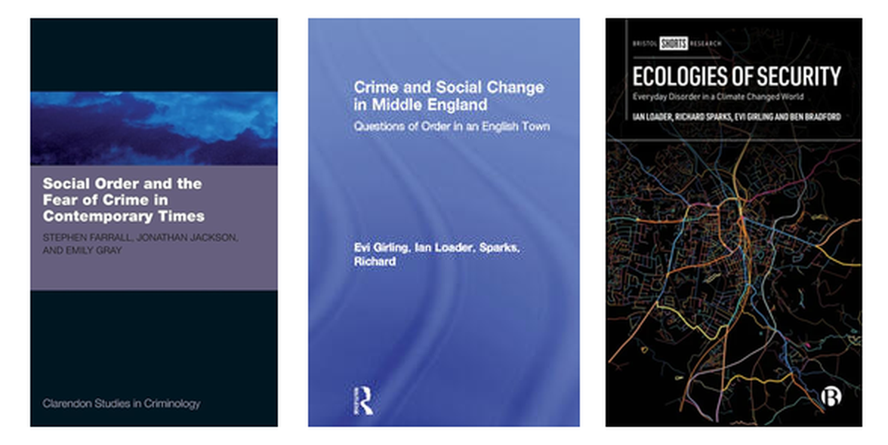{width="100%" fig-alt="Cubiertas de Social Order and the Fear of Crime in Contemporary Times, de Farrall, Jackson y Gray; Crime and Social Change in Middle England, de Girling, Loader y Sparks; y Ecologies of Security, de Loader, Sparks, Girling y Bradford."}

El miedo al delito como expresión de inquietudes sobre el orden social: del estudio etnográfico de Macclesfield a la ansiedad ante el desorden en un clima alterado.[^sociedad-3]

:::

[^sociedad-3]: Cubiertas reproducidas al amparo del derecho de cita (art. 32.1 LPI). Los derechos corresponden a Oxford University Press, Routledge y Bristol University Press respectivamente.

Debajo de todo esto late el concepto sociológico de la **seguridad ontológica** [@Giddens_91], esa confianza básica en que el mundo es más o menos previsible, en que mañana se parecerá a hoy, la que nos deja salir a la calle sin angustiarnos a cada paso. Cuando esta seguridad ontologica se resquebraja, aflora una inquietud que necesita agarrarse a algo, y el miedo al delito le ofrece un tema con cara y ojos (el ladrón, el extraño, el que merodea).

Zygmunt Bauman[^sociedad-5] [-@Bauman_00] situó todo esto en un diagnóstico más amplio, el de la **modernidad líquida** . Este sociólogo mantiene que vivimos en un mundo donde lo que antes era sólido (el empleo para toda la vida, la pareja para siempre, el barrio de siempre) se ha vuelto provisional, revocable de un día para otro. Bauman lo resume en una palabra alemana, *Unsicherheit*, que junta lo que en castellano son conceptos separados (inseguridad, incertidumbre y desprotección). Esa desazón busca dónde posarse, y el delito le sirve, porque temer al que merodea en la esquina resulta más llevadero que temer a la precariedad mas abstracta que podemos estar experimentando. Digamos que Jackson explica que es lo que realmente miden nuestras preguntas sobre miedo al delito y Bauman nos ofrece un marco teórico para entender por qué hoy este miedo expresivo podría estar tan desbocado.

[^sociedad-5]: A Bauman es un autor que parece explicarlo todo, y quien lo explica todo acaba explicando poco en concreto; su diagnóstico funciona mientras cada afirmación se pueda anclar en datos, y hay quienes cuestionan su sustento empírico y su tendencia ha realizar afirmaciones grandilocuentes sin preocuparse a aportar datos que las apoyen.

Aunque originadas en el contexto anglosajón estas ideas sobre el miedo expresivo han sido exploradas en otros contextos. En Chile, por ejemplo, Lucía Dammert [-@Dammert_03] encontró que lo que mejor predice el miedo al delito no es haber sido víctima del mismo, sino un conjunto de inseguridades económicas, sociales y políticas. Sería más bien "un miedo a la vida" que un "miedo al delito". Que el patrón aparezca también en América Latina lo refuerza y lo acerca a nuestro contexto. Investigaciones recientes en Francia también encuentran ese mismo patrón experiencial y expresivo como relevante para entender el llamado miedo al delito [@Noble_25].

![Predictores de la inseguridad ante el delito en España (regresión logística ordinal). Cuanto más a la derecha, mayor inseguridad. Análisis propio a partir del CIS 3554 (2026) [@Medina_26].](images/miedo_expresivo_cis.png){#fig-miedo-cis width="100%"}

Una encuesta reciente del CIS permite explorar esta interpretación con datos españoles. Si el miedo al delito fuese sobre todo un reflejo del riesgo, poco debería tener que ver con lo asustadiza que sea una persona en general. Sin embargo, nuestros analisis sugieren que ocurre más bien lo contrario: quien se siente inseguro caminando de noche tiende a ser también quien más teme a la enfermedad, a la soledad o a la ruina, quien más angustia sin causa arrastra y con más pesimismo mira el futuro y la marcha del país. Al sumar ese poso de "miedosidad general", la capacidad de predecir el miedo al delito casi se duplica, y buena parte de la distancia entre hombres y mujeres se explica porque ellas puntúan más alto en esa inseguridad de fondo [@Medina_26].

En esta misma linea, se ha desarrollado una linea de investigaciones que vinculan el miedo a nuestros sentimientos sobre el entorno cercano, lo que se ha venido a describir como el **desorden** percibido. Mucha gente calibra la seguridad de su calle leyendo "señales de desorden" (una pintada, la basura acumulada sin recoger, jeringuillas abandonadas, un grupo de chavales en una esquina, mobiliario urbano en mal estado de mantenimiento) o lo que otros autores bautizaron como "ventanas" o "cristales rotos" [@WilsonKelling_82] más que estadísticas sobre los niveles de delincuencia. Y esa lectura del entorno comunitario o del vecindario no es neutra, porque se tiende a ver más "desorden" donde hay más presencia de minorías o de pobreza, aunque el desorden "objetivo" (medido de forma independiente por observadores externos) sea el mismo, ya que el prejuicio tiñe lo que se mira [@Bradford_25; @Sampson_04]. El desorden, como el miedo, está en parte en el ojo del que mira, y ese ojo arrastra los sesgos de su sociedad.

::: {#fig-ventanas}

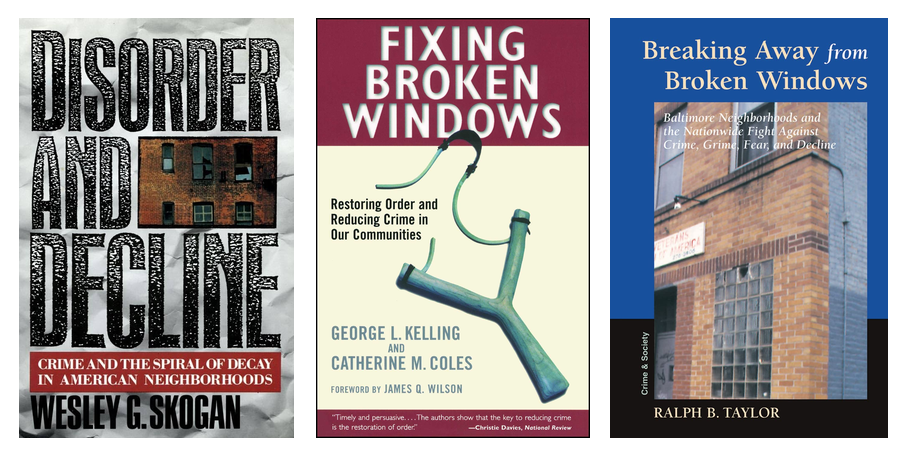{width="100%" fig-alt="Cubiertas de Disorder and Decline, de Skogan; Fixing Broken Windows, de Kelling y Coles; y Breaking Away from Broken Windows, de Taylor."}

El debate sobre desorden, deterioro y delito: la tesis del espiral de declive, su traducción en programa de política policial y la refutación empírica.[^sociedad-6]

:::

[^sociedad-6]: Cubiertas reproducidas al amparo del derecho de cita (art. 32.1 LPI). Los derechos corresponden a The Free Press, Martin Kessler Books / The Free Press y Westview Press respectivamente.

Ese sesgo tiene además una dirección preferente. La inquietud difusa ante el cambio rara vez se queda en el nivel abstracto; generalmente se condensa en una figura con rostro, y ese rostro suele estar racializado, el del otro, el extraño, que en cada época y lugar tiene un color y un origen concreto. Esa asociación actúa a veces de forma inconsciente. En una serie de experimentos, Jennifer Eberhardt [-@Eberhardt_04] mostró que basta con activar la idea de delito para que la mirada de la gente, también la de agentes de policía, se desplazara hacia las caras de hombres negros, y a la inversa, que ver una cara negra dispara pensamientos de delincuencia y amenaza. Negro y delito, o inmigrante y delito, parecen venir soldados de fábrica en el imaginario de muchas sociedades.

Esa soldadura colorea la percepción del peligro. Cuando se ha medido, tanto el delito que la gente *cree* que hay en un barrio como el miedo que declara ambos suben con la proporción de vecinos negros o inmigrantes, aunque el delito real no cambie; la composición demográfica del vecindario predice la percepción del nivel de delincuencia mejor que las cifras sobre el nivel de delincuencia real [@Quillian_01; @Chiricos_97]. El supuesto miedo al delito, una vez más, tiene un componente de amenaza imaginada que en realidad nos habla más del miedo al "extraño" que del miedo al delito.

En Europa, y en España, ese otro es sobre todo el inmigrante. La sospecha del inmigrante como criminal tiene en Europa raíces históricas profundas que han sido señaladas por los investigadores [@Steinmann_25], pero que se aviva o se apaga según inflame o no la política. Donde los partidos de extrema derecha presentan la inmigración como una amenaza, la sensación de inseguridad de la población sube, y la exposición a las noticias la amplifica todavía más [@Abreu_24]. Ese encuadre mediático del inmigrante como delincuente viene de lejos y se ha intensificado con los años; numerosos estudios muestran que la prensa retrata de forma sistemática al inmigrante como especialmente propenso al delito [@HarrisGruenewald_20], pese a que la investigación comparada más solvente no encuentra que la inmigración aumente el delito [@Fasani_2019; @KubrinOusey_2023]; y que cuando aparece alguna asociación, se explica por las barreras del mercado laboral que empujan a ciertos colectivos, no por su origen [@MariePinotti_24]. El inmigrante como delincuente es, en buena medida, un personaje del imaginario, no una regularidad observada en los datos de delincuencia.

No obstante todo lo señalado hasta aquí, que buena parte del miedo al delito exprese inquietudes sociales más amplias no significa que todo él sea imaginado o exprese un malestar más generalizado con poco que ver con la delincuencia, ni que no exista un miedo real y concreto al delito. Distinguir lo uno de lo otro ha resultado ser, sobre todo, un problema de medición como discutiremos en la próxima sección.

### ¿Podemos hablar de un miedo específico al delito?

Durante años, casi todo lo que sabíamos del miedo al delito procedía de una o dos preguntas que se solían insertar en encuestas diversas y que en realidad no preguntan exactamente por el miedo. La más habitual es alguna variante de "¿se siente segura caminando sola por su barrio al caer la noche?", que capta más bien una valoración general de lo insegura que parece la zona, y no un episodio de miedo realmente vivido. Esa pregunta, por ejemplo, es la que aún a día de hoy realiza la *Encuesta Social Europea*.

::: {.callout-note appearance="simple"}
**¿Qué mide de verdad una encuesta de miedo al delito?**

Durante décadas, las grandes encuestas midieron el miedo con un único indicador (lo segura que alguien *dice* sentirse en la calle de noche), que mezcla el miedo con el juicio sobre el barrio, con la cautela razonable y hasta con la costumbre de salir poco. Consciente del problema, la investigación reciente ha intentado preguntar mejor: separar la preocupación difusa de los episodios concretos y medir con qué **frecuencia** e **intensidad** se siente miedo, no solo si se siente. Dos esfuerzos destacan. La *Crime Survey for England and Wales* (por entonces la *British Crime Survey*) incorporó ya en 2003/04 preguntas sobre la frecuencia real de la preocupación, y no solo sobre su presencia [@GrayJacksonFarrall_08]. Y, para poder comparar países, el equipo de la *London School of Economics* explotó una batería de indicadores de preocupación por el delito de la *Encuesta Social Europea* (ronda 3, 2006), compuesto de preguntas mucho más afinadas que el clásico "¿se siente segura de noche?" [@JacksonKuha]. Medir mejor no es un capricho, de cómo se pregunte depende que el retrato social resultante.
:::

La sospecha sobre estos problemas de medición no es nueva; ya en los años ochenta, Kenneth Ferraro y Randy LaGrange [-@FerraroLaGrange_87] habían advertido en Estados Unidos de que muchas de las medidas al uso confundían el miedo con la mera percepción del riesgo. Siguiendo esta intuición, un grupo de investigadoras de la Universidad de Sheffield en el Reino Unido comprobó qué había detrás de esas respuestas preguntando a la gente cuántas veces, y cuándo, había sentido miedo de verdad [-@Farrall_97]. Buena parte de quienes puntuaban alto en las preguntas estándar no habían tenido un solo episodio de miedo en el último año. La imagen de un país atemorizado se debía, en parte, al propio instrumento, que convertía en "miedo" lo que muchas veces era la ansiedad difusa o miedo expresivo al que aludíamos en el apartado anterior.

, [CC BY 4.0](https://creativecommons.org/licenses/by/4.0), vía [Wikimedia Commons](https://commons.wikimedia.org/wiki/File:A_man_frightened_by_his_own_shadow._Wood_engraving._Wellcome_V0036027.jpg).](images/shadow.jpg){#fig-sombra width="100%" fig-alt="Grabado en madera: un hombre retrocede sobresaltado al ver su propia sombra proyectada en el suelo."}

Cuando Jonathan Jackson y Emily Gray [-@JacksonGray_10] separaron la ansiedad difusa, el miedo expresivo, de los episodios concretos de preocupación (el temor a una situación puntual, en un lugar y un momento), el retrato cambió de manera muy notable. Con la pregunta estándar, alrededor de un tercio de la población de Inglaterra y Gales se declaraba preocupada por sufrir un atraco; pero, al preguntar cuántas veces se había preocupado de verdad en el último año, solo lo había hecho un 16%, apenas un 5% se preocupaba una vez al mes o más, y el 85% no se había preocupado ni una sola vez [@GrayJacksonFarrall_08]. Debajo de aquel país aparentemente atemorizado se podía apreciar, eso sí, un miedo específico y real en una parte pequeña pero nada desdeñable de la población.

La preocupación por precisa de forma más ajustada que estábamos midiendo y de que estábamos hablando facilito que apareciera además algo que la investigación previa había pasado por alto. No todo ese miedo es dañino. Jackson y Gray distinguen un miedo **disfuncional**, que corroe la calidad de vida, de un miedo **funcional**, que empuja a tomar precauciones sensatas, hace que la persona se sienta más segura y no le amarga la existencia [@GrayJacksonFarrall_08; @GrayJacksonFarrall_11]. En su encuesta londinense, en torno a una cuarta parte de quienes se declaraban preocupados por el delito encajaban en ese segundo tipo. Su inquietud se parecía más a una manera de cuidarse que a una ansiedad patológica. Si aceptamos este diagnóstico, el miedo al delito, no es una categoría homogenera. Por el contrario, incluye desde quien no teme, pasa por una vigilancia de bajo nivel que hasta resulta útil, y llega a la angustia frecuente que sí incapacita a quien lo sufre.

Conviene cerrar este apartado sin triunfalismo. Los avances en la forma de medir el miedo (separar la preocupación difusa del episodio concreto, distinguir lo funcional de lo disfuncional) son importantes, pero no han zanjado el problema de fondo que arrastra el concepto desde su origen. Ya en 2003, y desde la psicología más que desde la criminología, Ute Gabriel y Werner Greve [-@GabrielGreve_03] advertían de que seguíamos mirando los datos sobre miedo al delito "con las gafas equivocadas", y proponían ordenar el campo distinguiendo el miedo como estado puntual del miedo como rasgo o disposición, y atendiendo a sus distintos componentes (fisiológico, conductual y subjetivo). Buena parte de esa agenda sigue pendiente. La mayoría de las encuestas que alimentan el debate público, y no pocas de las que usamos en investigación, continúan apoyándose en indicadores gruesos que mezclan emoción, juicio y conductas de precaución. Hemos aprendido a preguntar mejor, pero todavía no medimos del todo lo que decimos medir.

### Género y miedo al delito

El caso del miedo al delito en las mujeres merece una mención especial, porque durante años es un tema que generó bastante controversia en nuestra disciplina. Las encuestas mostraban una y otra vez que las mujeres declaran más miedo que los hombres mientras que, a la vez, sufren menos delito violento en el espacio público; y esa diferencia, pequeña pero constante, se magnificó en algunas encuestas y acabó convertida por los medios de comunicación y algunos académicos en un estereotipo facilón que reproducía los esquemas tradicionales de género: las mujeres son temerosas, los hombres son valientes [@Gilchrist_98]. Sobre ese estereotipo se levantó una supuesta paradoja (¿por qué teme más quien menos se victimiza?) que de paso aludía a la emocionalidad e irracionalidad que el patriarcado impone como características de lo femenino.

La criminología ha dado varias respuestas a esta supuesta paradoja, y casi todas apuntan a que la paradoja es más aparente que real y que, de hecho, son un reflejo de los sesgos de género en la forma de mirar de la criminología que examinaremos en el capítulo 11:

- La primera respuesta es que **las cifras engañan**: buena parte de la violencia que sufren las mujeres (la sexual, y la que ocurre dentro de casa) no llega a las estadísticas policiales porque no se denuncia y no aparece reflejada en las encuestas generales de victimación porque estas no miden bien la violencia contra las mujeres, así que su riesgo real está infraestimado. No es que las mujeres no tengan en cuenta su riesgo de victimación, es que este riesgo de victimación tradicionalmente no se ha medido bien porque estadísticas y encuestas ignoraban las formas más comunes de la misma.

- La segunda respuesta es lo que se ha venido a llamar la **sombra de la agresión sexual**. Para muchas mujeres, el temor a una violación colorea y agrava el miedo a delitos en apariencia menores, porque un tirón o un merodeador pueden acabar en algo mucho peor [@Ferraro_95].

- Y, finalmente, la tercera tiene que ver con la **vulnerabilidad, física y social**: quien se sabe con menos medios para defenderse o para recuperarse del golpe teme más [@Jackson_09], y no sin motivo cómo ya vimos en capítulo sobre victimación. Nuestro grado de vulnerabilidad es un factor que influye en el miedo al delito y otras situaciones.

::: {#fig-miedo-genero}

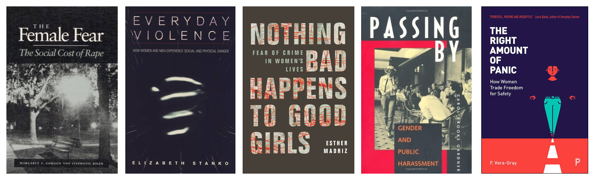{width="100%" fig-alt="Cubiertas de The Female Fear, de Gordon y Riger; Everyday Violence, de Stanko; Nothing Bad Happens to Good Girls, de Madriz; Passing By, de Gardner; y The Right Amount of Panic, de Vera-Gray."}

Cinco décadas de investigación feminista sobre el miedo de las mujeres al delito.[^sociedad-8]

:::

[^sociedad-8]: Cubiertas reproducidas al amparo del derecho de cita (art. 32.1 LPI). Los derechos corresponden a The Free Press, HarperCollins, University of California Press, University of California Press y Policy Press respectivamente.

Hay una cuarta explicación más reciente, que enlaza con el problema de medición que acabamos de ver. Cuando Robbie Sutton y Stephen Farrall [-@SuttonFarrall_05] midieron, junto al miedo, la tendencia de cada persona a dar respuestas socialmente aceptables, encontraron algo que en los hombres (no en las mujeres) declarar poco miedo iba de la mano de esa tendencia a proyectar a traves de sus respuestas una imagen socialmente aceptada. Dicho de otro modo, buena parte de la valentía masculina de las encuestas es pose. Los hombres esconden el miedo que a las mujeres se les tolera expresar. Las respuestas que dan a estas encuestas son una forma de expresar una determinada forma de masculinidad, de afirmar que son hombres [@Connell_2005]. Corregido ese sesgo, la distancia entre unos y otras se ve reducida, y a veces se invierte.

Si consideramos todas estas explicaciones de forma conjunta (victimización oculta y hombres que disimulan para parecer más masculinos), la vieja paradoja se desinfla casi del todo. El miedo de las mujeres deja de ser un enigma irracional para leerse como lo que probablemente es, una respuesta atinada a un riesgo real, de género y mal medido, que además les condiciona la vida cotidiana de una forma mas pervasiva que a los hombres (por dónde caminar, a qué hora, con las llaves entre los dedos).

Varias autoras mantienen que ese condicionamiento social de las mujeres no es un subproducto casual del miedo, sino, en parte, su razón de ser. Por ejemplo, la investigadora feminista Nerea Barjola [-@Barjola_18] analizó el caso de las niñas de Alcàsser (el secuestro, la violación y el asesinato de tres adolescentes en 1992 que conmocionaron a España) y sostiene que el relato mediático del peligro sexual no se limita a describir un riesgo, sino que lo convierte en aviso y en castigo aleccionador, y redibuja las fronteras que las mujeres "no deben" cruzar, como salir de noche, viajar solas o hacer autostop. Leído de esta forma, el miedo de las mujeres sería también un producto social que disciplina su libertad y su movimiento, una microfísica del poder que actúa por debajo de la ley. Volveremos sobre ello al tratar las víctimas y la mirada de género en el capítulo 11; baste por ahora con no dar por buena la vieja "paradoja".

::: {.callout-tip appearance="simple"}
**El caso Alcàsser en la pantalla**

Para ver de cerca lo que describe Barjola recomendamos la docuserie *El caso Alcàsser*, dirigida por Elías León Siminiani para Netflix [-@CasoAlcasser_19]. Reconstruye el crimen de 1992, pero su verdadero tema es cómo lo contaron los medios. El caso marca el momento en que la televisión española cambia de forma radical, a comienzos de los noventa. Es el nacimiento del morbo televisado y de la crónica negra como espectáculo, con reporteros y platós disputándose el dolor de las familias en directo, justo la tabloidización que veremos más adelante en este capítulo. Y muestra algo que ya hemos discutido en otros capítulos, la instrumentalización política de las víctimas, convertidas en materia prima de audiencia y de discurso mucho antes de que nadie hablara de *true crime*. Si queréis profundizar en estas temáticas es un documental que, usando imágenes de archivo y entrevistas con algunos de los personajes clave en la trama, merece la pena visionar y altamente recomendable.
:::

### ¿Y España? ¿País asustado?

Somos uno de los países más seguros de nuestro entorno (las tasas de delito, y sobre todo las de delito violento, están entre las más bajas de Europa occidental), y aun así la sensación de inseguridad y el ruido público sobre la delincuencia no guardan mucha proporción con ese dato. Y parte de ese ruido es más social que personal. Cuando el CIS pregunta en sus periódicos barómetros de opinión, los españoles tienden a nombrar la inseguridad más como un problema del país que como un problema que les afecte a ellos, un desfase entre el miedo propio y la preocupación social que Navarro y Caro [-@NavarroCaro_15] llaman el "locus de proyección" y que, probablemente, es una forma de capturar esa distinción entre el miedo expresivo y el miedo real que ya hemos visto antes.

Veréis que empezamos aludiendo a estudios del CIS que hablan del grado en que los españoles piensan que el delito o la inseguridad ciudadana son un problema. Esto no es exactamente miedo al delito. ¿Por que lo traemos a colación? En parte es porque uno de los problemas que tenemos en España es que la ausencia de una tradición consolidada de encuestas de victimación nacionales implica que no tenemos buenas medidas de miedo al delito y eso hace que los investigadores se hayan agarrado a cualquier indicador social disponible que nos permite aproximarnos a este tema. A ese respecto quienes hacemos criminología hemos usado las susodichas preguntas del CIS y hemos tirado de otras preguntas que se incluyen en encuestas europeas en las que participa España, para así, de forma indirecta, tratar de capturar lo que piensan y sienten los españoles y las españolas sobre estas cuestiones.

Entre ellas ha sido particularmente útil la *Encuesta Social Europea*, que se repite cada dos años, y nos permite retrotraernos a comienzos del actual milenio. Gracias a esta encuesta sabemos que en España vivir en un entorno seguro importa mucho más que en el resto de Europa, y eso no ha cambiado en veinte años.

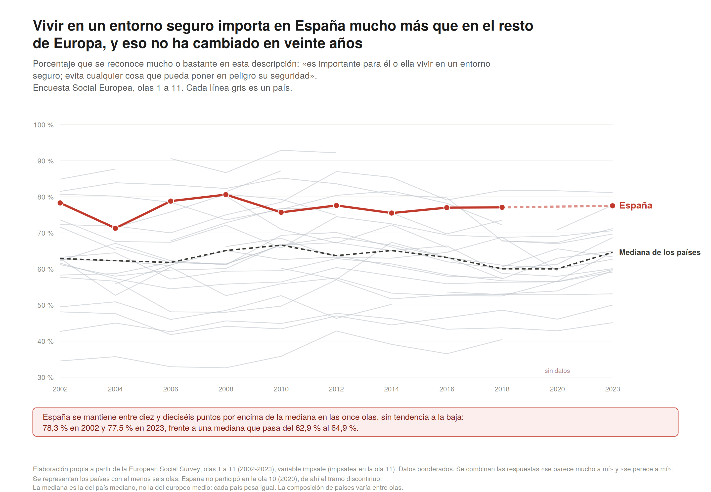{#fig-entorno-seguro width="100%" fig-alt="Gráfico de líneas de 2002 a 2023 con una línea por país. España, en rojo, se mantiene entre el 71 % y el 81 %, muy por encima de la mediana de los países, que oscila entre el 61 % y el 67 %."}

También sabemos que quienes vivimos en España otorgamos una especial relevancia al Estado para que actué con fortaleza y desarrolle políticas que garanticen nuestra seguridad.

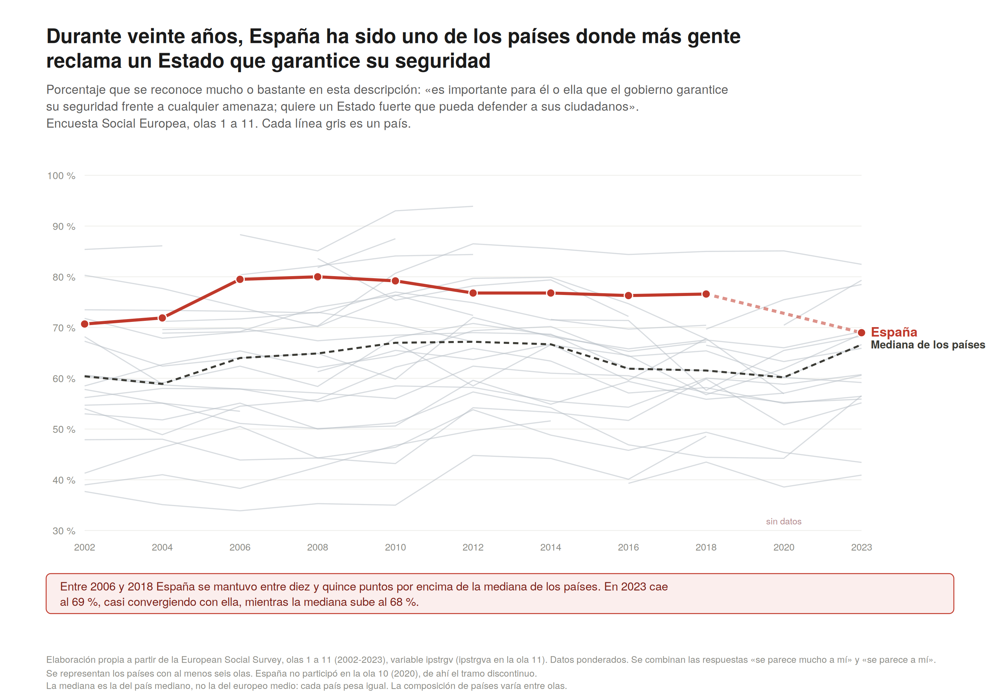{#fig-estado-fuerte width="100%" fig-alt="Gráfico de líneas de 2002 a 2023 con una línea por país. España, en rojo, se mantiene entre el 70 % y el 80 % durante dos décadas y converge en 2023 con la mediana de los países, que sube hasta el 68 %."}

Conviene entender que aquí lo que se mide es la importancia que se concede a la seguridad como valor personal, *no el miedo al delito ni la percepción de riesgo*. Un país puede valorar mucho la seguridad y sentirse seguro. Frente a ello el retrato del miedo en España depende en buena medida de como lo midamos. Con la pregunta clásica, la de sentirse segura caminando sola de noche y con los datos más recientes, España quedaría en una posición desahogada dentro de Europa, muy cercana al promedio europeo durante 20 años.

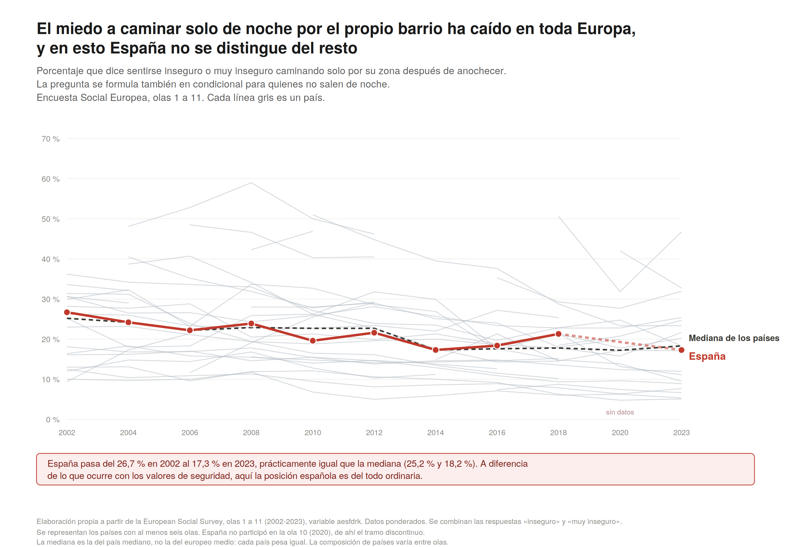{#fig-inseguridad-noche width="100%" fig-alt="Gráfico de líneas de 2002 a 2023 con una línea por país. España, en rojo, sigue de cerca la mediana de los países durante toda la serie, bajando del 26,7 % al 17,3 %."}

Pero ya hemos señalado que esa pregunta capta mal la inquietud de fondo. No es realmente una medida del miedo. Cuando Jackson y Kuha [-@JacksonKuha] aplicaron una medida más sofisticada, que combina cada cuánto se preocupa la gente por el delito y cuánto le afecta esa preocupación, España cambia de grupo y aparece entre los países con más proporción de personas muy preocupadas, cerca de Europa del Este y del Sur. No es demasiado aventurado sugerir que al menos parte de las diferencias tengan que ver con la distinta forma de preguntar.

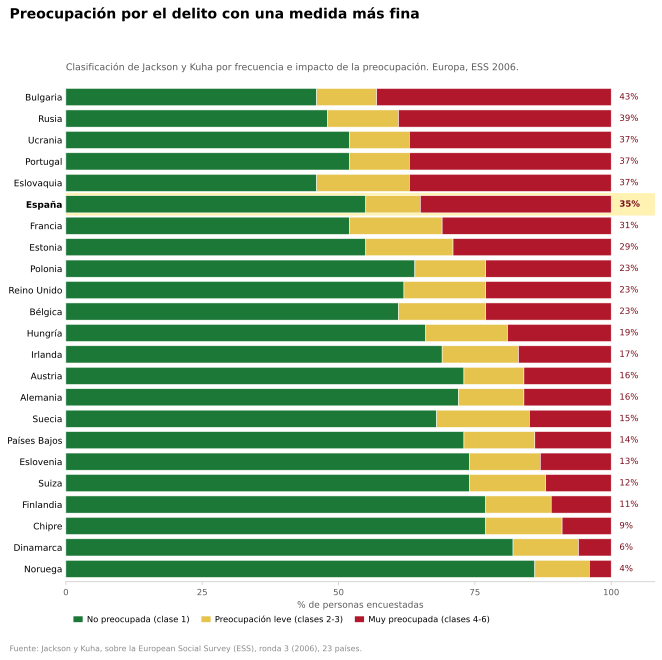{#fig-ess-worry width="100%"}

Hay todavía una tercera manera de preguntar centrada en las condiciones del entorno. Pregunta si en la zona donde una vive hay problemas de delincuencia, violencia o vandalismo. Es lo que la *Encuesta de Condiciones de Vida* viene preguntando desde 2004, dentro de la europea EU-SILC. Forma parte de una batería de preguntas sobre las condiciones de la vivienda, al lado del ruido de los vecinos y de la contaminación. Esta pregunta no mide victimación ni mide miedo. Es, por el contrario, un indicador que mide desorden percibido, esas señales del entorno de las que hablábamos más arriba.

{#fig-desorden width="100%"}

Observado los datos podemos ver dos cosas. La primera es un descenso considerable: de en torno al 19% a mediados de los años dos mil al 8,7% de 2017, el punto más bajo de la serie. Ese desplome acompaña a la caída del delito registrado y ofrece para España el equivalente de lo que se ha documentado internacionalmente sobre el retroceso del miedo. La segunda es que ese descenso se ha detenido, y que en 2023 España se sitúa en el 13,6%, por encima de una media europea que sí ha seguido bajando hasta el 10%. 

En España hay varios equipos de investigación que han aspirado a estudiar de cerca el miedo al delito. Probablemente el retrato más detallado lo tenemos de Barcelona, que mide la percepción de inseguridad con encuesta propia desde los años ochenta y cruza esas cifras con un análisis cualitativo de los discursos sobre la inseguridad. El más reciente análisis de estos datos en el estudio *"Percepció d’inseguretat a Barcelona"* (Institut Metròpoli, 2025) analiza de forma integral la brecha existente entre los delitos reales registrados en la ciudad y la vivencia subjetiva de la ciudadanía.

Su principal aportación conceptual es romper con la idea de que la inseguridad es un bloque homogéneo, demostrando que la mayor parte de la población vive en un estado de alerta o precaución funcional (relacionado con el riesgo habitual de hurtos y delitos patrimoniales sin violencia, especialmente en el transporte público y zonas concurridas), mientras que el miedo real a sufrir agresiones físicas es un fenómeno minoritario, puntual y fuertemente localizado [@MurriaBCN_25].

En términos territoriales, la investigación documentó que la percepción de inseguridad no depende únicamente de las tasas delictivas objetivas. Factores como la vulnerabilidad socioeconómica, la degradación del espacio físico, la falta de iluminación o aislamiento nocturno, y la pérdida de redes de apoyo vecinal amplifican el malestar ciudadano. Asimismo, el informe constata una marcada desigualdad de género, donde las mujeres experimentan niveles de temor más intensos debido a la amenaza latente de violencias machistas en el espacio público durante la noche [@MurriaBCN_25].

{#fig-renta-inseguridad width="100%" fig-alt="Dos diagramas de dispersión con los 73 barrios de Barcelona. En el primero, a mayor renta menor porcentaje que juzga inseguro su propio barrio, con correlación de −0,51. En el segundo, a mayor renta mayor porcentaje que juzga insegura la ciudad, con correlación de 0,39."}

Por último, el estudio advierte sobre el impacto de los discursos mediáticos y los estereotipos en la estigmatización de ciertos barrios, lo que infla la preocupación social en encuestas generales sin que responda necesariamente a un peligro directo. Como conclusión, plantea que la respuesta municipal no debe limitarse al incremento policial, sino centrarse en un urbanismo con perspectiva de género, la mejora del mantenimiento del espacio urbano y el fortalecimiento de la cohesión comunitaria para reducir la sensación de desprotección e indefensión [@MurriaBCN_25].

A la hora de interpretar el miedo al delito y las inseguridades frente al mismo, por tanto, cuesta no mirar hacia la precariedad como telón de fondo: un empleo que no se asienta, una vivienda inalcanzable, la impresión de que a la generación de los padres el mundo le encajaba de un modo que a la de las hijas ya no. Todo ello añade una capa de vulnerabilidad a nuestras ansiedades. Es la *Unsicherheit* de Bauman con acento español. La criminología hecha en España ha empezado a estudiar este fenómeno con solvencia (a defender, por ejemplo, que el miedo al delito no es un simple eco de haber sido víctima, sino un fenómeno con lógica propia [@NarvaezMora_09]) y a medir lo que cuesta, porque vivir con miedo pasa factura al bienestar de quien lo arrastra [@Alfaro_18]. Lo que aún no hemos aborado en detalle en este capítulo es de dónde saca ese miedo sus imágenes y sus villanos. Casi todas llegan por una pantalla, y a esa pantalla dedicamos los epígrafes siguientes.

## Medios de comunicación, delincuencia y control penal

### La imagen del delito en los medios

Muy poca gente ha presenciado un asesinato, un secuestro o un tiroteo; casi todo el mundo, en cambio, ha visto centenares en los telediarios, en las series o en el cine. Nuestra imagen del delito es, en muy buena medida, un producto de los medios. Y esto es un problema porque la representación mediática del delito no ofrece una visión fidedigna y válida del mismo. Como todo producto cultural humano, esta representación está fabricada con unos criterios que deciden qué hechos merecen ser reflejado y cuales no, pero también como reflejarlos. 

Los criterios mediáticos distorsionan la imagen del delito de una manera bastante predecible, como numerosos estudios han podido documentar. Los medios sobrerrepresentan el delito violento, sexual y espectacular, el raro, y apenas se ocupan del delito más corriente, el hurto o la estafa, y mucho menos del delito de cuello blanco y corporativo, que pese a causar un daño enorme no despierta las mismas emociones y que, cuando aparece, hasta la prensa "seria" tiende a presentar como accidentes o desastres antes que como delitos [@MacfarlaneHorn_23]. Además, las representaciones mediáticas generalmente ponen el acento en las causas individuales del delito, como la codicia o la ira, en lugar de en los factores estructurales [@RosenbergerCallanan_11].

::: {#fig-medios}

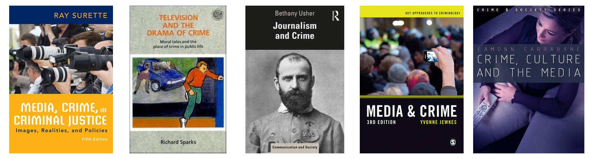{width="100%" fig-alt="Cubiertas de Media, Crime, and Criminal Justice, de Surette; Television and the Drama of Crime, de Sparks; Journalism and Crime, de Usher; Media & Crime, de Jewkes; y Crime, Culture and the Media, de Carrabine."}

Cinco aproximaciones a la relación entre medios de comunicación y delito.[^sociedad-10]

:::

[^sociedad-10]: Cubiertas reproducidas al amparo del derecho de cita (art. 32.1 LPI). Los derechos corresponden a Rowman & Littlefield, Open University Press, Routledge, SAGE y Polity respectivamente.

*If it bleeds, it leads* (si sangra es titular), se dice en las redacciones anglosajonas. El resultado de aplicar criterios de "interés del público" o criterios de noticiabilidad, a los que retornamos más adelante, es una imagen del delito que dirige nuestras ansiedades hacia determinados peligros al tiempo que ignora otros, hacia el desconocido violento que nos acecha escondido, cuando la mayor parte del daño real procedente del delito está en otra parte, que suele ser más aburrida y peor conocida. 

La distorsión mediática de la delincuencia va más allá del tipo de delitos que selecciona también alcanza a quién los protagoniza. Algunos estudios sugieren que los agresores y las víctimas que vemos reflejados en las noticias y la ficción son, de media, mayores y de más estatus que quienes pasan por los juzgados, y los menores aparecen sobrerrepresentados, tanto entre las víctimas como entre los autores [@GreerReiner_12].

Esa distorsión en relación con los protagonistas del delito tiene además un muy notable sesgo de color. En las noticias, ciertos grupos, sobre todo las minorías, aparecen sobre-representados como autores de delitos violentos, lo que refuerza el estereotipo que veíamos en el apartado anterior [@Bjornstrom_10]. Algunos estudios sugieren que este sesgo racial se aprecia sobre todo en la televisión local y tiene un mayor impacto entre espectadores blancos que viven cerca de más población afroamericana o inmigrante [@Baranauskas_18].

En España contamos con un retrato detallado de ese sesgo gracias al *Observatorio de la Islamofobia en los Medios*, que entre 2017 y 2021 codificó 6.279 piezas firmadas por redacciones españolas sobre la comunidad musulmana en España y Europa [@RojoGarrido_24]. Casi la mitad de estas noticias (45,8%) contenía contenido islamófobo. Además, el 79,4% de todo lo que la prensa española escribe sobre esta comunidad tiene que ver con terrorismo o radicalización, y solo el 17,3% de las piezas recoge alguna voz musulmana. Estos datos vienen a reflejar que hay colectivos sociales en nuestro país que apenas existen en las páginas de los periódicos fuera de la sección de sucesos y seguridad lo que contribuye a crear una determinada imagen de dichos colectivos en el imaginario común.

¿Por qué los medios distorsionan la delincuencia de esta forma? En buena parte por la lógica del propio medio y del mercado en el que operan. El profesor norteamericano Neil Postman [-@Postman_85], uno de los teóricos más influyentes en el estudio de los medios en su libro *Divertirse hasta morir: el discurso público en la era del show business*, sostenía que la televisión tiende a convertir cualquier contenido, también la información, en entretenimiento[^amusing], y este argumento también es útil en un ecosistema dominado por los dispositivos móviles, donde los medios se financian captando y reteniendo nuestra atención [@Wu_16]. 

[^amusing]: Postman diagnosticó la transición del paradigma tipográfico de la prensa escrita (que se sustentaba en la lógica lineal, la argumentación rigurosa y la abstracción reflexiva) hacia el imperio de la imagen electrónica y la fragmentación discursiva. El cambio de tecnología, Postman, advertía, implicaba un cambio radical en el tipo de discurso que se podía formular con cada una de estas tecnología y, por tanto, en su contenido, subrayando que la tecnología no es neutra. Postman advertía que la deliberación democrática, el periodismo y la educación corrían el riesgo de quedar subordinados al espectáculo y al imperativo del entretenimiento banal. Para este autor el colapso del juicio crítico no devendría necesariamente de la censura coercitiva orwelliana imaginada en *1984*, sino de la sobreexposición y la seducción sensorial profetizadas por Aldous Huxley en *El mundo feliz*. De este modo, su pensamiento perdura como un marco analítico indispensable para examinar cómo las arquitecturas contemporáneas de la información reconfiguran las instituciones democráticas y la subjetividad humana.

A ello se suman los **criterios de noticiabilidad** (los *valores-noticia*) que interioriza cualquier redacción y a los que aludíamos antes [@Chibnall_77; @Jewkes; @GreerMcLaughlin_23]. Un suceso es más "noticia" cuanto más violento, inesperado y sexual resulte, y cuanto más demarcado sea el reparto entre víctima inocente y culpable reconocible. Repetidos a diario, esos criterios acaban dibujando casi el negativo del delito real, lo que se ha llamado una "ley de los opuestos" [@Reiner_00; @Pollak_07; @GreerReiner_12].

Aunque vosotras no lo notéis porque es todo lo que habéis conocido, el mercado audiovisual y periodístico, además, ha cambiado de forma muy notable. En las últimas décadas el periodismo se ha "tabloidizado", y las técnicas y las lógicas del sensacionalismo se han extendido por todo el sector; el delito, que siempre ha sido rentable, encaja como un guante en este nuevo marco [@GreerMcLaughlin_23; @ValdezLopez_20]. España tradicionalmente no ha tenido tabloides de papel como el británico *The Sun*, pero el espectáculo y el sensacionalismo también acabó llegando a nuestro país. El momento crítico fueron los años noventa, cuando se pusó fin del monopolio de TVE y la irrupción de las televisiones privadas desataron una competición feroz por la cuota de pantalla que empujó el auge del **infoentretenimiento**, un formato que difumina la frontera entre informar y entretener. Este nuevo formato desplaza el análisis informativo en favor del suceso, la crónica del corazón y la historia de interés humano, contados para apelar a la emoción y al morbo [@GarciaAviles_21; @Valhondo_20]. La jaula de grillos que os encontráis cuando encendéis el televisor o la obsesión morbosa con la disección de casos delictivos en los programas de "tertulia" (a la que a veces contribuyen personas con titulaciones en criminología), por tanto, es un producto relativamente reciente.

A falta de un mercado previo de tabloides, la propia prensa "seria" (*El País*, *El Mundo*, *ABC*) absorbió esas dinámicas para no perder lectores, tanto en la forma (titulares grandes o maquetación llamativa) como en el fondo (más sucesos de alto impacto, más intromisión en la intimidad, más lenguaje hiperbólico) [@MartinezLaguna_20]. El análisis de la cobertura de sucesos en los grandes diarios españoles entre 1977 y 2000 confirma ese giro hacia el espectáculo y el impacto a costa de la profundidad [@Marauri_11].

Con el salto a lo digital estas lógican si cabe se han radicalizado aún más. Así hoy la política se cuenta también como espectáculo (el *politainment*), con líderes que son tratados como celebridades y tertulias televisivas o radiofónicas montadas como combates. La economía de la atención premia el *clickbait*, el titular que indigna o llama la atención. 

Todo esto refleja una transformación estructural empujada por la presión económica. A medida que ha caído el consumo de los medios tradicionales y se ha sentido de forma más intensa la necesidad de monetizar la atención, los medios han adoptado discursos que implícitamente asumen que la emoción cotiza por encima de la profundidad y el tratamiento mediático de la delincuencia, como consecuencia, se empobrece.

A todo ello se suman los propios intereses políticos y económicos de los grupos que controlan los medios. En España, la concentración de la propiedad mediática es alta, con unos pocos grupos de ideología conservadora que reúnen más del 75% de la audiencia en casi todos los sectores y un marcado paralelismo político; todo ello evidentemente añade su sesgo a lo que se cuenta y a cómo se cuenta [@MPM_26].

### Pánico moral y demonios populares

Uno de los mecanismos teóricos empleados por la criminología para entender el retrato mediático de la delincuencia es el **pánico moral**, un concepto que le debemos al sociólogo y criminólogo de origen sudafricano Stanley Cohen. Cohen lo definió en los siguientes términos [-@Cohen_72]:

> "Las sociedades parecen estar sujetas, cada cierto tiempo, a periodos de pánico moral. Una condición, un episodio, una persona o un grupo de personas pasa a definirse como una amenaza para los valores y los intereses de la sociedad; los medios de masas presentan su naturaleza de forma estilizada y estereotipada; las barricadas morales las ocupan editores, obispos, políticos y demás personas de bien; expertos socialmente acreditados pronuncian sus diagnósticos y sus soluciones; y se recurre a maneras de afrontarla o, más a menudo, se improvisan. Después la condición desaparece, se sumerge o se deteriora y se vuelve más visible."

Su caso de estudio que sirvió para sustentar esta teoría hoy nos puede parecer casi enternecedor. En su estudio de caso, Cohen hablaba de los roces entre *mods* y *rockers*, dos tribus juveniles, en las playas inglesas de los años sesenta. Se trataba en realidad de unos cuantos altercados menores; pero la prensa británica los cubrió de forma apocalíptica como si anunciaran el derrumbe del orden social, con titulares exagerados y fotos bien escogidas para generar una sensación de caos y ansiedad entre los lectores, y a base de repetirlo convirtió a aquellos chavales en *folk devils*, en demonios populares, en la encarnación de todo lo que iba mal en la sociedad británica del periodo. La alarma creció hasta desbordar lo ocurrido, las autoridades respondieron con dureza y, quizás lo más interesante, la propia reacción dio alas a lo que decía combatir: más jóvenes quisieron sumarse a algo que salía en todas partes. Fue una *profecía autocumplida*.

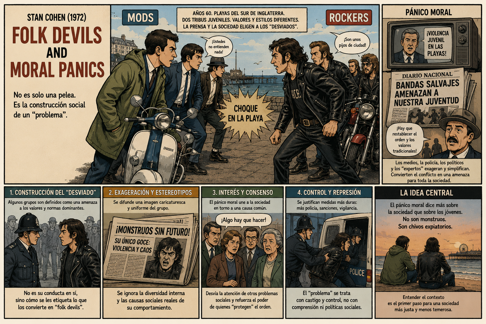

::: {.callout-tip appearance="simple"}
**Quadrophenia**.

Si os gusta la música, el cine o las vespas tuneadas podéis ver la película *Quadrophenia* (1979) basada en una opera rock con música de *The Who* y que recrea de forma ficticia e imaginada una trama vinculada a estos conflictos entre mod y rockers. Cuando hablamos de medios y la representación de la delincuencia es importante entender que no solamente nos referimos a representación en telediarios y periódicos, sino también en series, películas, novelas y otros formatos de ficción que aspiran a entretener, pero que de una forma u otra también contribuyen a crear un determinado imaginario sobre el delito y sus soluciones. Hay toda una literatura criminológica y dentro de lo que ha venido a llamarse *media studies* que también investiga la representación del delito y las respuestas al mismo en este tipo de formatos.
:::

El esquema del pánico moral, una vez reconocido, lo podemos ver aplicado en relación con distintas situaciones presuntamente problemáticas. Algo o alguien se define como amenaza a los valores de la sociedad; los medios lo estilizan y lo amplifican; se fabrica un villano reconocible; la preocupación pública se dispara muy por encima del problema real; y llega la respuesta contundente, que a menudo agranda el problema en lugar de resolverlo. A veces el pánico pasa y se olvida; otras deja un poso en forma de leyes nuevas. Y para que el esquema funcione suele bastar con seleccionar los hechos, repetirlos y subir el volumen.

Al pánico moral se le ha dado también una lectura más macro por parte de autores vinculados a la llamada **Escuela de Birmingham**. Esta corriente de pensamiento cambió la forma de entender la cultura de masas. Antes de Birmingham, la alta cultura (ópera, literatura clásica) se consideraba "verdadera cultura" y los medios de masas o la cultura popular se veían como simple entretenimiento alienante. La Escuela de Birmingham demostró que la cultura popular es un terreno clave donde se disputa el poder político y social. Basándose en el concepto de **hegemonía** del pensador italiano Antonio Gramsci, defendían que las clases dominantes no solo se imponen por la fuerza o el dinero, sino que negocian y difunden sus valores a través de la cultura (cine, televisión, música, moda).

En un estudio ya clásico sobre el pánico a lo que en inglés se llama *mugging* (los atracos callejeros) en la Gran Bretaña de los años setenta, Stuart Hall y sus colegas [-@Hall_78] mostraron que aquel pánico no era una mera histeria mediática, sino que cumplía una función. Usando precisamente el concepto de **hegemonía** de Antonio Gramsci [-@Gramsci_71], sostuvieron que, en un momento de crisis económica y política, fabricar un enemigo interno (en este caso, un joven, negro y callejero) ayudaba a legitimar un Estado más duro y a desviar la atención de las causas de fondo y de otros problemas sociales. El pánico, entonces, no solo expresa una ansiedad, también la administra en provecho de quien gobierna. Y rara vez es casual a quién señala; el *mugger* británico se construye de forma racializada.

España tiene su propio muestrario de diablos populares, que sigue el esquema anterior casi punto por punto. Los llamados "menas" (menores extranjeros no acompañados) se han convertido estos últimos años en un *folk devil* de manual, señalados como amenaza en unos términos que no se corresponden con la realidad y explotados políticamente con evidente rédito [@GomezQuintero_21]; concentran el 5% de todo el discurso de odio detectado en redes en 2024, con picos que alcanzan el 29% en julio coincidiendo con el debate sobre su reparto entre comunidades autónomas [@OBERAXE_25] y volveremos sobre ellos al tratar la alteridad en el capítulo 12. El relato mediático de la "okupación" es otro ejemplo de cómo funciona un pánico moral: una alarma intensísima, alimentada por medios y por empresas de seguridad privada que venden justo la solución que el pánico reclama, muy por encima de la seriedad del fenómeno; medios y partidos se retroalimentan en ese marco, de Vox a los magacines matinales [@GarciaMolina_22; @Marquez_24]. Antes ha habido otros (las "bandas latinas") y habrá más, dado que cada época fabrica sus propios demonios.

### Los nuevos medios: redes sociales y desinformación

Antes introdujimos uno de los trabajos de Neil Postman. Es también pertinente hacer referencia a otra de sus obras, *Technopoly: The surrender of culture to technology* (1992). En este trabajo Postman siguió elaborando su visión de que los medios de comunicación no operan como meros canales neutros de transmisión, sino como entornos simbólicos que estructuran las formas de percepción, cognición y convivencia social. Para @Postman_92 el cambio tecnológico es sistémico, en el sentido de que la irrupción de una nueva tecnología no se limita a modificar parcialmente una cultura preexistente. Al contrario, el cambio tecnológico engendra una cultura cualitativamente distinta al redefinir los criterios mismos de la verdad y el discurso público. Estas ideas son particularmente útiles para entender de qué forma el cambio tecnológico impuesto por las nuevas tecnologías de comunicación y la irrupción de las redes sociales como X, TikTok, Instagram, y otras similares, representan un cambio cualitativo en el marco y contenidos de la comunicación social que, por tanto, tienen un efecto profundo y estructural en como se debate socialmente el delito.

Cuando Cohen escribió sobre pánicos morales en 1972 para prender un pánico moral hacían falta unos cuantos periódicos y un telediario. A día de hoy el mecanismo para generar un pánico moral sigue siendo parecido, pero ha perdido a los porteros (*gatekeepers*). Hoy un pánico moral puede organizarse de forma más sencilla, sin filtro o intermediarios, en el grupo de WhatsApp del vecindario o en red social donde se reenvía el bulo de una oleada de robos (o de un secuestro que nunca ocurrió). La amplificación, que antes era cosa de unas pocas redacciones, ahora la hacemos entre todas, más deprisa y con menos margen para comprobar nada. Greer y McLaughlin [-@GreerMcLaughlin_23] llaman **intermediatización** a este entorno en red, donde la noticia sobre el delito ya no la controlan unas pocas redacciones, sino que se produce y circula en una maraña de medios, plataformas y usuarios. Hay incluso quien sostiene que el pánico ha dejado de ser un episodio excepcional para volverse un ruido casi permanente [@McRobbieThornton_95].

De los profundos y sesudos análisis y debates por señores expertos que podíamos ver en la famosa serie de TVE *La Clave*, pasamos a las tertulias simplificadoras y sesgadas de Ana Rosa y las aberraciones conspiranoicas de Iker Jiménez, y con los nuevos medios de comunicación social pasamos a tweets de 140 caracteres y el uso de memes para la transmisión de mensajes cada vez más superficiales que no pasan por un consejo de redacción ni filtro alguno y, además, alimentados por unos algoritmos orientados a la monetización y en el caso de X demostrablemente orientados a facilitar la visibilidad de determinadas opciones políticas [@Huszar_22].

Estas nuevas circunstancias han generado en las ciencias sociales, y en círculos de ciberseguridad y seguridad nacional, un interés creciente en la desinformación y sus efectos. En particular, hay también interes en cómo la desinformación en estos ámbitos en relación con determinados conflictos sociales puede ser instrumentalizada por actores políticos internos o externos con el propósito, según diversos análisis, de agravar dichos conflictos sociales y erosionar la confianza democrática en un contexto de guerra híbrida. 

Importa, por tanto, saber quién mueve hoy esa amplificación, porque no somos sólo los vecinos reenviando bulos de buena fe. En la conversación digital intervienen también campañas de manipulación coordinada, con cuentas automatizadas (bots) y medios pantalla, una parte de ellas de origen extranjero. La Unión Europea persigue estas actividades bajo la etiqueta de "manipulación e injerencia extranjera de la información" (FIMI), su servicio diplomático publica informes periódicos sobre estas operaciones [@EEAS_26] y en 2026 el Consejo sancionó a entidades como *Euromore* o la fundación *Pravfond* por amplificar la propaganda del Kremlin hacia el público europeo [@Consejo_26]; la criminología, por su parte, ha empezado a medir su alcance real [@AguerriRussia_24].

A ello se suman los propios dueños de las plataformas, cuyos algoritmos premian la indignación y cuyos intereses políticos distan de ser neutrales, como se desprende de lo que cubrimos en el capítulo 6. No hablamos solo de sesgos difusos. El periodista Gil Duran ha documentado cómo una parte de la élite tecnológica de Silicon Valley, de Peter Thiel a Elon Musk, ha abrazado un proyecto político abiertamente autoritario, emparentado con el pensamiento neorreaccionario, y ha puesto su dinero y sus plataformas al servicio de esa agenda [@Duran_26]. Que quienes controlan buena parte de la conversación pública tengan un proyecto ideológico propio, y no solo un modelo de negocio, cambia lo que está en juego cuando hablamos de desinformación y discurso de odio en sus redes.

Las grandes tecnológicas no son un canal neutro por el que pasa lo que nosotros como sociedad decimos. Sabemos, al contrario, que deciden qué se ve y qué se entierra, y esa capacidad, concentrada en un puñado de empresas, se ha convertido en una forma de poder que a los Estados les cuesta contrapesar, hasta el punto de que hay quien describe el resultado como un "tecnofeudalismo" en el que las plataformas cobran renta por el acceso a un espacio público que han privatizado [@Durand_20]. Durante años han esquivado la regulación presentándose como meros intermediarios técnicos y no como medios de comunicación, una etiqueta que les ahorra la responsabilidad editorial que sí pesa sobre la prensa o la televisión. Esa distinción es hoy el campo de batalla. La Unión Europea, con el Reglamento de Servicios Digitales, les impone deberes de diligencia sobre los contenidos ilícitos que alojan, y en Estados Unidos lleva años discutiéndose reformar la Sección 230 que las blinda frente a lo que publican sus usuarios, mientras algunos países han ido más lejos obligándolas a retirar con rapidez el discurso de odio manifiestamente ilegal.

Sabemos algo de lo que ocurre en ese ecosistema en nuestro país gracias a varios estudios. El *Observatorio Español del Racismo y la Xenofobia* monitoriza a diario los contenidos de odio racista, xenófobo, islamófobo, antisemita y antigitano en cinco plataformas, los notifica y comprueba después qué se hace con ellos [@OBERAXE_25]. De los 2.870 contenidos notificados en 2024, las plataformas retiraron solo un 35%, y apenas un 4% en las primeras veinticuatro horas, que es justamente cuando un contenido circula y alcanza buena parte de su difusión. El 65% restante siguió publicado pese a que el 96% de lo notificado incumplía las normas de la propia plataforma. Las diferencias entre unas y otras son enormes: TikTok retiró el 69% de lo que se le comunicó y X tan solo un 15%. 

::: {.callout-note appearance="simple"}
**El lenguaje del odio**

El OBERAXE clasifica también *cómo* se expresa el odio, y el catálogo es instructivo [@OBERAXE_25]. Un 37% de los contenidos notificados en 2024 deshumaniza o degrada gravemente al grupo diana; un 32% lo desacredita sin más argumento que su pertenencia al grupo; y un 29% incita a la violencia mediante amenazas directas o indirectas.

Entre lo que las plataformas decidieron *no* retirar seguía habiendo un 36% de contenidos deshumanizadores, un 28% que incita a la violencia y un 17% que pide directamente la expulsión de personas de origen extranjero. Conviene retener que no hablamos de opiniones incómodas sobre política migratoria, sino de mensajes que niegan la condición humana de un colectivo, y que en dos de cada tres casos permanecen visibles. Esa normalización, más que cualquier mensaje aislado, es lo que hace que el salto del odio digital a la agresión física deje de parecer impensable.
:::

Para lo que nos ocupa en este capítulo, lo más interesante es de qué habla ese odio. El propio informe de OBERAXE clasifica cada contenido según el acontecimiento que lo desencadena, y el episodio que predomina en todos los grupos "diana" es la inseguridad ciudadana. El 51% de los contenidos dirigidos a personas del norte de África, el 48% de los dirigidos a personas latinoamericanas y el 47% de los dirigidos a menores no acompañados se articulan en torno a enviar mensajes sobre inseguridad ciudadana. La construcción mediática del inmigrante como delincuente que veíamos en los apartados anteriores va más allá de lo que vemos en los telediarios, es también el marco desde el que se organiza buena parte de la hostilidad que circula por las redes. Y según OBERAXE un 21% de los contenidos no responde a ningún acontecimiento concreto, lo que sugiere un poso estable de hostilidad que no necesita de un suceso que lo active.

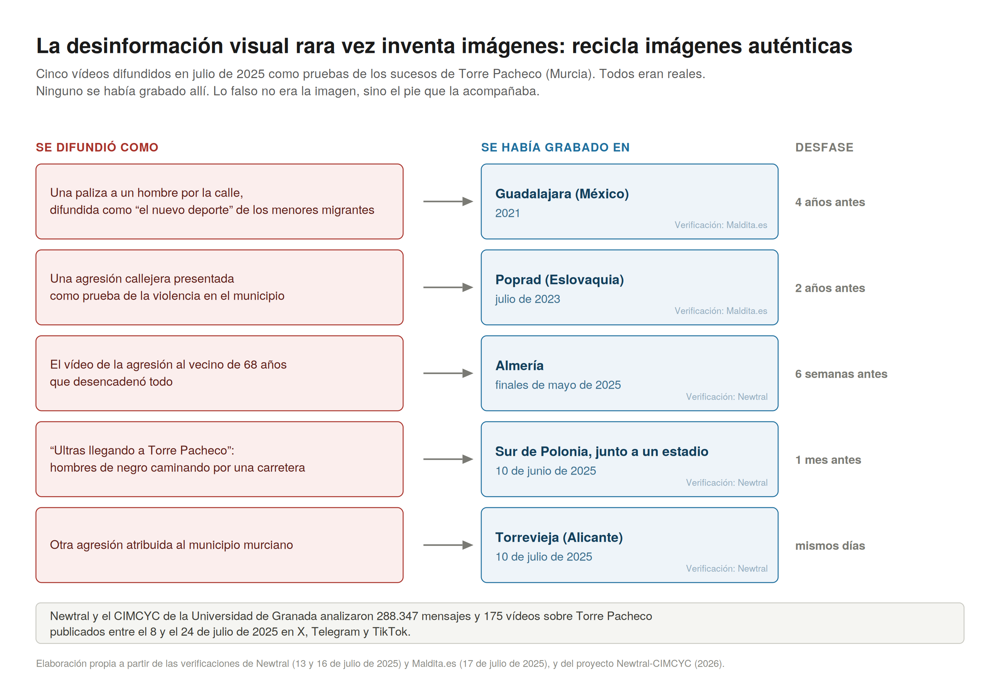{#fig-recontextualizacion width="100%" fig-alt="Cinco filas que enfrentan lo que se dijo que mostraba cada vídeo difundido sobre Torre Pacheco con el lugar y la fecha en que realmente se grabó: México 2021, Eslovaquia 2023, Almería, Polonia y Torrevieja."}

Los efectos de todo esto no se agotan en el clima punitivo que discutiremos en la próxima sección. A veces la desinformación no reclama una ley más dura, sino que prende la mecha directamente. En julio de 2025, en Torre Pacheco (Murcia), la agresión a un vecino de 68 años a manos de un joven de origen magrebí corrió por las redes envuelta en bulos y en llamamientos a la "caza" del inmigrante; grupos ultras llegados de toda España protagonizaron varias noches de ataques racistas contra vecinas y vecinos marroquíes, con más de cien mil mensajes de odio contabilizados en apenas dos semanas. Lejos de ser una anécdota, este salto del odio digital a la violencia física se ha vuelto tema de estudio criminológico.

::: {.callout-note appearance="simple"}
**Del odio en la pantalla al delito de odio en la calle**

Que la palabra encienda la violencia no es solo una intuición, sino algo que se ha podido contrastar empíricamente. Una línea de criminología computacional ha mostrado que, tras un suceso que actúa de detonante (un atentado, una agresión con tinte identitario), se dispara el discurso de odio en las redes y, con él, sube el **delito de odio** contra el colectivo asociado al agresor. Lo comprobaron Williams y Burnap (2013) tras el asesinato de Woolwich y en su estudio *Hate in the Machine*, donde los mensajes antinegros y antimusulmanes en redes predecían agresiones racistas y religiosas reales [@Williams_16; @Williams_20]. En España se ha replicado el hallazgo. Cruzando mensajes de X y Facebook con los registros policiales de delitos de odio, el lenguaje inflamatorio en línea permite anticipar la violencia contra personas migrantes y LGTBI [@Arcila_24]. Y los propios bulos que ligan migración y delito se han estudiado aquí como "pánicos morales clásicos en un ecosistema digital nuevo" [@Aguerri_25]. El mecanismo es el de siempre, lo que cambia es el altavoz y la velocidad. Existen ya, además, revisiones sistemáticas del campo sobre esta temática que podéis leer si estáis interesadas [@Castano_21].
:::

### Control penal y su representación mediática

Los medios no solo cuentan, representan y distorsionan el delito, también cuentan, representan y distorsionan la respuesta al delito. Nuestras imágenes de qué es y qué hace la policía, de qué son y qué ocurre en las cárceles, de cómo funciona un juicio, están más moldeadas por el cine y la televisión que por ninguna experiencia directa con esas instituciones. La mayoría de vosotras probablemente no ha entrado en una cárcel o en unos juzgados de lo penal, y si conoce una comisaria es porque ha ido a ella a renovar el DNI o el pasaporte.

La imagen del control penal proyectada por los medios ha cambiado con la época. Robert Reiner, Sonia Livingstone y Jessica Allen [-@Reiner_00] analizaron el contenido de la prensa y del cine británicos entre 1945 y 1991 y vieron que lo que se movía no era tanto la *cantidad* de delito representado como su *carácter*. Con las décadas, la víctima se desplaza al centro del relato y su sufrimiento se subraya cada vez más, la confianza en la justicia se resquebraja y la policía se vuelve la heroína de la función, a menudo una justiciera que se salta las reglas para atrapar al malo [@Allen_98]. Lo resumieron con una frase, "se acabaron los finales felices". Donde antes la ficción tranquilizaba restaurando el orden, ahora inquieta mostrando un daño que no siempre se repara.

Las instituciones del sistema, además, no se quedan de brazos cruzados mientras los medios construyen esta realidad imaginada. La policía, la fiscalía o el gobierno son fuentes privilegiadas ("definidores primarios", se las ha llamado [@Hall_78]). Llegan las primeras y con el relato ya montado, fijando el marco interpretativo desde el que se cuenta lo ocurrido [@Ericson_87]. Y cada vez más tienen su propia maquinaria de comunicación y sus propias cuentas en redes, con las que proyectan una imagen de eficacia y legitiman su actuación sin pasar por filtro periodístico alguno [@Colbran]. Una prensa precarizada y unos periodistas que dependen del acceso a este tipo de fuentes, demasiado a menudo dan por bueno de forma superficial y poco crítica los comunicados de prensa y los relatos que se construyen desde estas instituciones [@GarciaMendiola_25].

::: {#fig-copaganda}

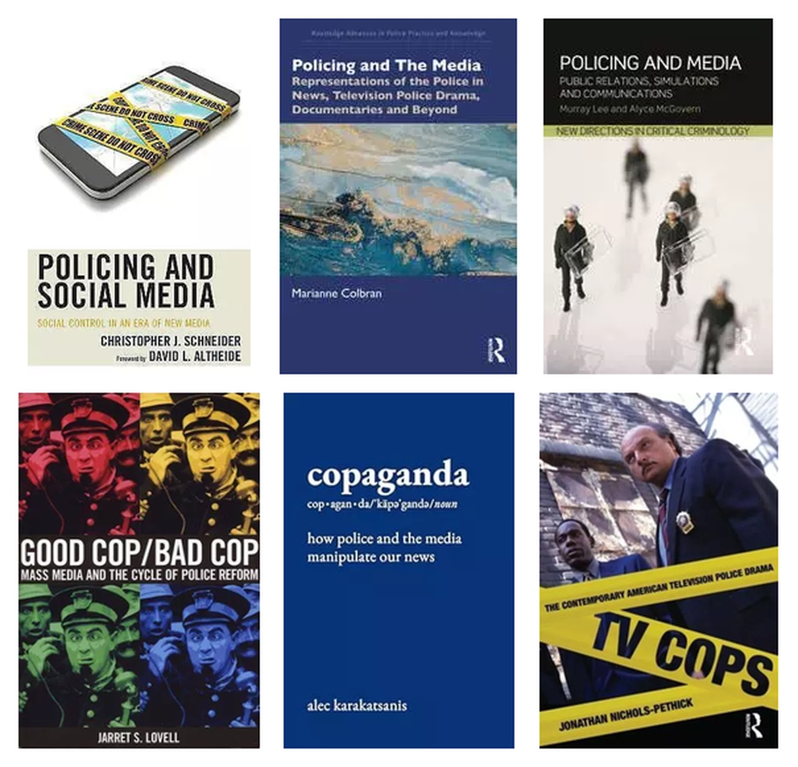{width="90%" fig-alt="Seis cubiertas sobre policía y medios: Policing and Social Media, de Schneider; Policing and The Media, de Colbran; Policing and Media, de Lee y McGovern; Good Cop/Bad Cop, de Lovell; Copaganda, de Karakatsanis; y TV Cops, de Nichols-Pethick."}

La construcción mediática de la policía: del drama televisivo a la gestión profesional de la comunicación policial.[^sociedad-12]

:::

[^sociedad-12]: Cubiertas reproducidas al amparo del derecho de cita (art. 32.1 LPI). Los derechos corresponden a Lexington Books, Routledge, Routledge, NYU Press, The New Press y Routledge respectivamente.

A la producción cultural que normaliza y ensalza la labor policial se la ha bautizado con cierta sorna como **copaganda** [@Karakatsanis_25]. Esta forma de propaganda construye relatos que nos habitúan a ver la vigilancia, y a veces hasta la violencia policial, como algo natural, y que orientan la mirada hacia unos culpables y no otros, con frecuencia siguiendo un claro sesgo racial [@Cheng_21; @Hurley_15]. Como señalan Sergio Garcia e Ignacio Mendiola [-@GarciaMendiola_25]:

> "Los policías ostentan hoy un privilegio a la hora de comunicar que no tienen otros departamentos del Estado... Dotado de amplios recursos materiales y de un alto grado de independencia respecto del ejercicio de la labor gubernamental, en las últimas décadas se ha conformado y consolidado un campo en expansión surgido de la confluencia entre la cultura policial y la cultura periodistica, en el marco de un mercado informativo marcado por la securitización de numerosos problemas sociales" (p. 87)

Estos, cada vez mejor nutridos, gabinetes de prensa señalan como labor fundamental el promocionar el reconocimiento social y la legitimación de la institución policial. Y controlan el flujo de información a periodistas, así como el acceso a otros recursos a las productoras que aspiran a generar entretenimiento sobre la base de temáticas o series policiales. Esto genera una creciente asimetría de poder que facilita que la visión policial se imponga sobre otro tipo de consideraciones en los relatos que se producen tanto en el ámbito informativo como en el del entretenimiento [@GarciaMendiola_25]

Pese a ello, el consumo de medios no siempre blanquea a la policía. Quienes ven más informativos televisivos tienden también a *creer* que la mala conducta policial es frecuente, y ese efecto es más acusado entre las minorías, que ven reflejada su propia experiencia [@Dowler_07]. La propia cárcel se ha hecho espectáculo, con su promesa recurrente de devolvernos unas calles seguras [@Cheliotis].

::: {.callout-note appearance="simple"}
**El juicio paralelo**

En un entorno digital, adversarial y ávido de escándalo, los medios no solo cuentan la justicia, cada vez más la *administran* por su cuenta. Greer y McLaughlin lo llaman **juicio paralelo** (*trial by media*), una forma de justicia populista y retributiva en la que una persona o una institución es juzgada en el "tribunal de la opinión pública", que dicta veredicto y aplica su propio castigo, sobre todo reputacional, al margen y por delante del proceso legal [-@GreerMcLaughlin_23]. A veces la diana es una persona sospechosa; otras, las propias instituciones, cuando el periodismo pasa de destapar un fallo aislado a la "caza del escándalo" (*scandal hunting*) que exhibe el encubrimiento o la incompetencia de la policía, la fiscalía o la judicatura.

Con las redes, ese juicio se ha vuelto participativo, porque ya no lo instruyen solo las redacciones, sino también la ciudadanía, mediante el **escarnio público** en línea (*online shaming*), que funciona como una forma de regulación moral colectiva [@Gies_25; @Forestal_24; @GarcesConejos_22] y se alimenta de un sentido de castigo merecido y no poco *schadenfreude* [@Barron_23]. Su efecto es ambivalente. Puede operar como una **justicia informal** que da voz a quien el sistema ha desatendido, como viven muchas supervivientes de violencia sexual que señalan en línea a su agresor cuando la vía penal les falla [@DancigPeleg_24], y sacar a la luz abusos reales (como en el caso del #MeToo); pero también castiga sin garantías, se desboca con facilidad y erosiona la presunción de inocencia, hasta el punto de abrir el debate sobre cómo regularlo [@Billingham_26].
:::

### ¿Que impacto tiene todo esto?

Nada de todo lo dicho significa que los medios inyecten miedo o dureza en una ciudadanía pasiva predispuesta a que se les lave el cerebro. Cuando se ha ido a comprobar el famoso "efecto de los medios", la evidencia resulta bastante más compleja de lo que a veces se supone. Décadas de investigación no han demostrado un efecto directo y potente, entre otras cosas porque lo que cada quien hace con lo que ve depende mucho de quién es y de dónde vive [@Birkbeck_14]. Los medios fijan con fuerza el imaginario del delito y la agenda de lo que nos preocupa; de ahí a determinar lo que siente o pide cada persona hay un muy amplio trecho.

Los autores de la Escuela de Birmingham ya en su día planteaban que los medios no inyectan mensajes en la mente de la gente que los recibe de forma pasiva. Un mensaje es "codificado" por quien lo produce, pero el público lo "decodifica" de tres formas distintas:

- *Lectura dominante/hegemónica:* La audiencia acepta el mensaje tal como se emitió.

- *Lectura negociada:* La audiencia acepta partes del mensaje pero adapta otras a su propia realidad.

- *Lectura oposicional:* La audiencia entiende el mensaje pero lo rechaza por completo.

No obstante, si que hay estudios que sugieren una clara asociación entre consumo de medios y actitudes ciudadanas [@RosenbergerCallanan_11], incluso aunque sea dificil establecer una relación de causalidad. Su efecto neto más seguro es, en todo caso, colectivo antes que individual. El mensaje de los medios sirve para consolidar percepciones sobre la realidad delictiva que no se sostienen. Teniendo en cuenta lo que vimos anteriormente sobre el martilleo mediático del inmigrante como delincuente, ¿es sorprendente que, pese a lo que pueda establecer la investigación científica, en torno al 42,3% de los españoles estén de acuerdo con la afirmación de que "los inmigrantes causan un aumento de criminalidad"[^sociedad-14]? Es este contexto mediático, por ejemplo, el que nos puede ayudar a entender que pese a los descensos en delincuencia que se han experimentado en numerosos países desde mediados de los años 1990 la ciudadanía siga pensando que el delito aumenta.

[^sociedad-14]: Fuente: Latinobarometro 2023, Estudio 3481 (Centro de Investigaciones Sociológicas).

Fijémonos en el caso de Inglaterra y Galés. La mayoría de los delitos en Inglaterra y Gales está disminuyendo, pero la opinión pública cree que está aumentando. De hecho, la percepción de la gente sobre la delincuencia es errónea en casi todos los aspectos: desde el número de víctimas hasta el origen étnico y la nacionalidad de los infractores, pasando por si el número de efectivos policiales ha aumentado o disminuido; así lo revela un importante estudio reciente del *Policy Institute* del King's College de Londres. La percepción y la realidad apuntan en direcciones opuestas. En este este estudio el 83 % de los encuestados cree que el robo de teléfonos móviles ha aumentado, cuando en realidad ha disminuido cerca de un 70 %; una mayoría piensa que los robos en viviendas (56 %) y el robo de vehículos (62 %) han aumentado, cuando ambos han descendido alrededor de un 50 %; y el 37 % cree que los homicidios han aumentado, cuando han bajado cerca de un 20 % [@PolicyInstitute_26]. Lo mismo ocurre en otros países, incluido el nuestro, como un reciente sondeo de YouGov ha puesto de relieve y podéis ver en la siguiente figura.

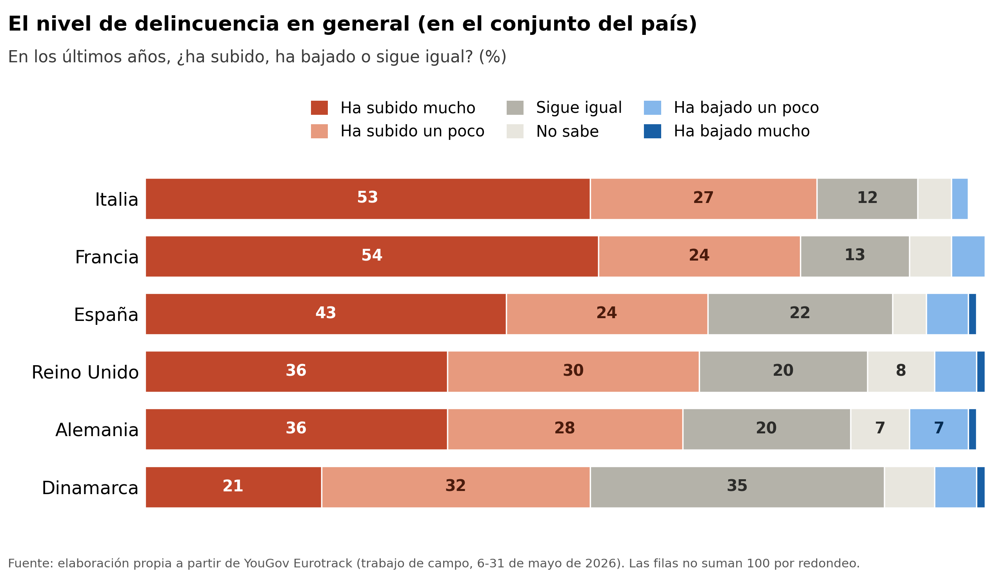{#fig-ess-noche width="100%"}

Toda esta maquinaria (la imagen distorsionada del delito y la glorificación de la respuesta penal o sancionatoria dura) rara vez estalla en una noche de violencia como la de Torre Pacheco; lo más habitual es que se sedimente en algo más difuso y más duradero, en una demanda social de que se contrate más policía, que reclama leyes que castiguen, que exige penas contundentes y pide mano dura. Esa demanda es el tema del apartado siguiente, aunque su traducción en política penal la veremos en el capítulo 15 sobre política criminal.

## Ciudadanía y punitivismo

Solemos llamar **punitivismo** a la demanda social de castigo, a la inclinación a tomar el castigo como respuesta por defecto (más penas, más cárcel, condenas más largas, mano dura) y a la creencia de que endurecer la respuesta penal siempre es la solución. El punitivismo refleja lo que el jurista Jorge Ollero [-@Ollero_21] llama el *penalismo mágico*, la creencia mítica en el poder del castigo suministrado por el sistema penal para solucionar complejos problemas sociales y políticos. Hay toda una tradición dentro de la literatura criminológica que se ha dedicado a debatir como estas actitudes punitivas se miden, como varían con el paso del tiempo y de país a país, y también como podemos explicar lo que estas medidas reflejan. En las figuras que os presentamos aquí podéis ver algunos datos al respecto.

{#fig-punitivismo-ess width="100%" fig-alt="Diagrama de dispersión con 27 países. Eje horizontal: porcentaje que prefiere prisión. Eje vertical: porcentaje que pide tres años o más entre quienes eligen prisión. España aparece destacada en rojo, por encima de la media en el primer eje y por debajo en el segundo."}

De forma análoga a lo que veíamos en relación con el miedo al delito, esa demanda social de castigo no sigue necesariamente la evolución objetiva de las tasas de delito. Podemos ver que hay países donde la delincuencia lleva años estable o a la baja y, aun así, las demandas de mayor dureza no han dejado de crecer.

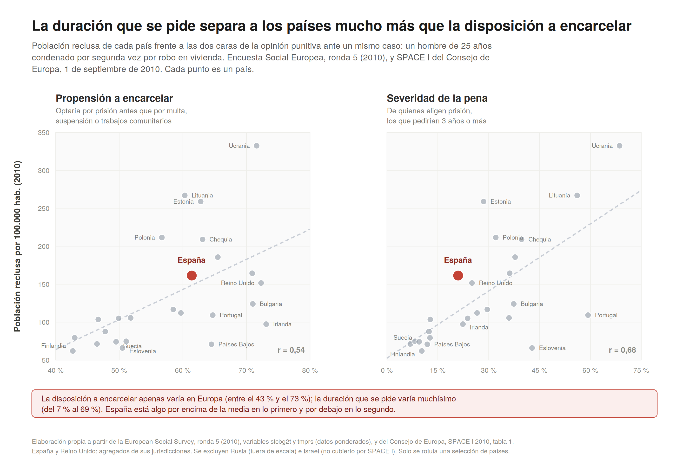{#fig-opinion-prision width="100%" fig-alt="Diagrama de dispersión de 25 países. Eje vertical: población reclusa por cien mil habitantes en 2010. Eje horizontal: porcentaje que pediría prisión en la figura a la izquierda y que pediría tres años o más de prisión en la figura de la derecha. La nube sigue una tendencia creciente (a mayor punitividad del público, en estos datos se observa una mayor punitividad del sistema). La correlación es más fuerte cuando observamos las actitudes hacia la duración de la pena, donde existe una mayor variabiliad de entrada entre los paises participantes"}

Si esa demanda de dureza no se explica *solo* por el nivel real de delincuencia, por las tasas objetivas del delito, tenemos que preguntarnos a qué factores responde. Parte de la respuesta ya la se puede deducir de las cuestiones que hemos introducido en las secciones anteriores de este capítulo cuando hablábamos del miedo al delito. Esa demanda de castigo en parte tiene que ver con ese "miedo" que también esta desvinculado del riesgo objetivo y real de victimación y con los pánicos sociales que fabrican los medios.

Como podéis ver en la próxima figura, con los microdatos de la Encuesta Social Europea, y descontadas la victimización real, el perfil sociodemográfico y la propia exposición a los medios, a más miedo, más probabilidad de pedir cárcel para el reincidente, mientras que haber sido víctima no mueve la aguja. El efecto del miedo es claro en su dirección pero muy modesto en tamaño, lo que encaja con la idea de que el miedo alimenta la demanda de castigo sin ser, ni de lejos, su única fuente. Y los propios medios, que acabamos de mencionar, no empujan todos en el mismo sentido. Seguir las noticias por televisión se asocia a algo más de punitivismo, y seguirlas por radio o por prensa, a algo menos.

![Miedo y demanda de castigo en Europa. Predictores de preferir la prisión (frente a otra sanción) para un reincidente de robo, según una regresión logística con efectos fijos de país sobre la *Encuesta Social Europea*, ronda 5 (2010); N = 37.779 en 26 países, datos ponderados. Los valores son *odds ratios*: por encima de 1 aumentan la probabilidad de pedir cárcel y por debajo la reducen; las variables continuas se expresan por desviación típica y el miedo es un índice de tres ítems (preocupación por robo, por delito violento e inseguridad al caminar de noche; alfa de Cronbach = 0,72). El miedo se asocia a más punitivismo de forma estadísticamente significativa y en la dirección esperada, y resiste al control por la exposición a los medios; haber sido víctima, en cambio, no guarda relación. Entre los medios, las noticias en televisión se asocian a algo más de punitivismo y las de radio y prensa a algo menos. No obstante, el modelo explica solo una fracción mínima de la variación individual en la demanda de castigo (pseudo-R² de McFadden ≈ 0,01). El miedo la empuja, pero está muy lejos de determinarla.](images/miedo-punitivismo-ess-2010.png){#fig-miedo-punitivismo width="100%"}

Pero la investigación sobre actitudes punitivas apunta también a otro tipo de explicaciones. Cuando Tyler y Boeckmann [-@Tyler_97] se preguntaron por qué la gente quiere castigar a delincuentes o infractores, encontraron que el mecanismo principal no era el miedo a ser víctima ni el cálculo racional sobre la peligrosidad. Lo que estos autores encontraron es que el factor fundamental para entender esta "sed de castigo" está relacionada con la percepción de que la sociedad se descompone y de que se pierden la moral compartida. En este sentido, castigar sería, en buena medida, una forma de reafirmar unos valores que se sienten amenazados. Deste esta perspectiva se considera que el punitivismo tiene una raíz, por tanto, que es más moral y emocional que calculadora. Estos autores en esencia lo que plantean es que castigamos desde intuiciones de justicia y de merecimiento antes que desde un cálculo sobre la disuasión [@Darley_09; @Silver_17], desde valores de autoridad y respeto al orden [@GerberJackson_16], y también desde la propia emoción que el delito genera, que es un ingrediente que durante mucho tiempo la literatura ha desatendido [@Hartnagel_12]. En otras palabras, estos autores reivindican que como sociedad pedimos más castigo porque sentimos o pensamos (no necesariamente de forma fundada) que las bases morales de la sociedad se encuentran bajo asedio y hay que hacer algo al respecto.

Por otra parte, la investigación estadounidense ha documentado con especial insistencia la relevancia del prejuicio racial (que también ya veíamos en la sección anterior es parte de lo que puede animar la sensación de inseguridad para parte de la sociedad). Varios investigadores norteamericanos al contrastar las distintas explicaciones del punitivismo han documentado que el *animus* racial aparece como uno de sus predictores más potentes. Estas investigaciones señalan que quien alberga más resentimiento hacia la población afroamericana tiende a reclamar más castigo, al margen de su miedo o de su experiencia como víctima [@UnneverCullen_10]. Trabajos posteriores han confirmado este sesgo y han profundizado esta línea de investigación explorando también el papel que juega la hostilidad hacia los pobres y la ansiedad social como parte de las explicaciones del punitivismo [@BrownSocia_17].

Podríamos pensar que este tipo de explicaciones solamente tiene sentido en Estados Unidos, por su particular historia racial, pero que quizás debería ser menos aplicable en otras latitudes. No obstante, este es un patrón que también se ha observado en otras partes del mundo. En Andalucía, por ejemplo, hay estudios que sugieren que la actitud hacia la permisividad de las leyes de inmigración es una de las variables que mejor predicen la demanda de castigo, por encima incluso de la confianza en la policía [@LopezMenchon_23; @Pozo_24]. De esta manera, vemos que hay una serie de autoras que plantean como la demanda de castigo prolonga el miedo al otro que describíamos en secciones anteriores. Desde estas perspectivas se interpreta que pedir mano dura es, en parte, señalar a un otro racializado y empobrecido. En ese sentido, no es sino una forma "codificada" de hablar sobre el otro que es diferente y de cómo debemos responder frente a él.

Podemos ver todo esto junto en los datos europeos. Si al modelo anterior le añadimos la ideología, la actitud hacia la inmigración, la confianza (en la justicia y en las demás personas) y los valores de autoridad y orden, emerge un retrato coherente con lo que venimos diciendo. El predictor individual más potente de preferir la cárcel es la hostilidad hacia la inmigración, seguida de cerca por el miedo y por esos valores de conservación (dar importancia a las reglas, la tradición y la seguridad), que son la raíz moral del castigo que apuntábamos más arriba. La ideología de derechas y la desconfianza hacia los demás también empujan; la confianza en la justicia y haber sido víctima, en cambio, no. Y, con todo ese bloque dentro, el miedo se mantiene, lo que sugiere que no es un mero disfraz de la ideología ni del prejuicio. Conviene, eso sí, no perder de vista que el modelo en su conjunto explica solo una fracción pequeña de por qué unas personas son más punitivas que otras. Estos factores inclinan la balanza, pero la demanda de castigo sigue siendo, en buena medida, un fenómeno que no estamos explicando del todo.

![Más allá del miedo: predictores individuales de preferir la prisión para el reincidente, ampliando el modelo de la @fig-miedo-punitivismo con la ideología (izquierda-derecha), la actitud ante la inmigración (índice de tres ítems: economía, cultura y calidad de vida), la confianza en la justicia, la confianza interpersonal y los valores de autoridad y orden (índice de conservación de Schwartz —reglas, tradición y seguridad—; alfa de Cronbach = 0,72). Regresión logística con efectos fijos de país sobre la *Encuesta Social Europea*, ronda 5 (2010); N = 29.941 en 26 países, datos ponderados; se controlan además la exposición a los medios y el perfil sociodemográfico, no representados. Los valores son *odds ratios* (por encima de 1, más punitivo; las variables continuas, por desviación típica). La hostilidad hacia la inmigración, el miedo y los valores de autoridad y orden son los predictores más fuertes; haber sido víctima y la confianza en la justicia no guardan relación. Aun así, el modelo completo explica solo una fracción pequeña de la variación individual en la demanda de castigo (pseudo-R² de McFadden ≈ 0,02).](images/punitivismo-raices-ess-2010.png){#fig-punitivismo-raices width="100%"}

No obstante, y más allá de la credibilidad que demos a estas explicaciones, muchos autores subrayan que no podemos dar por sentado la imagen de un público sediento de castigo. En parte, por la misma razón que vimos con el miedo. Como ya apuntábamos a la hora de hablar del miedo al delito, es importante reflexionar sobre como medimos estos conceptos sociales.

Las primeras investigaciones sobre punitivismo se apoyaban en preguntas de encuesta que eran muy superficiales. Se les solía preguntar a los encuestados si pensaban que los tribunales, las leyes o las penas son o no blandas. Aunque esta es una forma un tanto capciosa de preguntar, el uso de estas medidas sirvieron para crear la imagen de un público mucho más punitivo del que una mirada más atenta detecta. Si preguntas de forma superficial, la gente te va a responder de forma superficial, y generalmente con exigencias de dureza de la pena.

Existe todo un cuerpo de investigación que demuestra que cuando en lugar de una encuesta rápida y superficial se le da tiempo a los participantes para deliberar e informarse, en grupos de discusión o **encuestas deliberativas**, sus posiciones se suavizan todavía más [@Hutton_05; @Balvig_15]. De ahí que muchos autores hablen del "mito del público punitivo" [@Pickett_19].

::: {.callout-note appearance="simple"}
**¿Qué es una encuesta deliberativa?**

Una encuesta deliberativa comienza seleccionando una muestra representativa y aleatoria de ciudadanos, quienes responden a un cuestionario para medir sus actitudes iniciales hacia el delito y las penas. A continuación, se les proporciona material informativo que aspira a ser equilibrado y fundamentado sobre normas penales, costes penitenciarios y la evidencia científica sobre rehabilitación. Posteriormente, los participantes se reúnen (a menudo durante un fin de semana) para debatir en pequeños grupos con un moderador y realizar preguntas directas a un panel de expertos del sistema penal (como jueces, fiscales y criminólogas). Por último, las participantes responden a la misma encuesta por segunda vez, lo que permite a los investigadores medir cómo cambiaron sus opiniones tras pasar de una "reacción visceral" o una opinión en caliente a un juicio más informado y reflexivo.
:::

Cuando se pregunta a la ciudadanía de forma mas sofisticada, puesta ante casos concretos, o con algo más de información, sus preferencias se vuelven bastante menos punitivas, incluso a veces más "blandas" que las de los propios tribunales. Podemos encontrar que una misma persona puede pedir firmeza para el desconocido peligroso y preferir dar una segunda oportunidad para aquellos casos que conoce de cerca [@Maruna_04; @Roberts_03].

Con datos andaluces observamos este mismo fenómeno. La demanda de dureza, por ejemplo, es más acusada cuando se pregunta en términos globales que cuando se concreta en delitos o en quién delinque [@Pozo_22]. Ya en el año 2000, Cullen, Fisher y Applegate resumieron esa opinión punitiva como "blanda" (*mushy*) y mostraron que, bajo la superficie dura, seguía existiendo un apoyo amplio a la rehabilitación [-@CullenFisher_00].

Cuando nos fijamos más detenidamente en las actitudes y usamos medidas más adecuadas, podemos ver como ese público es más pragmático que vengativo, porque generalmente apoya las medidas que cree útiles y retira el respaldo a otras cuando dejan de parecérselo [@Vuk_20], y además suele "ablandarse" cuando confía en que quien ha delinquido puede rehabilitarse [@Burton_20]. Hay que tener en cuenta que el público, además, opina sobre una realidad que conoce muy mal, y esto es algo que Hough y Roberts [-@HoughRoberts_23], que durante mucho tiempo han sido los autores de referencia en este área de investigación, han subrayado con fuerza. Numerosos estudios han tratado de estimar el conocimiento que la ciudadanía tiene sobre la delincuencia y el funcionamiento de justicia penal y los resultados apuntan a un desconocimiento bastante notable. La gente sobrestima cuánto crece el delito, lo cree al alza cuando lleva años a la baja y subestima lo severos que son los tribunales y los castigos penales [@Hough_98; @HoughRoberts_23]. De esa desinformación brota la convicción tan extendida como infundada de que la justicia es blanda y protege más al acusado que a la víctima. Esta imagen ha permanecido notablemente estable a lo largo de cuatro décadas y de un país a otro (la comparten siete de cada diez estadounidenses y tres de cada cuatro británicos) y tiene consecuencias reales, porque los gobiernos a menudo la han esgrimido como argumento para endurecer las penas [@HoughRoberts_23].

Esas actitudes tampoco permanecen inmutables. Hough y Roberts [-@HoughRoberts_23] han documentado un giro reciente en contra del encarcelamiento. Incluso en Estados Unidos, tradicionalmente un país muy punitivo, ha crecido la idea de que hay demasiada gente en prisión (en 2012 el electorado de California votó a favor de acortar condenas), empujada por la conciencia de las enormes disparidades raciales de su sistema penitenciario, por el coste fiscal de encarcelar a tanta gente y por la reforma de las penas de droga. En el Reino Unido, uno de los países de Europa occidental con más presos, también podemos ver como tres de cada cuatro personas respaldan alternativas a la cárcel. La demanda de castigo, en suma, no es ni monolítica ni permanente. Lo veremos en el capítulo 15 sobre política criminal, donde nos preguntaremos también hasta qué punto la política penal sigue lo que pide la opinión pública.

::: {.callout-note appearance="simple"}
**¿Ha crecido de verdad el punitivismo?**

Medir la dureza de una sociedad a lo largo del tiempo es más difícil de lo que parece. Matteo Tiratelli [-@Tiratelli_25] reunió la mayor serie de preguntas británicas sobre justicia penal (1964-2023) y encontró un cuadro menos lineal que el del relato habitual: la preocupación por el delito sí sigue de cerca la tasa real, mientras que el apoyo a una policía y unas penas más duras fue mucho más volátil, y más desigual entre grupos, de lo que se suele contar, hasta el punto de poner en duda la idea de los años ochenta como una era de punitivismo en ascenso imparable. La lección se parece a la del miedo. Buena parte de lo que creíamos saber dependía de qué preguntábamos y de cómo lo medíamos.
:::

En todo caso, no podemos cerrar esta sección sin señalar que hay aún bastante debate dentro de este campo de investigación sobre la calidad de las medidas que estamos empleando para medir actitudes punitivas y también sobre los métodos que estamos usando para validarlas [@Trajtenberg_25]. Las actitudes tienen un componente cognitivo, emocional y conductual, pero nuestras medidas no siempre separan o recogen adecuadamente estos distintos componentes, sino que generalmente se centran en la dimensión cognitiva usando, en el mejor de los casos, escalas de autoinforme. Como estos autores señalan [@Trajtenberg_25], es esencial que para que esta línea de investigación prospere, antes tenemos que avanzar en nuestro concepto de punitivismo y como lo podemos medir de una forma adecuada:

> "Tener una idea clara de qué son las actitudes punitivas y cómo pueden medirse es una condición previa necesaria antes de intentar explicar por qué algunos individuos son más punitivos que otros (Aizpurúa, 2015; Maguire y Johnson, 2015) y, en particular, qué se puede hacer para cambiar dichas actitudes cuando se basan en suposiciones erróneas sobre el sistema de justicia penal." (p. 232)

## Criminología cultural

En esta última sección vamos a hablar de la **criminología cultural** [@Ferrell_08], que ya mencionamos en el capítulo 4 al hablar de la emoción y el significado del delito. La criminología cultural tiene vínculos con la escuela de los Estudios Culturales de Birmingham aplicada al fenómeno del delito y el control social. Su punto de partida es que el delito y su control son, antes que nada, construcciones de significado [@Ilan_19; @HaywardYoung_19]. Como los propios autores vinculados a la criminología señalan esta idea no es del todo nuevo, reconocen que la heredan del interaccionismo simbólico [@HaywardYoung_04]. Lo que añaden es, por un lado, atención a las emociones que acompañan al delito y, por otro, el empeño en conectar esos significados con la economía política del capitalismo tardío y con una cultura saturada de imágenes mediáticas.

La criminología cultural pone el acento en cómo el delito y su castigo nos llegan en la actualidad envueltos en un flujo constante de representaciones (el telediario, la serie, el videojuego, el vídeo que circula por el móvil), hasta el punto de que la frontera entre el delito real y su imagen se difumina. En este sentido, autores como Jeff Ferrell, Keith Hayward y Jock Young describen una dinámica bidireccional y dialéctica (*looping effect*) en la que las representaciones mediáticas y los comportamientos delictivos se configuran mutuamente.

::: {#fig-cultural}

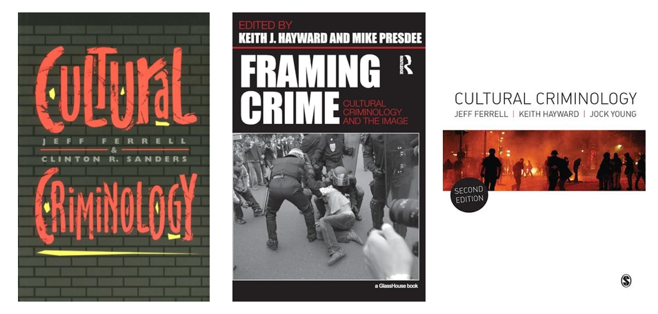{width="90%" fig-alt="Cubiertas de Cultural Criminology, de Ferrell y Sanders; Framing Crime, de Hayward y Presdee; y Cultural Criminology, de Ferrell, Hayward y Young."}

Tres momentos de la criminología cultural: la fundación del campo, su giro hacia la imagen y su consolidación como manual.[^sociedad-15]

:::

[^sociedad-15]: Cubiertas reproducidas al amparo del derecho de cita (art. 32.1 LPI). Los derechos corresponden a Northeastern University Press, Routledge y SAGE respectivamente.

Esta convergencia se articula bajo la noción de *hiperrealidad*, derivada del pensador francés Jean Baudrillard, donde las fronteras entre el acontecimiento transgresor y su imagen se difuminan. Hayward y Presdee [-@Hayward_10] hablan de un "vasto salón de espejos" en el que el significado del delito se fabrica tanto en la calle como en la pantalla.

En esa línea argumental, estos autores introdujeron el concepto de **"media loops"**. Este término alude al proceso por el cual la vida cotidiana se recrea a sí misma a partir de su propia imagen mediática. Así, dentro de este "loop", vemos como la ficción estiliza una subcultura delictiva; individuos reales adoptan esa estética, argot y rituales; los medios informativos informan sobre estos comportamientos reales, y la industria del entretenimiento vuelve a absorberlos en un bucle continuo de retroalimentación. Por tanto, para la criminología cultural, quienes cometen un delito estructuran sus prácticas, estéticas y códigos de conducta a partir de narrativas audiovisuales, arquetipos cinematográficos y flujos digitales de información. Así se entiende en parte, por ejemplo, la adopción de colores, gestos y otros aspectos culturales de las bandas juveniles de Los Angeles en algunas ciudades europeas. No es de extrañar, por tanto, que veamos como los jóvenes a menudo adoptan caricaturas mediáticas (rituales de ostentación de marcas de lujo, gestos corporales y códigos verbales) para construir "credibilidad callejera", escenificándola tanto ante sus iguales como ante la policía a través de redes sociales y videoclips de subgéneros musicales como el drill.

Al mismo tiempo, vemos como las industrias mediáticas capturan estas expresiones subculturales para convertirlas en mercancías consumibles dentro del capitalismo tardío, estilizando la marginalidad y el peligro para redistribuirlos a escala global (pensemos, por ejemplo, en el *gangsta rap* o en el cine quinqui español de los años 80). El delito se convierte de esta manera tanto en un espectáculo mediático como en una vivencia subjetiva que solo se puede entender si además reconocemos el deseo de visibilidad y validación cultural de sus protagonistas, una visibilidad y una validación que no pueden alcanzar por otros medios.

::: {.callout-tip appearance="simple"}
**El cine quinqui**.

El cine quinqui es un género cinematográfico genuinamente español que surgió a finales de los años 70 y alcanzó su punto álgido a mediados de los 80, en plena transición democrática. Estas películas retratan la cruda realidad de adolescentes y jóvenes criados en los suburbios, barriadas obreras y poblados chabolistas de ciudades como Madrid o Barcelona, quienes, atrapados por la falta de oportunidades y el desarraigo social, recurrían a la delincuencia callejera, los atracos, las persecuciones al volante de coches robados y el consumo de drogas, especialmente la heroína.

Una de sus señas de identidad más notorias fue el uso de actores no profesionales reclutados directamente de esos mismos entornos marginales. Figuras como Ángel Fernández Franco, conocido como "El Torete", o José Luis Manzano se interpretaban prácticamente a sí mismos, difuminando por completo la frontera entre la ficción y el documental. Esta autenticidad aportaba una enorme veracidad a las historias, pero también acarreó un trasfondo trágico, ya que muchos de estos jóvenes intérpretes fallecieron muy pronto víctimas de la adicción o el sida.

El género estuvo fuertemente marcado por una estética callejera y una banda sonora dominada por la rumba flamenca y urbana de grupos como Los Chichos, Los Chunguitos o Bordón 4. Estas canciones no solo acompañaban la acción, sino que servían como la voz y el desahogo emocional de toda una generación olvidada por las instituciones.

El director José Antonio de la Loma fue el gran precursor y artífice del éxito comercial del fenómeno con títulos como *Perros callejeros* y *Yo, "el Vaquilla"*, mientras que Eloy de la Iglesia dotó a estas historias de una mayor carga transgresora y denuncia sociopolítica en cintas como *Navajeros*, *Colegas* o *El pico*. Por su parte, Carlos Saura aportó una mirada de autor consagrada con *Deprisa, deprisa*, obra que logró el prestigioso Oso de Oro en el Festival de Berlín de 1981 y consolidó la importancia histórica y cultural del movimiento.

En los últimos años ha habido un notable resurgimiento del imaginario quinqui, tanto a través de homenajes directos y revisiones nostálgicas como mediante adaptaciones contemporáneas a la realidad de los barrios actuales. Así películas como *Criando ratas* (2016), de Carlos Salado, *Las leyes de la frontera* (2021), dirigida por Daniel Monzón y basada en la novela de Javier Cercas, o el documental *Quinqui Stars* (2018), de Juan Vicente Córdoba han vuelto a traer a la pantalla estos temas.
:::

De forma análoga, el control social y el castigo penal son reinterpretados por esta corriente como **puestas en escena culturales** (*cultural performances*). Para estas autoras, la respuesta institucional ante el delito opera a través de una densa dramaturgia del poder que evoca tanto la noción durkheimiana del ritual moral como las lecturas de Michel Foucault sobre la exhibición disciplinaria. Las imágenes de operativos policiales televisados, las conferencias de prensa que despliegan ante las cámaras alijos incautados o armas recuperadas, las incursiones tácticas militarizadas, y los juicios orales de casos mediáticos funcionan como ceremonias coreografiadas cuyo propósito fundamental sería proyectar orden y soberanía estatal frente a las ansiedades colectivas de la modernidad tardía.

Desde esta perspectiva, y en lo que interpretan como un escenario social de volatilidad e "inseguridad ontológica", estos autores entienden que el populismo punitivo florece también como una *narrativa performativa* mediante la cual el Estado compensa su menguante control sobre las crisis socioeconómicas reafirmando su autoridad moral a través de la severidad del castigo. Dada la incapacidad para resolver los problemas cotidianos de la gente y sus incertidumbres se genera todo un teatro de proyección de la capacidad de control recurriendo a estrategias comunicativas de endurecimiento penal y policial.

Para la criminología cultural, esta instrumentalización estética de la ley transforma el ejercicio coercitivo en "entretenimiento voyerista" y "pedagogía moralizante", donde lo comunicativo adquiere una particular relevancia. En este contexto, el delito y su castigo ya no son simplemente cuestiones que se definen y dirimen en el código penal o en el espacio físico de los tribunales, sino en el terreno de la cultura de masas y la economía del espectáculo, sometidas al vertiginoso ritmo de las mismas.

A estos autores, tampoco le han faltado críticas. Es algo a lo que os tenéis que acostumbrar. En ciencias sociales hay distintas escuelas de pensamiento y conviene entender sus puntos de acuerdo y desacuerdo. Martin @OBrien_05, por ejemplo, les reprochaba que no aclarara qué entiende por cultura, y que usaran el concepto de cultura de forma desigual, describiendo con todo detalle la cultura de quienes transgreden y reduciendo la del resto de la sociedad a la de un público manipulado. Es un argumento que ya vimos en una sección anterior sobre el público punitivo, que es bastante menos pasivo de lo que a veces se supone.

::: {.callout-note appearance="simple"}
**¿A qué suena una prisión?**

Casi todo lo que creemos saber de la cárcel lo hemos aprendido a través de las imágenes que nos llegan de ella, pero quien la habita la conoce también por lo que oye en la misma. Kate Herrity [-@Herrity_24] pasó meses *escuchando* una prisión inglesa, sus rejas, sus gritos, su megafonía y sus silencios, y mostró que ese paisaje sonoro es cualquier cosa menos ruido de fondo, porque por él circulan el poder, el orden y la forma en que la gente sobrevive dentro de estos establecimientos. Su estudio es un ejemplo del "giro sensorial" de la criminología cultural, que reivindica prestar atención no solamente a cómo se representa el delito, sino también a cómo se siente. Con este trabajo se abunda en esta línea en la que pasamos del espectáculo de la cárcel visto desde fuera al ruido de la cárcel vivido desde dentro.
:::

Llegados aquí, se ve que la criminología cultural también tiene relevancia como marco para entender buena parte de lo que hemos discutido en secciones anteriores, en la medida que destaca la necesidad de prestar atención a las emociones (cómo el miedo) y el sentido cultural (como el construido a través de los medios de comunicación). Buena parte de este capítulo ya trataba de aquello que subraya la criminología cultural, de cómo el delito y la respuesta al delito son cosas cargadas de significado para quienes las viven.

## A modo de cierre

Este capítulo cierra el bloque del manual que describe los temas de estudio de la criminología, esta vez centrándonos en las respuestas sociales y culturales hacia el delito y el control penal. Nuestro interés ha sido cómo la sociedad percibe, teme, dramatiza y resignifica el delito y su control.

Hemos recorrido para ello cuatro objetos, cada uno con su propia tradición de investigación. Primero, el miedo al delito, que resultó no ser un termómetro del riesgo real sino, en buena parte, una forma expresiva de nombrar inquietudes más hondas, y que se reparte de forma desigual según el género, la edad o la precariedad. Después, los medios, que no inventan ese miedo pero lo alimentan, decidiendo qué delitos y qué culpables merecen atención y fabricando cada cierto tiempo pánicos morales y demonios populares; un mecanismo que las redes y la desinformación han acelerado. En tercer lugar, la demanda social de castigo, que tampoco sigue a las cifras del delito y que, como vimos con datos europeos, se nutre del miedo, pero sobre todo de la hostilidad hacia el otro y de los valores de autoridad y orden. Y, por último, la criminología cultural, que coloca la emoción y el significado en el centro y nos recuerda que el delito y su control son, antes que nada, productos de sentido.

Un mismo hilo atraviesa el capítulo. Lo que la sociedad siente y reclama guarda una relación floja con la realidad objetiva del delito y, en cambio, una relación estrecha con quiénes somos, qué tememos perder y a quién señalamos. De ahí que hayamos insistido tanto en la medición, porque de cómo se pregunte depende que el retrato de una sociedad salga sereno o aterrorizado, comprensivo o sediento de castigo.

Todo esto, además, tiene consecuencias muy concretas, porque la reacción social ante el delito impulsa leyes, justifica la financiación de cárceles, provoca noches como la de Torre Pacheco e influye en por dónde puede caminar una mujer al volver a casa. Por eso creemos que reclamar esa vida social y simbólica del delito como tema de estudio, con el mismo rigor con que se manejan las cifras sobre delincuencia o el sistema penal, es buena parte de lo que implica hacer criminología de una forma responsable.
