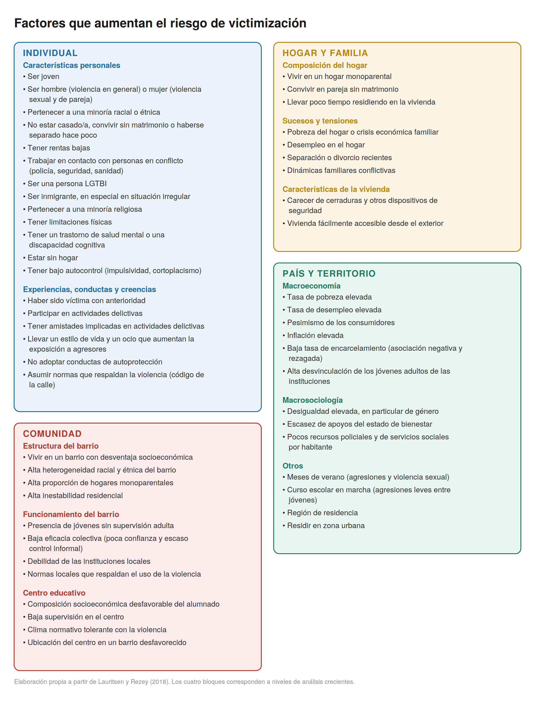
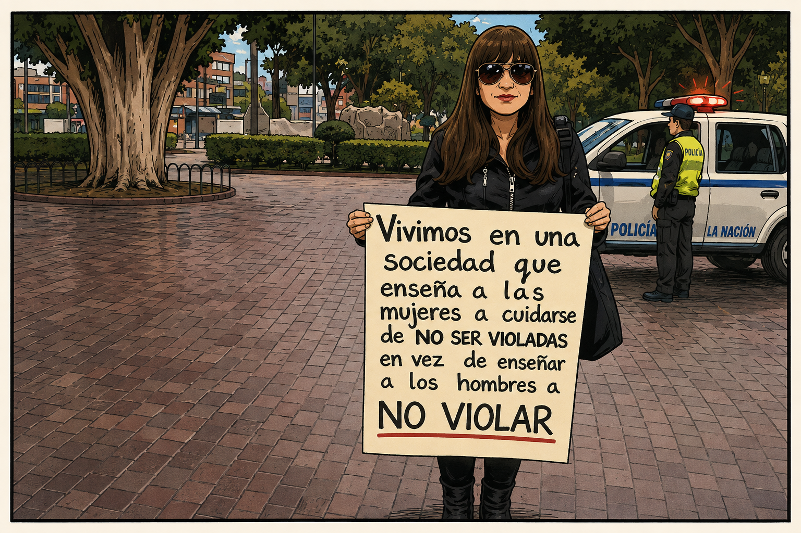
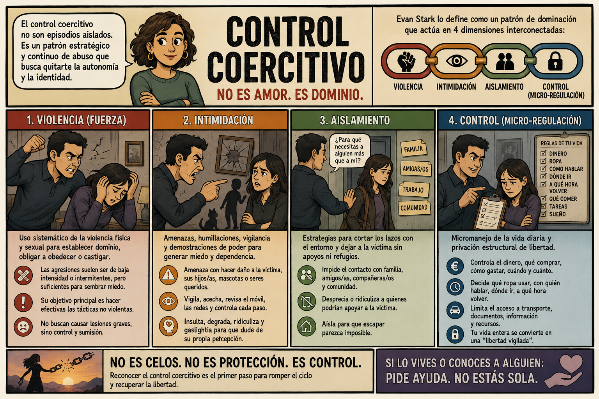
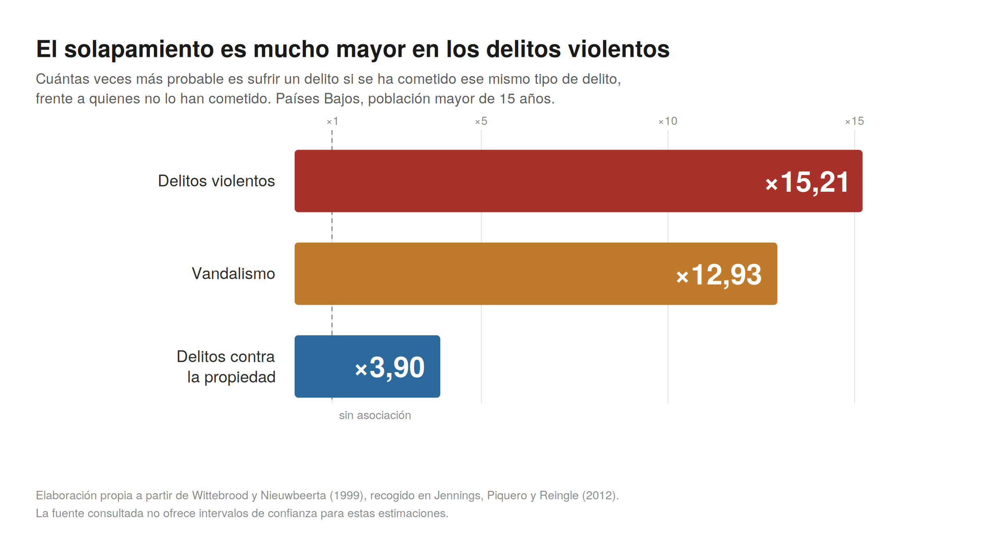
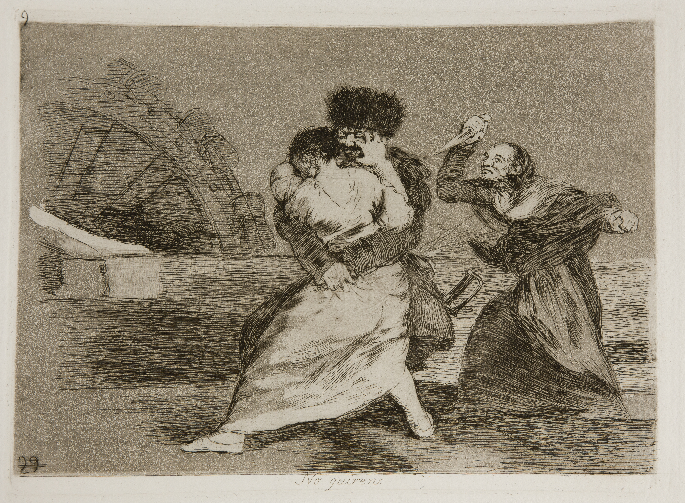
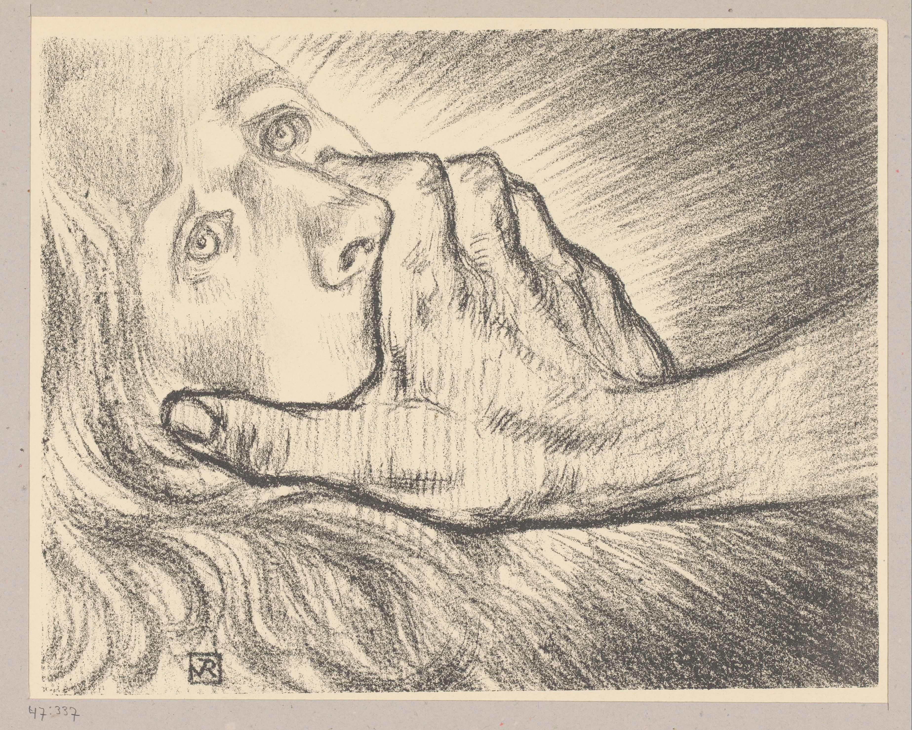
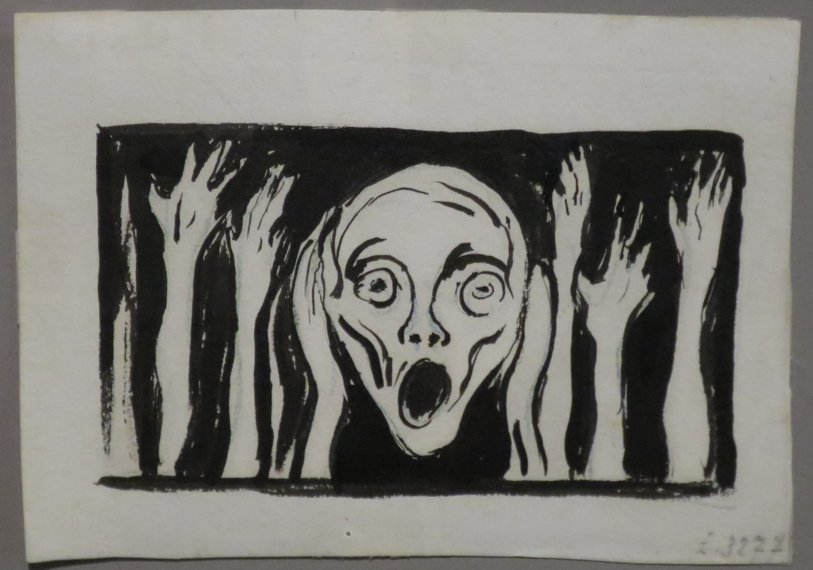
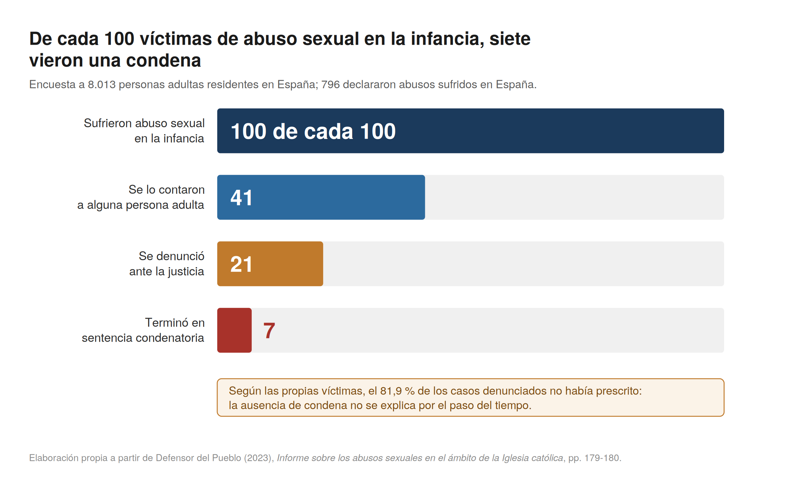

## El regreso de la víctima

En los manuales de criminología de mediados del siglo pasado la víctima casi no aparece. No encontraréis, por ejemplo, un capítulo sobre la víctima en la primera edición de *Los Principios de la Criminología* de Sutherland. La disciplina se había construido como una ciencia volcada en el delincuente (sus causas, su perfil y sus diferencias respecto a quien cumple la ley), relegando a un segundo plano a la persona que sufría el daño.

Cuando a partir de los años sesenta se consolida la **victimología** podríamos pensar que de pronto se "descubre" a la víctima. Pero hablar de *descubrimiento* de la víctima es problemático. Sugiere que la víctima siempre estuvo ahí, invisible y pasiva, esperando a que los criminólogos repararan en ella.

La realidad histórica es más compleja. Durante siglos, la víctima ocupó el núcleo de la respuesta al delito. En la Europa previa al desarrollo de los sistemas penales públicos modernos el conflicto nacido de una ofensa pertenecía a las partes implicadas. La persona agraviada, o su linaje, tenía legitimidad para negociar un acuerdo, exigir una reparación o recurrir a la venganza. Mecanismos como el *wergeld* germánico y otros sistemas de composición tasaban el daño y obligaban a compensar a quien lo había padecido. Y este tipo de sistemas estaba bastante extendido en muchas sociedades. De hecho, la investigación socio-jurídica comparada ha venido a respaldar que la mediación y la compensación privada son respuestas extendidas en comunidades tempranas, mientras que los aparatos coercitivos especializados y burocratizados solo emergen conforme las sociedades ganan en complejidad estructural [@Schwartz_64].

, vía [Wikimedia Commons](https://commons.wikimedia.org/wiki/File:Cpg164_0035_wergild.jpg).](images/wergild.jpg){#fig-wergeld width="100%" fig-alt="Miniatura medieval en dos registros: en el superior, la muerte violenta de una persona; en el inferior, la entrega de una compensación económica."}

En sociedades profundamente desiguales, como aquellas medievales en las que existían estos sistemas, la capacidad de hacer valer un agravio dependía de los recursos de la víctima, y las tarifas de reparación variaban según el rango social. No hay, por tanto, que idealizar o romantizar estas soluciones. Aun así, el delito se gestionaba como un asunto interpersonal donde el afectado retenía el control del desenlace.

El posterior progresivo desplazamiento de la posición de la víctima hacia una posición relegada no fue repentino. Este movimiento hacia una posición más periférica fue el resultado de un proceso que duró varios siglos. Comenzó a gestarse ya en la Baja Edad Media (siglo XIII), cuando la expansión del derecho canónico y la consolidación de las monarquías introdujeron el procedimiento inquisitivo, permitiendo investigar y castigar de oficio para proteger la "paz del rey" y llenar las arcas regias.

Y no fue hasta que llegamos a la codificación penal ilustrada de los siglos XVIII y XIX que se culminó este proceso. Con estas normativas el delito pasó de ser visto como un daño entre particulares a considerarse como una vulneración del orden público y de la ley del Estado. Aunque la víctima no desapareció del proceso, su estatus quedó degradado. Pasó de ser la dueña del agravio a un mero instrumento probatorio, un testigo necesario para que la maquinaria estatal impusiera su castigo, mientras que, era el ministerio fiscal quien se hacía cargo de ejercer la acusación, actuando ahora en nombre y representación de la sociedad.

El autor que formuló esta "expropiación" con mayor lucidez fue el criminólogo noruego Nils Christie (1928-2015), en un su célebre trabajo, *"Los conflictos como propiedad"* [@Christie_77]. En este artículo, Christie plantea que los conflictos no se disuelven de forma natural, sino que son expropiados. Primero por el Estado, que usurpa la posición de parte ofendida, y después por los profesionales del derecho, que secuestran el litigio traduciéndolo a un lenguaje técnico inaccesible para la comunidad. En esta dinámica, Christie mantiene que la víctima sufre una doble marginación.

> "Las partes en conflicto han sido representadas por otros, y esos otros (los profesionales) tienen buenas razones para conservar el conflicto en sus manos. La víctima es una perdedora por partida doble: primero frente a quien la agredió, y después frente a un Estado que le niega el derecho a participar plenamente en aquello que era suyo." [@Christie_77] *(verificar página contra el original)*

::: callout-note
**Otra forma de interpretar los hechos**

El relato precedente (el Estado arrebatando el conflicto a sus dueños legítimos) es la interpretación que la victimología crítica, siguiendo la estela de Christie, ha formulado como una expropiación y una pérdida. Sin embargo, no es la única lectura posible. Quienes investigan la violencia a escala histórica de larga duración narran esta misma transformación como una conquista institucional orientada a la pacificación progresiva de la vida social.

Al monopolizar el ejercicio de la fuerza y la administración de justicia, el Estado fue desplazando la venganza privada, el duelo de honor y la faida (*vendetta*) como vías de resolución de agravios, erradicando con ello una fuente endémica de violencia cotidiana. En su sociología histórica, Norbert Elias conceptualizó esta dinámica como el **proceso de civilización** [@Elias_39], una tesis que la criminología histórica ha tratado de validar estudiando series empíricas sistemáticas. Las tasas de homicidio en Europa occidental sufrieron un descenso sostenido y muy notable. Pasaron de picos de decenas de muertes por cada 100.000 habitantes en la Baja Edad Media a situarse en torno a una en el siglo XX [@Eisner_03]. Desde esta perspectiva, que el litigio dejara de ser "propiedad" de los particulares no se interpreta como un despojo, sino como la condición indispensable para contener la espiral de letalidad y evitar la justicia por mano propia (una tesis divulgada a gran escala, no exenta de simplificaciones muy cuestionadas, por Steven Pinker [@Pinker_11]).

Este enfoque civilizatorio, no obstante, presenta importantes fisuras:

- *Sesgo eurocéntrico:* Se fundamenta casi con exclusividad en series documentales europeas; extrapolar la trayectoria europea como un patrón universal de desarrollo constituye un error que se analiza en profundidad en el capítulo 13.

- *Invisibilización de la violencia estatal:* El relato lineal del "declive de la violencia" suele marginar la letalidad ejercida por el propio aparato estatal (guerras interestatales, violencia colonial, represión y castigo punitivo), dimensiones que se examinan en el capítulo 6 (*Grupos, entidades y Estados que delinquen*).

- *Mito del pasado armónico:* Como se ha advertido, el orden pre-moderno distaba de ser un escenario de justicia igualitaria y libre de coacciones.

Con todo, este debate es imprescindible porque previene cualquier nostalgia anacrónica hacia un pasado idealizado. La pérdida de protagonismo directo de la víctima y las ganancias colectivas en pacificación social constituyen, en realidad, dos dimensiones inseparables de una misma transformación estructural.
:::

Antes de proseguir con la siguiente sección queremos destacar que la criminología contemporánea, y este manual, entiende la victimación no simplemente como un **suceso** (el instante acotado en que alguien sufre un delito) sino como un **proceso**: algo que empieza antes del hecho, se prolonga mucho después y depende tanto de quien comete el delito como de lo que hagan luego el sistema penal, los medios de comunicación y el entorno social. De esta premisa se deriva una idea que quizá en este punto aún os puede sonar abstracta, pero que ira adquiriendo mayor claridad a medida que avancemos en este capítulo: ser víctima no es únicamente haber sufrido un daño, es también un estatus que la sociedad reconoce o niega. Quién llega a contar plenamente como víctima, y quién no, es una cuestión de carácter normativo que atraviesa los distintos debates sobre política criminal y se plasman también en la investigación criminológica. Interpretar la victimación de esta manera, como un estatus que se reconoce o no, y no como un simple hecho, es el punto de partida de la llamada **victimología cultural**, que estudia la condición de víctima como una construcción social hecha de prácticas rituales, artísticas y mediáticas [@HoondertMutsaersArfman_18].

::: callout-note
**Un apunte de vocabulario.**

En este texto usamos *víctima* para referirnos a la persona que sufre el daño, y **victimación** (no "victimización", aunque la RAE también lo recoja como expresión válida y vosotras podéis hacerlo) para el proceso por el que alguien llega a esa situación y la atraviesa. Insistir en el proceso no es una manía terminológica. Es lo que nos permitirá distinguir, más adelante, entre el daño del hecho delictivo y el daño que añade la propia respuesta social e institucional.
:::

## ¿Quienes son las víctimas?

### Regularidades empíricas y su explicación

Hemos anticipado que ser víctima es, en parte, un estatus que la sociedad concede o niega. Antes de ver cómo se reparte ese reconocimiento (de eso trata la sección siguiente), vamos a tratar de responder a una pregunta más sencilla: ¿Quién sufre delitos? ¿Cómo se reparte socialmente la victimación? Pese a nuestro interés en entender la victimación como un proceso, en esta sección nos centramos en hablar en el delito cómo evento. La investigación al respecto es clara, la victimación no se distribuye de forma aleatoria.

Hasta la década de 1970, la imagen criminológica del delito procedía casi en exclusiva de las estadísticas policiales y judiciales que, por definición, solo registran los hechos formalmente denunciados o detectados. Como ya se ha analizado en capítulos anteriores, estas fuentes oficiales constituyen el resultado de la actividad burocrática de una administración pública; por ello, más que reflejar una medida válida y fiable de la criminalidad real, miden la actuación de los propios cuerpos de seguridad, su grado de legitimidad institucional y la propensión de la ciudadanía a colaborar con ellos. Los registros oficiales ocultan un volumen sustancial de delincuencia no registrada: la denominada **cifra negra**.

::: {.callout-note appearance="simple"}
**Por qué unos delitos se denuncian y otros no.**

La existencia de una cifra negra no es fortuita: responde a una cadena de decisiones individuales e institucionales (la voluntad de la víctima de acudir a la policía, la decisión del agente de registrar formalmente el atestado, entre otras). Comprender los factores que motivan o inhiben la decisión de denunciar ha constituido una de las líneas empíricas clásicas de la victimología [@XieBaumer_19]. Las encuestas de victimación impulsaron decisivamente este campo al permitir interrogar de forma directa a quienes habían sufrido un delito pero optaron por no acudir a las autoridades. Los hallazgos son bastante consistentes:

- Lo que más pesa es la **gravedad** del hecho, seguido de motivos más prácticos (recuperar lo robado, cobrar el seguro, protegerse o frenar al agresor).

- Sabemos también que se denuncia menos cuando el agresor es un conocido o la propia pareja, y por eso la violencia sexual y la de pareja figuran entre las menos denunciadas. En ellas pesan la privacidad, el miedo a las represalias, los propios afectos o vínculos con la persona en cuestión, y, sobre todo, la anticipación de no ser creída o de recibir un trato que añada daño [@Felson_02; @ChenUllman_10]. Este último motivo enlaza directamente con las dos secciones siguientes: no denunciar es, muchas veces, un cálculo anticipado de injusticia testimonial y de victimación secundaria.

Por otra parte, los patrones de denuncia presentan una marcada variación territorial. En los países del sur de Europa (España incluida, donde las tasas de denuncia se sitúan por debajo de los promedios del norte y centro del continente), la desigualdad socioeconómica opera como una barrera estructural de acceso a la policía. En estos contextos, los modelos explicativos anglosajones basados en el cálculo racional individual resultan insuficientes para explicar quién acude a comisaría [@Torrente_17].

Asimismo, la tasa de denuncia dista de ser un indicador estático: tras décadas de incremento continuado, diversos estudios longitudinales documentan un descenso en lo que va de siglo XXI, vinculado en parte a cambios en la tipología delictiva y a la erosión de la confianza ciudadana en la policía [@TarlingMorris_10].
:::

La irrupción de las **encuestas de victimación** (consistentes en preguntar de forma directa a muestras representativas de la población si han sufrido determinados delitos, con independencia de si los denunciaron o no) transformó radicalmente el panorama. Encuestas pioneras como la *National Crime Survey* estadounidense a principios de los años setenta, o la *British Crime Survey* en 1982 [@Hough_83], fueron los instrumentos clave que sacaron a la luz la magnitud de esa cifra oculta. Pero, sobre todo, permitieron trazar por primera vez con base empírica independiente el perfil sociodemográfico de las personas victimizadas.

Los datos recabados por estas encuestas revelaron un patrón consistente. Las personas con mayor propensión a sufrir delitos eran jóvenes, varones, residentes en áreas urbanas y con hábitos que implicaban pasar más tiempo fuera del hogar; de forma transversal, la victimación se concentraba en los estratos con menores recursos económicos [@Lauritsen_18]. Emergía así una regularidad estadística persistente entre países y periodos que exigía una explicación teórica.

{#fig-riesgo-victimizacion width="100%" fig-alt="Cuatro bloques con los factores que aumentan el riesgo de victimización según el nivel de análisis: individual, hogar y familia, comunidad, y país y territorio."}

La primera explicación de esas regularidades fue formulada por criminólogos ligados al desarrollo inicial de estas encuestas. Si un delito necesita que se encuentren alguien dispuesto a cometerlo y alguien a quien cometérselo, la probabilidad de ser víctima depende de cuánto se expone una a ese encuentro. La **teoría del estilo de vida** (Hindelang, Gottfredson y Garofalo [@Hindelang_78]) se propuso precisamente para dar cuenta de por qué ciertos grupos aparecían una y otra vez como aquellos con mayor probabilidad de victimación. De su perfil demográfico (y algunas de sus respuestas) se infería que sus rutinas (a qué hora salen, por dónde se mueven, con quién, en qué trabajan) los sitúan a distinta distancia de los agresores potenciales.

La investigación criminológica contemporánea ha refinado esta intuición original. Lo decisivo no es tanto el volumen bruto de exposición como su nivel intrínseco de **riesgo** ("la calidad" de la exposición). Estar fuera del hogar no basta; importa a qué tipo de situaciones y compañías nos asoman nuestras rutinas diarias, pues existen entornos inocuos y entornos altamente criminógenos [@PrattTuranovic_16]. Diversos estudios han contrastado esta dinámica con metodologías diseñadas para medir rutinas cotidianas de forma precisa y detallada.

Por ejemplo, en una serie de investigaciones con jóvenes en Filadelfia se reconstruyó la trayectoria espaciotemporal del día en que sufrieron una agresión física y se comparó a cada participante consigo mismo en distintos momentos de esa misma jornada [@Wiebe_16; @Dong_20]. Al utilizar a cada persona como su propio control (*diseño de caso cruzado*), estos modelos descartan la influencia de la edad, el sexo o la personalidad, aislando el impacto directo del contexto situacional. Los factores que incrementaban el riesgo de victimación eran la presencia en espacios públicos en actividades no estructuradas, la ausencia de guardianes y el tránsito por zonas marcadas por edificios abandonados, violencia previa y desorden físico.

![Porcentaje de tiempo que los participantes pasaron, en cada hora del día, en distintos tipos de lugares y medios de transporte, según el grupo: jóvenes agredidos con arma de fuego, jóvenes agredidos sin arma de fuego y controles de la comunidad. La reconstrucción procede de entrevistas de presupuesto espacio-temporal sobre el día previo. La exposición a unos u otros entornos no es constante a lo largo del día ni igual entre grupos, lo que sugiere que el riesgo de agresión depende del contexto concreto en que transcurre la actividad cotidiana y no solo de características estables de las personas. Fuente: Wiebe et al. (2016), figura 1.[^victimas-1]](images/risk.jpg){#fig-wiebe width="100%" fig-alt="Series apiladas por hora del día que muestran el reparto del tiempo entre tipos de lugar y medios de transporte para tres grupos de participantes."}

[^victimas-1]: Wiebe DJ et al., "Mapping Activity Patterns to Quantify Risk of Violent Assault in Urban Environments", *Epidemiology*, 2016;27(1):32-41. PMC4658670.

[^victimas-2]: Wiebe DJ et al., "Mapping Activity Patterns to Quantify Risk of Violent Assault in Urban Environments", *Epidemiology*, 2016;27(1):32-41. PMC4658670.

Esta lógica coincide con el enfoque de las **actividades rutinarias** de Cohen y Felson [@Cohen_79], ya analizado en el capítulo 4 (*El delito*). Desde esta perspectiva de entiende que para que el hecho delictivo concurra en el espacio y el tiempo deben coincidir un agresor motivado, un objetivo adecuado y la ausencia de un guardián capaz. En este esquema, la víctima se conceptualiza como el objetivo adecuado o la portadora del mismo.

Sin embargo, la violencia machista en el ámbito de la pareja y la familia opera aquí como un caso negativo. El retrato derivado del estilo de vida y las actividades rutinarias (exposición nocturna, agresor desconocido, la calle) explica de forma deficiente la victimación más grave que sufre la mitad de la población. Una mujer que sufre violencia de género no es victimizada por "exponerse" a riesgos en el espacio público ante extraños; es agredida en su propio hogar, por la persona con quien convive y de forma recurrente en el tiempo, en el espacio que estas teorías presumen seguro. Paradójicamente, quien debería actuar como "guardián capaz" es el propio agresor. Toda teoría de la oportunidad que ignore esta realidad adolece de un sesgo explicativo estructural.

### Exposición, responsabilización y desigualdad

Estas teorías no han estado exentas de críticas. Mal leídas, podrían deslizarnos hacia la culpabilización o responsabilización de la víctima. Del "esta rutina aumenta la exposición" al "pues haber cambiado de rutina" hay tan solo un paso. Por eso es importante separar dos planos que no deben confundirse:

- **El plano de la exposición situacional:** Transitar por la vía pública de noche, frecuentar determinados entornos de ocio o desempeñar empleos de atención directa al público pueden incrementar la probabilidad estadística de coincidir en el espacio y en el tiempo con un delincuente motivado.

- **El plano de la responsabilidad moral y penal:** La autoría y la culpa del delito recaen de manera exclusiva e indivisible sobre quien decide cometer la agresión.

Por ejemplo, una mujer joven que sale de un local de ocio nocturno ha decidido salir a divertirse; en ningún caso ha decidido ser agredida. Su rutina explica, como mucho, la oportunidad o la convergencia situacional del encuentro; pero en ningún caso explica ni justifica la agresión.

Entre la oportunidad ambiental y la consumación del delito media siempre una voluntad individual que opta por quebrantar la ley, y es esa decisión libre del agresor la única causa eficiente del daño. Las teorías de la oportunidad identifican los nodos espaciotemporales donde resulta más probable que se crucen las trayectorias de infractores y víctimas potenciales; en ningún caso distribuyen ni atenúan la culpabilidad entre quien perpetra el ataque y quien sufre la victimación.

::: {.callout-note appearance="simple"}
**Del análisis al consejo: cuando la prevención responsabiliza.**

La distinción entre exposición situacional y responsabilidad moral no es un debate meramente teórico; adquiere una urgencia práctica inmediata cuando la criminología salta del artículo científico a las políticas de prevención y a las recomendaciones públicas. Si ciertas rutinas exponen más, la conclusión que se suele extraer es "cambiad esas rutinas", y ese consejo se dirige, inevitablemente, a las **víctimas potenciales**.

La propia tradición que formuló estas teorías se ha defendido insistiendo en que reducir oportunidades no es culpar a nadie. Estos autores consideran que atribuir a una situación un papel causal no significa que la víctima "se lo mereciera", ni descarga de culpa a quien agrede; y que una campaña de prevención se dirige a la ciudadanía respetuosa de la ley sencillamente porque es más fácil de persuadir que un agresor decidido [@FelsonClarke_98]. La literatura analítica más rigurosa ha demostrado, además, que la acusación de "culpar a la víctima" engloba objeciones distintas (epistémicas, morales y políticas) que no siempre se sostienen con la misma fuerza [@Holmen_24]️.

Sin embargo, pese a estos argumentos, no podemos dejar de considerar que el modo en que se formulan estos consejos preventivos a menudo ignora sus costes éticos y sociales. En el ámbito de la violencia sexual y de género, el consejo preventivo degenera con facilidad en una injusta **responsabilización**. Estos mensajes y campañas trasladan a las mujeres la carga de esquivar una violencia que no ejercen, ignora el enorme "trabajo de seguridad" que ya hacen a diario para protegerse [@VeraGrayKelly_20] y (lo más sutil) cambia la imagen de quién cuenta como víctima creíble. La víctima creible no es ya la mujer simplemente inocente, sino la que además gestionó bien su riesgo, de modo que la que no "tomó precauciones" pierde, de paso, credibilidad [@Gotell_08]️ (una idea que retomaremos en la sección siguiente).

A esa injusticia se suma que el consejo suele estar mal dirigido. Cuando se estudia dónde ocurren las agresiones sexuales, el mapa desmiente el tópico. Algunos entornos abiertos, como las propias calles, resultan más protectores que peligrosos, y para las mujeres el hogar es más peligroso que la vía pública [@Ceccato_17]️. La salida no es renunciar a toda prevención. Cabe reconocer que una conducta redujo *causalmente* el riesgo sin cargar por ello a la víctima con la responsabilidad *moral* del delito [@Curchin_19]️. Entendemos la lógica de la prevención; pero la carga de acabar con la violencia machista tiene que recaer sobre quien la ejerce, no sobre quien tiene que vivir esquivándola.
:::

Aclarada la frontera entre exposición y culpa, la constatación de que el riesgo se reparte de forma desigual subraya la relevancia de la justicia social en este ámbito. La exposición al delito rara vez es fruto de una elección libre en igualdad de condiciones. Quien limpia oficinas en turnos de madrugada, quien reside en la barrios marginalizados porque no puede costearse otra vivienda, o quien carece de vehículo privado y depende de un transporte público deficitario, asume un riesgo objetivo derivado de su posición material, no de su voluntad.

El estilo de vida no es un simple catálogo de preferencias individuales. Nuestras rutinas están condicionadas por la estructura socioeconómica. Aquellas víctimas que desearían reorganizar sus rutinas para reducir su victimación a menudo carecen de los medios materiales para hacerlo. La investigación sobre determinantes estructurales ha confirmado que en las comunidades más precarizadas la capacidad de alterar los patrones cotidianos de riesgo es mínima, lo que alimenta de forma sistemática la revictimación [@Turanovic_18].

Esta distribución asimétrica conecta de lleno con los bloques temáticos de la tercera parte del manual. La probabilidad y concentración de la victimación siguen las fracturas estructurales de la clase social (capítulo 10), el género (capítulo 11) y la etnicidad (capítulo 12). Aquellos grupos con menor capacidad para elegir dónde residir, cómo desplazarse y de quién rodearse son los más expuestos al delito y quienes mayores barreras encuentran para que las instituciones les reconozcan el estatus pleno de víctimas.

### La concentración de la victimación

La investigación ha venido a documentar también que la victimación está altamente concentrada. Sabemos que una pequeña fracción de personas y de lugares soporta una parte desproporcionada de todos los delitos. A nivel espacial, la delincuencia se agrupa en unos pocos segmentos de calles con una regularidad tan consistente que se ha formulado como la *ley de la concentración del delito* [@Weisburd_15; @Lauritsen_18]. En las personas y en los hogares opera un fenómeno análogo el de la concentración de la victimación en ciertas personas. Esta concentración puede adquirir distintas formas como se expone en la siguiente tabla:

| Concepto | Definición | Ejemplo |
|:-----------------------|:-----------------------|:-----------------------|
| **Polivictimación** | Sufrir distintos tipos de victimación en varios ámbitos de la vida. | Un niño que sufre acoso escolar, maltrato físico en casa y presencia violencia en su barrio. |
| **Victimación repetida** | Sufrir el mismo tipo de victimación en repetidas ocasiones. | Una persona a la que roban en su vivienda en tres ocasiones distintas. |
| **Abuso crónico** | Episodios continuados y prolongados de una única forma de daño. | Soportar durante años el control coercitivo de una misma pareja. |

: Formas de victimación múltiple

Cada una de estas formas ha recibido atención científica dentro de campos disciplinares y teóricos diferentes. La victimación repetida fue estudiada por teóricos vinculados al modelo de la prevención situacional del delito cuando estudiaban los robos en pisos (aunque posteriormente generalizaron sus observaciones a otros delitos); la polivictimación por psicólogos interesados fundamentalmente en la victimación de menores; y el abuso crónico, sobre todo el control coercitivo, por investigadoras feministas que estudiaban la violencia machista en el contexto de las relaciones de pareja.

#### La victimación repetida

La primera forma de concentración que vamos a trarar es la que el criminólogo británico Ken Pease denominó **victimación repetida**. Este autor usó este término para destacar que quien ha sufrido un delito tiene, durante una ventana temporal acotada, una probabilidad sustancialmente mayor que la media poblacional de volver a sufrirlo [@Tseloni_14; @Metcalfe_25]️.

Esta literatura propone que este incremento del riesgo tras un primer suceso responde a dos mecanismos complementarios [@FarrellPhillipsPease_95; @TseloniPease_03]:

- **Hipótesis de la señalización o vulnerabilidad previa (*flag account*):** El primer delito simplemente "señala" un objetivo que ya era especialmente idóneo o vulnerable (una vivienda mal iluminada, un comercio sin medidas de seguridad, una persona desprotegida). Esas condiciones estructurales persisten tras la agresión; el hecho de haber sido victimizado no altera por sí mismo su vulnerabilidad de base.

- **Hipótesis del impulso o aprendizaje (*boost account*):** El propio delito "empuja" y facilita los siguientes. Al consumar el hecho, el agresor adquiere información directa sobre el entorno. Por ejemplo, comprueba qué vías de escape funcionan, qué alarmas faltan o qué rutinas facilitan el ataque. Reincidir en el mismo objetivo le exige menor esfuerzo, reduce su incertidumbre y maximiza el beneficio esperado.

La investigación ha documentado además que esta repetición presenta una **firma temporal** muy definida. El riesgo de sufrir un nuevo ataque se dispara inmediatamente después del primer incidente y decae de forma progresiva con el paso de las semanas. En el caso del robo en viviendas, buena parte de las repeticiones se concentran durante las primeras 48 a 72 horas [@Farrell_95]️.

Esta línea de investigación indica que pocas víctimas cargan con muchos de los delitos. Los hallazgos derriban el mito de la víctima como alguien que simplemente sufrió un desafortunado golpe de azar aislado. Para amplios sectores sociales, la victimación es un clima constante en el que se habita.

::: {.callout-note appearance="simple"}
**Del patrón a la prevención.**

Que el delito se concentre y sea temporalmente predecible tiene una consecuencia práctica directa. Si el riesgo se dispara justo tras la primera agresión, la víctima reciente constituye un objetivo de protección prioritario con fecha de caducidad; la intervención debe ser inmediata.

Buena parte de la prevención situacional contemporánea (que abordaremos en el capítulo 16) se fundamenta en esta premisa. Para esta perspectiva tiene sentido concentrar los recursos policiales y comunitarios en proteger primero a quien acaba de ser victimizado y asegurar los microespacios donde el daño se acumula. Hay algo de evidencia empírica que respalda esta estrategia. El célebre *Proyecto Kirkholt* en el Reino Unido focalizó las medidas de seguridad física y el apoyo comunitario en hogares recién asaltados, logrando reducir los robos a menos de la mitad y desplomando la revictimación. Revisiones sistemáticas posteriores confirman que este tipo de programas orientados a la victimación repetida consiguen descensos medios de la delincuencia cercanos al 20% [@Farrell_95; @GroveFarrell_12]. Aunque hay que notar que esta literatura ha sido generada precisamente por los proponentes de este concepto y necesitamos más evaluaciones independientes.

Además, esta lógica entraña riesgos éticos si se aplica de forma acrítica. Mal gestionada, puede justificar la sospecha y la sobrevigilancia permanente sobre los mismos colectivos y barrios vulnerables. Asimismo, la métrica de "incidentes aislados" resulta insuficiente para captar la violencia acumulativa, relacional y continuada (como la violencia de género y doméstica), donde la propia respuesta burocrática del sistema penal puede agravar el daño inicial [@Batchelor_26]. La concentración del delito puede interpretarse para proteger a las personas o para estigmatizarlas; la política pública debe tener siempre clara esa frontera.
:::

La literatura criminológica sobre victimación repetida ha impulsado un profundo debate metodológico en torno a las limitaciones de las encuestas de victimación convencionales, como la *Crime Survey for England and Wales* (CSEW) o la *National Crime Victimization Survey* (NCVS) de Estados Unidos. Diversos autores han demostrado que los instrumentos tradicionales de medición tienden a subestimar sistemáticamente la concentración del delito debido a sesgos estructurales en su diseño y que, por tanto, las estimaciones de victimación que resultan de estas encuestas la infraestiman al no medir bien la victimación repetida.

Entre los principales obstáculos destacan el truncamiento artificial de respuestas (históricamente aplicado mediante topes máximos de incidentes contabilizables por individuo, por ejemplo 5) y la dificultad para registrar adecuadamente los denominados "incidentes en serie", habituales en dinámicas de violencia de género, acoso o disputas vecinales continuadas, donde la entrevistada puede tener dificultades para recordar los eventos de victimación como incidentes separados [@Planty_07].

Para subsanar estas distorsiones y generar estimaciones más rigurosas, la investigación metodológica ha promovido una serie de reformas operativas y estadísticas sustanciales [@Walby_16; @ONS_17]. En el plano técnico, se ha avanzado hacia la flexibilización o eliminación de los topes arbitrarios de incidentes. Asimismo, los cuestionarios contemporáneos incorporan protocolos específicos de frecuencia estimada y módulos auto-administrados diseñados para capturar mejor aquellos patrones de victimación prolongada en casos de abuso crónico y similares en lugar de tratar cada agresión como un hecho aislado. No obstante, estudios recientes aún documentan problemas incluso con estas soluciones, en particular la persistente infra-estimación de la violencia contra la mujer [@Walby_26].

#### La polivictimación

La segunda forma de concentración es la polivictimación, un término que fue introducido originalmente por el sociólogo norteamericano David Finkelhor en el contexto de la victimación infantil y juvenil [@Finkelhor_07]. Frente a la victimación repetida, la polivictimación alude a aquellas situaciones en las que se sufren distintos tipos de victimación en varios ámbitos o contextos de la vida. Es común en esta literatura usar como herramienta metodológica de medición multidimensional el *Juvenile Victimization Questionnaire* (JVQ) [@Finkelhor_05; @Pereda_18].

El debate conceptual en torno a la polivictimación se ha centrado en cómo definir y medir adecuadamente este fenómeno para diferenciarlo de otras formas de trauma. La discusión principal ha girado en torno a que criterio usar; si conviene usar un criterio puramente cuantitativo o uno más cualitativo. Tradicionalmente, muchas investigadoras han utilizado un simple umbral numérico, considerando polivíctima a quien sufre un número determinado de victimaciones diferentes, por ejemplo cuatro o más en un mismo año. Sin embargo, esta forma de contar (y medir) simple ha sido criticado porque asume que todos los tipos de victimación tienen la misma gravedad y pasa por alto el contexto en el que ocurren. No deja de ser un criterio artificial y arbitrario.

Como alternativa, otras autoras defienden modelos basados en la diversidad de ámbitos y contextos en los que se produce la victimación, argumentando que lo verdaderamente dañino no es solo la cantidad de hechos. Para estos autores lo relevante es el hecho de sufrir formas de victimación en múltiples contextos a la vez, como el hogar, la escuela y la comunidad. Esta perspectiva sostiene que cuando el daño proviene de diferentes entornos y figuras de referencia, se destruyen los espacios seguros de la persona, lo que puede agravar el impacto psicológico.

La literatura científica reciente sobre la polivictimación ha evolucionado desde la delimitación conceptual del constructo hacia el análisis de sus mecanismos etiológicos, disparidades estructurales y modelos de intervención [@Turner_10]. En el plano epidemiológico y sociológico, diversos estudios longitudinales han constatado que el fenómeno no responde a una distribución aleatoria. Estos estudios sugieren que suele converger en colectivos sujetos a vulnerabilidad socioestructural acumulada, con tasas notablemente superiores en minorías sexuales y de género, menores con discapacidad o en sistemas de protección, y contextos caracterizados por la marginación socioeconómica [@Finkelhor_09].

En España, ya hay algunos estudios al respecto. Una encuesta comunitaria estimó que el 20% de la muestra se consideró polivíctima (es decir, experimentó victimación en 7 o más formas según la definición de este estudio). Las adolescentes polivíctimas experimentaron victimación en 4 o más ámbitos a lo largo de su vida [@AlvarezLister_14].

#### El abuso crónico: el control coercitivo

El abuso crónico hace referencia a episodios continuados y prolongados de victimación. En pocos ámbitos se manifiesta esta dinámica de forma tan evidente como en los casos de violencia contra las mujeres en la pareja. Aunque no toda la violencia en este contexto se hace crónica, de hecho hay quienes documentan que la mayoría de los casos de violencia en la pareja son esporádicos y no presentan patrones de escalada [@BlandAriel_15], hay un porcentaje de casos en los que el abuso viene a condicionar de forma más prolongada la relación. Es lo que el sociologo norteamericano Michael Johnson [-@Johnson_95] llamaba **terrorismo íntimo** como algo diferente de lo que el llamaba **violencia situacional de la pareja**[^victimas-3]. Si, en este tipo de situaciones de terrorismo íntimo, a la pregunta de cuándo se victimiza a una "mujer maltratada" respondiéramos "el día en que él la golpeó", habríamos omitido la dimensión estructural del fenómeno. Esta particular forma de violencia en las relaciones de afectividad no se reduce a una secuencia de incidentes lesivos aislados intercalados con periodos de calma. Por el contrario, constituye una condición de sometimiento continuo.

[^victimas-3]: Según Johnson [-@Johnson_95], la diferencia principal entre el terrorismo íntimo y la violencia situacional de pareja no está en la gravedad de un episodio concreto, sino en el contexto de control. En el terrorismo íntimo, la violencia forma parte de un patrón general de control coercitivo, con aislamiento, amenazas, control económico y humillación, y su objetivo es dominar a la pareja. En la violencia situacional, en cambio, surge de conflictos puntuales, sin ese propósito de control general. De ahí se derivan otras diferencias. Johnson sostiene que el terrorismo íntimo lo ejercen sobre todo hombres contra mujeres, tiende a agravarse con el tiempo, causa más lesiones y daño psicológico y suele continuar tras la separación. La violencia situacional es más simétrica por género, suele ser esporádica, a menudo no escala y desaparece con más facilidad, aunque en una minoría de casos puede ser grave o crónica. También cambia dónde aparece registrada. Mientras que la violencia situacional predomina en las encuestas de población general, el terrorismo íntimo aparece en las muestras de casas de acogida, policía o servicios sanitarios, lo que según Johnson explicaría los resultados contradictorios sobre la simetría de género. La literatura posterior ha discutido en qué medida estas son categorías separadas o forman los polos opuestos de un continuo.

Este tipo de situaciones que Johnson denominó terrorismo íntimo es lo que el sociólogo estadounidense Evan Stark [-@Stark_07] conceptualizó como **control coercitivo** (*coercive control*). Para Stark se trata de un patrón sostenido de dominación que articula intimidación psicológica, aislamiento social (fracturar las redes familiares, de amistad o laborales), vigilancia constante y microrregulación de la vida cotidiana (imposiciones sobre horarios, vestimenta, autonomía económica o comunicaciones). La agresión física, cuando tiene lugar, es el recordatorio explícito que apunta y sostiene todo el andamiaje de dominación.

Se comprende así el choque estructural con un derecho penal tradicionalmente orientado a juzgar episodios lesivos discretos, individualizados y fechados en el calendario. Buena parte de la dificultad en este terreno es de naturaleza probatoria. Es relativamente facil probar un moraton en el ojo o un brazo roto, por el contrario, reconstruir ante un tribunal una atmósfera de dominio prolongada en el tiempo (edificada sobre pautas de conducta que, analizadas de manera aislada, pueden parecer inocuas) resulta mucho más arduo que acreditar una lesión física mediante un parte médico. No es imposible, pero requiere más predisposición, recursos y esfuerzo por parte de la policía y la fiscalía.

Diversas legislaciones comparadas han respondido a estas dináicas tipificando el control coercitivo como una figura delictiva autónoma, como hicieron el [Reino Unido](https://www.cps.gov.uk/prosecution-guidance/controlling-or-coercive-behaviour-intimate-or-family-relationship#_coh4) en 2015 o Irlanda en 2018. El ordenamiento penal español no contempla un tipo específico con esa denominación, aunque no carece de herramientas para sancionarlo. El delito de violencia habitual (art. 173.2 del Código Penal [^victimas-4]) castiga el maltrato físico o psíquico ejercido de forma reiterada, y la jurisprudencia del Tribunal Supremo lo interpreta no como una suma matemática de agresiones físicas, sino como la instauración de un clima de dominación y humillación permanente, coincidente con el núcleo teórico del control coercitivo. Determinar si una tipificación diferente en nuestro país aportaría garantías adicionales (en particular frente a las formas sutiles de dominación psicológica o económica sin violencia física explícita) sigue siendo hoy un debate político-criminal abierto.

[^victimas-4]: El Art. 173.2 del Código Penal sanciona a quien ejerza habitualmente violencia física o psíquica sobre su cónyuge, persona ligada por análoga relación de afectividad o miembros del núcleo familiar. La jurisprudencia consolidada de la Sala de lo Penal del Tribunal Supremo establece que este tipo penal tutela la paz en el hogar y la integridad moral, castigando la creación de un estado o "clima de dominación y desprecio sistemático" que anula la dignidad de la víctima, con independencia de que los actos concretos hayan sido ya juzgados o prescritos individualmente.

::: {.callout-note appearance="simple"}
**Laura Cruz: evidencia del fracaso del sistema para responder al control coercitivo**

El asesinato de la guardia civil Laura Cruz a manos de su expareja en agosto de 2026 ilustra de forma ejemplar las deficiencias del sistema penal para identificar y neutralizar el **control coercitivo**. A lo largo de doce años tras la ruptura de la pareja, Laura soportó una pauta continuada de dominación que desplegó todos los componentes clásicos conceptualizados por Evan Stark:

- **Acoso procesal (*legal and procedural abuse*):** La interposición sistemática de 45 denuncias instrumentales en el juzgado por motivos inocuos (supuestos retrasos con los menores o discrepancias sobre el uso del vehículo común) con el único fin acreditado en sede judicial de "perturbar su ánimo" y causarle un desgaste emocional continuado.

- **Violencia económica y chantaje procesal:** El bloqueo reiterado de la liquidación de la hipoteca común para retenerla bajo morosidad bancaria e impedir su autonomía crediticia, llegando a exigir por escrito la retirada de denuncias penales como condición previa para firmar acuerdos notariales.

- **Control psicológico y violencia vicaria:** El uso del régimen de visitas y las necesidades de los tres hijos menores comunes como recordatorio constante de su presencia ("no parar hasta destruirte la vida").

- **La agresión física como anclaje del terror:** Una agresión de extrema violencia perpetrada en 2019 en presencia de los hijos y de testigos, que consolidó el marco de intimidación para todos los años posteriores.

El caso evidencia también de manera trágica el **sesgo atomista de los tribunales**. Pese a la acusación sostenida de la Fiscalía por los delitos de violencia habitual (art. 173.2 CP) y acoso continuado (art. 172 ter CP), la Audiencia Provincial absolvió al agresor de ambos tipos penales, confirmando una condena parcelada por episodios aislados (un año de prisión por maltrato puntual y ocho meses por coacciones leves). Al no apreciar formalmente un "clima continuado de dominación", la respuesta judicial atomizó doce años de asedio en dos sucesos desconectados.

Esta lectura fragmentaria condujo a un fallo crítico en la evaluación del riesgo. Al dictarse la sentencia firme, las medidas cautelares de alejamiento decayeron por haber sido consumidas durante la prolongada tramitación del proceso (2019-2025). En diciembre de 2025, el juzgado denegó la reactivación de la orden de protección y del dispositivo telemático (pulsera) solicitada por Laura, argumentando expresamente que *"no constaba objetivado ningún otro episodio lesivo anterior o posterior"* que justificara un peligro físico inminente. El tribunal interpretó la ausencia de agresiones corporales recientes como "ausencia de riesgo", pasando por alto la acumulación del control patrimonial y un *detonante vital crítico* (la inminente notificación de la expulsión definitiva del agresor de la Guardia Civil).

El desenlace constata los límites del modelo penal clásico. Cuando el maltrato se evalúa únicamente como una serie de lesiones físicas fechadas en el calendario y se desestima el control coercitivo continuado, el sistema deviene estructuralmente ciego ante la escalada del riesgo letal. Que la víctima fuera Guardia Civil y el asesinato tuviera lugar en dependencias policiales ilustra hasta que punto el sistema fracasó de forma rotunda en este caso.

Mi interpretación de este caso es que aunque presenta similitudes estructurales con el de Ana Orantes que sirvió para movilizar la opinión pública y la clase política para tomar cartas en el asunto, el de Laura Cruz, pese a la moderada atención mediática que recibió, pronto pasará al olvido sin que los fallos que el caso ilustra sean atendidos de forma urgente y eficiente.
:::

### El solapamiento víctima-infractor

Hasta ahora hemos asumido implícitamente que las víctimas y las personas que delinquen constituyen dos colectivos claramente separados (después de todo, les dedicamos capítulos distintos en este manual). Sin embargo, la realidad empírica desmiente parcialmente esta dicotomía.

De hecho, uno de los hallazgos más consistentes de la criminología y victimología contemporánea es el denominado **solapamiento víctima-infractor** (*victim–offender overlap*). Las personas que cometen delitos tienen una probabilidad sustancialmente mayor de sufrir victimizaciones y, a la inversa, las víctimas presentan un riesgo más elevado de verse involucradas en y perpetrar conductas delictivas, un fenómeno especialmente visible en el ámbito de los delitos violentos [@Jennings_12]️.

Se trata de un patrón tan sólidamente replicado en diferentes épocas y países que la literatura especializada considera que es uno de los hechos empíricos básicos de la disciplina [@Berg_22]. Sabemos hoy que las mismas rutinas de riesgo y contextos desfavorables que exponen a la victimación aumentan también la probabilidad de cometer infracciones [@Engstrom_18]. La frontera entre la víctima inocente y el delincuente, que puede resultar tan cómoda para el sentido común y para el derecho penal, empíricamente es más difusa de lo que a menudo suponemos.

Aunque el solapamiento está ampliamente constatado por numerosos estudios, cuantificar su alcance exacto entraña serias dificultades metodológicas asociadas a las fuentes de datos. El terreno donde este solapamiento se observa de forma más clara es el homicidio. Diversas investigaciones internacionales señalan que alrededor de la mitad de las víctimas mortales (y más de la mitad de los agresores) acumulaban antecedentes penales previos, y que las víctimas de homicidio tienen entre cuatro y diez veces más probabilidades de haber sido detenidas con anterioridad que la población general [@Jennings_12].

Cuando observamos otro tipo de delitos el solapamiento es más modesto, pero igual de real. Por ejemplo, en un estudio sueco hace unos años cuando se clasifica a los jóvenes en cuatro grupos (ni víctimas ni infractores, solo víctimas, solo infractores y víctimas-infractores), este último es un grupo pequeño (en torno al 7%) [@Engstrom_18].

Por tanto, debe subrayarse que este solapamiento no es universal y que es heterogéneo. La inmensa mayoría de las víctimas nunca ha cometido un delito (la categoría más numerosa en la población suele ser siempre la de "solo víctimas") y una fracción sustancial de quienes mueren asesinados carece de cualquier historial delictivo previo [@Jennings_12]. Y el efecto es, además, heterogéneo; es más común en relación con algunos delitos que con otros.

{#fig-odds-solapamiento width="100%" fig-alt="Barras horizontales con las razones de probabilidad de sufrir un delito habiéndolo cometido: 15,21 para delitos violentos, 12,93 para vandalismo y 3,90 para delitos contra la propiedad."}

La literatura criminológica explica este solapamiento señalando que víctimas y ofensores suelen compartir perfiles de desventaja socioeconómica, rasgos individuales de impulsividad y presencia en los mismos entornos situacionales [@BergMulford_20; @Berg_22]. No obstante, existe otra vía complementaria para comprender por qué el sufrimiento del daño y su perpetración coexisten con tanta frecuencia, el impacto del **trauma**. Este puente conceptual procede de la investigación sobre adversidad y maltrato infantil y de los enfoques asistenciales sensibles al trauma.

La victimación temprana, en particular el maltrato físico, emocional y el abuso sexual en la infancia, se encuentra estrechamente asociada con trayectorias posteriores tanto de revictimación como de conducta delictiva en la etapa adulta [@Font_22]. No de manera mecánica ni inevitable (la mayoría de quienes sufrieron abuso no delinquen), pero sí lo bastante como para sospechar que algo se transmite y se repite cuando el daño queda sin reparar. Por ejemplo, en su estudio etnográfico sobre mujeres consumidoras de metanfetamina, Grundetjern y Gadd [-@Grundetjern_25] describen cómo el trauma infantil no resuelto empuja de forma recurrente hacia relaciones de dependencia y contextos marginales que reeditan su victimación.

::: {.callout-note appearance="simple"}
**Los *pathways* feministas: del daño sufrido al daño infligido.**

Una fértil tradición de investigación criminológica ha profundizado en el impacto del trauma acumulado específicamente en las mujeres, ofreciendo una explicación de por qué la población penitenciaria femenina presenta tasas de victimación previa extraordinariamente superiores a la media poblacional [@DeHart_08]️. Uno de los estudios más significativos en esta tradición fue desarrollado por Kathleen Daly, que a partir de las biografías de cuarenta mujeres condenadas por delitos graves distinguió varias **vías** (*pathways*) hacia el delito [@Daly_92]. Una de ellas retrata las que Daly llamó **mujeres dañadas que dañan** (*harmed-and-harming women*). Las mujeres en esta categoría eran personas que sufrieron abusos graves y negligencia en la infancia y que, en la edad adulta, reproducen patrones violentos o conductas lesivas contra terceros. Esta perspectiva, que Mary Gilfus [-@Gilfus_93] sintetizó en el tránsito continuo "de víctimas a supervivientes y de supervivientes a infractoras", pone de manifiesto la existencia de fronteras difusas entre el rol de víctima y el de agresora. Con frecuencia, podemos observar que las propias estrategias desplegadas para escapar de la violencia doméstica o del abuso temprano (la fuga del hogar, la vida en la calle, el uso de sustancias o el trabajo sexual de subsistencia) son los factores que de forma directa acaban precipitando el contacto de estas mujeres con el sistema penal [@Gilfus_93; @Comack_96]. Desde este marco intepretativo, el feminismo ha sostenido que el Estado con frecuencia **criminaliza la respuesta de las mujeres a la violencia que sufren** [@ChesneyLind_89; @Belknap_21].

Esta dinámica está atravesada de forma indisociable por la clase social y la raza. A mediados de los años 90, Beth Richie [-@Richie_96] conceptualizó como **atrapamiento de género** (*gender entrapment*) el proceso mediante el cual la violencia de pareja, combinada con la marginación económica y la discriminación racial, empuja y coacciona de forma particular a las mujeres negras hacia actividades delictivas para sobrevivir.

Con el tiempo, esta línea de trabajo (que iniciada desde la tradición cualitativa) ha sido respaldada por estudios longitudinales cuantitativos, dando origen a instrumentos de evaluación del riesgo y de necesidades penitenciarias sensibles a la perspectiva de género [@SalisburyVanVoorhis_09].

Ahora bien, tenemos que reconocer que es un marco teórico que también ha recibido críticas. La relación entre victimación temprana y conducta delictiva posterior dista de ser automática o determinista. La evidencia más sólida describe una *cadena causal mediada* (donde el abuso infantil genera sufrimiento psíquico y desregulación, lo que conduce al consumo de sustancias como mecanismo de afrontamiento y, finalmente, a delitos instrumentales o de supervivencia) y notablemente heterogénea según la edad, las redes de apoyo y el autocontrol individual [@Broidy_18; @Kopf_25]. Como la propia Daly advirtió, debemos evitar convertir este enfoque en un "tejido sin costuras" que diluya por completo la capacidad de agencia y la responsabilidad moral de las mujeres.
:::

Antes de terminar esta sección, me gustaría hacer un par de puntualizaciones en relación con lo que venimos señalando:

- *Sobre la causalidad:* Reconocer la superposición entre víctima y victimario no implica sostener que la víctima fuera "en el fondo" una delincuente ni que fuera responsable de su daño; significa comprender que sufrir un delito e infringir la ley comparten, en muchas ocasiones, los mismos determinantes sociales y biográficos de exclusión.

- *Sobre el reconocimiento institucional:* La segunda es que no hay que confundir el plano de los hechos (quién sufre y quién ofende) con el plano del reconocimiento (a quién se cree). Y sin embargo los dos planos se tocan, y ese contacto es lo que abre la sección siguiente. Porque el solapamiento es una de las razones por las que a ciertas víctimas no se las cree. Si, como veremos, para ser reconocida como víctima hace falta una biografía impecable, quien alguna vez estuvo del otro lado de la ley queda descalificada de antemano, por real que sea su daño ("no era ninguna santa"). De qué depende que a una víctima se la crea o no es lo que discutimos en la próxima sección.

## El reconocimiento de las víctimas

La sección anterior concluía aludiendo al segundo eje vertebrador de este capítulo: el **reconocimiento**. Ser víctima no se agota en el hecho objetivo de haber padecido un daño material; exige, fundamentalmente, que dicho sufrimiento sea legitimado social y jurídicamente. Existen personas que sufren agresiones y delitos pero no logran acceder al estatus pleno de víctimas. Estas víctimas son observadas con sospecha, se les exige una carga probatoria desmedida sobre su propia conducta, se cuestionan sus motivaciones y, en ese trance institucional, se devalúa su condición. La victimología tardó décadas en formular adecuadamente este problema. De hecho, en su etapa fundacional, la disciplina comenzó abordándolo desde una perspectiva distorsionada que no hizo sino echar más leña al fuego.

### El pecado original: "¿qué hizo la víctima?"

En los albores de la victimología como campo de investigación, a mediados del siglo XX, sus fundadores no se preguntaron tanto qué le ocurre a la víctima como qué *tiene* la víctima. Uno de los temas centrales que se plasman en los escritos de los primeros victimologos era identificar qué conductas hacen más propensa a que una víctima acabe siéndolo. Hans von Hentig, en *El criminal y su víctima* [@vonHentig_48]️, pensó el delito como una relación entre quien agrede y quien es agredido, y propuso **tipologías de víctimas** (la joven, la mayor, la deprimida, la "nata"). Poco después, Benjamin Mendelsohn, a quien se atribuye el propio término *victimología*, ordenó a las víctimas según su **grado de culpabilidad**, en una escala que iba de la "completamente inocente" a la "más culpable que el propio infractor" [@Mendelsohn_63].

Al jerarquizar a las víctimas según su cuota de responsabilidad emergió un concepto que lastraría a la disciplina durante décadas, la **precipitación victimal** (*victim precipitation*), entendida como la premisa de que la persona agraviada "contribuye" o "desencadena" el delito que padece por la forma en que se comporta.

{#fig-noquieren width="100%" fig-alt="Aguafuerte: un soldado agarra a una mujer joven que se resiste mientras una anciana se abalanza sobre él con un cuchillo."}

En su origen empírico, el término poseía un alcance restringido y analíticamente acotado. Al analizar los homicidios en Filadelfia, Marvin Wolfgang [@Wolfgang_58] definió el **homicidio precipitado por la víctima** como aquel supuesto fáctico en el que la persona que acaba falleciendo fue la primera en recurrir a la fuerza física letal (quien exhibió un arma o asestó el primer golpe). En este contexto situacional concreto, el concepto describía la dinámica interactiva de una riña simétrica, no un juicio moral sobre el valor de la vida de quien moría.

La distorsión sobrevino cuando esta categoría analítica se extrapoló acríticamente a otros tipos delictivos, en particular cuando paso a aplicarse a la agresión sexual. En 1971, Menachem Amir, discípulo de Marvin Wolfgang, publicó un estudio sobre la violación en el que sostenía que una parte de los casos eran "violaciones precipitadas por la víctima" [@Amir_71]. Aquí se incluía a mujeres que, por su forma de vestir, de moverse o de estar en un lugar, habrían contribuido a su propia agresión. Y había un detalle que agravaba aún más el planteamiento de Amir ya que la "precipitación" se medía por lo que el agresor había creído percibir, no por lo que la víctima había hecho. Se trataba de una evidente culpabilización de la víctima (*victim blaming*) revestida de un barniz supuestamente científico. La víctima no solo soportaba la violencia del agresor; ahora la propia criminología le imputaba la autoría de su daño.

::: {.callout-note appearance="simple"}
**El sesgo que sigue vivo.**

Sería reconfortante contar todo esto como un error del pasado que ya hemos ya superado. Desgraciadamente no es asi. La precipitación victimal ha cambiado de ropaje, pero sobrevive cada vez que ante una agresión se pregunta primero qué hacía ella allí, qué llevaba puesto o cuánto había bebido. Lo importante al reconocer el "pecado original" de la victimología no es el ajustar cuentas con unos autores de los años cuarenta, de lo que se trata es de aprender a detectar la misma operación cuando reaparece hoy, en una sentencia, en un titular o en una conversación de barra de bar.
:::

### La corrección feminista

En este contexto, la **criminología feminista** vino a desempeñar un papel transformador. Frente al interrogante fundacional de la victimología positivista que se preguntaba *¿qué hizo la víctima para provocar el hecho?*, el feminismo formuló una pregunta radicalmente distinta, **¿por qué a unas víctimas se les otorga credibilidad y amparo institucional, mientras a otras se las somete a sospecha?**

El pensamiento feminista despojó a la "precipitación victimal" de su revestimiento científico para denunciarla como lo que realmente era, **culpabilización de la víctima** (*victim blaming*). Al hacerlo, desplazó de raíz el foco del análisis científico. En lugar de poner el énfasis en la conducta individual de quien padecía la agresión, se comenzó a poner sobre los mecanismos normativos que regulaban su reconocimiento social y judicial.

, [CC BY-SA 2.0](https://creativecommons.org/licenses/by-sa/2.0), vía [Wikimedia Commons](https://commons.wikimedia.org/wiki/File:Marcha_das_Vadias.jpg).](images/slut_shaming.jpg){#fig-slutwalk width="100%" fig-alt="Manifestantes con pancartas en una marcha contra la culpabilización de las víctimas de agresión sexual."}

Esta ruptura epistemológica convirtió la cuestión de quién accede al estatus pleno de víctima (y qué estructuras de poder, clase y género gobiernan ese reparto) en un eje vertebrador de la victimología crítica y de la criminología contemporánea [@Walklate_89; @Stanko_85]. No resultaba casual, por tanto, que fuera la violencia contra las mujeres la que más frontalmente chocaba contra el molde institucional de la "víctima creíble", convirtiéndose en el ámbito donde el sistema penal operaba con mayores niveles de ceguera y hostilidad.

::: {.callout-note appearance="simple"}
**¿Qué es mirar con perspectiva feminista?**

A lo largo del capítulo, veréis como el feminismo aparece una y otra vez como el que corrige la mirada criminológica tradicional y masculina, así que aunque este es un tema al que volveremos en más detalle en el capítulo sobre género y criminología, tendríamos que señalar en qué consiste esa mirada; empezando por destacar que el feminismo no es simplemente "hablar de mujeres" o "defender las mujeres".

Una perspectiva feminista parte de que el género organiza el poder, y de ahí extrae varias consecuencias para la victimología: (1) hace visibles daños que se daban por privados o menores (la violencia en la pareja, la sexual, el acoso); (2) desplaza la pregunta desde la conducta de la víctima hacia las estructuras que deciden a quién se cree; (3) desconfía de categorías y métodos que dan por universal la experiencia de unos pocos; y (4) demanda la adopción de prácticas que cambien estas dinámicas.

No hay una sola versión de esta perspectiva, ni tampoco es una corriente de pensamiento que haya permanecido estática. Los feminismos son plurales y discuten entre sí (pensad, por ejemplo, en el debate dentro del feminismo sobre la prostitución) y hay determinadas posiciones y temas a los que se han prestado mayor atención que han ido variando entre distintas oleadas de pensamiento feminista. Pero todas comparten ese punto de partida. El capítulo 11 (*Género*) desarrollará de forma más detenida esta perspectiva.
:::

Al daño primario que produce el delito se suma, con frecuencia, el agravio de no ser creída. Para conceptualizar esta experiencia, la filósofa Miranda Fricker [-@Fricker_07] acuñó el término **injusticia epistémica**: el agravio que se inflige contra una persona específicamente en su condición de sujeto de conocimiento y transmisora de testimonios sobre su propia vivencia.

{#fig-picquart width="100%" fig-alt="Litografía de un rostro con una mano que le aprieta la boca, impidiéndole hablar."}

La injusticia epistémica adopta dos vertientes fundamentales, y la victimología contemporánea ha demostrado que el proceso penal y la respuesta social están atravesados por ambas [@Pemberton_23]:

- La primera es la **injusticia testimonial**: conceder a una persona menos credibilidad de la que merece por un prejuicio sobre quién es (su sexo, su clase, su reputación, su manera de contarlo). Es lo que sufre la víctima de una agresión sexual a la que se cree menos porque había bebido, porque tardó en denunciar, porque conocía a su agresor, o porque se fue a casa del agresor tras una noche bailando juntos.

- La segunda, más abstracta y por tanto más difícil de reconocer, es la que esta autora denomina **injusticia hermenéutica**: la falta de palabras y de marcos compartidos para nombrar lo que a una le ha pasado. Antes de que existieran expresiones como "acoso sexual", "control coercitivo" o "violación por un conocido", quienes sufrían esas situaciones apenas tenían un vocabulario reconocido para hablar de ellas, para hacerlas inteligibles, ni siquiera para sí mismas. Que un daño no tenga nombre no es una cuestión trivial, es una manera de que no cuente a efectos sociales o legales.

Desde esta perspectiva, el interrogante que formuló la victimología positivista clásica (*¿qué hizo la víctima que pudiera haber propiciado el hecho?*) era una forma de injusticia testimonial institucionalizada a la que se daba el pedigree de categoría teórica. Mientras que la crítica feminista fue, en el fondo, en esencia, una batalla política por la credibilidad y por las palabras para la creación de un nuevo marco conceptual de sentido. Queda entonces una pregunta por responder: si de lo que se trata es de a quién se cree, ¿de qué depende que se crea a una víctima y no a otra? Retomamos esta cuestión en el siguiente apartado.

### La víctima ideal

De nuevo retomamos al criminólogo noruego Nils Christie que introdujo el concepto de la **víctima ideal** [@Christie_86]. Para Christie, una víctima ideal es aquella que al sufrir un delito, recibe con más facilidad el estatus pleno y legítimo de víctima.

Para ilustar este concepto Christie usa el ejemplo de una mujer anciana que, a plena luz del día y en la vía pública, es asaltada por un agresor desconocido mientras regresa de cuidar a su hermana enferma. Si os fijáis, cada elemento de este ejemplo representa los atributos que regulan el reconocimiento institucional y social:

- *Vulnerabilidad intrínseca:* Es una persona débil y físicamente frágil (anciana).
- *Respetabilidad moral:* Realizaba una labor abnegada y socialmente encomiable (cuidar a un familiar).
- *Ausencia de reproche situacional:* Se encontraba en un lugar y a una hora irreprochables (plena calle, de día).
- *Desconexión con el ofensor:* No existía ningún vínculo previo entre las partes.

De forma análoga, Christie sugiere que la víctima ideal necesita un **agresor ideal**. Cuanto más monstruoso, ajeno y deshumanizado nos parezca el infractor ("un hombre peligroso que viene de lejos", en sus palabras), más clara e incontestable nos va a parecer la inocencia de quien sufre el ataque. La figura del "monstruo en el callejón" resulta reconfortante para la sociedad porque traza una frontera clara y tranquilizadora entre el mal absoluto (externo y ajeno) y la comunidad a la que pertenece la víctima tan injustamente atacada. El problema radica en que la inmensa mayoría del daño delictivo real no suele tener victimas y ser generado por agresores que sean un calco exacto de estas imagenes idealizadas.

, [CC BY-SA 4.0](https://creativecommons.org/licenses/by-sa/4.0), vía [Wikimedia Commons](https://commons.wikimedia.org/wiki/File:Nevenka_Mural_Ponferrada.jpg).](images/nevenka.jpg){#fig-nevenka width="100%" fig-alt="Mural callejero en Ponferrada dedicado a Nevenka Fernández."}

El uso de estas imágenes mentales para evaluar a las víctimas pone a las víctimas reales en una situación imposible. Para ser reconocida como víctima ideal es preciso ser lo bastante vulnerable para suscitar compasión, pero al mismo tiempo disponer del capital social, económico y emocional suficiente para alzar la voz, denunciar y sostener el desgaste del proceso judicial. Con demasiado poder, se deja de inspirar empatía; con muy poco, se carece de agencia para reclamar el estatus de víctima.

El impacto distorsionador del concepto de víctima ideal lo podemos apreciar de forma particularmtente notable en el ámbito de la violencia contra las mujeres. Susan Estrich [-@Estrich_87] acuñó la noción de la **"violación real"** (*real rape*) para describir cómo el sistema penal y el imaginario colectivo solo validaban plenamente aquellas agresiones que calcaban la plantilla de la víctima ideal. Si hay hay un asaltante desconocido, que usa violencia física extrema, durante la noche en algún espacio público, para penetrar sexualmente, y ante una víctima que opuso una resistencia desesperada la sociedad y el sistema penal no tiene dificultades para considerar estas situaciones como una violación real, todo lo que se aleje de ese modelo genera duda y sospechas sobre la víctima y lo acontecido.

Sin embargo, la evidencia empírica demuestra que la inmensa mayoría de las agresiones sexuales desmiente ese cliché. Generalmente, las agresiones sexuales son cometidas por personas conocidas (parejas, exparejas, amigos o familiares), en espacios privados y mediante dinámicas de intimidación ambiental o abuso de confianza. Al alejarse del estereotipo, estas víctimas son sometidas a mayor sospecha, experimentan menores tasas de denuncia y enfrentan un camino judicial mucho más hostil. En este punto, las dos vertientes de la injusticia epistémica operan al unísono. Por un lado, se devalúa la credibilidad del testimonio (*injusticia testimonial*) y, al no encajar el abuso en la imagen convencional de lo que "cuenta" como agresión legítima, la víctima carece de marcos compartidos para verbalizar y dotar de sentido a su propio agravio (*injusticia hermenéutica*).

Algo parecido observamos en el contexto de la violencia en el seno de la pareja. Aquí también encontramos que la realidad se aleja del molde o imagen de la víctima ideal. Estas mujeres conocen íntimamente al agresor y conviven con él; el daño no es un episodio aislado sino una pauta crónica y continuada; y sobre ella gravita de forma recurrente el reproche culpabilizador (*"¿por qué no se marchó antes?"*).

Y recordad cómo terminábamos la sección anterior, donde hablábamos del solapamiento entre víctima y delincuente, aquellas víctimas que además tienen alguna mancha en su expediente (la que también delinquió, la que había bebido, la que "no era ninguna santa") quedan descalificadas del molde por partida doble. En definitiva, la víctima ideal es una etiqueta que se aplica a quien mejor se ajusta a las expectativas morales y normativas del sistema sobre como deben ser y actuar las víctimas.

::: {.callout-note appearance="simple"}
**Las mujeres prostitutas: otra víctima no ideal**

La investigación criminológica y victimológica describe la situación de las mujeres en contextos de prostitución bajo el marco de la polivictimación y la vulnerabilidad estructural acumulada. Con frecuencia, el itinerario vital de estas mujeres presenta una correlación significativa con antecedentes de trauma temprano, tales como abusos sexuales, maltrato intra-familiar e inestabilidad socio-económica severa durante la infancia y la adolescencia [@Silbert_81]. La literatura especializada ha subrayado como durante la vida adulta, estos factores preexistentes convergen con dinámicas de coacción, marginación y, en una proporción relevante de los casos, captación mediante redes de trata y proxenetismo. En estas redes la precariedad material y la irregularidad administrativa de las mujeres migrantes actúan como catalizadores de la dependencia [@Barberet_00].

La investigación ha documentado también que la exposición a delitos violentos es cuantitativamente desproporcionada en comparación con la población general [@Potterat_04]. Sabemos que las agresiones físicas, las violaciones por parte de compradores de sexo, las amenazas, los robos y el riesgo elevado de feminicidio constituyen riesgos sistemáticos asociados a la clandestinidad y al aislamiento [@Barberet_00; @Sanders_04; @Deering_14]. Es más, a nivel psicopatológico, la exposición reiterada a estos estresores extremos se traduce en altas tasas de trastorno de estrés postraumático complejo, cuadros depresivos crónicos y mecanismos disociativos utilizados para gestionar el impacto invasivo de las agresiones continuadas [@Ross_90].

Finalmente, existe una elevada cifra negra sobre estas victimaciones. Varios factores confluentes (la desconfianza institucional, el estigma social, la dependencia económica y el temor a sanciones administrativas o represalias violentas) inhiben de manera sistemática la denuncia, y esto consolida un escenario de victimación secundaria y desprotección jurídica efectiva frente a sus agresores.
:::

La maquinaria social y legal del reconocimiento no se queda en el plano de las simpatías y los afectos. Tiene consecuencias reales. Decide cosas muy concretas en cuanto la víctima entra en el circuito de la justicia: a quién se interroga como si mintiera, a quién se hace repetir su relato una y otra vez, a quién se ofrece ayuda asistencial, a quién se deja sola, etc. Ese daño añadido, el que se manifiesta en la respuesta al delito, es lo que analizamos en la siguiente sección.

### ¿Víctimas de qué? Más allá de la víctima del delito

Hasta aquí hemos hablado del reconocimiento de las víctimas *del delito*. ¿Pero qué pasa con víctimas de acciones u omisiones que no están tipificadas como delitos? ¿Consideramos víctimas a las personas que sufren las consecuencias de infracciones administrativas o de otro tipo de comportamientos que no están tipificados como infracciones por el derecho positivo? El modelo de la víctima ideal nos ha enseñado que el reconocimiento es selectivo, pero pensabamos ese reconocimiento siempre dentro de una frontera (la del derecho penal) que no hemos puesto en duda, la de la víctima del delito. Toda esta sección ha preguntado a quién, de entre quienes sufren un delito, se le concede el estatus pleno de víctima. ¿Por qué damos por sentado que la víctima es la del delito?

El propio Mendelsohn [-@Mendelsohn_63] defendía en realidad una victimología general y autónoma, una ciencia por derecho propio y no una rama del derecho penal, ocupada del sufrimiento humano viniera de donde viniera. En su horizonte, tal y como el lo concebía, cabían las víctimas de los accidentes, de las catástrofes o del propio orden social, no solo aquellas personas definidas como sujetos pasivos de infracciones tipificadas como delitos en las leyes penales.

Décadas más tarde, Sandra Walklate y la victimología crítica reivindicaron la necesidad de considerar las relaciones de poder en este ámbito. Su tesis es que la etiqueta de "víctima" no es neutra. Es una etiqueta que se concede o se niega desde un aparato estatal e institucional con intereses propios, y por eso en la práctica deja fuera, una y otra vez, la violencia machista, el abuso de las empresas o el daño que produce la desidia de las instituciones [@MawbyWalklate_94; @Walklate_89].

Una posición análoga se plantea desde la zemiología, el estudio del daño social (*social harm*). Como ya vimos en el capítulo 4, Paddy Hillyard y Steve Tombs sostienen que el "delito" no designa por sí mismo nada real (es una etiqueta, no una propiedad de los actos) y que, además, nos ofrece una lente demasiado estrecha para evaluar el daño con verdadero impacto en la vida de la gente [@Hillyard_04; @Hillyard_07]. Estos autores proponen invertir el punto de partida. Señalan que en vez de arrancar de lo que la ley castiga como delito, tenems que estudiar los daños (físicos, económicos, psíquicos, ambientales) que producen el modelo económico, las empresas o las políticas públicas, se llamen delito o no. La propia victimología crítica venía apuntando en esa misma dirección, al reclamar que se contara también a las víctimas del daño social, de las violaciones de derechos humanos y del propio Estado [@Walklate_07]. Aquí "víctima" dejaría de significar "víctima de un delito" y pasaría a nombrar a cualquiera cuya vida queda dañada por algunas de estas instituciones.

, [CC BY-SA 3.0](https://creativecommons.org/licenses/by-sa/3.0), vía [Wikimedia Commons](https://commons.wikimedia.org/wiki/File:Mascato-fuel1(1).jpg).](images/oiled_bird.jpg){#fig-prestige width="100%" fig-alt="Un ave marina cubierta de fuel tras el vertido del Prestige en la costa gallega."}

En esa misma línea, la criminología verde se ocupa de las víctimas del daño ambiental, tanto las humanas como las no humanas, causadas por la contaminación de las empresas, el cambio climático o la destrucción de hábitats [@South_20]. La criminología verde también nos invita a considerar y contar como víctimas también a otras especies y a los propios ecosistemas con independencia de si las acciones que les generan daño están definidas como infracciones penales.

## La victimación secundaria y el reparto del daño

En la sección anterior hablamos de los mecanismos generales que operan para decidir a quién se cree y se reconoce tras experimentar una victimación. Toca en esta sección ver cuáles son sus consecuencias. Como indicábamos al comienzo de este tema la victimación no es solamente un **suceso**, el instante en que alguien sufre un delito, también hay que entenderlo como un **proceso**.

Podemos distinguir al menos dos momentos en este proceso. La **victimación primaria** es el daño que causa directamente el delito e incluye la lesión, la pérdida, el miedo, y otras consecuencias directas que emanan del delito. La **victimación secundaria** tradicionalmente se ha entendido como el daño *añadido* por la forma en que responden a la víctima quienes deberían ayudarla desde la policía que la interroga como si mintiera, el juzgado que la obliga a narrar una y otra vez lo peor de su vida, el entorno social que cotillea sobre lo que le ha ocurrido (y si le ha ocurrido lo que ha ocurrido tal y como lo relata la víctima), los medios de comunicación social que en casos de cierta relevancia construyen un relato parcial que sirva para atraer audiencias, etc. Las consecuencias de la victimación, por tanto, no se detienen una vez termina el evento delictivo que la ha generado.

::: {.callout-note appearance="simple"}
**¿Y la "victimación terciaria"?**

Algunas autoras añaden un tercer momento que vendría a ser la huella a largo plazo, cuando la condición de víctima se vuelve una identidad difícil de abandonar, o cuando el entorno social estigmatiza a quien la sufrió. No todo el mundo usa este término. En este capítulo no vamos a prestarle más atención. Entendemos que la idea de la victimación como proceso ya incluye ese "después" prolongado. Lo mencionamos para que reconozcáis el concepto si os lo encontráis al bucear en la literatura especializada.
:::

### ¿Qué es la victimación secundaria?

En algunas de las primeras publicaciones en este ámbito, era habitual describir la victimación secundaria simplemente como "más trauma". Se entendía que la respuesta del sistema de justicia agravaba el daño psicológico derivado del delito originario y esto es lo que vino a llamarse victimación secundaria. Sin embargo, autores posteriores han mantenido que esta aproximación incurre en un reduccionismo [@Pemberton_23]. Al considerar la victimación como "más trauma" se reduce lo que en esencia es una vulneración de derechos a un mero estado anímico o patología emocional, abriendo la puerta a un paternalismo institucional que utiliza el "riesgo de revictimación" como pretexto para apartar a la víctima del procedimiento penal "por su propio bien".

{#fig-grito width="100%" fig-alt="Figura andrógina en un puente, con las manos en las mejillas y la boca abierta, bajo un cielo de franjas rojas y anaranjadas."}

Como estos autores sostienen [@Pemberton_23], resulta mucho más preciso conceptualizar la victimación secundaria como una forma estructural de **injusticia epistémica**. En este proceso se agravia a la víctima en su condición de sujeto con capacidad de conocer y testificar. Nos encontramos con que se devalúa sistemáticamente su credibilidad (*injusticia testimonial*), se desestima su relato, se prescinde de su participación activa o se le niegan los recursos interpretativos necesarios para articular el daño padecido (*injusticia hermenéutica*).

Generalmente esta hostilidad no responde a incidentes aislados ni a la falta de sensibilidad puntual de un agente o funcionario judicial. No es demasiado aventurado señalar que el sistema legal demasiado a menudo parte del modelo de la **víctima ideal** a la hora de articular sus respuestas, y a aquellas víctimas que no encajan en dicho modelo son recibidas con sospecha. La víctima que conocía a su agresor, la que no se resistió "bastante", la que tardó en denunciar, la que había bebido, la que no se comporta como esperamos que una persona traumatizada se tiene que comportar; todas ellas pasan a ser escrutinadas y consideradas con cierta sospecha. En ese sentido, la victimación secundaria es en parte lo que ocurre, de forma sistemática, cuando una víctima real choca con un modelo, el de la víctima ideal, que no la contempla.

::: {.callout-tip appearance="simple"}
**La víctima ideal y la violencia sexual.**

Un área donde este concepto es muy útil analíticamente es en el de la violencia sexual. La muy recomendable serie de Netflix *Inconcebible* (*Unbelievable*) reconstruye el caso real de una adolescente estadounidense (Mary Adler) a la que la policía, en lugar de creer, presionó hasta hacerle firmar que se había inventado su violación. Solo años después, al ser detenido al agresor, se comprobó que su denuncia original reflejaba una situación que fue ignorada por el sistema penal. Este es un ejemplo de lo que hemos llamado injusticia testimonial. En España, *Soy Nevenka*, de Icíar Bollaín, y los documentales sobre el caso de *La Manada* cuentan historias parecidas de mujeres a las que, por no encajar en el molde de la víctima ideal, se puso bajo sospecha. El concepto de la víctima ideal es clave para entender las estrategias de la defensa y del entorno del acusado en este tipo de casos, cuya táctica recurrente es **ensuciar la reputación de la víctima** para minar su credibilidad. En el juicio de La Manada, la defensa aportó el informe de un detective privado que había seguido a la víctima para presentarla como alguien que "hacía vida normal" y que, por tanto, no podía estar tan dañada; y el tribunal lo admitió como prueba. Este mismo patrón reaparece en casos recientes de acoso que aún se encuentran en fase de instrucción. La exconcejala que ha denunciado al alcalde de Móstoles, o la inspectora que ha denunciado al que fue número dos operativo de la Policía Nacional, relatan campañas de descrédito y presiones para que callaran. Llama la atención que quienes son acusados invoquen a menudo su propio "daño reputacional", cuando la reputación que de verdad acaba en el banquillo es la de la víctima que denuncia. Frente a estas dinámicas han surgido intentos de cambiar la cultura policial y judicial. Uno de los más comentados recientemente es la **Operación Soteria** en Inglaterra y Gales. Este es un programa que reorienta la investigación policial de las agresiones sexuales para que deje de girar en torno a demostrar que la víctima no es fiable y se centre en la conducta del sospechoso. Sus primeros resultados (más casos que llegan a juicio) sugieren que buena parte del problema residía en cómo se respondía y juzgaba a las víctimas.
:::

### Los abusos sexuales en la Iglesia como ejemplo

La violencia contra la mujer no es el único terreno donde el reconocimiento se niega a las víctimas. El Informe del Defensor del Pueblo sobre los abusos sexuales en la Iglesia católica [@DefensorPueblo_23], junto con el análisis académico de estos [@PeredaTamaritBartolome_24], ofrece un segundo caso de estudio en el contexto español que ilustra estas mismas dinámicas desde un prisma complementario. En estos supuestos la víctima es un niño o niña, y el agresor es una figura de autoridad moral y receptora de la confianza de la comunidad.

Este ejemplo resulta especialmente revelador ya que sobre el papel un menor encarna de forma casi arquetípica los atributos de la *víctima ideal* que presentabamos antes (fragilidad física, indefensión y total ausencia de responsabilidad en el hecho). Sin embargo, en la práctica institucional operaron poderosas barreras estructurales que silenciaron la victimación primaria e infligieron una severa victimación secundaria.

{#fig-embudo width="100%" fig-alt="Gráfico de barras decrecientes: de cien víctimas, 41 se lo contaron a un adulto, 21 denunciaron y 7 obtuvieron condena."}

El prestigio del sacerdote (que "representa la voz de Dios") y el peso de la institución hicieron durante décadas que no se creyera a la víctima y se protegiera al agresor. Las respuestas fueron la negación de los hechos, la minimización del daño, el traslado de clérigos a destinos donde (en ocasiones) seguían en contacto con menores y, a veces, la culpabilización directa de quien se atrevía a hablar. El informe del Defensor del Pueblo conceptualiza estas prácticas como una manifestación extrema de victimación secundaria articulada a través de la **traición de la confianza institucional**.

Los abusos sexuales perpetrados por sacerdotes demuestran, igualmente, que la victimación debe comprenderse en ocasiones como un proceso biográfico de largo recorrido. Entre la perpetración del abuso en la infancia y la revelación o reconocimiento público han mediado con frecuencia varias décadas. En los procesos restaurativos y testimonios recogidos en la investigación, las víctimas tenían una media de trece años al sufrir las agresiones y superaban los cuarenta y dos cuando encontraron las condiciones emocionales y sociales para verbalizarlas. El paso del tiempo hasta que se denuncian públicamente o se encuentra algún tipo de justicia en estos casos es una complejidad añadida a los mismos. Por esta razón, el debate sobre la prescripción penal resulta extraordinariamente complejo. Los colectivos de víctimas en este tipo de situaciones mantienen el principio de que el derecho a la verdad y a la reparación no debería estar sujeto a plazos legales de prescripción que son insuficientes a la vista de estás dinámicas [@DefensorPueblo_23].

La Defensoría del Pueblo observa además que los síntomas del trauma (la disociación, que hace que la víctima se muestre insegura, confusa y dubitativa al declarar) tienden a leerse en sede judicial como indicio de que el relato es poco creíble [@DefensorPueblo_23]️. Esto es otro claro ejemplo de lo que anteriormente definíamos como injusticia testimonial, lo que debería reforzar la credibilidad de la víctima (evidencia del daño) se usa para restársela.

### El reparto desigual del daño

La mayoría de los manuales de victimología abordan el impacto del delito mediante dos catálogos convencionales de daños que incluyen una relación de cifras macroeconómicas (lo que "cuesta" la delincuencia) y una lista de secuelas clínicas (ansiedad, insomnio, depresión o estrés postraumático). Sin embargo, esa aproximación presenta un sesgo de fondo en el sentido de que asume el daño como una propiedad intrínseca del *delito* ("el robo produce estas consecuencias"), cuando en realidad viene a ser, en buena medida, una propiedad de la *situación de quien lo padece*.

La pregunta analítica fundamental no reside en qué efectos genera el delito en abstracto. Mucho más interesante es tratar de entender por qué los mismos hechos delictivos dejan huellas tan dispares según quién los sufra. Las revisiones sistemáticas de la literatura constatan que la gravedad y la duración de las secuelas dependen tanto de la naturaleza del hecho como, de forma determinante, de los recursos materiales y las redes de apoyo de la persona afectada [@ShaplandHall_07].

![Cinco obras sobre la estimación económica de los costes del delito, incluidos el de la victimación.[^victimas-5]](images/portadas-costes-delito.png){#fig-costes width="100%" fig-alt="Cubiertas de cinco obras sobre los costes del delito: Cohen, Anderson, Czabański y dos informes del Banco Interamericano de Desarrollo editados por Laura Jaitman."}

[^victimas-5]: Cubiertas reproducidas al amparo del derecho de cita (art. 32.1 LPI). Los derechos corresponden a Routledge, Now Publishers, Springer y el Banco Interamericano de Desarrollo respectivamente.

[^victimas-6]: Cubiertas reproducidas al amparo del derecho de cita (art. 32.1 LPI). Los derechos corresponden a Routledge, Now Publishers, Springer y el Banco Interamericano de Desarrollo respectivamente.

Tómese el coste económico. Este suele ser muy modesto en la mayoría de los casos. Aunque tenemos una visión dramática del delito, la mayoría de los hechos delictivos son bastante triviales en sus consecuencias. Las encuestas de victimación muestran que la pérdida directa de la mayor parte de los delitos contra la propiedad es pequeña. En el Reino Unido, por ejemplo, el valor medio de lo sustraído o dañado ronda unos pocos cientos de libras en los hurtos, unas 340 libras en el hurto a la persona, y solo sube a unos pocos miles en el robo en domicilio [@HomeOffice_ESCC].

En este sentido el coste económico parece muy objetivo y, sin embargo, no lo es tanto. Un móvil robado o unos días sin poder trabajar pueden representar la misma pérdida en euros para dos personas y significar cosas muy diferentes según la situación de las mismas. Para aquellas víctimas que tiene solvencia económica puede ser una pequeña molestia, mientras que para aquella víctima que vive al límite o en una situación de precariedad, puede ser la gota que colma el vaso. Es importante que comprendamos que el coste del daño generado por el delito no es lo que cuesta en sí el objeto que ha sido sustraído o dañado. El coste del daño es, por el contrario, lo que le cuesta absorber dicho daño a quien sufre el delito.

Con el impacto psicológico pasa algo parecido. Más clarificador que enumerar síntomas clínicos es comprender cuáles son las certezas básicas destruye el delito. Múltiples víctimas relatan cómo la agresión quiebra un axioma implícito sobre el que articulaban su vida cotidiana. Lo que estas víctimas pierden es la presunción de que el entorno en el que se mueven es previsible, el propio hogar un espacio seguro, y los demás con quienes se encuentran no albergan intenciones lesivas. Es lo que Ronnie Janoff-Bulman [-@JanoffBulman_92] conceptualizó como la **quiebra del mundo de supuestos** (*shattered assumptions*).

::: {.callout-note appearance="simple"}
**Consecuencias psicológicas: tres estudios recientes**

Citamos aquí tres estudios recientes que han tratado de estimar el impacto de la victimación en la salud mental. La evidencia más sólida proviene de un estudio de cohortes emparejadas y de comparación entre hermanos de 127.628 personas en Finlandia y Suecia que sufrieron victimación violenta (definida como lesiones relacionadas con agresiones que requirieron hospitalización o atención especializada). Tras ajustar por una serie de variables relevantes, las personas victimizadas tenían entre 2 y 3 veces más probabilidades que sus hermanos no afectados de desarrollar depresión, ansiedad, trastornos de la personalidad, trastornos por consumo de alcohol y drogas, y de presentar conductas suicidas. Estos riesgos elevados persistían al menos 2 años después de la victimación, con razones de riesgo ajustadas que oscilaron entre 1,4 para la depresión y 2,3 para los trastornos por consumo de drogas. La mortalidad prematura también fue elevada, con 2,3 por cada 1.000 personas-año frente a 0,6 en el grupo de control [@Sariaslan_24].

El análisis de trayectorias vitales mediante cuatro oleadas de datos de *Add Health* identificó trayectorias heterogéneas de victimación violenta desde la adolescencia hasta la vida adulta temprana. Las personas con mayor victimación en la fase adulta temprana presentaban el mayor riesgo de depresión, TEPT y mala auto-percepción de la salud, mientras que las trayectorias limitadas a la adolescencia no mostraban asociación con malos resultados de salud. Las personas afroamericanas y los hombres presentaban un riesgo particular de pertenecer a las trayectorias más perjudiciales [@Semenza_21].

Finalmente, un estudio de victimación violenta en adolescentes, realizado mediante emparejamiento por puntuación de propensión (*propensity score analysis*), reveló que las consecuencias en la fase adulta temprana (incluidos síntomas depresivos, consumo de drogas duras y bajo nivel educativo) eran más pronunciadas en los jóvenes con menor riesgo inicial de ser víctimas, lo que sugiere que el impacto de la victimación es inseparable de sus causas [@Turanovic_18].
:::

Y reconstruir esos supuestos (volver a sentir el mundo como un lugar previsible y la propia casa como un sitio seguro) requiere tiempo y apoyos, y ni el uno ni los otros están al alcance de todas por igual. Si vives en un contexto de precariedad esa inseguridad añadida puede tener un efecto multiplicador. @MahuteauZhu_16, por ejemplo, trataban de estimar estos impactos con datos de un panel australiano. Estos autores mostraban como el impacto del delito sobre el bienestar subjetivo se deja sentir con más fuerza, precisamente, entre quienes ya partían de un bienestar subjetivo más bajo [@MahuteauZhu_16].

Aun así, no hay que exagerar el tamaño medio del daño. Algunos estudios sugieren que cuando se sigue a las mismas personas antes y después, en lugar de comparar sin más a víctimas con no víctimas, buena parte de lo que parecía efecto del delito resulta ser diferencias previas (algunas, a su vez, huella de victimaciones anteriores). Igualmente, estos estudios documentan que los efectos se concentran más en el miedo, la desconfianza y la relación con el barrio que en la satisfacción vital, y que la mayoría de las personas se recupera en torno al año y medio [@Janssen_20; @ShaplandHall_07].

Y ese promedio, además, esconde un reparto muy desigual. La **recuperación** del daño va por las mismas líneas que ya identificábamos para la victimación. La víctima que tiene dinero puede reparar el daño, reemplazar lo perdido o se puede mudar; la víctima que tiene una red de apoyo encuentra quien la escuche y dé credibilidad a su relato; la víctima que puede pagarlo accede a ayuda médica o psicológica profesional. Y (recordad la sección anterior) aquellas personas que encajan en la plantilla de la víctima ideal se puede recuperar mejor porque el entorno le brinda apoyos en vez de someterla a sospecha. En ese sentido, ser creída es, también, un recurso para la recuperación. De modo que las tres desventajas convergen en los mismos grupos sociales que son quienes **más se victimizan** (sección 2), quienes **peor son tratadas** al pedir ayuda (la victimación secundaria de esta sección) y quienes **menos medios tienen** para recuperarse. Esta acumulación tiene potencialmente efectos multiplicadores a la hora de entender el impacto del daño.

Dicho de otra manera, el daño que genera el delito no se reparte de forma aleatoria. Lo que hemos observado en esta sección es que este daño se distribuye conforme a desigualdades sociales. Si partimos de la premisa de que el daño es desigual, la respuesta social y asistencial a ese daño es una cuestión de justicia social y tiene que evaluarse como tal. Con eso entramos en la última sección.

## Las respuestas a las víctimas

### La voz de la víctima, entre la reparación y el castigo

A lo largo del último medio siglo, la víctima transitó de ser la "convidada de piedra" del proceso penal a erigirse en el sujeto central del discurso sobre el delito y la seguridad. Esa irrupción ha sido política desde el primer momento, y ha presentado dos vertientes. Por una parte se han reivindicado y consagrado derechos que antes no existían. Por la otra se ha alimentado una deriva punitiva en la que el sufrimiento de la víctima termina sirviendo de excusa.

En primer lugar hay que centrarse en como se ha producido **la conquista de derechos y el reconocimiento procedimental.** Dar voz a la víctima se puede considerar que ha sido un momento muy relevante en la reforma de la justicia penal. Movimientos sociales nacidos desde la base (de forma principal, el movimiento feminista) lograron que formas de violencia sistemáticamente invisibilizadas o toleradas, como la violencia de género, fueran nombradas, perseguidas y creídas. Como indica Paul Rock [-@Rock_23], el avance histórico en los derechos de las víctimas surgió en gran medida del empuje político sostenido de las movilizaciones feministas.

Asimismo, la investigación criminológica constata que lo que la mayoría de las personas agraviadas reclama no es una retribución desmedida ni una compensación puramente monetaria, sino un trato digno, escucha activa e información transparente [@tenBoomKuijpers_12]. En este plano, atender la voz de la víctima es un imperativo elemental de justicia procedimental. Aunque no es común en nuestro país, en otros contextos existen esfuerzos gubernamentales sistemáticos y continuados para auditar y monitorizar de que forma los sistemas penales responden a las necesidades de las víctimas [@Chen_25; @CJJI_23].

, [CC BY-SA 4.0](https://creativecommons.org/licenses/by-sa/4.0), vía [Wikimedia Commons](https://es.wikipedia.org/wiki/D%C3%ADa_Internacional_de_la_Mujer#/media/Archivo:Marcha_8M_2025_en_Montevideo,_Uruguay_11.jpg)](images/lucha_feminista.jpg){#fig-XXX width="100%" fig-alt="..."}

Por otro lado, se ha dado **la instrumentalización punitivista de las víctimas**. En la política criminal de las últimas décadas, el sufrimiento de la víctima se ha convertido con frecuencia en la coartada discursiva para legitimar el endurecimiento penal. David Garland [-@Garland_02b] conceptualizó a la víctima en la modernidad tardía como un personaje representativo (*representative character*) cuya experiencia de ultraje se universaliza para deslegitimar las garantías procesales y el conocimiento criminológico experto. De esta forma vemos como la invocación al dolor de la víctima se ha utilizado para blindar cualquier reforma penal frente a la crítica racional.

En una línea convergente, el jurista estadounidense Jonathan Simon analizó cómo las sociedades contemporáneas han pasado a *gobernar a través del delito* (*governing through crime*) [@Simon_07], reorganizando las prioridades del Estado en torno al miedo y a la tutela securitaria. El populismo penal [@Pratt_07] culmina esta deriva mediante leyes con nombres y apellidos de víctimas concretas (*eponymous laws*), reformas legislativas aprobadas al calor de la conmoción mediática y un injustificado relato de suma cero (en el que cada derecho o garantía reconocido a la persona acusada se presenta como un ataque a, o desvalorización de, la víctima)[^victimas-7].

[^victimas-7]: Ahora bien, no todas las víctimas resultan igual de invocables. La que encaja en la plantilla que veíamos más arriba acaba con más facilidad encabezando una reforma penal o dando nombre a una ley, mientras que quienes tienen biografías complicadas, pocos recursos o antecedentes penales propios rara vez llegan a ser el rostro de nada, por mucho que su daño sea mayor. Es la misma selectividad del reconocimiento de la que hablábamos en la sección anterior, operando ahora sobre quién llega a representar a las víctimas en el debate público.

{#fig-psoe width="100%"}

Aunque han existido estas dos vertientes a través de las cuales se ha canalizado la voz de las víctimas, tendriáis que apreciar que no existe una división ontológica entre una "víctima buena" intrínsecamente restaurativa y una "víctima mala" movida por el castigo. Lo que ocurre aquí es que la voz de las víctimas es un recurso político de extraordinaria potencia (el dolor humano socialmente legitimado) susceptible de canalizarse hacia la ampliación de derechos o hacia la profundización del rigor punitivo estatal.

Ese uso dual de la voz de las víctimas en el fondo refleja que esta voz tampoco es única y uniforme. Robyn Holder [-@Holder_18] ha mostrado que quienes han sufrido un delito llegan al proceso con intereses diversos, unos privados y otros más generales como ciudadanos, y que esos intereses no son estáticos, se mueven con el tiempo, de manera que lo que alguien espera el día que denuncia no coincide con lo que espera el día del juicio [-@Holder_18b]. En una parte apreciable de los casos estos intereses incluyen también la expectativa de una sanción proporcionada al daño, algo que las revisiones sobre participación documentan con regularidad [@HolderEnglezos_24].

### El caso español

En la política española reciente, el reconocimiento de las víctimas se ha erigido de forma recurrente en un campo de disputa ideológica. Este fenómeno se manifiesta con especial intensidad en tres terrenos que veremos a continuación (el terrorismo, la violencia contra las mujeres y la memoria histórica), en los que la figura de la víctima y la legitimación de su sufrimiento han sido incorporadas al debate partidista.

#### El terrorismo de ETA

Empecemos por el terrorismo. Durante décadas, las víctimas de la organización terrorista ETA sufrieron una notable marginación en el discurso institucional. El movimiento asociativo (la Asociación de Víctimas del Terrorismo, el Colectivo de Víctimas del Terrorismo y otras) revirtió esa invisibilidad, dignificó su memoria y arrancó un marco legal propio de reconocimiento y reparación [^victimas-8].

[^victimas-8]: Ley 29/2011, de 22 de septiembre, de Reconocimiento y Protección Integral a las Víctimas del Terrorismo.

Con el tiempo, estas organizaciones alcanzaron una capacidad de influencia determinante en la agenda pública, especialmente en materia de política penitenciaria (régimen de cumplimiento, concesión de grados y política de traslados), operando en ocasiones como actores clave con capacidad de veto moral [@Alonso_17]. Ese peso se vio en 2013, cuando el Tribunal Europeo de Derechos Humanos, en la sentencia *Del Río Prada c. España*, declaró contraria al Convenio la aplicación retroactiva de la *doctrina Parot* [^victimas-9], lo que obligó a los tribunales españoles a excarcelar a varias decenas de condenados, buena parte de ellos de ETA. La Asociación de Víctimas del Terrorismo convocó entonces una gran manifestación en Madrid para pedir que no salieran. Este escenario ejemplifica la tesis de David Garland sobre la conversión del dolor de la víctima en un vector de legitimación del rigor punitivo.

[^victimas-9]: STEDH (Gran Sala), *Del Río Prada c. España*, nº 42750/09, 21 de octubre de 2013. El Tribunal apreció violación de los artículos 7 (no hay pena sin ley) y 5 (derecho a la libertad) del Convenio por la aplicación retroactiva de la doctrina.

, [CC BY-SA 3.0](https://creativecommons.org/licenses/by-sa/3.0), vía [Wikimedia Commons](https://commons.wikimedia.org/wiki/File:Bakegileak_20170408b.png).](images/eta.png){#fig-desarme width="100%" fig-alt="Concentración en Bayona el 8 de abril de 2017 durante el acto de desarme de ETA."}

A medida que una parte de la derecha convirtió a las víctimas del terrorismo en bandera, enlazándolas con la defensa de la Constitución y la unidad de España y enfrentándolas al diálogo del Gobierno con la izquierda abertzale [^victimas-10], el movimiento se fue partiendo entre las asociaciones que asumieron ese uso y las víctimas que lo rechazan. Numerosas víctimas y colectivos han manifestado su rechazo al uso partidista de su sufrimiento, reivindicando que la memoria debe sostenerse sobre un consenso transversal y no operar como herramienta de confrontación electoral [^victimas-11]. Aquí, como en los dos terrenos que siguen, fue sobre todo la derecha política la que rompió el consenso y usa a la víctima como línea de ataque.

[^victimas-10]: Un ejemplo del encuadre es la Convención Nacional del PP de 2021 ("Nación y Sociedad Abierta"), que situó el apoyo a las víctimas del terrorismo junto a la reivindicación de la Constitución y la unidad de España ("Apoyo a las víctimas del terrorismo, reivindicación de la Constitución y la unidad de España", pp.es, 28-09-2021, <https://www.pp.es/actualidad/articulos/apoyo-las-victimas-terrorismo-reivindicacion-constitucion-unidad-espana-ejes>).

[^victimas-11]: Es la queja de bastantes víctimas. Por ejemplo, Robert Manrique, superviviente del atentado de Hipercor (1987) y asesor de la UAVAT: "se utiliza nuestro dolor para hacer política" (*El Plural*, 17-07-2022, <https://www.elplural.com/politica/victimas-terrorismo-se-hartan-pp-utilice-llevamos-avisando-1998_294131102>).️

#### La violencia machista

En el ámbito de la violencia machista se reproduce una tensión análoga. La Ley Orgánica 1/2004, de Medidas de Protección Integral contra la Violencia de Género recogió las demandas históricas del movimiento feminista al dotar de categoría jurídica a un daño estructural, sacarlo del espacio privado y desplegar un circuito institucional específico de protección.

, [CC BY-SA 4.0](https://creativecommons.org/licenses/by-sa/4.0), vía [Wikimedia Commons](https://commons.wikimedia.org/wiki/File:Pancarta_contra_les_viol%C3%A8ncies_masclistes_a_l%27ajuntament,_Gata_de_Gorgos.JPG).](images/violencia.jpeg){#fig-pancarta width="100%" fig-alt="Pancarta contra las violencias machistas colgada en el balcón del ayuntamiento de Gata de Gorgos."}

No obstante, el marco normativo también se ha visto sometido a una intensa polarización política. La Ley Orgánica 10/2022 de garantía integral de la libertad sexual, conocida como del "solo sí es sí", nació de un caso de victimación sexual (el de La Manada) para poner el consentimiento en el centro de la regulación de las agresiones sexuales; cuando su aplicación produjo, por la controvertida interpretación judicial de esta norma [@VaronaGomez_23], rebajas de condena a agresores ya juzgados, el asunto se convirtió en un ariete político que durante meses monopolizó la crítica al gobierno y, en particular, a la Ministra Irene Montero.

De forma más general, sectores de la derecha y la extrema derecha discuten la propia categoría de "violencia de género" (prefieren hablar de "violencia intrafamiliar") y reclaman derogar la ley de 2004. Es cierto que la mujer asesinada, como la víctima del terrorismo, acaba siendo un símbolo que se invoca desde flancos opuestos.

Pero que todos instrumentalicen no quiere decir que todos hagan lo mismo. Reclamar derechos y protección para las víctimas no equivale a tratar de silenciarlas. VOX niega la propia categoría de "violencia de género", propone eliminar las subvenciones a las asociaciones de mujeres que tacha de "ideológicas" y agita el fantasma de las "denuncias falsas", un fenómeno estadísticamente marginal (en torno al 0,008% de las denuncias, según la Fiscalía), para sembrar sospecha sobre quien denuncia. Y esto último es la injusticia testimonial de la que hablábamos convertida en programa político, restar de antemano credibilidad a las víctimas.

#### Víctimas de la dictadura

Y hay un tercer terreno, el de **memoria histórica**, que quizás es el más revelador, porque en él la disputa no es sobre cómo tratar a la víctima, va más allá. Lo que se debate en este ámbito el propio reconocimiento de las víctimas. La Ley de Memoria Democrática de 2022 busca dignificar y reparar a las víctimas del golpe de 1936, la Guerra Civil y la dictadura franquista (censarlas, localizar y abrir las fosas, retirar los símbolos franquistas, anular las condenas de aquellos tribunales), sobre los principios de verdad, justicia y reparación. Paul @Preston_20 estima que unas 200.000 personas fueron asesinadas extrajudicialmente en la retaguardia durante la guerra, sumando las dos zonas. De ellas, unas 50.000 en zona republicana y el triple, unas 150.000, en zona sublevada. A estas cifras habría que sumar todas las víctimas de represión política durante la dictadura.

, 2024, [CC BY-SA 4.0](https://creativecommons.org/licenses/by-sa/4.0), vía [Wikimedia Commons](https://commons.wikimedia.org/wiki/File:Einzelne_Stele,_Monumento_a_los_fusilados_in_La_Coru%C3%B1a.jpg).](images/monumento_fusilados.jpg){#fig-fusilados width="100%" fig-alt="Estela de granito del monumento a los fusilados, en el Campo da Rata de A Coruña."}

Ese reconocimiento, sin embargo, se sigue disputando casi noventa años después. El propio caso español se ha descrito como una transición "amnésica", en la que la amnistía de 1977 y el pacto del olvido dejaron durante décadas sin verdad ni justicia a las víctimas de la represión. Su demanda de reconocimiento se articuló mucho más tarde, en lo que Tamarit ha llamado una **justicia transicional tardía** [-@Tamarit_13].

VOX ha hecho de su derogación una bandera, y el PP se ha sumado a esta causa. Allí donde gobiernan juntos han impulsado "leyes de concordia" que sustituyen a las de memoria y que, en la práctica, borran el mapa de fosas, retiran las ayudas a las asociaciones que buscan a los desaparecidos y hasta esquivan la palabra "dictadura". El líder del PP se ha comprometido a derogar la ley estatal si gana las próximas elecciones y en las comunidades autónomas donde gobierna en coalición con VOX ha derogado las leyes autonómicas de memoria y las ha sustituido por leyes de concordia, que se encuentran impugnadas en la actualidad ante el Tribunal Constitucional (la ley de "concordia" valenciana fue suspendida cautelarmente en 2025 por el TC). Que en pleno siglo XXI todavía haya que litigar sobre esto vuelve a demostrar que ser es un estatus que se concede o se niega, y decidir a quién se le concede es una cuestión política de primer orden.

Más allá de estos frentes tan ruidosos, el **Estatuto de la víctima del delito** (Ley 4/2015)️, que traspone una directiva europea, reconoció con carácter general un catálogo de derechos de la víctima en el proceso, con la mira puesta en reducir la victimación secundaria de la que hablábamos en la sección anterior (evitar declaraciones reiteradas, el contacto con el agresor o la exposición pública de su intimidad) [@TamaritPereda_21].

### Asistencia a las víctimas

La **asistencia a las víctimas** (en España, las Oficinas de Asistencia a las Víctimas del Delito, abreviadas OAVD) es el lugar donde la teoría de este capítulo aterriza en la práctica. El tipo de servicios que prestan es diverso en distintos países, aunque pueden incluir actuaciones en el plano jurídico, psicológico o asistencial, y es algo que vemos reflejado en los datos que tenemos para nuestro país.

{#fig-sava-actuaciones width="100%" fig-alt="Treemap de las 129.979 actuaciones del SAVA en 2025. El ámbito general concentra el 49 %, el jurídico el 22 %, el psicológico el 16 % y el social el 12 %."}

Dado que, como hemos argumentado, la victimación es un proceso, no podemos entender la asistencia como un trámite puntual. Los servicios de atención a la víctima tienen que acompañarla antes, durante y después, y, considerando todo lo que hemos visto sobre victimación secundaria, una de sus funciones principales ha de ser la de amortiguarla.

En esa dirección apunta el interés reciente por unos servicios de justicia "sensibles al trauma", que traten a la persona a partir de lo que le pasó y no de lo que se supone que tiene de malo. A nivel conceptual, no obstante, convertir todo sufrimiento en "trauma" clínico puede patologizar una reacción normal a un hecho anormal y, mal usado, volverse contra la propia víctima, presentándola como alguien "dañado" o "con un trastorno" y restando así credibilidad a su testimonio [@McGarryWalklate_15]. Por otra parte, aunque el desarrollo de unos servicios más sensibles al trauma es una aspiración razonable, su eficacia está aun poco probada y corre el riesgo de quedarse en etiqueta si no la acompañan recursos y formación reales [@Auty_23].

Y es en el plano de los recursos y su distribución material donde se concentran las mayores dificultades. La **Directiva europea sobre los derechos de las víctimas** (2012/29/UE) situó a la víctima en el centro del proceso y fijó unos mínimos comunes. No obstante, su traslación práctica ha resultado asimétrica. La investigación comparada señala que los servicios de apoyo tienden a responder con eficacia ante quienes encajan en el perfil de la *víctima ideal*, mientras desatienden a perfiles más complejos o estigmatizados, consolidando en la práctica una **jerarquía de la victimación** [@Jubany_22]. 

{#fig-oav-comparacion width="100%" fig-alt="Comparación de tres variables entre Andalucía y Cataluña: mujeres, 90,1 % y 91,2 %; menores, 13,4 % y 7,3 %; personas extranjeras, 16,9 % y 55,7 %."}

En el contexto británico donde hay una mayor cultura de auditoria de estos servicios, por ejemplo, sabemos que la policía a menudo evalúa la necesidad de asistencia basándose en el tipo de delito, en lugar de las necesidades de las víctimas, lo que tiene como consecuencia que muchas víctimas que pueden estar necesitadas no reciben el apoyo que necesita. El *Victim Contact Scheme*, por ejemplo, solo se dirige a víctimas de delito violento o sexual con condenas de doce meses o más [@CJJI_23]. Aunque el Ministerio de Justicia británico transfirió 136 millones de libras en 2022/23 para servicios locales de apoyo, no hay datos publicados de a cuántas víctimas llegó ese dinero. El último informe publicado describe un mosaico de servicios, iniciativas, y enfoques con variación territorial, y financiación fragmentada por tipo de delito que genera duplicidades y confusión tanto en los trabajadores del sistema, como en el tercer sector, como en las propias víctimas [@CJJI_23]. En nuestro país los datos disponibles también sugieren que el tipo de víctima atendido se centra en particulares categorías delictivas en detrimentro de otras.

{#fig-sava-delitos width="100%" fig-alt="Barras horizontales. Cuatro categorías de violencia interpersonal suman el 86 % de los delitos; los delitos contra el patrimonio son el 2,1 %."}

En el contexto español además, la asistencia se encuentra además condicionada por una marcada **fragmentación competencial**. En lugar de encontrar un modelo único de OAVD, existe una configuración y un mapa dual que está relacionado con cómo se distribuyen las competencias entre la administración central y las comunidades autónomas:

- En las comunidades autónomas sin transferencias en materia de Justicia, las oficinas dependen directamente del Ministerio de la Presidencia, Justicia y Relaciones con las Cortes y los servicios los presta directamente la administración pública a través de funcionarios o empleados públicos.

- En las comunidades con competencias transferidas (como Cataluña, el País Vasco, Andalucía o la Comunitat Valenciana —donde se inauguró la primera oficina pionera en 1985—), los servicios son gestionados por las administraciones autonómicas mediante modelos organizativos y ratios de personal heterogéneos [@SempereFaus_25]. En algunas comunidades con competencias transferidas (como Andalucía o el País Vasco) el servicio no lo presta la administración autonómica directamente, sino una entidad externa seleccionada por concurso público, que puede variar a nivel provincial incluso (como en Andalucía), de modo que las condiciones del pliego de licitación acaban determinando quién atiende y con qué formación.

Esa arquitectura fragmentada hace que la asistencia que uno recibe dependa, en buena parte, de dónde viva. La primera (y a fecha de hoy última) evaluación oficial de las Oficinas del Ministerio (2017) reconoció carencias concretas que incluían desde el desconocimiento del propio recurso (a veces los juzgados, en el mismo edificio, no derivan a las víctimas) hasta la sobrecarga administrativa, los medios escasos y la precariedad de los psicólogos que atienden [@MinisterioJusticia_17]. 

Además, en aquellas comunidades autónomas donde las oficinas se encuentran consolidadas, su eficacia preventiva puede resultar modesta. Un estudio empírico pionero sobre las Oficinas de Atención a la Víctima en Cataluña reveló que, pese a la valoración positiva del trato humano por parte de las usuarias, las intervenciones resultaban excesivamente breves y puntuales, sin lograr reducir de forma estadísticamente significativa ni el sufrimiento psicológico acumulado ni la victimación secundaria derivada del proceso penal [@TamaritVillacampaFilella_10]. De hecho, España figura entre los países europeos donde menos víctimas llegan a un servicio de asistencia especializado [@TamaritArantegui_21]. La única estimación con la que contamos procede de la encuesta internacional de victimación de 2005, que cifraba en un 3 % las víctimas que recibían asistencia especializada de entre las que la habrían necesitado, y situaba a España entre los países con mayor demanda insatisfecha [-@DazaBonachela_14]. Son datos de hace veinte años y no tenemos otros mejores, lo que ya dice algo. Que el derecho reconozca la asistencia no garantiza que la asistencia exista de verdad; y a quién alcanza, cuando la misma escasea por falta de recursos, vuelve a decidirlo la maquinaria social e institucional del reconocimiento.

En esta como en otras áreas del ámbito político y de actuación de la administración pública sigue percibiendose la muy desigual cultura de evaluación y de rendimiento de cuentas. Los datos que nos permitirían acercarnos a una evaluación de estos servicios tampoco están repartidos por igual. Cataluña mantiene una estadística oficial de atención a la víctima del delito, integrada en su plan estadístico y actualizada cada año, y lo mismo ocurre en Andalucía. La Comunitat Valenciana publica cifras anuales, aunque por la vía de la nota de prensa. El Estado tiene desde 2015 la obligación reglamentaria de evaluar periódicamente el sistema, y ya hemos visto que el único informe publicado es el de 2017. Quien quiera comprobar si la asistencia funciona descubrirá que en buena parte del territorio no hay con qué hacerlo.

::: {.callout-note appearance="simple"}
**El SAVA de Granada**

El Servicio de Asistencia a Víctimas en Andalucía abrió en Granada en agosto de 1999. El personal lo seleccionó el Instituto Andaluz Interuniversitario de Criminología y lo formó en un curso de 455 horas, y la obra social de la caja de ahorros pagó la puesta en marcha. Cuando el convenio acabó, la Junta sacó el servicio a concurso público, y ahí empieza lo que nos interesa. María del Mar Daza, jurista del servicio durante diez años, documentó cómo fue cambiando el baremo con que se adjudicaba este servicio [-@DazaBonachela_09]:

| Concurso | Oferta económica | Formación especializada |
|----------|------------------|-------------------------|
| 2002     | 10 %             | 35 %                    |
| 2004     | 20 %             | 35 %                    |
| 2006     | 35 %             | 35 %                    |
| 2008     | 45 %             | 35 %                    |
| 2009     | **50 %**         | **0 %**                 |

En 2009 el contrato lo ganó una sociedad anónima de multiservicios, pese a que la comisión técnica que asesoraba a la mesa de contratación informó de que la formación de su equipo "no se adecua a los requisitos establecidos en el pliego" y puntuó su oferta técnica con 5 puntos sobre 20, frente a los 20 de la cooperativa saliente. Ganó gracias al bajo precio que ofrecía por sus servicios, no por la calidad del proyecto.

Lo efectos los describió la propia autora en su tesis [-@DazaBonachela_14]. Los expedientes nuevos cayeron de 55,9 al mes a 13 al mes en cuanto cambió la adjudicataria, y las actuaciones anuales del servicio pasaron de 7.874 en 2008 a 2.098, 1.808 y 2.231 en los tres años siguientes. Ella lo resume diciendo que el servicio "ha sufrido un importante parón durante el tiempo que estuvo gestionado por la entidad mercantil".

Estos son datos de 2009 a 2012, anteriores al Estatuto de la víctima, y no sabemos cómo está hoy el patio, porque nadie ha vuelto a estudiarlo. Los SAVA se siguen adjudicando por concurso, provincia a provincia. 
:::

### Devolver el conflicto: la justicia restaurativa

Cerramos este recorrido regresando al punto de partida. Iniciamos el capítulo recordando la célebre tesis de Nils Christie sobre la expropiación del conflicto por parte del Estado moderno. La **justicia restaurativa** [@Braithwaite_00] es, en buena medida, el proyecto teórico y práctico orientado a devolvérselo. En lugar de degradar a la víctima a un mero testigo o instrumento de prueba, el paradigma restaurativo aspira a situarla, siempre desde la voluntariedad, en el núcleo de un proceso enfocado a la responsabilización activa del infractor, la reparación efectiva del daño y, cuando resulta viable, la recomposición del tejido comunitario.

![Tres referencias en el campo de la justicia restaurativa: la formulación teórica, la práctica de los círculos y la evaluación experimental de sus efectos.[^victimas-12]](images/portadas-justicia-restaurativa.png){#fig-restaurativa width="90%" fig-alt="Cubiertas de Restorative Justice and Responsive Regulation, de Braithwaite; Peacemaking Circles, de Pranis, Stuart y Wedge; y la revisión sistemática de Strang y colegas para la Campbell Collaboration."}

[^victimas-12]: Cubiertas reproducidas al amparo del derecho de cita (art. 32.1 LPI). Los derechos corresponden a Oxford University Press, Living Justice Press y la Campbell Collaboration respectivamente.

[^victimas-13]: Cubiertas reproducidas al amparo del derecho de cita (art. 32.1 LPI). Los derechos corresponden a Oxford University Press, Living Justice Press y la Campbell Collaboration respectivamente.

Aunque adopta modalidades diversas -la mediación víctima-infractor (*victim-offender mediation*), las conferencias restaurativas (*restorative conferencing*) que integran a familias y allegados, o los círculos de paz (*peacebuilding circles*) abiertos a la comunidad—, todas estas iniciativas comparten una estructura básica. Los elementos comunes incluyen un espacio de diálogo estructurado, seguro y facilitado por profesionales acreditados, en el que se delibera sobre las consecuencias materiales y emocionales del hecho delictivo y se diseñan fórmulas compartidas para repararlo.

::: {.callout-note appearance="simple"}
**Genealogía de la justicia restaurativa**

La justicia restaurativa resulta de la confluencia de varias corrientes. Una es intelectual y entronca con el texto de Christie con el que abrimos el capítulo, que en 1977 reclamó devolver el conflicto a sus dueños. Otra es práctica y se remonta a 1974, cuando en Ontario (Canadá), se ensayó uno de los primeros encuentros reparadores documentados entre dos jóvenes que habían cometido actos de vandalismo y sus víctimas. Este encuentro fue el germen de los programas de mediación víctima-infractor que luego se extenderían por Norteamérica y Europa. Poco después, Howard Zehr [-@Zehr_90] popularizó el término y la idea de "cambiar de lente" para mirar el delito. Una tercera corriente es teórica y hunde sus raices en el trabajo de John Braithwaite. Este autor propuso, con su concepto de **vergüenza reintegradora** (*reintegrative shaming*) [@Braithwaite_89]️, que reprobar el hecho sin expulsar a la persona (avergonzar y luego readmitir) podría prevenir la reincidencia mejor que el estigma que excluye. Y una cuarta corriente, muchas veces citada, es la inspiración en formas de justicia de pueblos indígenas, como las *conferencias de grupo familiar* maoríes que Nueva Zelanda llevó a su ley en 1989, o los círculos de las Primeras Naciones norteamericanas. Aunque la justicia restaurativa moderna se inspira en esas tradiciones indígenas, es importante entender las diferencias que presenta con las mismas, y además algunas voces indígenas han denunciado que tomar sus prácticas vaciándolas de su contexto es otra forma de colonialismo.
:::

La evidencia disponible, aunque modesta, es relativamente consistente para lo que es habitual en la evaluación de intervenciones penales. Según la última revisión sistemática de la Colaboración Campbell, las conferencias restaurativas bien preparadas y voluntarias reducen algo la reincidencia, son una medida eficiente en términos de costes y beneficios, elevan la satisfacción de la víctima y rebajan su deseo de venganza, sobre todo en delitos violentos y como complemento (no sustituto) del proceso penal [@Strang_13]️. Otros estudios posteriores han llegado a conclusiones parecidas [@Nascimento_23; @Fulham_25]. El discurso y la práctica, eso sí, no siempre coinciden. Tamarit ha advertido de la distancia entre el vocabulario y las promesas de la justicia restaurativa y lo que muestran las evaluaciones reales de los programas, y reclama comprobar en cada caso hasta dónde se alcanzan sus objetivos [@Tamarit_20]️.

En España, una de las aplicaciones de este enfoque surgió en el ámbito de máxima complejidad que fue el terrorismo. En 2011 y 2012, en el contexto de la llamada **Vía Nanclares**, alrededor de una docena de víctimas de ETA se reunieron, cara a cara y de forma voluntaria, con presos que habían roto con la organización, acompañadas por personas mediadoras. Fueron pocos encuentros, y el cambio de gobierno los interrumpió, pero bastaron para mostrar que el diálogo restaurativo puede alcanzar incluso el daño más extremo. El caso más conocido es el de Maixabel Lasa, viuda del político socialista Juan María Jáuregui, asesinado por ETA, que accedió a sentarse con uno de sus asesinos; la película *Maixabel*, de Icíar Bollaín, lo llevó al gran público. La criminóloga Gema Varona, del Instituto Vasco de Criminología, ha estudiado de cerca estas experiencias [@Varona_21]. Estos encuentros no fueron una alternativa a la condena, sino algo que ocurría en paralelo a ella, y no gustaron a una parte del movimiento de víctimas, que los miró con recelo; precisamente por eso ilustran a la vez el potencial y los límites de la justicia restaurativa antes la violencias más graves.

No obstante, discutir la reparación en pie de igualdad presupone que ninguna de las partes se encuentra sometida a coacción; cuando existe una relación de dominio, promover el encuentro directo puede traducirse en una situación de indefensión y revictimación. Por este motivo, la criminología feminista ha advertido de los severos riesgos de aplicar la mediación en la violencia de género, donde el proceso puede ser instrumentalizado por el agresor como una extensión más del control coercitivo [@RossnerTaylor_24]. Sentar a una víctima de maltrato frente a su agresor en nombre de la "reparación" puede reproducir la relación de control coercitivo en este tipo de situaciones, con la mediación como nueva forma de dominio; por eso muchos ordenamientos (el español entre ellos) restringen o prohíben la mediación en violencia de género y hay un debate sobre la conveniencia de este tipo de soluciones en estos contextos.

Devolver el conflicto a las partes es justo cuando las partes están en pie de igualdad; cuando no lo están, "devolverlo" puede ser abandonar a la más débil. El caso de los abusos en la Iglesia muestra las dos caras. Por una parte, han funcionado procesos restaurativos cuidadosos (como el Proyecto Repara), y a la vez el propio informe advierte de que la compensación sin reconocimiento ni verdad (los viejos acuerdos de silencio) es otra forma de revictimición [@DefensorPueblo_23].

## A modo de conclusión...

Recapitulemos sobre las tesis centrales de este capítulo. La primera es que hablar de víctimas implica hablar de un estatus normativo y social que las instituciones conceden o deniegan en función de expectativas morales preconcebidas. Este reparto del reconocimiento (determinar quién cuenta como víctima legítima, a quién se le otorga credibilidad testimonial, a quién se asiste con diligencia y a quién se repara con justicia) reproduce con fidelidad las mismas fracturas estructurales que recorren el resto de este manual y a las que prestamos particular atención en el bloque de temas sobre sesgos en la mirada criminológica.

Pensar la victimación como un **proceso biográfico y dinámico**, y no como el papel circunstancial en un hecho aislado, nos ha permitido visibilizar el daño antes y después del delito: aquel que precede a la infracción en forma de vulnerabilidad social acumulada, el que inflige la propia respuesta burocrática del sistema penal (la victimación secundaria) y la profunda desigualdad material en las trayectorias de recuperación.

A lo largo del tema hemos aludido de forma reiterada a asimetrías, exclusiones y repartos desiguales, con el riesgo de presentarlos como un rasgo inerte del paisaje social, como inercias inevitables de la vida en comunidad, cuando en realidad estas brechas tienen una raíz precisa y operativa en las **relaciones de poder**:

- La desestimación durante décadas del testimonio de los menores agredidos por los sacerdote refleja un diferencial de poder entre las víctimas y el colectivo al que pertenecían quienes abusaban de ellas, y demuestra la capacidad de una institución hegemónica para blindar su prestigio e impunidad.

- Que a una mujer que sufre maltrato se le interrogue sobre por qué no abandonó antes el hogar arrastra siglos de subordinación patriarcal, control coercitivo e invisibilización jurídica de la violencia machista.

- Que determinadas víctimas motiven reformas legales de urgencia mientras otras ni siquiera logran figurar en los registros oficiales depende, en última instancia, del capital social y la capacidad de presión política de quienes las respaldan.

El molde de la *víctima ideal* surge de los equilibrios de poder que gobiernan el orden social. Por esta razón, no podemos evaluar o interpretar el reconocimiento de la víctima como un mero trámite técnico asistencial o una cuestión de empatía emocional cuando en el fondo el reconocimiento o la ausencia del mismo refleja un campo de disputa eminentemente político y moral. De ahí que como criminólogas no podamos analizar la victimación al margen de las estructuras de dominación y de las políticas públicas que definen qué daños merecen ser reparados y qué víctimas merecen ser escuchadas.
